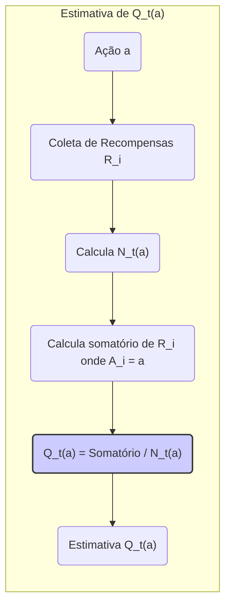
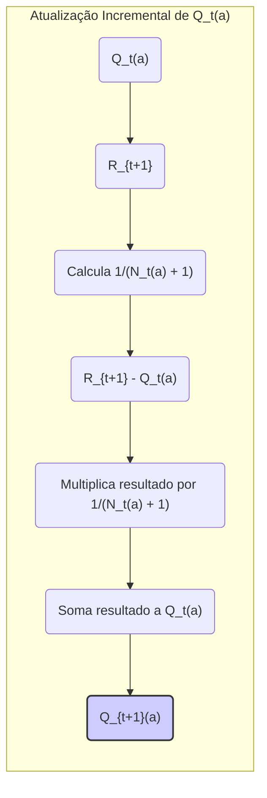

## Multi-armed Bandits: Analogias do Problema

### Introdução

O aprendizado por reforço (reinforcement learning) difere de outros tipos de aprendizado por utilizar informações de treinamento que avaliam as ações tomadas em vez de instruir quais ações corretas devem ser executadas [1](https://chatgpt.com/c/67829922-359c-8011-96dd-970c04ed772c#user-content-fn-1). Esse aspecto cria a necessidade de exploração ativa para encontrar um comportamento otimizado. O feedback avaliativo puro indica a qualidade da ação realizada, mas não se foi a melhor ou pior ação possível. O feedback instrutivo, por outro lado, indica qual ação correta tomar, independente da ação realizada. Este tipo de feedback é a base do aprendizado supervisionado, que inclui classificação de padrões, redes neurais artificiais e identificação de sistemas [1](https://chatgpt.com/c/67829922-359c-8011-96dd-970c04ed772c#user-content-fn-1).

O estudo do aprendizado por reforço é frequentemente simplificado para focar em um cenário onde não há necessidade de aprender a agir em múltiplas situações, chamado de *setting nonassociative* [1](https://chatgpt.com/c/67829922-359c-8011-96dd-970c04ed772c#user-content-fn-1). Um problema específico que explora o feedback avaliativo não associativo é o *k-armed bandit problem*, um problema que é usado para introduzir vários métodos básicos de aprendizado [1](https://chatgpt.com/c/67829922-359c-8011-96dd-970c04ed772c#user-content-fn-1).

**Proposição 1** O *k-armed bandit problem* pode ser visto como um caso especial de um problema de decisão sequencial, onde o estado do agente não muda com o tempo. Isso simplifica a análise, pois não há necessidade de modelar transições de estado, focando diretamente no balanceamento entre exploração e explotação.

### Conceitos Fundamentais

O *k-armed bandit problem* pode ser formulado como um cenário onde um agente é repetidamente confrontado com a escolha entre $k$ opções diferentes, ou ações [1](https://chatgpt.com/c/67829922-359c-8011-96dd-970c04ed772c#user-content-fn-1). Após cada escolha, o agente recebe uma recompensa numérica retirada de uma distribuição de probabilidade estacionária, que depende da ação selecionada. O objetivo do agente é maximizar a recompensa total esperada ao longo de um período de tempo, como por exemplo, 1000 seleções de ações [2](https://chatgpt.com/c/67829922-359c-8011-96dd-970c04ed772c#user-content-fn-2).

Essa formulação do problema é chamada de *k-armed bandit problem* devido à analogia com uma máquina caça-níqueis, exceto que, em vez de uma alavanca, possui $k$ alavancas [2](https://chatgpt.com/c/67829922-359c-8011-96dd-970c04ed772c#user-content-fn-2). Cada seleção de ação é como acionar uma das alavancas da máquina caça-níquel, e as recompensas são os pagamentos recebidos ao acertar o jackpot. O objetivo é maximizar os ganhos concentrando as ações nas melhores alavancas [2](https://chatgpt.com/c/67829922-359c-8011-96dd-970c04ed772c#user-content-fn-2). Outra analogia é a de um médico escolhendo entre tratamentos experimentais para uma série de pacientes gravemente enfermos. Cada ação representa a seleção de um tratamento, e cada recompensa é a sobrevivência ou bem-estar do paciente. Embora o termo "bandit problem" seja usado para generalizações do problema descrito, neste contexto, o foco é nessa versão simples [2](https://chatgpt.com/c/67829922-359c-8011-96dd-970c04ed772c#user-content-fn-2).

Em nosso *k-armed bandit problem*, cada ação $a$ possui uma recompensa esperada ou média, denotada por $q_*(a)$ [2](https://chatgpt.com/c/67829922-359c-8011-96dd-970c04ed772c#user-content-fn-2). Seja $A_t$ a ação selecionada no instante $t$, e $R_t$ a recompensa correspondente. A função $q_*(a)$ é definida como o valor esperado da recompensa dado que a ação $a$ é selecionada, ou seja:

$$ q_*(a) = \mathbb{E}[R_t | A_t=a]$$

Se os valores de cada ação fossem conhecidos, a solução do problema seria trivial: sempre selecionar a ação de maior valor. No entanto, é assumido que os valores das ações são desconhecidos, embora se possa ter estimativas [2](https://chatgpt.com/c/67829922-359c-8011-96dd-970c04ed772c#user-content-fn-2). A estimativa do valor da ação $a$ no instante $t$ é denotada por $Q_t(a)$. O objetivo é que $Q_t(a)$ seja o mais próximo possível de $q_*(a)$ [2](https://chatgpt.com/c/67829922-359c-8011-96dd-970c04ed772c#user-content-fn-2).

**Lema 1** Uma forma comum de estimar $Q_t(a)$ é através da média amostral das recompensas recebidas ao selecionar a ação $a$ até o instante $t$. Se $N_t(a)$ é o número de vezes que a ação $a$ foi selecionada até o instante $t$, então:

$$ Q_t(a) = \frac{\sum_{i=1}^{t} R_i \mathbb{I}(A_i = a)}{N_t(a)} $$
onde $\mathbb{I}(A_i = a)$ é a função indicadora que vale 1 se $A_i = a$ e 0 caso contrário. Essa estimativa é não-viesada e converge para $q_*(a)$ quando $N_t(a) \rightarrow \infty$.
*Proof strategy:* The proof follows directly from the definition of sample average and the law of large numbers.

> 💡 **Exemplo Numérico:** Vamos considerar um problema com $k=3$ ações. Suponha que em um instante $t=5$, as ações tenham sido selecionadas e as recompensas obtidas conforme a tabela:
>
> | Instante ($i$) | Ação ($A_i$) | Recompensa ($R_i$) |
> |---|---|---|
> | 1 | 1 | 0 |
> | 2 | 2 | 1 |
> | 3 | 1 | 2 |
> | 4 | 3 | 0 |
> | 5 | 2 | 0 |
>
> Para calcular $Q_5(1)$, $Q_5(2)$ e $Q_5(3)$, aplicamos a fórmula. Para $a=1$:
>
> $N_5(1) = 2$ (a ação 1 foi selecionada 2 vezes)
>
> $Q_5(1) = \frac{0 + 2}{2} = 1$
>
> Para $a=2$:
>
> $N_5(2) = 2$ (a ação 2 foi selecionada 2 vezes)
>
> $Q_5(2) = \frac{1 + 0}{2} = 0.5$
>
> Para $a=3$:
>
> $N_5(3) = 1$ (a ação 3 foi selecionada 1 vez)
>
> $Q_5(3) = \frac{0}{1} = 0$
>
> Portanto, as estimativas dos valores das ações no instante $t=5$ são $Q_5(1) = 1$, $Q_5(2) = 0.5$ e $Q_5(3) = 0$. Note que essas são apenas estimativas baseadas em poucas amostras e podem não refletir os valores verdadeiros $q_*(a)$.

O problema da exploração versus explotação surge naturalmente. Ações com as maiores estimativas de valor são chamadas de *greedy actions* [2](https://chatgpt.com/c/67829922-359c-8011-96dd-970c04ed772c#user-content-fn-2). Ao selecionar uma *greedy action*, estamos explorando o conhecimento atual do valor das ações. Em contrapartida, selecionar uma ação não-greedy implica em *exploração*, pois permite melhorar as estimativas dos valores das ações menos exploradas [2](https://chatgpt.com/c/67829922-359c-8011-96dd-970c04ed772c#user-content-fn-2). A exploração visa maximizar a recompensa esperada a curto prazo, enquanto a exploração pode gerar recompensas maiores a longo prazo [2](https://chatgpt.com/c/67829922-359c-8011-96dd-970c04ed772c#user-content-fn-2). O balanceamento entre exploração e explotação é essencial no *k-armed bandit problem* [2](https://chatgpt.com/c/67829922-359c-8011-96dd-970c04ed772c#user-content-fn-2).

**Lema 1.1**  Uma atualização incremental da estimativa $Q_t(a)$ pode ser expressa da seguinte forma:

$$Q_{t+1}(a) = Q_t(a) + \frac{1}{N_t(a)+1}(R_{t+1} - Q_t(a)) $$
Essa formulação é computacionalmente mais eficiente que a abordagem de média amostral para grandes quantidades de dados, dado que dispensa a necessidade de manter o histórico de todas as recompensas.
*Proof strategy*: This is derived directly from the sample average update by expressing the running average at step $t+1$ in terms of the average at step $t$ and the new observation.

> 💡 **Exemplo Numérico:** Continuando o exemplo anterior, suponha que no instante $t=6$ a ação $A_6=1$ foi selecionada e a recompensa $R_6 = 3$ foi obtida. Vamos usar a atualização incremental para calcular $Q_6(1)$. Sabíamos que $Q_5(1)=1$ e $N_5(1)=2$. Então:
>
> $Q_6(1) = Q_5(1) + \frac{1}{N_5(1)+1}(R_6 - Q_5(1))$
>
> $Q_6(1) = 1 + \frac{1}{2+1}(3 - 1)$
>
> $Q_6(1) = 1 + \frac{1}{3}(2)$
>
> $Q_6(1) = 1 + \frac{2}{3} = \frac{5}{3} \approx 1.67$
>
> Observe como a estimativa de $Q(1)$ foi atualizada sem a necessidade de recalcular toda a média amostral. Isso é especialmente útil quando lidamos com grandes quantidades de dados, pois economiza memória e poder computacional. A nova estimativa, $Q_6(1) \approx 1.67$, reflete a recompensa mais recente obtida com a ação 1.

### Conclusão
O *k-armed bandit problem*, com suas analogias às máquinas caça-níqueis e tratamentos médicos experimentais, serve como um modelo fundamental para entender o trade-off entre exploração e explotação no aprendizado por reforço. A formulação do problema destaca a necessidade de um equilíbrio entre a busca por ações conhecidas com altas recompensas e a exploração de ações menos conhecidas que podem potencialmente levar a recompensas ainda maiores. O desenvolvimento de métodos eficazes para lidar com esse balanceamento é essencial para o sucesso de algoritmos de aprendizado por reforço mais complexos.

### Referências
[^1]: "The most important feature distinguishing reinforcement learning from other types of
learning is that it uses training information that evaluates the actions taken rather
than instructs by giving correct actions." *(Trecho de Multi-armed Bandits)*
[^2]: "This is the original form of the k-armed bandit problem, so named by analogy to a slot
machine, or “one-armed bandit,” except that it has k levers instead of one. Each action
selection is like a play of one of the slot machine’s levers, and the rewards are the payoffs
for hitting the jackpot. Through repeated action selections you are to maximize your
winnings by concentrating your actions on the best levers." *(Trecho de Multi-armed Bandits)*
