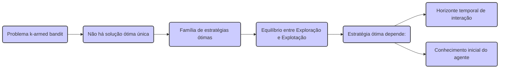

### Maximizar a Recompensa Total Esperada em Problemas k-armed Bandit

### Introdução
O problema do **k-armed bandit** surge no contexto do aprendizado por reforço como um cenário simplificado para explorar o *trade-off* entre exploração e explotação [1]. Diferentemente do aprendizado supervisionado, que se baseia em *feedback* instrutivo, o aprendizado por reforço utiliza *feedback* avaliativo, indicando a qualidade de uma ação tomada, mas não necessariamente qual seria a ação ótima [1]. Nesse cenário, um agente precisa tomar decisões sequenciais em um ambiente onde as ações geram recompensas numéricas, mas com uma dinâmica probabilística e desconhecida. O objetivo central é maximizar a recompensa total esperada ao longo do tempo, um desafio que impõe a necessidade de equilibrar a busca por novas opções e o aproveitamento das opções já conhecidas [1]. O problema do k-armed bandit é uma simplificação do problema de *reinforcement learning* completo, no qual não há múltiplos estados e o objetivo é escolher a ação que leva a melhor recompensa, sendo assim o foco deste capítulo [1].

**Proposição 1** A natureza sequencial das decisões no problema k-armed bandit implica que a escolha de uma ação no instante $t$ afeta não somente a recompensa $R_t$, mas também o conhecimento do agente sobre o ambiente, influenciando as escolhas em instantes futuros.
*Proof:* A escolha de ações influencia diretamente as estimativas $Q_t(a)$. A exploração melhora o conhecimento do agente, ao custo de menor recompensa imediata, enquanto a exploração busca recompensas imediatas baseadas em conhecimento prévio, então a decisão $A_t$ influencia o conhecimento e consequentemente as decisões $A_{t+1}$, $A_{t+2}$ e assim por diante.

```mermaid
graph LR
    A[Instante "t"] -->|Ação "A_t"| B("Recompensa \"R_t\"")
    A -->|Influencia| C("Estimativa \"Q_t(a)\"")
    C --> D("Escolha de \"A_{t+1}\"")
    D --> E("Recompensa \"R_{t+1}\"")
    E --> F("Estimativa \"Q_{t+1}(a)\"")
     F--> G("Escolha de \"A_{t+2}\"")
    style A fill:#f9f,stroke:#333,stroke-width:2px
    style B fill:#ccf,stroke:#333,stroke-width:2px
    style C fill:#ccf,stroke:#333,stroke-width:2px
    style D fill:#ccf,stroke:#333,stroke-width:2px
    style E fill:#ccf,stroke:#333,stroke-width:2px
    style F fill:#ccf,stroke:#333,stroke-width:2px
    style G fill:#ccf,stroke:#333,stroke-width:2px
```

> 💡 **Exemplo Numérico:** Imagine que temos 3 ações (k=3), onde a ação 1 tem uma recompensa média de 1, ação 2 tem uma recompensa média de 2, e ação 3 tem uma recompensa média de 3, mas desconhecemos esses valores. Inicialmente, $Q_t(a)$ para todas as ações é zero. Se no instante $t=1$, escolhermos a ação 1, e recebermos uma recompensa $R_1=0$, então $Q_2(1)$ se atualiza, digamos para $0.1$ (dependendo da regra de atualização que usarmos). Se escolhermos novamente a ação 1 em $t=2$ e obtivermos $R_2=1$, $Q_3(1)$ se atualizará novamente. As escolhas subsequentes e suas recompensas afetam diretamente as estimativas de valor e, portanto, as próximas decisões. Se, em vez disso, escolhermos explorar a ação 3 no início, podemos obter uma recompensa maior, o que influenciará as estimativas e decisões futuras.

### Conceitos Fundamentais
O **k-armed bandit problem** envolve um cenário onde um agente deve escolher repetidamente entre $k$ diferentes opções ou ações [1]. Cada ação, quando selecionada, resulta em uma recompensa numérica que é sorteada de uma distribuição de probabilidade estacionária dependente da ação escolhida [1]. O objetivo é maximizar a recompensa total esperada ao longo de um período de tempo, seja um número finito de seleções ou tempo de interação [2]. A analogia com uma máquina caça-níqueis, onde cada ação é o acionamento de uma alavanca diferente, dá nome ao problema: cada alavanca tem um valor esperado diferente de recompensa, e o objetivo é maximizar os ganhos concentrando as ações nas melhores alavancas [2]. Formalmente, se $A_t$ representa a ação selecionada no instante $t$ e $R_t$ a recompensa correspondente, o valor verdadeiro da ação $a$, denotado por $q_*(a)$, é definido como o valor esperado da recompensa condicionada à escolha de $a$:

$$q_*(a) = \mathbb{E}[R_t | A_t = a].$$

A solução trivial, que é sempre escolher a ação com maior valor, é inviável, pois desconhecemos esses valores no início do processo [2]. Por isso, precisamos manter estimativas dos valores das ações, denotadas por $Q_t(a)$, que devem se aproximar dos valores reais $q_*(a)$ [2]. A escolha de ações pode ser categorizada em duas abordagens: **exploração** e **explotação**. A explotação consiste em selecionar a ação com maior valor estimado no momento, denominada ação *greedy* [2]. A exploração, por outro lado, envolve a escolha de ações não *greedy*, com o objetivo de refinar as estimativas dos valores das ações menos exploradas [2].

```mermaid
graph LR
subgraph "Definições"
    A("Ação \"a\"") -->|Recompensa| B("Recompensa \"R_t\"")
    B --> C("Valor Verdadeiro \"q_*(a)\" = E[R_t | A_t = a]")
    C --> D("Valor Estimado \"Q_t(a)\"")
end
subgraph "Escolha de Ação"
    D --> E("Exploração (Ação não-greedy)")
    D --> F("Explotação (Ação greedy)")
end
    style A fill:#ccf,stroke:#333,stroke-width:2px
    style B fill:#ccf,stroke:#333,stroke-width:2px
    style C fill:#ccf,stroke:#333,stroke-width:2px
    style D fill:#ccf,stroke:#333,stroke-width:2px
    style E fill:#ccf,stroke:#333,stroke-width:2px
    style F fill:#ccf,stroke:#333,stroke-width:2px
```

> 💡 **Exemplo Numérico:** Suponha que temos 4 ações (k=4) e após algumas iterações, as estimativas de valor atuais são: $Q_t(1) = 1.2$, $Q_t(2) = 2.5$, $Q_t(3) = 1.8$, e $Q_t(4) = 0.9$. A ação *greedy* (explotação) seria a ação 2, pois tem o maior valor estimado. A exploração significaria escolher uma das outras ações (1, 3 ou 4) para tentar obter mais informações sobre o seu valor real.

**Lema 1** Se a ação $a$ é explorada repetidamente, a estimativa de seu valor, $Q_t(a)$, converge para o valor real, $q_*(a)$, sob certas condições.
*Proof:* A estimativa $Q_t(a)$ geralmente é atualizada com base em alguma média das recompensas observadas. Sob condições como estacionariedade das distribuições de recompensa e um esquema de atualização que dê um peso decrescente a recompensas antigas, essa média converge para o valor esperado.

```mermaid
graph LR
    A("Ação \"a\" explorada repetidamente") --> B("Atualização de \"Q_t(a)\" via média das recompensas")
     B --> C("Condições: Estacionaridade, peso decrescente")
    C --> D("Convergência: \"Q_t(a)\" -> \"q_*(a)\"")
        style A fill:#ccf,stroke:#333,stroke-width:2px
    style B fill:#ccf,stroke:#333,stroke-width:2px
    style C fill:#ccf,stroke:#333,stroke-width:2px
    style D fill:#ccf,stroke:#333,stroke-width:2px
```

> 💡 **Exemplo Numérico:** Vamos supor que a ação 1 tenha um valor real $q_*(1) = 2$, mas inicialmente, temos $Q_1(1) = 0$. Se usarmos uma média móvel para atualizar $Q_t(1)$, e se explorarmos a ação 1 nas iterações 1, 2, 3, 4 e 5 com recompensas 1, 3, 2, 2, e 2 respectivamente.
>
> *   $Q_2(1) = (0 + 1)/2 = 0.5$
> *   $Q_3(1) = (0.5 + 3)/2 = 1.75$
> *   $Q_4(1) = (1.75 + 2)/2 = 1.875$
> *   $Q_5(1) = (1.875 + 2)/2 = 1.9375$
> *   $Q_6(1) = (1.9375 + 2)/2 = 1.96875$
>
> Como podemos observar, a estimativa $Q_t(1)$ está a convergir para o valor real 2, a medida que a ação é explorada mais vezes.

**Lema 1.1** Se, para todo $a$, a ação $a$ é selecionada um número infinito de vezes, e a média usada para estimar $Q_t(a)$ considera todas as recompensas anteriores, então $Q_t(a)$ converge para $q_*(a)$ quando $t$ tende ao infinito.
*Proof:* Este resultado é uma consequência direta da lei forte dos grandes números, sob a hipótese de que as recompensas são i.i.d. para cada ação $a$.

> 💡 **Exemplo Numérico:**  Se tivermos 2 ações com valores verdadeiros  $q_*(1) = 1$ e $q_*(2) = 2$. Se as explorarmos infinitamente, e usarmos uma média simples para estimar $Q_t(a)$, então  $Q_t(1)$  converge para 1 e $Q_t(2)$ converge para 2 quando $t$ tende a infinito. A lei dos grandes números garante que a média amostral das recompensas se aproximará do valor esperado (valor verdadeiro da ação) à medida que o número de amostras tende ao infinito.

**Corolário 1.1** A exploração continua é necessária, ou com uma chance não nula, para garantir que as estimativas de valor convirjam para os valores verdadeiros de cada ação.
*Proof:* Se nenhuma ação for explorada infinitamente, o *Lema 1.1* implica que sua estimativa de valor pode não convergir para seu valor verdadeiro.

```mermaid
graph LR
    A("Exploração contínua de todas as ações") -->|Implica|B("Estimativas \"Q_t(a)\" convergem para os valores verdadeiros \"q_*(a)\"")
    B-->C("Garantia: \"Lema 1.1\"")
    style A fill:#ccf,stroke:#333,stroke-width:2px
    style B fill:#ccf,stroke:#333,stroke-width:2px
    style C fill:#ccf,stroke:#333,stroke-width:2px
```

> 💡 **Exemplo Numérico:** Imagine que paramos de explorar a ação 2 e apenas exploramos a ação 1, depois de algumas interações. Como consequência a estimativa de valor da ação 2, não convergirá para o seu valor real. Se, por outro lado, existe uma probabilidade não nula de escolher a ação 2 em qualquer instante, mesmo quando o valor estimado da ação 1 é maior, garantimos que $Q_t(2)$ continue a se aproximar de $q_*(2)$.

O *trade-off* entre exploração e explotação é fundamental: a explotação maximiza a recompensa imediata, enquanto a exploração pode levar a recompensas maiores a longo prazo [2]. A decisão de explorar ou explotar depende do grau de certeza das estimativas, da incerteza sobre o valor de outras ações e do horizonte temporal de interação. O desafio é equilibrar essas abordagens para obter o máximo de recompensa acumulada [2].

> 💡 **Exemplo Numérico:** Suponha que após algumas iterações temos as seguintes estimativas:  $Q_t(1)=0.8$ e $Q_t(2)=1.2$. Uma estratégia puramente exploratória pode escolher uma ação aleatoriamente, com igual probabilidade. Uma estratégia puramente exploratória escolhe sempre a ação 2, com o intuito de maximizar a recompensa imediata. Um estratégia mista, como a $\epsilon$-greedy, com $\epsilon=0.1$, escolheria ação 2 com 90% de probabilidade e a ação 1 com 10%. Isso permite que o agente explore novas ações, mesmo quando já possui uma ação com um valor estimado relativamente alto, para não ficar preso a um ótimo local.
>
> No começo do processo de aprendizagem, é vantajoso ter um valor mais alto de $\epsilon$, já que o agente tem pouco conhecimento sobre o ambiente. Ao longo do tempo o valor de $\epsilon$ vai diminuindo, dando mais prioridade a exploração.

**Teorema 1** O problema do k-armed bandit não possui uma solução única ótima, mas sim uma família de estratégias ótimas dependente do equilíbrio entre exploração e explotação, e que esta estratégia ótima depende do horizonte temporal de interção e do conhecimento inicial do agente.
*Proof:* Dado que diferentes níveis de exploração são necessários dependendo do horizonte de interação do agente, e da incerteza sobre os valores $q_*(a)$, não há uma estratégia única que maximize o retorno total para todos os cenários. As estratégias ótimas são aquelas que conseguem equilibrar a exploração no inicio do aprendizado, para um melhor conhecimento das acções, com uma exploração mais forte a medida que o agente se aproxima do fim do horizonte temporal.



> 💡 **Exemplo Numérico:**  Um agente que interage com o ambiente por apenas 10 passos e que sabe pouco sobre o ambiente, deve focar em exploração no inicio. Já um agente que interage com o ambiente por 1000 passos e que sabe pouco sobre o ambiente, pode focar em exploração no inicio mas, a medida que o tempo passa, deve focar em explotação. Por outro lado, se o agente já tiver um conhecimento prévio das recompensas médias das ações, pode focar mais em exploração, desde o início. Estas considerações mostram que não há uma estratégia ótima para todos os cenários, mas que a estrategia ideal depende do horizonte de interação e do conhecimento prévio sobre as ações.

### Conclusão
O problema do **k-armed bandit** fornece um modelo simples, mas essencial, para estudar a dinâmica do aprendizado por reforço [1]. Ao concentrar-se na maximização da recompensa total esperada, o problema nos força a lidar com a complexa relação entre exploração e explotação [2]. As ações selecionadas, seja por explotação ou exploração, impactam diretamente a qualidade da estimativa dos valores das ações. Compreender a formulação do k-armed bandit, incluindo as definições do valor verdadeiro de uma ação, a necessidade de estimar valores das ações e a importância do *trade-off* entre exploração e explotação é crucial para o desenvolvimento de algoritmos eficazes que serão apresentados ao longo deste capítulo [1].

### Referências
[^1]: "The most important feature distinguishing reinforcement learning from other types of learning is that it uses training information that evaluates the actions taken rather than instructs by giving correct actions. This is what creates the need for active exploration, for an explicit search for good behavior. Purely evaluative feedback indicates how good the action taken was, but not whether it was the best or the worst action possible. Purely instructive feedback, on the other hand, indicates the correct action to take, independently of the action taken. This kind of feedback is the basis of supervised learning, which includes large parts of pattern classification, artificial neural networks, and system identification. In their pure forms, these two kinds of feedback are quite distinct: evaluative feedback depends entirely on the action taken, whereas instructive feedback is independent of the action taken." *(Trecho de Chapter 2: Multi-armed Bandits)*
[^2]: "In our k-armed bandit problem, each of the k actions has an expected or mean reward given that that action is selected; let us call this the value of that action. We denote the action selected on time step t as At, and the corresponding reward as Rt. The value then of an arbitrary action a, denoted q∗(a), is the expected reward given that a is selected:
q∗(a) = E[Rt | At=a]. If you knew the value of each action, then it would be trivial to solve the k-armed bandit problem: you would always select the action with highest value. We assume that you do not know the action values with certainty, although you may have estimates. We denote the estimated value of action a at time step t as Qt(a). We would like Qt(a) to be close to q∗(a). If you maintain estimates of the action values, then at any time step there is at least one action whose estimated value is greatest. We call these the greedy actions. When you select one of these actions, we say that you are exploiting your current knowledge of the values of the actions. If instead you select one of the nongreedy actions, then we say you are exploring, because this enables you to improve your estimate of the nongreedy action's value. Exploitation is the right thing to do to maximize the expected reward on the one step, but exploration may produce the greater total reward in the long run. For example, suppose a greedy action’s value is known with certainty, while several other actions are estimated to be nearly as good but with substantial uncertainty. The uncertainty is such that at least one of these other actions probably is actually better than the greedy action, but you don't know which one. If you have many time steps ahead on which to make action selections, then it may be better to explore the nongreedy actions and discover which of them are better than the greedy action. Reward is lower in the short run, during exploration, but higher in the long run because after you have discovered the better actions, you can exploit them many times. Because it is not possible both to explore and to exploit with any single action selection, one often refers to the “conflict” between exploration and exploitation." *(Trecho de Chapter 2: Multi-armed Bandits)*
