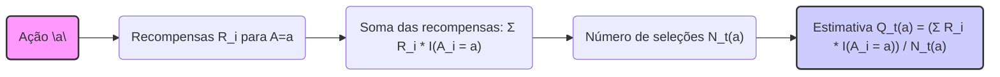
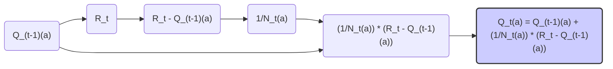

## Multi-armed Bandits: O Problema k-armed Bandit

### Introdução
O aprendizado por reforço (reinforcement learning) se distingue de outras formas de aprendizado pelo uso de informações de treinamento que *avaliam* as ações tomadas, em vez de *instruir* com ações corretas [1](https://chatgpt.com/c/67829922-359c-8011-96dd-970c04ed772c#user-content-fn-1). Essa característica particular cria a necessidade de exploração ativa, uma busca explícita por um bom comportamento [1](https://chatgpt.com/c/67829922-359c-8011-96dd-970c04ed772c#user-content-fn-1). O feedback avaliativo indica o quão boa foi a ação tomada, mas não se foi a melhor ou a pior ação possível. Em contraste, o feedback instrutivo indica a ação correta a ser tomada, independentemente da ação que foi realmente realizada [1](https://chatgpt.com/c/67829922-359c-8011-96dd-970c04ed772c#user-content-fn-1). Este último é a base do aprendizado supervisionado [1](https://chatgpt.com/c/67829922-359c-8011-96dd-970c04ed772c#user-content-fn-1). Este capítulo foca no aspecto avaliativo do aprendizado por reforço em um ambiente simplificado, o qual não envolve o aprendizado para agir em múltiplas situações, conhecido como cenário *não associativo* [1](https://chatgpt.com/c/67829922-359c-8011-96dd-970c04ed772c#user-content-fn-1). O problema *k-armed bandit* é um caso específico desse cenário não associativo com feedback avaliativo, servindo como ponto de partida para introduzir métodos básicos de aprendizado que serão expandidos em capítulos posteriores [1](https://chatgpt.com/c/67829922-359c-8011-96dd-970c04ed772c#user-content-fn-1).

### Conceitos Fundamentais

O problema *k-armed bandit* consiste em tomar decisões repetidas entre *k* opções distintas, denominadas ações [1](https://chatgpt.com/c/67829922-359c-8011-96dd-970c04ed772c#user-content-fn-1). Após cada escolha, um agente recebe uma recompensa numérica, retirada de uma distribuição de probabilidade estacionária que depende da ação selecionada [1](https://chatgpt.com/c/67829922-359c-8011-96dd-970c04ed772c#user-content-fn-1). O objetivo é maximizar a recompensa total esperada ao longo de um período de tempo, como, por exemplo, em 1000 seleções de ações ou passos de tempo [2](https://chatgpt.com/c/67829922-359c-8011-96dd-970c04ed772c#user-content-fn-2). A analogia é com uma máquina caça-níqueis, ou "one-armed bandit", mas com *k* alavancas em vez de uma. Cada ação é como jogar uma alavanca, e as recompensas são os pagamentos por acertar o jackpot [2](https://chatgpt.com/c/67829922-359c-8011-96dd-970c04ed772c#user-content-fn-2). Outra analogia é um médico escolhendo entre tratamentos experimentais para pacientes gravemente doentes, onde cada ação é a seleção de um tratamento e cada recompensa é a sobrevivência ou bem-estar do paciente [2](https://chatgpt.com/c/67829922-359c-8011-96dd-970c04ed772c#user-content-fn-2).

Em um problema *k-armed bandit*, cada ação *a* possui um valor esperado ou recompensa média, denotado por $q_*(a)$ [2](https://chatgpt.com/c/67829922-359c-8011-96dd-970c04ed772c#user-content-fn-2). Se denotamos a ação selecionada no instante *t* por $A_t$ e a recompensa correspondente por $R_t$, então o valor $q_*(a)$ é definido como:

$$q_*(a) = E[R_t | A_t = a]$$

Se o valor de cada ação fosse conhecido, a solução seria trivial: sempre selecionar a ação com o maior valor [2](https://chatgpt.com/c/67829922-359c-8011-96dd-970c04ed772c#user-content-fn-2). No entanto, assume-se que esses valores são desconhecidos, e o agente deve estimá-los [2](https://chatgpt.com/c/67829922-359c-8011-96dd-970c04ed772c#user-content-fn-2). A estimativa do valor da ação *a* no instante *t* é denotada por $Q_t(a)$ [2](https://chatgpt.com/c/67829922-359c-8011-96dd-970c04ed772c#user-content-fn-2). O objetivo é que $Q_t(a)$ se aproxime de $q_*(a)$.

**Proposição 1**
Uma forma comum de estimar o valor de uma ação *a* é calculando a média amostral das recompensas obtidas ao longo do tempo em que a ação *a* foi selecionada. Denotando o número de vezes que a ação *a* foi selecionada até o instante *t* por $N_t(a)$, a estimativa $Q_t(a)$ pode ser expressa como:



$$Q_t(a) = \frac{\sum_{i=1}^{t} R_i \cdot \mathbb{I}(A_i = a)}{N_t(a)}$$

onde $\mathbb{I}(A_i = a)$ é uma função indicadora que retorna 1 se a ação selecionada no instante *i* for igual a *a*, e 0 caso contrário. Quando $N_t(a)$ = 0, convenciona-se que $Q_t(a)$ = 0 (ou algum valor inicial). Esta estimativa é um estimador não viesado da recompensa esperada $q_*(a)$ para cada ação.

> 💡 **Exemplo Numérico:**
>
> Vamos supor que temos um problema *k-armed bandit* com 3 ações (k=3). Após algumas iterações, as seguintes recompensas foram obtidas para a ação *a=2*:
>
> - Passo 10: $A_{10}$ = 2, $R_{10}$ = 1
> - Passo 25: $A_{25}$ = 2, $R_{25}$ = 2
> - Passo 38: $A_{38}$ = 2, $R_{38}$ = 0
> - Passo 50: $A_{50}$ = 2, $R_{50}$ = 3
>
> E nenhuma outra ação foi tomada, ou seja, $N_{50}(2) = 4$. Para calcular $Q_{50}(2)$, usamos a fórmula da Proposição 1:
>
> $$Q_{50}(2) = \frac{1 + 2 + 0 + 3}{4} = \frac{6}{4} = 1.5$$
>
> Portanto, a estimativa do valor da ação 2 neste momento (passo 50) é 1.5.
>
> Agora, vamos calcular $Q_t(a)$ para a ação *a=1*  onde:
>
> - Passo 5: $A_{5}$ = 1, $R_{5}$ = 0
> - Passo 15: $A_{15}$ = 1, $R_{15}$ = -1
>
> Temos $N_{15}(1) = 2$ e:
>
> $$Q_{15}(1) = \frac{0 + (-1)}{2} = -0.5$$
>
> Assim, a estimativa da ação 1 no instante 15 é -0.5.

As ações com as maiores estimativas de valor são denominadas **ações gananciosas (greedy)** [2](https://chatgpt.com/c/67829922-359c-8011-96dd-970c04ed772c#user-content-fn-2). Selecionar uma dessas ações é dito como **exploração**, o uso do conhecimento atual do valor das ações [2](https://chatgpt.com/c/67829922-359c-8011-96dd-970c04ed772c#user-content-fn-2). Alternativamente, selecionar uma ação não-gananciosa é denominado **exploração**, uma maneira de refinar as estimativas de valor das ações não-gananciosas [2](https://chatgpt.com/c/67829922-359c-8011-96dd-970c04ed772c#user-content-fn-2). Enquanto a exploração maximiza a recompensa no passo atual, a exploração pode gerar uma recompensa maior a longo prazo [2](https://chatgpt.com/c/67829922-359c-8011-96dd-970c04ed772c#user-content-fn-2). Por exemplo, uma ação gananciosa pode ser conhecida com certeza, enquanto outras ações são estimadas como quase tão boas, mas com incertezas significativas, sendo que uma dessas ações pode ser melhor que a ação gananciosa, mas não se sabe qual [2](https://chatgpt.com/c/67829922-359c-8011-96dd-970c04ed772c#user-content-fn-2). Esse é o **trade-off** entre exploração e exploração [2](https://chatgpt.com/c/67829922-359c-8011-96dd-970c04ed772c#user-content-fn-2). A decisão entre explorar e explorar depende dos valores estimados, incertezas e número de passos restantes [2](https://chatgpt.com/c/67829922-359c-8011-96dd-970c04ed772c#user-content-fn-2).

**Lema 1**
A atualização incremental da média amostral de uma ação *a*, denotada como $Q_t(a)$, pode ser calculada de forma eficiente usando a média amostral anterior $Q_{t-1}(a)$ e a nova recompensa $R_t$. Se denotarmos o número de vezes que a ação *a* foi selecionada até o instante *t-1* como $N_{t-1}(a)$, então:



$$Q_t(a) = Q_{t-1}(a) + \frac{1}{N_t(a)} [R_t - Q_{t-1}(a)]$$

*Demonstração*:
Partindo da definição da Proposição 1, temos:

$$Q_t(a) = \frac{1}{N_t(a)} \sum_{i=1}^{t} R_i \cdot \mathbb{I}(A_i=a) =  \frac{1}{N_t(a)} \left( \sum_{i=1}^{t-1} R_i \cdot \mathbb{I}(A_i=a) + R_t \cdot \mathbb{I}(A_t=a) \right)$$

Se $A_t = a$, então $N_t(a) = N_{t-1}(a) + 1$ e temos:

$$Q_t(a) = \frac{N_{t-1}(a)}{N_t(a)} \left( \frac{1}{N_{t-1}(a)}  \sum_{i=1}^{t-1} R_i \cdot \mathbb{I}(A_i=a) \right) + \frac{R_t}{N_t(a)}$$
$$Q_t(a) = \frac{N_{t-1}(a)}{N_t(a)} Q_{t-1}(a) + \frac{R_t}{N_t(a)}$$
$$Q_t(a) = \frac{N_{t}(a) -1 }{N_t(a)} Q_{t-1}(a) + \frac{R_t}{N_t(a)}$$
$$Q_t(a) = Q_{t-1}(a) - \frac{1}{N_t(a)} Q_{t-1}(a) + \frac{R_t}{N_t(a)}$$
$$Q_t(a) = Q_{t-1}(a) + \frac{1}{N_t(a)} [R_t - Q_{t-1}(a)]$$

Se $A_t \neq a$, então $N_t(a) = N_{t-1}(a)$, e temos $Q_t(a) = Q_{t-1}(a)$.

Esta atualização incremental é útil para reduzir a complexidade computacional no cálculo da estimativa da ação, pois não exige o armazenamento de todas as recompensas.

> 💡 **Exemplo Numérico:**
>
> Retomando o exemplo anterior, com as recompensas para a ação *a=2*:
>
> - Passo 10: $A_{10}$ = 2, $R_{10}$ = 1
> - Passo 25: $A_{25}$ = 2, $R_{25}$ = 2
> - Passo 38: $A_{38}$ = 2, $R_{38}$ = 0
> - Passo 50: $A_{50}$ = 2, $R_{50}$ = 3
>
> Vimos que  $Q_{50}(2) = 1.5$. Vamos calcular $Q_t(2)$ incrementalmente.
>
> Inicialmente, $Q_{0}(2) = 0$ e $N_{0}(2) = 0$. Após o passo 10:
>
> $N_{10}(2) = 1$
>
> $$Q_{10}(2) = 0 + \frac{1}{1}(1 - 0) = 1$$
>
> Após o passo 25:
>
> $N_{25}(2) = 2$
>
> $$Q_{25}(2) = 1 + \frac{1}{2}(2 - 1) = 1 + \frac{1}{2} = 1.5$$
>
> Após o passo 38:
>
> $N_{38}(2) = 3$
>
> $$Q_{38}(2) = 1.5 + \frac{1}{3}(0 - 1.5) = 1.5 - 0.5 = 1$$
>
> Após o passo 50:
>
> $N_{50}(2) = 4$
>
> $$Q_{50}(2) = 1 + \frac{1}{4}(3 - 1) = 1 + 0.5 = 1.5$$
>
> Obtemos o mesmo valor final para $Q_{50}(2)$, mas sem precisar armazenar todas as recompensas. Observe como o valor de $Q_t(2)$ é atualizado a cada passo em que a ação 2 é selecionada.

**Teorema 1** (Garantia de Convergência da Média Amostral)
Sob a condição de que o número de vezes que uma ação *a* é selecionada tende ao infinito ($N_t(a)$ -> ∞), e de que as recompensas são limitadas, a média amostral $Q_t(a)$ converge para o valor esperado real $q_*(a)$ da ação *a*. Formalmente,

$$\lim_{N_t(a) \to \infty} Q_t(a) = q_*(a)$$

*Demonstração*:
Este resultado é uma consequência direta da Lei dos Grandes Números. Como as recompensas $R_t$ são variáveis aleatórias independentes e identicamente distribuídas (i.i.d.) condicionadas à escolha da ação *a*, a média amostral das recompensas $Q_t(a)$ converge para a média esperada da recompensa $q_*(a)$ quando $N_t(a)$ tende ao infinito. A condição das recompensas serem limitadas assegura que a variância das recompensas é finita, uma condição necessária para a Lei dos Grandes Números ser aplicável.

```mermaid
graph LR
    A("Ação \"a\"") -->| "N_t(a) -> ∞"| B("Recompensas R_i (i.i.d.)");
    B --> C("Média Amostral Q_t(a)");
    C --> D("Valor Esperado q*(a)");
    style A fill:#f9f,stroke:#333,stroke-width:2px
    style D fill:#ccf,stroke:#333,stroke-width:2px
     linkStyle 0,1,2 stroke:#333,stroke-width:2px
    D -- "Converge" --> C
```

Este teorema garante que, se cada ação for selecionada um número suficiente de vezes, o agente aprenderá seus respectivos valores esperados, o que é crucial para o desenvolvimento de estratégias de exploração/explotação.

### Conclusão
O problema do *k-armed bandit* é uma formulação fundamental que captura o essencial do dilema entre exploração e explotação no aprendizado por reforço. Ao apresentar um cenário simplificado, ele nos permite isolar esse trade-off e estudar vários métodos de solução antes de lidarmos com a complexidade do problema de aprendizado por reforço em sua totalidade. Este capítulo serviu como introdução ao problema do *k-armed bandit*, estabelecendo a base para discussões mais aprofundadas de métodos e técnicas a serem explorados nos capítulos seguintes.

### Referências

[^1]: "The most important feature distinguishing reinforcement learning from other types of learning is that it uses training information that evaluates the actions taken rather than instructs by giving correct actions. This is what creates the need for active exploration, for an explicit search for good behavior. Purely evaluative feedback indicates how good the action taken was, but not whether it was the best or the worst action possible. Purely instructive feedback, on the other hand, indicates the correct action to take, independently of the action actually taken. This kind of feedback is the basis of supervised learning, which includes large parts of pattern classification, artificial neural networks, and system identification. In their pure forms, these two kinds of feedback are quite distinct: evaluative feedback depends entirely on the action taken, whereas instructive feedback is independent of the action taken. In this chapter we study the evaluative aspect of reinforcement learning in a simplified setting, one that does not involve learning to act in more than one situation. This nonassociative setting is the one in which most prior work involving evaluative feedback has been done, and it avoids much of the complexity of the full reinforcement learning problem. Studying this case enables us to see most clearly how evaluative feedback differs from, and yet can be combined with, instructive feedback. The particular nonassociative, evaluative feedback problem that we explore is a simple version of the k-armed bandit problem. We use this problem to introduce a number of basic learning methods which we extend in later chapters to apply to the full reinforcement learning problem. At the end of this chapter, we take a step closer to the full reinforcement learning problem by discussing what happens when the bandit problem becomes associative, that is, when the best action depends on the situation." *(Trecho de Multi-armed Bandits)*
[^2]: "Consider the following learning problem. You are faced repeatedly with a choice among k different options, or actions. After each choice you receive a numerical reward chosen from a stationary probability distribution that depends on the action you selected. Your objective is to maximize the expected total reward over some time period, for example, over 1000 action selections, or time steps. This is the original form of the k-armed bandit problem, so named by analogy to a slot machine, or “one-armed bandit,” except that it has k levers instead of one. Each action selection is like a play of one of the slot machine's levers, and the rewards are the payoffs for hitting the jackpot. Through repeated action selections you are to maximize your winnings by concentrating your actions on the best levers. Another analogy is that of a doctor choosing between experimental treatments for a series of seriously ill patients. Each action is the selection of a treatment, and each reward is the survival or well-being of the patient. Today the term “bandit problem" is sometimes used for a generalization of the problem described above, but in this book we use it to refer just to this simple case. In our k-armed bandit problem, each of the k actions has an expected or mean reward given that that action is selected; let us call this the value of that action. We denote the action selected on time step t as At, and the corresponding reward as Rt. The value then of an arbitrary action a, denoted q∗(a), is the expected reward given that a is selected:  q*(a) = E[Rt | At=a]. If you knew the value of each action, then it would be trivial to solve the k-armed bandit problem: you would always select the action with highest value. We assume that you do not know the action values with certainty, although you may have estimates. We denote the estimated value of action a at time stept as Qt(a). We would like Qt(a) to be close to q*(a). If you maintain estimates of the action values, then at any time step there is at least one action whose estimated value is greatest. We call these the greedy actions. When you select one of these actions, we say that you are exploiting your current knowledge of the values of the actions. If instead you select one of the nongreedy actions, then we say you are exploring, because this enables you to improve your estimate of the nongreedy action's value. Exploitation is the right thing to do to maximize the expected reward on the one step, but exploration may produce the greater total reward in the long run. For example, suppose a greedy action's value is known with certainty, while several other actions are estimated to be nearly as good but with substantial uncertainty. The uncertainty is such that at least one of these other actions probably is actually better than the greedy action, but you don't know which one. If you have many time steps ahead on which to make action selections, then it may be better to explore the nongreedy actions and discover which of them are better than the greedy action. Reward is lower in the short run, during exploration, but higher in the long run because after you have discovered the better actions, you can exploit them many times. Because it is not possible both to explore and to exploit with any single action selection, one often refers to the “conflict” between exploration and exploitation. In any specific case, whether it is better to explore or exploit depends in a complex way on the precise values of the estimates, uncertainties, and the number of remaining steps. There are many sophisticated methods for balancing exploration and exploitation for particular mathematical formulations of the k-armed bandit and related problems." *(Trecho de Multi-armed Bandits)*
