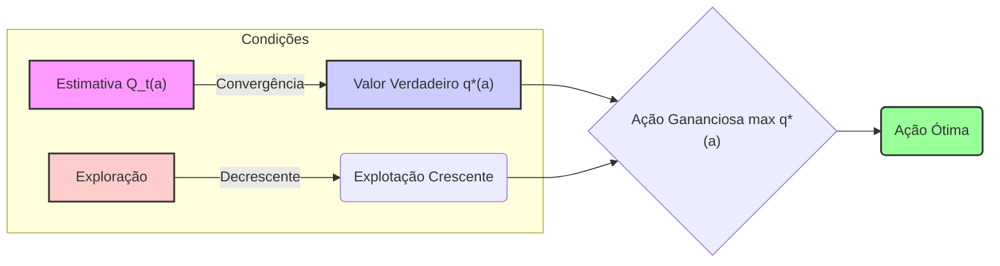

## Multi-armed Bandits: O Valor da Ação

### Introdução

O aprendizado por reforço (reinforcement learning) se distingue de outras formas de aprendizado por utilizar informações de treinamento que avaliam as ações tomadas, em vez de instruir por meio de ações corretas [^1]. Essa característica singular gera a necessidade de exploração ativa, buscando explicitamente por comportamentos vantajosos. Enquanto o feedback puramente avaliativo indica a qualidade da ação tomada, mas não se é a melhor ou a pior possível, o feedback puramente instrutivo aponta a ação correta independentemente da ação tomada [^1]. Este capítulo explora o aspecto avaliativo do aprendizado por reforço em um cenário simplificado, o problema do **k-armed bandit**, que não envolve aprender a agir em múltiplas situações [^1]. Este problema permite analisar como o feedback avaliativo difere, e como ele pode ser combinado, com o feedback instrutivo [^1]. O problema do k-armed bandit é usado para introduzir métodos de aprendizado que serão expandidos em capítulos posteriores para abranger o problema completo do aprendizado por reforço [^1].

### Conceitos Fundamentais

O problema do **k-armed bandit** envolve a tomada repetida de decisões entre *k* opções distintas, ou ações [^1]. Após cada escolha, uma recompensa numérica é recebida, proveniente de uma distribuição de probabilidade estacionária que depende da ação selecionada [^1]. O objetivo é maximizar a recompensa total esperada em um período específico, como 1000 seleções de ação ou passos de tempo [^1]. Analogamente a uma máquina caça-níqueis com *k* alavancas, cada seleção de ação corresponde ao acionamento de uma alavanca, e as recompensas são os ganhos obtidos [^2].

> 💡 **Exemplo Numérico:** Imagine um cenário com 3 alavancas (*k*=3). A alavanca 1 retorna recompensas com média de 1, alavanca 2 com média de 2, e alavanca 3 com média de 3. Cada alavanca, ao ser acionada, retorna uma recompensa aleatória, conforme uma distribuição normal com o valor médio indicado e desvio padrão de 1. O objetivo é, após um certo número de acionamentos, maximizar a soma das recompensas obtidas.

O **valor de uma ação**, denotado por **q\*(a)**, é a recompensa esperada ou média ao selecionar a ação *a* [^2]. Formalmente, essa relação é expressa como:

$$ q^*(a) = E[R_t | A_t = a] $$,

onde $A_t$ representa a ação selecionada no passo de tempo *t*, e $R_t$ é a recompensa correspondente [^2]. Se os valores de cada ação fossem conhecidos, a solução seria trivial: selecionar sempre a ação com o maior valor [^2]. Entretanto, assume-se que os valores das ações são desconhecidos, embora seja possível realizar estimativas [^2]. A estimativa do valor da ação *a* no passo de tempo *t* é denotada por $Q_t(a)$, e o objetivo é que $Q_t(a)$ se aproxime de $q^*(a)$ [^2].

```mermaid
graph LR
    A["Ação \"a\" selecionada em \"t\""] -->| "R_t" (Recompensa) | B["Distribuição de Probabilidade \"P(R_t | A_t = a)\""];
    B --> C{"Valor Verdadeiro" "q*(a) = E[R_t | A_t = a]"};
    C --> D["Estimativa do valor" "Q_t(a)"];
    D --> E{"Aproximação" "Q_t(a) -> q*(a)"}
    style A fill:#f9f,stroke:#333,stroke-width:2px
    style C fill:#ccf,stroke:#333,stroke-width:2px
    style E fill:#9f9,stroke:#333,stroke-width:2px
```

> 💡 **Exemplo Numérico:** Continuando o exemplo anterior, inicialmente, não conhecemos os valores de $q^*(a)$ para cada alavanca. Portanto, as estimativas iniciais $Q_t(a)$ podem ser, por exemplo, $Q_1(1) = 0$, $Q_1(2) = 0$, e $Q_1(3) = 0$. Após acionar a alavanca 1, obtemos uma recompensa, digamos, $R_1 = 0.8$. Atualizamos então $Q_2(1)$ para a média das recompensas obtidas para a ação 1 até agora, que é 0.8. Após um número grande de iterações, $Q_t(1)$ irá se aproximar de 1, $Q_t(2)$ de 2 e $Q_t(3)$ de 3, os valores de $q^*(a)$ para cada alavanca.

**Observação 1:** É importante notar que $q^*(a)$ é um valor fixo para cada ação *a* no contexto do problema *k*-armed bandit, pois assumimos uma distribuição de probabilidade estacionária. A variabilidade nas recompensas $R_t$ para uma dada ação *a* deriva da natureza estocástica dessa distribuição, não de uma mudança em $q^*(a)$. Em outras palavras, $q^*(a)$ representa a média a longo prazo das recompensas obtidas pela ação *a*.

Para entender a relação entre **exploração** e **explotação**, é fundamental identificar as **ações gananciosas (greedy actions)**, que são aquelas com o maior valor estimado [^2]. A escolha de uma ação gananciosa é a *explotação* do conhecimento atual dos valores das ações [^2]. Por outro lado, selecionar uma ação não gananciosa é *explorar*, o que possibilita refinar a estimativa do valor das ações não gananciosas [^2]. Embora a explotação maximize a recompensa esperada em curto prazo, a exploração pode gerar maiores recompensas totais a longo prazo [^2].

```mermaid
graph LR
    A["Valores Estimados" "Q_t(a)"] --> B{{"Ação Gananciosa" "max Q_t(a)"}};
    B -- "Explotação" --> C("Recompensa Imediata");
    A --> D{{"Ação Não-Gananciosa"}};
     D --"Exploração"--> E("Refina Q_t(a)");
     E --> F("Potencial Recompensa Futura");
     C --> G("Curto Prazo");
     F --> H("Longo Prazo");

    style B fill:#ccf,stroke:#333,stroke-width:2px
    style D fill:#fcc,stroke:#333,stroke-width:2px
     style G fill:#eee,stroke:#333,stroke-width:1px
     style H fill:#eee,stroke:#333,stroke-width:1px
```

> 💡 **Exemplo Numérico:**  Suponha que, após algumas iterações no exemplo anterior, temos $Q_t(1) = 1.1$, $Q_t(2) = 1.8$ e $Q_t(3) = 2.5$. A ação gananciosa neste momento seria a alavanca 3, pois possui o maior valor estimado. Se escolhermos a alavanca 3, estamos *explotando*. Se escolhermos a alavanca 1 ou 2, estamos *explorando* para potencialmente descobrir se seus valores verdadeiros são maiores do que os valores estimados atualmente.

**Proposição 1:** Uma forma de quantificar a incerteza nas estimativas $Q_t(a)$ é através da variância empírica das recompensas obtidas ao selecionar a ação *a*. Uma alta variância indica maior incerteza e, portanto, um possível benefício em explorar ações menos conhecidas.

> 💡 **Exemplo Numérico:** Se após 3 acionamentos da alavanca 1 obtivemos recompensas de 0.5, 1.2 e 1.0, a variância amostral seria  $var(R_1) = \frac{(0.5-0.9)^2+(1.2-0.9)^2+(1-0.9)^2}{3-1} = 0.13$. Se outra alavanca, digamos a alavanca 2, foi acionada apenas uma vez e obteve-se a recompensa 2.1, a variância amostral (com apenas uma amostra) não está bem definida, mas podemos considerá-la como sendo alta, refletindo a alta incerteza sobre o verdadeiro valor de $q^*(2)$.

**Lema 1:** Seja $N_t(a)$ o número de vezes que a ação *a* foi selecionada até o instante *t*. Se $N_t(a)$ for suficientemente grande, a lei dos grandes números garante que a média das recompensas observadas ao selecionar *a* se aproximará de $q^*(a)$, e, portanto, $Q_t(a)$ se tornará uma estimativa mais precisa.

```mermaid
graph LR
    A["Número de Seleções N_t(a)"] -->| "Aumenta" | B["Média das Recompensas Q_t(a)"];
    B -->| "Lei dos Grandes Números" | C["Valor Verdadeiro q*(a)"];
     C -- "Aproximação" --> D ["Estimativa PrecisaQ_t(a) -> q*(a)"];
     style C fill:#ccf,stroke:#333,stroke-width:2px
     style D fill:#9f9,stroke:#333,stroke-width:2px

```

> 💡 **Exemplo Numérico:**  No exemplo anterior, à medida que $N_t(1)$ aumenta, a média das recompensas observadas para a alavanca 1 ($Q_t(1)$) irá se aproximar do valor verdadeiro $q^*(1)=1$, conforme a lei dos grandes números. O mesmo ocorrerá com as demais alavancas.

A decisão de explorar ou explotar depende da precisão das estimativas, das incertezas e do número de passos de tempo restantes [^2]. O conflito entre exploração e explotação surge porque não é possível explorar e explotar simultaneamente em uma única seleção de ação [^2]. Muitos métodos sofisticados existem para equilibrar esses dois processos para formulações matemáticas específicas do problema k-armed bandit e problemas relacionados [^2].

**Teorema 1:** (Teorema da Convergência Gulosa) Se todos os valores de ações são estimados e atualizados adequadamente, e a escolha de ações se torna cada vez mais gananciosa com o tempo (i.e., a exploração diminui), sob certas condições, a estratégia converge para a seleção da ação ótima, ou seja, a ação *a* tal que $q^*(a)$ é máximo.
*Estratégia da prova:* Este teorema depende da convergência das estimativas $Q_t(a)$ para os verdadeiros valores $q^*(a)$, e da eventual escolha da ação gananciosa que corresponde ao valor máximo, uma vez que essas estimativas se tornam confiáveis. Note que a prova rigorosa envolve a análise da taxa de decaimento da exploração e das condições para convergência das estimativas.



> 💡 **Exemplo Numérico:** Uma estratégia gulosa simples, como escolher sempre a ação com maior $Q_t(a)$, pode não convergir para a ação ótima. Se a estimativa inicial de uma ação ótima é baixa, essa ação pode nunca ser explorada. Por outro lado, uma estratégia $\epsilon$-greedy, que explora com probabilidade $\epsilon$ e explora com probabilidade $1-\epsilon$, garante que todas as ações sejam eventualmente exploradas. À medida que o número de iterações aumenta, é possível reduzir $\epsilon$, favorecendo cada vez mais a exploração. Um exemplo de decaimento de $\epsilon$ é $\epsilon_t = \frac{1}{t}$, onde *t* é o passo de tempo, ou $ \epsilon_t = \epsilon_0 \cdot \gamma ^ t $, onde $\gamma$ é uma taxa de decaimento e $\epsilon_0$ é o valor inicial.

### Conclusão

O conceito de valor de uma ação, **q\*(a)**, como a recompensa esperada ao selecionar a ação *a*, é fundamental no problema do *k*-armed bandit. A dinâmica entre exploração e explotação é crucial para otimizar o aprendizado e a recompensa total esperada, e o entendimento do valor da ação e da diferença entre ações gulosas e não-gulosas é essencial para o estudo de modelos mais complexos de reinforcement learning.

### Referências
[^1]: "The most important feature distinguishing reinforcement learning from other types of
learning is that it uses training information that evaluates the actions taken rather
than instructs by giving correct actions. This is what creates the need for active
exploration, for an explicit search for good behavior. Purely evaluative feedback indicates
how good the action taken was, but not whether it was the best or the worst action
possible. Purely instructive feedback, on the other hand, indicates the correct action to
take, independently of the action taken. This kind of feedback is the basis of
supervised learning, which includes large parts of pattern classification, artificial neural
networks, and system identification. In their pure forms, these two kinds of feedback
are quite distinct: evaluative feedback depends entirely on the action taken, whereas
instructive feedback is independent of the action taken.
In this chapter we study the evaluative aspect of reinforcement learning in a simplified
setting, one that does not involve learning to act in more than one situation. This
nonassociative setting is the one in which most prior work involving evaluative feedback
has been done, and it avoids much of the complexity of the full reinforcement learning
problem. Studying this case enables us to see most clearly how evaluative feedback differs
from, and yet can be combined with, instructive feedback.
The particular nonassociative, evaluative feedback problem that we explore is a simple
version of the k-armed bandit problem. We use this problem to introduce a number
of basic learning methods which we extend in later chapters to apply to the full rein-
forcement learning problem. At the end of this chapter, we take a step closer to the full
reinforcement learning problem by discussing what happens when the bandit problem
becomes associative, that is, when the best action depends on the situation." *(Trecho de Chapter 2 - Multi-armed Bandits)*
[^2]: "Consider the following learning problem. You are faced repeatedly with a choice among
k different options, or actions. After each choice you receive a numerical reward chosen
from a stationary probability distribution that depends on the action you selected. Your
objective is to maximize the expected total reward over some time period, for example,
over 1000 action selections, or time steps.
This is the original form of the k-armed bandit problem, so named by analogy to a slot
machine, or “one-armed bandit,” except that it has k levers instead of one. Each action
selection is like a play of one of the slot machine's levers, and the rewards are the payoffs
for hitting the jackpot. Through repeated action selections you are to maximize your
winnings by concentrating your actions on the best levers. Another analogy is that of
a doctor choosing between experimental treatments for a series of seriously ill patients.
Each action is the selection of a treatment, and each reward is the survival or well-being
of the patient. Today the term “bandit problem" is sometimes used for a generalization
of the problem described above, but in this book we use it to refer just to this simple
case.
In our k-armed bandit problem, each of the k actions has an expected or mean reward
given that that action is selected; let us call this the value of that action. We denote the
action selected on time step t as At, and the corresponding reward as Rt. The value then
of an arbitrary action a, denoted q∗(a), is the expected reward given that a is selected:
q*(a) = E[Rt | At=a].
If you knew the value of each action, then it would be trivial to solve the k-armed bandit
problem: you would always select the action with highest value. We assume that you do
not know the action values with certainty, although you may have estimates. We denote
the estimated value of action a at time stept as Qt(a). We would like Qt(a) to be close
to q*(a).
If you maintain estimates of the action values, then at any time step there is at least
one action whose estimated value is greatest. We call these the greedy actions. When you
select one of these actions, we say that you are exploiting your current knowledge of the
values of the actions. If instead you select one of the nongreedy actions, then we say you
are exploring, because this enables you to improve your estimate of the nongreedy action's
value. Exploitation is the right thing to do to maximize the expected reward on the one
step, but exploration may produce the greater total reward in the long run. For example,
suppose a greedy action's value is known with certainty, while several other actions are
estimated to be nearly as good but with substantial uncertainty. The uncertainty is
such that at least one of these other actions probably is actually better than the greedy
action, but you don't know which one. If you have many time steps ahead on which
to make action selections, then it may be better to explore the nongreedy actions and
discover which of them are better than the greedy action. Reward is lower in the short
run, during exploration, but higher in the long run because after you have discovered
the better actions, you can exploit them many times. Because it is not possible both to
explore and to exploit with any single action selection, one often refers to the “conflict”
between exploration and exploitation.
In any specific case, whether it is better to explore or exploit depends in a complex
way on the precise values of the estimates, uncertainties, and the number of remaining
steps. There are many sophisticated methods for balancing exploration and exploitation
for particular mathematical formulations of the k-armed bandit and related problems." *(Trecho de Chapter 2 - Multi-armed Bandits)*
