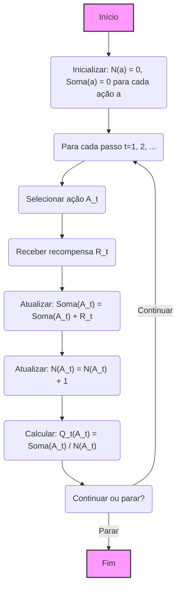
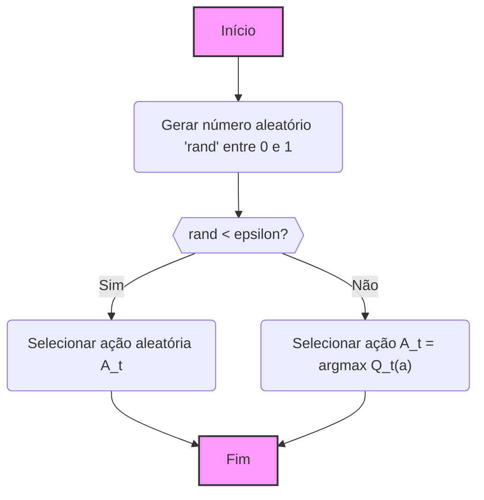
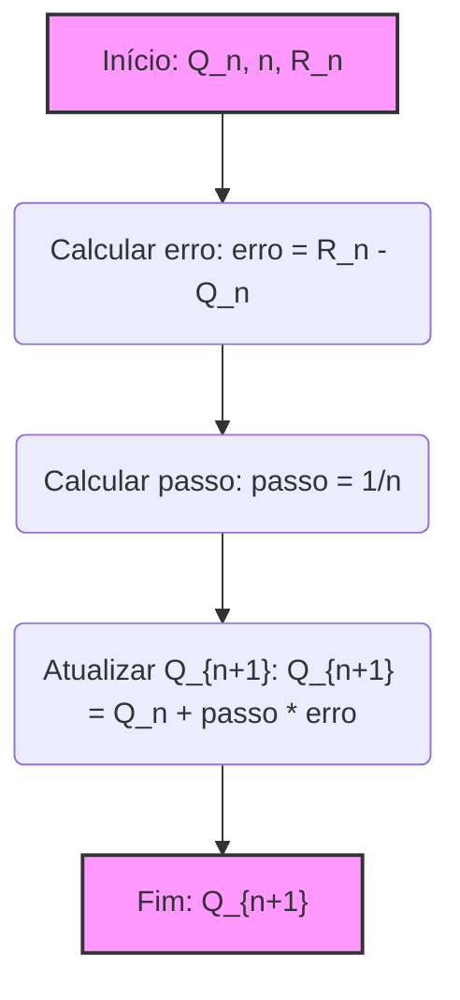

## Estimativas de Valor de Ação no Problema k-Armed Bandit

### Introdução

O problema **k-armed bandit** é um cenário de aprendizado onde um agente deve repetidamente escolher entre *k* ações diferentes, recebendo uma recompensa numérica após cada escolha. O objetivo é maximizar a recompensa total esperada ao longo do tempo [^1]. Este problema, inspirado em máquinas caça-níqueis com *k* alavancas, representa um desafio fundamental no aprendizado por reforço, onde a exploração (experimentar novas ações) e a explotação (usar o conhecimento atual para escolher ações que maximizam a recompensa) precisam ser equilibradas [^1]. Este capítulo foca no aspecto avaliativo do aprendizado por reforço, estudando como o feedback avaliativo difere do feedback instrutivo, bem como as peculiaridades da abordagem não-associativa de problemas de aprendizado por reforço, evitando a complexidade do problema completo de reforço [^1]. No contexto do k-armed bandit, cada ação *a* tem um valor esperado ou médio de recompensa, denotado por $q_*(a)$, que é a recompensa esperada ao se selecionar a ação *a* [^2]. Como este valor é geralmente desconhecido, o agente precisa estimá-lo usando os dados disponíveis.

### Conceitos Fundamentais
O cerne da solução do problema *k*-armed bandit reside na capacidade de estimar os valores de cada ação e, assim, tomar decisões informadas. O valor verdadeiro de uma ação, denotado por $q_*(a)$, é a recompensa média esperada ao selecionar a ação *a*. Matematicamente, este valor é definido como [^2]:

$$q_*(a) = \mathbb{E}[R_t | A_t = a]$$

onde $A_t$ é a ação selecionada no instante *t*, e $R_t$ é a recompensa correspondente. No entanto, esses valores são desconhecidos *a priori* e precisam ser estimados a partir das interações do agente com o ambiente. Em cada passo, o agente seleciona uma ação $A_t$ e recebe uma recompensa $R_t$. O objetivo principal é estimar o valor de cada ação, ou seja, aproximar $q_*(a)$ usando as recompensas observadas. Assim, surge o conceito de **estimativas de valor de ação**, denotado por $Q_t(a)$, que representa a estimativa do valor da ação *a* no instante *t* [^2]. A ideia é que, com o tempo e mais experiências, $Q_t(a)$ se aproxime de $q_*(a)$.

Para estimar os valores de ação, um método natural é usar a **média amostral**, calculando a média das recompensas obtidas para cada ação [^3]. A fórmula para calcular $Q_t(a)$ usando a média amostral é dada por:

$$Q_t(a) = \frac{\text{Soma das recompensas quando a foi tomada antes de t}}{\text{Número de vezes que a foi tomada antes de t}} = \frac{\sum_{i=1}^{t-1} R_i \mathbb{1}_{A_i=a}}{\sum_{i=1}^{t-1} \mathbb{1}_{A_i=a}} $$

onde $\mathbb{1}_{\text{predicate}}$ é uma função indicadora que retorna 1 se `predicate` for verdadeiro e 0 caso contrário. Se o denominador for zero, $Q_t(a)$ é definido como um valor padrão, como 0. À medida que o número de vezes que a ação *a* é tomada tende ao infinito, pela lei dos grandes números, $Q_t(a)$ converge para $q_*(a)$ [^3]. Este método é conhecido como o método de **média amostral** para estimar os valores de ação.

> 💡 **Exemplo Numérico:**
>
> Imagine um cenário com 3 ações (k=3). As recompensas obtidas para cada ação ao longo de 5 passos são:
>
> *   Ação 1: Recompensas = \[2, 3, 2, 4, 3]
> *   Ação 2: Recompensas = \[1, 0, 2, 1, 1]
> *   Ação 3: Recompensas = \[0, 5, 0, 0, 1]
>
> Vamos calcular $Q_t(a)$ para cada ação após 3 passos (t=3):
>
> *   $Q_3(1) = \frac{2 + 3 + 2}{3} = \frac{7}{3} \approx 2.33$
> *   $Q_3(2) = \frac{1 + 0 + 2}{3} = \frac{3}{3} = 1$
> *   $Q_3(3) = \frac{0 + 5 + 0}{3} = \frac{5}{3} \approx 1.67$
>
> Após 5 passos (t=5):
>
> *   $Q_5(1) = \frac{2 + 3 + 2 + 4 + 3}{5} = \frac{14}{5} = 2.8$
> *   $Q_5(2) = \frac{1 + 0 + 2 + 1 + 1}{5} = \frac{5}{5} = 1$
> *   $Q_5(3) = \frac{0 + 5 + 0 + 0 + 1}{5} = \frac{6}{5} = 1.2$
>
> Este exemplo ilustra como a média amostral calcula a estimativa do valor de cada ação ao longo do tempo. Note que, com mais interações, os valores de $Q_t(a)$ tendem a se estabilizar.

**Lema 1** O método da média amostral garante que, se cada ação é selecionada infinitas vezes, então a estimativa do valor da ação $Q_t(a)$ converge para o valor verdadeiro $q_*(a)$ quase certamente.

*Proof:* This follows directly from the strong law of large numbers. Since each $R_i$ is a random variable, with a well defined expected value for action $a$, the sample average will converge almost surely to the expected value.

A principal questão a ser respondida agora é: Como usar as estimativas de valor de ação para selecionar as ações?  A abordagem mais simples é selecionar a ação com o maior valor estimado, ou seja, escolher a ação *greedy*. Formalmente, isso pode ser escrito como:

$$A_t = \underset{a}{\text{argmax}} \, Q_t(a)$$

Essa abordagem, entretanto, não explora novas ações, pois sempre escolhe a que parece ser a melhor até o momento. Essa abordagem pode levar o algoritmo a ficar preso em escolhas subótimas e impede uma busca completa por melhores alternativas, pois não explora ações que, porventura, tenham uma estimativa de valor inferior, mas que podem ser melhores a longo prazo [^2].

Uma alternativa simples à exploração pura é o método **$\epsilon$-greedy**, onde a maioria das vezes o agente seleciona a ação *greedy*, mas com uma probabilidade $\epsilon$, o agente seleciona uma ação aleatória. Formalmente:

$$ A_t =
\begin{cases}
    \underset{a}{\text{argmax}} \, Q_t(a) & \text{com probabilidade } 1-\epsilon \\
    \text{ação aleatória } & \text{com probabilidade } \epsilon
\end{cases}
$$

Este método garante que todas as ações sejam exploradas infinitas vezes, garantindo a convergência de $Q_t(a)$ para $q_*(a)$ no limite [^4]. O valor de $\epsilon$ controla o equilíbrio entre exploração e explotação [^4]. Valores maiores de $\epsilon$ levam a maior exploração, enquanto valores menores focam mais na explotação [^4].

> 💡 **Exemplo Numérico:**
>
> Vamos supor que temos 3 ações e que as estimativas de valor após algumas iterações são:
>
> *   $Q_t(1) = 2.5$
> *   $Q_t(2) = 1.8$
> *   $Q_t(3) = 3.1$
>
> A ação *greedy* seria a ação 3, pois tem o maior valor estimado. Agora, vamos aplicar o método $\epsilon$-greedy com $\epsilon = 0.2$. Isso significa que em 80% das vezes (probabilidade 1-0.2), a ação selecionada será a ação *greedy*, que é a ação 3.  Nos 20% restantes das vezes (probabilidade 0.2), uma ação será selecionada aleatoriamente entre as 3 ações.
>
> Se gerarmos um número aleatório entre 0 e 1:
>
> *   Se o número for menor que 0.2, escolhemos uma ação aleatória.
>     * Por exemplo, se o número aleatório for 0.1, podemos escolher a ação 1.
> *   Se o número for maior ou igual a 0.2, escolhemos a ação *greedy*, que é a ação 3.
>     * Por exemplo, se o número aleatório for 0.7, escolhemos a ação 3.
>
> Este processo mostra como o método $\epsilon$-greedy balanceia a exploração (ações aleatórias) e a explotação (ação *greedy*).

**Proposição 2** No método $\epsilon$-greedy, para $\epsilon > 0$, cada ação é selecionada infinitas vezes em um número infinito de passos, garantindo que $Q_t(a)$ converge para $q_*(a)$ para toda ação *a*.

*Proof:* Since there is a probability $\epsilon$ of selecting an action at random, in an infinite number of trials, each action will be selected an infinite number of times. Thus, with the strong law of large numbers, for every action $a$, $Q_t(a)$ will converge to $q_*(a)$.

Para refinar a abordagem de média amostral, é possível utilizar **implementação incremental**, que permite calcular a média sem armazenar todas as recompensas anteriores, o que é computacionalmente mais eficiente. A fórmula de atualização incremental é dada por [^7]:

$$Q_{n+1} = Q_n + \frac{1}{n} [R_n - Q_n]$$

Esta atualização calcula a nova média $Q_{n+1}$ com base na média anterior $Q_n$, no número de amostras $n$ e na nova recompensa $R_n$.  Essa atualização é crucial para a construção de algoritmos eficientes que operam em tempo constante e memória constante por passo. A forma geral dessa atualização é:

$$ \text{NovaEstimativa} \leftarrow \text{AntigaEstimativa} + \text{Passo} [\text{Alvo} - \text{AntigaEstimativa}]$$

onde o termo [Alvo - AntigaEstimativa] representa o erro na estimativa, que é reduzido ao se dar um passo na direção do Alvo [^7].

> 💡 **Exemplo Numérico:**
>
> Vamos assumir que $Q_5(a) = 2$ e a próxima recompensa obtida após a 6ª vez que a ação *a* foi selecionada é $R_6 = 4$. Usando a atualização incremental, podemos calcular $Q_6(a)$:
>
> $Q_{6}(a) = Q_5(a) + \frac{1}{6} [R_6 - Q_5(a)]$
>
> $Q_{6}(a) = 2 + \frac{1}{6} [4 - 2]$
>
> $Q_{6}(a) = 2 + \frac{1}{6} [2]$
>
> $Q_{6}(a) = 2 + \frac{1}{3}$
>
> $Q_{6}(a) \approx 2.33$
>
> Este exemplo demonstra como a estimativa do valor da ação é atualizada incrementalmente, sem a necessidade de armazenar todas as recompensas anteriores.

**Teorema 3** (Convergência da Atualização Incremental) Se a recompensa $R_n$ é limitada e o tamanho do passo é dado por $\frac{1}{n}$, então o processo de atualização incremental converge para o valor médio da ação.

*Proof:*  The update rule is a stochastic approximation algorithm. With a step size of $\frac{1}{n}$, this is a Robbins-Monro algorithm. Since the rewards are bounded, it can be proven that $Q_n$ converges to the expected value of the rewards, which is the true value of the action $q_*(a)$.

**Corolário 3.1** (Taxas de Aprendizagem) A implementação incremental com uma taxa de aprendizagem $\alpha$ constante (em vez de $\frac{1}{n}$) resultará em uma convergência mais rápida, porém para um valor que não é necessariamente o valor verdadeiro da ação.

*Proof:* If $\alpha$ is kept constant, the impact of new rewards is weighted consistently with the initial rewards, thus giving more "emphasis" to the last rewards, making the estimate faster to reach a fixed point but biasing the final estimate with respect to the mean.

> 💡 **Exemplo Numérico:**
>
> Considere novamente o cenário anterior onde $Q_5(a) = 2$ e $R_6 = 4$. Em vez de usar o tamanho de passo $\frac{1}{n}$, vamos usar uma taxa de aprendizagem constante $\alpha = 0.1$.
>
> $Q_{6}(a) = Q_5(a) + \alpha [R_6 - Q_5(a)]$
>
> $Q_{6}(a) = 2 + 0.1 [4 - 2]$
>
> $Q_{6}(a) = 2 + 0.1 [2]$
>
> $Q_{6}(a) = 2 + 0.2$
>
> $Q_{6}(a) = 2.2$
>
> Observe que $Q_6(a) = 2.2$ com $\alpha = 0.1$ e  $Q_6(a) \approx 2.33$ com $\frac{1}{n}$. A convergência para um valor próximo, mas diferente do valor médio da ação, ilustra o corolário 3.1. O uso de um $\alpha$ constante proporciona uma atualização mais rápida, mas que pode não convergir para o valor verdadeiro, enquanto o $\frac{1}{n}$ garante convergência, mas de forma mais lenta.

**Lema 3.2** Se o passo é dado por $\alpha_n$, onde $\sum_{n=1}^{\infty} \alpha_n = \infty$ e $\sum_{n=1}^{\infty} \alpha_n^2 < \infty$, então $Q_n$ converge para $q_*(a)$ com probabilidade 1.

*Proof:* This result is a classical theorem from stochastic approximation theory and is satisfied, for example, by the learning rate $\alpha_n = \frac{1}{n}$. The first condition guarantees that the steps are large enough to reach the optimal point, whereas the second condition guarantees that the steps diminish enough to converge to the optimal point.

### Conclusão
Este capítulo apresenta a base para a solução do problema *k*-armed bandit, destacando a importância de estimar os valores das ações, um processo fundamental para um aprendizado por reforço. As estimativas de valor de ação, $Q_t(a)$, são cruciais para aproximar os valores reais, $q_*(a)$. Exploramos métodos como a média amostral, juntamente com abordagens como a seleção *greedy* e $\epsilon$-greedy para balancear a exploração e a explotação, e a implementação incremental para maior eficiência. Compreender essas estimativas e suas aplicações é essencial para o desenvolvimento de soluções mais complexas em ambientes de aprendizado por reforço.

### Referências
[^1]: "The most important feature distinguishing reinforcement learning from other types of learning is that it uses training information that evaluates the actions taken rather than instructs by giving correct actions." *(Trecho de Chapter 2: Multi-armed Bandits)*
[^2]: "In our k-armed bandit problem, each of the k actions has an expected or mean reward given that that action is selected; let us call this the value of that action. We denote the action selected on time step t as At, and the corresponding reward as Rt. The value then of an arbitrary action a, denoted q∗(a), is the expected reward given that a is selected: q*(a) = E[Rt | At=a]." *(Trecho de Chapter 2: Multi-armed Bandits)*
[^3]: "We begin by looking more closely at methods for estimating the values of actions and for using the estimates to make action selection decisions, which we collectively call action-value methods. Recall that the true value of an action is the mean reward when that action is selected. One natural way to estimate this is by averaging the rewards actually received:
Qt(a) = sum of rewards when a taken prior to t / number of times a taken prior to t = ... where 1 predicate denotes the random variable that is 1 if predicate is true and 0 if it is not. If the denominator is zero, then we instead define Qt(a) as some default value, such as 0. As the denominator goes to infinity, by the law of large numbers, Qt(a) converges to q*(a)." *(Trecho de Chapter 2: Multi-armed Bandits)*
[^4]: "We call methods using this near-greedy action selection rule ɛ-greedy methods. An advantage of these methods is that, in the limit as the number of steps increases, every action will be sampled an infinite number of times, thus ensuring that all the Qt(a) converge to their respective q*(a)." *(Trecho de Chapter 2: Multi-armed Bandits)*
[^5]: "The simplest action selection rule is to select one of the actions with the highest estimated value, that is, one of the greedy actions as defined in the previous section. If there is more than one greedy action, then a selection is made among them in some arbitrary way, perhaps randomly. We write this greedy action selection method as At = argmaxa Qt(a), where argmaxa denotes the action a for which the expression that follows is maximized (with ties broken arbitrarily)." *(Trecho de Chapter 2: Multi-armed Bandits)*
[^6]: "A simple alternative is to behave greedily most of the time, but every once in a while, say with small probability ɛ, instead select randomly from among all the actions with equal probability, independently of the action-value estimates." *(Trecho de Chapter 2: Multi-armed Bandits)*
[^7]: "To simplify notation we concentrate on a single action. Let R₁ now denote the reward received after the ith selection of this action, and let Qn denote the estimate of its action value after it has been selected n − 1 times, which we can now write simply as Qn = R1 + R2 +…+ Rn-1 / n-1. The obvious implementation would be to maintain a record of all the rewards and then perform this computation whenever the estimated value was needed. However, if this is done, then the memory and computational requirements would grow over time as more rewards are seen. Each additional reward would require additional memory to store it and additional computation to compute the sum in the numerator. As you might suspect, this is not really necessary. It is easy to devise incremental formulas for updating averages with small, constant computation required to process each new reward. Given Qn and the nth reward, Rn, the new average of all n rewards can be computed by...which holds even for n = 1, obtaining Q2 = R₁ for arbitrary Q1. This implementation requires memory only for Qn and n, and only the small computation (2.3) for each new reward." *(Trecho de Chapter 2: Multi-armed Bandits)*
[^8]: "This update rule (2.3) is of a form that occurs frequently throughout this book. The general form is NewEstimate ← OldEstimate + StepSize [Target − OldEstimate]." *(Trecho de Chapter 2: Multi-armed Bandits)*
