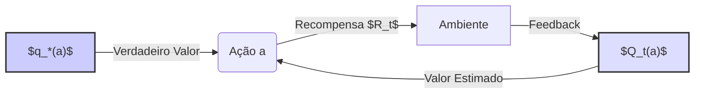
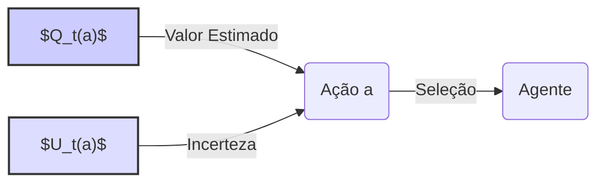
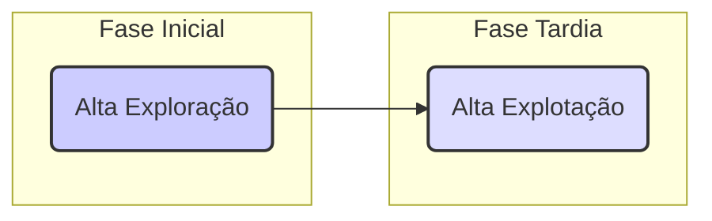

## A Necessidade de Balancear Exploração e Explotação no Problema k-armed Bandit

### Introdução
No campo do **reinforcement learning**, uma característica fundamental que o distingue de outros tipos de aprendizado é o uso de informações de treinamento que avaliam as ações tomadas em vez de instruir por meio de ações corretas [^1]. Essa distinção cria a necessidade de **exploração ativa**, uma busca explícita por um comportamento adequado. O feedback avaliativo puro indica a qualidade da ação tomada, mas não se ela era a melhor ou a pior possível, enquanto o feedback instrutivo indica a ação correta a ser tomada, independentemente da ação realizada. O feedback instrutivo é a base do aprendizado supervisionado [^1]. Este capítulo foca no aspecto avaliativo do reinforcement learning em um cenário simplificado, o qual não envolve aprender a agir em múltiplas situações. Esse cenário **não associativo** é onde a maioria dos trabalhos anteriores envolvendo feedback avaliativo foram realizados e evita grande parte da complexidade do problema completo de reinforcement learning [^1]. Assim, torna-se possível observar de forma mais clara as diferenças e como o feedback avaliativo pode ser combinado com o feedback instrutivo. O problema particular que será explorado é uma versão simples do **k-armed bandit problem**, que servirá de base para introduzir vários métodos de aprendizado básicos que serão estendidos em capítulos posteriores para aplicar ao problema completo de reinforcement learning [^1].

### Conceitos Fundamentais
O problema k-armed bandit apresenta um cenário de aprendizado onde se deve escolher repetidamente entre k opções diferentes, ou ações. Após cada escolha, recebe-se uma recompensa numérica proveniente de uma distribuição de probabilidade estacionária que depende da ação selecionada [^1]. O objetivo é maximizar a recompensa total esperada ao longo de um período, por exemplo, 1000 seleções de ações, ou *time steps* [^2]. Este problema é análogo a uma *slot machine* com k alavancas, onde o objetivo é maximizar os ganhos concentrando as ações nas melhores alavancas [^2]. Uma analogia adicional é a de um médico escolhendo entre tratamentos experimentais para pacientes gravemente enfermos. Cada ação é a seleção de um tratamento e cada recompensa é a sobrevivência ou bem-estar do paciente [^2].

No **k-armed bandit problem**, cada ação possui uma recompensa esperada, ou média, dado que a ação foi selecionada. Esse valor é denotado como $q_*(a)$ [^2]. A ação selecionada no *time step* t é denotada como $A_t$ e a recompensa correspondente como $R_t$. A ação $a$, que é arbitrária, possui seu valor definido como $q_*(a) = E[R_t | A_t=a]$ [^2].

**Proposição 1**  A recompensa esperada $q_*(a)$ representa o valor verdadeiro da ação $a$.  A expectativa  $E[R_t | A_t = a]$  é calculada em relação à distribuição de probabilidade estacionária da recompensa, condicionada à ação $a$ ter sido escolhida. Este valor é constante ao longo do tempo no problema *k-armed bandit* clássico.

> 💡 **Exemplo Numérico:** Imagine um problema de 3-armed bandit (k=3). A ação 1 tem uma recompensa esperada $q_*(1) = 2$, a ação 2 tem $q_*(2) = 4$, e a ação 3 tem $q_*(3) = 1$.  Esses valores são *constantes* ao longo do tempo. Se a ação 2 for escolhida, em média, a recompensa será 4, mas cada recompensa individual pode variar, por exemplo, 3 ou 5, devido à distribuição de probabilidade.

Se os valores de cada ação fossem conhecidos, o problema se tornaria trivial, bastaria escolher sempre a ação com o maior valor. No entanto, assume-se que os valores das ações não são conhecidos com certeza, apesar de existirem estimativas. O valor estimado da ação $a$ no *time step* t é denotado por $Q_t(a)$. O objetivo é que $Q_t(a)$ se aproxime de $q_*(a)$ [^2].

**Lema 1**  A diferença entre a estimativa $Q_t(a)$ e o valor verdadeiro $q_*(a)$, ou seja, $|Q_t(a) - q_*(a)|$, representa o erro da estimativa da ação $a$ no tempo *t*. O objetivo de qualquer algoritmo de aprendizagem no *k-armed bandit problem* é minimizar este erro ao longo do tempo para todas as ações.

> 💡 **Exemplo Numérico:** Continuando com o exemplo anterior, no *time step* t=1, podemos ter estimativas iniciais $Q_1(1) = 1.5$, $Q_1(2) = 3$, e $Q_1(3) = 1.2$. Os erros são $|1.5 - 2| = 0.5$, $|3 - 4| = 1$, e $|1.2 - 1| = 0.2$ respectivamente. O objetivo do algoritmo é reduzir esses erros ao longo do tempo, de forma que $Q_t(a)$ se aproxime de $q_*(a)$.

Para manter estimativas dos valores das ações, é preciso que em cada *time step* exista pelo menos uma ação com o maior valor estimado. Essas ações são chamadas de **greedy actions**. Ao selecionar uma dessas ações, o agente está **exploitando** seu conhecimento atual dos valores das ações [^2]. Por outro lado, ao selecionar uma das ações não-greedy, o agente está **explorando**, o que permite melhorar as estimativas do valor das ações não-greedy. A exploração é importante para maximizar a recompensa total no longo prazo, enquanto a explotação visa maximizar a recompensa imediata [^2].

**Teorema 1** A estratégia puramente *greedy*, ou seja, selecionar sempre a ação com maior valor estimado, não garante a convergência para a ação ótima a longo prazo, especialmente quando as estimativas iniciais $Q_t(a)$ são imprecisas.  
*Proof:* Uma vez que a estratégia *greedy* explora apenas a ação com maior valor estimado, ações com valores verdadeiros $q_*(a)$ ligeiramente menores, mas potencialmente melhores, podem ser ignoradas, levando a um ótimo local, não global.

> 💡 **Exemplo Numérico:** Usando o exemplo anterior, no *time step* t=1, a ação greedy seria a ação 3, pois tem o maior valor estimado (1.2). Se usarmos uma estratégia *greedy* pura, sempre selecionaríamos a ação 3. No entanto, a ação 2 é realmente a melhor ($q_*(2) = 4$).  Se a estimativa inicial de Q(2) for muito baixa e não explorarmos outras ações, nunca descobriremos que a ação 2 é a melhor.  Isso demonstra o risco de ficar preso a um ótimo local.

**Lema 1.1**  O conceito de valor estimado $Q_t(a)$ pode ser extendido para incluir uma incerteza associada a esta estimativa. Em muitas abordagens, esta incerteza é usada para guiar a exploração, promovendo a seleção de ações com estimativas mais incertas.

> 💡 **Exemplo Numérico:** Imagine que, em vez de apenas $Q_t(a)$, temos também um valor de incerteza $U_t(a)$. Por exemplo, se $Q_1(1)=1.5$ e $U_1(1)=0.8$, e $Q_1(2)=3$ e $U_1(2)=0.2$.  A ação 1 tem mais incerteza que a ação 2, mesmo que seu valor estimado seja menor.  Um método de exploração baseado em incerteza poderia levar a escolher a ação 1 para melhor estimar seu verdadeiro valor $q_*(1)$.

**O Dilema Exploração vs. Explotação:**
O conceito de exploração e explotação leva a um dilema. Em algumas situações, é melhor explorar as ações não-greedy e descobrir aquelas que podem ser superiores à ação greedy, mesmo que a recompensa imediata seja menor. Em outras situações, a explotação é a estratégia mais adequada quando a ação *greedy* tem um alto valor conhecido [^2]. O *trade-off* entre exploração e explotação é uma questão complexa que depende dos valores exatos das estimativas, das incertezas e do número de *time steps* restantes. Existem diversos métodos para balancear exploração e explotação para formulações matemáticas específicas do *k-armed bandit problem* e problemas relacionados [^2].

**Corolário 1** A escolha ótima entre exploração e explotação não é estática, dependendo do progresso do aprendizado. Inicialmente, a exploração é crucial para identificar as melhores ações, enquanto em etapas posteriores, uma maior explotação das ações com melhor estimativa pode levar a um maior ganho.

> 💡 **Exemplo Numérico:** No início do aprendizado, podemos ter estimativas muito imprecisas das ações, então uma alta taxa de exploração (selecionar ações não-greedy com frequência) seria benéfico. Por exemplo, podemos definir que 80% das vezes o agente explora e 20% explota.  À medida que aprendemos mais, podemos reduzir a exploração para, digamos, 10% e aumentar a explotação para 90%, focando nas ações que já sabemos que são boas.

A necessidade de balancear exploração e explotação é um desafio particular no *reinforcement learning*. A versão simplificada do problema *k-armed bandit* permite apresentar este conceito de forma clara [^3].

**Observação 1**  O problema *k-armed bandit* pode ser interpretado como um caso particular de um problema de tomada de decisão sob incerteza, em que não há dependência temporal entre as decisões e as recompensas.  Esta ausência de dependência temporal simplifica o problema e possibilita analisar o balanço entre exploração e explotação de forma mais isolada.

### Conclusão
O problema k-armed bandit é um modelo fundamental no reinforcement learning que encapsula a tensão entre **exploração** e **explotação**. A necessidade de balancear essas duas abordagens é crucial para otimizar o aprendizado e a tomada de decisões em ambientes incertos. O problema k-armed bandit nos permite analisar e experimentar com diversas estratégias de aprendizado que visam encontrar o equilíbrio ideal, o que nos dá uma base sólida para abordar problemas de reinforcement learning mais complexos.

### Referências
[^1]: "The most important feature distinguishing reinforcement learning from other types of learning is that it uses training information that evaluates the actions taken rather than instructs by giving correct actions. This is what creates the need for active exploration, for an explicit search for good behavior. Purely evaluative feedback indicates how good the action taken was, but not whether it was the best or the worst action possible. Purely instructive feedback, on the other hand, indicates the correct action to take, independently of the action taken. This kind of feedback is the basis of supervised learning, which includes large parts of pattern classification, artificial neural networks, and system identification. In their pure forms, these two kinds of feedback are quite distinct: evaluative feedback depends entirely on the action taken, whereas instructive feedback is independent of the action taken. In this chapter we study the evaluative aspect of reinforcement learning in a simplified setting, one that does not involve learning to act in more than one situation. This nonassociative setting is the one in which most prior work involving evaluative feedback has been done, and it avoids much of the complexity of the full reinforcement learning problem. Studying this case enables us to see most clearly how evaluative feedback differs from, and yet can be combined with, instructive feedback." *(Trecho de Chapter 2: Multi-armed Bandits)*
[^2]: "Consider the following learning problem. You are faced repeatedly with a choice among k different options, or actions. After each choice you receive a numerical reward chosen from a stationary probability distribution that depends on the action you selected. Your objective is to maximize the expected total reward over some time period, for example, over 1000 action selections, or time steps. This is the original form of the k-armed bandit problem, so named by analogy to a slot machine, or “one-armed bandit,” except that it has k levers instead of one. Each action selection is like a play of one of the slot machine's levers, and the rewards are the payoffs for hitting the jackpot. Through repeated action selections you are to maximize your winnings by concentrating your actions on the best levers. Another analogy is that of a doctor choosing between experimental treatments for a series of seriously ill patients. Each action is the selection of a treatment, and each reward is the survival or well-being of the patient. Today the term “bandit problem” is sometimes used for a generalization of the problem described above, but in this book we use it to refer just to this simple case. In our k-armed bandit problem, each of the k actions has an expected or mean reward given that that action is selected; let us call this the value of that action. We denote the action selected on time step t as At, and the corresponding reward as Rt. The value then of an arbitrary action a, denoted q∗(a), is the expected reward given that a is selected: $q_*(a) = E[R_t | A_t=a]$. If you knew the value of each action, then it would be trivial to solve the k-armed bandit problem: you would always select the action with highest value. We assume that you do not know the action values with certainty, although you may have estimates. We denote the estimated value of action a at time stept as Qt(a). We would like $Q_t(a)$ to be close to $q_*(a)$. If you maintain estimates of the action values, then at any time step there is at least one action whose estimated value is greatest. We call these the greedy actions. When you select one of these actions, we say that you are exploiting your current knowledge of the values of the actions. If instead you select one of the nongreedy actions, then we say you are exploring, because this enables you to improve your estimate of the nongreedy action's value. Exploitation is the right thing to do to maximize the expected reward on the one step, but exploration may produce the greater total reward in the long run. For example, suppose a greedy action's value is known with certainty, while several other actions are estimated to be nearly as good but with substantial uncertainty. The uncertainty is such that at least one of these other actions probably is actually better than the greedy action, but you don't know which one. If you have many time steps ahead on which to make action selections, then it may be better to explore the nongreedy actions and discover which of them are better than the greedy action. Reward is lower in the short run, during exploration, but higher in the long run because after you have discovered the better actions, you can exploit them many times. Because it is not possible both to explore and to exploit with any single action selection, one often refers to the “conflict” between exploration and exploitation." *(Trecho de Chapter 2: Multi-armed Bandits)*
[^3]: "In any specific case, whether it is better to explore or exploit depends in a complex way on the precise values of the estimates, uncertainties, and the number of remaining steps. There are many sophisticated methods for balancing exploration and exploitation for particular mathematical formulations of the k-armed bandit and related problems. However, most of these methods make strong assumptions about stationarity and prior knowledge that are either violated or impossible to verify in most applications and in the full reinforcement learning problem that we consider in subsequent chapters. The guarantees of optimality or bounded loss for these methods are of little comfort when the assumptions of their theory do not apply. In this book we do not worry about balancing exploration and exploitation in a sophisticated way; we worry only about balancing them at all. In this chapter we present several simple balancing methods for the k-armed bandit problem and show that they work much better than methods that always exploit. The need to balance exploration and exploitation is a distinctive challenge that arises in reinforcement learning; the simplicity of our version of the k-armed bandit problem enables us to show this in a particularly clear form." *(Trecho de Chapter 2: Multi-armed Bandits)*
