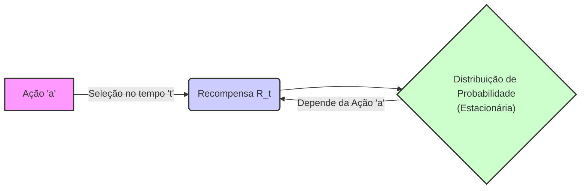
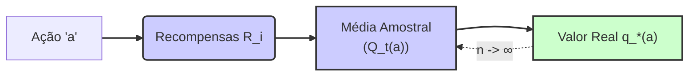
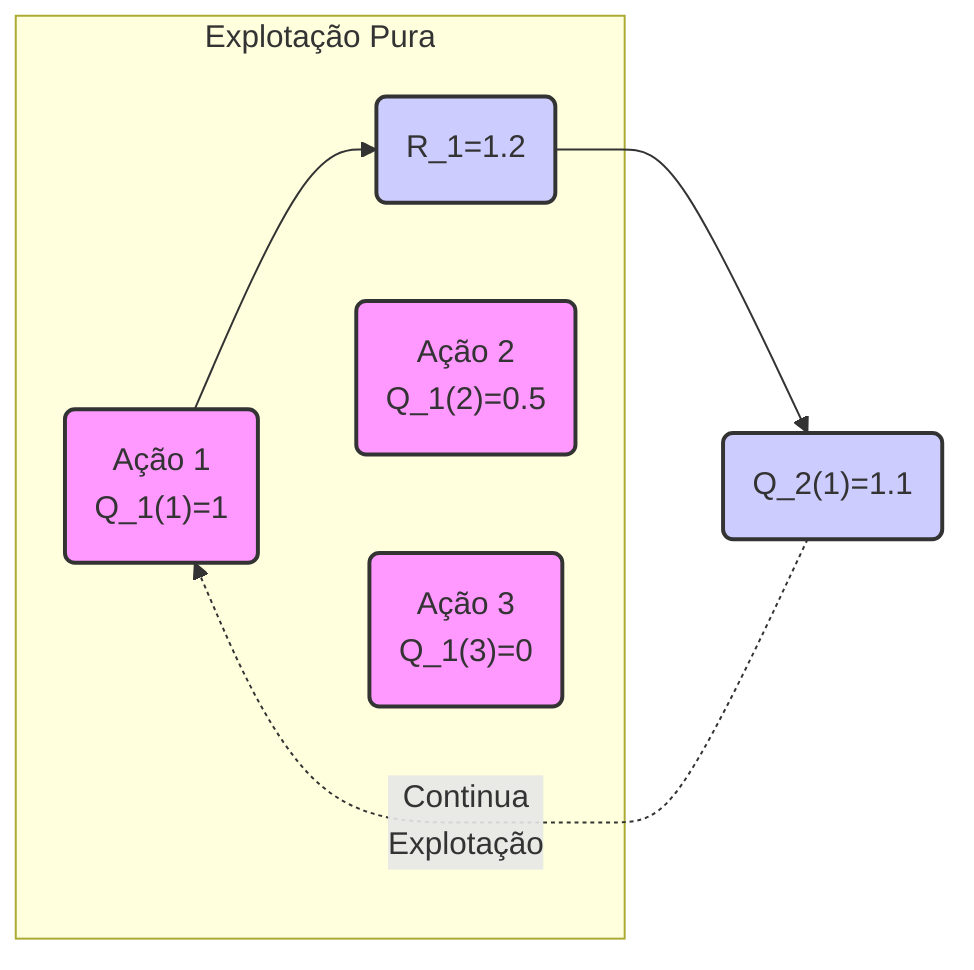
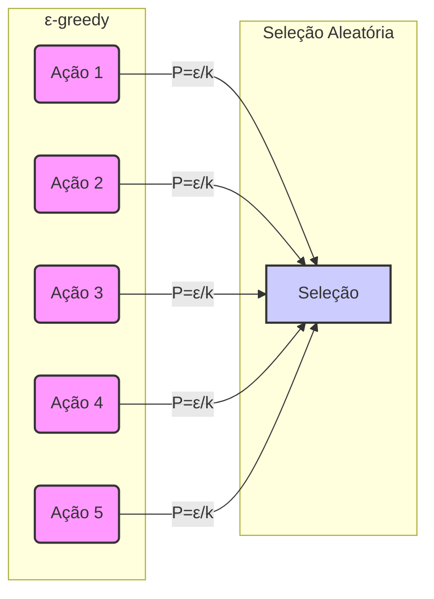

### Introdução
O aprendizado por reforço (reinforcement learning) se distingue de outros tipos de aprendizado por utilizar informações de treinamento que avaliam as ações tomadas, em vez de simplesmente instruir as ações corretas [^1]. Essa abordagem cria a necessidade de exploração ativa, para uma busca explícita por um bom comportamento. O *feedback* puramente avaliativo indica a qualidade da ação tomada, mas não se foi a melhor ou a pior ação possível. Em contraste, o *feedback* puramente instrutivo indica a ação correta a ser tomada, independentemente da ação realmente realizada. O aprendizado supervisionado se baseia neste tipo de *feedback* [^1]. O foco deste capítulo é o aspecto avaliativo do aprendizado por reforço em um cenário simplificado, o qual não envolve aprendizado para agir em mais de uma situação. Este cenário **não associativo** evita a complexidade do problema completo do aprendizado por reforço, permitindo analisar como o *feedback* avaliativo difere e como pode ser combinado com o *feedback* instrutivo. O problema específico explorado é uma versão simples do problema do bandido de k braços, usando-o para introduzir métodos básicos de aprendizado que serão posteriormente estendidos [^1].

### Conceitos Fundamentais
O problema do **bandido de *k* braços** é um cenário onde um agente é repetidamente confrontado com a escolha entre *k* opções distintas, ou ações. Após cada escolha, o agente recebe uma recompensa numérica, sorteada de uma distribuição de probabilidade estacionária que depende da ação selecionada. O objetivo é maximizar a recompensa total esperada em um dado período de tempo, como em 1000 seleções de ações ou *time steps* [^2]. Cada ação possui um valor esperado ou recompensa média, que chamamos de **valor da ação**. O valor de uma ação arbitrária *a*, denotado por $q_*(a)$, é a recompensa esperada dado que *a* foi selecionada [^2]:
$$q_*(a) = E[R_t | A_t = a]$$
onde $A_t$ é a ação selecionada no *time step* $t$, e $R_t$ é a recompensa correspondente [^2]. O problema se torna trivial se o valor de cada ação fosse conhecido, bastaria sempre selecionar a ação com o maior valor. No entanto, assume-se que os valores das ações não são conhecidos com certeza, embora possam ser estimados. A estimativa do valor da ação *a* no *time step* $t$ é denotada por $Q_t(a)$ [^2]. O objetivo é que $Q_t(a)$ se aproxime de $q_*(a)$ [^2].

> 💡 **Exemplo Numérico:** Imagine um bandido de 3 braços (k=3). As recompensas esperadas para cada braço são $q_*(1) = 1$, $q_*(2) = 2$, e $q_*(3) = 3$. O objetivo é descobrir qual braço oferece a maior recompensa média. Inicialmente, o agente não sabe quais são esses valores e começa com estimativas $Q_1(1) = Q_1(2) = Q_1(3) = 0$. Ao longo do tempo, o agente atualiza suas estimativas $Q_t(a)$ com base nas recompensas observadas.

```mermaid
graph LR
    subgraph "Ações e Valores"
    A1("Ação 1") -->|Valor Esperado q_*(1)=1| Q1["Valor Q_t(1)"]
    A2("Ação 2") -->|Valor Esperado q_*(2)=2| Q2["Valor Q_t(2)"]
    A3("Ação 3") -->|Valor Esperado q_*(3)=3| Q3["Valor Q_t(3)"]
    end
    Q1-- "Atualização com\n Recompensas" -->Q1
    Q2-- "Atualização com\n Recompensas" -->Q2
    Q3-- "Atualização com\n Recompensas" -->Q3
    style Q1 fill:#ccf,stroke:#333,stroke-width:2px
    style Q2 fill:#ccf,stroke:#333,stroke-width:2px
    style Q3 fill:#ccf,stroke:#333,stroke-width:2px
    style A1 fill:#f9f,stroke:#333,stroke-width:2px
    style A2 fill:#f9f,stroke:#333,stroke-width:2px
    style A3 fill:#f9f,stroke:#333,stroke-width:2px
```

As **ações gananciosas** são aquelas cuja estimativa de valor é a maior em um dado momento. Quando uma dessas ações é selecionada, diz-se que o agente está *explorando* o conhecimento atual dos valores das ações [^2]. Por outro lado, se uma ação **não gananciosa** é escolhida, o agente está *explorando*, buscando melhorar a estimativa do valor de ações não gananciosas [^2]. Enquanto a explotação maximiza a recompensa esperada em um único passo, a exploração pode levar a uma recompensa total maior a longo prazo. O equilíbrio entre exploração e explotação é um problema fundamental em aprendizado por reforço [^2]. A escolha entre explorar e explorar é complexa e depende das estimativas, incertezas e do número de passos restantes [^2].

**Lemma 1:** *O valor estimado de uma ação, $Q_t(a)$, converge para o valor real da ação $q_*(a)$ conforme o número de vezes que a ação a é selecionada se aproxima de infinito, sob a premissa de que as recompensas são amostradas de uma distribuição estacionária.*

**Prova:** A estimativa do valor de uma ação, $Q_t(a)$, é calculada pela média das recompensas recebidas após a seleção da ação $a$. De acordo com a lei dos grandes números, quando o número de amostras se aproxima de infinito, a média amostral converge para a esperança matemática. Assim, quando o denominador da equação (2.1) [^3] se aproxima do infinito, $Q_t(a)$ converge para $q_*(a)$, o valor esperado da ação [^3]. $\blacksquare$



**Lemma 1.1:** *A taxa de convergência de $Q_t(a)$ para $q_*(a)$ depende da variância da distribuição de recompensas para a ação $a$. Uma variância maior implica uma convergência mais lenta.*

**Prova:** A lei dos grandes números garante a convergência, mas não especifica a velocidade. A taxa de convergência é afetada pela variância das amostras. Intuitivamente, recompensas com alta variância levam a flutuações maiores na média amostral, retardando a convergência. Formalmente, pode-se demonstrar que a variância da média amostral decresce com o número de amostras, mas a taxa dessa diminuição depende da variância da distribuição original. $\blacksquare$

> 💡 **Exemplo Numérico:** Considere duas ações, A e B. A ação A tem uma recompensa média $q_*(A) = 2$ com uma variância de 1, e a ação B tem uma recompensa média $q_*(B) = 2$ com uma variância de 5. A Lei dos Grandes Números garante que, com um número suficiente de amostras, $Q_t(A)$ e $Q_t(B)$ convergirão para 2. No entanto, $Q_t(A)$ convergirá mais rapidamente do que $Q_t(B)$ devido à menor variância da ação A. Isso significa que o agente precisará experimentar a ação B muito mais vezes para ter uma estimativa confiável de seu valor.

```mermaid
graph LR
    subgraph "Convergência"
    A[Ação A\n(Var=1)]-->|q_*(A) = 2| QA["Q_t(A)\n(Convergência Rápida)"]
    B[Ação B\n(Var=5)]-->|q_*(B) = 2| QB["Q_t(B)\n(Convergência Lenta)"]
    end
    style A fill:#f9f,stroke:#333,stroke-width:2px
    style B fill:#f9f,stroke:#333,stroke-width:2px
    style QA fill:#ccf,stroke:#333,stroke-width:2px
    style QB fill:#ccf,stroke:#333,stroke-width:2px
```

**Corolário 1:** *Sob as condições do Lemma 1, um agente que sempre escolhe a ação com maior valor estimado (explotação pura) irá, com o tempo, escolher a ação com maior valor real, assumindo que todas as ações foram exploradas o suficiente.*

**Prova:** Pelo Lemma 1, $Q_t(a)$ converge para $q_*(a)$. Se o agente sempre escolhe a ação que maximiza $Q_t(a)$, em um tempo $t$ suficientemente grande, ele irá escolher a ação que maximiza $q_*(a)$, que é a ação ótima. No entanto, a exploração pode ser necessária para garantir que todas as ações foram suficientemente exploradas e que a estimativa de valor $Q_t(a)$ é precisa. $\blacksquare$

> 💡 **Exemplo Numérico:**  Imagine que o agente inicializa com $Q_1(1)=1$, $Q_1(2)=0.5$ e $Q_1(3)=0$. Se o agente usar pura exploração, no primeiro passo ele selecionaria a ação 1. Se a recompensa observada fosse 1.2,  $Q_2(1)$ atualizaria para 1.1.  Se ele continuasse com pura exploração, sempre escolheria a ação 1, mesmo que a ação 3 fosse a melhor (valor 3, conforme o exemplo anterior), pois ele nunca exploraria as outras ações.



**Corolário 1.1:** *Um agente puramente exploratório, que escolhe ações aleatoriamente, também eventualmente convergirá para a ação ótima, mas a uma taxa de convergência muito mais lenta do que um agente que combina exploração e explotação.*

**Prova:** Em um cenário puramente exploratório, todas as ações são amostradas repetidamente. Pelo Lemma 1, as estimativas $Q_t(a)$ convergirão para $q_*(a)$ para todas as ações.  Embora a convergência ocorra, a falta de um direcionamento pela explotação significa que o agente não aproveitará o conhecimento adquirido durante o processo de exploração, tornando a convergência mais lenta em comparação com um agente que equilibra exploração e explotação. $\blacksquare$

> 💡 **Exemplo Numérico:** Usando o bandido de 3 braços anterior, um agente puramente exploratório escolheria cada braço aleatoriamente. Isso levaria um tempo maior para o agente ter uma boa estimativa de qual braço é o melhor. Por exemplo, com 100 passos, o agente poderia ter escolhido o braço 1 30 vezes, o braço 2 35 vezes e o braço 3 35 vezes. Se ele escolher os braços de forma otimizada, após 100 passos o braço 3 poderia ter sido escolhido por mais de 80 vezes, já que é o melhor.

```mermaid
graph LR
    subgraph "Exploração Pura"
    A1("Ação 1")
    A2("Ação 2")
    A3("Ação 3")
    end
    A1-- "Escolha Aleatória" -->|Recompensas R_i| Q1["Q_t(1)"]
     A2-- "Escolha Aleatória" -->|Recompensas R_i| Q2["Q_t(2)"]
     A3-- "Escolha Aleatória" -->|Recompensas R_i| Q3["Q_t(3)"]

    Q1-- "Atualização Lenta" --> Q1
    Q2-- "Atualização Lenta" --> Q2
    Q3-- "Atualização Lenta" --> Q3
    style A1 fill:#f9f,stroke:#333,stroke-width:2px
    style A2 fill:#f9f,stroke:#333,stroke-width:2px
    style A3 fill:#f9f,stroke:#333,stroke-width:2px
    style Q1 fill:#ccf,stroke:#333,stroke-width:2px
    style Q2 fill:#ccf,stroke:#333,stroke-width:2px
    style Q3 fill:#ccf,stroke:#333,stroke-width:2px
```

O método de estimativa **sample-average** usa a média das recompensas observadas para estimar o valor de uma ação, conforme [^3]:
$$Q_t(a) = \frac{\text{soma das recompensas quando a foi selecionada antes de t}}{\text{número de vezes que a foi selecionada antes de t}} = \frac{\sum_{i=1}^{t-1} R_i \mathbb{1}_{A_i=a}}{\sum_{i=1}^{t-1} \mathbb{1}_{A_i=a}}$$
onde $\mathbb{1}_{\text{predicate}}$ é uma variável aleatória que vale 1 se o predicado for verdadeiro e 0 caso contrário. Se o denominador for zero, então $Q_t(a)$ é definido como um valor padrão, como 0 [^3].

> 💡 **Exemplo Numérico:** Suponha que a ação 2 tenha sido selecionada três vezes e as recompensas recebidas foram 1, 3 e 2. Usando o método *sample-average*, a estimativa do valor da ação 2 seria: $Q_4(2) = (1 + 3 + 2) / 3 = 2$. Se a ação 2 fosse selecionada novamente e a recompensa fosse 4, a nova estimativa seria $Q_5(2) = (1 + 3 + 2 + 4) / 4 = 2.5$.

```mermaid
graph LR
    A["Ação 'a'"] -->|Recompensas R_i\n(1, 3, 2, ...)| B["Soma das Recompensas"];
    B --> C["Número de Seleções"];
     C --> D["Q_t(a) = Soma/Número"];
    style A fill:#f9f,stroke:#333,stroke-width:2px
    style B fill:#ccf,stroke:#333,stroke-width:2px
    style C fill:#ccf,stroke:#333,stroke-width:2px
    style D fill:#cfc,stroke:#333,stroke-width:2px
    linkStyle 0,1,2 stroke:#333,stroke-width:2px
```

Para selecionar ações, a regra mais simples é escolher a ação com maior valor estimado, a **ação gananciosa**:
$$A_t = \underset{a}{\text{argmax}} \, Q_t(a)$$
Contudo, essa abordagem ignora a possibilidade de ações aparentemente inferiores serem, na verdade, melhores. Uma alternativa é comportar-se de forma gananciosa na maior parte do tempo, mas, com uma pequena probabilidade $\epsilon$, selecionar aleatoriamente uma ação. Esses são os métodos **$\epsilon$-greedy** [^3].

> 💡 **Exemplo Numérico:**  Se tivermos 3 ações com estimativas $Q_t(1) = 1.5$, $Q_t(2) = 2.1$ e $Q_t(3) = 1.8$, a ação gananciosa seria a ação 2. Em um método $\epsilon$-greedy com $\epsilon = 0.1$, o agente escolheria a ação 2 com probabilidade 0.9 e escolheria uma das três ações aleatoriamente com probabilidade 0.1.

```mermaid
graph LR
    subgraph "Ações e Valores Estimados"
    A1["Ação 1\nQ_t(1)=1.5"]
    A2["Ação 2\nQ_t(2)=2.1"]
    A3["Ação 3\nQ_t(3)=1.8"]
    end
    A1 -- "Probabilidade Aleatória" -->|ε|  A
    A2 -- "Probabilidade Gananciosa" -->|1-ε|  A
     A3 -- "Probabilidade Aleatória" --> |ε|  A
  A["Seleção de Ação"]
   style A1 fill:#f9f,stroke:#333,stroke-width:2px
   style A2 fill:#f9f,stroke:#333,stroke-width:2px
   style A3 fill:#f9f,stroke:#333,stroke-width:2px
   style A fill:#ccf,stroke:#333,stroke-width:2px
```

**Proposição 1:** *O método $\epsilon$-greedy garante que todas as ações sejam exploradas um número infinito de vezes, sob a condição de que $\epsilon$ seja estritamente maior que zero.*

**Prova:** Com probabilidade $\epsilon$, uma ação é selecionada uniformemente de todo o conjunto de ações. Portanto, para qualquer ação $a$, a probabilidade de selecioná-la em um único passo é no mínimo $\frac{\epsilon}{k}$, onde $k$ é o número total de ações. Como $\epsilon > 0$ e o número de passos tende ao infinito, todas as ações serão selecionadas infinitas vezes, o que garante uma exploração contínua. $\blacksquare$

> 💡 **Exemplo Numérico:**  Com um bandido de 5 braços e $\epsilon = 0.2$, a cada passo há 20% de chance de escolher um braço aleatoriamente, o que garante que todos os braços sejam explorados eventualmente, mesmo que alguns deles tenham estimativas de valor bem baixas. A probabilidade de selecionar cada braço aleatoriamente é de 0.2/5 = 0.04.



Os métodos $\epsilon$-greedy garantem que, com o aumento do número de passos, todas as ações sejam amostradas um número infinito de vezes, assegurando que $Q_t(a)$ convirja para $q_*(a)$ [^4]. Apesar disso, essas garantias são assintóticas e pouco revelam sobre a efetividade prática desses métodos. A vantagem dos métodos $\epsilon$-greedy sobre os métodos puramente gananciosos depende da tarefa. Por exemplo, em tarefas com alta variância de recompensa, a exploração é mais necessária para encontrar a ação ótima, o que favorece os métodos $\epsilon$-greedy [^6].

**Teorema 1:** *Para um problema de bandido de k braços com recompensas estacionárias e um número infinito de passos, um método $\epsilon$-greedy com $\epsilon > 0$ converge para a escolha da ação ótima, no sentido de que a probabilidade de selecionar a ação ótima se aproxima de 1 - $\epsilon$ com o tempo.*

**Prova:**  Pelo Lemma 1, sabemos que $Q_t(a)$ converge para $q_*(a)$ para todas as ações. Pela Proposição 1, todas as ações serão exploradas infinitamente. Com o tempo, o agente terá uma estimativa precisa para todas as ações. Em cada passo, o método $\epsilon$-greedy explora com probabilidade $\epsilon$, e explota com probabilidade $1-\epsilon$.  Conforme a estimativa da ação ótima se torna mais precisa, a probabilidade de escolher uma ação subótima com explotação tende a zero. Assim, no limite, a probabilidade de selecionar a ação ótima converge para $1 - \epsilon$. $\blacksquare$

> 💡 **Exemplo Numérico:** Se $\epsilon = 0.1$ e o agente aprendeu corretamente os valores das ações, ele escolherá a ação ótima em 90% dos casos e, aleatoriamente, uma ação subótima nos 10% restantes.

```mermaid
graph LR
    subgraph "ε-greedy Convergência"
        A("Ações") --> |Exploração (ε)| S["Ação Subótima\n(prob=ε)"]
        A --> |Explotação (1-ε)| O["Ação Ótima\n(prob ≈ 1-ε)"]
    end
     style A fill:#f9f,stroke:#333,stroke-width:2px
     style S fill:#ccf,stroke:#333,stroke-width:2px
     style O fill:#cfc,stroke:#333,stroke-width:2px
```

**Teorema 1.1:** *O limite superior da diferença entre a recompensa esperada obtida por um agente $\epsilon$-greedy e um agente que sempre joga a ação ótima é proporcional a $\epsilon$.*

**Prova:** Seja $q^*$ o valor da ação ótima. Em cada passo, um agente $\epsilon$-greedy explora com probabilidade $\epsilon$ (e obtém, em média, uma recompensa menor que $q^*$) e explora com probabilidade $1-\epsilon$ (e obtém a recompensa $q^*$ se a ação estimada for a ação ótima). No limite, a diferença na recompensa esperada por passo será no máximo $\epsilon$ vezes a maior diferença entre a recompensa da ação ótima e a pior ação, que é limitada (já que as recompensas vêm de distribuições estacionárias). $\blacksquare$

> 💡 **Exemplo Numérico:** Considere um cenário onde a recompensa máxima é 10 e a recompensa mínima é 0. Se um agente $\epsilon$-greedy com $\epsilon=0.2$ está atuando, o limite superior da diferença de recompensa por passo é de 0.2 * (10-0) = 2. Isso significa que, em média, o agente $\epsilon$-greedy perderá no máximo 2 unidades de recompensa por passo em relação a um agente que sempre escolhe a ação ótima.

```mermaid
graph LR
    A["Agente ε-greedy"] --> |Exploração (ε)| B["Recompensa Subótima"]
    A --> |Explotação (1-ε)| C["Recompensa Ótima (q*)"]
    C -->|Recompensa Ótima| D["Agente Ótimo"]
    B-->|Recompensa Subótima| D
    D -->|Máxima diferença = ε*(max - min)| E["Limite Superior da Perda"]
  style A fill:#f9f,stroke:#333,stroke-width:2px
    style B fill:#ccf,stroke:#333,stroke-width:2px
    style C fill:#cfc,stroke:#333,stroke-width:2px
    style D fill:#cfc,stroke:#333,stroke-width:2px
     style E fill:#ccf,stroke:#333,stroke-width:2px
   linkStyle 0,1,2,3,4 stroke:#333,stroke-width:2px
```

### Conclusão
Em resumo, o problema do bandido de *k* braços introduz o conceito crucial da necessidade de equilibrar exploração e explotação. A explotação, focada na maximização da recompensa imediata, pode levar o agente a se prender a ações subótimas, enquanto a exploração, visando melhorar o conhecimento dos valores das ações, pode levar a uma melhor recompensa a longo prazo. Métodos como os métodos gananciosos, que se concentram apenas na explotação, podem ser menos eficazes no longo prazo do que os métodos $\epsilon$-greedy, que permitem explorar diferentes ações. O método sample-average fornece uma forma de estimar os valores das ações a partir de recompensas observadas, e, apesar de simples, essa abordagem é essencial para construir algoritmos mais sofisticados que lidam com a complexidade do aprendizado por reforço.

### Referências
[^1]: "The most important feature distinguishing reinforcement learning from other types of learning is that it uses training information that evaluates the actions taken rather than instructs by giving correct actions. This is what creates the need for active exploration, for an explicit search for good behavior. Purely evaluative feedback indicates how good the action taken was, but not whether it was the best or the worst action possible. Purely instructive feedback, on the other hand, indicates the correct action to take, independently of the action actually taken. This kind of feedback is the basis of supervised learning, which includes large parts of pattern classification, artificial neural networks, and system identification. In their pure forms, these two kinds of feedback are quite distinct: evaluative feedback depends entirely on the action taken, whereas instructive feedback is independent of the action taken. In this chapter we study the evaluative aspect of reinforcement learning in a simplified setting, one that does not involve learning to act in more than one situation. This nonassociative setting is the one in which most prior work involving evaluative feedback has been done, and it avoids much of the complexity of the full reinforcement learning problem. Studying this case enables us to see most clearly how evaluative feedback differs from, and yet can be combined with, instructive feedback. The particular nonassociative, evaluative feedback problem that we explore is a simple version of the k-armed bandit problem. We use this problem to introduce a number of basic learning methods which we extend in later chapters to apply to the full rein-forcement learning problem. At the end of this chapter, we take a step closer to the full reinforcement learning problem by discussing what happens when the bandit problem becomes associative, that is, when the best action depends on the situation." *(Trecho de Chapter 2: Multi-armed Bandits)*
[^2]: "Consider the following learning problem. You are faced repeatedly with a choice among k different options, or actions. After each choice you receive a numerical reward chosen from a stationary probability distribution that depends on the action you selected. Your objective is to maximize the expected total reward over some time period, for example, over 1000 action selections, or time steps. This is the original form of the k-armed bandit problem, so named by analogy to a slot machine, or “one-armed bandit,” except that it has k levers instead of one. Each action selection is like a play of one of the slot machine's levers, and the rewards are the payoffs for hitting the jackpot. Through repeated action selections you are to maximize your winnings by concentrating your actions on the best levers. Another analogy is that of a doctor choosing between experimental treatments for a series of seriously ill patients. Each action is the selection of a treatment, and each reward is the survival or well-being of the patient. Today the term “bandit problem" is sometimes used for a generalization of the problem described above, but in this book we use it to refer just to this simple case. In our k-armed bandit problem, each of the k actions has an expected or mean reward given that that action is selected; let us call this the value of that action. We denote the action selected on time step t as At, and the corresponding reward as Rt. The value then of an arbitrary action a, denoted q*(a), is the expected reward given that a is selected: q*(a) = E[Rt | At=a]. If you knew the value of each action, then it would be trivial to solve the k-armed bandit problem: you would always select the action with highest value. We assume that you do not know the action values with certainty, although you may have estimates. We denote the estimated value of action a at time stept as Qt(a). We would like Qt(a) to be close to q*(a). If you maintain estimates of the action values, then at any time step there is at least one action whose estimated value is greatest. We call these the greedy actions. When you select one of these actions, we say that you are exploiting your current knowledge of the values of the actions. If instead you select one of the nongreedy actions, then we say you are exploring, because this enables you to improve your estimate of the nongreedy action's value. Exploitation is the right thing to do to maximize the expected reward on the one step, but exploration may produce the greater total reward in the long run. For example, suppose a greedy action's value is known with certainty, while several other actions are estimated to be nearly as good but with substantial uncertainty. The uncertainty is such that at least one of these other actions probably is actually better than the greedy action, but you don't know which one. If you have many time steps ahead on which to make action selections, then it may be better to explore the nongreedy actions and discover which of them are better than the greedy action. Reward is lower in the short run, during exploration, but higher in the long run because after you have discovered the better actions, you can exploit them many times. Because it is not possible both to explore and to exploit with any single action selection, one often refers to the “conflict” between exploration and exploitation." *(Trecho de Chapter 2: Multi-armed Bandits)*
[^3]: "We begin by looking more closely at methods for estimating the values of actions and for using the estimates to make action selection decisions, which we collectively call action-value methods. Recall that the true value of an action is the mean reward when that action is selected. One natural way to estimate this is by averaging the rewards actually received: Qt(a) = sum of rewards when a taken prior to t / number of times a taken prior to t = sum t-1 (i=1) Ri 1(Ai=a) / sum t-1 (i=1) 1(Ai=a) (2.1) where 1(predicate) denotes the random variable that is 1 if predicate is true and 0 if it is not. If the denominator is zero, then we instead define Qt(a) as some default value, such as 0. As the denominator goes to infinity, by the law of large numbers, Qt(a) converges to q*(a). We call this the sample-average method for estimating action values because each estimate is an average of the sample of relevant rewards. Of course this is just one way to estimate action values, and not necessarily the best one. Nevertheless, for now let us stay with this simple estimation method and turn to the question of how the estimates might be used to select actions. The simplest action selection rule is to select one of the actions with the highest estimated value, that is, one of the greedy actions as defined in the previous section. If there is more than one greedy action, then a selection is made among them in some arbitrary way, perhaps randomly. We write this greedy action selection method as At = argmax(a) Qt(a), (2.2) where argmax(a) denotes the action a for which the expression that follows is maximized (with ties broken arbitrarily). Greedy action selection always exploits current knowledge to maximize immediate reward; it spends no time at all sampling apparently inferior actions to see if they might really be better. A simple alternative is to behave greedily most of the time, but every once in a while, say with small probability ɛ, instead select randomly" *(Trecho de Chapter 2: Multi-armed Bandits)*
[^4]: "from among all the actions with equal probability, independently of the action-value estimates. We call methods using this near-greedy action selection rule ɛ-greedy methods. An advantage of these methods is that, in the limit as the number of steps increases, every action will be sampled an infinite number of times, thus ensuring that all the Qt(a) converge to their respective q*(a). This of course implies that the probability of selecting the optimal action converges to greater than 1 – ɛ, that is, to near certainty. These are just asymptotic guarantees, however, and say little about the practical effectiveness of the methods." *(Trecho de Chapter 2: Multi-armed Bandits)*
[^6]: "The advantage of ɛ-greedy over greedy methods depends on the task. For example, suppose the reward variance had been larger, say 10 instead of 1. With noisier rewards it takes more exploration to find the optimal action, and ɛ-greedy methods should fare even better relative to the greedy method." *(Trecho de Chapter 2: Multi-armed Bandits)*
```