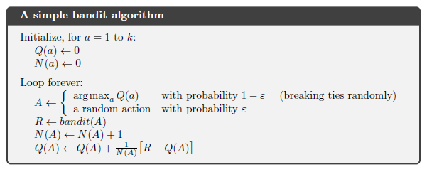

## Multi-Armed Bandits: A Stepping Stone to Reinforcement Learning

### Introdução
O aprendizado por reforço (RL) se distingue de outros paradigmas de aprendizado pelo uso de informações de treinamento que *avaliam* as ações tomadas, em vez de *instruir* fornecendo ações corretas [^1]. Essa característica central impulsiona a necessidade de exploração ativa, buscando explicitamente por comportamentos ótimos. O problema do **k-armed bandit** serve como um ambiente simplificado para estudar esse aspecto avaliativo do RL [^1]. Este capítulo se concentra nessa formulação mais simples, oferecendo uma base sólida para abordar os desafios mais complexos inerentes ao RL completo. Ao evitar o aprendizado de ações em múltiplos contextos, o k-armed bandit permite uma análise clara dos métodos fundamentais que podem ser estendidos para resolver problemas mais complexos [^1].

### Conceitos Fundamentais
No cerne do problema do k-armed bandit reside a repetida escolha entre *k* opções distintas, ou **ações** [^2]. Após cada escolha, um agente recebe uma *recompensa numérica* retirada de uma distribuição de probabilidade estacionária que depende da ação selecionada [^2]. O objetivo primordial é maximizar a recompensa total esperada ao longo de um determinado período de tempo, como 1000 seleções de ação [^2].

**Definição Formal**
Seja $A_t$ a ação selecionada no passo de tempo *t*, e $R_t$ a recompensa correspondente. O valor de uma ação arbitrária *a*, denotado por $q_*(a)$, é a recompensa esperada dado que *a* é selecionada [^2]:
$$q_*(a) = \mathbb{E}[R_t | A_t = a]$$
O problema do k-armed bandit reside na incerteza sobre os valores de cada ação [^2]. Embora o agente possa não conhecer os valores de ação com certeza, ele mantém *estimativas*, denotadas por $Q_t(a)$, que representam o valor estimado da ação *a* no passo de tempo *t* [^2]. O objetivo é fazer com que $Q_t(a)$ se aproxime o máximo possível de $q_*(a)$ [^2].

> 💡 **Exemplo Numérico:** Imagine um k-armed bandit com k=5. Os valores verdadeiros (desconhecidos para o agente) das ações são: $q_*(1) = 0.2$, $q_*(2) = -0.5$, $q_*(3) = 1.0$, $q_*(4) = 0.0$, $q_*(5) = -0.1$. O objetivo do agente é aprender essas recompensas esperadas selecionando as ações repetidamente.

**Exploração vs. Explotação**
Em qualquer passo de tempo, o agente deve decidir entre *explorar* as ações menos conhecidas para refinar suas estimativas, ou *explorar* a ação com o valor estimado mais alto [^2]. As ações com o maior valor estimado atual são chamadas de **ações gananciosas** [^2]. A explotação maximiza a recompensa esperada imediata, enquanto a exploração pode produzir uma recompensa total maior a longo prazo [^2].

*Suponha que uma ação gananciosa tenha um valor conhecido com certeza, enquanto várias outras ações são estimadas como quase tão boas, mas com incerteza substancial. Pelo menos uma dessas outras ações provavelmente é melhor do que a ação gananciosa, mas o agente não sabe qual delas. Se o agente tem muitos passos de tempo para selecionar ações, pode ser melhor explorar as ações não gananciosas e descobrir quais delas são melhores do que a ação gananciosa*[^2].

O dilema de **exploração versus explotação** é um desafio fundamental no aprendizado por reforço. A escolha entre os dois depende de uma forma complexa nos valores precisos das estimativas, nas incertezas e no número de etapas restantes [^2].

**Métodos de seleção de ação**
Uma abordagem para balancear exploração e explotação é o método $\epsilon$-greedy [^3]. Com probabilidade $\epsilon$, o agente seleciona uma ação aleatoriamente, independentemente das estimativas de valor [^3]. Caso contrário, o agente escolhe a ação gananciosa [^3]. Embora essa abordagem seja simples, ela garante que, no limite, todas as ações sejam amostradas um número infinito de vezes, levando à convergência de $Q_t(a)$ para $q_*(a)$ [^3].

> 💡 **Exemplo Numérico:** Seja $\epsilon = 0.1$. Isso significa que em 10% das vezes, o agente escolherá uma ação aleatoriamente, e em 90% das vezes escolherá a ação com a maior estimativa de valor. Se as estimativas atuais de valor forem $Q_t(1) = 0.1$, $Q_t(2) = -0.2$, $Q_t(3) = 0.5$, $Q_t(4) = 0.0$, $Q_t(5) = 0.2$, então a ação gananciosa é a ação 3. Em um determinado passo de tempo, um número aleatório é gerado. Se esse número for menor que 0.1, uma ação é escolhida aleatoriamente. Caso contrário, a ação 3 é escolhida.

Uma alternativa ao método $\epsilon$-greedy é o método **softmax**, que utiliza uma distribuição de probabilidade sobre as ações baseada em suas estimativas de valor.

**Definição** (Softmax Action Selection)
A probabilidade de selecionar a ação *a* no tempo *t* sob a política softmax é dada por:
$$P(A_t = a) = \frac{e^{Q_t(a) / \tau}}{\sum_{b=1}^{k} e^{Q_t(b) / \tau}}$$
onde $\tau$ é um parâmetro de temperatura que controla a aleatoriedade da seleção de ação. Quando $\tau$ é alto, todas as ações têm aproximadamente a mesma probabilidade de serem selecionadas, incentivando a exploração. Quando $\tau$ é baixo, a ação com o valor estimado mais alto é selecionada com alta probabilidade, incentivando a explotação.

> 💡 **Exemplo Numérico:** Considere o mesmo cenário do exemplo anterior, com $Q_t(1) = 0.1$, $Q_t(2) = -0.2$, $Q_t(3) = 0.5$, $Q_t(4) = 0.0$, $Q_t(5) = 0.2$. Seja $\tau = 0.5$. As probabilidades de selecionar cada ação são calculadas da seguinte forma:
>
> $P(A_t = 1) = \frac{e^{0.1 / 0.5}}{e^{0.1 / 0.5} + e^{-0.2 / 0.5} + e^{0.5 / 0.5} + e^{0.0 / 0.5} + e^{0.2 / 0.5}} \approx \frac{1.22}{1.22 + 0.67 + 2.72 + 1.00 + 1.49} \approx 0.145$
>
> $P(A_t = 2) = \frac{e^{-0.2 / 0.5}}{e^{0.1 / 0.5} + e^{-0.2 / 0.5} + e^{0.5 / 0.5} + e^{0.0 / 0.5} + e^{0.2 / 0.5}} \approx \frac{0.67}{1.22 + 0.67 + 2.72 + 1.00 + 1.49} \approx 0.080$
>
> $P(A_t = 3) = \frac{e^{0.5 / 0.5}}{e^{0.1 / 0.5} + e^{-0.2 / 0.5} + e^{0.5 / 0.5} + e^{0.0 / 0.5} + e^{0.2 / 0.5}} \approx \frac{2.72}{1.22 + 0.67 + 2.72 + 1.00 + 1.49} \approx 0.324$
>
> $P(A_t = 4) = \frac{e^{0.0 / 0.5}}{e^{0.1 / 0.5} + e^{-0.2 / 0.5} + e^{0.5 / 0.5} + e^{0.0 / 0.5} + e^{0.2 / 0.5}} \approx \frac{1.00}{1.22 + 0.67 + 2.72 + 1.00 + 1.49} \approx 0.119$
>
> $P(A_t = 5) = \frac{e^{0.2 / 0.5}}{e^{0.1 / 0.5} + e^{-0.2 / 0.5} + e^{0.5 / 0.5} + e^{0.0 / 0.5} + e^{0.2 / 0.5}} \approx \frac{1.49}{1.22 + 0.67 + 2.72 + 1.00 + 1.49} \approx 0.177$
>
> A ação é então selecionada com base nessas probabilidades. Observe que a ação 3, que tem a maior estimativa de valor, também tem a maior probabilidade de ser selecionada.

**Observação:** O método softmax generaliza a política $\epsilon$-greedy. À medida que $\tau \to 0$, a política softmax se aproxima de uma política puramente gananciosa.  Além disso, a escolha adequada do parâmetro $\tau$ pode, em alguns casos, levar a um desempenho superior em comparação com a estratégia $\epsilon$-greedy.

**Métodos de valor de ação**
Os métodos de valor de ação estimam os valores das ações e usam essas estimativas para tomar decisões de seleção de ação [^3]. Um método natural para estimar o valor de uma ação é fazer a média das recompensas realmente recebidas [^3]:
$$Q_t(a) = \frac{\text{soma das recompensas quando a foi tomada antes de t}}{\text{número de vezes que a foi tomada antes de t}} = \frac{\sum_{i=1}^{t-1} R_i \mathbb{1}_{A_i = a}}{\sum_{i=1}^{t-1} \mathbb{1}_{A_i = a}}$$
onde $\mathbb{1}_{\text{predicate}}$ denota a variável aleatória que é 1 se o predicado for verdadeiro e 0 se não for [^3]. Se o denominador for zero, então definimos $Q_t(a)$ como algum valor padrão, como 0 [^3]. À medida que o denominador tende ao infinito, pela lei dos grandes números, $Q_t(a)$ converge para $q_*(a)$ [^3].

> 💡 **Exemplo Numérico:** Suponha que a ação 1 tenha sido selecionada 3 vezes e as recompensas recebidas tenham sido 0.5, 0.2 e 0.8. Então, a estimativa de valor para a ação 1 é: $Q_t(1) = \frac{0.5 + 0.2 + 0.8}{3} = \frac{1.5}{3} = 0.5$.

Para implementar este cálculo de forma eficiente, podemos usar uma atualização incremental [^3]. Seja $N_t(a)$ o número de vezes que a ação *a* foi selecionada antes do tempo *t*. Então podemos reescrever a equação acima como:
$$Q_t(a) = \frac{1}{N_t(a)} \sum_{i=1}^{t-1} R_i \mathbb{1}_{A_i = a}$$
Quando a ação *a* é selecionada no tempo *t*, $Q_{t+1}(a)$ pode ser atualizado incrementalmente como:
$$Q_{t+1}(a) = Q_t(a) + \frac{1}{N_t(a) + 1} [R_t - Q_t(a)]$$
Essa atualização incremental evita a necessidade de armazenar todas as recompensas passadas para cada ação, tornando o cálculo mais eficiente em termos de memória [^3].

**Lema 1** (Atualização Incremental)
A atualização incremental acima é equivalente ao cálculo da média amostral.
*Prova:*
Seja $Q_t(a)$ a média amostral das recompensas para a ação *a* após *t-1* seleções. Então,
$$Q_t(a) = \frac{\sum_{i=1}^{t-1} R_i \mathbb{1}_{A_i = a}}{N_t(a)}$$
Quando a ação *a* é selecionada no tempo *t*, temos:
$$Q_{t+1}(a) = \frac{\sum_{i=1}^{t} R_i \mathbb{1}_{A_i = a}}{N_t(a)+1} = \frac{\sum_{i=1}^{t-1} R_i \mathbb{1}_{A_i = a} + R_t}{N_t(a)+1}$$
$$= \frac{N_t(a) Q_t(a) + R_t}{N_t(a)+1} = \frac{N_t(a) Q_t(a) + R_t + Q_t(a) - Q_t(a)}{N_t(a)+1}$$
$$= Q_t(a) + \frac{R_t - Q_t(a)}{N_t(a)+1}$$
Portanto, a atualização incremental é equivalente ao cálculo da média amostral. $\blacksquare$

> 💡 **Exemplo Numérico:** Continuando o exemplo anterior, suponha que a ação 1 seja selecionada novamente e a recompensa recebida seja 0.6. Usando a atualização incremental, temos: $Q_{t+1}(1) = 0.5 + \frac{0.6 - 0.5}{3 + 1} = 0.5 + \frac{0.1}{4} = 0.5 + 0.025 = 0.525$.

Outra técnica para estimar os valores das ações é usar uma **taxa de aprendizado** $\alpha$ constante [^3]. Neste caso, a atualização para $Q_{t+1}(a)$ é dada por:
$$Q_{t+1}(a) = Q_t(a) + \alpha [R_t - Q_t(a)]$$
onde $\alpha \in (0, 1]$ é a taxa de aprendizado. Esta abordagem atribui mais peso às recompensas recentes, permitindo que o agente se adapte a ambientes não-estacionários [^3].

> 💡 **Exemplo Numérico:** Usando o mesmo exemplo anterior, com $Q_t(1) = 0.5$ e a recompensa recebida $R_t = 0.6$, e definindo $\alpha = 0.1$, temos: $Q_{t+1}(1) = 0.5 + 0.1 [0.6 - 0.5] = 0.5 + 0.1 [0.1] = 0.5 + 0.01 = 0.51$. Observe que a atualização é menor do que com a média amostral, dando mais peso às estimativas anteriores.

**Lema 2** (Média Ponderada Exponencialmente)
A atualização com uma taxa de aprendizado constante $\alpha$ calcula uma média ponderada exponencialmente das recompensas passadas.
*Prova:*
Começamos expandindo recursivamente a equação de atualização:
I.  $Q_{t+1}(a) = Q_t(a) + \alpha [R_t - Q_t(a)]$

II. $Q_{t+1}(a) = \alpha R_t + (1 - \alpha) Q_t(a)$

III. Expandindo $Q_t(a)$: $Q_{t+1}(a) = \alpha R_{t} + (1 - \alpha)[\alpha R_{t-1} + (1 - \alpha)Q_{t-1}(a)]$

IV. Continuando a expansão recursiva até $Q_1(a)$:
$Q_{t+1}(a) = \alpha R_t + \alpha(1 - \alpha)R_{t-1} + \alpha(1 - \alpha)^2 R_{t-2} + \ldots + \alpha(1 - \alpha)^{t-1}R_1 + (1 - \alpha)^t Q_1(a)$

V. Reescrevendo a equação:
$Q_{t+1}(a) = (1 - \alpha)^t Q_1(a) + \sum_{i=1}^{t} \alpha (1 - \alpha)^{t-i} R_i$

Esta equação mostra que $Q_{t+1}(a)$ é uma média ponderada de todas as recompensas passadas $R_1, \ldots, R_t$ e da estimativa inicial $Q_1(a)$. O peso de cada recompensa diminui exponencialmente com o tempo, sendo $\alpha$ a taxa de decaimento. Portanto, esta é uma média ponderada exponencialmente. $\blacksquare$

**Inicialização Otimista**

Outro método para incentivar a exploração é inicializar as estimativas de valor de ação, $Q_1(a)$, com valores altos [^3]. Isso incentiva o agente a explorar todas as ações inicialmente, pois mesmo as ações com recompensas iniciais baixas ainda terão estimativas de valor relativamente altas.

**Definição** (Inicialização Otimista)
Inicializar as estimativas de valor de ação $Q_1(a)$ com valores significativamente maiores do que as recompensas esperadas.

> 💡 **Exemplo Numérico:** Suponha que as recompensas esperadas para as ações estejam na faixa de 0 a 1. Poderíamos inicializar $Q_1(a) = 5$ para todas as ações. Isso faria com que o agente explorasse todas as ações pelo menos uma vez, pois as primeiras recompensas provavelmente seriam menores que 5, e o agente ajustaria suas estimativas de valor de acordo.

**Observação:** A inicialização otimista é particularmente útil em ambientes estacionários, pois garante uma exploração inicial adequada. No entanto, em ambientes não-estacionários, pode impedir que o agente se adapte rapidamente às mudanças nas distribuições de recompensa.

### Conclusão
O problema do k-armed bandit fornece uma estrutura valiosa para a compreensão dos desafios fundamentais do aprendizado por reforço, particularmente o equilíbrio entre exploração e explotação. Os métodos explorados neste capítulo servem como blocos de construção para o desenvolvimento de algoritmos mais sofisticados que podem lidar com os problemas de RL completos. Ao abstrair as complexidades do aprendizado em múltiplos estados, o k-armed bandit nos permite isolar e estudar os principais mecanismos do aprendizado baseado em avaliação, abrindo caminho para uma compreensão mais profunda do campo do aprendizado por reforço.

### Referências
[^1]: Chapter 2: Multi-armed Bandits, page 25
[^2]: Chapter 2: Multi-armed Bandits, page 26
[^3]: Chapter 2: Multi-armed Bandits, page 27
<!-- END -->