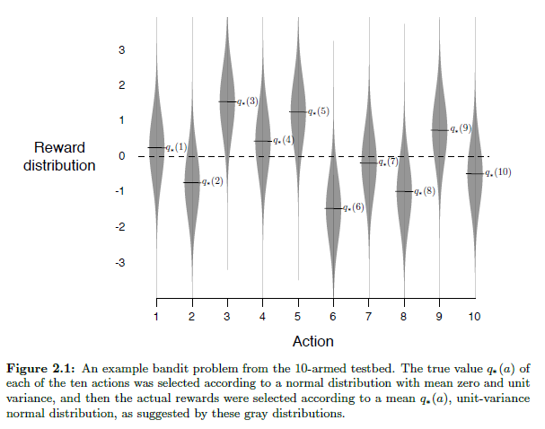
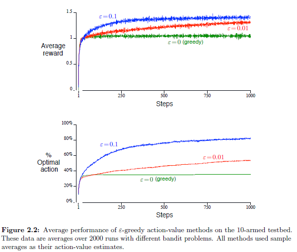
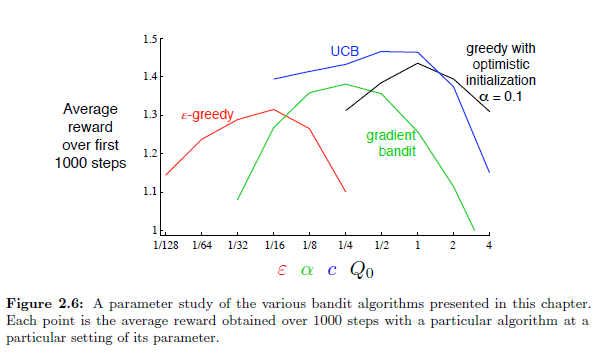
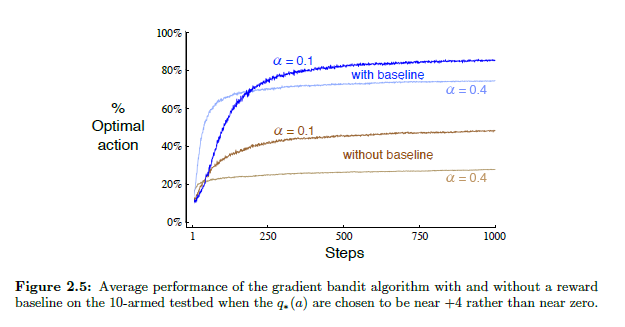

## O Dilema Exploração-Explotação em Bandidos *k*-Braços

### Introdução
No contexto de **aprendizado por reforço (RL)**, o problema do bandido *k*-braços serve como um modelo fundamental para entender o *trade-off* entre **exploração** e **explotação** [^1]. Este capítulo aprofunda o desafio central que reside em equilibrar esses dois aspectos para otimizar a recompensa total esperada ao longo do tempo. A exploração envolve selecionar ações não gananciosas (*non-greedy actions*) para melhorar a precisão das estimativas de valor, enquanto a explotação implica escolher ações gananciosas (*greedy actions*) para maximizar a recompensa imediata [^2]. O sucesso a longo prazo neste cenário depende crucialmente de uma estratégia eficaz para navegar essa dicotomia.

> 💡 **Exemplo Numérico:** Imagine um cassino com 3 máquinas caça-níqueis (*k*=3). Inicialmente, não sabemos as probabilidades de vitória de cada máquina. Precisamos decidir se jogamos na máquina que pareceu dar mais prêmios até agora (explotação) ou se tentamos as outras máquinas para ver se alguma delas é ainda melhor (exploração). Este simples cenário captura a essência do dilema exploração-explotação.

### O Dilema Exploração-Explotação
O aprendizado por reforço distingue-se de outras formas de aprendizado por utilizar informações de treinamento que *avaliam* as ações tomadas em vez de *instruir* fornecendo ações corretas [^1]. Esse aspecto é crucial para a necessidade de **exploração ativa**, uma busca explícita por um bom comportamento. O *feedback* puramente avaliativo indica a qualidade da ação tomada, mas não se essa ação foi a melhor ou a pior possível. Em contraste, o *feedback* puramente instrutivo indica a ação correta a ser tomada, independentemente da ação realmente realizada [^1].

No problema do bandido *k*-braços, cada uma das *k* ações tem uma recompensa esperada ou média quando selecionada, denotada como o valor dessa ação [^2]. Se o valor de cada ação fosse conhecido, a solução seria trivial: sempre selecionar a ação com o valor mais alto. No entanto, na maioria dos casos, esses valores são desconhecidos, e o agente deve *estimá-los* ao longo do tempo. A estimativa do valor da ação *a* no instante *t* é denotada como $Q_t(a)$. O objetivo é que $Q_t(a)$ se aproxime de $q_*(a)$, o valor real da ação [^2].



Quando um agente mantém estimativas dos valores das ações, sempre haverá pelo menos uma ação cujo valor estimado é o maior. Essas são as **ações gananciosas** [^2]. Selecionar uma dessas ações é **explotação**: o agente está usando seu conhecimento atual para maximizar a recompensa imediata. No entanto, selecionar uma das ações *não gananciosas* é **exploração**, pois permite que o agente refine sua estimativa do valor da ação não gananciosa [^2].

*   **Explotação:** Maximiza a recompensa esperada em um único passo.
*   **Exploração:** Pode produzir uma recompensa total maior a longo prazo, descobrindo ações melhores.

Por exemplo, suponha que o valor de uma ação gananciosa seja conhecido com certeza, enquanto outras ações são estimadas como quase tão boas, mas com incerteza substancial. Uma dessas ações pode ser melhor que a ação gananciosa, mas o agente não sabe qual. Se houver muitos passos restantes, explorar as ações não gananciosas pode revelar ações melhores, aumentando a recompensa total [^2].

Para formalizar a ideia de otimização a longo prazo, considere o conceito de *arrependimento*. O arrependimento mede a diferença entre a recompensa obtida e a recompensa que teria sido obtida se a ação ótima fosse sempre selecionada.

**Definição:** O *arrependimento* no tempo *t* é definido como:

$$
R_t = \sum_{i=1}^{t} [q_* - Q_i(A_i)]
$$

onde $q_* = \max_a q_*(a)$ é o valor da ação ótima e $A_i$ é a ação selecionada no tempo *i*. Minimizar o arrependimento acumulado ao longo do tempo é um objetivo fundamental no aprendizado por reforço, especialmente em ambientes com o dilema exploração-explotação.

> 💡 **Exemplo Numérico:** Suponha que a máquina caça-níqueis ideal tenha uma recompensa média de $q_* = 10$. Se jogarmos uma máquina sub-ótima que rende uma recompensa de $Q_i(A_i) = 5$ no tempo $i$, o arrependimento para aquele instante seria $10 - 5 = 5$. O arrependimento acumulado ao longo do tempo é a soma de todas essas diferenças. Se jogarmos a máquina sub-ótima por 10 rodadas, o arrependimento acumulado seria $5 \times 10 = 50$.

#### Métodos *ɛ*-Gananciosos
Uma abordagem simples para equilibrar exploração e explotação é o método *ɛ*-ganancioso [^3]. Na maioria das vezes, o agente se comporta de forma gananciosa, selecionando a ação com o valor estimado mais alto. No entanto, com uma pequena probabilidade *ɛ*, o agente seleciona uma ação aleatoriamente, independentemente das estimativas de valor [^3]. Isso garante que todas as ações sejam amostradas infinitas vezes, levando à convergência de $Q_t(a)$ para $q_*(a)$ [^3].

> 💡 **Exemplo Numérico:** Se definirmos $\epsilon = 0.1$, isso significa que em 90% das vezes, escolheremos a máquina caça-níqueis que parece melhor (explotação). Nos restantes 10% das vezes, escolheremos uma máquina aleatória (exploração), para garantir que não estamos a perder uma máquina ainda melhor.

Um problema comum com o método $\epsilon$-ganancioso é que ele aloca a mesma probabilidade de exploração para todas as ações não gananciosas, mesmo que algumas dessas ações já tenham sido exploradas o suficiente. Uma possível melhoria é diminuir $\epsilon$ ao longo do tempo.

**Proposição 1:** Considere uma variação do método $\epsilon$-ganancioso onde $\epsilon$ diminui com o tempo, dado por $\epsilon_t = \frac{1}{t}$. Então, a probabilidade de explorar diminui à medida que o agente aprende mais sobre o ambiente.

**Prova:** A prova é direta, pois à medida que *t* aumenta, $\epsilon_t$ se aproxima de 0, reduzindo a exploração e aumentando a explotação.

I. Seja $\epsilon_t = \frac{1}{t}$ a probabilidade de explorar no tempo *t*.

II. À medida que *t* aumenta, o valor de $\frac{1}{t}$ diminui.

III. Portanto, $\lim_{t \to \infty} \epsilon_t = \lim_{t \to \infty} \frac{1}{t} = 0$.

IV. Isso significa que a probabilidade de explorar se aproxima de zero à medida que o tempo aumenta, indicando uma mudança gradual da exploração para a explotação. ■

> 💡 **Exemplo Numérico:** No início da nossa aventura no cassino, quando $t = 1$, temos $\epsilon_1 = \frac{1}{1} = 1$, significando que exploramos 100% das vezes. Depois de 100 rodadas, $\epsilon_{100} = \frac{1}{100} = 0.01$, então exploramos apenas 1% das vezes e explotamos as restantes 99%. Isto reflete a ideia de que, com o tempo, temos mais confiança nas nossas estimativas e devemos explorar menos.

Além disso, podemos considerar uma variante do método $\epsilon$-ganancioso que prioriza a exploração de ações com maior incerteza, similar ao espírito do UCB.

**Algoritmo $\epsilon$-Ganancioso com Incerteza:**
1.  Inicialize $Q_t(a)$ e $N_t(a)$ para todas as ações *a*.
2.  Para cada passo *t*:
    *   Com probabilidade $\epsilon$:
        *   Selecione a ação *a* que maximize $Q_t(a) + c \sqrt{\frac{1}{N_t(a)}}$, onde *c* é um parâmetro de ajuste.
    *   Com probabilidade $1 - \epsilon$:
        *   Selecione a ação $a = \underset{a}{\operatorname{argmax}} Q_t(a)$.
    *   Atualize $Q_t(a)$ e $N_t(a)$ com base na recompensa recebida.

Este algoritmo combina os benefícios da exploração $\epsilon$-gananciosa com a seleção baseada em incerteza, potencialmente acelerando o aprendizado.

> 💡 **Exemplo Numérico:** Digamos que temos duas máquinas caça-níqueis. A máquina A foi jogada 100 vezes e tem uma recompensa média estimada de $Q_t(A) = 7$. A máquina B foi jogada apenas 10 vezes e tem uma recompensa média estimada de $Q_t(B) = 6$. Se $c = 1$, o termo de incerteza para A é $\sqrt{\frac{1}{100}} = 0.1$, e para B é $\sqrt{\frac{1}{10}} \approx 0.32$. Então, o valor a ser maximizado para A é $7 + 0.1 = 7.1$, e para B é $6 + 0.32 = 6.32$. Mesmo que a recompensa média estimada de A seja maior, o termo de incerteza de B pode torná-la uma opção mais atraente para exploração.


#### Upper-Confidence-Bound (UCB) Action Selection
A seleção de ação *Upper-Confidence-Bound (UCB)* é outra técnica que equilibra exploração e explotação considerando a incerteza nas estimativas de valor das ações [^7]. A ideia principal é selecionar ações de acordo com:

$$
A_t = \underset{a}{\operatorname{argmax}} \left[ Q_t(a) + c \sqrt{\frac{\ln t}{N_t(a)}} \right]
$$

onde:
*   $Q_t(a)$ é a estimativa do valor da ação $a$ no tempo $t$.
*   $N_t(a)$ é o número de vezes que a ação $a$ foi selecionada antes do tempo $t$.
*   $c > 0$ controla o grau de exploração.
*   $\ln t$ é o logaritmo natural de $t$.

O termo $\sqrt{\frac{\ln t}{N_t(a)}}$ é uma medida da incerteza ou variância na estimativa do valor da ação. A ação selecionada é aquela que maximiza um limite superior no possível valor verdadeiro da ação. Cada vez que uma ação é selecionada, sua incerteza presumivelmente diminui, levando a uma seleção menos frequente no futuro. Por outro lado, as ações que não são selecionadas com frequência têm um termo de incerteza maior, tornando-as mais propensas a serem exploradas [^7].

**Lema 1:** O algoritmo UCB garante que cada ação seja selecionada pelo menos uma vez.

**Prova:** Inicialmente, $N_t(a) = 0$ para todas as ações. Portanto, o termo de incerteza $\sqrt{\frac{\ln t}{N_t(a)}}$ é infinito. O algoritmo argmax garante que cada ação seja selecionada pelo menos uma vez para resolver a divisão por zero, efetivamente inicializando a exploração.

I. No instante inicial, $N_t(a) = 0$ para todas as ações $a$.

II. O termo de incerteza para cada ação $a$ é dado por $c \sqrt{\frac{\ln t}{N_t(a)}}$.

III. Substituindo $N_t(a) = 0$ no termo de incerteza, temos $c \sqrt{\frac{\ln t}{0}}$, que tende ao infinito.

IV. Portanto, $Q_t(a) + c \sqrt{\frac{\ln t}{N_t(a)}}$ é infinito para todas as ações inicialmente.

V. O algoritmo $\underset{a}{\operatorname{argmax}}$ selecionará uma ação arbitrariamente, digamos $a_1$, para resolver a forma indefinida.

VI. Após a primeira seleção, $N_t(a_1) > 0$, enquanto outras ações $a_i$ (onde $i \neq 1$) ainda têm $N_t(a_i) = 0$.

VII. No próximo passo, o termo de incerteza para as ações não selecionadas permanece infinito, garantindo que elas sejam selecionadas em algum momento.

VIII. Este processo continua até que todas as ações tenham sido selecionadas pelo menos uma vez. ■

> 💡 **Exemplo Numérico:** Vamos considerar o instante $t = 10$. Temos três máquinas caça-níqueis. A máquina A foi jogada 5 vezes e tem uma recompensa média estimada de $Q_{10}(A) = 6$. A máquina B foi jogada 2 vezes e tem uma recompensa média estimada de $Q_{10}(B) = 8$. A máquina C foi jogada 3 vezes e tem uma recompensa média estimada de $Q_{10}(C) = 7$. Se definirmos $c = 0.5$, calcularemos o termo UCB para cada máquina:
>
> *   Máquina A: $0.5 \times \sqrt{\frac{\ln 10}{5}} \approx 0.5 \times \sqrt{\frac{2.3}{5}} \approx 0.34$
> *   Máquina B: $0.5 \times \sqrt{\frac{\ln 10}{2}} \approx 0.5 \times \sqrt{\frac{2.3}{2}} \approx 0.54$
> *   Máquina C: $0.5 \times \sqrt{\frac{\ln 10}{3}} \approx 0.5 \times \sqrt{\frac{2.3}{3}} \approx 0.44$
>
> Agora, adicionamos o termo UCB à recompensa média estimada para cada máquina:
>
> *   Máquina A: $6 + 0.34 = 6.34$
> *   Máquina B: $8 + 0.54 = 8.54$
> *   Máquina C: $7 + 0.44 = 7.44$
>
> Neste caso, a Máquina B tem o maior valor UCB (8.54), mesmo tendo sido jogada menos vezes, devido à sua maior incerteza. Portanto, o algoritmo UCB selecionaria a Máquina B no instante $t = 10$.


Uma alternativa ao UCB é o algoritmo *Thompson Sampling*, que usa uma abordagem Bayesiana para equilibrar exploração e explotação.

**Breve descrição do Thompson Sampling:**

No Thompson Sampling, cada ação é modelada com uma distribuição de probabilidade (tipicamente uma Beta ou Gaussiana) que representa a crença sobre o valor da ação. Em cada passo, uma amostra é retirada da distribuição de cada ação, e a ação com a maior amostra é selecionada. Após observar a recompensa, a distribuição da ação selecionada é atualizada usando inferência Bayesiana. Este método naturalmente equilibra exploração e explotação, pois ações com alta incerteza (variância alta) têm maior probabilidade de serem amostradas com valores altos, incentivando a exploração, enquanto ações com alta média tendem a ser exploradas.

> 💡 **Exemplo Numérico:** Para cada máquina caça-níqueis, mantemos uma distribuição Beta que representa nossa crença sobre sua probabilidade de sucesso. No início, ambas as distribuições Beta podem ser Beta(1, 1), representando total incerteza. Após jogarmos a máquina A algumas vezes e observarmos 3 sucessos e 2 falhas, sua distribuição Beta se torna Beta(4, 3). Para a máquina B, após 1 sucesso e 4 falhas, sua distribuição Beta se torna Beta(2, 5). Em cada rodada, amostramos um valor aleatório de cada distribuição Beta. A máquina com o valor amostrado mais alto é a selecionada para ser jogada. A distribuição da máquina jogada é então atualizada com base no resultado da jogada (sucesso ou falha). A beleza desse método é que ele automaticamente explora ações com distribuições amplas (alta incerteza) e explora ações com médias altas.
> ```python
> import numpy as np
> import matplotlib.pyplot as plt
> from scipy.stats import beta
>
> # Inicializar distribuições Beta para duas máquinas caça-níqueis
> alpha_A, beta_A = 1, 1 # Inicialmente incerto sobre a máquina A
> alpha_B, beta_B = 1, 1 # Inicialmente incerto sobre a máquina B
>
> # Simular 100 rodadas
> num_rodadas = 100
> recompensas_A = []
> recompensas_B = []
>
> plt.figure(figsize=(12, 6))
> plt.title("Thompson Sampling - Atualização da Distribuição Beta")
>
> for rodada in range(num_rodadas):
>     # Amostrar das distribuições Beta
>     amostra_A = beta.rvs(alpha_A, beta_A, size=1)[0]
>     amostra_B = beta.rvs(alpha_B, beta_B, size=1)[0]
>
>     # Escolher a máquina com a maior amostra
>     if amostra_A > amostra_B:
>         # Simular recompensa (sucesso com probabilidade 0.6)
>         recompensa = np.random.choice([0, 1], p=[0.4, 0.6])
>         recompensas_A.append(recompensa)
>         alpha_A += recompensa
>         beta_A += (1 - recompensa)
>     else:
>         # Simular recompensa (sucesso com probabilidade 0.4)
>         recompensa = np.random.choice([0, 1], p=[0.6, 0.4])
>         recompensas_B.append(recompensa)
>         alpha_B += recompensa
>         beta_B += (1 - recompensa)
>
>     # Plotar as distribuições Beta a cada 20 rodadas
>     if (rodada + 1) % 20 == 0:
>         x = np.linspace(0, 1, 100)
>         plt.plot(x, beta.pdf(x, alpha_A, beta_A), label=f'A (Rodada {rodada+1})', color='blue', alpha=0.7)
>         plt.plot(x, beta.pdf(x, alpha_B, beta_B), label=f'B (Rodada {rodada+1})', color='red', alpha=0.7)
>
> plt.xlabel("Probabilidade de Sucesso")
> plt.ylabel("Densidade")
> plt.legend()
> plt.grid(True)
> plt.show()
>
> print(f"Sucessos da máquina A: {sum(recompensas_A)}, Falhas: {len(recompensas_A) - sum(recompensas_A)}")
> print(f"Sucessos da máquina B: {sum(recompensas_B)}, Falhas: {len(recompensas_B) - sum(recompensas_B)}")
> ```
> Este código simula o Thompson Sampling com duas máquinas caça-níqueis, exibindo como as distribuições Beta são atualizadas com base nas recompensas observadas. A visualização mostra a mudança nas distribuições ao longo do tempo, ilustrando o aprendizado do algoritmo sobre a probabilidade de sucesso de cada máquina.









### Conclusão
O dilema exploração-explotação é um desafio fundamental no aprendizado por reforço, especialmente no contexto de problemas de bandidos *k*-braços [^1]. Alcançar um equilíbrio ideal entre esses dois aspectos é crucial para maximizar a recompensa total esperada ao longo do tempo [^2]. Métodos como os métodos *ɛ*-gananciosos e a seleção de ação *Upper-Confidence-Bound (UCB)* fornecem abordagens eficazes para enfrentar esse dilema, cada um com seus próprios pontos fortes e limitações [^3, 7]. A escolha do método depende das características específicas do problema e do compromisso desejado entre exploração e explotação.
Entender e resolver o *trade-off* exploração-explotação é fundamental para o projeto de sistemas de aprendizado por reforço eficazes, não apenas em cenários simplificados como o problema do bandido *k*-braços, mas também nos ambientes de tomada de decisão complexos do mundo real.

### Referências
[^1]: Capítulo 2: Multi-armed Bandits, Introdução.
[^2]: Capítulo 2: Multi-armed Bandits, Seção 2.1.
[^3]: Capítulo 2: Multi-armed Bandits, Seção 2.2.
[^7]: Capítulo 2: Multi-armed Bandits, Seção 2.7.
<!-- END -->