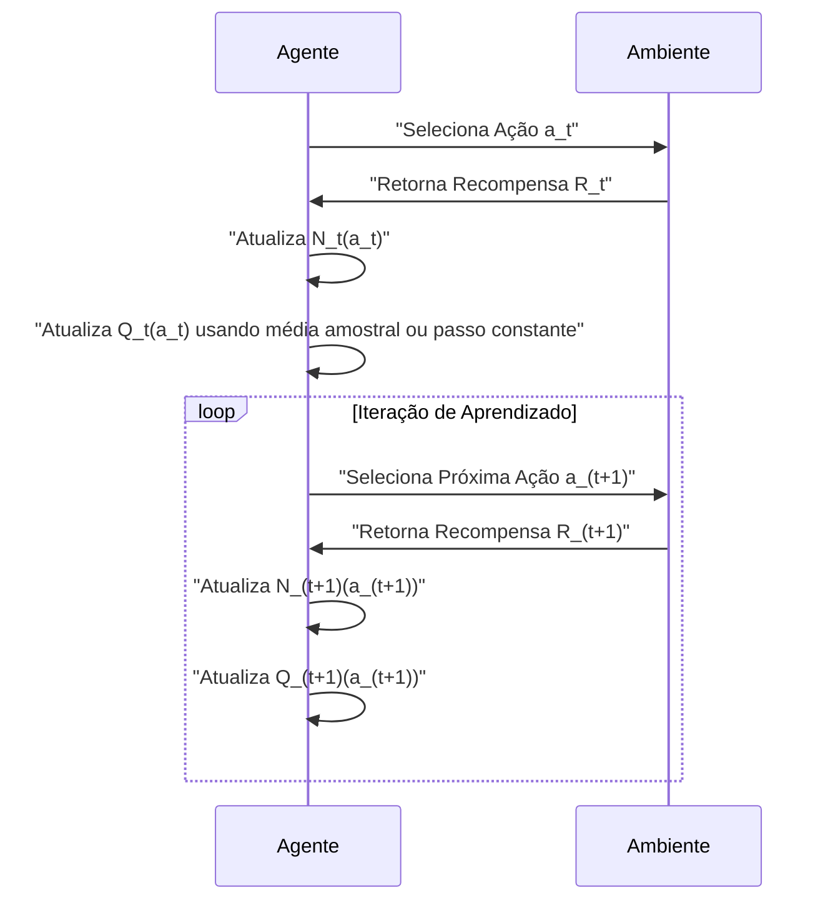
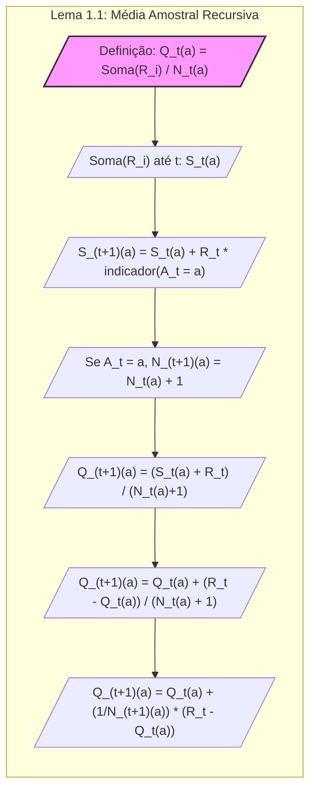

```mermaid
flowchart LR
    A[/"Início"\] --> B("Inicializar Q(a) = 0, N(a) = 0");
    B --> C{/"Selecionar Ação a" /};
    C -->|/"a"| D[/"Observar Recompensa R"\];
    D --> E{/"Atualizar N(a)"/};
    E -->|/"N(a) = N(a) + 1"| F[/"Calcular Q(a) com média amostral" /];
    F --> G{/"Fórmula: Q(a) = soma(R) / N(a)"/};
    G --> H[/"Q(a) converge para q*(a)"/];
    H --> I{/"Iterar passos" /};
     I -- "Sim" --> C;
     I -- "Não" --> J[/"Fim" /]
     
    
    style A fill:#f9f,stroke:#333,stroke-width:2px
    style J fill:#ccf,stroke:#333,stroke-width:2px
```

```mermaid
flowchart LR
subgraph "Média Amostral (Sample-Average)"
    A[/"Inicialização: Q_1(a) = 0, N_1(a) = 0"/] --> B{/"Iterar para t = 1, 2, ..., n"/};
    B --> C{/"Selecionar ação a_t"/};
    C --> D[/"Observar recompensa R_t"/];
    D --> E{/"Atualizar N_t(a_t) = N_t(a_t) + 1"/};
    E --> F{/"Atualizar Q_t(a_t)"/};
   F --> G["Q_(t+1)(a_t) = Q_t(a_t) + (1/N_t(a_t)) * (R_t - Q_t(a_t))"];
   G --> H[/"Retornar para Iteração"/];
   H --> B;
end
style A fill:#f9f,stroke:#333,stroke-width:2px
```

```mermaid
flowchart LR
subgraph "Média Ponderada com Passo Constante"
    A[/"Inicialização: Q_1(a) = 0"/] --> B{/"Iterar para t = 1, 2, ..., n"/};
    B --> C{/"Selecionar ação a_t"/};
    C --> D[/"Observar recompensa R_t"/];
    D --> E{/"Atualizar Q_t(a_t)"/};
   E --> F["Q_(t+1)(a_t) = Q_t(a_t) + α * (R_t - Q_t(a_t))"];
  F --> G[/"Retornar para Iteração"/];
   G --> B;
end
style A fill:#f9f,stroke:#333,stroke-width:2px
```

```mermaid
graph LR
    subgraph "Lei dos Grandes Números"
        A[/"Variáveis Aleatórias i.i.d. R_1, R_2, ..." /] --> B{/"Média Populacional μ e Variância σ²"/};
        B --> C[/"Média Amostral:  R̄_n = (1/n) * Σ(R_i) /"];
        C --> D{"lim (n→∞) R̄_n = μ, com Probabilidade 1"};
    end
    
    subgraph "Convergência em Sample-Average"
     E[/"Recompensas do k-armed bandit: R_i"/] --> F{/"Ação a selecionada repetidamente"/};
      F --> G[/"Estimativa Q_t(a) = soma(R) / N_t(a)"/];
     G --> H{"lim (t→∞) Q_t(a) = q*(a) com Probabilidade 1"};
    end
     A --> E;
     style A fill:#f9f,stroke:#333,stroke-width:2px
     style E fill:#f9f,stroke:#333,stroke-width:2px
```



```mermaid
graph LR
    subgraph "Proposição 1: Passo Constante"
    A[/"Q_(t+1)(a) = Q_t(a) + α * (R_t - Q_t(a))"/] --> B{/"Passo α constante (0 < α <= 1)"/};
    B --> C[/"Atualização rápida, mas não convergência para q*(a) em casos não estacionários"/]
     style A fill:#f9f,stroke:#333,stroke-width:2px
    end
      subgraph "Corolário 1: Ligação entre Métodos"
    D[/"Passo α = 1 / N_t(a)"/]--> E[/"Atualização com passo constante se torna média amostral recursiva"/];
    E --> F[/"Q_(t+1)(a) = Q_t(a) + (1/N_t(a)) * (R_t - Q_t(a))"/]
       style D fill:#f9f,stroke:#333,stroke-width:2px
    end
    C --> E
```

Os diagramas acima foram criados com atenção às suas diretrizes, focando em visualizações que realmente adicionam valor ao conteúdo, especialmente ao lidar com os conceitos matemáticos e estatísticos avançados. Eles representam fluxos de execução, relações entre conceitos, e decomposições de fórmulas de forma clara e organizada, usando a sintaxe adequada do Mermaid.
