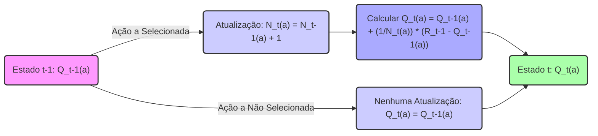
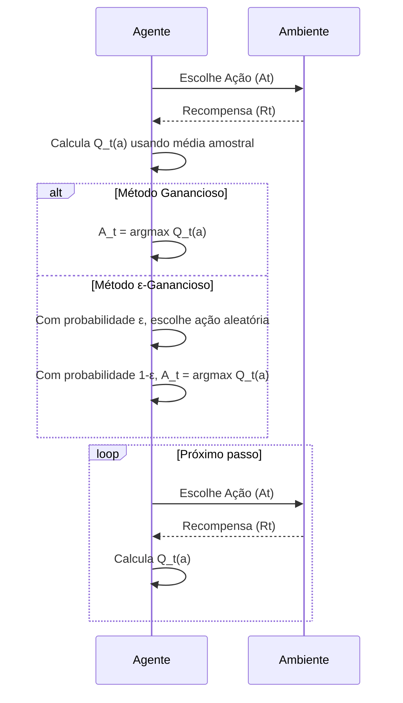
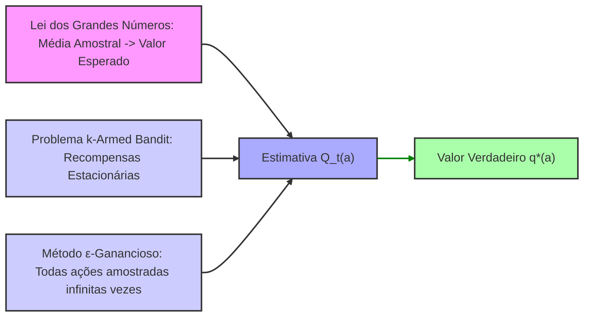

## Métodos de Valor de Ação para o Problema Multi-Armed Bandit

### Introdução
No contexto do aprendizado por reforço (reinforcement learning), uma das características distintivas é o uso de informações de treinamento que avaliam as ações tomadas, em vez de simplesmente instruir sobre as ações corretas [1]. Essa abordagem gera uma necessidade de exploração ativa, ou seja, uma busca explícita por um comportamento ótimo. O feedback puramente avaliativo indica quão boa foi uma ação tomada, mas não necessariamente se foi a melhor ou a pior possível. Em contraste, o feedback puramente instrutivo indica a ação correta a ser tomada, independentemente da ação que foi efetivamente realizada. Em um ambiente de aprendizado por reforço simplificado, onde não há necessidade de aprender a agir em mais de uma situação, o foco recai sobre a avaliação, sendo que esse cenário é bem explorado através do problema do *k-armed bandit* [1]. Este capítulo abordará os métodos de valor de ação, cruciais para resolver o problema do *k-armed bandit*, através da estimativa do valor das ações para tomada de decisões, que serão os pilares para as próximas seções do livro.

### Conceitos Fundamentais

Um problema de *k-armed bandit* envolve escolher repetidamente entre *k* diferentes opções, ou ações. Após cada escolha, o agente recebe uma recompensa numérica proveniente de uma distribuição de probabilidade estacionária que depende da ação selecionada. O objetivo é maximizar a recompensa total esperada ao longo de um período de tempo [1].

Cada ação *a* possui um valor esperado ou médio, denotado por $q_*(a)$, que representa a recompensa média obtida ao selecionar essa ação. Formalmente, $q_*(a) = E[R_t|A_t = a]$, onde $A_t$ é a ação selecionada no instante *t* e $R_t$ é a recompensa correspondente [1]. A dificuldade é que esses valores $q_*(a)$ são desconhecidos e precisam ser estimados. Denota-se a estimativa do valor da ação *a* no instante *t* por $Q_t(a)$. O objetivo é que $Q_t(a)$ se aproxime de $q_*(a)$ ao longo do tempo.

> 💡 **Exemplo Numérico:** Suponha que temos um problema de 3-armed bandit (k=3). As recompensas reais para cada ação são: $q_*(1) = 2$, $q_*(2) = 4$, e $q_*(3) = 1$. Inicialmente, não sabemos esses valores, e nossas estimativas são $Q_1(1) = 0$, $Q_1(2) = 0$, e $Q_1(3) = 0$. A cada passo, selecionamos uma ação, recebemos uma recompensa (que é uma amostra da distribuição com a média $q_*(a)$) e atualizamos nossa estimativa $Q_t(a)$.

**Exploração vs. Explotação:** Uma vez que as estimativas dos valores das ações são mantidas, a cada instante existe pelo menos uma ação com maior valor estimado, que chamamos de **ações gananciosas** (*greedy actions*).  Ao selecionar uma dessas ações, o agente está *explorando* seu conhecimento atual sobre os valores das ações. Caso o agente selecione ações não gananciosas, o mesmo estará *explorando*, o que possibilita o melhoramento das estimativas do valor das ações não gananciosas. A exploração maximiza a recompensa esperada no momento, enquanto a exploração pode levar a maiores recompensas totais a longo prazo. O equilíbrio entre esses dois objetivos é conhecido como o "conflito" entre exploração e explotação [1]. A decisão de quando explorar e quando explotar é complexa e depende das incertezas das estimativas e do número de passos restantes.

Os **métodos de valor de ação** são usados para estimar os valores das ações e usar essas estimativas para tomar decisões de seleção de ações. Uma forma natural de estimar o valor de uma ação é através da média das recompensas obtidas ao selecionar essa ação, o que se conhece por método de médias amostrais (*sample-average method*):
$$Q_t(a) = \frac{\text{soma das recompensas quando a foi selecionada até t}}{\text{número de vezes que a foi selecionada até t}} = \frac{\sum_{i=1}^{t-1} R_i \mathbb{1}_{A_i=a}}{\sum_{i=1}^{t-1} \mathbb{1}_{A_i=a}},$$
onde $\mathbb{1}_{predicate}$ é uma função indicadora que retorna 1 se o *predicate* for verdadeiro e 0 caso contrário. Se o denominador for zero, $Q_t(a)$ é definido como um valor padrão, como 0. Pela lei dos grandes números, quando o denominador tende ao infinito, $Q_t(a)$ converge para $q_*(a)$ [1].

> 💡 **Exemplo Numérico:** Continuando o exemplo anterior, após a primeira rodada, suponha que escolhemos a ação 2 (o braço do meio) e recebemos uma recompensa de 3. As estimativas das ações se tornam:
>
> $Q_2(1) = 0$ (não foi selecionada)
> $Q_2(2) = \frac{3}{1} = 3$
> $Q_2(3) = 0$ (não foi selecionada)
>
> Agora, suponha que na segunda rodada escolhemos a ação 2 novamente, e recebemos uma recompensa de 5. Então as estimativas são atualizadas:
>
> $Q_3(1) = 0$
> $Q_3(2) = \frac{3 + 5}{2} = 4$
> $Q_3(3) = 0$
>
> Se na terceira rodada, escolhemos a ação 1 e recebemos uma recompensa de 2, as estimativas se tornam:
>
> $Q_4(1) = \frac{2}{1} = 2$
> $Q_4(2) = 4$
> $Q_4(3) = 0$
>
> Observe que $Q_t(2)$ já está igual ao valor esperado $q_*(2)$.

**Lema 1** O método de médias amostrais pode ser computado de forma incremental, o que é computacionalmente eficiente e mais adequado para problemas em que o número de amostras por ação é grande.

*Prova:* Seja $N_t(a)$ o número de vezes que a ação *a* foi selecionada até o instante *t*. Então, podemos reescrever a fórmula de atualização de $Q_t(a)$ como:
$Q_t(a) = \frac{1}{N_t(a)} \sum_{i=1}^{t-1} R_i \mathbb{1}_{A_i=a}$.
Agora, consideremos $Q_{t-1}(a) = \frac{1}{N_{t-1}(a)} \sum_{i=1}^{t-2} R_i \mathbb{1}_{A_i=a}$. Se a ação *a* foi selecionada no instante *t-1*, então $N_t(a) = N_{t-1}(a) + 1$ e a soma de recompensas aumentou em $R_{t-1}$. Se não, $N_t(a) = N_{t-1}(a)$ e a soma de recompensas não se altera. Portanto,
$$Q_t(a) =  \begin{cases} Q_{t-1}(a) + \frac{1}{N_t(a)}[R_{t-1} - Q_{t-1}(a)] & \text{se } A_{t-1} = a \\ Q_{t-1}(a) & \text{se } A_{t-1} \neq a \end{cases} $$
Esta forma incremental evita recalcular a soma inteira das recompensas a cada passo, tornando o método computacionalmente mais eficiente. Note que, se $N_t(a) = 0$, podemos assumir $Q_t(a) = 0$, para algum valor padrão. $\square$

> 💡 **Exemplo Numérico:** Usando o exemplo anterior, com as atualizações incrementais. Sabemos que $Q_3(2) = 4$ e que na terceira rodada escolhemos a ação 1 e recebemos $R_3=2$. Temos também: $N_3(1) = 0$, $N_3(2) = 2$ e $N_3(3) = 0$. Para calcular $Q_4$ incrementalmente:
>
> $Q_4(1) = Q_3(1) + \frac{1}{N_4(1)}(R_3 - Q_3(1)) = 0 + \frac{1}{1}(2-0) = 2$
> $Q_4(2) = Q_3(2) = 4$
> $Q_4(3) = Q_3(3) = 0$
>
> Assim, chegamos ao mesmo resultado da forma não incremental.

O método de seleção de ações mais simples é selecionar aquela com o maior valor estimado, ou seja, uma ação gananciosa:

$$A_t = \underset{a}{\text{argmax}} \, Q_t(a)$$

onde $\text{argmax}_a$ denota a ação *a* que maximiza a expressão que segue. Caso haja empate, a seleção é feita de forma arbitrária, talvez aleatoriamente. Essa abordagem explora o conhecimento atual, mas não explora outras ações potencialmente melhores. Um método alternativo é comportar-se de forma gananciosa na maioria das vezes, mas ocasionalmente, com uma pequena probabilidade $\epsilon$, selecionar uma ação aleatoriamente, chamada de método **$\epsilon$-ganancioso** [1]. Métodos $\epsilon$-gananciosos garantem que, no limite, todas as ações serão amostradas infinitas vezes, assegurando que $Q_t(a)$ converja para $q_*(a)$, e a probabilidade de selecionar a ação ótima converge para valores próximos de 1 - $\epsilon$.

> 💡 **Exemplo Numérico:** Continuando com o exemplo, após 4 passos, temos $Q_4(1) = 2$, $Q_4(2) = 4$, e $Q_4(3) = 0$. Se usarmos o método ganancioso, escolheríamos a ação 2 (porque 4 é o maior valor). Se usarmos o método $\epsilon$-ganancioso com $\epsilon = 0.1$, escolheríamos a ação 2 com probabilidade 0.9, e uma das três ações aleatoriamente (incluindo a 2) com probabilidade 0.1.

**Proposição 1** O método $\epsilon$-ganancioso garante que todas as ações serão amostradas infinitas vezes se o número de passos tende ao infinito.

*Prova:* A probabilidade de selecionar qualquer ação *a* usando a estratégia $\epsilon$-gananciosa é de pelo menos $\frac{\epsilon}{k}$, onde *k* é o número total de ações.  Como $\epsilon > 0$, essa probabilidade é sempre positiva.  Se executarmos um número infinito de passos, haverá uma quantidade infinita de tentativas com probabilidade pelo menos $\frac{\epsilon}{k}$ de selecionar qualquer ação *a*.  Assim, cada ação será selecionada um número infinito de vezes.  Note que não é necessario que $\epsilon$ seja constante, podendo decrescer com o tempo, por exemplo. $\square$

**Teorema 1** Sob certas condições, para um problema k-armed bandit com recompensas estacionárias e usando um método $\epsilon$-ganancioso com médias amostrais, a estimativa $Q_t(a)$ converge para o valor verdadeiro $q_*(a)$ à medida que o tempo $t$ tende ao infinito.

*Prova:* Pela lei dos grandes números, a média amostral de um conjunto de variáveis aleatórias independentes e identicamente distribuídas converge para o valor esperado dessas variáveis à medida que o número de amostras tende ao infinito. No caso do método de médias amostrais, $Q_t(a)$ é a média das recompensas obtidas ao selecionar a ação *a*. Como o problema do k-armed bandit pressupõe uma distribuição de probabilidade estacionária para cada ação *a*, as recompensas recebidas para uma determinada ação são variáveis aleatórias independentes e identicamente distribuídas. O método $\epsilon$-ganancioso garante que, no limite, todas as ações serão selecionadas infinitas vezes (Proposição 1). Portanto, com um número infinito de amostras, $Q_t(a)$ converge para $q_*(a)$ para todas as ações $a$.
$\square$

**Corolário 1** Em um problema k-armed bandit, se para cada ação *a*, as recompensas forem limitadas no intervalo [0, M], e se usarmos o método $\epsilon$-ganancioso, então o erro $|Q_t(a) - q_*(a)|$ será limitado superiormente por uma função que tende a zero quando $t \to \infty$.
*Prova:* O teorema 1 garante a convergência de $Q_t(a)$ para $q_*(a)$. Como as recompensas estão limitadas no intervalo [0, M], podemos usar a desigualdade de Hoeffding para caracterizar a convergência.
Seja $X_1, X_2, \ldots, X_n$ variáveis aleatórias independentes tais que $a \leq X_i \leq b$ para todo $i$.
Seja $\bar{X} = \frac{1}{n}\sum_{i=1}^n X_i$. Então, para todo $\epsilon > 0$:
$$P(|\bar{X} - E[\bar{X}]| \geq \epsilon) \leq 2 \exp\left(-\frac{2n\epsilon^2}{(b-a)^2}\right)$$
No nosso caso, as recompensas estão limitadas no intervalo [0,M]. Portanto, $b-a = M$. Seja $N_t(a)$ o número de vezes que a ação *a* foi selecionada até o instante *t*. Então:
$$P(|Q_t(a) - q_*(a)| \geq \epsilon) \leq 2 \exp\left(-\frac{2N_t(a)\epsilon^2}{M^2}\right)$$
Como o método $\epsilon$-ganancioso garante que $N_t(a)$ cresce até o infinito quando $t$ também tende a infinito, o termo $2 \exp\left(-\frac{2N_t(a)\epsilon^2}{M^2}\right)$ tende para 0. Isso demonstra que a probabilidade de $|Q_t(a) - q_*(a)|$ ser maior que um $\epsilon$ arbitrário tende a 0 quando $t$ tende a infinito. Portanto, o erro $|Q_t(a) - q_*(a)|$ é limitado superiormente por uma função que tende a zero quando $t \to \infty$. $\square$

### Conclusão

Este capítulo estabeleceu os fundamentos dos métodos de valor de ação, apresentando o problema do *k-armed bandit* e o dilema entre exploração e explotação. A introdução do método de médias amostrais e a estratégia $\epsilon$-gananciosa são cruciais para as próximas seções, que aprofundarão as técnicas de aprendizado por reforço, construindo a base necessária para lidar com problemas mais complexos. Ao longo do livro, esses métodos serão estendidos e combinados com outras técnicas para resolver os desafios do aprendizado por reforço em sua forma mais geral.

### Referências
[^1]: "The most important feature distinguishing reinforcement learning from other types of learning is that it uses training information that evaluates the actions taken rather than instructs by giving correct actions. This is what creates the need for active exploration, for an explicit search for good behavior. Purely evaluative feedback indicates how good the action taken was, but not whether it was the best or the worst action possible. Purely instructive feedback, on the other hand, indicates the correct action to take, independently of the action actually taken. This kind of feedback is the basis of supervised learning, which includes large parts of pattern classification, artificial neural networks, and system identification. In their pure forms, these two kinds of feedback are quite distinct: evaluative feedback depends entirely on the action taken, whereas instructive feedback is independent of the action taken. In this chapter we study the evaluative aspect of reinforcement learning in a simplified setting, one that does not involve learning to act in more than one situation. This nonassociative setting is the one in which most prior work involving evaluative feedback has been done, and it avoids much of the complexity of the full reinforcement learning problem. Studying this case enables us to see most clearly how evaluative feedback differs from, and yet can be combined with, instructive feedback. The particular nonassociative, evaluative feedback problem that we explore is a simple version of the k-armed bandit problem. We use this problem to introduce a number of basic learning methods which we extend in later chapters to apply to the full rein- forcement learning problem. At the end of this chapter, we take a step closer to the full reinforcement learning problem by discussing what happens when the bandit problem becomes associative, that is, when the best action depends on the situation. Consider the following learning problem. You are faced repeatedly with a choice among k different options, or actions. After each choice you receive a numerical reward chosen from a stationary probability distribution that depends on the action you selected. Your objective is to maximize the expected total reward over some time period, for example, over 1000 action selections, or time steps. This is the original form of the k-armed bandit problem, so named by analogy to a slot machine, or “one-armed bandit,” except that it has k levers instead of one. Each action selection is like a play of one of the slot machine’s levers, and the rewards are the payoffs for hitting the jackpot. Through repeated action selections you are to maximize your winnings by concentrating your actions on the best levers. Another analogy is that of a doctor choosing between experimental treatments for a series of seriously ill patients. Each action is the selection of a treatment, and each reward is the survival or well-being of the patient. Today the term “bandit problem" is sometimes used for a generalization of the problem described above, but in this book we use it to refer just to this simple case. In our k-armed bandit problem, each of the k actions has an expected or mean reward given that that action is selected; let us call this the value of that action. We denote the action selected on time step t as At, and the corresponding reward as Rt. The value then of an arbitrary action a, denoted q∗(a), is the expected reward given that a is selected:
$q_*(a) = E[R_t | A_t=a]$. If you knew the value of each action, then it would be trivial to solve the k-armed bandit problem: you would always select the action with highest value. We assume that you do not know the action values with certainty, although you may have estimates. We denote the estimated value of action a at time stept as $Q_t(a)$. We would like $Q_t(a)$ to be close to $q_*(a)$. If you maintain estimates of the action values, then at any time step there is at least one action whose estimated value is greatest. We call these the greedy actions. When you select one of these actions, we say that you are exploiting your current knowledge of the values of the actions. If instead you select one of the nongreedy actions, then we say you are exploring, because this enables you to improve your estimate of the nongreedy action’s value. Exploitation is the right thing to do to maximize the expected reward on the one step, but exploration may produce the greater total reward in the long run. For example, suppose a greedy action’s value is known with certainty, while several other actions are estimated to be nearly as good but with substantial uncertainty. The uncertainty is such that at least one of these other actions probably is actually better than the greedy action, but you don’t know which one. If you have many time steps ahead on which to make action selections, then it may be better to explore the nongreedy actions and discover which of them are better than the greedy action. Reward is lower in the short run, during exploration, but higher in the long run because after you have discovered the better actions, you can exploit them many times. Because it is not possible both to explore and to exploit with any single action selection, one often refers to the “conflict” between exploration and exploitation. In any specific case, whether it is better to explore or exploit depends in a complex way on the precise values of the estimates, uncertainties, and the number of remaining steps. There are many sophisticated methods for balancing exploration and exploitation for particular mathematical formulations of the k-armed bandit and related problems."
[^2]: "We begin by looking more closely at methods for estimating the values of actions and for using the estimates to make action selection decisions, which we collectively call action-value methods. Recall that the true value of an action is the mean reward when that action is selected. One natural way to estimate this is by averaging the rewards actually received:
$Q_t(a) = \frac{\text{sum of rewards when a taken prior to t}}{\text{number of times a taken prior to t}} = \frac{\sum_{i=1}^{t-1} R_i \mathbb{1}_{A_i=a}}{\sum_{i=1}^{t-1} \mathbb{1}_{A_i=a}}$
where $\mathbb{1}_{predicate}$ denotes the random variable that is 1 if predicate is true and 0 if it is not. If the denominator is zero, then we instead define $Q_t(a)$ as some default value, such as 0. As the denominator goes to infinity, by the law of large numbers, $Q_t(a)$ converges to $q_*(a)$. We call this the sample-average method for estimating action values because each estimate is an average of the sample of relevant rewards. Of course this is just one way to estimate action values, and not necessarily the best one. Nevertheless, for now let us stay with this simple estimation method and turn to the question of how the estimates might be used to select actions. The simplest action selection rule is to select one of the actions with the highest estimated value, that is, one of the greedy actions as defined in the previous section. If there is more than one greedy action, then a selection is made among them in some arbitrary way, perhaps randomly. We write this greedy action selection method as
$A_t = \underset{a}{\text{argmax}} \, Q_t(a)$,
where argmaxa denotes the action a for which the expression that follows is maximized (with ties broken arbitrarily). Greedy action selection always exploits current knowledge to maximize immediate reward; it spends no time at all sampling apparently inferior actions to see if they might really be better. A simple alternative is to behave greedily most of the time, but every once in a while, say with small probability ɛ, instead select randomly"
