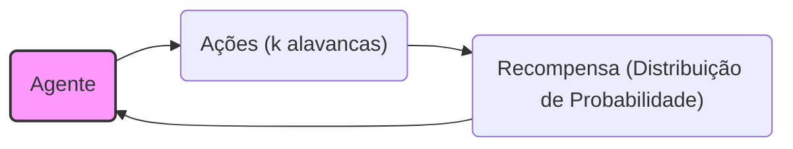
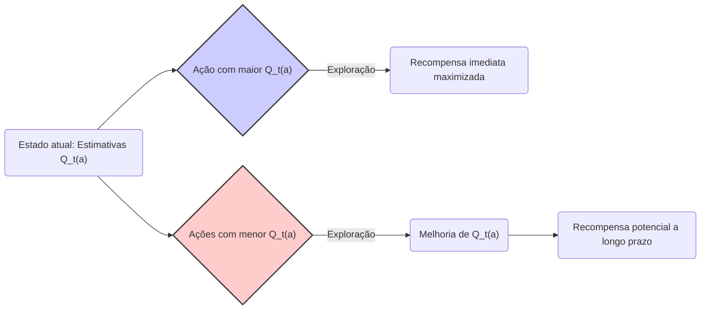
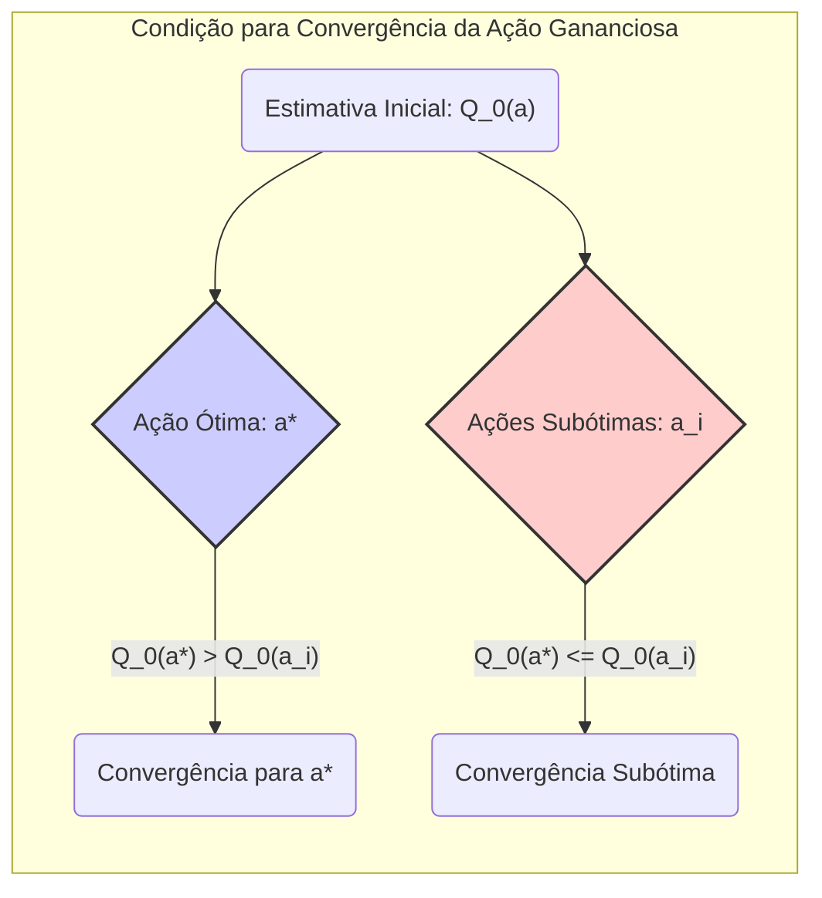
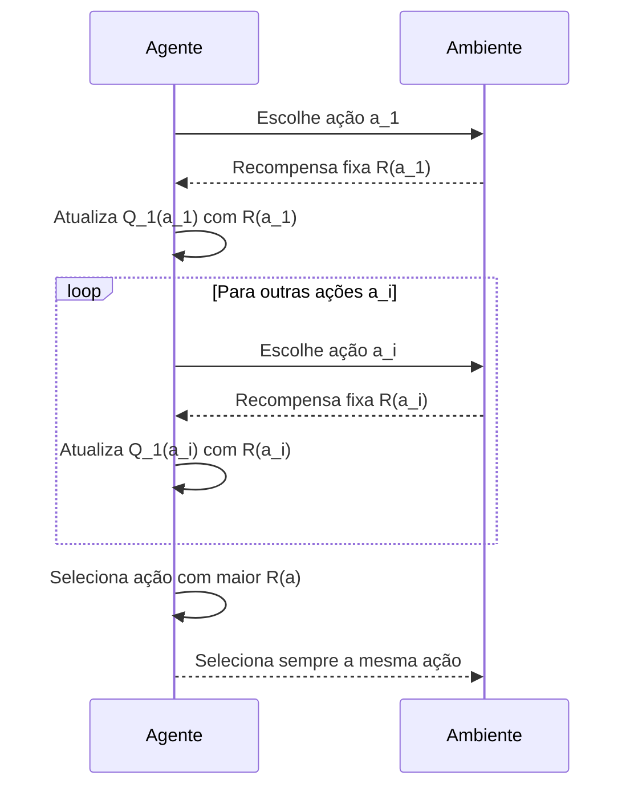

## Métodos de Valor de Ação: Seleção Gananciosa
### Introdução
No contexto do aprendizado por reforço, particularmente no problema do *k-armed bandit*, o aprendizado se concentra em métodos que avaliam as ações tomadas em vez de instruir as ações corretas [^1]. Essa abordagem avaliativa introduz a necessidade de **exploração ativa** para descobrir os melhores comportamentos. Enquanto o feedback instrutivo indica a ação correta independentemente da ação tomada, o feedback avaliativo depende inteiramente da ação selecionada [^1]. O presente capítulo foca no aspecto avaliativo do aprendizado por reforço em um cenário simplificado, que não envolve aprender a agir em múltiplas situações, um cenário conhecido como *nonassociative* [^1]. Este cenário permite analisar claramente como o feedback avaliativo difere e pode ser combinado com o feedback instrutivo [^1]. Dentro deste contexto, exploramos o problema do *k-armed bandit* e suas variações, que são úteis para introduzir métodos básicos de aprendizagem que serão expandidos em capítulos futuros [^1].

### Conceitos Fundamentais
O problema do *k-armed bandit* apresenta um cenário em que um agente escolhe repetidamente entre *k* opções ou ações diferentes. Após cada escolha, o agente recebe uma recompensa numérica, que é selecionada a partir de uma distribuição de probabilidade estacionária que depende da ação selecionada [^1]. O objetivo é maximizar a recompensa total esperada ao longo de um período de tempo [^2]. Este problema é denominado analogamente a uma máquina caça-níqueis (ou "bandido de um braço"), mas com *k* alavancas [^2]. Cada seleção de ação pode ser vista como o acionamento de uma alavanca, e as recompensas são os pagamentos obtidos [^2]. O agente deve, através de seleções repetidas, concentrar-se nas melhores alavancas para maximizar seus ganhos [^2].

No problema do *k-armed bandit*, cada ação tem um valor esperado ou recompensa média, que denotamos como **q\*(a)**. Este valor é definido como a recompensa esperada, dado que a ação *a* foi selecionada:

$$ q_*(a) = E[R_t | A_t = a] $$ [^2]

onde $A_t$ é a ação selecionada no passo de tempo *t*, e $R_t$ é a recompensa correspondente [^2]. Se o valor de cada ação fosse conhecido, o problema se tornaria trivial, pois o agente sempre selecionaria a ação com maior valor. No entanto, geralmente não conhecemos os valores das ações com certeza [^2]. Em vez disso, mantemos *estimativas* dos valores das ações, denotadas como $Q_t(a)$, que esperamos que se aproximem dos valores reais, $q_*(a)$ [^2].

> 💡 **Exemplo Numérico:** Suponha que temos um problema de 3-armed bandit (k=3), com as seguintes recompensas esperadas para cada ação: $q_*(1) = 2$, $q_*(2) = 4$, e $q_*(3) = 1$. Inicialmente, o agente não conhece esses valores. Portanto, suas estimativas $Q_t(a)$ serão diferentes dos valores verdadeiros $q_*(a)$.

As ações cujo valor estimado é o maior em qualquer dado passo de tempo são chamadas de **ações gananciosas** [^2]. A seleção de uma dessas ações é chamada **exploração**, pois o agente utiliza o conhecimento atual sobre os valores das ações [^2]. Em contraste, selecionar uma ação não gananciosa é chamado de **exploração**, pois permite melhorar a estimativa do valor da ação não gananciosa [^2]. A exploração maximiza a recompensa esperada a curto prazo, enquanto a exploração pode gerar uma maior recompensa total a longo prazo, pois permite descobrir ações com maior potencial [^2].

A escolha entre exploração e exploração é um problema central em aprendizado por reforço, pois não é possível explorar e explorar simultaneamente [^2]. Uma forma simples de abordar essa questão é através do método de **seleção de ação gananciosa**. Esse método consiste em sempre selecionar a ação com a maior estimativa de valor no momento [^3]. Formalmente, o método de seleção de ação gananciosa é descrito como:

$$ A_t = \text{argmax}_a \, Q_t(a) $$ [^3]

onde $A_t$ é a ação selecionada no passo de tempo *t*, e $\text{argmax}_a$ denota a ação *a* para a qual a expressão que segue é maximizada. Se houver várias ações gananciosas, a seleção é feita de forma arbitrária [^3]. Embora o método de seleção gananciosa seja simples, ele possui limitações. O método sempre explora o conhecimento atual, e não dedica tempo para explorar ações aparentemente inferiores para descobrir se são melhores. Uma alternativa simples é o método $\epsilon$-ganancioso, que explora a maior parte do tempo, mas em uma pequena porcentagem de vezes (denotada $\epsilon$) seleciona uma ação aleatoriamente [^3].

> 💡 **Exemplo Numérico:**  Continuando o exemplo anterior, vamos supor que inicialmente, o agente tem as seguintes estimativas de valor: $Q_0(1) = 1$, $Q_0(2) = 2$, e $Q_0(3) = 0.5$. Usando a seleção gananciosa, a ação $A_0 = 2$ seria escolhida pois $Q_0(2)$ é a maior estimativa inicial. No passo seguinte, após receber uma recompensa $R_1$ da ação 2, o agente atualizará $Q_1(2)$ e então selecionará a ação que maximiza $Q_1(a)$.

#### Lemma 1
A **seleção de ação gananciosa** não garante a identificação da ação ótima em cenários onde os valores das ações são inicialmente desconhecidos ou incertos, pois este método prioriza a exploração sem dedicar tempo à exploração de ações aparentemente subótimas, limitando o aprendizado e a descoberta de alternativas melhores no longo prazo.

*Prova*:
Pela definição do método de seleção de ação gananciosa, ele sempre seleciona a ação com a maior estimativa de valor no momento atual. Se a estimativa inicial de valor para uma ação ótima for baixa (e este for um cenário possível), esta ação não será selecionada. O algoritmo não explorará novas ações e convergirá a um valor subótimo, se este valor estiver próximo ao valor ótimo, mas a ação ótima não for explorada. Se, em contrapartida, esta ação tiver um valor relativamente alto no início, e logo tiver uma recompensa pior, o algoritmo pode não voltar a essa ação. Portanto, a seleção de ação gananciosa pode levar a convergencia a um valor subótimo. $\blacksquare$

> 💡 **Exemplo Numérico (Lema 1):** Vamos supor que os valores verdadeiros das ações são $q_*(1) = 1$, $q_*(2) = 5$, e $q_*(3) = 2$. Suponha que inicialmente o agente tem estimativas $Q_0(1) = 2$, $Q_0(2) = 1$ e $Q_0(3) = 0.5$. A ação gananciosa seria a ação 1, pois possui a maior estimativa inicial, mesmo que a ação 2 seja a ótima. O método de seleção gananciosa continuaria a escolher a ação 1, a menos que uma recompensa muito menor alterasse significativamente a estimativa, o que pode não acontecer no curto prazo, fazendo com que o agente não explore outras ações e não encontre a ação ótima.

**Proposição 1** Uma condição necessária para a seleção de ação gananciosa convergir para a ação ótima é que a estimativa inicial $Q_0(a)$ para a ação ótima seja maior que a estimativa inicial de todas as ações subótimas.

*Prova*:
Seja $a^*$ a ação ótima e $a_i$ uma ação subótima qualquer. O método de seleção gananciosa seleciona a ação que maximiza $Q_t(a)$ em cada passo *t*. Se $Q_0(a^*) < Q_0(a_i)$ para alguma ação subótima $a_i$, então $a^*$ não será selecionada no início. Como a ação gananciosa nunca explora outras ações, se $a^*$ não for selecionada inicialmente, ela nunca poderá ser explorada, e o método convergirá para uma ação subótima. Portanto, uma condição necessária para convergir para $a^*$ é que $Q_0(a^*) \geq Q_0(a_i)$ para todas as ações subótimas. $\blacksquare$

> 💡 **Exemplo Numérico (Proposição 1):** Para as ações com valores $q_*(1) = 3$, $q_*(2) = 6$, e $q_*(3) = 2$. A ação ótima é a ação 2. Se $Q_0(1) = 4$, $Q_0(2) = 1$ e $Q_0(3) = 0.5$, a ação 1 seria escolhida inicialmente e, seguindo o método ganancioso, a ação 2 dificilmente seria explorada, pois $Q_0(1)$ é a maior estimativa inicial. Este exemplo ilustra a Proposição 1, mostrando que para a convergência à ação ótima, a estimativa inicial da ação ótima ($Q_0(2)$) deve ser maior ou igual a todas as demais.

**Lema 1.1** Se a estimativa inicial $Q_0(a)$ for a mesma para todas as ações, então a seleção de ação gananciosa, sem a adição de mecanismos de exploração, nunca aprenderá a escolher a ação ótima em um problema do tipo k-armed bandit com recompensas estocásticas.

*Prova*:
Se $Q_0(a) = c$ para todas as ações $a$, onde $c$ é uma constante, então a seleção de ação inicial será arbitrária. Se uma ação subótima for selecionada, o método de seleção de ação gananciosa explorará essa ação continuamente. Em um cenário com recompensas estocásticas, haverá variações nas recompensas. Se uma ação subótima apresentar uma sequência de recompensas aleatoriamente elevadas, a estimativa de valor $Q_t(a)$ dessa ação se tornará maior do que as outras ações e a seleção de ação gananciosa a escolherá novamente. Portanto, em um problema estocástico, a seleção gananciosa não convergirá para a ação ótima com um valor inicial igual para todas as ações. $\blacksquare$

> 💡 **Exemplo Numérico (Lema 1.1):** Suponha que temos três ações com $q_*(1) = 2$, $q_*(2) = 4$ e $q_*(3) = 1$, e iniciamos com estimativas iguais $Q_0(1) = Q_0(2) = Q_0(3) = 0$. A primeira ação é escolhida aleatoriamente, digamos a ação 1. Devido à estocasticidade das recompensas, as recompensas podem ser um pouco diferentes a cada iteração. Por exemplo, nas primeiras iterações, a ação 1 pode retornar 2.1, 1.8, 2.3, e a ação 2 pode retornar 3.5, 4.1, 3.8. As estimativas de $Q_t(a)$ seriam atualizadas com essas recompensas, e $Q_t(1)$ e $Q_t(2)$ poderiam ter valores semelhantes devido à estocasticidade, mesmo que $q_*(2)$ seja maior, não garantindo a convergência para a ação ótima. Portanto, a seleção gananciosa não convergiria para a ação ótima (ação 2) com valores iniciais iguais.

**Lema 1.2** Em um ambiente determinístico, com recompensas fixas, a seleção de ação gananciosa, partindo de estimativas iniciais iguais, convergiria para a ação que tiver o maior valor no início, o que pode não ser a ação ótima, se a estimativa inicial dessa ação já for maior que as demais.

*Prova*:
Se $Q_0(a) = c$ para todas as ações e a recompensa de cada ação é fixa, ao selecionar qualquer ação a, a estimativa $Q_t(a)$ se atualizaria com a recompensa recebida. Caso uma ação inicial $a_1$ for selecionada, a estimativa dessa ação, $Q_1(a_1)$, será a recompensa obtida. Se esta recompensa for a maior entre todas as ações, a ação $a_1$ sempre será selecionada. Caso contrário, se a ação $a_1$ tiver uma recompensa subótima, a ação $a_1$ seria explorada. Se, em um dado momento, uma ação $a_2$ tiver uma recompensa maior que as demais, a ação $a_2$ passará a ser selecionada, e o algoritmo convergirá para esta ação. Portanto, em um ambiente determinístico com valores iniciais iguais, o método de seleção gananciosa convergirá para a primeira ação de maior valor, que pode não ser a ação ótima. $\blacksquare$

> 💡 **Exemplo Numérico (Lema 1.2):** Suponha que temos três ações com recompensas fixas $q_*(1) = 2$, $q_*(2) = 4$ e $q_*(3) = 1$, e estimativas iniciais $Q_0(1) = Q_0(2) = Q_0(3) = 0$. Se a ação 1 for selecionada primeiro, a estimativa $Q_1(1)$ se torna 2. Em seguida, se a ação 2 for selecionada, $Q_1(2)$ se torna 4, e agora a ação 2 é selecionada para sempre. Se a ação 3 for selecionada inicialmente, $Q_1(3)$ se tornará 1, e não será escolhida novamente. O método convergirá para a primeira ação que produzir a maior recompensa, que neste caso é 2.

**Teorema 1** O método de seleção de ação gananciosa converge para um comportamento ótimo apenas quando as estimativas iniciais favorecem a ação ótima, ou, em casos determinísticos, a ação ótima é explorada na primeira iteração ou tem uma recompensa inicial maior que as demais.

*Prova:*
Do Lema 1, sabemos que a seleção de ação gananciosa não garante a identificação da ação ótima. A Proposição 1 nos diz que uma condição necessária é que a estimativa inicial da ação ótima seja maior que a das ações subótimas. O Lema 1.1 estabelece que em um cenário estocástico, com estimativas iniciais iguais, o método nunca aprenderá a ação ótima. O Lema 1.2 estabelece que, mesmo em cenários determinísticos com estimativas iniciais iguais, o método pode convergir para uma ação subótima. Combinando esses resultados, a convergência para um comportamento ótimo ocorre apenas em circunstâncias favoráveis, seja com uma vantagem inicial da ação ótima ou, no caso de valores iniciais iguais, quando a ação ótima é descoberta no início. $\blacksquare$

> 💡 **Exemplo Numérico (Teorema 1):** O Teorema 1 resume todos os casos abordados anteriormente. Se os valores iniciais $Q_0(a)$ forem favoráveis à ação ótima, ou seja, $Q_0(a_{otimo}) > Q_0(a_{subotimal})$, ou se o ambiente for determinístico e a ação ótima tiver a primeira recompensa explorada ou uma recompensa inicial maior que as demais, então a seleção gananciosa pode convergir para um comportamento ótimo. Por exemplo, se $q_*(1) = 2$, $q_*(2) = 4$ e $q_*(3) = 1$ e as estimativas iniciais forem $Q_0(1) = 1$, $Q_0(2) = 5$ e $Q_0(3) = 0.5$, então o método ganancioso selecionará a ação ótima 2 (pois a estimativa inicial é a maior) e continuará explorando a mesma, levando a um comportamento ótimo.

### Conclusão
O método de seleção de ação gananciosa é uma estratégia fundamental em aprendizado por reforço que busca maximizar a recompensa imediata selecionando a ação com o maior valor estimado atual. Embora essa abordagem seja simples e intuitiva, ela possui limitações, como a potencial falta de exploração de ações que poderiam ser melhores, levando a resultados subótimos a longo prazo. O método de seleção de ação gananciosa é um componente chave na construção de métodos mais avançados que procuram equilibrar a exploração e a exploração no problema do *k-armed bandit*. Uma alternativa a essa limitação é o método $\epsilon$-ganancioso, que balanceia exploração com explotação.

### Referências
[^1]: "The most important feature distinguishing reinforcement learning from other types of learning is that it uses training information that evaluates the actions taken rather than instructs by giving correct actions. This is what creates the need for active exploration, for an explicit search for good behavior. Purely evaluative feedback indicates how good the action taken was, but not whether it was the best or the worst action possible. Purely instructive feedback, on the other hand, indicates the correct action to take, independently of the action actually taken. This kind of feedback is the basis of supervised learning, which includes large parts of pattern classification, artificial neural networks, and system identification. In their pure forms, these two kinds of feedback are quite distinct: evaluative feedback depends entirely on the action taken, whereas instructive feedback is independent of the action taken." *(Trecho de <Multi-armed Bandits>)*
[^2]: "In our k-armed bandit problem, each of the k actions has an expected or mean reward given that that action is selected; let us call this the value of that action. We denote the action selected on time step t as At, and the corresponding reward as Rt. The value then of an arbitrary action a, denoted q∗(a), is the expected reward given that a is selected: $q_*(a) = E[R_t | A_t=a]$. If you knew the value of each action, then it would be trivial to solve the k-armed bandit problem: you would always select the action with highest value. We assume that you do not know the action values with certainty, although you may have estimates. We denote the estimated value of action a at time stept as $Q_t(a)$. We would like $Q_t(a)$ to be close to $q_*(a)$. If you maintain estimates of the action values, then at any time step there is at least one action whose estimated value is greatest. We call these the greedy actions. When you select one of these actions, we say that you are exploiting your current knowledge of the values of the actions. If instead you select one of the nongreedy actions, then we say you are exploring, because this enables you to improve your estimate of the nongreedy action’s value. Exploitation is the right thing to do to maximize the expected reward on the one step, but exploration may produce the greater total reward in the long run." *(Trecho de <Multi-armed Bandits>)*
[^3]: "The simplest action selection rule is to select one of the actions with the highest estimated value, that is, one of the greedy actions as defined in the previous section. If there is more than one greedy action, then a selection is made among them in some arbitrary way, perhaps randomly. We write this greedy action selection method as $A_t = \text{argmax}_a \, Q_t(a)$, where argmaxa denotes the action a for which the expression that follows is maximized (with ties broken arbitrarily). Greedy action selection always exploits current knowledge to maximize immediate reward; it spends no time at all sampling apparently inferior actions to see if they might really be better." *(Trecho de <Multi-armed Bandits>)*
