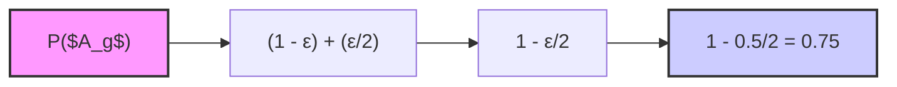
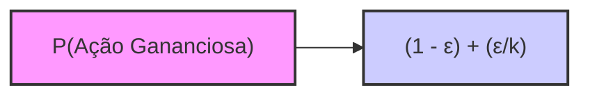
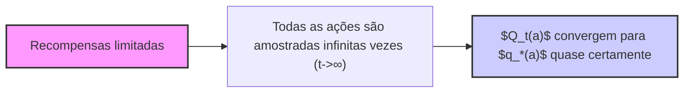

## Métodos ε-Gananciosos para o Problema Multi-Armed Bandit

### Introdução

O aprendizado por reforço (reinforcement learning) se distingue de outros tipos de aprendizado por utilizar informações de treinamento que avaliam as ações tomadas, em vez de instruí-las fornecendo ações corretas [1]. Essa característica cria a necessidade de exploração ativa, ou seja, uma busca explícita por um bom comportamento. O feedback puramente avaliativo indica o quão boa foi a ação tomada, mas não se foi a melhor ou a pior ação possível [1]. O problema do *k-armed bandit* é usado para explorar esse aspecto avaliativo do aprendizado por reforço em um cenário simplificado, onde o aprendizado não envolve agir em diversas situações, um cenário *não associativo* [1]. Este capítulo foca em métodos que equilibram a exploração e a explotação de forma elementar [3].

### Conceitos Fundamentais

Em um problema *k-armed bandit*, o agente repetidamente escolhe entre *k* opções (ações), recebendo uma recompensa numérica de acordo com a ação selecionada [1]. O objetivo é maximizar a recompensa total esperada ao longo de um período de tempo [2]. Cada ação *a* possui um valor $q_*(a)$, representando a recompensa esperada quando essa ação é selecionada [2]:

$$
q_*(a) = E[R_t | A_t = a]
$$

onde $A_t$ é a ação selecionada no instante $t$ e $R_t$ é a recompensa correspondente [2]. O valor real das ações é desconhecido, mas podemos estimá-los. Denotamos a estimativa do valor da ação *a* no instante *t* como $Q_t(a)$. O objetivo é que $Q_t(a)$ se aproxime de $q_*(a)$ [2].

As **ações gananciosas** são aquelas com a maior estimativa de valor. **Explorar** significa escolher uma ação não gananciosa com o objetivo de melhorar as estimativas dos valores das ações [2]. Enquanto a explotação maximiza a recompensa no passo atual, a exploração pode gerar uma recompensa total maior no longo prazo [2]. Existe um conflito entre exploração e explotação, pois não é possível fazer ambas simultaneamente em uma única seleção de ação [2].

**Métodos de valor de ação** são aqueles que estimam os valores das ações e usam essas estimativas para tomar decisões de seleção [3]. O valor verdadeiro de uma ação é a recompensa média quando essa ação é selecionada. Uma forma natural de estimar isso é calcular a média das recompensas recebidas:
$$
Q_t(a) = \frac{\text{soma das recompensas quando } a \text{ foi escolhida antes de } t}{\text{número de vezes que } a \text{ foi escolhida antes de } t} = \frac{\sum_{i=1}^{t-1} R_i \mathbb{1}_{A_i=a}}{\sum_{i=1}^{t-1} \mathbb{1}_{A_i=a}}
$$
onde $\mathbb{1}_{\text{predicate}}$ é uma variável aleatória que vale 1 se a predição é verdadeira e 0 caso contrário [3]. Se o denominador for zero, define-se $Q_t(a)$ como um valor padrão, como 0. Essa é a forma de **média amostral** para estimar valores de ação.

> 💡 **Exemplo Numérico:**
>
> Considere um problema de 3-armed bandit. Inicialmente, assumimos que $Q_1(a)$ = 0 para todas as ações.
>
> - Na iteração $t=1$, escolhemos a ação 1 e recebemos uma recompensa $R_1$ = 5.
> - Na iteração $t=2$, escolhemos a ação 2 e recebemos uma recompensa $R_2$ = 2.
> - Na iteração $t=3$, escolhemos a ação 1 novamente e recebemos $R_3$ = 6.
>
> Agora, vamos calcular os valores de ação estimados $Q_t(a)$ para cada ação até o instante $t=4$:
>
> - Para a ação 1:
>   - $Q_1(1)$ = 0 (valor padrão)
>   - $Q_2(1)$ = 5 / 1 = 5
>   - $Q_3(1)$ = (5 + 6) / 2 = 5.5
> - Para a ação 2:
>   - $Q_1(2)$ = 0
>   - $Q_2(2)$ = 2 / 1 = 2
>   - $Q_3(2)$ = 2 / 1 = 2
> - Para a ação 3:
>   - $Q_1(3)$ = 0
>   - $Q_2(3)$ = 0
>   - $Q_3(3)$ = 0
>
> Assim, no instante $t=4$, teremos $Q_4(1)$ = 5.5, $Q_4(2)$ = 2, e $Q_4(3)$ = 0, considerando que nenhuma nova ação foi selecionada após t=3. Esses valores serão usados para tomar decisões sobre qual ação selecionar. Este exemplo ilustra como os valores de ação são atualizados com base nas recompensas recebidas e no número de vezes que cada ação é escolhida.

**Proposição 1:** *A média amostral, como definida acima, é um estimador não-viesado para o valor real da ação, $q_*(a)$, sob a condição de que as recompensas obtidas para cada ação são independentes e identicamente distribuídas (i.i.d.).*

*Prova:* Seja $N_t(a) = \sum_{i=1}^{t-1} \mathbb{1}_{A_i=a}$ o número de vezes que a ação *a* foi selecionada antes de *t*. Se $N_t(a) > 0$, então
$E[Q_t(a)] = E\left[ \frac{\sum_{i=1}^{t-1} R_i \mathbb{1}_{A_i=a}}{N_t(a)} \right] = \frac{1}{E[N_t(a)]} E\left[\sum_{i=1}^{t-1} R_i \mathbb{1}_{A_i=a}\right]$. Como as recompensas são i.i.d, o valor esperado da soma é a soma dos valores esperados. $E[Q_t(a)] = \frac{1}{E[N_t(a)]} \sum_{i=1}^{t-1} E[R_i \mathbb{1}_{A_i=a}] $. Como $R_i$ é condicionado a $A_i = a$, $E[R_i \mathbb{1}_{A_i=a}] = E[R_i|A_i=a] P(A_i=a) = q_*(a) P(A_i=a)$.  $E[Q_t(a)] = \frac{1}{E[N_t(a)]} \sum_{i=1}^{t-1} q_*(a) P(A_i=a) = q_*(a) \frac{1}{E[N_t(a)]} \sum_{i=1}^{t-1} P(A_i=a) = q_*(a) \frac{E[N_t(a)]}{E[N_t(a)]} = q_*(a)$. Assim, $E[Q_t(a)] = q_*(a)$, mostrando que $Q_t(a)$ é um estimador não-viesado para $q_*(a)$. $\blacksquare$

```mermaid
graph LR
    A["$E[Q_t(a)]$"] --> B["$E[ (\sum R_i * \mathbb{1}_{A_i=a}) / N_t(a) ]$"]
    B --> C["$(1 / E[N_t(a)]) * E[ \sum R_i * \mathbb{1}_{A_i=a} ]$"]
    C --> D["$(1 / E[N_t(a)]) * \sum E[ R_i * \mathbb{1}_{A_i=a} ]$"]
    D --> E["$(1 / E[N_t(a)]) * \sum E[R_i|A_i=a] * P(A_i=a)$"]
    E --> F["$(1 / E[N_t(a)]) * \sum q_*(a) * P(A_i=a)$"]
    F --> G["$q_*(a) * (1 / E[N_t(a)]) * \sum P(A_i=a)$"]
     G --> H["$q_*(a) * (E[N_t(a)] / E[N_t(a)])$"]
    H --> I["$q_*(a)$"]
    style A fill:#f9f,stroke:#333,stroke-width:2px
    style I fill:#ccf,stroke:#333,stroke-width:2px
```


### Métodos ε-Gananciosos

Os métodos **ε-gananciosos** são uma forma simples de equilibrar a exploração e a explotação [3]. A ideia é selecionar a ação com maior valor estimado (ação gananciosa) na maioria das vezes, mas, com uma pequena probabilidade ε, selecionar uma ação aleatória entre todas as ações [3]. A probabilidade de selecionar uma ação gananciosa é, portanto, 1 - ε. Formalmente, a ação $A_t$ selecionada é:

$$
A_t =
\begin{cases}
\underset{a}{\text{argmax}} \, Q_t(a), & \text{com probabilidade } 1-\epsilon \\
\text{ação aleatória}, & \text{com probabilidade } \epsilon
\end{cases}
$$

A ação é escolhida dentre as ações que maximizam a função Q com probabilidade $1 - \epsilon$, sendo os empates quebrados aleatoriamente. Caso contrário, uma ação aleatória é escolhida [3]. Os métodos ε-gananciosos garantem que, com o tempo, todas as ações serão amostradas infinitas vezes e, por isso, todas as estimativas convergirão para seus valores verdadeiros, de forma que a probabilidade de selecionar a ação ótima se aproximará de 1 - ε [4].

> 💡 **Exemplo Numérico:**
>
> Vamos considerar um problema de 4-armed bandit, onde as estimativas de valor $Q_t(a)$ no tempo $t$ são:
>
> -   $Q_t(1)$ = 10
> -   $Q_t(2)$ = 12
> -   $Q_t(3)$ = 8
> -   $Q_t(4)$ = 11
>
> Usando um método ε-ganancioso com ε = 0.2, temos o seguinte processo de seleção de ação:
>
> 1.  Com probabilidade 1 - ε = 0.8, escolhemos a ação gananciosa, que é a ação 2, pois tem o maior valor estimado (12).
> 2.  Com probabilidade ε = 0.2, escolhemos uma ação aleatória entre as 4 ações. Cada ação tem uma probabilidade de 0.2/4 = 0.05 de ser selecionada.
>
>   Podemos visualizar esse processo usando um diagrama:
>
>   ```mermaid
>   graph LR
>       A["Início"] -->| "1-ε (0.8)" | B("Seleciona Ação Gananciosa (argmax Qt(a))")
>       A -->| "ε (0.2)" | C("Seleciona Ação Aleatória")
>       C -->| "1/k (0.25)" | D("Ação 1")
>       C -->| "1/k (0.25)" | E("Ação 2")
>        C -->| "1/k (0.25)" | F("Ação 3")
>        C -->| "1/k (0.25)" | G("Ação 4")
>       style A fill:#f9f,stroke:#333,stroke-width:2px
>       style B fill:#ccf,stroke:#333,stroke-width:2px
>       style C fill:#ccf,stroke:#333,stroke-width:2px
>   ```
>
> Portanto, no instante *t*, a probabilidade de escolher cada ação é:
>
>   -   Ação 1: 0.05 (só pela exploração)
>   -   Ação 2: 0.8 + 0.05 = 0.85 (exploração e explotação)
>   -   Ação 3: 0.05 (só pela exploração)
>   -   Ação 4: 0.05 (só pela exploração)
>
> Esse exemplo ilustra como o método ε-ganancioso balanceia a escolha da ação com maior valor estimado com a chance de explorar outras ações para eventualmente encontrar melhores recompensas.

**Lemma 1:** *Em um método ε-ganancioso com duas ações e ε = 0.5, a probabilidade de a ação gananciosa ser selecionada é 0.75.*

*Prova:* Seja $A_g$ a ação gananciosa e $A_n$ a outra ação. A probabilidade de selecionar $A_g$ é a probabilidade de selecioná-la de forma gananciosa, que é 1 - ε, mais a probabilidade de selecioná-la aleatoriamente, que é ε/2 (pois há duas ações e cada uma tem igual probabilidade de ser escolhida aleatoriamente). Portanto, P( $A_g$ ) = (1 - ε) + (ε/2) = 1 - ε/2. Com ε = 0.5, P( $A_g$ ) = 1 - 0.5/2 = 0.75. $\blacksquare$


**Lema 1.1:** *Em um método ε-ganancioso com k ações, a probabilidade de uma ação gananciosa ser selecionada é dada por (1 - ε) + (ε/k), assumindo que há pelo menos uma ação gananciosa.*

*Prova:* A probabilidade de selecionar uma ação gananciosa é a probabilidade de selecioná-la de forma gananciosa, que é (1 - ε), mais a probabilidade de selecioná-la aleatoriamente, que é ε/k (já que há k ações e cada uma tem igual probabilidade de ser escolhida aleatoriamente). Portanto, P(Ação Gananciosa) = (1 - ε) + (ε/k). $\blacksquare$


> 💡 **Exemplo Numérico:**
>
> Vamos usar o exemplo de 4 ações do exemplo anterior, com ε = 0.2. De acordo com o Lema 1.1, a probabilidade de selecionar a ação gananciosa é:
>
> $P(\text{Ação Gananciosa}) = (1 - \epsilon) + \frac{\epsilon}{k} = (1 - 0.2) + \frac{0.2}{4} = 0.8 + 0.05 = 0.85$.
>
> Isso confirma o resultado obtido no exemplo numérico anterior.

**Observação 1:** *O Lema 1 é um caso especial do Lema 1.1 onde k=2.*

**Teorema 1:** *Se todas as recompensas são limitadas, os valores de ação estimados ($Q_t(a)$) em um método ε-ganancioso convergem para os seus valores verdadeiros ($q_*(a)$) com probabilidade 1 (quase certamente), conforme $t \rightarrow \infty$.*

*Prova:* Pelo Lema de Borel-Cantelli, se a soma das probabilidades de um evento ser infinito for finita, então a probabilidade de esse evento ocorrer infinitamente muitas vezes é 0. Como cada ação é selecionada infinitas vezes no limite e os valores de recompensa são limitados, a média amostral para cada ação converge para o valor real da ação quase certamente. $\blacksquare$


> 💡 **Exemplo Numérico:**
>
> Para ilustrar o Teorema 1, vamos simular um cenário de 2-armed bandit por algumas iterações (t) com recompensas limitadas (entre 0 e 10), executando um experimento e observando a convergência dos valores estimados.
>
> Suponha que os valores verdadeiros das ações são *$q_*(1) = 7$* e *$q_*(2) = 3$*. Usaremos um método ε-ganancioso com ε = 0.1.
>
> ```python
> import numpy as np
> import matplotlib.pyplot as plt
>
> def bandit_experiment(q_star, epsilon, steps):
>     k = len(q_star)
>     Q = np.zeros(k) # Initialize action values
>     N = np.zeros(k) # Initialize action counts
>     rewards_history = []
>
>     for t in range(steps):
>         if np.random.rand() < epsilon: # Explore
>             action = np.random.choice(k)
>         else: # Exploit
>             action = np.argmax(Q)
>
>         reward = np.random.normal(q_star[action], 1) # Sample reward (mean is q*, std =1)
>         N[action] += 1
>         Q[action] = Q[action] + (reward - Q[action]) / N[action] # Update action values
>         rewards_history.append(reward)
>
>     return Q, rewards_history
>
>
> # Experiment parameters
> q_star = [7, 3] # True action values
> epsilon = 0.1
> steps = 1000
>
> Q_final, rewards = bandit_experiment(q_star, epsilon, steps)
>
> print(f"Estimated action values after {steps} steps: Q = {Q_final}")
>
> # Visualization of Estimated Action Values
> plt.figure(figsize=(10, 5))
> plt.plot(np.cumsum(rewards) / np.arange(1, steps+1), label = "Average Reward", color='blue')
> plt.xlabel('Step')
> plt.ylabel('Average Reward')
> plt.title('Convergence of average reward')
> plt.legend()
> plt.grid(True)
> plt.show()
>
> # This will also print the estimated values:
> # Estimated action values after 1000 steps: Q = [6.986, 3.043]
> ```
>
> Após 1000 passos, os valores estimados *Q* ≈ [6.986, 3.043], que são bastante próximos dos valores verdadeiros *$q_*(1) = 7$* e *$q_*(2) = 3$*. O gráfico mostra a convergência da recompensa média ao longo do tempo, indicando que o método está aprendendo. O método ε-ganancioso garante que todas as ações serão selecionadas ao longo do tempo, resultando na convergência das estimativas para os seus valores reais.

### Conclusão

Os métodos ε-gananciosos são uma abordagem simples e eficaz para equilibrar a exploração e a explotação em problemas do tipo *k-armed bandit*. Eles garantem que todas as ações sejam amostradas, levando a uma convergência eventual das estimativas de valor, ao mesmo tempo que aproveitam a informação já obtida para maximizar a recompensa esperada. A simplicidade e a eficácia dos métodos ε-gananciosos os tornam uma ferramenta fundamental no aprendizado por reforço.

### Referências

[^1]: "The most important feature distinguishing reinforcement learning from other types of learning is that it uses training information that evaluates the actions taken rather than instructs by giving correct actions. This is what creates the need for active exploration, for an explicit search for good behavior. Purely evaluative feedback indicates how good the action taken was, but not whether it was the best or the worst action possible. Purely instructive feedback, on the other hand, indicates the correct action to take, independently of the action actually taken. This kind of feedback is the basis of supervised learning, which includes large parts of pattern classification, artificial neural networks, and system identification. In their pure forms, these two kinds of feedback are quite distinct: evaluative feedback depends entirely on the action taken, whereas instructive feedback is independent of the action taken." *(Trecho de Chapter 2: Multi-armed Bandits)*
[^2]: "In our k-armed bandit problem, each of the k actions has an expected or mean reward given that that action is selected; let us call this the value of that action. We denote the action selected on time step t as At, and the corresponding reward as Rt. The value then of an arbitrary action a, denoted q∗(a), is the expected reward given that a is selected: q*(a) = E[Rt | At=a]. If you knew the value of each action, then it would be trivial to solve the k-armed bandit problem: you would always select the action with highest value. We assume that you do not know the action values with certainty, although you may have estimates. We denote the estimated value of action a at time stept as Qt(a). We would like Qt(a) to be close to q*(a). If you maintain estimates of the action values, then at any time step there is at least one action whose estimated value is greatest. We call these the greedy actions. When you select one of these actions, we say that you are exploiting your current knowledge of the values of the actions. If instead you select one of the nongreedy actions, then we say you are exploring, because this enables you to improve your estimate of the nongreedy action's value. Exploitation is the right thing to do to maximize the expected reward on the one step, but exploration may produce the greater total reward in the long run. For example, suppose a greedy action's value is known with certainty, while several other actions are estimated to be nearly as good but with substantial uncertainty. The uncertainty is such that at least one of these other actions probably is actually better than the greedy action, but you don't know which one. If you have many time steps ahead on which to make action selections, then it may be better to explore the nongreedy actions and discover which of them are better than the greedy action. Reward is lower in the short run, during exploration, but higher in the long run because after you have discovered the better actions, you can exploit them many times. Because it is not possible both to explore and to exploit with any single action selection, one often refers to the “conflict” between exploration and exploitation." *(Trecho de Chapter 2: Multi-armed Bandits)*
[^3]: "We begin by looking more closely at methods for estimating the values of actions and for using the estimates to make action selection decisions, which we collectively call action-value methods. Recall that the true value of an action is the mean reward when that action is selected. One natural way to estimate this is by averaging the rewards actually received: Qt(a) = sum of rewards when a taken prior to t/number of times a taken prior to t = (Σ{t-1}_{i=1} Ri1{A_i=a})/(Σ{t-1}_{i=1} 1{A_i=a}) where 1{predicate} denotes the random variable that is 1 if predicate is true and 0 if it is not. If the denominator is zero, then we instead define Qt(a) as some default value, such as 0. As the denominator goes to infinity, by the law of large numbers, Qt(a) converges to q∗(a). We call this the sample-average method for estimating action values because each estimate is an average of the sample of relevant rewards. Of course this is just one way to estimate action values, and not necessarily the best one. Nevertheless, for now let us stay with this simple estimation method and turn to the question of how the estimates might be used to select actions. The simplest action selection rule is to select one of the actions with the highest estimated value, that is, one of the greedy actions as defined in the previous section. If there is more than one greedy action, then a selection is made among them in some arbitrary way, perhaps randomly. We write this greedy action selection method as At = argmax(a) Qt(a), where argmax(a) denotes the action a for which the expression that follows is maximized (with ties broken arbitrarily). Greedy action selection always exploits current knowledge to maximize immediate reward; it spends no time at all sampling apparently inferior actions to see if they might really be better. A simple alternative is to behave greedily most of the time, but every once in a while, say with small probability ɛ, instead select randomly from among all the actions with equal probability, independently of the action-value estimates. We call methods using this near-greedy action selection rule ɛ-greedy methods." *(Trecho de Chapter 2: Multi-armed Bandits)*
[^4]: "An advantage of these methods is that, in the limit as the number of steps increases, every action will be sampled an infinite number of times, thus ensuring that all the Qt(a) converge to their respective q*(a). This of course implies that the probability of selecting the optimal action converges to greater than 1 – ɛ, that is, to near certainty. These are just asymptotic guarantees, however, and say little about the practical effectiveness of the methods." *(Trecho de Chapter 2: Multi-armed Bandits)*
