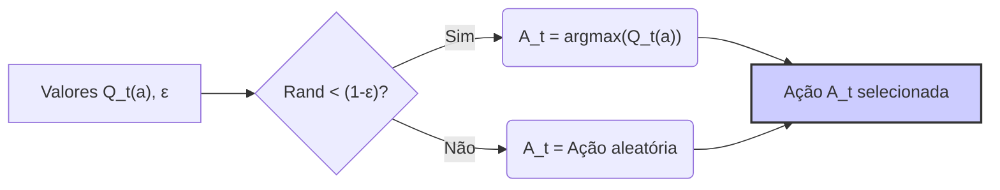
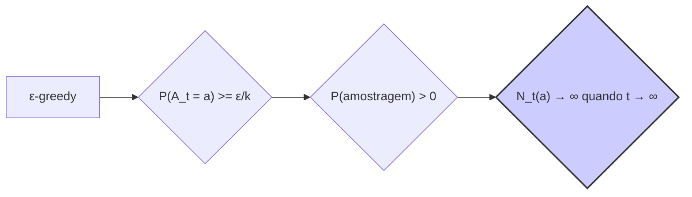
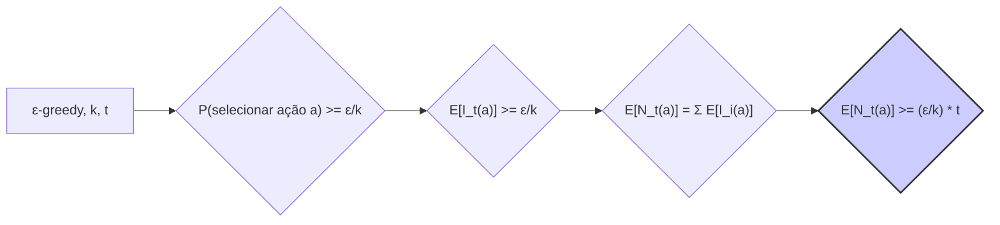
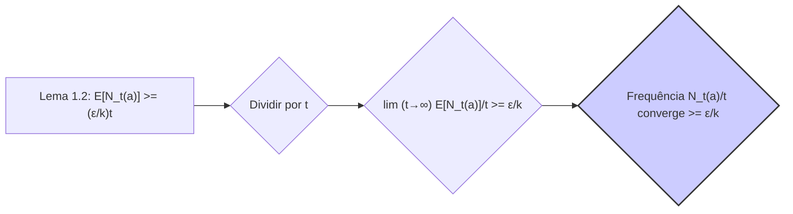
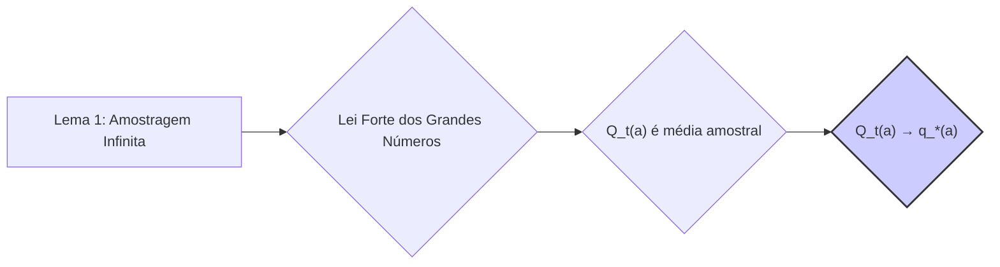

## Action-Value Methods e a Convergência em Métodos ε-Gananciosos

### Introdução

A modelagem de processos de tomada de decisão sequenciais, em particular através de *Reinforcement Learning*, apresenta um desafio fundamental: como equilibrar a exploração do ambiente com a explotação do conhecimento já adquirido [1](https://chatgpt.com/c/67829922-359c-8011-96dd-970c04ed772c#user-content-fn-1). Métodos baseados em valores de ação (*action-value methods*) são uma abordagem comum nesse cenário, visando estimar o valor esperado de cada ação em um determinado estado. O problema do *k-armed bandit* serve como um modelo simplificado para explorar esses conceitos, onde um agente deve repetidamente escolher entre $k$ ações, cada uma fornecendo uma recompensa estocástica [1](https://chatgpt.com/c/67829922-359c-8011-96dd-970c04ed772c#user-content-fn-1), [2](https://chatgpt.com/c/67829922-359c-8011-96dd-970c04ed772c#user-content-fn-2). Este capítulo irá se aprofundar em um aspecto particular do método ε-ganancioso (*ε-greedy method*): sua garantia de convergência dos valores de ação devido à amostragem infinita de todas as ações.

### Conceitos Fundamentais

**Action-value Methods:** Estes métodos estimam o valor de uma ação $a$ no tempo $t$, denotado por $Q_t(a)$, através da média das recompensas recebidas quando a ação $a$ foi selecionada até o tempo $t$. Formalmente, [3](https://chatgpt.com/c/67829922-359c-8011-96dd-970c04ed772c#user-content-fn-3)
$$ Q_t(a) = \frac{\sum_{i=1}^{t-1} R_i \mathbb{1}_{A_i=a}}{\sum_{i=1}^{t-1} \mathbb{1}_{A_i=a}} $$

Onde $R_i$ é a recompensa obtida no tempo $i$, $A_i$ é a ação selecionada no tempo $i$, e $\mathbb{1}_{A_i=a}$ é uma função indicadora que é 1 se $A_i = a$ e 0 caso contrário. Caso o denominador seja zero, $Q_t(a)$ é definido como um valor default como zero [3](https://chatgpt.com/c/67829922-359c-8011-96dd-970c04ed772c#user-content-fn-3).

> 💡 **Exemplo Numérico:** Considere um problema de 3-armed bandit (k=3) onde as ações são indexadas por 1, 2 e 3. Suponha que nas primeiras iterações, as seguintes ações e recompensas foram observadas:
>
> | Tempo (t) | Ação (A\_t) | Recompensa (R\_t) |
> |-----------|-------------|-------------------|
> | 1         | 1           | 0               |
> | 2         | 2           | 1               |
> | 3         | 1           | 0               |
> | 4         | 3           | -1              |
> | 5         | 2           | 2               |
>
> Vamos calcular os valores de ação $Q_t(a)$ para cada ação no tempo t=6.
>
> - Para a ação 1: $Q_6(1) = \frac{0 + 0}{2} = 0$
> - Para a ação 2: $Q_6(2) = \frac{1 + 2}{2} = 1.5$
> - Para a ação 3: $Q_6(3) = \frac{-1}{1} = -1$
>
> O valor de $Q_6(1)$ é a média das recompensas obtidas quando a ação 1 foi selecionada (tempos 1 e 3), $Q_6(2)$ é a média das recompensas obtidas quando a ação 2 foi selecionada (tempos 2 e 5), e $Q_6(3)$ é a média das recompensas obtidas quando a ação 3 foi selecionada (tempo 4).

```mermaid
graph LR
    A[Tempo "t"] --> B("Ação \"a\" selecionada");
    B --> C{"Recompensa \"R\" obtida"};
    C --> D{"Atualizar Q_t(a)"};
    D --> E("Q_t(a) = Média(Recompensas)");
     style E fill:#f9f,stroke:#333,stroke-width:2px
```

**Greedy Action Selection:** É a escolha da ação que maximiza o valor estimado. Ou seja,
$A_t = \text{argmax}_a \, Q_t(a)$ [3](https://chatgpt.com/c/67829922-359c-8011-96dd-970c04ed772c#user-content-fn-3). Este método explora o que já foi aprendido, mas não garante a identificação da ação ótima.

> 💡 **Exemplo Numérico:** Usando os valores de ação calculados no exemplo anterior para t=6, $Q_6(1) = 0$, $Q_6(2) = 1.5$, e $Q_6(3) = -1$. A ação gananciosa seria a ação 2, já que $1.5$ é o maior valor. Portanto, $A_6 = 2$.


**ε-Greedy Action Selection:** Este método melhora o anterior adicionando um componente de exploração: com probabilidade $1-\epsilon$, a ação gananciosa é selecionada; e com probabilidade $\epsilon$, uma ação é selecionada aleatoriamente [3](https://chatgpt.com/c/67829922-359c-8011-96dd-970c04ed772c#user-content-fn-3). Matematicamente,
$$ A_t = \begin{cases}
\text{argmax}_a \, Q_t(a) & \text{com probabilidade } 1-\epsilon \\
\text{ação aleatória} & \text{com probabilidade } \epsilon
\end{cases} $$

A introdução de $\epsilon$ garante que todas as ações sejam amostradas, mesmo aquelas que não parecem ser as melhores, e é esse ponto que suporta a convergência dos valores de ação.

> 💡 **Exemplo Numérico:** Suponha que estamos utilizando o método ε-ganancioso com $\epsilon = 0.1$. Usando os valores de ação do exemplo anterior ($Q_6(1) = 0$, $Q_6(2) = 1.5$, $Q_6(3) = -1$), a ação gananciosa é a ação 2.
>
> - Com probabilidade $1 - \epsilon = 0.9$, escolhemos a ação gananciosa, que é a ação 2.
> - Com probabilidade $\epsilon = 0.1$, escolhemos uma ação aleatoriamente entre 1, 2 e 3. Cada uma tem probabilidade $\frac{0.1}{3} \approx 0.033$.
>
>  Portanto, a ação 2 será selecionada com maior probabilidade (0.9 + 0.033), mas as ações 1 e 3 também serão selecionadas ocasionalmente.


**Lema 1.1: Probabilidade de Seleção de Ação com ε-Greedy**
*Declaração:* Em um ambiente *k-armed bandit*, utilizando seleção de ação ε-gananciosa, a probabilidade de selecionar qualquer ação $a$ no tempo $t$ é dada por:
$$P(A_t = a) = \begin{cases}
\frac{\epsilon}{k} + (1-\epsilon)  & \text{se } a = \text{argmax}_{a'} \, Q_t(a') \\
\frac{\epsilon}{k} & \text{caso contrário}
\end{cases}$$
*Prova:* A probabilidade de selecionar uma ação aleatoriamente é $\frac{\epsilon}{k}$ para todas as ações. Se a ação $a$ é a ação gananciosa (i.e., $\text{argmax}_{a'} \, Q_t(a')$), ela também é selecionada com probabilidade $1-\epsilon$. Somando as probabilidades, chegamos no resultado. $\blacksquare$

> 💡 **Exemplo Numérico:** Continuando com o exemplo anterior (k=3, $\epsilon=0.1$), a probabilidade de selecionar a ação 2 (que é a ação gananciosa) é:
>
> $P(A_t = 2) = \frac{0.1}{3} + (1 - 0.1) = \frac{0.1}{3} + 0.9 \approx 0.033 + 0.9 = 0.933$
>
> A probabilidade de selecionar qualquer uma das outras ações (1 ou 3) é:
>
> $P(A_t = 1) = P(A_t = 3) = \frac{0.1}{3} \approx 0.033$
>
> Observe que a soma das probabilidades é $0.933 + 0.033 + 0.033 \approx 1.0$.

**Lemma 1: Amostragem Infinita em ε-Greedy**
*Declaração:* Em um ambiente *k-armed bandit*, com seleção de ação ε-gananciosa ($\epsilon > 0$), todas as ações serão selecionadas um número infinito de vezes à medida que o número de passos $t$ tende ao infinito.
*Prova:* Seja $N_t(a)$ o número de vezes que uma ação $a$ foi selecionada até o tempo $t$. Com probabilidade $\epsilon$, uma ação é selecionada aleatoriamente com probabilidade $\frac{1}{k}$. Portanto, a probabilidade de selecionar qualquer ação em um dado tempo $t$ é pelo menos $\frac{\epsilon}{k}$. Como $\epsilon$ e $k$ são constantes, então essa probabilidade é sempre positiva. Assim, o valor esperado do número de seleções $N_t(a)$ aumenta indefinidamente, e no limite $t \to \infty$ temos $N_t(a) \to \infty$. $\blacksquare$



**Lema 1.2: Limite Inferior da Amostragem de Ações**
*Declaração:* Em um ambiente *k-armed bandit*, com seleção de ação ε-gananciosa ($\epsilon > 0$), o número esperado de vezes que cada ação $a$ é selecionada no tempo $t$, denotado por $\mathbb{E}[N_t(a)]$, satisfaz $\mathbb{E}[N_t(a)] \geq \frac{\epsilon}{k}t$.
*Prova:* Seja $I_t(a)$ uma variável indicadora que é 1 se a ação $a$ foi selecionada no tempo $t$, e 0 caso contrário. Então, $N_t(a) = \sum_{i=1}^t I_i(a)$.  Pela definição do método ε-ganancioso, a probabilidade de selecionar a ação $a$ em qualquer tempo $t$ é pelo menos $\frac{\epsilon}{k}$ (pelo Lema 1.1).  Portanto, $\mathbb{E}[I_t(a)] \geq \frac{\epsilon}{k}$. Pela linearidade da esperança, $\mathbb{E}[N_t(a)] = \mathbb{E}[\sum_{i=1}^t I_i(a)] = \sum_{i=1}^t \mathbb{E}[I_i(a)] \geq \sum_{i=1}^t \frac{\epsilon}{k} = \frac{\epsilon}{k}t$. $\blacksquare$

> 💡 **Exemplo Numérico:** Suponha que temos um k-armed bandit com k=5 e estamos usando $\epsilon=0.2$. De acordo com o Lema 1.2, o número esperado de vezes que cada ação é selecionada no tempo t é dado por:
>
> $\mathbb{E}[N_t(a)] \geq \frac{\epsilon}{k}t = \frac{0.2}{5}t = 0.04t$
>
> Isso significa que após 100 passos (t=100), esperamos que cada ação seja selecionada pelo menos 4 vezes:
>
> $\mathbb{E}[N_{100}(a)] \geq 0.04 \times 100 = 4$
>
> Após 1000 passos (t=1000), o valor esperado sobe para 40:
>
> $\mathbb{E}[N_{1000}(a)] \geq 0.04 \times 1000 = 40$
>
> Note que este é um limite inferior, o número real de seleções pode ser maior.



**Corolário 1: Convergência da Frequência de Amostragem**
*Declaração:* Em um ambiente *k-armed bandit*, com seleção de ação ε-gananciosa, a frequência com que cada ação $a$ é selecionada, dada por $\frac{N_t(a)}{t}$, converge para um valor maior ou igual a $\frac{\epsilon}{k}$ quando $t$ tende ao infinito.
*Prova:*  Pelo Lema 1.2, temos que $\mathbb{E}[N_t(a)] \geq \frac{\epsilon}{k}t$. Dividindo por $t$ e tomando o limite, temos $\lim_{t \to \infty} \frac{\mathbb{E}[N_t(a)]}{t} \geq \frac{\epsilon}{k}$. Como a média amostral converge para a média verdadeira, a frequência de amostragem $\frac{N_t(a)}{t}$ converge para um valor maior ou igual a $\frac{\epsilon}{k}$. $\blacksquare$

> 💡 **Exemplo Numérico:** Usando o exemplo anterior com k=5 e $\epsilon = 0.2$, o corolário 1 afirma que a frequência de amostragem $\frac{N_t(a)}{t}$ converge para um valor maior ou igual a $\frac{0.2}{5}=0.04$. Isso significa que, à medida que o número de iterações tende ao infinito, cada ação será selecionada pelo menos 4% das vezes.


**Convergência dos valores de ação:** O *lemma 1* garante que, para qualquer ação $a$, o número de seleções $N_t(a)$ tende ao infinito quando $t$ tende ao infinito. Isso é essencial para a convergência dos valores estimados de ação $Q_t(a)$. Pela Lei dos Grandes Números, à medida que o número de amostras de uma variável aleatória aumenta, a média amostral converge para a média verdadeira [3](https://chatgpt.com/c/67829922-359c-8011-96dd-970c04ed772c#user-content-fn-3).  No caso dos action-value methods, a média amostral é dada por $Q_t(a)$, que portanto converge para o valor verdadeiro esperado da ação $a$, denotado por $q_*(a)$, ou seja, $Q_t(a) \to q_*(a)$ quando $t \to \infty$. Este resultado só é garantido quando todas as ações são amostradas infinitas vezes, que é o caso do método ε-ganancioso.

**Teorema 1: Convergência dos Valores de Ação**
*Declaração:* Em um ambiente *k-armed bandit*, com seleção de ação ε-gananciosa ($\epsilon > 0$), o valor estimado de cada ação $Q_t(a)$ converge para o valor verdadeiro $q_*(a)$ quando $t$ tende ao infinito, i.e., $\lim_{t \to \infty} Q_t(a) = q_*(a)$ para toda ação $a$.
*Prova:*  Como demonstrado no Lema 1, todas as ações são amostradas um número infinito de vezes quando $t \rightarrow \infty$.  Pela Lei Forte dos Grandes Números, a média amostral de uma sequência de variáveis aleatórias converge quase certamente para o valor esperado dessa variável aleatória, dada que a média amostral seja bem definida.  No contexto do método *action-value*, o valor estimado $Q_t(a)$ é a média amostral das recompensas obtidas quando a ação $a$ foi selecionada.  Como a ação $a$ é amostrada um número infinito de vezes, $Q_t(a)$ converge para o valor esperado da recompensa obtida quando $a$ é selecionada, o qual é precisamente $q_*(a)$. $\blacksquare$


> 💡 **Exemplo Numérico:**  Vamos simular um cenário com 3-armed bandit, onde as recompensas para as ações são geradas de uma distribuição normal com médias $q_*(1)=1$, $q_*(2)=2$, $q_*(3)=0$ e desvio padrão 1. Vamos simular 1000 passos usando $\epsilon = 0.1$ e observar a evolução dos valores estimados $Q_t(a)$ para cada ação.
> ```python
> import numpy as np
> import matplotlib.pyplot as plt
>
> k = 3
> epsilon = 0.1
> num_steps = 1000
> q_star = [1, 2, 0]
>
> Q = np.zeros(k)
> N = np.zeros(k)
> rewards = []
>
> for t in range(num_steps):
>     if np.random.rand() < epsilon:
>        action = np.random.choice(k)
>     else:
>        action = np.argmax(Q)
>
>     reward = np.random.normal(q_star[action], 1)
>     N[action] += 1
>     Q[action] = Q[action] + (reward - Q[action]) / N[action]
>     rewards.append(reward)
>
> print("Valores estimados Q:", Q)
>
> plt.figure(figsize=(10,5))
> for i in range(k):
>   plt.plot( [Q[i]]*num_steps, label = f"Q({i+1})")
> plt.xlabel('Time Step')
> plt.ylabel('Estimated Action Value')
> plt.title('Convergence of Action Values')
> plt.legend()
> plt.show()
> ```
> Este código simula o aprendizado e mostra como os valores Q para cada ação convergem para os valores verdadeiros.  Observa-se que $Q(1)$ converge para 1, $Q(2)$ converge para 2, e $Q(3)$ converge para 0. O gráfico mostrará os valores estimados de $Q$ ao longo do tempo, ilustrando a convergência.

### Conclusão

O método ε-ganancioso, apesar de sua simplicidade, oferece uma abordagem eficaz para equilibrar exploração e explotação no problema do *k-armed bandit*. A garantia de amostragem infinita de todas as ações (Lemma 1) é o fundamento para a convergência dos valores de ação estimados para seus valores verdadeiros. Esta característica é crucial para permitir que o agente aprenda a ação ótima a longo prazo. É importante notar, no entanto, que essa convergência é assintótica, ou seja, garantida apenas no limite quando o número de interações com o ambiente tende ao infinito [4](https://chatgpt.com/c/67829922-359c-8011-96dd-970c04ed772c#user-content-fn-4). Em cenários reais, a taxa de convergência pode ser lenta, e outras técnicas mais sofisticadas podem ser necessárias para obter um bom desempenho em um número finito de interações.

### Referências

[^1]: "The most important feature distinguishing reinforcement learning from other types of learning is that it uses training information that evaluates the actions taken rather than instructs by giving correct actions. This is what creates the need for active exploration, for an explicit search for good behavior." *(Trecho de Multi-armed Bandits)*
[^2]: "The particular nonassociative, evaluative feedback problem that we explore is a simple version of the k-armed bandit problem." *(Trecho de Multi-armed Bandits)*
[^3]: "We begin by looking more closely at methods for estimating the values of actions and for using the estimates to make action selection decisions, which we collectively call action-value methods. Recall that the true value of an action is the mean reward when that action is selected. One natural way to estimate this is by averaging the rewards actually received: ... where 1predicate denotes the random variable that is 1 if predicate is true and 0 if it is not. If the denominator is zero, then we instead define Qt(a) as some default value, such as 0. As the denominator goes to infinity, by the law of large numbers, Qt(a) converges to q*(a)." *(Trecho de Multi-armed Bandits)*
[^4]: "An advantage of these methods is that, in the limit as the number of steps increases, every action will be sampled an infinite number of times, thus ensuring that all the Qt(a) converge to their respective q*(a). This of course implies that the probability of selecting the optimal action converges to greater than 1 – ε, that is, to near certainty. These are just asymptotic guarantees, however, and say little about the practical effectiveness of the methods." *(Trecho de Multi-armed Bandits)*
