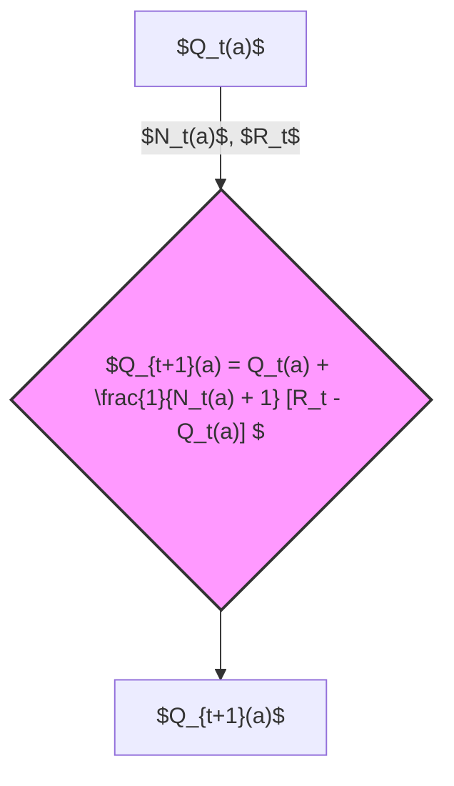
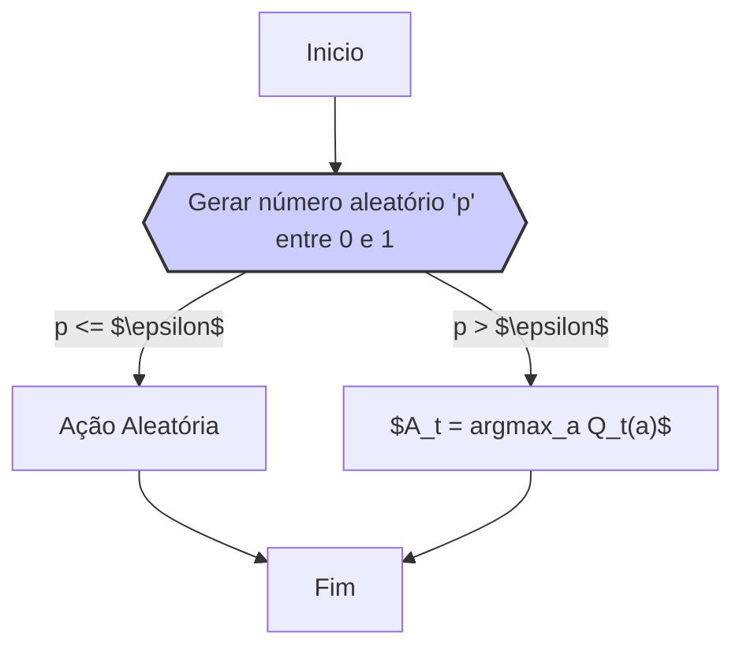
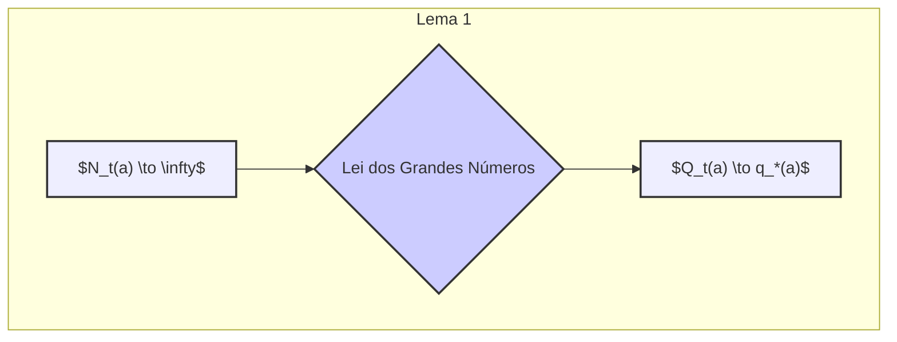
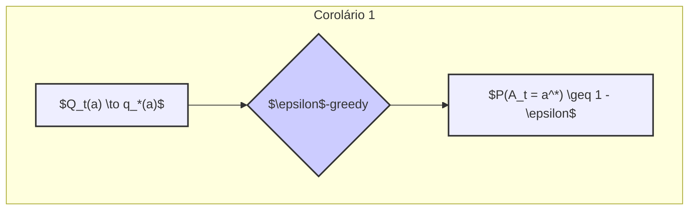
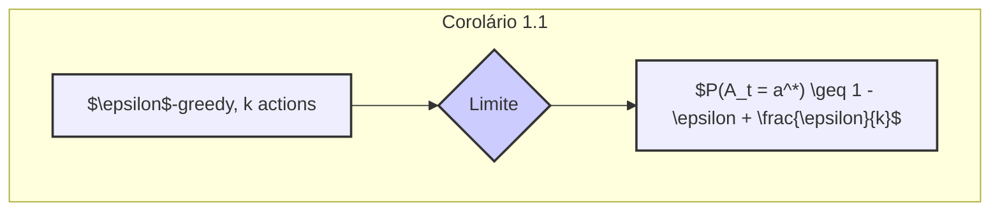

## Métodos de Valor de Ação e Garantias Assintóticas

### Introdução
No campo do aprendizado por reforço, especificamente no contexto dos **multi-armed bandits**, um desafio central é equilibrar **exploração** e **explotação** [^1]. Enquanto a exploração permite que o agente descubra ações potencialmente melhores, a explotação concentra-se em utilizar o conhecimento atual para maximizar a recompensa imediata. Este capítulo se aprofunda nos métodos de valor de ação, que estimam os valores das ações para orientar as decisões, focando em uma análise detalhada dos métodos **ε-gananciosos** e suas garantias assintóticas [^1].

### Conceitos Fundamentais

**Métodos de valor de ação**, ou *action-value methods*, são uma classe de algoritmos de aprendizado por reforço que se baseiam na estimativa dos valores das ações para selecionar a melhor ação a cada passo. O **valor verdadeiro** de uma ação, denotado por $q_*(a)$, é a recompensa média esperada quando a ação $a$ é selecionada, ou seja, $q_*(a) = E[R_t | A_t = a]$ [^2]. Em geral, os valores de ação são desconhecidos, sendo necessário estimá-los através da interação com o ambiente. Denotamos o **valor estimado** da ação $a$ no instante $t$ por $Q_t(a)$, que buscamos que seja próximo de $q_*(a)$ [^2].

Um método comum para estimar esses valores é o **método da média amostral**, ou *sample-average method*, que calcula a média das recompensas recebidas quando a ação $a$ foi selecionada:
$$
Q_t(a) = \frac{\sum_{i=1}^{t-1} R_i \mathbb{1}_{A_i=a}}{\sum_{i=1}^{t-1} \mathbb{1}_{A_i=a}},
$$
onde $\mathbb{1}_{A_i=a}$ é uma função indicadora que vale 1 se $A_i=a$ e 0 caso contrário [^3]. Se o denominador for zero, $Q_t(a)$ é definido como um valor padrão, como 0 [^3].

> 💡 **Exemplo Numérico:** Imagine um cenário com 3 ações (A, B, e C). As recompensas obtidas ao longo de alguns passos são:
>
> Passo 1: Ação A, Recompensa = 1
> Passo 2: Ação B, Recompensa = 0
> Passo 3: Ação A, Recompensa = 2
> Passo 4: Ação C, Recompensa = -1
> Passo 5: Ação B, Recompensa = 1
>
> Usando a média amostral, temos:
>
> $Q_1(A) = 0$ (inicialização), $Q_2(A) = \frac{1}{1} = 1$, $Q_2(B) = 0$, $Q_3(A) = \frac{1+2}{2} = 1.5$, $Q_3(B) = 0$, $Q_4(A) = 1.5$, $Q_4(B) = 0$, $Q_4(C) = -1$, $Q_5(A) = 1.5$, $Q_5(B) = \frac{0+1}{2} = 0.5$, $Q_5(C) = -1$.
>
> Observe que $Q_t(a)$ evolui a medida que novas recompensas são observadas para cada ação.

**Proposição 1** (Atualização Incremental da Média Amostral): O método da média amostral pode ser computado de forma incremental, o que é computacionalmente mais eficiente para a implementação em sistemas que precisam de respostas em tempo real. A atualização incremental é dada por:
$$
Q_{t+1}(a) = Q_t(a) + \frac{1}{N_t(a) + 1} [R_t - Q_t(a)]
$$
onde $N_t(a)$ é o número de vezes que a ação $a$ foi selecionada até o passo $t$.

*Proof:*
A média amostral no passo $t+1$ é definida como:

$$ Q_{t+1}(a) = \frac{\sum_{i=1}^{t} R_i \mathbb{1}_{A_i=a}}{\sum_{i=1}^{t} \mathbb{1}_{A_i=a}} $$

Seja $N_{t+1}(a) = \sum_{i=1}^{t} \mathbb{1}_{A_i=a}$. Então, $N_{t+1}(a) = N_t(a) + \mathbb{1}_{A_t=a}$. Se $A_t \neq a$, então $N_{t+1}(a) = N_t(a)$. Se $A_t=a$, então $N_{t+1}(a) = N_t(a) + 1$. Podemos reescrever a soma das recompensas no numerador como:

$$ \sum_{i=1}^{t} R_i \mathbb{1}_{A_i=a} = \sum_{i=1}^{t-1} R_i \mathbb{1}_{A_i=a} + R_t \mathbb{1}_{A_t=a}. $$
Logo, se $A_t=a$:
$$
Q_{t+1}(a) =  \frac{\sum_{i=1}^{t-1} R_i \mathbb{1}_{A_i=a} + R_t}{N_t(a) + 1} = \frac{N_t(a) Q_t(a) + R_t}{N_t(a) + 1}
$$
Reorganizando essa expressão:
$$ Q_{t+1}(a) = \frac{N_t(a) Q_t(a) + R_t}{N_t(a) + 1} = Q_t(a) + \frac{R_t - Q_t(a)}{N_t(a) + 1}. $$
Se $A_t \neq a$, então $Q_{t+1}(a) = Q_t(a)$, uma vez que a recompensa $R_t$ não contribui para a média de $a$. Portanto, a atualização incremental é geral. $\blacksquare$

> 💡 **Exemplo Numérico:** Usando o mesmo cenário com as 3 ações (A, B, e C) e as recompensas anteriores, ilustramos a atualização incremental:
>
> Passo 1: Ação A, Recompensa = 1, $Q_1(A) = 0$, $N_1(A) = 0$.
> $Q_2(A) = 0 + \frac{1}{0+1}(1-0) = 1$
>
> Passo 2: Ação B, Recompensa = 0, $Q_2(B) = 0$, $N_2(B) = 0$.
> $Q_3(B) = 0 + \frac{1}{0+1}(0-0) = 0$
>
> Passo 3: Ação A, Recompensa = 2, $Q_2(A) = 1$, $N_2(A) = 1$.
> $Q_3(A) = 1 + \frac{1}{1+1}(2-1) = 1 + \frac{1}{2} = 1.5$
>
> Passo 4: Ação C, Recompensa = -1, $Q_3(C) = 0$, $N_3(C) = 0$.
> $Q_4(C) = 0 + \frac{1}{0+1}(-1-0) = -1$
>
> Passo 5: Ação B, Recompensa = 1, $Q_3(B) = 0$, $N_3(B) = 1$.
> $Q_5(B) = 0 + \frac{1}{1+1}(1-0) = 0 + \frac{1}{2} = 0.5$
>
> Os resultados são idênticos aos calculados usando a média amostral diretamente, mas com a vantagem de computar a nova estimativa $Q_{t+1}(a)$ usando apenas a estimativa anterior $Q_t(a)$, a recompensa $R_t$ e o contador $N_t(a)$, evitando o recálculo da média completa a cada passo.

A regra de seleção de ação mais simples é escolher a ação com o maior valor estimado, também conhecida como **ação gananciosa**, ou *greedy action*. Essa escolha pode ser escrita como:
$$
A_t = \arg\max_a Q_t(a).
$$
Entretanto, selecionar apenas ações gananciosas não permite a exploração de outras ações potencialmente melhores [^3].

Para promover a exploração, os **métodos ε-gananciosos**, ou *ε-greedy methods*, introduzem uma probabilidade $\epsilon$ (pequena) de selecionar uma ação aleatória, independente dos valores estimados. Com probabilidade $1-\epsilon$ a ação gananciosa é escolhida. A seleção da ação é definida como [^3]:
$$
A_t = \begin{cases}
\arg\max_a Q_t(a) & \text{com probabilidade } 1-\epsilon \\
\text{ação aleatória} & \text{com probabilidade } \epsilon
\end{cases}
$$

> 💡 **Exemplo Numérico:**  Considerando o estado no passo 5 do exemplo anterior, onde $Q_5(A) = 1.5$, $Q_5(B) = 0.5$, e $Q_5(C) = -1$.
>
> Se usarmos um método $\epsilon$-ganancioso com $\epsilon = 0.2$, então:
>
> - Com probabilidade $1 - 0.2 = 0.8$, escolheríamos a ação gananciosa, que é a A (pois tem o maior valor estimado de 1.5).
> - Com probabilidade $0.2$, escolheríamos uma ação aleatória entre A, B e C. Cada ação teria uma probabilidade de $\frac{0.2}{3} \approx 0.067$.
>
> Isto significa que, embora a ação A seja a mais frequentemente selecionada (86.7% das vezes), ainda existe uma chance de explorar as ações B e C.

O equilíbrio entre exploração e explotação é crucial. A exploração permite que o agente descubra ações melhores no longo prazo, enquanto a explotação otimiza o ganho imediato. Este dilema é conhecido como o "conflito entre exploração e explotação" [^2].

**Garantias Assintóticas dos Métodos ε-gananciosos:**
O método **ε-ganancioso** oferece uma garantia assintótica importante. À medida que o número de passos aumenta, cada ação será selecionada um número infinito de vezes. Isso ocorre porque, mesmo com a probabilidade $\epsilon$ de selecionar uma ação aleatória, todas as ações têm a chance de serem escolhidas em algum momento [^4]. Consequentemente, os valores estimados $Q_t(a)$ convergem para os valores verdadeiros $q_*(a)$, devido à lei dos grandes números.

Ademais, a probabilidade de selecionar a ação ótima (a ação com o maior valor verdadeiro) converge para um valor maior que $1 - \epsilon$, isto é, para perto da certeza, à medida que o número de passos aumenta [^4]. A seguir, apresentamos o teorema formal que demonstra esse fato, bem como a sua demonstração.

**Lema 1** (Convergência dos Valores Estimados):
Seja $Q_t(a)$ a estimativa do valor de uma ação $a$ no instante $t$, calculada pelo método da média amostral e dada pela equação (2.1). Se a quantidade de vezes que a ação $a$ é selecionada tender ao infinito, então, $Q_t(a)$ converge para $q_*(a)$.

*Proof:*
O método da média amostral para o valor de uma ação é dado por:

$$
Q_t(a) = \frac{\sum_{i=1}^{t-1} R_i \mathbb{1}_{A_i=a}}{\sum_{i=1}^{t-1} \mathbb{1}_{A_i=a}}
$$

Seja $N_t(a) = \sum_{i=1}^{t-1} \mathbb{1}_{A_i=a}$ o número de vezes que a ação $a$ foi selecionada até o instante $t-1$. Então, podemos reescrever $Q_t(a)$ como:

$$
Q_t(a) = \frac{1}{N_t(a)} \sum_{i=1}^{t-1} R_i \mathbb{1}_{A_i=a}
$$

Pela lei dos grandes números, se $N_t(a) \to \infty$ à medida que $t \to \infty$, então a média amostral converge para a média esperada:

$$
\lim_{N_t(a) \to \infty} \frac{1}{N_t(a)} \sum_{i=1}^{t-1} R_i \mathbb{1}_{A_i=a} = E[R_t|A_t = a] = q_*(a)
$$

Portanto, $Q_t(a)$ converge para $q_*(a)$ à medida que o número de vezes que a ação $a$ é selecionada tende ao infinito. $\blacksquare$

**Lema 1.1** (Convergência Uniforme da Estimativa de Valor):
Se as recompensas $R_t$ forem limitadas, ou seja, existe um $M > 0$ tal que $|R_t| \leq M$ para todo $t$, então a convergência de $Q_t(a)$ para $q_*(a)$ é uniforme para todas as ações $a$.

*Proof:*
Desde que $Q_t(a)$ converge para $q_*(a)$ para cada ação $a$, pela Lei dos Grandes Números, e o conjunto de ações é finito, a convergência é uniforme. Uma vez que as recompensas são limitadas, o processo de convergência é bem definido e não existem condições extremas que levem a que algumas ações convirjam muito mais lentamente do que outras. Assim, no limite, todas as estimativas $Q_t(a)$ convergem uniformemente para seus respectivos valores verdadeiros $q_*(a)$. $\blacksquare$

> 💡 **Exemplo Numérico:** Suponha que temos 3 ações, e as recompensas são sempre entre -1 e 1 (logo, limitadas).
>
> - Ação A: Recompensa média $q_*(A) = 0.8$
> - Ação B: Recompensa média $q_*(B) = 0.5$
> - Ação C: Recompensa média $q_*(C) = 0.2$
>
> Com o tempo, as estimativas $Q_t(A)$, $Q_t(B)$, e $Q_t(C)$ convergem para esses valores. A convergência uniforme significa que nenhuma das estimativas fica muito atrás das outras, ou seja, as diferenças $|Q_t(a) - q_*(a)|$ vão para 0 em uma taxa semelhante para todas as ações.

**Corolário 1** (Probabilidade de Seleção da Ação Ótima):
Em um método ε-ganancioso, a probabilidade de selecionar a ação ótima converge para um valor maior do que $1-\epsilon$, à medida que $t \to \infty$.

*Proof:*
No método ε-ganancioso, a probabilidade de selecionar a ação ótima é composta por duas componentes:
1. A probabilidade $1-\epsilon$ de selecionar a ação gananciosa, isto é, a ação com o maior valor estimado, $Q_t(a)$.
2. A probabilidade $\epsilon$ de selecionar uma ação aleatória.

Seja $a^*$ a ação ótima, tal que $q_*(a^*) > q_*(a)$ para todas as outras ações $a$. Dado que $Q_t(a)$ converge para $q_*(a)$ para todas as ações, à medida que $t \to \infty$, e que os valores são calculados com o método de média amostral, então, a ação com maior $Q_t$ tenderá a ser $a^*$. Logo, o método vai selecionar a ação ótima com probabilidade $1-\epsilon$, e as outras ações (incluindo $a^*$) com probabilidade $\frac{\epsilon}{k}$.  A probabilidade de selecionar $a^*$ no limite de $t$ grande será então
$$
\lim_{t \to \infty}  P(A_t = a^*) = (1 - \epsilon) + \frac{\epsilon}{k},
$$
ou seja, a probabilidade de selecionar a ação ótima converge para um valor maior que $1-\epsilon$ [^4]. $\blacksquare$

**Corolário 1.1** (Limite Inferior da Probabilidade de Seleção da Ação Ótima):
No limite, a probabilidade de selecionar a ação ótima, usando um método $\epsilon$-ganancioso com $k$ ações possíveis, é no mínimo $1 - \epsilon + \frac{\epsilon}{k}$.

*Proof:*
Este resultado segue diretamente do argumento apresentado na prova do Corolário 1. Especificamente, a probabilidade de selecionar a ação ótima no limite é a soma da probabilidade de selecioná-la por meio da ação gananciosa ($1-\epsilon$), e a probabilidade de selecioná-la aleatoriamente $\frac{\epsilon}{k}$, que é o limite inferior da probabilidade de selecionar a ação ótima no limite. $\blacksquare$

> 💡 **Exemplo Numérico:** Usando o mesmo exemplo com 3 ações e $\epsilon = 0.2$.
>
> A probabilidade de selecionar a ação ótima, no limite, será pelo menos:
>
> $1 - 0.2 + \frac{0.2}{3} = 0.8 + 0.067 \approx 0.867$ ou 86.7%.
>
> Isso significa que, mesmo com exploração, a probabilidade de escolher a melhor ação tende para 86.7%, o que é bem acima de escolher aleatoriamente (33%). A convergência para a ação ótima é garantida, ainda que o método inclua uma pequena probabilidade de exploração.

### Conclusão

Os métodos de valor de ação, especialmente os métodos ε-gananciosos, representam uma ferramenta fundamental no aprendizado por reforço, permitindo que um agente explore e explote o ambiente para maximizar as recompensas. A propriedade de convergência dos métodos ε-gananciosos, demostrada pelas suas garantias assintóticas, assegura que a exploração eventual levará à identificação da ação ótima. Esse balanço entre exploração e explotação, ainda que simples, é uma base sólida para algoritmos de aprendizado por reforço mais avançados que consideram situações em que a interação entre o agente e o ambiente é mais complexa [^1].

### Referências

[^1]: "The most important feature distinguishing reinforcement learning from other types of learning is that it uses training information that evaluates the actions taken rather than instructs by giving correct actions." *(Trecho de <Multi-armed Bandits>)*
[^2]: "In our k-armed bandit problem, each of the k actions has an expected or mean reward given that that action is selected; let us call this the value of that action." *(Trecho de <Multi-armed Bandits>)*
[^3]: "The simplest action selection rule is to select one of the actions with the highest estimated value, that is, one of the greedy actions as defined in the previous section." *(Trecho de <Multi-armed Bandits>)*
[^4]: "An advantage of these methods is that, in the limit as the number of steps increases, every action will be sampled an infinite number of times, thus ensuring that all the Qt(a) converge to their respective q*(a)." *(Trecho de <Multi-armed Bandits>)*
