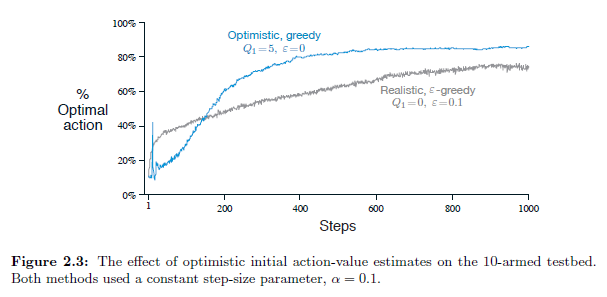

## Rastreamento de Problemas Não-Estacionários em Bandidos Multi-armados

### Introdução
Nos capítulos anteriores, analisamos métodos de aprendizado por reforço (RL) no contexto de problemas de *k-armed bandits* com distribuições de recompensa *estacionárias*. No entanto, muitos problemas de RL são efetivamente **não-estacionários**, o que significa que as probabilidades de recompensa das ações mudam ao longo do tempo [^32]. Portanto, é crucial adaptar as técnicas de aprendizado para lidar com essas mudanças, dando mais peso às recompensas recentes do que às recompensas passadas. Esta seção detalha como adaptar métodos de valor de ação para cenários não estacionários, com foco no uso de um parâmetro de tamanho de passo constante [^32].

### Implementação Incremental com Tamanho de Passo Constante
Para problemas *estacionários*, a estimativa do valor da ação é uma média amostral das recompensas observadas [^27]. No entanto, essa abordagem atribui igual peso a todas as recompensas, o que não é ideal para problemas não estacionários. Em vez disso, podemos usar um **tamanho de passo constante** $\alpha \in (0, 1]$ para atualizar as estimativas de valor da ação. A regra de atualização incremental, apresentada anteriormente, é modificada para [^32]:

$$
Q_{n+1} = Q_n + \alpha [R_n - Q_n] \quad (2.5)
$$

onde $Q_{n+1}$ é a nova estimativa de valor da ação, $Q_n$ é a estimativa anterior, $R_n$ é a n-ésima recompensa recebida, e $\alpha$ é o tamanho de passo constante. Essa atualização resulta em $Q_{n+1}$ sendo uma média ponderada das recompensas passadas e da estimativa inicial $Q_1$. A equação (2.6) mostra essa média ponderada [^32]:

$$
Q_{n+1} = (1 - \alpha)^n Q_1 + \sum_{i=1}^{n} \alpha (1 - \alpha)^{n-i} R_i \quad (2.6)
$$

> 💡 **Exemplo Numérico:**
>
> Suponha que temos um problema de bandit com uma única ação. Inicializamos o valor estimado da ação $Q_1 = 0$. Escolhemos um tamanho de passo constante $\alpha = 0.1$. As recompensas que recebemos ao longo de 5 tentativas são: $R_1 = 1, R_2 = 2, R_3 = 0, R_4 = 1, R_5 = 3$. Vamos calcular as estimativas de valor da ação $Q_n$ para cada tentativa usando a Equação (2.5):
>
> *   Tentativa 1: $Q_2 = Q_1 + \alpha [R_1 - Q_1] = 0 + 0.1 [1 - 0] = 0.1$
> *   Tentativa 2: $Q_3 = Q_2 + \alpha [R_2 - Q_2] = 0.1 + 0.1 [2 - 0.1] = 0.1 + 0.1 * 1.9 = 0.29$
> *   Tentativa 3: $Q_4 = Q_3 + \alpha [R_3 - Q_3] = 0.29 + 0.1 [0 - 0.29] = 0.29 - 0.029 = 0.261$
> *   Tentativa 4: $Q_5 = Q_4 + \alpha [R_4 - Q_4] = 0.261 + 0.1 [1 - 0.261] = 0.261 + 0.1 * 0.739 = 0.3349$
> *   Tentativa 5: $Q_6 = Q_5 + \alpha [R_5 - Q_5] = 0.3349 + 0.1 [3 - 0.3349] = 0.3349 + 0.1 * 2.6651 = 0.60141$
>
> Observe como cada nova recompensa afeta a estimativa do valor da ação, mas o impacto das recompensas mais antigas diminui exponencialmente. Isso torna o algoritmo sensível a mudanças nas recompensas, o que é crucial em ambientes não estacionários.

Para demonstrar que a Equação (2.5) leva à Equação (2.6), podemos fornecer a seguinte prova:

*Prova:*
Provaremos que a aplicação repetida da atualização incremental com tamanho de passo constante (Equação 2.5) resulta na média ponderada das recompensas passadas e da estimativa inicial (Equação 2.6).

I.  Começamos com a Equação (2.5):
    $Q_{n+1} = Q_n + \alpha[R_n - Q_n]$

II. Podemos reescrever essa equação como:
    $Q_{n+1} = (1 - \alpha)Q_n + \alpha R_n$

III. Agora, aplicamos iterativamente essa equação, expandindo $Q_n$ em termos de $Q_{n-1}$ e $R_{n-1}$:
     $Q_{n+1} = (1 - \alpha)[(1 - \alpha)Q_{n-1} + \alpha R_{n-1}] + \alpha R_n$
     $Q_{n+1} = (1 - \alpha)^2 Q_{n-1} + \alpha(1 - \alpha)R_{n-1} + \alpha R_n$

IV. Continuamos este processo iterativamente até chegarmos a $Q_1$:
    $Q_{n+1} = (1 - \alpha)^n Q_1 + \alpha(1 - \alpha)^{n-1}R_1 + \alpha(1 - \alpha)^{n-2}R_2 + \ldots + \alpha(1 - \alpha)R_{n-1} + \alpha R_n$

V.  Reorganizando os termos, obtemos:
    $Q_{n+1} = (1 - \alpha)^n Q_1 + \sum_{i=1}^{n} \alpha (1 - \alpha)^{n-i} R_i$

Assim, a aplicação repetida da Equação (2.5) leva à Equação (2.6). ■

A equação (2.6) demonstra que o peso $ \alpha (1 - \alpha)^{n-i} $ dado à recompensa $ R_i $ depende de quão distante (em termos de passos) $ R_i $ foi observado no passado, com $n-i$ representando a distância. Quanto maior o valor de $ \alpha $, mais peso é dado às recompensas recentes, tornando o algoritmo mais sensível às mudanças no ambiente [^32].

> 💡 **Exemplo Numérico:**
>
> Para ilustrar o efeito do tamanho de passo $\alpha$, vamos considerar o exemplo anterior com $\alpha = 0.5$ em vez de $\alpha = 0.1$. Usando as mesmas recompensas ($R_1 = 1, R_2 = 2, R_3 = 0, R_4 = 1, R_5 = 3$) e $Q_1 = 0$, recalculemos as estimativas de valor da ação:
>
> *   Tentativa 1: $Q_2 = Q_1 + \alpha [R_1 - Q_1] = 0 + 0.5 [1 - 0] = 0.5$
> *   Tentativa 2: $Q_3 = Q_2 + \alpha [R_2 - Q_2] = 0.5 + 0.5 [2 - 0.5] = 0.5 + 0.5 * 1.5 = 1.25$
> *   Tentativa 3: $Q_4 = Q_3 + \alpha [R_3 - Q_3] = 1.25 + 0.5 [0 - 1.25] = 1.25 - 0.625 = 0.625$
> *   Tentativa 4: $Q_5 = Q_4 + \alpha [R_4 - Q_4] = 0.625 + 0.5 [1 - 0.625] = 0.625 + 0.5 * 0.375 = 0.8125$
> *   Tentativa 5: $Q_6 = Q_5 + \alpha [R_5 - Q_5] = 0.8125 + 0.5 [3 - 0.8125] = 0.8125 + 0.5 * 2.1875 = 1.90625$
>
> Com $\alpha = 0.5$, as estimativas de valor da ação mudam mais rapidamente em resposta às novas recompensas. Compare com o exemplo anterior onde $\alpha = 0.1$, as estimativas mudam mais lentamente. Um $\alpha$ maior torna o algoritmo mais adaptável, porém mais sensível ao ruído.
>
> ```python
> import numpy as np
> import matplotlib.pyplot as plt
>
> # Parâmetros
> alpha1 = 0.1
> alpha2 = 0.5
> rewards = [1, 2, 0, 1, 3]
> Q1 = 0
>
> # Cálculo das estimativas de valor da ação para alpha = 0.1
> Q_values_alpha1 = [Q1]
> for r in rewards:
>     Q1 = Q1 + alpha1 * (r - Q1)
>     Q_values_alpha1.append(Q1)
>
> # Cálculo das estimativas de valor da ação para alpha = 0.5
> Q1 = 0
> Q_values_alpha2 = [Q1]
> for r in rewards:
>     Q1 = Q1 + alpha2 * (r - Q1)
>     Q_values_alpha2.append(Q1)
>
> # Plotagem
> plt.figure(figsize=(10, 6))
> plt.plot(Q_values_alpha1, marker='o', label=f'Alpha = {alpha1}')
> plt.plot(Q_values_alpha2, marker='x', label=f'Alpha = {alpha2}')
> plt.xlabel('Tentativa')
> plt.ylabel('Estimativa de Valor da Ação (Q)')
> plt.title('Comparação da Estimativa de Valor da Ação com Diferentes Tamanhos de Passo')
> plt.grid(True)
> plt.legend()
> plt.xticks(range(len(Q_values_alpha1))) # Garante que todos os valores de x sejam exibidos
> plt.show()
> ```

Para complementar essa análise, podemos examinar o comportamento da média ponderada em relação a um valor alvo constante.

**Lema 1**
Se as recompensas $R_i$ forem identicamente iguais a um valor constante $R$, então $Q_{n+1}$ converge para $R$ quando $n$ tende ao infinito.

*Demonstração:*
Se $R_i = R$ para todo $i$, então a Equação (2.6) se torna:

$Q_{n+1} = (1 - \alpha)^n Q_1 + \sum_{i=1}^{n} \alpha (1 - \alpha)^{n-i} R$
$Q_{n+1} = (1 - \alpha)^n Q_1 + R \sum_{i=1}^{n} \alpha (1 - \alpha)^{n-i}$

A soma é uma série geométrica: $\sum_{i=1}^{n} \alpha (1 - \alpha)^{n-i} = 1 - (1 - \alpha)^n$.

Para provar que $\sum_{i=1}^{n} \alpha (1 - \alpha)^{n-i} = 1 - (1 - \alpha)^n$, fornecemos a seguinte prova:

I. Seja $S = \sum_{i=1}^{n} \alpha (1 - \alpha)^{n-i}$.

II. Podemos reescrever a soma invertendo a ordem dos termos:
    $S = \alpha + \alpha(1 - \alpha) + \alpha(1 - \alpha)^2 + \ldots + \alpha(1 - \alpha)^{n-1}$

III. Multiplicamos ambos os lados por $(1 - \alpha)$:
     $(1 - \alpha)S = \alpha(1 - \alpha) + \alpha(1 - \alpha)^2 + \ldots + \alpha(1 - \alpha)^{n-1} + \alpha(1 - \alpha)^n$

IV. Subtraímos a Equação III da Equação II:
    $S - (1 - \alpha)S = \alpha - \alpha(1 - \alpha)^n$
    $\alpha S = \alpha - \alpha(1 - \alpha)^n$

V. Dividimos ambos os lados por $\alpha$:
    $S = 1 - (1 - \alpha)^n$

Portanto, $\sum_{i=1}^{n} \alpha (1 - \alpha)^{n-i} = 1 - (1 - \alpha)^n$ ■

Portanto, $Q_{n+1} = (1 - \alpha)^n Q_1 + R [1 - (1 - \alpha)^n]$.

Quando $n \to \infty$, $(1 - \alpha)^n \to 0$ dado que $0 < \alpha \leq 1$.

Assim, $\lim_{n \to \infty} Q_{n+1} = R$. ■

### Considerações de Convergência
A escolha de um tamanho de passo apropriado é crucial. Para garantir a convergência em problemas *estacionários*, as seguintes condições, derivadas da teoria de aproximação estocástica, devem ser satisfeitas [^33]:

$$
\sum_{n=1}^{\infty} \alpha_n(a) = \infty \quad \text{e} \quad \sum_{n=1}^{\infty} \alpha_n^2(a) < \infty \quad (2.7)
$$

A primeira condição garante que os passos sejam grandes o suficiente para superar as condições iniciais ou flutuações aleatórias, enquanto a segunda condição garante que os passos eventualmente se tornem pequenos o suficiente para assegurar a convergência [^33]. No entanto, com um tamanho de passo constante $ \alpha $, a segunda condição não é satisfeita, indicando que as estimativas nunca convergem completamente, mas continuam a variar em resposta às recompensas mais recentemente recebidas. Essa falta de convergência completa é desejável em ambientes não estacionários [^33].

> 💡 **Exemplo Numérico:**
>
> Consideremos o tamanho de passo constante $\alpha = 0.1$.  Vamos verificar se as condições de convergência da teoria de aproximação estocástica são satisfeitas:
>
> *   Condição 1: $\sum_{n=1}^{\infty} \alpha_n(a) = \sum_{n=1}^{\infty} 0.1$. Essa soma diverge porque estamos adicionando 0.1 infinitas vezes.
> *   Condição 2: $\sum_{n=1}^{\infty} \alpha_n^2(a) = \sum_{n=1}^{\infty} (0.1)^2 = \sum_{n=1}^{\infty} 0.01$. Essa soma também diverge porque estamos adicionando 0.01 infinitas vezes.
>
> Como a segunda condição não é satisfeita, isso indica que o uso de um tamanho de passo constante não garante a convergência em um ambiente estacionário. No entanto, é desejável em ambientes não estacionários, pois permite que o algoritmo se adapte continuamente às mudanças.
>
> Agora, considere um tamanho de passo decrescente $\alpha_n = 1/n$. Vamos verificar as condições de convergência:
>
> *   Condição 1: $\sum_{n=1}^{\infty} \alpha_n(a) = \sum_{n=1}^{\infty} 1/n$. Essa é a série harmônica, que diverge.
> *   Condição 2: $\sum_{n=1}^{\infty} \alpha_n^2(a) = \sum_{n=1}^{\infty} (1/n)^2 = \sum_{n=1}^{\infty} 1/n^2$. Essa é a série p com p = 2, que converge para $\pi^2 / 6 \approx 1.645$.
>
> Como ambas as condições são satisfeitas, o tamanho de passo decrescente garante a convergência em um ambiente estacionário.

Para elucidar ainda mais as implicações da não-convergência em ambientes não-estacionários, considere a seguinte proposição:

**Proposição 2**
Em um ambiente onde a recompensa esperada de uma ação muda abruptamente no tempo $t^*$, um tamanho de passo constante $\alpha$ permite que a estimativa $Q_n$ se adapte à nova recompensa esperada, enquanto um tamanho de passo decrescente (satisfazendo as condições de convergência para ambientes estacionários) faria com que a estimativa $Q_n$ convirja para um valor desatualizado.

*Demonstração (Esboço)*
Suponha que para $t < t^*$, $E[R_t] = \mu_1$, e para $t \geq t^*$, $E[R_t] = \mu_2$, onde $\mu_1 \neq \mu_2$. Com um tamanho de passo constante $\alpha$, $Q_n$ se aproximará de $\mu_2$ após $t^*$. Com um tamanho de passo decrescente $\alpha_n$, o impacto das recompensas após $t^*$ diminuirá com o tempo, e $Q_n$ tenderá a um valor entre $\mu_1$ e $\mu_2$, influenciado principalmente por $\mu_1$ devido às primeiras iterações terem maior peso.

> 💡 **Exemplo Numérico:**
>
> Suponha que temos uma única ação. Inicialmente, a recompensa esperada é $\mu_1 = 1$. No tempo $t^* = 100$, a recompensa esperada muda abruptamente para $\mu_2 = 5$. Vamos comparar o comportamento de $Q_n$ com um tamanho de passo constante $\alpha = 0.1$ e um tamanho de passo decrescente $\alpha_n = 1/n$. Inicializamos $Q_1 = 0$ em ambos os casos.
>
> Para simplificar, vamos simular as recompensas como sendo exatamente iguais à recompensa esperada em cada período (sem ruído).
>
> *   **Tamanho de passo constante ($\alpha = 0.1$):**
>     *   Para $t < 100$, $R_t = 1$. Após muitas iterações, $Q_n$ se aproximará de 1.
>     *   Para $t \geq 100$, $R_t = 5$.  $Q_{100} \approx 1$.  Então, $Q_{101} = 1 + 0.1(5 - 1) = 1.4$, $Q_{102} = 1.4 + 0.1(5 - 1.4) = 1.76$, etc.  $Q_n$ eventualmente se aproximará de 5.
> *   **Tamanho de passo decrescente ($\alpha_n = 1/n$):**
>     *   Para $t < 100$, $R_t = 1$. Após 100 iterações, $Q_{100} \approx 1$ (devido à propriedade de convergência de tamanhos de passo decrescentes em ambientes estacionários).
>     *   Para $t \geq 100$, $R_t = 5$.  $Q_{101} = 1 + (1/101)(5 - 1) = 1 + 4/101 \approx 1.04$, $Q_{102} = 1.04 + (1/102)(5 - 1.04) \approx 1.079$, etc. Devido ao tamanho de passo decrescente, $Q_n$ se adaptará muito lentamente à nova recompensa esperada de 5.  Ele convergirá para um valor entre 1 e 5, mas muito mais próximo de 1.
>
> Este exemplo ilustra como o tamanho de passo constante permite uma adaptação mais rápida às mudanças no ambiente, enquanto o tamanho de passo decrescente torna o algoritmo mais lento para se ajustar.
>
> ```python
> import numpy as np
> import matplotlib.pyplot as plt
>
> # Parâmetros
> alpha_constant = 0.1
> rewards1 = [1] * 100 + [5] * 100 # Recompensa muda em t=100
> rewards2 = [1] * 100 + [5] * 100 # Recompensa muda em t=100
> Q_initial = 0
>
> # Cálculo das estimativas de valor da ação com tamanho de passo constante
> Q_constant = [Q_initial]
> Q = Q_initial
> for i, r in enumerate(rewards1):
>     Q = Q + alpha_constant * (r - Q)
>     Q_constant.append(Q)
>
> # Cálculo das estimativas de valor da ação com tamanho de passo decrescente
> Q_decreasing = [Q_initial]
> Q = Q_initial
> for i, r in enumerate(rewards2):
>     alpha_decreasing = 1 / (i + 1)
>     Q = Q + alpha_decreasing * (r - Q)
>     Q_decreasing.append(Q)
>
> # Plotagem
> plt.figure(figsize=(12, 6))
> plt.plot(Q_constant, label='Tamanho de Passo Constante (alpha=0.1)')
> plt.plot(Q_decreasing, label='Tamanho de Passo Decrescente (alpha=1/n)')
> plt.xlabel('Tentativa')
> plt.ylabel('Estimativa de Valor da Ação (Q)')
> plt.title('Comparação de Tamanhos de Passo em Ambiente Não Estacionário')
> plt.axvline(x=100, color='r', linestyle='--', label='Mudança na Recompensa Esperada')
> plt.legend()
> plt.grid(True)
> plt.show()
> ```

### Abordagens alternativas para tamanho de passo não constante

Uma forma de evitar o viés de tamanhos de passo constantes, mantendo as vantagens para problemas não-estacionários é usar o seguinte tamanho de passo [^35]:

$$
\beta_n = \alpha / \overline{o}_n \quad (2.8)
$$

onde $ \alpha > 0 $ é um tamanho de passo constante convencional e $ \overline{o}_n $ é um traço que começa em 0 [^35]:

$$
\overline{o}_n = \overline{o}_{n-1} + \alpha(1 - \overline{o}_{n-1}), \text{ para } n > 0, \text{ com } \overline{o}_0 = 0 \quad (2.9)
$$

> 💡 **Exemplo Numérico:**
>
> Seja $\alpha = 0.1$. Vamos calcular os primeiros valores de $\overline{o}_n$ usando a Equação (2.9):
>
> *   $\overline{o}_0 = 0$
> *   $\overline{o}_1 = \overline{o}_0 + \alpha(1 - \overline{o}_0) = 0 + 0.1(1 - 0) = 0.1$
> *   $\overline{o}_2 = \overline{o}_1 + \alpha(1 - \overline{o}_1) = 0.1 + 0.1(1 - 0.1) = 0.1 + 0.1 * 0.9 = 0.19$
> *   $\overline{o}_3 = \overline{o}_2 + \alpha(1 - \overline{o}_2) = 0.19 + 0.1(1 - 0.19) = 0.19 + 0.1 * 0.81 = 0.271$
> *   $\overline{o}_4 = \overline{o}_3 + \alpha(1 - \overline{o}_3) = 0.271 + 0.1(1 - 0.271) = 0.271 + 0.1 * 0.729 = 0.3439$
>
> Agora, vamos calcular os primeiros valores de $\beta_n$ usando a Equação (2.8):
>
> *   $\beta_1 = \alpha / \overline{o}_1 = 0.1 / 0.1 = 1$
> *   $\beta_2 = \alpha / \overline{o}_2 = 0.1 / 0.19 \approx 0.526$
> *   $\beta_3 = \alpha / \overline{o}_3 = 0.1 / 0.271 \approx 0.369$
> *   $\beta_4 = \alpha / \overline{o}_4 = 0.1 / 0.3439 \approx 0.291$
>
> Observe que $\beta_n$ diminui com o tempo, mas não tão rapidamente quanto $1/n$. Isso permite uma adaptação inicial rápida e, em seguida, uma convergência mais estável.
>
> ```python
> import numpy as np
> import matplotlib.pyplot as plt
>
> # Parâmetro
> alpha = 0.1
>
> # Cálculo de o_n
> o_values = [0]
> o = 0
> for n in range(1, 101):
>     o = o + alpha * (1 - o)
>     o_values.append(o)
>
> # Cálculo de beta_n
> beta_values = [alpha / o for o in o_values[1:]]
>
> # Plotagem de o_n
> plt.figure(figsize=(12, 6))
> plt.plot(o_values, label='overline{o}_n')
> plt.xlabel('n')
> plt.ylabel('overline{o}_n')
> plt.title('Comportamento de overline{o}_n')
> plt.grid(True)
> plt.legend()
> plt.show()
>
> # Plotagem de beta_n
> plt.figure(figsize=(12, 6))
> plt.plot(beta_values, label='beta_n = alpha / overline{o}_n')
> plt.xlabel('n')
> plt.ylabel('beta_n')
> plt.title('Comportamento de beta_n')
> plt.grid(True)
> plt.legend()
> plt.show()
> ```

Podemos ainda analisar o comportamento de $ \overline{o}_n $ à medida que $ n $ aumenta.

**Lema 3**
A sequência $ \overline{o}_n $ definida pela Equação (2.9) converge para 1 à medida que $ n $ tende ao infinito.

*Demonstração:*
A Equação (2.9) pode ser reescrita como:

$ \overline{o}_n = \overline{o}_{n-1} + \alpha - \alpha\overline{o}_{n-1} = (1 - \alpha)\overline{o}_{n-1} + \alpha $

Esta é uma relação de recorrência linear de primeira ordem.  Podemos encontrar o ponto fixo resolvendo $ x = (1 - \alpha)x + \alpha $, o que implica $ \alpha x = \alpha $, então $ x = 1 $.

Para demonstrar a convergência, podemos analisar a diferença entre $ \overline{o}_n $ e seu ponto fixo (1):

$ 1 - \overline{o}_n = 1 - [(1 - \alpha)\overline{o}_{n-1} + \alpha] = (1 - \alpha)(1 - \overline{o}_{n-1}) $

Aplicando recursivamente, temos:

$ 1 - \overline{o}_n = (1 - \alpha)^n (1 - \overline{o}_0) = (1 - \alpha)^n $

Como $ 0 < \alpha \leq 1 $, temos $ \lim_{n \to \infty} (1 - \alpha)^n = 0 $.

Portanto, $ \lim_{n \to \infty} \overline{o}_n = 1 $. ■

### Valores Iniciais Otimistas
Como discutido anteriormente, as estimativas de valor de ação iniciais podem influenciar o comportamento de exploração [^34]. Definir valores iniciais otimistas, como definir $Q_1(a)$ para um valor significativamente alto (por exemplo, +5), incentiva a exploração, pois as recompensas iniciais serão provavelmente menores do que a estimativa inicial, levando o agente a tentar diferentes ações. No entanto, essa abordagem é mais eficaz em problemas *estacionários* e pode não ser tão benéfica em problemas *não estacionários*, pois o impulso de exploração é temporário [^34].



> 💡 **Exemplo Numérico:**
>
> Consideremos um problema com duas ações. Inicializamos os valores de ação para $Q_1(1) = 5$ e $Q_1(2) = 5$ (valores iniciais otimistas). Suponha que a recompensa real para a ação 1 seja 1 e a recompensa real para a ação 2 seja 0. Usando $\alpha = 0.1$:
>
> *   Após selecionar a ação 1: $Q_2(1) = 5 + 0.1(1 - 5) = 4.6$. O agente continua a explorar outras ações porque $Q_2(1)$ ainda é relativamente alto.
> *   Após selecionar a ação 2: $Q_2(2) = 5 + 0.1(0 - 5) = 4.5$.
>
> Em um problema *estacionário*, isso levaria o agente a explorar ambas as ações por um tempo considerável até que suas estimativas de valor se aproximem de suas recompensas reais.
>
> Agora, suponha que, após 100 etapas, a recompensa da ação 1 mude para 6.  Como $Q(1)$ já está baixo (perto do valor real antigo), ele começará a aumentar em direção ao novo valor de 6 rapidamente.
>
> Em contraste, se os valores iniciais fossem 0, a exploração inicial seria menor, mas a adaptação à mudança na recompensa seria mais rápida.
>
> ```python
> import numpy as np
> import matplotlib.pyplot as plt
>
> # Parâmetros
> alpha = 0.1
> initial_value = 5
> rewards_action1 = [1] * 100 + [6] * 100  # Mudança na recompensa da ação 1 em t=100
> rewards_action2 = [0] * 200
>
> # Inicialização otimista
> Q_action1_optimistic = [initial_value]
> Q = initial_value
> for i, r in enumerate(rewards_action1):
>     Q = Q + alpha * (r - Q)
>     Q_action1_optimistic.append(Q)
>
> # Inicialização neutra
> Q_action1_neutral = [0]
> Q = 0
> for i, r in enumerate(rewards_action1):
>     Q = Q + alpha * (r - Q)
>     Q_action1_neutral.append(Q)
>
> # Plotagem
> plt.figure(figsize=(12, 6))
> plt.plot(Q_action1_optimistic, label='Inicialização Otimista (Q=5)')
> plt.plot(Q_action1_neutral, label='Inicialização Neutra (Q=0)')
> plt.xlabel('Tentativa')
> plt.ylabel('Estimativa de Valor da Ação 1 (Q)')
> plt.title('Comparação de Inicializações em Ambiente Não Estacionário')
> plt.axvline(x=100, color='r', linestyle='--', label='Mudança na Recompensa da Ação 1')
> plt.legend()
> plt.grid(True)
> plt.show()
> ```

Para formalizar essa intuição, considere o seguinte cenário:

**Teorema 4**
Em um problema não-estacionário onde a recompensa média de uma ação ótima diminui drasticamente após um tempo $t^*$, o uso de valores iniciais otimistas pode levar a um desempenho subótimo em comparação com o uso de valores iniciais neutros (por exemplo, 0).

*Demonstração (Esboço)*
Suponha que inicialmente uma ação $a^*$ tenha uma recompensa média alta, levando a uma estimativa de valor $Q(a^*)$ alta devido ao valor inicial otimista. Após $t^*$, a recompensa média de $a^*$ diminui.  Devido à estimativa inicial inflacionada, pode levar um tempo considerável para $Q(a^*)$ se ajustar à nova recompensa média, durante o qual o agente continua explorando outras ações. No entanto, se o valor inicial fosse neutro, o agente se adaptaria mais rapidamente à mudança na recompensa média de $a^*$, potencialmente convergindo para uma ação diferente mais rapidamente e alcançando um desempenho melhor no longo prazo.

### Conclusão
O rastreamento de problemas *não estacionários* requer uma adaptação dos métodos de valor de ação para dar mais peso às recompensas recentes. O uso de um tamanho de passo constante $ \alpha $ fornece uma maneira eficaz de alcançar esse objetivo. Ao escolher cuidadosamente o valor de $ \alpha $, o algoritmo pode se adaptar às mudanças no ambiente enquanto ainda mantém um aprendizado robusto. Embora os valores iniciais otimistas possam ajudar na exploração, eles são menos eficazes em problemas *não estacionários* em comparação com os *estacionários*. Portanto, a seleção apropriada do tamanho de passo é crucial para um desempenho bem-sucedido em problemas *não estacionários* de *k-armed bandit* [^33].

### Referências
[^32]: Seção 2.5 do texto original
[^33]: Seção 2.5 do texto original
[^34]: Seção 2.6 do texto original
[^35]: Seção 2.7 do texto original
<!-- END -->