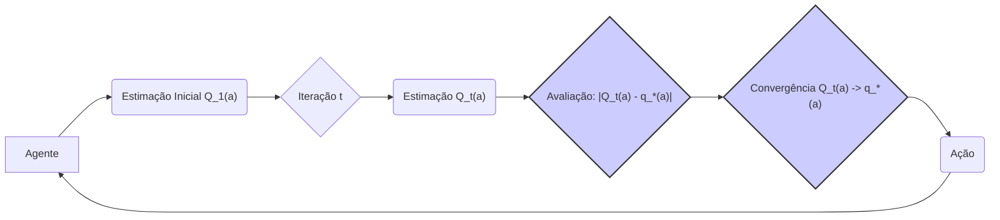
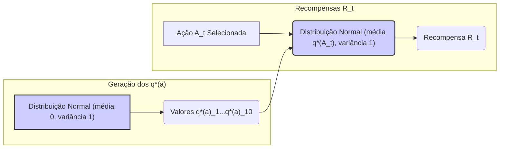
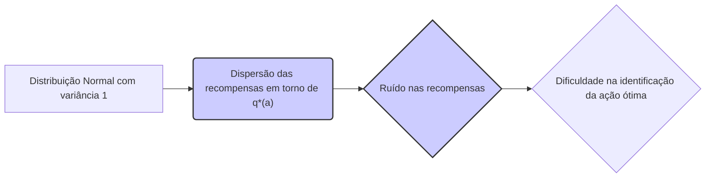
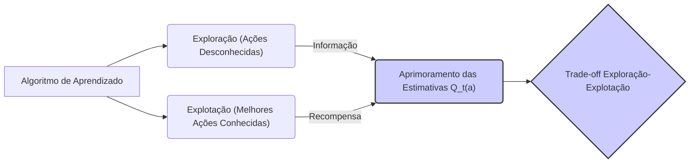

## O Testbed de 10 Braços: Uma Análise Detalhada

### Introdução

O estudo de métodos de aprendizado por reforço (reinforcement learning) frequentemente envolve a avaliação de algoritmos em cenários controlados. Para isso, o conceito de **testbeds** torna-se essencial, permitindo comparar o desempenho de diferentes métodos sob condições similares e replicáveis [1](https://chatgpt.com/c/67829922-359c-8011-96dd-970c04ed772c#user-content-fn-1). Este capítulo se concentra em explorar em detalhes o **testbed de 10 braços**, um ambiente usado para testar e comparar diversos algoritmos de aprendizado por reforço, particularmente no contexto de problemas *k-armed bandit* [1](https://chatgpt.com/c/67829922-359c-8011-96dd-970c04ed772c#user-content-fn-1). A relevância de tal análise reside na sua capacidade de elucidar as vantagens e desvantagens de diferentes abordagens de aprendizado por reforço, em especial no que tange ao **trade-off entre exploração e explotação**.

### Conceitos Fundamentais

O **problema k-armed bandit** [1](https://chatgpt.com/c/67829922-359c-8011-96dd-970c04ed772c#user-content-fn-1) serve como base para este testbed, onde o agente deve escolher repetidamente entre *k* ações diferentes. Cada ação resulta em uma recompensa numérica, cuja distribuição de probabilidade é estacionária e dependente da ação selecionada. O objetivo é maximizar a recompensa total esperada em um dado período, geralmente expresso em número de passos ou seleções de ação [2](https://chatgpt.com/c/67829922-359c-8011-96dd-970c04ed772c#user-content-fn-2). No contexto específico do testbed de 10 braços, *k* é igual a 10. Cada ação *a* possui um valor verdadeiro, denotado por $q_*(a)$, que representa a recompensa média esperada ao escolher essa ação. A grande dificuldade do problema é que, inicialmente, esses valores verdadeiros são desconhecidos para o agente, que precisa estimá-los.

**Proposição 2.1: Estimativas de Valor de Ação**
Como o agente não tem conhecimento prévio dos valores $q_*(a)$, ele deve construir estimativas, denotadas por $Q_t(a)$, em cada passo $t$. O objetivo de um algoritmo de aprendizado por reforço é fazer com que essas estimativas $Q_t(a)$ convirjam para os valores verdadeiros $q_*(a)$, pelo menos para as ações mais promissoras. A eficiência de um algoritmo pode ser medida pela velocidade e acurácia dessa convergência.

*Prova:* Dada a natureza desconhecida de $q_*(a)$, o agente precisa manter uma estimativa $Q_t(a)$. A qualidade do aprendizado é refletida pela diferença entre essas duas quantidades, ou seja, o erro $|Q_t(a) - q_*(a)|$. Um algoritmo eficiente visa reduzir esse erro ao longo do tempo, especialmente para as ações que levam a altas recompensas. $\blacksquare$

> 💡 **Exemplo Numérico:** Suponha que para uma dada ação *a*, o valor verdadeiro $q_*(a)$ seja 2.5. Inicialmente, o agente não conhece esse valor e pode começar com uma estimativa $Q_1(a) = 0$. Após algumas iterações, digamos $t=5$, a estimativa pode ser $Q_5(a) = 1.8$. O objetivo do algoritmo é fazer com que $Q_t(a)$ se aproxime de 2.5 à medida que o tempo $t$ aumenta. O erro inicial $|0 - 2.5| = 2.5$ deve diminuir para, por exemplo, $|1.8 - 2.5| = 0.7$ em $t=5$.

O testbed de 10 braços consiste em 2000 instâncias diferentes do problema *k-armed bandit*, geradas aleatoriamente [2](https://chatgpt.com/c/67829922-359c-8011-96dd-970c04ed772c#user-content-fn-2). Cada uma dessas instâncias define valores $q_*(a)$ distintos para as 10 ações. A geração desses valores segue um processo específico: os valores verdadeiros $q_*(a)$ são selecionados a partir de uma distribuição normal com média 0 e variância 1 [2](https://chatgpt.com/c/67829922-359c-8011-96dd-970c04ed772c#user-content-fn-2). Após a seleção de uma ação $A_t$ no instante de tempo *t*, a recompensa real $R_t$ é amostrada a partir de outra distribuição normal, desta vez com média igual a $q_*(A_t)$ e variância 1 [2](https://chatgpt.com/c/67829922-359c-8011-96dd-970c04ed772c#user-content-fn-2). Essa configuração é ilustrada na Figura 2.1 [4](https://chatgpt.com/c/67829922-359c-8011-96dd-970c04ed772c#user-content-fn-4), que mostra a distribuição de recompensas em torno dos valores verdadeiros de cada ação, caracterizando as incertezas inerentes ao problema.

> 💡 **Exemplo Numérico:** Em uma instância específica do testbed, os valores verdadeiros $q_*(a)$ para as 10 ações podem ser gerados aleatoriamente. Por exemplo, poderíamos ter: $q_*(1) = -0.5$, $q_*(2) = 1.2$, $q_*(3) = 0.1$, $q_*(4) = -1.8$, $q_*(5) = 0.8$, $q_*(6) = -0.2$, $q_*(7) = 2.1$, $q_*(8) = -0.9$, $q_*(9) = 0.5$ e $q_*(10) = -1.1$. Cada um desses valores é amostrado de uma distribuição normal com média 0 e variância 1. Se o agente selecionar a ação 7, a recompensa $R_t$ será amostrada de uma distribuição normal com média 2.1 e variância 1.

É crucial compreender que, embora cada problema *k-armed bandit* nesse testbed possua valores $q_*(a)$ fixos, eles são desconhecidos para o agente [2](https://chatgpt.com/c/67829922-359c-8011-96dd-970c04ed772c#user-content-fn-2). O agente precisa, então, construir estimativas desses valores e tomar decisões baseadas nessas estimativas. A figura 2.1 [4](https://chatgpt.com/c/67829922-359c-8011-96dd-970c04ed772c#user-content-fn-4) apresenta uma representação visual de um problema bandit específico, mostrando as distribuições de recompensas ao redor dos valores de ação verdadeiros.

**Lemma 2.1: Propriedades das Distribuições de Recompensa**
A natureza das distribuições de recompensa, com média $q_*(a)$ e variância 1, implica que as recompensas observadas para uma dada ação $a$ flutuarão aleatoriamente em torno de seu valor médio verdadeiro, $q_*(a)$. Tal flutuação introduz incerteza no processo de aprendizagem, enfatizando a necessidade de métodos de exploração que não se limitem apenas à ação com maior recompensa média estimada naquele momento.

*Prova:* A distribuição normal utilizada para recompensas, com média $q_*(a)$ e variância 1, é dada por:
$$f(x; q_*(a)) = \frac{1}{\sqrt{2\pi}}e^{-\frac{(x-q_*(a))^2}{2}}$$
Isso significa que a maior parte das recompensas observadas estará concentrada perto de $q_*(a)$, mas a variação de variância 1 garante que outras recompensas, menores e maiores, serão igualmente observadas com baixa probabilidade. $\blacksquare$

> 💡 **Exemplo Numérico:** Se $q_*(a) = 1.5$, ao selecionar a ação *a* repetidamente, o agente não receberá sempre 1.5. Devido à distribuição normal com variância 1, ele poderá obter recompensas como 0.8, 1.2, 2.1, 1.7, 0.5, e assim por diante. Essas variações reforçam a importância de algoritmos robustos que consigam lidar com o ruído nas recompensas e ainda convergir para a ação ótima.

**Lemma 2.1.1: Implicações da Variância da Recompensa**
A variância de 1 na distribuição das recompensas ao redor de $q_*(a)$ tem um impacto significativo no comportamento de um algoritmo de aprendizado por reforço. Uma variância alta implica em mais ruído nas recompensas observadas, dificultando a identificação da ação ótima. Em contrapartida, uma variância menor reduziria essa incerteza, simplificando o problema.

*Prova:* A variância define a dispersão da distribuição em torno da média. Uma variância de 1 estabelece um nível de ruído padrão no testbed, que é uma propriedade importante para comparar algoritmos. A escolha da variância influencia diretamente a dificuldade de aprendizado e permite avaliar a robustez dos algoritmos em diferentes cenários de ruído. $\blacksquare$

> 💡 **Exemplo Numérico:** Imagine dois testbeds, um com variância de 1 (como o descrito) e outro com variância de 0.1. No primeiro testbed, com variância 1, as recompensas para uma ação com $q_*(a) = 2$ poderiam ser 1.1, 2.8, 0.5, 1.9, 3.2, etc. No segundo testbed, com variância 0.1, as recompensas para a mesma ação poderiam ser 1.9, 2.1, 1.8, 2.0, 2.2, etc. Claramente, no segundo caso, o agente teria mais facilidade em estimar o verdadeiro valor da ação devido à menor variabilidade das recompensas.

Um aspecto importante do testbed é o conceito de "run". Cada run corresponde à aplicação de um método de aprendizado a um dos 2000 problemas *k-armed bandit* gerados [2](https://chatgpt.com/c/67829922-359c-8011-96dd-970c04ed772c#user-content-fn-2). Durante um run, o desempenho do algoritmo é medido ao longo de 1000 passos ou seleções de ação, o que permite rastrear sua melhoria à medida que o agente acumula experiência. Repetindo esse procedimento por 2000 runs independentes, cada um com um problema bandit diferente, obtém-se medidas estatisticamente robustas do comportamento médio do algoritmo [2](https://chatgpt.com/c/67829922-359c-8011-96dd-970c04ed772c#user-content-fn-2).

Este processo de avaliação permite analisar não só o desempenho geral do algoritmo, mas também sua capacidade de se adaptar a diferentes problemas e condições iniciais. Ao observar como o algoritmo se comporta em diferentes runs, é possível obter insights valiosos sobre sua robustez e generalização [2](https://chatgpt.com/c/67829922-359c-8011-96dd-970c04ed772c#user-content-fn-2). O conceito de exploração e explotação se torna central nesse testbed, com algoritmos que precisam balancear a necessidade de experimentar novas ações para descobrir as melhores e a necessidade de explorar as ações que já se mostraram promissoras [2](https://chatgpt.com/c/67829922-359c-8011-96dd-970c04ed772c#user-content-fn-2).

> 💡 **Exemplo Numérico:** Um algoritmo é executado em 2000 runs. Em um run específico, o algoritmo pode começar com uma média de recompensa de 0.5 no início dos 1000 passos e eventualmente melhorar para uma média de recompensa de 1.8 após os 1000 passos. Em outro run, com diferentes valores de $q_*(a)$, o mesmo algoritmo pode começar com uma média de recompensa de -0.2 e terminar com uma média de 1.5. O desempenho médio ao longo de 2000 runs, juntamente com a análise da sua variabilidade, dá uma visão clara de quão bem o algoritmo se comporta em diferentes condições iniciais.

**Teorema 2.1: Trade-off Exploração-Explotação**
O sucesso de um algoritmo no testbed de 10 braços depende crucialmente da sua capacidade de balancear a exploração (experimentar ações desconhecidas) e a explotação (escolher as ações que parecem ser as melhores no momento). Uma abordagem puramente exploratória pode levar a um aprendizado lento, enquanto uma abordagem puramente exploratória pode perder oportunidades de encontrar ações melhores no longo prazo.

*Prova:* A exploração é essencial para o agente obter informações sobre as recompensas das ações que ainda não foram testadas, enquanto a explotação permite o agente maximizar as recompensas com base nas ações que já se mostraram lucrativas. O balanceamento entre exploração e explotação é uma necessidade, não apenas no *k-armed bandit*, mas em muitos problemas de tomada de decisão sequencial. Um algoritmo bem-sucedido é aquele que encontra esse balanço ótimo. $\blacksquare$

> 💡 **Exemplo Numérico:** Um algoritmo puramente exploratório (como escolher ações aleatoriamente) pode, após 1000 passos, ter testado todas as ações, mas com recompensas instáveis devido à variância. Sua recompensa média pode ser baixa, pois não se concentrou nas melhores ações. Por outro lado, um algoritmo puramente explorador (como sempre escolher a ação com maior valor estimado no início) pode convergir rapidamente para uma ação "boa", mas perder a melhor ação globalmente. O ideal é um algoritmo que explore no início para identificar boas ações e, em seguida, explore gradualmente mais. Um algoritmo ε-greedy, por exemplo, com ε=0.1, exploraria 10% das vezes e explotaria 90% das vezes. Um algoritmo mais sofisticado poderia ter um ε que decresce ao longo do tempo.

### Conclusão

O **testbed de 10 braços** é uma ferramenta valiosa para o estudo e análise de algoritmos de aprendizado por reforço. Sua estrutura bem definida, com 2000 problemas *k-armed bandit* gerados aleatoriamente, permite uma avaliação estatisticamente robusta do desempenho de diferentes métodos, particularmente no contexto da exploração e explotação. As variações introduzidas por diferentes valores iniciais e as distribuições normais de recompensa criam um ambiente desafiador e rico em informações. O testbed de 10 braços é fundamental para a compreensão das vantagens e desvantagens de cada abordagem, fornecendo uma base sólida para o desenvolvimento de algoritmos mais avançados. Ao detalhar o processo de geração dos problemas *k-armed bandit* e o método de avaliação utilizado, este capítulo fornece uma compreensão abrangente do testbed de 10 braços, essencial para as análises posteriores e o avanço da área de aprendizado por reforço.

### Referências

[^1]: "The most important feature distinguishing reinforcement learning from other types of learning is that it uses training information that evaluates the actions taken rather than instructs by giving correct actions." *(Trecho de Capítulo 2 - Multi-armed Bandits)*
[^2]: "To roughly assess the relative effectiveness of the greedy and ɛ-greedy action-value methods, we compared them numerically on a suite of test problems. This was a set of 2000 randomly generated k-armed bandit problems with k = 10." *(Trecho de Capítulo 2 - Multi-armed Bandits)*
[^3]: "In our k-armed bandit problem, each of the k actions has an expected or mean reward given that that action is selected; let us call this the value of that action." *(Trecho de Capítulo 2 - Multi-armed Bandits)*
[^4]: "Figure 2.1: An example bandit problem from the 10-armed testbed. The true value q*(a) of each of the ten actions was selected according to a normal distribution with mean zero and unit variance, and then the actual rewards were selected according to a mean q*(a), unit-variance normal distribution, as suggested by these gray distributions." *(Trecho de Capítulo 2 - Multi-armed Bandits)*
