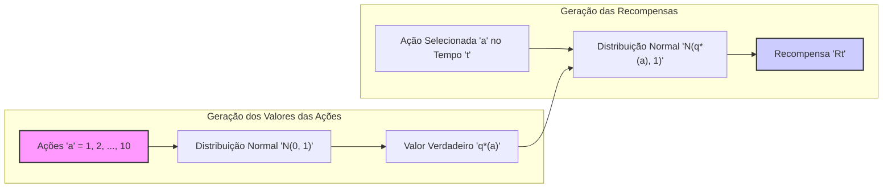
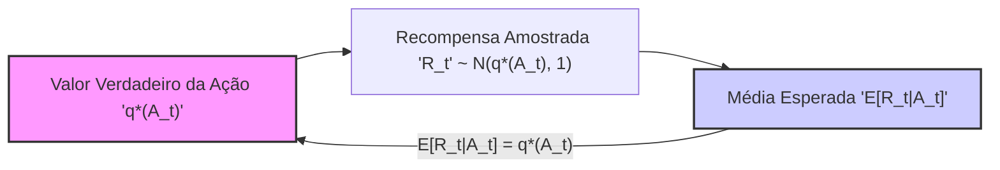
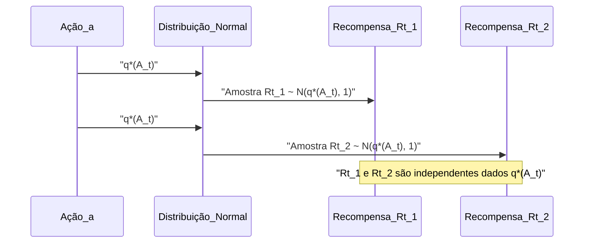
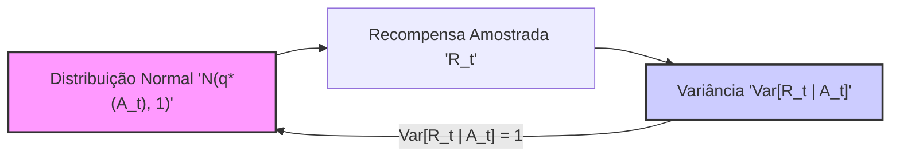

## O Testbed de 10 Braços: Recompensas Gaussianas

### Introdução
Este capítulo explora o problema de *Multi-armed Bandits*, focando em métodos de aprendizado que equilibram exploração e explotação. Um aspecto crucial para a avaliação desses métodos é a criação de um ambiente de teste que permita comparações significativas. Nesse contexto, o **testbed de 10 braços** surge como uma ferramenta fundamental, permitindo analisar o comportamento de diferentes algoritmos em cenários controlados [^1]. O foco desta seção é detalhar a geração e o uso das recompensas dentro desse testbed, especificamente como elas são amostradas de distribuições normais, e como isso impacta na avaliação dos métodos de aprendizado.

### Conceitos Fundamentais

O testbed de 10 braços é um ambiente de teste composto por *k* = 10 ações diferentes, onde cada ação corresponde a um braço de uma máquina caça-níqueis [^1]. O objetivo do aprendiz é maximizar a recompensa total esperada ao longo do tempo, explorando as diferentes ações e identificando aquelas que produzem os melhores resultados. As recompensas associadas a cada ação não são conhecidas inicialmente, e o aprendiz deve estimá-las com base nas observações de recompensas passadas [^1].

Para tornar o problema mais concreto e desafiador, as recompensas são geradas aleatoriamente, de acordo com uma distribuição de probabilidade estacionária. Dentro do contexto do testbed de 10 braços, especificamente, o valor verdadeiro de cada ação, denotado por **q*(a)**, é selecionado a partir de uma distribuição normal (Gaussiana) com média 0 e variância 1 [^2]. Esse passo inicial estabelece as qualidades intrínsecas de cada ação no ambiente de teste. Posteriormente, a cada vez que uma ação *a* é selecionada em um passo de tempo *t*, uma recompensa *Rt* é obtida. Esta recompensa *Rt* não é igual a **q*(a)**, mas sim amostrada de uma distribuição normal com média **q*(a)** e variância 1 [^2].

**Definição formal:**

1.  **Valores das ações:** Para cada ação *a* no conjunto de 10 ações (a = 1, 2, ..., 10), o valor verdadeiro **q*(a)** é amostrado de:
$$ q^*(a) \sim \mathcal{N}(0, 1) $$
onde $\mathcal{N}(0, 1)$ representa uma distribuição normal com média 0 e variância 1.

2.  **Recompensas:** Quando a ação *a* é selecionada em um passo de tempo *t*, a recompensa *Rt* é amostrada de:
$$ R_t \sim \mathcal{N}(q^*(a), 1) $$
onde $\mathcal{N}(q^*(a), 1)$ representa uma distribuição normal com média **q*(a)** e variância 1.


Esta formulação garante que as recompensas recebidas por uma ação selecionada flutuem em torno do valor médio dessa ação, com a variância definida como 1, introduzindo uma componente de estocasticidade no processo de aprendizado [^2]. A variância unitária representa um nível de ruído moderado, tornando o problema de aprendizado desafiador.

> 💡 **Exemplo Numérico:** Vamos gerar valores para algumas ações usando Python.
> ```python
> import numpy as np
>
> # Semente para reprodutibilidade
> np.random.seed(42)
>
> # Amostrando os valores verdadeiros das ações q*(a)
> q_star = np.random.normal(0, 1, 10)
>
> print("Valores verdadeiros das ações q*(a):", q_star)
> ```
> Isso pode gerar valores como `[-0.138, -0.720, -0.040, 1.657, -0.381, 0.343, 0.721, -0.162, 1.059, -0.930]`. Note que esses valores são amostrados aleatoriamente e cada vez que o código é executado com uma semente diferente, os resultados variam. O valor da ação 4, por exemplo, é 1.657, que é relativamente alto, enquanto a ação 10 tem um valor baixo de -0.930.
>
> Agora, vamos simular a obtenção de algumas recompensas para uma ação específica, por exemplo, a ação 4, cujo valor verdadeiro é q*(4) = 1.657.
> ```python
> # Simula recompensas para a ação 4
> rewards = np.random.normal(q_star[3], 1, 5)
> print("Recompensas para a ação 4:", rewards)
> ```
> As recompensas obtidas podem ser algo como `[1.463, 1.598, 2.458, 1.045, 2.266]`. Observe que cada recompensa é diferente e flutua em torno do valor de q*(4) = 1.657 devido ao ruído (variância 1) introduzido. Essas flutuações tornam o problema mais desafiador, pois o algoritmo não recebe diretamente o valor verdadeiro da ação, mas sim amostras ruidosas.

#### Importância da Distribuição Normal

A escolha da distribuição normal para gerar tanto os valores das ações quanto as recompensas é significativa por várias razões. Distribuições normais são comuns em modelagem estatística e frequentemente aparecem em fenômenos do mundo real. Além disso, elas possuem a propriedade de estarem bem definidas por seus dois primeiros momentos (média e variância), o que facilita análises matemáticas e comparações. A variância unitária garante que a dispersão das recompensas ao redor dos valores das ações seja comparável entre as diferentes ações, permitindo uma avaliação justa do desempenho dos algoritmos.

#### Lemma 1
*A amostra da recompensa $R_t$ tem uma média de $q^*(A_t)$ e variância 1.*

**Prova:**

Pela definição, a recompensa $R_t$ é amostrada da distribuição normal $\mathcal{N}(q^*(A_t), 1)$. A média de uma distribuição normal $\mathcal{N}(\mu, \sigma^2)$ é $\mu$, e a variância é $\sigma^2$. Portanto, a média de $R_t$ é $q^*(A_t)$ e sua variância é 1.
$\blacksquare$

#### Corolário 1
*A recompensa média esperada da ação $A_t$, denotada por $E[R_t|A_t]$,  é igual a $q^*(A_t)$.*

**Prova:**
Como demonstrado no Lemma 1, a média da recompensa $R_t$ dada a ação $A_t$ é $q^*(A_t)$. Portanto, a recompensa média esperada da ação $A_t$ é igual ao valor da ação.
$\blacksquare$


> 💡 **Exemplo Numérico:**  Continuando com o exemplo numérico anterior, onde o valor verdadeiro da ação 4 é q*(4) = 1.657.  O Corolário 1 nos diz que a média esperada das recompensas para a ação 4, ou seja,  $E[R_t | A_t = 4]$, é igual a 1.657. No exemplo anterior, algumas recompensas amostradas foram [1.463, 1.598, 2.458, 1.045, 2.266]. Se amostrássemos um número muito grande de recompensas para a ação 4, a média dessas recompensas se aproximaria de 1.657.  Este é um exemplo prático de como a recompensa média esperada corresponde ao valor da ação, embora as amostras individuais flutuem ao redor desse valor.

**Proposição 1**
*As recompensas $R_t$ são independentes dado o valor de $q^*(A_t)$.*

**Prova:**
As recompensas $R_t$ são amostradas independentemente a partir da distribuição $\mathcal{N}(q^*(A_t), 1)$ para cada passo de tempo *t*. Como a distribuição de $R_t$ depende somente de $q^*(A_t)$, e não de recompensas anteriores, e cada amostra é independente, podemos concluir que as recompensas $R_t$ são independentes dado $q^*(A_t)$.
$\blacksquare$


> 💡 **Exemplo Numérico:** Se em dois passos de tempo consecutivos, a ação 4 for selecionada, as recompensas $R_{t1}$ e $R_{t2}$ serão amostradas independentemente da mesma distribuição normal $\mathcal{N}(1.657, 1)$.  Por exemplo,  $R_{t1}$ poderia ser 1.463 e  $R_{t2}$ poderia ser 2.266.  A Proposição 1 nos diz que o valor de $R_{t1}$ não influencia o valor que $R_{t2}$ pode assumir. Cada recompensa é uma amostra independente da mesma distribuição.

**Lema 1.1**
*A variância da recompensa $R_t$, dado o valor $q^*(A_t)$,  é $Var[R_t | A_t] = 1$.*

**Prova:**
Pela definição, $R_t$ é amostrado de $\mathcal{N}(q^*(A_t), 1)$. A variância de uma distribuição normal $\mathcal{N}(\mu, \sigma^2)$ é $\sigma^2$. Portanto, $Var[R_t | A_t] = 1$.
$\blacksquare$


> 💡 **Exemplo Numérico:**  Retomando a ação 4 com q*(4) = 1.657, o Lema 1.1 nos diz que, independentemente do valor de $q^*(4)$, a variância da recompensa quando essa ação é selecionada é sempre 1. Isso significa que as recompensas amostradas para a ação 4 flutuarão em torno de 1.657, com uma dispersão que corresponde a uma variância de 1. Isto também ocorre com todas as outras ações. Ou seja, a dispersão das recompensas ao redor do valor verdadeiro é sempre a mesma, independentemente da ação.

**Observação 1:**
É importante ressaltar que apesar de $E[R_t|A_t] = q^*(A_t)$, o valor observado de $R_t$ pode ser diferente de $q^*(A_t)$ em cada passo de tempo devido à variância unitária. Esta flutuação estocástica é fundamental para o desafio do problema do multi-armed bandit, forçando os algoritmos a aprender os valores reais das ações com base em dados ruidosos.

Essa abordagem assegura que cada ação tenha um valor verdadeiro que o aprendiz deve descobrir por meio da exploração, ao mesmo tempo em que as recompensas reais são sujeitas a flutuações aleatórias, simulando um ambiente de aprendizado realista.

### Conclusão
A forma como as recompensas são selecionadas no testbed de 10 braços, através de distribuições normais com média q*(a) e variância 1, desempenha um papel fundamental na análise e comparação de diferentes métodos de aprendizado por reforço. A estocasticidade introduzida pelas amostras de recompensas garante um ambiente de aprendizado realista, permitindo que os algoritmos equilibrem a exploração de novas ações com a explotação das ações conhecidas que geram melhores recompensas. A utilização da distribuição normal facilita a análise matemática e estatística dos resultados, garantindo a validade e comparabilidade das avaliações.

### Referências
[^1]: "The most important feature distinguishing reinforcement learning from other types of learning is that it uses training information that evaluates the actions taken rather than instructs by giving correct actions."
[^2]: "The true value q*(a) of each of the ten actions was selected according to a normal distribution with mean zero and unit variance, and then the actual rewards were selected according to a mean q*(a), unit-variance normal distribution, as suggested by these gray distributions."
