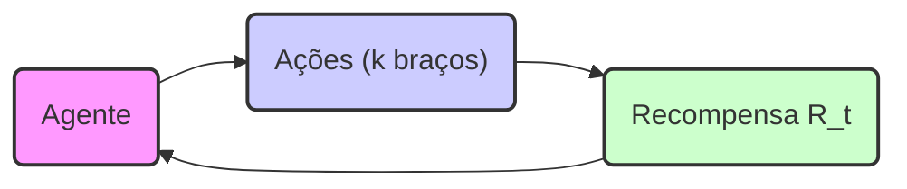
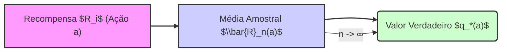
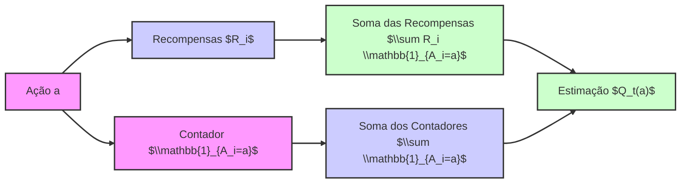
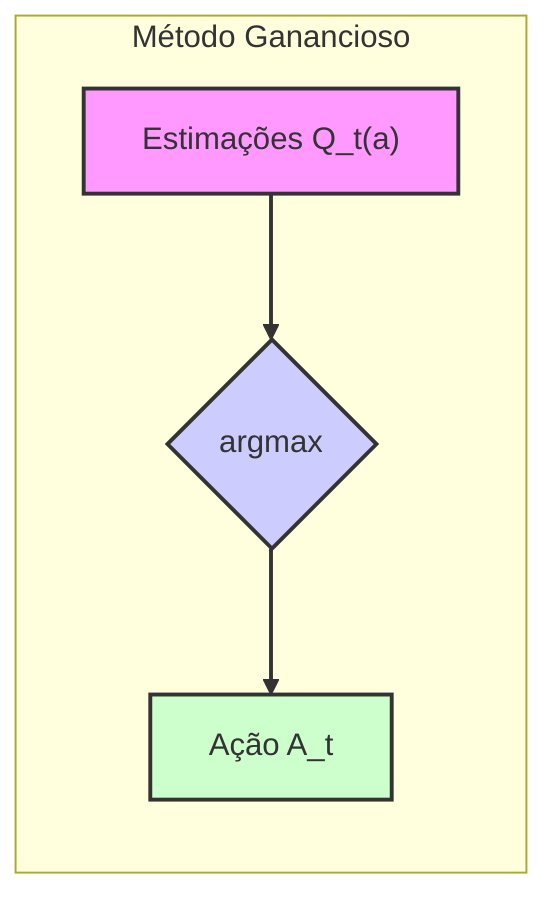
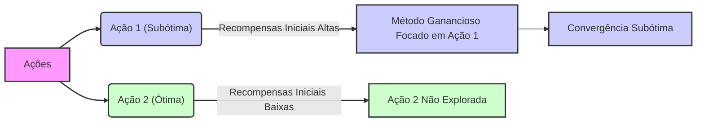

## O Problema do Bandido de k Braços: A Convergência Subótima do Método Ganancioso

### Introdução
O aprendizado por reforço (reinforcement learning) se distingue de outros tipos de aprendizado por utilizar informações de treinamento que avaliam as ações tomadas, em vez de instruir por meio de ações corretas. Essa característica cria a necessidade de exploração ativa, uma busca explícita por um bom comportamento [1](https://chatgpt.com/c/67829922-359c-8011-96dd-970c04ed772c#user-content-fn-1). No contexto do **problema do bandido de *k* braços**, a exploração é crucial, especialmente para algoritmos que inicialmente favorecem ações já conhecidas, como o método ganancioso (*greedy*). Este capítulo explora como métodos de aprendizado lidam com o balanço entre exploração e aproveitamento (*exploitation*) e analisa a performance de diferentes métodos no *10-armed testbed*, com ênfase na convergência subótima do método ganancioso [1](https://chatgpt.com/c/67829922-359c-8011-96dd-970c04ed772c#user-content-fn-1), [2](https://chatgpt.com/c/67829922-359c-8011-96dd-970c04ed772c#user-content-fn-2).

### Conceitos Fundamentais
O **problema do bandido de *k* braços** é uma estrutura de aprendizado em que um agente deve escolher repetidamente entre *k* opções, ou ações. Cada ação resulta em uma recompensa numérica, extraída de uma distribuição de probabilidade estacionária específica da ação escolhida. O objetivo do agente é maximizar a recompensa total esperada ao longo de um período de tempo [1](https://chatgpt.com/c/67829922-359c-8011-96dd-970c04ed772c#user-content-fn-1), [2](https://chatgpt.com/c/67829922-359c-8011-96dd-970c04ed772c#user-content-fn-2). O valor de uma ação *a*, denotado por $q_*(a)$, é a recompensa esperada quando essa ação é selecionada. No entanto, esses valores não são conhecidos a priori, e o agente deve estimá-los. A estimativa do valor de uma ação *a* no passo *t* é denotada por $Q_t(a)$ [2](https://chatgpt.com/c/67829922-359c-8011-96dd-970c04ed772c#user-content-fn-2).

A escolha entre exploração e aproveitamento é central neste problema. Ações que maximizam a recompensa imediata com base no conhecimento atual são chamadas **ações gananciosas**. Escolher uma ação gananciosa significa *aproveitar* o conhecimento disponível. Por outro lado, a **exploração** envolve selecionar ações não-gananciosas para melhorar a estimativa dos valores das ações, o que pode levar a recompensas maiores no futuro [2](https://chatgpt.com/c/67829922-359c-8011-96dd-970c04ed772c#user-content-fn-2). O método ganancioso, que sempre seleciona a ação com maior valor estimado, explora pouco ou nada, o que pode levar a um desempenho subótimo.

**Proposição 1** *O problema do bandido de k braços pode ser formalizado como um processo de decisão de Markov (MDP) com um único estado*.

*Prova:* Um MDP é definido por um conjunto de estados, ações, probabilidades de transição e recompensas. No problema do bandido de *k* braços, o agente está sempre na mesma situação (o mesmo estado), com *k* ações disponíveis. As recompensas dependem apenas da ação escolhida e não do estado anterior, e não há transição entre estados. Assim, podemos representar o problema como um MDP com um único estado.

O *10-armed testbed* consiste em uma série de 2000 problemas de bandidos de *k* braços gerados aleatoriamente, cada um com *k* = 10 ações. Para cada problema, os valores das ações $q_*(a)$ são selecionados de uma distribuição normal com média 0 e variância 1. Ao selecionar uma ação $A_t$ no passo $t$, a recompensa $R_t$ é extraída de uma distribuição normal com média $q_*(A_t)$ e variância 1 [3](https://chatgpt.com/c/67829922-359c-8011-96dd-970c04ed772c#user-content-fn-3), [5](https://chatgpt.com/c/67829922-359c-8011-96dd-970c04ed772c#user-content-fn-5). Este ambiente permite comparar diferentes algoritmos de aprendizado de forma controlada.

> 💡 **Exemplo Numérico:** Imagine um problema de bandido de 3 braços. As recompensas verdadeiras ($q_*(a)$) para cada braço são: $q_*(1) = 1$, $q_*(2) = 2$, e $q_*(3) = 0.5$. O agente não conhece esses valores inicialmente e deve estimá-los. Ao escolher o braço 1 pela primeira vez, ele pode receber uma recompensa $R_1 = 0.8$ (extraída de uma distribuição normal com média 1 e variância 1). Ao escolher o braço 2 pela primeira vez, ele recebe $R_2 = 2.5$. Ao escolher o braço 3 pela primeira vez, ele recebe $R_3 = -0.1$. Essas recompensas iniciais são aleatórias e podem não refletir os valores esperados verdadeiros.

**Lema 1** *A recompensa média obtida por uma ação $a$ ao longo de um número $n$ de tentativas, denotada por $\bar{R}_n(a)$, converge para o valor verdadeiro $q_*(a)$ quando $n$ tende a infinito, i.e., $\lim_{n\to\infty} \bar{R}_n(a) = q_*(a)$*.

*Prova:* Este é um resultado direto da lei forte dos grandes números. A média amostral de uma sequência de variáveis aleatórias independentes e identicamente distribuídas converge para a sua esperança matemática quando o número de amostras tende ao infinito. No contexto do problema do bandido, as recompensas de cada ação são retiradas de uma distribuição estacionária com média $q_*(a)$, portanto, a média amostral das recompensas converge para $q_*(a)$.

O *sample-average method* é um método de estimação que calcula a média das recompensas recebidas para cada ação:

$$
Q_t(a) = \frac{\sum_{i=1}^{t-1} R_i \mathbb{1}_{A_i=a}}{\sum_{i=1}^{t-1} \mathbb{1}_{A_i=a}}
$$

onde $\mathbb{1}_{A_i=a}$ é uma função indicadora que retorna 1 se a ação *a* foi selecionada no passo *i* e 0 caso contrário. Se o denominador for zero, $Q_t(a)$ é definido como um valor padrão, como 0 [3](https://chatgpt.com/c/67829922-359c-8011-96dd-970c04ed772c#user-content-fn-3). A lei dos grandes números garante que $Q_t(a)$ converge para $q_*(a)$ quando o número de amostras tende ao infinito.

> 💡 **Exemplo Numérico:** Continuando o exemplo anterior, após 5 iterações, suponha que as seguintes ações foram tomadas e recompensas obtidas:
>
> | Iteração (i) | Ação (A_i) | Recompensa (R_i) |
> |--------------|------------|------------------|
> | 1            | 1          | 0.8              |
> | 2            | 2          | 2.5              |
> | 3            | 3          | -0.1             |
> | 4            | 1          | 1.2              |
> | 5            | 2          | 1.8              |
>
> Usando o sample-average method, calculamos $Q_5(1)$, $Q_5(2)$, e $Q_5(3)$:
>
>  - $Q_5(1) = \frac{0.8 + 1.2}{2} = 1.0$
>  - $Q_5(2) = \frac{2.5 + 1.8}{2} = 2.15$
>  - $Q_5(3) = \frac{-0.1}{1} = -0.1$
>
> Note que essas estimativas estão começando a se aproximar dos valores verdadeiros, mas ainda podem ser bem diferentes.

**Lema 1.1** *O método sample-average é uma estimativa não-viesada de $q_*(a)$*.

*Prova:* Seja $N_t(a)$ o número de vezes que a ação $a$ foi selecionada até o tempo $t$. Então, $Q_t(a) = \frac{1}{N_t(a)} \sum_{i=1}^{t-1} R_i \mathbb{1}_{A_i=a}$. Assumindo que $N_t(a) > 0$, a esperança de $Q_t(a)$ é:
$E[Q_t(a)] = E\left[\frac{1}{N_t(a)} \sum_{i=1}^{t-1} R_i \mathbb{1}_{A_i=a}\right] = \frac{1}{N_t(a)} \sum_{i=1}^{t-1} E[R_i \mathbb{1}_{A_i=a}] = \frac{1}{N_t(a)} N_t(a) q_*(a) = q_*(a)$. Portanto, o método sample-average é não viesado.

### A Convergência Subótima do Método Ganancioso
O método ganancioso seleciona sempre a ação com maior valor estimado:

$$
A_t = \underset{a}{\operatorname{argmax}} Q_t(a)
$$

Este método maximiza a recompensa imediata, mas não explora outras ações que poderiam ter valores maiores. No *10-armed testbed*, o método ganancioso converge rapidamente para um desempenho subótimo, como demonstrado na Figura 2.2 [5](https://chatgpt.com/c/67829922-359c-8011-96dd-970c04ed772c#user-content-fn-5). Embora o método ganancioso melhore ligeiramente mais rápido no início, ele acaba se estabilizando em um nível de recompensa inferior. Este comportamento acontece porque o método ganancioso frequentemente fica preso em ações subótimas [5](https://chatgpt.com/c/67829922-359c-8011-96dd-970c04ed772c#user-content-fn-5). Em cerca de dois terços dos casos, as amostras iniciais da ação ótima são decepcionantes, e o algoritmo nunca mais a explora [6](https://chatgpt.com/c/67829922-359c-8011-96dd-970c04ed772c#user-content-fn-6). O método ganancioso encontrou a ação ótima em aproximadamente um terço dos testes [6](https://chatgpt.com/c/67829922-359c-8011-96dd-970c04ed772c#user-content-fn-6).


*   **Exploração Insuficiente:** A principal razão para a convergência subótima do método ganancioso é a sua falta de exploração. Ele não aloca tempo para amostrar outras ações que poderiam ter recompensas maiores a longo prazo. Ele se apega à primeira ação aparentemente boa que encontra, mesmo que haja ações melhores.
*   **Dependência das Amostras Iniciais:** O método ganancioso é particularmente sensível às amostras iniciais de recompensas. Se uma ação subótima produz recompensas aparentemente altas no início, o algoritmo pode se concentrar nela e ignorar ações melhores, mas ainda não exploradas.

> 💡 **Exemplo Numérico:** Voltando ao exemplo com 3 braços, após as 5 primeiras iterações, o método ganancioso selecionaria a ação 2 no passo 6 porque $Q_5(2) = 2.15$ é o maior valor estimado até agora. Se a recompensa obtida nesse passo fosse $R_6 = 1.5$, $Q_6(2)$ seria atualizado para $\frac{2.5+1.8+1.5}{3}=1.93$. O método ganancioso continuaria a escolher o braço 2 (a menos que outra ação tivesse uma média maior), mesmo que o braço 1, com um valor verdadeiro de 1, seja na verdade melhor a longo prazo, porque ele foi menos explorado e suas recompensas iniciais foram menores.
>
> Considere que as verdadeiras recompensas médias dos braços são $q_*(1)=1$, $q_*(2)=2$, e $q_*(3)=0.5$. No entanto, o algoritmo ganancioso, por azar, obteve inicialmente recompensas $R_1=0.2$, $R_2=2.5$, e $R_3=0.1$. O algoritmo ganancioso escolherá o braço 2 a partir de agora, mesmo que o braço 1 seja uma melhor opção em média, porque ele não explora mais as opções. Isto é a convergência subótima em ação.

**Lema 2** *O método ganancioso, no limite, não garante a convergência para a ação ótima no problema do bandido de k braços*.

*Prova:* Como mencionado no texto, o método ganancioso converge para ações subótimas, em aproximadamente dois terços dos casos, devido à falta de exploração. Isso demonstra que, mesmo quando o número de interações tende ao infinito, o método ganancioso não garante convergir para a ação com maior valor esperado.

**Teorema 1** *No 10-armed testbed, o método ganancioso tem probabilidade menor que um de convergir para a ação ótima*.

*Prova:* Este resultado é diretamente observado nos resultados empíricos do 10-armed testbed. O texto menciona que o método ganancioso encontrou a ação ótima em aproximadamente um terço dos testes. Dado que o método não explora adequadamente e se fixa nas amostras iniciais, a probabilidade de encontrar a ação ótima é estritamente menor que 1.

### Conclusão

O método ganancioso, embora simples de implementar, é inadequado para problemas de aprendizado por reforço que exigem um equilíbrio entre exploração e aproveitamento. Sua tendência a se concentrar nas ações que parecem melhores no início o leva a um desempenho subótimo. O *10-armed testbed* ilustra claramente essa limitação, mostrando que outros métodos que exploram mais, como os métodos *$\epsilon$-greedy*, podem atingir um desempenho superior a longo prazo. A necessidade de um balanço adequado entre exploração e aproveitamento é um desafio central em *reinforcement learning*, e é fundamental usar métodos que não se fixem em escolhas iniciais subótimas.
```mermaid
graph LR
    A["Método Ganancioso"] --> B["Exploração Insuficiente"];
    B --> C["Convergência Subótima"];
    D["Métodos $\\epsilon$-Greedy"] --> E["Exploração Melhorada"];
    E --> F["Desempenho Superior"];
    A --> G["Aproveitamento Exclusivo"];
     linkStyle 0,1,2,3,4,5 stroke:#333,stroke-width:2px
     style A fill:#f9f,stroke:#333,stroke-width:2px
    style B fill:#ccf,stroke:#333,stroke-width:2px
    style C fill:#cfc,stroke:#333,stroke-width:2px
      style D fill:#ccf,stroke:#333,stroke-width:2px
    style E fill:#cfc,stroke:#333,stroke-width:2px
      style F fill:#ccf,stroke:#333,stroke-width:2px
       style G fill:#f9f,stroke:#333,stroke-width:2px
```
### Referências
[^1]: "The most important feature distinguishing reinforcement learning from other types of learning is that it uses training information that evaluates the actions taken rather than instructs by giving correct actions." *(Trecho de Chapter 2 - Multi-armed Bandits)*
[^2]: "In our k-armed bandit problem, each of the k actions has an expected or mean reward given that that action is selected; let us call this the value of that action. We denote the action selected on time step t as At, and the corresponding reward as Rt. The value then of an arbitrary action a, denoted q∗(a), is the expected reward given that a is selected: q*(a) = E[Rt | At=a]." *(Trecho de Chapter 2 - Multi-armed Bandits)*
[^3]: "We begin by looking more closely at methods for estimating the values of actions and for using the estimates to make action selection decisions, which we collectively call action-value methods. Recall that the true value of an action is the mean reward when that action is selected. One natural way to estimate this is by averaging the rewards actually received: Qt(a) = sum of rewards when a taken prior to t / number of times a taken prior to t = Σt−1i=1 Ri1Ai=a / Σt−1i=1 1Ai=a where 1predicate denotes the random variable that is 1 if predicate is true and 0 if it is not. If the denominator is zero, then we instead define Qt(a) as some default value, such as 0." *(Trecho de Chapter 2 - Multi-armed Bandits)*
[^4]: "The simplest action selection rule is to select one of the actions with the highest estimated value, that is, one of the greedy actions as defined in the previous section. If there is more than one greedy action, then a selection is made among them in some arbitrary way, perhaps randomly. We write this greedy action selection method as At = argmaxa Qt(a)." *(Trecho de Chapter 2 - Multi-armed Bandits)*
[^5]: "Figure 2.2 compares a greedy method with two ɛ-greedy methods (ε=0.01 and ε=0.1), as described above, on the 10-armed testbed. All the methods formed their action-value estimates using the sample-average technique (with an initial estimate of 0). The upper graph shows the increase in expected reward with experience. The greedy method improved slightly faster than the other methods at the very beginning, but then leveled off at a lower level. It achieved a reward-per-step of only about 1, compared with the best possible of about 1.54 on this testbed. The greedy method performed significantly worse in the long run because it often got stuck performing suboptimal actions. The lower graph shows that the greedy method found the optimal action in only approximately one-third of the tasks." *(Trecho de Chapter 2 - Multi-armed Bandits)*
[^6]: "In the other two-thirds, its initial samples of the optimal action were disappointing, and it never returned to it. The ɛ-greedy methods eventually performed better because they continued to explore and to improve their chances of recognizing the optimal action." *(Trecho de Chapter 2 - Multi-armed Bandits)*
