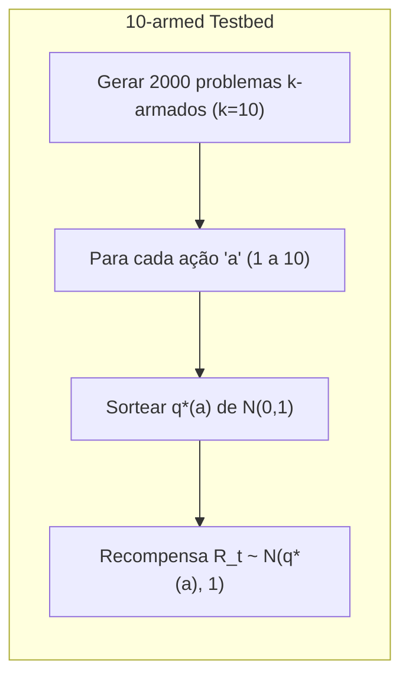

### O Testbed de 10 Braços: Uma Análise Comparativa de Métodos Gananciosos e ε-Gananciosos

### Introdução

Este capítulo explora o conceito de aprendizado por reforço, focando no aspecto avaliativo e explorando o problema do bandido multi-armado (Multi-armed Bandit) em um ambiente não associativo. O objetivo central é entender como o feedback avaliativo, que indica a qualidade de uma ação tomada sem necessariamente instruir sobre a melhor ação, pode ser utilizado para o aprendizado [^1]. O problema do bandido k-armado é apresentado como um modelo simplificado para estudar esses conceitos, onde um agente deve escolher repetidamente entre k opções, recebendo recompensas numéricas probabilísticas associadas a cada escolha [^1]. Este capítulo usa o problema do k-armed bandit para introduzir métodos básicos de aprendizado que posteriormente serão estendidos para problemas mais complexos. Uma das principais questões abordadas é o dilema entre exploração e explotação, ou seja, a decisão entre explorar novas ações com potencial de recompensa ou explorar as ações que já se mostraram promissoras [^1, ^2]. O objetivo final é maximizar a recompensa total esperada ao longo do tempo [^2]. O presente capítulo aprofundará na comparação de métodos para balancear exploração e explotação usando o *10-armed testbed*.

### Conceitos Fundamentais

O problema do bandido k-armado envolve um agente que deve escolher entre *k* ações diferentes, onde cada ação *a* tem um valor esperado $q^*(a)$ que representa a recompensa média obtida ao executar essa ação [^2]. O objetivo do agente é maximizar a recompensa total esperada ao longo do tempo. O desafio reside no fato de que o agente não conhece $q^*(a)$ com certeza, tendo apenas estimativas $Q_t(a)$ que são atualizadas com base nas recompensas recebidas. A exploração refere-se à escolha de ações que podem não parecer ótimas no momento, mas podem levar à descoberta de ações com valores mais elevados no futuro. Já a explotação, é a escolha de ações com base no conhecimento atual para maximizar a recompensa imediata [^2].

Um método básico para estimar $q^*(a)$ é a média amostral, onde a estimativa $Q_t(a)$ é dada pela média das recompensas recebidas para a ação *a* até o instante *t* [^3]:

$$
Q_t(a) = \frac{\sum_{i=1}^{t-1} R_i \mathbb{1}_{A_i=a}}{\sum_{i=1}^{t-1} \mathbb{1}_{A_i=a}}
$$

onde $\mathbb{1}_{A_i=a}$ é uma função indicadora que retorna 1 se a ação *a* foi selecionada no instante *i* e 0 caso contrário. Caso o denominador seja 0, $Q_t(a)$ é definido como um valor default, como 0 [^3].

> 💡 **Exemplo Numérico:** Imagine que temos um bandido de 3 braços (k=3). Vamos focar no braço 1. Suponha que nas primeiras 5 tentativas, o braço 1 foi escolhido 3 vezes e gerou as recompensas: 0.5, 1.2 e 0.8. As outras duas tentativas foram para outros braços. Então, a estimativa $Q_5(1)$ seria calculada da seguinte forma:
>
>   $Q_5(1) = \frac{0.5 + 1.2 + 0.8}{3} = \frac{2.5}{3} \approx 0.83$
>
>   Esta estimativa de 0.83 seria usada para decisões futuras até que mais recompensas sejam obtidas para o braço 1. Se em *t=6*, o braço 1 é escolhido novamente com recompensa 0.9, então:
>
>   $Q_6(1) = \frac{0.5 + 1.2 + 0.8 + 0.9}{4} = \frac{3.4}{4} = 0.85$
>
>   A estimativa é atualizada com a nova recompensa.

**Observação 1:** A média amostral é um estimador não-viesado para o valor esperado $q^*(a)$. Isso significa que, se coletarmos um número suficientemente grande de amostras, a média amostral $Q_t(a)$ convergirá para $q^*(a)$. No entanto, em cenários práticos, geralmente não temos um número infinito de amostras, e a estimativa $Q_t(a)$ é, portanto, uma aproximação.

A *ação gananciosa* é aquela com a maior estimativa de valor $Q_t(a)$ [^2]. A escolha gananciosa sempre prioriza a exploração, podendo levar a resultados subótimos no longo prazo, caso as estimativas das demais ações sejam inicialmente subestimadas [^3].

> 💡 **Exemplo Numérico:** Continuando com o exemplo anterior, suponha que após 10 tentativas, temos as seguintes estimativas para os 3 braços:  $Q_{10}(1) = 0.9$, $Q_{10}(2) = 0.5$ e $Q_{10}(3) = 0.7$. O método ganancioso escolheria o braço 1, pois tem a maior estimativa de valor. Se a recompensa subsequente do braço 1 for baixa (ex: 0.1), a estimativa de $Q_{11}(1)$ irá diminuir, mas ainda pode ser a maior se as recompensas dos outros braços também forem baixas. No entanto, se o braço 2 ou 3 têm um valor esperado maior, mas ainda não foram suficientemente explorados, o método ganancioso pode ficar preso no braço 1, perdendo uma recompensa maior no longo prazo.

```mermaid
graph LR
    A[ "Início" ] --> B{ "Calcular Q_t(a) para cada ação" };
    B --> C{ "Selecionar ação com maior Q_t(a)" };
    C --> D[ "Executar ação" ];
    D --> E{ "Obter recompensa R_t" };
    E --> F{ "Atualizar Q_t(a)" };
    F --> B;
    F --> G[ "Fim" ];
    style A fill:#f9f,stroke:#333,stroke-width:2px
    style G fill:#ccf,stroke:#333,stroke-width:2px
```

Um método mais sofisticado é o *método ε-ganancioso*, no qual a maior parte do tempo uma ação gananciosa é selecionada, porém, com uma pequena probabilidade *ε*, uma ação é selecionada aleatoriamente [^3]. Este método garante que todas as ações serão exploradas ao longo do tempo e, portanto, as estimativas $Q_t(a)$ convergirão para os verdadeiros valores $q^*(a)$.

> 💡 **Exemplo Numérico:** Usando o mesmo exemplo anterior, com $Q_{10}(1) = 0.9$, $Q_{10}(2) = 0.5$ e $Q_{10}(3) = 0.7$. Se usarmos um método ε-ganancioso com ε=0.1, em cada passo, haverá 90% de chance de escolher a ação gananciosa (braço 1) e 10% de chance de escolher um braço aleatoriamente (braço 1, 2 ou 3 com 10%/3 de chance cada). Isso permite explorar outros braços, mesmo que pareçam menos promissores no momento, dando-lhes a oportunidade de melhorar suas estimativas.

```mermaid
graph LR
    A[ "Início" ] --> B{ "Gerar número aleatório 'p' entre 0 e 1" };
    B -- "p > ε" --> C{ "Selecionar ação com maior Q_t(a) (Ação Gananciosa)" };
    B -- "p <= ε" --> D{ "Selecionar ação aleatoriamente" };
    C --> E[ "Executar ação selecionada" ];
    D --> E
    E --> F{ "Obter recompensa R_t" };
    F --> G{ "Atualizar Q_t(a)" };
    G --> A;
    G --> H[ "Fim" ];
    style A fill:#f9f,stroke:#333,stroke-width:2px
    style H fill:#ccf,stroke:#333,stroke-width:2px
```

**Lema 1:** *Sob condições estacionárias (isto é, quando os valores esperados $q^*(a)$ não mudam ao longo do tempo), o método ε-ganancioso garante que cada ação será selecionada infinitas vezes conforme t tende ao infinito, desde que ε > 0. Em outras palavras, todas as ações serão exploradas eventualmente.*

*Prova:* A probabilidade de selecionar qualquer ação específica *a* no tempo *t* com o método ε-ganancioso é pelo menos $\frac{\epsilon}{k}$, onde *k* é o número total de ações. Como *ε > 0* e *k* é finito, esta probabilidade é estritamente positiva. Assim, ao longo de um número infinito de passos, qualquer ação será selecionada uma quantidade infinita de vezes.

**Lema 1.1:** *Sob as mesmas condições de Lema 1, as estimativas $Q_t(a)$ convergem para $q^*(a)$ conforme t tende ao infinito, para todo a.*

*Prova:* Como demonstrado no Lema 1, cada ação *a* será selecionada um número infinito de vezes. A estimativa $Q_t(a)$ é dada pela média amostral das recompensas obtidas quando a ação *a* é selecionada. Pela lei dos grandes números, a média amostral converge para o valor esperado, portanto, $Q_t(a)$ converge para $q^*(a)$ quando t tende ao infinito.

**Corolário 1:** O método $\epsilon$-ganancioso garante a convergência das estimativas para os verdadeiros valores das ações, a longo prazo, o que implica que ele pode identificar a ação ótima e, portanto, maximizar a recompensa total, desde que haja um tempo de exploração suficiente.

### Comparação de Métodos Gananciosos e ε-Gananciosos no Testbed de 10 Braços

Para avaliar a eficácia dos métodos gananciosos e ε-gananciosos, foi conduzido um experimento utilizando um conjunto de problemas de bandidos k-armados chamado de *10-armed testbed* [^4]. Este testbed consiste em 2000 problemas de bandidos k-armados gerados aleatoriamente, onde *k = 10*. Para cada problema, o valor verdadeiro $q^*(a)$ de cada ação é sorteado de uma distribuição normal com média 0 e variância 1. Em seguida, as recompensas são selecionadas a partir de uma distribuição normal com média $q^*(a)$ e variância 1 [^4].



> 💡 **Exemplo Numérico:** Para um dos 2000 problemas do testbed, os valores verdadeiros $q^*(a)$ para cada um dos 10 braços podem ser algo como:
>
> | Braço (a) | q\*(a) |
> |-----------|--------|
> | 1         | -0.5   |
> | 2         | 0.3    |
> | 3         | 1.2    |
> | 4         | -0.1   |
> | 5         | 0.8    |
> | 6         | -1.1   |
> | 7         | 0.6    |
> | 8         | -0.2   |
> | 9         | 0.4    |
> | 10        | -0.9   |
>
> Note que o braço 3 tem o maior valor esperado, $q^*(3) = 1.2$, que seria o ótimo para este problema.
> As recompensas obtidas em cada tentativa, como descrito, virão de uma distribuição normal com média $q^*(a)$ e variância 1, por exemplo se o braço 3 for selecionado, uma recompensa poderia ser 1.1, outra poderia ser 2.3, outra 0.5, sempre distribuídas em torno de 1.2.

O experimento compara o desempenho do método ganancioso, onde a ação com maior valor estimado é sempre selecionada, e dois métodos ε-gananciosos, com ε=0.01 e ε=0.1 [^5]. As estimativas $Q_t(a)$ são atualizadas usando a média amostral, com um valor inicial de 0. Os resultados são então avaliados ao longo de 1000 passos temporais por problema, repetido por 2000 rodadas [^5].

Os resultados mostram que o método ganancioso melhora mais rapidamente no início, mas depois se estabiliza em um nível de recompensa inferior, alcançando cerca de 1, enquanto o melhor desempenho possível nesse testbed é aproximadamente 1.54 [^5]. Isso ocorre porque o método ganancioso explora pouco e pode ficar preso em ações subótimas [^5].

> 💡 **Exemplo Numérico:** Após algumas rodadas de interação com um dos problemas, imagine que o método ganancioso acaba com as seguintes estimativas:
>
> | Braço (a) | Q_t(a) |
> |-----------|--------|
> | 1         | -0.4   |
> | 2         | 0.2    |
> | 3         | 0.7    |
> | 4         | -0.2   |
> | 5         | 0.6    |
> | 6         | -1.0   |
> | 7         | 0.5    |
> | 8         | -0.3   |
> | 9         | 0.3    |
> | 10        | -0.8   |
>
> O método ganancioso ficaria preso no braço 3 com a estimativa de 0.7, mesmo que o valor real do braço 3 seja 1.2 e do braço 5 seja 0.8 (como definido no exemplo numérico anterior).

Por outro lado, os métodos ε-gananciosos apresentam um desempenho inferior no início, mas eventualmente superam o método ganancioso no longo prazo devido à sua capacidade de explorar [^5]. O método com ε=0.1 explora mais e inicialmente atinge um desempenho melhor que o método com ε=0.01, mas a longo prazo, o método com ε=0.01 acaba por alcançar um resultado melhor que o método com ε=0.1, com uma maior probabilidade de escolha das ações ótimas [^5, ^6]. É importante notar que o equilíbrio entre exploração e explotação é fundamental para um bom desempenho em problemas de bandidos multi-armados.

> 💡 **Exemplo Numérico:** O método ε-ganancioso com ε=0.1 exploraria o espaço de ações mais ativamente e, portanto, com o tempo, se aproximaria das verdadeiras médias, por exemplo, com a seguinte estimativa após várias rodadas:
>
> | Braço (a) | Q_t(a) |
> |-----------|--------|
> | 1         | -0.52   |
> | 2         | 0.31    |
> | 3         | 1.18    |
> | 4         | -0.15   |
> | 5         | 0.79    |
> | 6         | -1.05   |
> | 7         | 0.61    |
> | 8         | -0.18   |
> | 9         | 0.42    |
> | 10        | -0.88   |
>
> A estimativa do braço 3, $Q_t(3)=1.18$ está muito próxima do valor real $q^*(3)=1.2$ e o método irá convergir para a escolha do braço 3. Em contraste, o método com ε=0.01 exploraria menos no início, mas, eventualmente, também se aproximaria da estimativa correta.

A figura 2.2 do texto original ilustra que o método ganancioso encontrou a ação ótima em apenas um terço das rodadas. Nos outros dois terços, as amostras iniciais da ação ótima foram desapontadoras, e ele nunca mais voltou a essa ação [^6]. Os métodos ε-gananciosos tiveram um desempenho melhor porque continuaram a explorar e melhoraram as chances de reconhecer a ação ótima [^6]. O método com ε=0.1 explorou mais e encontrou a ação ótima mais cedo, mas nunca a selecionou em mais de 91% das vezes. Já o método com ε=0.01 melhorou mais lentamente, mas eventualmente superaria o método ε=0.1 nas duas medidas de desempenho [^6]. É possível também reduzir ε ao longo do tempo, para que se obtenha o melhor de ambos os mundos: a exploração inicial e a exploração posterior [^6].

```mermaid
graph LR
subgraph "Comparação dos Métodos"
    A[ "Método Ganancioso" ]
    B[ "Método ε-Ganancioso (ε=0.1)" ]
    C[ "Método ε-Ganancioso (ε=0.01)" ]

    A -- "Melhora Rápida Inicial" --> D("Estabiliza em Recompensa Menor (~1)")
    B -- "Explora Mais Inicialmente" --> E("Atinge Melhor Desempenho Inicial")
    C -- "Explora Menos Inicialmente" --> F("Melhora Lentamente")
    E --> G("Desempenho Inferior a C no Longo Prazo")
    F --> H("Supera B no Longo Prazo")
    H --> I("Maior Probabilidade de Escolher Ações Ótimas")
end
```

**Teorema 1:** *Existe um valor ótimo de ε, que equilibra a exploração e a explotação, para atingir o melhor desempenho no longo prazo em problemas de bandido k-armado. Este valor ótimo depende das características do problema, como a variância das recompensas e o número de ações.*

*Prova:* A prova deste teorema é empírica e não analítica. Como visto no experimento do 10-armed testbed, valores muito altos ou muito baixos de ε levam a resultados subótimos. Valores muito altos exploram demais, dificultando a convergência para ações ótimas. Valores muito baixos exploram pouco, correndo o risco de se fixar em soluções subótimas.  A existência de um ótimo é sugerida pelos resultados experimentais e estudos de parâmetro, onde o desempenho melhora com o aumento de *ε* até um certo ponto e depois piora. A determinação exata do valor ótimo de *ε* depende das características específicas do problema e pode ser encontrada através da avaliação de diferentes parâmetros, como visto na figura 2.6 mencionada no texto original.

**Proposição 1:** Uma estratégia para melhorar o desempenho do método $\epsilon$-ganancioso é usar um decaimento dinâmico de $\epsilon$ ao longo do tempo, começando com um valor mais alto para priorizar a exploração inicial e reduzindo-o gradativamente para privilegiar a explotação quando as estimativas de ação se tornam mais precisas.

*Justificativa:* No início do aprendizado, as estimativas das ações são bastante incertas e o agente precisa explorar para descobrir qual ação tem o maior valor esperado. Conforme o tempo passa, as estimativas se tornam mais confiáveis, e é mais vantajoso escolher as ações que parecem melhores. A estratégia de decaimento de $\epsilon$ permite um equilíbrio adaptativo entre exploração e explotação ao longo do tempo.

```mermaid
graph LR
subgraph "Estratégia de Decaimento de ε"
    A[ "Início" ] --> B{ "Definir ε inicial alto" };
    B --> C{ "Priorizar Exploração Inicial" };
    C --> D{ "Conforme o tempo passa" };
    D --> E{ "Diminuir ε gradualmente" };
    E --> F{ "Priorizar Explotação com Estimativas Confiáveis" };
    F --> G[ "Fim" ];
  end
```
### Conclusão

A análise do *10-armed testbed* demonstra a importância do equilíbrio entre exploração e explotação no aprendizado por reforço. Métodos puramente gananciosos, embora inicialmente mais rápidos, tendem a ficar presos em soluções subótimas devido à falta de exploração. Já os métodos ε-gananciosos garantem uma exploração contínua e, em geral, apresentam resultados melhores no longo prazo. A escolha do valor de ε, entretanto, afeta o desempenho, e uma exploração excessiva pode ser tão prejudicial quanto a falta dela. A figura 2.6 mostra um estudo de parâmetro no qual o desempenho de cada algoritmo é apresentado em função de seu próprio parâmetro (ε para os métodos ε-gananciosos). Os resultados mostram que o desempenho de todos os algoritmos é melhor em um valor intermediário de seus parâmetros, sem ser muito alto nem muito baixo. Portanto, é essencial ajustar os parâmetros de cada método para obter o melhor desempenho em cada aplicação específica.

### Referências

[^1]: "The most important feature distinguishing reinforcement learning from other types of learning is that it uses training information that evaluates the actions taken rather than instructs by giving correct actions. This is what creates the need for active exploration, for an explicit search for good behavior." *(Trecho de Multi-armed Bandits)*
[^2]: "In our k-armed bandit problem, each of the k actions has an expected or mean reward given that that action is selected; let us call this the value of that action. [...] If you knew the value of each action, then it would be trivial to solve the k-armed bandit problem: you would always select the action with highest value. We assume that you do not know the action values with certainty, although you may have estimates." *(Trecho de Multi-armed Bandits)*
[^3]: "We begin by looking more closely at methods for estimating the values of actions and for using the estimates to make action selection decisions, which we collectively call action-value methods. Recall that the true value of an action is the mean reward when that action is selected. One natural way to estimate this is by averaging the rewards actually received: [...] The simplest action selection rule is to select one of the actions with the highest estimated value, that is, one of the greedy actions as defined in the previous section. If there is more than one greedy action, then a selection is made among them in some arbitrary way, perhaps randomly. [...] A simple alternative is to behave greedily most of the time, but every once in a while, say with small probability ɛ, instead select randomly" *(Trecho de Multi-armed Bandits)*
[^4]: "To roughly assess the relative effectiveness of the greedy and ɛ-greedy action-value methods, we compared them numerically on a suite of test problems. This was a set of 2000 randomly generated k-armed bandit problems with k = 10. For each bandit problem, such as the one shown in Figure 2.1, the action values, q*(a), a = 1, ..., 10, were selected according to a normal (Gaussian) distribution with mean 0 and variance 1. Then, when a learning method applied to that problem selected action At at time step t, the actual reward, Rt, was selected from a normal distribution with mean q*(At) and variance 1. These distributions are shown in gray in Figure 2.1. We call this suite of test tasks the 10-armed testbed." *(Trecho de Multi-armed Bandits)*
[^5]: "Figure 2.2 compares a greedy method with two ɛ-greedy methods (ε=0.01 and ε=0.1), as described above, on the 10-armed testbed. All the methods formed their action-value estimates using the sample-average technique (with an initial estimate of 0). The upper graph shows the increase in expected reward with experience. The greedy method improved slightly faster than the other methods at the very beginning, but then leveled off at a lower level. It achieved a reward-per-step of only about 1, compared with the best possible of about 1.54 on this testbed. The greedy method performed significantly worse in the long run because it often got stuck performing suboptimal actions. The lower graph" *(Trecho de Multi-armed Bandits)*
[^6]: "shows that the greedy method found the optimal action in only approximately one-third of the tasks. In the other two-thirds, its initial samples of the optimal action were disappointing, and it never returned to it. The ɛ-greedy methods eventually performed better because they continued to explore and to improve their chances of recognizing the optimal action. The ɛ = 0.1 method explored more, and usually found the optimal action earlier, but it never selected that action more than 91% of the time. The ɛ = 0.01 method improved more slowly, but eventually would perform better than the ɛ = 0.1 method on both performance measures shown in the figure. It is also possible to reduce ε over time to try to get the best of both high and low values." *(Trecho de Multi-armed Bandits)*
