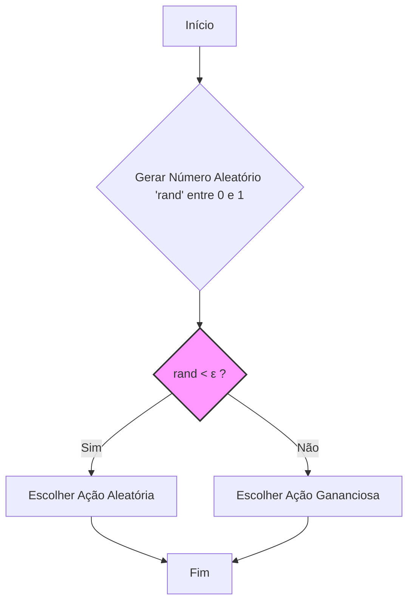
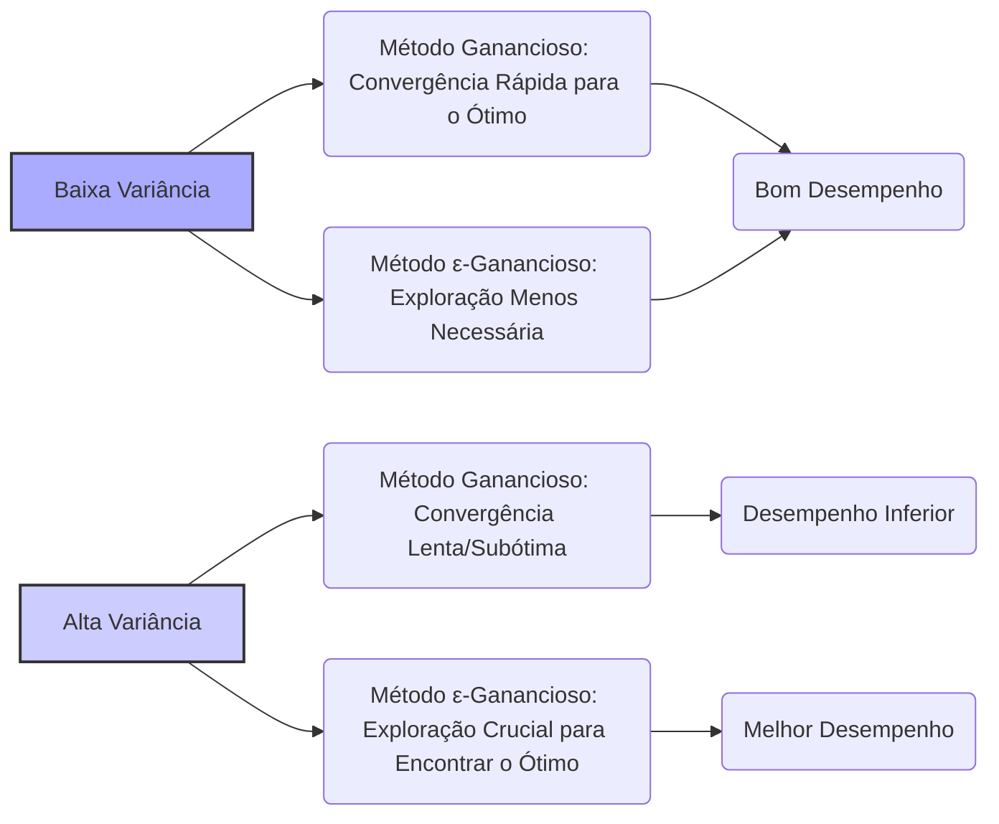

### Análise Detalhada da Vantagem de Métodos ε-Gananciosos no Testbed de 10 Braços

### Introdução
O aprendizado por reforço, diferentemente de outras abordagens de aprendizado, utiliza informações de treinamento que avaliam as ações tomadas em vez de instruir sobre as ações corretas [^1]. Essa distinção fundamental leva à necessidade de **exploração ativa**, um processo de busca explícita por comportamentos ótimos [^1]. Este capítulo aborda o aprendizado por reforço no contexto simplificado de *multi-armed bandits*, um problema onde a complexidade do aprendizado para agir em múltiplas situações é evitada, focando na avaliação das ações tomadas [^1]. O **problema do *k-armed bandit*** é introduzido como um exemplo para demonstrar diversos métodos de aprendizado que podem ser estendidos para o problema completo de aprendizado por reforço [^1].

### Conceitos Fundamentais
No problema do *k-armed bandit*, o agente deve escolher repetidamente entre *k* opções, recebendo uma recompensa numérica a cada escolha, amostrada a partir de uma distribuição de probabilidade estacionária dependente da ação selecionada [^1]. O objetivo é maximizar a recompensa total esperada ao longo do tempo [^2]. Cada ação tem um **valor esperado** ou recompensa média associada, denotada por  $q_*(a)$, que é o valor da ação $a$ [^2]. A **estimativa do valor da ação** $a$ no passo de tempo $t$ é denotada por $Q_t(a)$ [^2]. Se os valores de cada ação fossem conhecidos, o problema se tornaria trivial, com o agente sempre selecionando a ação de maior valor [^2]. Contudo, em geral, os valores das ações são desconhecidos, requerendo que o agente explore o ambiente e use essa experiência para estimar os valores das ações [^2].

**Ações gananciosas**, também chamadas de *greedy actions*, são aquelas com os maiores valores estimados, enquanto **ações não-gananciosas** são as outras ações [^2]. A **exploração** permite melhorar as estimativas de valores de ações não-gananciosas, o que pode levar a recompensas maiores no longo prazo [^2]. Existe um conflito entre **exploração** e **explotação**, uma vez que escolher uma ação gananciosa explora o conhecimento atual, enquanto escolher uma não-gananciosa pode levar a descobrir ações melhores [^2].

**Métodos de valor de ação** são usados para estimar os valores das ações e fazer decisões de seleção de ações. Um método natural é a **média amostral**, dada por:

$$
Q_t(a) = \frac{\text{soma das recompensas quando a é tomada antes de t}}{\text{número de vezes que a foi tomada antes de t}} = \frac{\sum_{i=1}^{t-1} R_i \mathbb{1}_{A_i=a}}{\sum_{i=1}^{t-1} \mathbb{1}_{A_i=a}}
$$

onde $\mathbb{1}_{\text{predicado}}$ é uma variável aleatória que é 1 se o predicado for verdadeiro e 0 caso contrário [^3]. Quando o denominador for zero, $Q_t(a)$ é definido como um valor padrão, como 0 [^3]. Pela lei dos grandes números, $Q_t(a)$ converge para $q_*(a)$ conforme o denominador tende ao infinito [^3].

> 💡 **Exemplo Numérico:** Suponha que temos um *k-armed bandit* com 3 braços. Vamos focar no braço 1 (a=1). No tempo t=1, ele é selecionado e retorna uma recompensa de 2. No tempo t=2, o braço 2 é selecionado. No tempo t=3, o braço 1 é selecionado novamente e retorna uma recompensa de 4. No tempo t=4, o braço 3 é selecionado. Agora, para o braço 1 (a=1) no tempo t=4, o valor estimado é:
>
> $$Q_4(1) = \frac{2 + 4}{2} = 3$$
>
> Se em t=5, o braço 1 fosse selecionado novamente e retornasse uma recompensa de 5, a estimativa seria:
>
> $$Q_5(1) = \frac{2 + 4 + 5}{3} = 3.667$$
>
> Este exemplo ilustra como a média amostral é calculada ao longo do tempo.

**Lema 1**
A média amostral $Q_t(a)$ é um estimador não viesado do valor esperado $q_*(a)$, dado que todas as recompensas são amostradas de uma mesma distribuição.
*Prova*: Isso segue da linearidade da esperança e do fato que cada recompensa é uma amostra da mesma distribuição, resultando em $E[Q_t(a)] = q_*(a)$

A **seleção de ação gananciosa** escolhe a ação com maior valor estimado:

$$
A_t = \underset{a}{\text{argmax}} Q_t(a)
$$

Uma alternativa é o **método ε-ganancioso**, que seleciona uma ação gananciosa com probabilidade $1-\epsilon$ e uma ação aleatória com probabilidade $\epsilon$ [^3]. Métodos ε-gananciosos garantem que todas as ações sejam amostradas infinitas vezes no limite, assegurando que os valores estimados convirjam para os valores reais, e que a probabilidade de escolher a ação ótima convirja para um valor maior que $1-\epsilon$ [^4].

> 💡 **Exemplo Numérico:** Suponha que temos 3 braços com as seguintes estimativas $Q_t(1) = 2$, $Q_t(2) = 4$, e $Q_t(3) = 3$. Usando o método ε-ganancioso com $\epsilon = 0.1$, escolhemos a ação com maior valor estimado (braço 2) com probabilidade $1 - \epsilon = 0.9$. Com probabilidade $\epsilon = 0.1$, escolhemos um dos braços aleatoriamente, sendo cada braço escolhido com probabilidade $\frac{\epsilon}{k} = \frac{0.1}{3} \approx 0.033$. Portanto, a probabilidade de escolher o braço 2 é de 0.9 + 0.033 = 0.933 (aproximadamente), enquanto cada um dos braços 1 e 3 tem probabilidade 0.033.

**Lema 1.1**
No método $\epsilon$-ganancioso, a probabilidade de escolher a ação ótima no limite é maior ou igual a $1 - \epsilon + \frac{\epsilon}{k}$.
*Prova:* Com probabilidade $1-\epsilon$, a ação gananciosa é escolhida. Se o valor estimado da ação ótima for o maior, então a ação ótima é escolhida. Com probabilidade $\epsilon$, uma ação é escolhida aleatoriamente, e a probabilidade de se escolher a ação ótima é $\frac{1}{k}$. Assim, a probabilidade total é $1-\epsilon + \frac{\epsilon}{k}$ quando a ação gananciosa é a ação ótima, e $1 - \epsilon$ quando a ação gananciosa não é a ótima. Portanto, no limite quando $Q_t(a)$ converge para $q_*(a)$, a probabilidade de escolher a ação ótima é pelo menos $1 - \epsilon + \frac{\epsilon}{k}$.

> 💡 **Exemplo Numérico:**  Com $\epsilon = 0.1$ e $k = 3$, a probabilidade de escolher a ação ótima é pelo menos $1 - 0.1 + \frac{0.1}{3} \approx 0.933$.  Isso significa que mesmo com a exploração, o método tende a escolher a ação ótima com alta probabilidade no longo prazo. Se $\epsilon = 0$, a probabilidade seria 1 (se a estimativa da ação ótima estiver correta) ou 0 (se não estiver). Se $\epsilon = 1$, a probabilidade seria 1/3, a mesma de qualquer outra ação. Isso demonstra o compromisso do ε-ganancioso.

### Vantagem Dependente da Tarefa: Variação na Recompensa

A **vantagem dos métodos ε-gananciosos sobre os métodos puramente gananciosos depende da natureza da tarefa** [^6]. Especificamente, quando a variância da recompensa é alta, os métodos ε-gananciosos tendem a apresentar um melhor desempenho [^6]. Isso ocorre porque a alta variação na recompensa torna mais difícil identificar com precisão qual ação é ótima com base em amostras limitadas [^6]. Assim, a exploração, incentivada pelos métodos ε-gananciosos, é crucial para descobrir a ação ideal em meio a essa incerteza [^6]. Por exemplo, se a variância da recompensa fosse 10 em vez de 1, os métodos ε-gananciosos se beneficiariam mais ao explorar o espaço de ações, em comparação ao caso de variância 1, em que uma pequena amostragem das recompensas já revela a ação ótima com precisão [^6].

> 💡 **Exemplo Numérico:** Considere dois cenários com dois braços. No cenário 1, o braço 1 tem recompensa média 1 com variância 1, e o braço 2 tem recompensa média 2 com variância 1. No cenário 2, o braço 1 tem recompensa média 1 com variância 10, e o braço 2 tem recompensa média 2 com variância 10. Um método ganancioso puro poderia rapidamente convergir para o braço 2 no cenário 1, porque as amostras das recompensas serão consistentes e o braço 2 sempre parecerá melhor. No cenário 2, a alta variância leva a grandes flutuações nas recompensas, fazendo com que o método ganancioso escolha o braço 1 em várias ocasiões devido ao ruído, mesmo que o braço 2 seja o ótimo. O método ε-ganancioso, com exploração, terá uma chance maior de encontrar o braço 2 no cenário 2.

**Proposição 2**
A diferença no desempenho entre métodos $\epsilon$-gananciosos e puramente gananciosos aumenta com a variância da recompensa, mantendo-se os demais parâmetros constantes.
*Prova (Esboço):* Uma alta variância da recompensa significa que as estimativas $Q_t(a)$ são mais ruidosas, o que torna mais difícil para um método ganancioso convergir para a ação ótima rapidamente. Métodos $\epsilon$-gananciosos, explorando outras ações, mitigam os efeitos desse ruído e acabam descobrindo a ação ótima com maior probabilidade ao longo do tempo, compensando o custo inicial da exploração.

Em contraste, quando as recompensas têm variância zero, um método ganancioso puro poderia ter um desempenho melhor [^6]. Nessa situação, a exploração se torna desnecessária porque a recompensa de cada ação é imediatamente conhecida após uma única tentativa. O método ganancioso rapidamente descobriria a ação ótima e pararia de explorar, sem perder tempo com exploração inútil. No entanto, mesmo em casos determinísticos, a exploração é necessária se o problema se tornar não estacionário, onde os verdadeiros valores das ações mudam ao longo do tempo [^6].

> 💡 **Exemplo Numérico:** Suponha que temos um cenário onde cada braço de um *k-armed bandit* tem um valor fixo, sem nenhuma variação (variância 0). Por exemplo, braço 1 tem recompensa sempre 1, braço 2 tem recompensa sempre 2, e braço 3 tem recompensa sempre 0. O método puramente ganancioso selecionará o braço 2 após a primeira iteração (se o inicializar adequadamente). A exploração seria inútil porque não há necessidade de refinar as estimativas, pois não há ruído nas recompensas.

**Teorema 3**
Para um problema *k-armed bandit* com recompensas estacionárias e uma variância de recompensa $\sigma^2$, existe um valor ótimo $\epsilon^*$ para o método $\epsilon$-ganancioso que maximiza a recompensa acumulada ao longo do tempo.
*Prova (Esboço):* Para um valor de $\epsilon$ muito pequeno, a exploração é insuficiente, e o agente pode ficar preso em ações subótimas. Para um valor de $\epsilon$ muito grande, a exploração excessiva leva a uma perda de recompensa. Portanto, existe um valor intermediário $\epsilon^*$ que balanceia exploração e explotação de forma ideal, e esse valor depende da variância $\sigma^2$.

> 💡 **Exemplo Numérico:**  Em um problema de *k-armed bandit* com 10 braços, com recompensas com variância $\sigma^2 = 1$, um valor de $\epsilon^* = 0.1$ pode ser razoável. Isso significa que 10% do tempo é gasto explorando. Se a variância fosse maior, digamos $\sigma^2 = 10$, então $\epsilon^*$ poderia ser maior, talvez 0.2 ou 0.3, para incentivar mais exploração. O valor exato de $\epsilon^*$ é tipicamente encontrado através de experimentação, pois depende da distribuição das recompensas e de outros fatores específicos do problema.

No cenário não-estacionário, um método puramente ganancioso não consegue se adaptar às mudanças nos valores das ações, uma vez que ele sempre escolhe a ação que tem a maior estimativa atual [^6]. Por outro lado, os métodos ε-gananciosos continuam a explorar mesmo quando a tarefa muda, sendo capazes de se ajustar às novas dinâmicas do ambiente. A capacidade de equilibrar exploração e explotação é um aspecto central do aprendizado por reforço [^6].

> 💡 **Exemplo Numérico:** Suponha que, em um dado momento, as recompensas do braço 2 se tornem subitamente muito piores, e que o braço 3 se torne o ótimo. Um agente ganancioso que escolhe sempre o braço 2 não perceberá a mudança. Mas um agente ε-ganancioso com $\epsilon$ não nulo eventualmente explorará o braço 3 e perceberá que este se tornou o ótimo. No entanto, se a mudança for muito rápida e $\epsilon$ for muito pequeno, o agente ainda demorará para se ajustar à nova dinâmica.

**Corolário 3.1**
Em um cenário não-estacionário, o valor ótimo $\epsilon^*$ para o método $\epsilon$-ganancioso pode mudar ao longo do tempo, dependendo do quão rápido e drasticamente os valores das ações mudam.
*Prova (Esboço):* Se a dinâmica do problema muda rapidamente, o agente necessita de mais exploração para acompanhar essas mudanças. Isso implica que $\epsilon^*$ deverá ser maior do que no cenário estacionário.

> 💡 **Exemplo Numérico:** Imagine um problema onde, a cada 100 passos, os valores ótimos das ações mudam aleatoriamente. Inicialmente, um $\epsilon^* = 0.1$ pode ser bom. Mas, após 100 passos, um $\epsilon^* = 0.3$ pode ser necessário para que o agente acompanhe a nova dinâmica. Ajustar o valor de $\epsilon$ ao longo do tempo é uma estratégia avançada que pode melhorar o desempenho em ambientes não-estacionários.

### Conclusão
Em resumo, a vantagem dos métodos ε-gananciosos sobre os métodos gananciosos é intrinsecamente ligada à complexidade e incerteza do problema do *k-armed bandit*. A variância das recompensas é um fator crítico que determina qual abordagem será mais eficaz [^6]. Enquanto em situações de baixa variação, onde a exploração se torna menos essencial, métodos puramente gananciosos podem ser suficientes. Entretanto, em cenários de alta variação, como os encontrados em problemas não-estacionários, a exploração controlada pelos métodos ε-gananciosos demonstra sua eficácia em garantir que o agente não fique preso em ações subótimas e, consequentemente, alcance um melhor desempenho no longo prazo.

### Referências
[^1]: "The most important feature distinguishing reinforcement learning from other types of learning is that it uses training information that evaluates the actions taken rather than instructs by giving correct actions." *(Trecho de <Chapter 2: Multi-armed Bandits>)*
[^2]: "In our k-armed bandit problem, each of the k actions has an expected or mean reward given that that action is selected; let us call this the value of that action." *(Trecho de <Chapter 2: Multi-armed Bandits>)*
[^3]: "We begin by looking more closely at methods for estimating the values of actions and for using the estimates to make action selection decisions, which we collectively call action-value methods." *(Trecho de <Chapter 2: Multi-armed Bandits>)*
[^4]: "An advantage of these methods is that, in the limit as the number of steps increases, every action will be sampled an infinite number of times, thus ensuring that all the Qt(a) converge to their respective q*(a)." *(Trecho de <Chapter 2: Multi-armed Bandits>)*
[^6]: "The advantage of ɛ-greedy over greedy methods depends on the task. For example, suppose the reward variance had been larger, say 10 instead of 1." *(Trecho de <Chapter 2: Multi-armed Bandits>)*
