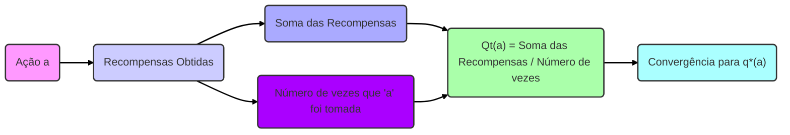
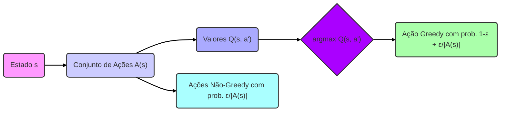
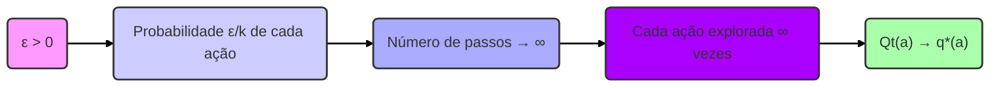
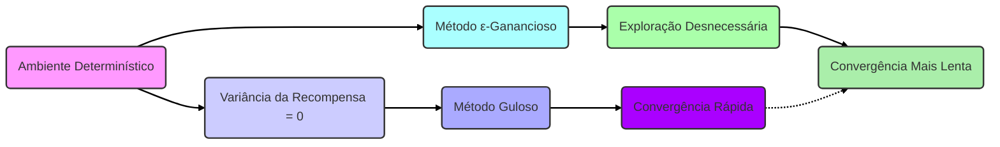
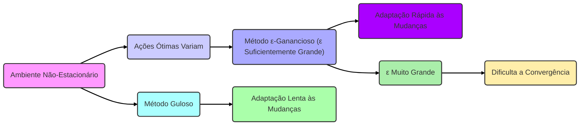
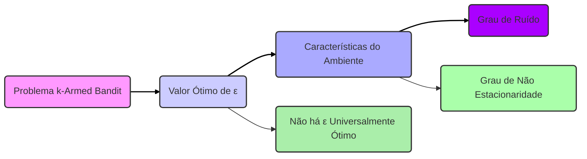

## O Testbed de 10-Braços e o Comportamento ε-Ganancioso

### Introdução

O estudo de *multi-armed bandits* (bandidos de múltiplos braços) fornece uma base para a compreensão do aprendizado por reforço, particularmente no que diz respeito ao *trade-off* entre exploração e explotação [^1]. No contexto de *reinforcement learning*, a distinção crucial é que o aprendizado ocorre por meio da avaliação das ações tomadas, e não pela instrução direta sobre as ações corretas [^1]. Métodos que exploram, ou seja, tentam novas ações, podem levar a melhores resultados no longo prazo, embora reduzam a recompensa imediata [^2]. Para demonstrar o impacto da exploração, o *10-armed testbed* (banco de testes de 10 braços) é utilizado como um exemplo prático. Este capítulo se aprofundará na análise deste testbed e nas características dos métodos ε-gananciosos.

### Conceitos Fundamentais

O *k-armed bandit problem* (problema do bandido de k braços) consiste em escolher repetidamente entre *k* diferentes opções, ou ações, cada uma com uma distribuição de probabilidade estacionária associada, resultando em uma recompensa numérica. O objetivo é maximizar a recompensa total esperada ao longo de um período [^1]. O *10-armed testbed* é uma instancia desse problema com *k = 10*, onde cada ação *a* tem um valor verdadeiro associado, $q_*(a)$, definido como o valor esperado da recompensa quando a ação *a* é selecionada:

$$q_*(a) = \mathbb{E}[R_t | A_t = a]$$

onde $A_t$ é a ação selecionada no tempo *t* e $R_t$ é a recompensa correspondente [^2]. Esses valores são amostrados de uma distribuição normal com média 0 e variância 1. As recompensas reais também são amostradas de uma distribuição normal com média $q_*(a)$ e variância 1 [^4].

> 💡 **Exemplo Numérico:** Vamos supor que, para o braço 1 (a=1), o valor verdadeiro $q_*(1)$ seja 0.5. Isso significa que, em média, ao escolher o braço 1, esperamos receber uma recompensa de 0.5. No entanto, cada vez que selecionamos este braço, a recompensa real $R_t$ será sorteada de uma distribuição normal com média 0.5 e variância 1, então poderíamos obter valores como 1.2, -0.1, 0.8, etc. De forma semelhante, o braço 2 (a=2) poderia ter $q_*(2) = -0.2$ e, ao selecioná-lo, obteríamos recompensas como -0.5, 0.3, -1.1, e assim por diante. Cada braço tem seu próprio valor esperado $q_*(a)$ e sua distribuição de recompensas correspondente.
>
> ```python
> import numpy as np
> import matplotlib.pyplot as plt
> import seaborn as sns
>
> np.random.seed(42) # Para reprodutibilidade
>
> # Valores verdadeiros dos 10 braços
> q_star = np.random.normal(0, 1, 10)
>
> # Amostras de recompensas para alguns braços
> arm1_rewards = np.random.normal(q_star[0], 1, 100) # 100 recompensas para o braço 1
> arm2_rewards = np.random.normal(q_star[1], 1, 100) # 100 recompensas para o braço 2
>
> # Visualização da distribuição das recompensas
> sns.kdeplot(arm1_rewards, label=f"Braço 1 (q*={q_star[0]:.2f})")
> sns.kdeplot(arm2_rewards, label=f"Braço 2 (q*={q_star[1]:.2f})")
> plt.xlabel("Recompensa")
> plt.ylabel("Densidade")
> plt.title("Distribuição das Recompensas para Dois Braços")
> plt.legend()
> plt.show()
> ```
> Este código gera um gráfico mostrando a distribuição de recompensas para dois braços, demonstrando visualmente que, embora os valores esperados sejam diferentes ($q_*(a)$), as recompensas reais variam de acordo com a distribuição normal.

**Proposição 1.** *A distribuição das recompensas $R_t$ dado uma ação $A_t = a$ é uma distribuição normal com média $q_*(a)$ e variância 1, ou seja, $R_t | A_t = a \sim \mathcal{N}(q_*(a), 1)$.*

*Esta proposição formaliza a descrição das recompensas como amostras de uma distribuição normal centrada no valor verdadeiro da ação, estabelecendo uma base para análise estatística subsequente.*

```mermaid
graph LR
    A("Ação a") --> B("Valor Verdadeiro q*(a)");
    B --> C("Distribuição Normal N(q*(a), 1)");
    C --> D("Recompensa Rt");
    style A fill:#f9f,stroke:#333,stroke-width:2px
    style B fill:#ccf,stroke:#333,stroke-width:2px
    style C fill:#aaf,stroke:#333,stroke-width:2px
    style D fill:#a0f,stroke:#333,stroke-width:2px
    linkStyle 0,1,2,3 stroke:black,stroke-width:2px;
```

Os métodos de *action-value* (valor da ação) estimam os valores das ações e utilizam essas estimativas para tomar decisões sobre a seleção das ações. Uma forma comum de estimar o valor de uma ação é através da média das recompensas obtidas ao selecionar essa ação:

$$Q_t(a) = \frac{\text{soma das recompensas quando } a \text{ foi tomada antes de } t}{\text{número de vezes que } a \text{ foi tomada antes de } t} = \frac{\sum_{i=1}^{t-1} R_i \mathbb{1}_{A_i=a}}{\sum_{i=1}^{t-1} \mathbb{1}_{A_i=a}}$$

onde $\mathbb{1}_{\text{predicate}}$ é igual a 1 se *predicate* for verdadeiro, e 0 caso contrário [^3].

> 💡 **Exemplo Numérico:**  Imagine que escolhemos o braço 1 (a=1) três vezes. As recompensas obtidas foram $R_1 = 0.8$, $R_2 = 0.2$, e $R_3 = 1.1$.  O valor estimado para o braço 1 após essas três seleções seria:
>
> $$Q_4(1) = \frac{0.8 + 0.2 + 1.1}{3} = \frac{2.1}{3} = 0.7$$
>
> Se na próxima iteração escolhermos novamente o braço 1 e obtivermos uma recompensa de $R_4 = 0.5$, o valor estimado seria atualizado:
>
> $$Q_5(1) = \frac{0.8 + 0.2 + 1.1 + 0.5}{4} = \frac{2.6}{4} = 0.65$$
>
> A estimativa $Q_t(a)$ se ajusta conforme obtemos mais informações.
>
> ```python
> rewards_arm1 = [0.8, 0.2, 1.1, 0.5]
> q_estimates = np.cumsum(rewards_arm1) / np.arange(1, len(rewards_arm1) + 1)
> print("Estimativas de Q(1) ao longo do tempo:", q_estimates)
> ```

**Lema 1.** *A estimativa $Q_t(a)$ converge para $q_*(a)$ quando o número de vezes que a ação 'a' é tomada tende ao infinito, assumindo que as recompensas são limitadas. Este resultado é uma consequência da lei dos grandes números.*

*Este lema fornece uma garantia teórica de que as estimativas de valor da ação convergem para os valores verdadeiros, essencial para a eficácia dos métodos de aprendizado por reforço baseados em estimativas de valor.*



Os métodos ε-gananciosos são uma abordagem simples para equilibrar exploração e explotação. Nesses métodos, a ação com o maior valor estimado (ação *greedy*) é selecionada com probabilidade $1-\epsilon$, e uma ação aleatória é selecionada com probabilidade ε [^3]. O parâmetro ε controla a frequência da exploração: valores mais altos de ε implicam maior exploração. O texto enfatiza que, ao analisar o comportamento dos métodos ε-gananciosos, é possível observar um *trade-off* entre a velocidade de descoberta de ações ótimas e o desempenho no longo prazo [^6].

> 💡 **Exemplo Numérico:**  Suponha que, após algumas iterações, tenhamos as seguintes estimativas de valor para 3 dos 10 braços: $Q_t(1) = 0.6$, $Q_t(2) = 0.8$, e $Q_t(3) = 0.5$. Se utilizarmos um método ε-ganancioso com $\epsilon = 0.2$, a probabilidade de escolher o braço 2 (o de maior valor) é $1 - 0.2 = 0.8$. Há também uma probabilidade de $0.2$ de escolher aleatoriamente um dos 10 braços, incluindo o braço 2, mas com uma chance menor. Portanto, a cada iteração, 80% das vezes escolheremos o braço 2 e 20% das vezes escolheremos um braço aleatoriamente. Esta aleatoriedade garante que outros braços também sejam explorados, permitindo que a gente descubra um braço melhor.
>
> ```python
> def epsilon_greedy_action(q_values, epsilon):
>    if np.random.rand() < epsilon:
>        return np.random.randint(0, len(q_values))  # Ação aleatória
>    else:
>        return np.argmax(q_values) # Ação greedy
>
> q_values = [0.6, 0.8, 0.5]  # Estimativas de valor para os braços 1, 2 e 3
> epsilon = 0.2
>
> actions = [epsilon_greedy_action(q_values, epsilon) for _ in range(100)]
> unique_actions, counts = np.unique(actions, return_counts=True)
> for action, count in zip(unique_actions, counts):
>    print(f"Braço {action + 1} escolhido {count} vezes")
>
> ```
> Este código simula a seleção de ações por 100 iterações com um método $\epsilon$-ganancioso com $\epsilon=0.2$, mostrando a frequência com que cada braço é selecionado. Note que, em média, o braço 2 (de maior valor) é selecionado com mais frequência.

**Definição 1.** *Uma política $\pi$ é dita $\epsilon$-gananciosa se, para cada estado $s \in \mathcal{S}$, a ação $a$ é escolhida seguindo:*

$$\pi(a|s) = \begin{cases} 1 - \epsilon + \frac{\epsilon}{|\mathcal{A}(s)|} & \text{se } a = \arg\max_{a' \in \mathcal{A}(s)} Q(s, a') \\ \frac{\epsilon}{|\mathcal{A}(s)|} & \text{caso contrário} \end{cases}$$

*onde $\mathcal{A}(s)$ é o conjunto de ações disponíveis no estado $s$, e $|\mathcal{A}(s)|$ denota sua cardinalidade. Esta definição formaliza a probabilidade de seleção de ações nos métodos $\epsilon$-gananciosos.*



### Análise do Comportamento ε-Ganancioso no Testbed

No *10-armed testbed*, o desempenho dos métodos gananciosos e ε-gananciosos é comparado empiricamente. A Figura 2.2 no contexto [^5] demonstra que o método puramente ganancioso inicialmente melhora mais rapidamente, mas estagna em um nível de recompensa inferior, pois fica preso em ações subótimas [^5]. Os métodos ε-gananciosos, por outro lado, exploram o espaço de ação, melhorando as chances de encontrar a ação ideal [^6].

Especificamente, o texto aborda que o método ε-ganancioso com ε=0.1 explora mais e geralmente encontra a ação ótima mais rapidamente, mas nunca a seleciona mais que 91% das vezes. Em contraste, o método com ε=0.01 melhora mais lentamente, mas eventualmente supera o método com ε=0.1, nas métricas de desempenho e probabilidade de seleção da ação ótima, sugerindo que um valor menor de ε leva a uma exploração menos frequente, mas mais refinada ao longo do tempo [^6]. Isso demonstra que:

> *Os métodos  ε-gananciosos eventualmente apresentam um desempenho melhor porque eles continuam explorando e melhorando suas chances de reconhecer a ação ótima.* [^6]

> 💡 **Exemplo Numérico:** Vamos simular um cenário onde temos 10 braços, onde um dos braços tem um valor esperado de 1.5 e os outros têm um valor de 0.5. Para um método puramente ganancioso ($\epsilon=0$), uma vez que ele encontrar um braço com um valor de recompensa razoavelmente bom, ele não explorará mais. Isso significa que, se um braço com valor de 0.5 for escolhido cedo e der uma recompensa relativamente alta, ele vai "prender" naquele braço, pois ele não tem mecanismo de exploração. Um método com $\epsilon = 0.1$ explorará com mais frequência, eventualmente encontrando o braço com recompensa de 1.5. No longo prazo, o método com $\epsilon = 0.1$ apresentará um desempenho melhor.
>
> ```python
> def simulate_bandit(q_star, num_steps, epsilon):
>    q_estimates = np.zeros(len(q_star))
>    counts = np.zeros(len(q_star))
>    rewards = []
>
>    for _ in range(num_steps):
>        if np.random.rand() < epsilon:
>            action = np.random.randint(0, len(q_star))
>        else:
>            action = np.argmax(q_estimates)
>
>        reward = np.random.normal(q_star[action], 1)
>        rewards.append(reward)
>        counts[action] += 1
>        q_estimates[action] = q_estimates[action] + (reward - q_estimates[action]) / counts[action]
>    return rewards
>
> num_arms = 10
> q_star_values = np.zeros(num_arms) + 0.5
> q_star_values[0] = 1.5
> num_steps = 1000
>
> rewards_greedy = simulate_bandit(q_star_values, num_steps, 0)
> rewards_epsilon_01 = simulate_bandit(q_star_values, num_steps, 0.1)
> rewards_epsilon_001 = simulate_bandit(q_star_values, num_steps, 0.01)
>
> plt.figure(figsize=(10, 6))
> plt.plot(np.cumsum(rewards_greedy) / np.arange(1, num_steps+1), label="Greedy (ε=0)")
> plt.plot(np.cumsum(rewards_epsilon_01) / np.arange(1, num_steps+1), label="ε-greedy (ε=0.1)")
> plt.plot(np.cumsum(rewards_epsilon_001) / np.arange(1, num_steps+1), label="ε-greedy (ε=0.01)")
> plt.xlabel("Steps")
> plt.ylabel("Average Reward")
> plt.title("Comparison of Epsilon-Greedy Methods")
> plt.legend()
> plt.show()
> ```
> Este código simula a execução dos métodos gananciosos e ε-gananciosos em um ambiente simples, demonstrando que os métodos ε-gananciosos têm melhor desempenho no longo prazo.

**Teorema 1.** *Em um problema *k*-armed bandit, um método $\epsilon$-ganancioso com $\epsilon > 0$ garante que cada ação será explorada um número infinito de vezes com probabilidade 1, se o número de passos for infinito. Isso implica que a estimativa de valor de cada ação convergiria eventualmente para o seu valor verdadeiro.*

*Prova: A cada passo, existe uma probabilidade $\epsilon/k > 0$ de qualquer ação ser escolhida. Como o número de passos tende ao infinito, o número de vezes que cada ação é selecionada também tende ao infinito, o que é suficiente para a convergência da estimativa do valor de cada ação. Este resultado demonstra formalmente a garantia de exploração dos métodos $\epsilon$-gananciosos.*



É importante notar que a vantagem dos métodos ε-gananciosos depende da natureza da tarefa. Em ambientes ruidosos, onde a variância das recompensas é maior, é necessário mais exploração para encontrar a ação ótima, tornando os métodos ε-gananciosos ainda mais eficazes em relação aos métodos puramente gananciosos [^6]. Contudo, em cenários determinísticos, onde a variância é zero, o método ganancioso poderia apresentar o melhor desempenho, pois ele identificaria rapidamente a ação ótima, sem precisar explorar [^6].

> 💡 **Exemplo Numérico:** Em um ambiente onde as recompensas são determinísticas (sem ruído), o braço com a maior recompensa sempre entregará aquela recompensa. O método ganancioso, se tiver sorte de selecionar o braço certo em um dos primeiros passos, rapidamente irá convergir para o braço correto, sem necessidade de explorar.
>
> ```python
> def deterministic_bandit(q_star, num_steps, epsilon):
>    q_estimates = np.zeros(len(q_star))
>    counts = np.zeros(len(q_star))
>    rewards = []
>
>    for _ in range(num_steps):
>        if np.random.rand() < epsilon:
>             action = np.random.randint(0, len(q_star))
>        else:
>            action = np.argmax(q_estimates)
>        reward = q_star[action] # Recompensa determinística
>        rewards.append(reward)
>        counts[action] += 1
>        q_estimates[action] = q_estimates[action] + (reward - q_estimates[action]) / counts[action]
>    return rewards
>
> num_arms = 10
> q_star_values = np.zeros(num_arms)
> q_star_values[0] = 1.5
> num_steps = 1000
>
> rewards_greedy = deterministic_bandit(q_star_values, num_steps, 0)
> rewards_epsilon_01 = deterministic_bandit(q_star_values, num_steps, 0.1)
>
> plt.figure(figsize=(10, 6))
> plt.plot(np.cumsum(rewards_greedy) / np.arange(1, num_steps+1), label="Greedy (ε=0)")
> plt.plot(np.cumsum(rewards_epsilon_01) / np.arange(1, num_steps+1), label="ε-greedy (ε=0.1)")
> plt.xlabel("Steps")
> plt.ylabel("Average Reward")
> plt.title("Comparison in a Deterministic Environment")
> plt.legend()
> plt.show()
>
> ```
> Este exemplo demonstra como, em ambientes determinísticos, o método ganancioso pode convergir mais rápido, já que ele não tem o custo de exploração.

**Lema 1.1.** *Se o ambiente é determinístico, i.e., a variância das recompensas é zero, um método puramente guloso converge para a ação ótima mais rapidamente do que um método $\epsilon$-ganancioso com $\epsilon > 0$.*

*Este lema formaliza que em ambientes determinísticos, a exploração introduzida pelo $\epsilon$ é desnecessária, e um método ganancioso converge mais rápido.*



Contudo, em ambientes não-estacionários, onde as ações ótimas podem variar com o tempo, a exploração torna-se essencial, mesmo em cenários determinísticos [^6]. Esta observação destaca a importância de um equilíbrio adequado entre exploração e exploração no aprendizado por reforço.

**Teorema 1.1** *Em ambientes não-estacionários, um método $\epsilon$-ganancioso com um valor de $\epsilon$ suficientemente grande pode se adaptar às mudanças do ambiente mais rapidamente do que um método puramente ganancioso. Contudo, um valor muito grande de $\epsilon$ pode dificultar a convergência para a ação ótima.*

*Este teorema enfatiza a importância da exploração em ambientes não-estacionários e a necessidade de um ajuste adequado do parâmetro $\epsilon$ para obter um desempenho ideal.*


### Conclusão

A análise do *10-armed testbed* ilustra o compromisso entre exploração e exploração no aprendizado por reforço. Os métodos ε-gananciosos demonstram que valores maiores de ε levam a uma exploração inicial mais rápida, mas a uma seleção menos frequente da ação ótima no longo prazo [^6]. Já, valores menores de ε levam a uma exploração mais lenta, mas a um melhor desempenho a longo prazo. A escolha do valor de ε, portanto, é crucial e deve ser adaptada à tarefa específica. Este estudo fornece *insights* valiosos sobre as características de diferentes estratégias de exploração e destaca a importância de escolher a abordagem correta para diferentes problemas de aprendizado por reforço.

**Corolário 1.** *O valor ótimo do parâmetro ε em um problema *k*-armed bandit é dependente das características do ambiente, como o grau de ruído e o grau de não estacionariedade. Não há um valor de ε que seja universalmente ótimo para todos os problemas.*

*Este corolário resume a necessidade de um ajuste cuidadoso do hiperparâmetro ε, dependendo das características do ambiente.*


### Referências

[^1]: "The most important feature distinguishing reinforcement learning from other types of learning is that it uses training information that evaluates the actions taken rather than instructs by giving correct actions." *(Trecho de Multi-armed Bandits)*
[^2]: "In our k-armed bandit problem, each of the k actions has an expected or mean reward given that that action is selected; let us call this the value of that action." *(Trecho de Multi-armed Bandits)*
[^3]: "The simplest action selection rule is to select one of the actions with the highest estimated value, that is, one of the greedy actions as defined in the previous section." *(Trecho de Multi-armed Bandits)*
[^4]: "Then, when a learning method applied to that problem selected action At at time step t, the actual reward, Rt, was selected from a normal distribution with mean q*(At) and variance 1." *(Trecho de Multi-armed Bandits)*
[^5]: "Figure 2.2 compares a greedy method with two ε-greedy methods (ε=0.01 and ε=0.1), as described above, on the 10-armed testbed." *(Trecho de Multi-armed Bandits)*
[^6]: "The ε = 0.1 method explored more, and usually found the optimal action earlier, but it never selected that action more than 91% of the time." *(Trecho de Multi-armed Bandits)*
