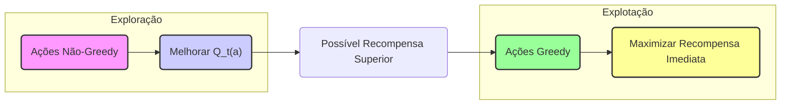
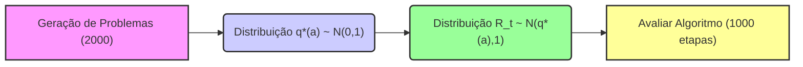
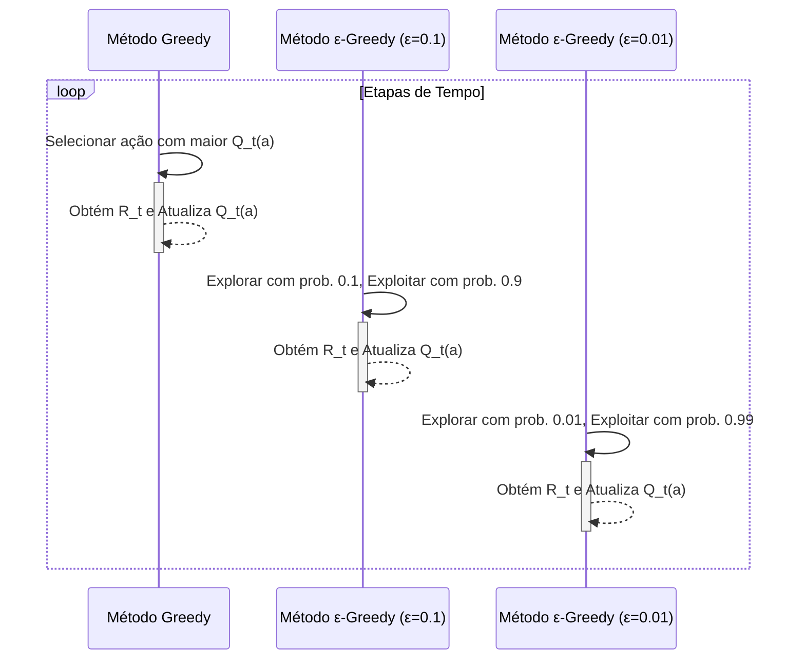
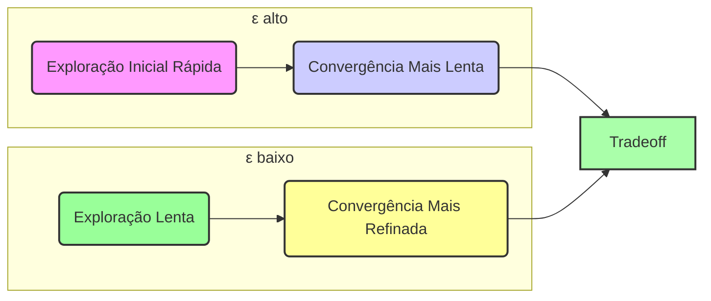
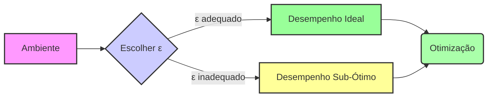

## Explorando o Dilema da Exploração-Explotação no Testbed de 10 Braços
### Introdução
O conceito de **Multi-armed Bandits** é central para entender a dinâmica entre **exploração** e **explotação** em aprendizado por reforço. Este capítulo foca no aspecto avaliativo do aprendizado por reforço, ou seja, em como as ações são avaliadas com base no *feedback* recebido, e não em instruções sobre qual ação tomar [^1]. O **k-armed bandit problem**, que será explorado aqui, é uma versão simplificada, onde o agente precisa escolher entre *k* ações, cada uma fornecendo recompensas com distribuições de probabilidade estacionárias, a fim de maximizar a recompensa total esperada [^1]. O objetivo é entender como o feedback avaliativo difere e se combina com o feedback instrutivo, evitando a complexidade do problema completo de aprendizado por reforço [^1]. O presente texto irá se aprofundar na análise do **10-armed testbed**, avaliando o desempenho do método ganancioso em comparação com as abordagens *-greedy*, particularmente em cenários determinísticos e não estacionários [^2].

### Conceitos Fundamentais
#### O Problema k-armed Bandit
O problema *k-armed bandit* envolve um agente tomando decisões repetidamente entre *k* opções, ou ações. Após cada escolha, uma recompensa numérica é obtida, extraída de uma distribuição de probabilidade estacionária que depende da ação selecionada. O objetivo é maximizar a recompensa total esperada em um período específico, como 1000 seleções de ação ou passos de tempo [^2]. Cada ação tem um valor esperado, *q*(a), denotado como $$ q_*(a) = E[R_t | A_t = a] $$ [^2]. Onde $A_t$ é a ação selecionada no tempo *t* e $R_t$ é a recompensa correspondente. Em cenários ideais, com conhecimento de todos os valores *q*(a), o problema se tornaria trivial, consistindo em selecionar sempre a ação com o maior valor. No entanto, esses valores são desconhecidos e precisam ser estimados [^2]. As estimativas são denotadas como $Q_t(a)$, e o objetivo é que $Q_t(a)$ se aproxime de $q_*(a)$ [^2].

> 💡 **Exemplo Numérico:** Imagine um problema de 3 braços (k=3). As recompensas verdadeiras médias são $q_*(1) = 1.0$, $q_*(2) = 2.0$, e $q_*(3) = 1.5$. Inicialmente, não sabemos esses valores, e nossas estimativas $Q_t(a)$ são todas 0. Se selecionarmos o braço 1 na primeira iteração ($A_1=1$) e recebermos uma recompensa $R_1=0.8$, então nossa estimativa para o braço 1, $Q_1(1)$, será atualizada. Vamos usar a média amostral como estimador $Q_t(a)$. Depois de uma iteração, $Q_1(1) = 0.8$, $Q_1(2) = 0$, e $Q_1(3) = 0$.
```mermaid
graph LR
    A[ "Ação A_t" ] -->| "Recompensa R_t" | B( "Obter Recompensa" )
    B --> C{ "Atualizar Estimativa Q_t(a)" }
    C --> D[ "Próxima Ação" ]
    D --> A
    style A fill:#f9f,stroke:#333,stroke-width:2px
    style B fill:#ccf,stroke:#333,stroke-width:2px
    style C fill:#9f9,stroke:#333,stroke-width:2px
    style D fill:#ff9,stroke:#333,stroke-width:2px
```

#### Exploração vs. Explotação
A escolha entre **explorar** e **explorar** o conhecimento atual é fundamental. A **explotação** envolve selecionar ações com as maiores estimativas de valor ($Q_t(a)$), chamadas ações *greedy*. A **exploração**, por outro lado, envolve selecionar ações não- *greedy* para melhorar as estimativas do valor [^2]. A explotação maximiza a recompensa em uma única etapa, enquanto a exploração pode levar a uma maior recompensa total a longo prazo. Existe um conflito inerente entre essas duas abordagens, pois a exploração reduz a recompensa no curto prazo, mas beneficia o aprendizado futuro [^2].
**Proposição 1:** A escolha ótima entre exploração e explotação é dependente do horizonte temporal do problema. Em problemas com poucos passos de tempo restantes, a explotação tende a ser mais benéfica, enquanto a exploração torna-se mais vantajosa em problemas com um grande número de passos.
*Prova:* Se o número de passos de tempo restantes é pequeno, investir na exploração pode não ser tão vantajoso, já que a recompensa máxima possível nesse curto espaço de tempo será limitada. Por outro lado, se um grande número de passos de tempo ainda precisa ser feito, então a exploração inicial pode ser usada para refinar as estimativas de valor, levando a um melhor desempenho ao longo do tempo. $\blacksquare$


> 💡 **Exemplo Numérico:** Suponha que temos 10 passos de tempo restantes e conhecemos as estimativas de valor das ações como: $Q(1)=0.9$, $Q(2)=0.6$, $Q(3)=0.7$. Uma estratégia puramente exploratória (por exemplo, escolhendo cada braço igualmente) pode não ser ideal pois arriscaríamos escolher os braços 2 e 3 que rendem menos recompensa. Por outro lado, se tivéssemos 1000 passos, investir na exploração no início permitiria refinar estas estimativas e talvez descobrir um braço com valor real maior do que 0.9, mesmo que este braço tenha um valor estimado inicial menor.

#### O 10-armed Testbed
Para avaliar os métodos de ação-valor *greedy* e *-greedy*, foi criado um conjunto de 2000 problemas *k-armed bandit* com *k = 10*, chamado de *10-armed testbed* [^4]. Em cada problema, o valor verdadeiro de cada ação, $q_*(a)$, foi sorteado de uma distribuição normal com média 0 e variância 1. As recompensas reais $R_t$ foram sorteadas de uma distribuição normal com média $q_*(a)$ e variância 1 [^4]. Este testbed permite avaliar o desempenho dos algoritmos com base em como eles melhoram ao longo de 1000 etapas [^4]. A média de resultados de 2000 execuções independentes, cada uma com um problema *bandit* diferente, é utilizada para avaliar o comportamento médio do algoritmo [^5].
**Lema 1.1:** A escolha da distribuição de recompensas (neste caso, uma normal) e seus parâmetros influenciam diretamente a dificuldade de um problema *k-armed bandit*. Distribuições com variância maior tornam a exploração mais crucial.
*Prova:* Uma maior variância na distribuição de recompensas significa que uma única observação da recompensa fornece menos informações sobre o verdadeiro valor da ação. Isso torna a estimativa mais difícil e a exploração, portanto, mais importante para encontrar a ação ótima. $\blacksquare$


> 💡 **Exemplo Numérico:** Considere dois braços, A e B. Para o braço A, a recompensa média $q_*(A) = 1.0$, e as recompensas são sorteadas de uma normal com variância 1. Para o braço B, $q_*(B) = 1.2$ e as recompensas de uma normal com variância 4. As recompensas do braço B são mais "ruidosas", o que significa que será necessário mais exploração (e mais amostras) para estimar com precisão seu verdadeiro valor, em comparação com o braço A.

#### Análise do Desempenho do Método Ganancioso e ɛ-Greedy no 10-armed Testbed
No *10-armed testbed*, o método *greedy* melhorou rapidamente no início, mas depois estabilizou-se em um nível inferior em comparação com as abordagens *-greedy* [^5]. O método *greedy* obteve uma recompensa por passo de apenas 1, em comparação com o valor ótimo de aproximadamente 1,54 neste testbed [^5]. Isso aconteceu porque o método *greedy* muitas vezes ficava preso na seleção de ações subótimas, não explorando outras ações que poderiam ter recompensas maiores [^5].

Em contrapartida, os métodos *-greedy* (com *ε* = 0.01 e *ε* = 0.1) continuaram a explorar e, eventualmente, tiveram um desempenho melhor, reconhecendo as ações ótimas com maior frequência [^6]. O método *ε*=0.1 explorou mais e descobriu ações ótimas mais rapidamente, mas a seleção da ação ótima não excedeu 91% do tempo [^6]. O método *ε*=0.01 melhorou mais lentamente, mas, por fim, superou o método com *ε*=0.1 tanto em termos de recompensa quanto em probabilidade de selecionar a ação ótima [^6]. Em cenários com ruído nas recompensas (por exemplo, uma variância de recompensa maior), espera-se que o método *-greedy* tenha um desempenho melhor em relação ao método *greedy*, pois a exploração é ainda mais crucial [^6].


> 💡 **Exemplo Numérico:** Suponha que em um determinado problema do *10-armed testbed*, o braço 5 tem um valor verdadeiro de $q_*(5) = 1.5$. Inicialmente, todas as estimativas Q(a) são 0. No primeiro passo, o método *greedy* pode escolher qualquer braço (digamos braço 1), e obtém uma recompensa $R_1$. Suponha que na segunda iteração o método greedy encontra um braço com estimativa ligeiramente maior (digamos $Q_2(3)=0.2$). O método *greedy* irá escolher o braço 3, enquanto um método *ε-greedy* pode ainda escolher o braço 5 com probabilidade *ε*. Se *ε* = 0.1, isso significa que o método *ε-greedy* tem 10% de chance de selecionar qualquer braço aleatoriamente, permitindo eventualmente encontrar o braço 5, com o valor verdadeiro maior. Com muitas iterações, o método *greedy* pode ficar preso em um ótimo local enquanto o *ε-greedy* irá convergir para o ótimo global.

**Lemma 1:** O método ganancioso, enquanto maximiza a recompensa imediata, pode ficar preso em ótimos locais devido à falta de exploração, especialmente quando as ações subótimas têm alguma incerteza associada a suas recompensas.
*Prova:* O método ganancioso seleciona a ação com a maior estimativa de valor atual, ignorando outras ações com potencial de serem melhores. Se as estimativas iniciais são ruins ou uma ação subótima tem uma recompensa inicialmente maior, o método ganancioso não explorará outras opções. $\blacksquare$

**Corolário 1:** Em ambientes determinísticos, onde a recompensa para cada ação é conhecida após uma única tentativa, o método ganancioso pode ser suficiente, mas é importante notar que, mesmo em casos determinísticos, a exploração pode ser necessária se os valores das ações mudarem ao longo do tempo. [^6]
**Teorema 1:** O valor de *ε* nos métodos *ε-greedy* é um hiperparâmetro que afeta diretamente a taxa de convergência e a recompensa assintótica. Um valor de *ε* maior acelera a exploração inicial, mas pode levar a uma convergência mais lenta para a ação ótima.
*Prova (Esboço):* Um valor de *ε* maior permite que o agente explore um maior número de ações, resultando em uma convergência mais rápida para ações que oferecem recompensas maiores. Entretanto, após um tempo, essa taxa de exploração excessiva prejudica a capacidade de convergência para as ações ótimas. Um valor de *ε* menor promove uma convergência mais lenta, mas permite o desenvolvimento de uma explotação mais refinada. $\blacksquare$


> 💡 **Exemplo Numérico:** Vamos simular um problema com 3 braços para ilustrar o efeito do ε em uma série de 100 passos.
```python
import numpy as np
import matplotlib.pyplot as plt

def run_bandit_simulation(epsilon, num_steps=100):
    q_true = [1.0, 2.0, 1.5] # True means for 3 arms
    q_est = [0.0, 0.0, 0.0] # Initial value estimates
    N = [0, 0, 0] # counts of each arm
    rewards = []
    for t in range(num_steps):
      if np.random.rand() < epsilon:
        action = np.random.randint(3) # explore
      else:
        action = np.argmax(q_est) # exploit
      reward = np.random.normal(q_true[action], 1) # sample reward with noise
      N[action]+=1
      q_est[action] = q_est[action] + (reward-q_est[action])/N[action]
      rewards.append(reward)
    return rewards, q_est


epsilons = [0, 0.1, 0.01]
all_rewards = []
for eps in epsilons:
  rewards,_ = run_bandit_simulation(eps)
  all_rewards.append(rewards)

plt.figure(figsize=(10, 6))
for i, rewards in enumerate(all_rewards):
    plt.plot(range(len(rewards)), np.cumsum(rewards), label=f'ε = {epsilons[i]}')
plt.xlabel("Passos de Tempo")
plt.ylabel("Recompensa Cumulativa")
plt.title("Comparação ε-greedy: Recompensa Cumulativa")
plt.legend()
plt.grid(True)
plt.show()

```
O gráfico demonstra que o método guloso (ε=0) apresenta um crescimento lento da recompensa cumulativa e fica preso em um ótimo local. O método ε=0.1 explora mais no início e rapidamente encontra um melhor padrão de recompensa. Já o método ε=0.01 tem um desempenho inicial um pouco pior, mas converge para um valor melhor de recompensa total com mais tempo.

### Conclusão
O estudo do *10-armed testbed* ilustra claramente a importância do equilíbrio entre exploração e explotação em aprendizado por reforço [^1]. O método *greedy*, embora simples e eficaz em situações determinísticas onde a informação é perfeita desde o início, não consegue atingir o desempenho máximo em ambientes incertos e exploratórios [^6]. Os métodos *-greedy*, ao introduzirem uma pequena probabilidade de exploração aleatória, conseguem escapar dos ótimos locais e melhorar seu desempenho a longo prazo [^5]. Isso destaca a necessidade de estratégias que permitam ao agente não apenas explorar ações de alto valor esperado, mas também buscar ativamente novas opções com potencial de recompensa superior. Em problemas de aprendizado por reforço, especialmente naqueles não estacionários, a exploração é um componente vital para o sucesso [^6].
**Corolário 1.1** A escolha do valor ideal de ε nos métodos *ε-greedy* é um problema complexo e não possui uma solução universal, sendo dependente do ambiente específico e dos objetivos de aprendizado, exigindo muitas vezes a experimentação e otimização do hiperparâmetro.


### Referências
[^1]: "The most important feature distinguishing reinforcement learning from other types of learning is that it uses training information that evaluates the actions taken rather than instructs by giving correct actions." *(Trecho de Chapter 2: Multi-armed Bandits)*
[^2]: "In our k-armed bandit problem, each of the k actions has an expected or mean reward given that that action is selected; let us call this the value of that action." *(Trecho de Chapter 2: Multi-armed Bandits)*
[^3]: "If you knew the value of each action, then it would be trivial to solve the k-armed bandit problem: you would always select the action with highest value." *(Trecho de Chapter 2: Multi-armed Bandits)*
[^4]: "To roughly assess the relative effectiveness of the greedy and ɛ-greedy action-value methods, we compared them numerically on a suite of test problems. This was a set of 2000 randomly generated k-armed bandit problems with k = 10." *(Trecho de Chapter 2: Multi-armed Bandits)*
[^5]: "Figure 2.2 compares a greedy method with two ɛ-greedy methods (ε=0.01 and ε=0.1), as described above, on the 10-armed testbed." *(Trecho de Chapter 2: Multi-armed Bandits)*
[^6]: "The advantage of ɛ-greedy over greedy methods depends on the task. For example, suppose the reward variance had been larger, say 10 instead of 1." *(Trecho de Chapter 2: Multi-armed Bandits)*
