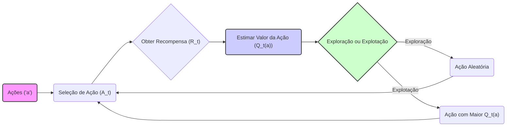
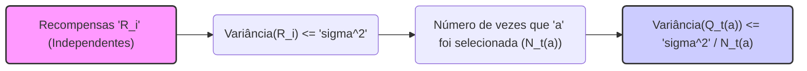
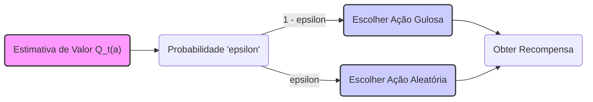
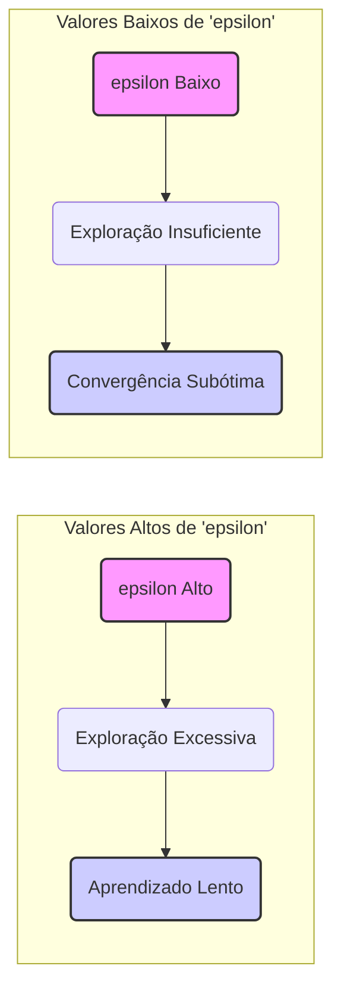
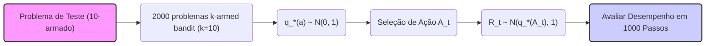

## Explorando o Equilíbrio entre Exploração e Explotação em Problemas de Bandit Multi-armado

### Introdução

O aprendizado por reforço se distingue de outras formas de aprendizado por utilizar informações de treinamento que *avaliam* as ações tomadas, em vez de instruir ações corretas [^1]. Essa característica fundamental introduz a necessidade de **exploração ativa**, ou seja, uma busca explícita por comportamentos eficazes [^1]. Enquanto o feedback puramente avaliativo indica o quão boa foi a ação tomada, sem especificar se foi a melhor possível, o feedback instrutivo aponta a ação correta independentemente da ação realizada [^1]. Este capítulo aborda o aspecto avaliativo do aprendizado por reforço em um cenário simplificado, o problema do **bandit multi-armado**, onde o agente aprende a agir em uma única situação [^1]. O estudo desse problema nos permite entender melhor como o feedback avaliativo difere e pode ser combinado com o feedback instrutivo [^1]. Uma versão específica deste problema, que exploramos, é o **problema do k-armed bandit**, que introduz métodos básicos de aprendizado que serão estendidos em capítulos posteriores para o problema completo de aprendizado por reforço [^1]. Ao final, discutimos o caso onde o problema do bandit se torna associativo, ou seja, quando a melhor ação depende da situação [^1].

### Conceitos Fundamentais

No problema do **k-armed bandit**, o agente é confrontado repetidamente com uma escolha entre *k* opções diferentes, ou ações [^1]. Após cada escolha, o agente recebe uma recompensa numérica, selecionada de uma distribuição de probabilidade estacionária dependente da ação escolhida [^1]. O objetivo é maximizar a recompensa total esperada em um determinado período, como em 1000 passos de tempo [^2]. Analogamente a uma slot machine com *k* alavancas, cada seleção de ação corresponde a puxar uma alavanca, e as recompensas são os pagamentos por atingir o jackpot [^2]. Alternativamente, pode-se imaginar um médico escolhendo entre tratamentos experimentais para uma série de pacientes graves, onde cada ação é a seleção de um tratamento e a recompensa é a sobrevivência ou bem-estar do paciente [^2]. Em nosso problema do k-armed bandit, cada ação possui um valor esperado ou recompensa média, dada que essa ação foi selecionada, que denotamos como $q_*(a)$ para uma ação *a* [^2].

**Definição da ação selecionada e recompensa:** Seja $A_t$ a ação selecionada no instante *t* e $R_t$ a recompensa correspondente. O valor de uma ação *a* é dado por:

$$ q_*(a) = E[R_t | A_t = a] $$ [^2]
> 💡 **Exemplo Numérico:** Suponha que temos um problema de 3-armado (k=3). As recompensas esperadas para cada ação são: $q_*(1) = 2$, $q_*(2) = 5$, e $q_*(3) = 1$. Isso significa que, em média, a ação 1 retorna 2, a ação 2 retorna 5, e a ação 3 retorna 1. Se conhecêssemos esses valores, escolheríamos sempre a ação 2 para maximizar a recompensa.

Se os valores de todas as ações fossem conhecidos, a solução para o problema seria trivial: selecionar sempre a ação com maior valor [^2]. Contudo, assumimos que os valores das ações são desconhecidos, embora possam ser estimados [^2]. Denotamos a estimativa do valor de ação *a* no instante *t* como $Q_t(a)$ e desejamos que $Q_t(a)$ seja próxima de $q_*(a)$ [^2]. A manutenção das estimativas dos valores das ações define **ações gulosas** como aquelas com a maior estimativa de valor. A seleção de uma dessas ações é denominada **explotação**, pois aproveita o conhecimento atual dos valores das ações. A seleção de uma ação não gulosa é chamada de **exploração**, permitindo que se melhore a estimativa do valor da ação [^2]. Embora a explotação maximize a recompensa esperada em um único passo, a exploração pode resultar em uma recompensa total maior a longo prazo [^2]. O equilíbrio entre exploração e explotação é crucial e depende das estimativas, incertezas e número de passos restantes [^2].

**Lema 1: Convergência da Média da Amostra**

A média da amostra das recompensas para uma ação *a*, $Q_t(a)$, converge para o verdadeiro valor $q_*(a)$ quando o número de vezes que *a* é selecionado tende ao infinito.

*Prova:*
A estimativa do valor da ação *a* no instante *t* é dada por
$$Q_t(a) = \frac{\sum_{i=1}^{t-1} R_i \mathbb{1}_{A_i=a}}{\sum_{i=1}^{t-1} \mathbb{1}_{A_i=a}},$$
onde $\mathbb{1}_{A_i=a}$ é 1 se a ação $A_i$ for igual a *a* e 0 caso contrário. Pela lei dos grandes números, quando o número de vezes que a ação *a* é selecionada tende ao infinito, a média das recompensas $Q_t(a)$ converge para o valor esperado $q_*(a)$ . $\blacksquare$

> 💡 **Exemplo Numérico:**  Considere a ação 1 do exemplo anterior, com $q_*(1) = 2$. Suponha que, nos primeiros 5 passos, escolhemos a ação 1 três vezes e recebemos as seguintes recompensas: 1, 3, 2. A estimativa do valor da ação 1 no passo 6 seria:
> $Q_6(1) = \frac{1+3+2}{3} = \frac{6}{3} = 2$.
>  Se continuarmos a selecionar a ação 1, a média amostral $Q_t(1)$ se aproximará cada vez mais de 2, que é o verdadeiro valor $q_*(1)$.

Essa convergência garante que, ao longo do tempo, nossas estimativas se tornarão mais precisas.

**Lema 1.1: Limite Superior da Variação da Média da Amostra**

A variância da média amostral $Q_t(a)$ diminui à medida que o número de amostras de *a* aumenta. Mais precisamente, se as recompensas $R_i$ são independentes e têm variância limitada por $\sigma^2$, então a variância de $Q_t(a)$ é limitada por $\frac{\sigma^2}{N_t(a)}$, onde $N_t(a)$ é o número de vezes que a ação *a* foi selecionada até o instante *t*.

*Prova:*
Seja $N_t(a) = \sum_{i=1}^{t-1} \mathbb{1}_{A_i=a}$. Então, podemos reescrever $Q_t(a)$ como $Q_t(a) = \frac{1}{N_t(a)} \sum_{i=1}^{t-1} R_i \mathbb{1}_{A_i=a}$.  Assumindo que as recompensas são independentes, temos que
$$ Var(Q_t(a)) = Var \left( \frac{1}{N_t(a)} \sum_{i=1}^{t-1} R_i \mathbb{1}_{A_i=a} \right) = \frac{1}{N_t(a)^2} Var\left( \sum_{i=1}^{t-1} R_i \mathbb{1}_{A_i=a} \right). $$
Dado que as recompensas $R_i$ são independentes e com variância limitada por $\sigma^2$, temos
$$  Var\left( \sum_{i=1}^{t-1} R_i \mathbb{1}_{A_i=a} \right) = \sum_{i=1}^{t-1} Var(R_i \mathbb{1}_{A_i=a}) \leq \sum_{i=1}^{t-1} \sigma^2 \mathbb{1}_{A_i=a} = \sigma^2 N_t(a). $$
Portanto,
$$ Var(Q_t(a)) \leq \frac{1}{N_t(a)^2} \sigma^2 N_t(a) = \frac{\sigma^2}{N_t(a)}. $$
Este resultado mostra que a incerteza sobre o valor da ação *a* diminui com o aumento de amostras. $\blacksquare$
> 💡 **Exemplo Numérico:**  Assumindo que a variância das recompensas para a ação 1 seja $\sigma^2 = 1$, e que no exemplo anterior $N_6(1) = 3$, a variância da média amostral da ação 1 no passo 6 é limitada por:
> $Var(Q_6(1)) \leq \frac{1}{3} \approx 0.33$.
> Se, após mais algumas iterações, o número de vezes que a ação 1 foi selecionada for $N_{10}(1) = 10$, a variância de $Q_{10}(1)$ será menor:
> $Var(Q_{10}(1)) \leq \frac{1}{10} = 0.1$.
> Isso ilustra que a incerteza em torno da estimativa $Q_t(a)$ diminui com o aumento do número de amostras.

Este resultado complementa o Lema 1, demonstrando não apenas a convergência da média, mas também a redução da sua variabilidade com o tempo.

**Ações $\epsilon$-Gulosas**
Uma estratégia simples para equilibrar exploração e explotação é selecionar ações gulosas na maior parte do tempo, mas com uma pequena probabilidade $\epsilon$ selecionar uma ação aleatória [^3]. Este método é chamado de $\epsilon$-guloso e assegura que todas as ações sejam amostradas um número infinito de vezes no limite, garantindo que $Q_t(a)$ convirja para $q_*(a)$. Contudo, tais garantias são assintóticas e dizem pouco sobre a eficácia prática dos métodos [^3].

> 💡 **Exemplo Numérico:**  Imagine que $\epsilon = 0.1$.  A cada passo, o algoritmo $\epsilon$-guloso decide se vai explorar ou explotar. Com probabilidade 0.9, ele escolhe a ação com maior valor estimado no momento. Com probabilidade 0.1, ele escolhe uma ação aleatória entre as 3 ações disponíveis. Isso garante que, mesmo que uma ação inicialmente pareça ruim, ela ainda terá a chance de ser explorada e seu valor ser reavaliado.

**Teorema 1: Convergência Assintótica do $\epsilon$-Guloso**

Em um problema *k*-armado estacionário, o método $\epsilon$-guloso garante que todas as ações são amostradas infinitamente, e as estimativas de valor $Q_t(a)$ convergem para o verdadeiro valor $q_*(a)$ com probabilidade 1 para todas as ações.

*Prova:*
O método $\epsilon$-guloso garante que cada ação é escolhida com probabilidade pelo menos $\frac{\epsilon}{k}$, onde k é o número de ações. Portanto, se considerarmos um número infinito de passos, cada ação será selecionada um número infinito de vezes. Pelo Lema 1, a média das recompensas $Q_t(a)$ converge para o valor esperado $q_*(a)$ quando o número de vezes que a ação *a* é selecionada tende ao infinito. Assim, com probabilidade 1, $Q_t(a) \to q_*(a)$ para todas as ações *a* quando $t \to \infty$.  $\blacksquare$

Este teorema formaliza a garantia de convergência do método $\epsilon$-guloso, demonstrando que, mesmo com uma pequena probabilidade de exploração, o algoritmo eventualmente aprende os verdadeiros valores das ações.

**Proposição 1: Sensibilidade a $\epsilon$**
A performance do método $\epsilon$-guloso é sensível ao valor de $\epsilon$. Valores altos de $\epsilon$ promovem exploração excessiva e podem levar a um aprendizado mais lento, enquanto valores baixos podem levar a uma exploração insuficiente e à convergência para uma ação subótima.

*Prova:*
Valores elevados de $\epsilon$ levam a mais ações aleatórias, o que significa que o agente passa mais tempo explorando e menos tempo explorando o que já aprendeu. Isso pode levar a uma taxa de aprendizado mais lenta, pois o agente não está se concentrando tanto em ações que já mostraram ter boas recompensas. Por outro lado, valores pequenos de $\epsilon$ fazem com que o agente explore muito pouco e se apegue a ações com estimativas altas no início, mesmo que haja outras ações melhores que ainda não foram descobertas. A escolha de $\epsilon$ deve ser um equilíbrio entre exploração e explotação, e o valor ótimo depende do problema específico. $\blacksquare$

> 💡 **Exemplo Numérico:**  Comparando dois cenários com diferentes valores de $\epsilon$, imagine que temos um problema de 10-armado.  
> - **Cenário 1: $\epsilon = 0.3$** O agente explorará muito, selecionando uma ação aleatória em 30% das vezes. Isso pode atrasar a convergência para a ação ótima no início, mas evita que ele fique preso em uma ação subótima.
> - **Cenário 2: $\epsilon = 0.01$** O agente explorará muito pouco, apenas em 1% das vezes. Isso o levará a explorar uma ação que pareça boa inicialmente, mas pode não ser a melhor a longo prazo.
> A performance do algoritmo $\epsilon$-guloso será sensível a essa escolha.

Esta proposição destaca a importância da escolha do hiperparâmetro $\epsilon$ e a necessidade de ajustes para diferentes problemas.

### O Testbed de 10-armados

Para avaliar a eficácia dos métodos gulosos e $\epsilon$-gulosos, é utilizado um conjunto de problemas de teste, o **10-armed testbed** [^3]. Este conjunto consiste em 2000 problemas k-armed bandit gerados aleatoriamente, com *k* = 10 [^3]. Para cada problema, os valores das ações, $q_*(a)$, são selecionados de uma distribuição normal (gaussiana) com média 0 e variância 1 [^3]. Quando um método de aprendizado seleciona uma ação $A_t$, a recompensa real $R_t$ é selecionada de uma distribuição normal com média $q_*(A_t)$ e variância 1 [^3]. Este procedimento define um "teste", onde o aprendizado do método pode ser medido ao longo de 1000 passos de tempo [^3]. A repetição deste processo por 2000 execuções independentes, cada um com um problema de bandit diferente, permite obter medidas do comportamento médio do algoritmo de aprendizado [^3]. Os resultados mostram que os métodos $\epsilon$-gulosos eventualmente superam os métodos gulosos, pois continuam a explorar e reconhecer a ação ótima [^6]. A escolha do valor $\epsilon$ influencia a taxa de exploração, com valores maiores levando a uma exploração mais rápida e valores menores, a uma exploração mais lenta [^6].

> 💡 **Exemplo Numérico:**  No testbed de 10-armados, vamos simular a escolha de ações com métodos gulosos e $\epsilon$-gulosos. Suponha que rodamos o experimento por 1000 passos e repetimos 2000 vezes (2000 problemas diferentes de bandit). Abaixo um exemplo do que poderíamos observar em termos de recompensas médias por passo de tempo:
>
> | Passo de Tempo | Recompensa Média (Guloso) | Recompensa Média ($\epsilon$-Guloso com $\epsilon=0.1$) |
> |---------------|---------------------------|--------------------------------------------------|
> | 10            | 0.5                       | 0.6                                              |
> | 100           | 0.8                       | 1.0                                              |
> | 500           | 1.0                       | 1.2                                              |
> | 1000          | 1.1                       | 1.3                                              |
>
>  Neste exemplo, observamos que no início o método guloso obtém recompensas parecidas, mas conforme o tempo passa, o método $\epsilon$-guloso com $\epsilon=0.1$ apresenta melhores resultados. Isso acontece porque o método guloso explora as ações que parecem promissoras no início, enquanto o método $\epsilon$-guloso explora aleatoriamente algumas vezes, o que permite que o algoritmo descubra melhores ações ao longo do tempo. Este exemplo ilustra que, apesar do método $\epsilon$-guloso explorar mais e obter recompensas um pouco menores no início, ele performa melhor ao longo do tempo.

### Conclusão

A necessidade de equilibrar exploração e explotação é um desafio distintivo do aprendizado por reforço [^3]. O problema do bandit k-armado, com sua simplicidade, permite analisar claramente essa necessidade [^3]. No contexto da modelagem financeira avançada, o balanceamento adequado entre exploração e explotação pode levar a estratégias de investimento mais eficazes. A escolha de métodos para estimar os valores das ações e para guiar a seleção de ações, são cruciais para um bom desempenho. Os métodos $\epsilon$-gulosos provam ser uma ferramenta valiosa nesse contexto [^6]. A avaliação através do 10-armed testbed demonstra que métodos gulosos podem ficar presos em ações subótimas, enquanto métodos que exploram são capazes de descobrir ações ótimas com maior frequência [^6]. A escolha entre explorar e explotar tem um grande impacto no aprendizado e desempenho final do agente.

### Referências

[^1]: "The most important feature distinguishing reinforcement learning from other types of learning is that it uses training information that evaluates the actions taken rather than instructs by giving correct actions." *(Trecho de Multi-armed Bandits)*
[^2]: "In our k-armed bandit problem, each of the k actions has an expected or mean reward given that that action is selected; let us call this the value of that action." *(Trecho de Multi-armed Bandits)*
[^3]: "In this book we do not worry about balancing exploration and exploitation in a sophisticated way; we worry only about balancing them at all." *(Trecho de Multi-armed Bandits)*
[^6]: "The advantage of ɛ-greedy over greedy methods depends on the task." *(Trecho de Multi-armed Bandits)*
