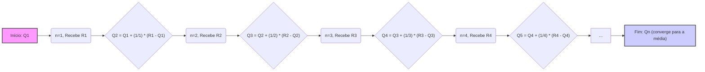
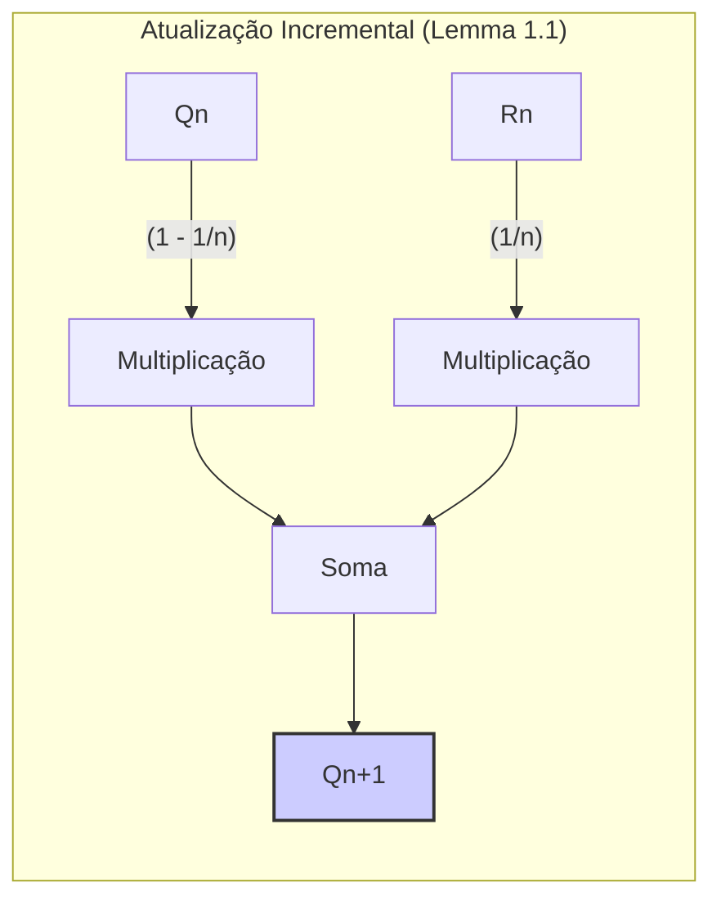
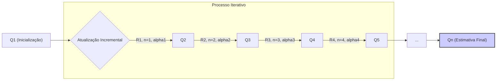

### Implementação Incremental para Cálculo de Médias Amostrais em Multi-armed Bandits

### Introdução

Em problemas de **Multi-armed Bandits**, o objetivo é maximizar a recompensa total esperada ao longo do tempo, escolhendo repetidamente entre diversas opções (braços). Uma das abordagens fundamentais é estimar o valor de cada ação, que corresponde à recompensa média esperada ao selecionar tal ação [2](https://chatgpt.com/c/67829922-359c-8011-96dd-970c04ed772c#user-content-fn-2). O cálculo direto da média de recompensas, embora conceitualmente simples, pode se tornar computacionalmente caro e demandar muita memória à medida que o número de recompensas observadas aumenta. Este capítulo explora a implementação incremental como uma solução eficiente para esse problema, permitindo o cálculo das médias amostrais com custo computacional constante e uso de memória limitado [6](https://chatgpt.com/c/67829922-359c-8011-96dd-970c04ed772c#user-content-fn-6).

### Conceitos Fundamentais

A **média amostral** de um conjunto de recompensas é calculada somando todas as recompensas observadas e dividindo pelo número total de observações. Formalmente, a média amostral $Q_t(a)$ de uma ação $a$ no passo de tempo $t$ pode ser expressa como [3](https://chatgpt.com/c/67829922-359c-8011-96dd-970c04ed772c#user-content-fn-3):
$$
Q_t(a) = \frac{\text{soma das recompensas quando a foi tomada até t}}{\text{número de vezes que a foi tomada até t}} = \frac{\sum_{i=1}^{t-1} R_i \mathbb{1}_{A_i=a}}{\sum_{i=1}^{t-1} \mathbb{1}_{A_i=a}}
$$
onde $R_i$ é a recompensa obtida no passo de tempo $i$, $A_i$ é a ação selecionada no passo de tempo $i$, e $\mathbb{1}_{A_i=a}$ é uma função indicadora que retorna 1 se $A_i = a$ e 0 caso contrário. Essa abordagem direta requer o armazenamento de todas as recompensas e um cálculo da soma a cada passo de tempo.

> 💡 **Exemplo Numérico:** Suponha que uma ação 'a' foi tomada 4 vezes, com as seguintes recompensas: 2, 4, 1, 5. Usando o método tradicional, calcularíamos a média como $Q_4(a) = \frac{2 + 4 + 1 + 5}{4} = \frac{12}{4} = 3$. Para cada nova recompensa, teríamos que adicionar essa nova recompensa à soma total e incrementar o contador.

A **implementação incremental** oferece uma alternativa computacionalmente mais eficiente [6](https://chatgpt.com/c/67829922-359c-8011-96dd-970c04ed772c#user-content-fn-6). Em vez de recalcular a média a cada passo, a implementação incremental atualiza a média anterior com base na nova recompensa observada. Seja $Q_n$ a estimativa do valor de uma ação após ela ter sido selecionada $n-1$ vezes, e $R_n$ a recompensa obtida após a n-ésima seleção da ação. O valor de $Q_{n+1}$, a estimativa após n seleções, é calculado incrementalmente através da seguinte fórmula:

$$
Q_{n+1} = \frac{1}{n} \sum_{i=1}^{n} R_i = \frac{1}{n} \left(R_n + \sum_{i=1}^{n-1} R_i\right) = \frac{1}{n} \left(R_n + (n-1)Q_n\right) = Q_n + \frac{1}{n} [R_n - Q_n]
$$

Esta formulação mostra que a nova estimativa é igual a antiga estimativa mais uma fração da diferença entre a recompensa atual e a estimativa anterior. Essa abordagem reduz significativamente o custo computacional, pois requer apenas um pequeno cálculo com os valores previamente armazenados, sem a necessidade de manter o histórico completo de recompensas. Esta formulação se encaixa no padrão geral [7](https://chatgpt.com/c/67829922-359c-8011-96dd-970c04ed772c#user-content-fn-7):

$$
\text{Nova Estimativa} \leftarrow \text{Antiga Estimativa} + \text{Tamanho do Passo} \ [\text{Alvo} - \text{Antiga Estimativa}]
$$
onde o tamanho do passo (step size) neste caso é $\frac{1}{n}$ e o alvo é a n-ésima recompensa $R_n$. O termo  [Alvo - Antiga Estimativa] representa o erro na estimativa e a atualização da estimativa é dada na direção do "alvo", que pode ser ruidoso.

> 💡 **Exemplo Numérico:** Usando o mesmo exemplo anterior (recompensas 2, 4, 1, 5), vamos calcular as médias incrementalmente. Inicialmente, $Q_1 = 0$ (ou podemos definir com algum valor inicial como discutido mais adiante):
>
> - $n=1, R_1 = 2$:  $Q_2 = Q_1 + \frac{1}{1}[R_1 - Q_1] = 0 + 1[2 - 0] = 2$
> - $n=2, R_2 = 4$:  $Q_3 = Q_2 + \frac{1}{2}[R_2 - Q_2] = 2 + \frac{1}{2}[4 - 2] = 2 + 1 = 3$
> - $n=3, R_3 = 1$:  $Q_4 = Q_3 + \frac{1}{3}[R_3 - Q_3] = 3 + \frac{1}{3}[1 - 3] = 3 - \frac{2}{3} = 2.33$
> - $n=4, R_4 = 5$:  $Q_5 = Q_4 + \frac{1}{4}[R_4 - Q_4] = 2.33 + \frac{1}{4}[5 - 2.33] = 2.33 + 0.67 = 3$
>
> Observe que, após as 4 recompensas, a média incremental $Q_5$ converge para a média calculada diretamente de 3. Cada atualização usa apenas a recompensa atual e a média anterior.

**Lemma 1:** *A implementação incremental para o cálculo de médias amostrais, apresentada como:*
$Q_{n+1} = Q_n + \frac{1}{n} [R_n - Q_n]$,
*requer memória e computação constante a cada passo.*
**Prova:** A fórmula de atualização $Q_{n+1}$ usa apenas a estimativa anterior $Q_n$, a recompensa $R_n$, e o número de vezes $n$ que a ação foi selecionada. Estas três variáveis podem ser armazenadas e computadas com custo constante por passo, sem a necessidade de armazenar o histórico completo de recompensas.  O cálculo da atualização é realizado com um número fixo de operações a cada passo. $\blacksquare$

**Corolário 1:** *O método incremental converge para a média amostral real quando o número de seleções da ação tende ao infinito.*
**Prova:** Quando $n$ tende ao infinito, $\frac{1}{n}$ tende a 0, indicando que a contribuição de cada nova recompensa no ajuste da média torna-se cada vez menor, de forma que $Q_n$ tende à média real. Esse resultado é uma consequência da lei dos grandes números, e pode ser verificado quando o denominador da formula original da média amostral tende ao infinito [3](https://chatgpt.com/c/67829922-359c-8011-96dd-970c04ed772c#user-content-fn-3). $\blacksquare$

**Lema 1.1:** *A atualização incremental pode ser expressa de forma equivalente como uma média ponderada entre a estimativa anterior e a nova recompensa:*

$Q_{n+1} =  \left(1-\frac{1}{n}\right)Q_n + \frac{1}{n}R_n$

**Prova:**  A partir da fórmula de atualização incremental $Q_{n+1} = Q_n + \frac{1}{n} [R_n - Q_n]$, podemos reorganizar os termos:

$Q_{n+1} = Q_n + \frac{1}{n}R_n - \frac{1}{n}Q_n = \left(1-\frac{1}{n}\right)Q_n + \frac{1}{n}R_n$.  Essa expressão representa $Q_{n+1}$ como uma média ponderada, onde o peso da estimativa anterior $Q_n$ é $1-\frac{1}{n}$ e o peso da nova recompensa $R_n$ é $\frac{1}{n}$.  $\blacksquare$

> 💡 **Exemplo Numérico:** Retomando o exemplo das recompensas 2, 4, 1, 5, na terceira iteração, temos $Q_3 = 3$. A próxima atualização, com $R_3=1$, pode ser expressa como:
>
> $Q_4 = (1 - \frac{1}{3})Q_3 + \frac{1}{3}R_3 = \frac{2}{3}(3) + \frac{1}{3}(1) = 2 + \frac{1}{3} = 2.33$. Isso demonstra que $Q_4$ é uma média ponderada de $Q_3$ e $R_3$, onde $Q_3$ tem mais peso ($\frac{2}{3}$) do que a nova recompensa $R_3$ ($\frac{1}{3}$).

**Observação 1:** *Esta forma ponderada da atualização incremental revela a natureza da atualização: a nova estimativa $Q_{n+1}$ é uma combinação linear da estimativa anterior $Q_n$ e da nova recompensa $R_n$, com pesos que dependem do número de vezes que a ação foi selecionada.*

É importante notar que o tamanho do passo $\frac{1}{n}$ varia ao longo do tempo, pois depende do número de vezes que a ação foi tomada [7](https://chatgpt.com/c/67829922-359c-8011-96dd-970c04ed772c#user-content-fn-7). No entanto, a implementação incremental permite que as médias amostrais sejam calculadas de maneira eficiente em termos de memória e custo computacional.

**Teorema 1:** *A implementação incremental pode ser generalizada utilizando um tamanho de passo variável $\alpha_n$, de forma que $Q_{n+1} = Q_n + \alpha_n[R_n - Q_n]$. Se a sequência de tamanhos de passo $\alpha_n$ satisfaz as condições $\sum_{n=1}^\infty \alpha_n = \infty$ e $\sum_{n=1}^\infty \alpha_n^2 < \infty$, então $Q_n$ converge para a média real da recompensa da ação correspondente.*

**Prova:** Este resultado segue do teorema da convergência para algoritmos de aproximação estocástica [8]. A condição $\sum_{n=1}^\infty \alpha_n = \infty$ garante que as estimativas não estagnam no início do processo, permitindo explorar o espaço de busca. A condição $\sum_{n=1}^\infty \alpha_n^2 < \infty$ garante que a variância do processo de atualização diminua à medida que o número de amostras aumenta, levando à convergência. A escolha de $\alpha_n = \frac{1}{n}$ satisfaz estas condições, como pode ser verificado diretamente, e portanto, o método incremental básico converge para a média real da recompensa. $\blacksquare$

> 💡 **Exemplo Numérico:**  Vamos supor que queremos usar um tamanho de passo diferente de $\frac{1}{n}$. Uma possibilidade é $\alpha_n = \frac{1}{10n}$. Vamos simular algumas atualizações com as mesmas recompensas (2, 4, 1, 5) e um valor inicial $Q_1 = 0$.
>
> - $n=1, R_1 = 2$: $Q_2 = 0 + \frac{1}{10}(2 - 0) = 0.2$
> - $n=2, R_2 = 4$: $Q_3 = 0.2 + \frac{1}{20}(4 - 0.2) = 0.2 + 0.19 = 0.39$
> - $n=3, R_3 = 1$: $Q_4 = 0.39 + \frac{1}{30}(1 - 0.39) = 0.39 + 0.02033 = 0.41$
> - $n=4, R_4 = 5$: $Q_5 = 0.41 + \frac{1}{40}(5 - 0.41) = 0.41 + 0.11475 = 0.52$
>
> Note que a média está se aproximando, mas muito mais lentamente em relação a usar $\frac{1}{n}$. Um passo menor implica em atualizações mais lentas. As condições $\sum_{n=1}^\infty \alpha_n = \infty$ e $\sum_{n=1}^\infty \alpha_n^2 < \infty$ garantem que $\alpha_n$ não seja muito pequeno para impedir a convergência, mas decaia rápido o suficiente para diminuir a variância e garantir que a estimativa pare de flutuar.  $\alpha_n = \frac{1}{10n}$ também satisfaz as condições do Teorema 1, embora em uma taxa de convergência diferente.

**Corolário 1.1:** *Um tamanho de passo constante, $\alpha_n = \alpha$ para todo $n$, não satisfaz as condições do Teorema 1 e, portanto, não garante a convergência para a média real. Contudo, tamanhos de passo constantes podem ser desejáveis em ambientes não-estacionários, onde a média real das recompensas muda ao longo do tempo.*

> 💡 **Exemplo Numérico:**  Se usarmos $\alpha = 0.1$ como um tamanho de passo constante e repetirmos o processo com as mesmas recompensas (2, 4, 1, 5) e $Q_1=0$:
>
> - $n=1, R_1 = 2$: $Q_2 = 0 + 0.1(2 - 0) = 0.2$
> - $n=2, R_2 = 4$: $Q_3 = 0.2 + 0.1(4 - 0.2) = 0.2 + 0.38 = 0.58$
> - $n=3, R_3 = 1$: $Q_4 = 0.58 + 0.1(1 - 0.58) = 0.58 + 0.042 = 0.622$
> - $n=4, R_4 = 5$: $Q_5 = 0.622 + 0.1(5 - 0.622) = 0.622 + 0.4378 = 1.0598$
>
>Observe que, com tamanho de passo constante, $Q_n$ não converge para a média real (3), mas continua se movendo conforme as recompensas são observadas. Essa abordagem seria mais adequada em um ambiente não estacionário, onde a média das recompensas pode mudar com o tempo. O tamanho de passo constante permite ao algoritmo se adaptar às mudanças.

**Proposição 1:** *A atualização incremental pode ser inicializada com qualquer valor inicial para $Q_1$, e o valor final da estimativa será independente do valor de inicialização no limite.*

**Prova:** No processo de atualização incremental, o valor de inicialização de $Q_1$ tem um efeito cada vez menor à medida que o número de atualizações aumenta, devido ao termo $\frac{1}{n}$ na atualização. Dado que este termo tende a zero quando $n$ tende a infinito, o valor inicial torna-se insignificante no limite, garantindo a convergência para a média real independente do valor inicial de $Q_1$.  $\blacksquare$

> 💡 **Exemplo Numérico:**  Vamos demonstrar a independência do valor inicial. Usando $\alpha_n = 1/n$ e as recompensas (2,4,1,5). Vamos comparar $Q$ começando com $Q_1 = 0$ e com $Q_1 = 10$:
>
> **Caso 1: Q1 = 0**
> - $n=1, R_1=2: Q_2 = 0 + 1(2-0) = 2$
> - $n=2, R_2=4: Q_3 = 2 + 0.5(4-2) = 3$
> - $n=3, R_3=1: Q_4 = 3 + 0.33(1-3) = 2.33$
> - $n=4, R_4=5: Q_5 = 2.33 + 0.25(5-2.33) = 3$
>
> **Caso 2: Q1 = 10**
> - $n=1, R_1=2: Q_2 = 10 + 1(2-10) = 2$
> - $n=2, R_2=4: Q_3 = 2 + 0.5(4-2) = 3$
> - $n=3, R_3=1: Q_4 = 3 + 0.33(1-3) = 2.33$
> - $n=4, R_4=5: Q_5 = 2.33 + 0.25(5-2.33) = 3$
>
> Em ambos os casos, as médias convergem para o mesmo valor (3), embora tenham pontos de partida diferentes. Isso confirma que, com o tempo, o valor inicial perde sua influência.

### Conclusão

A implementação incremental para o cálculo de médias amostrais é uma técnica essencial em problemas de Multi-armed Bandits. Sua capacidade de computar médias com custo computacional e de memória constantes a cada passo a torna uma solução prática e eficaz para problemas onde a complexidade computacional e de memória são restritivas. Essa abordagem permite que o agente foque no processo de aprendizagem e otimização das ações, em vez de ser sobrecarregado com os cálculos das médias. Além disso, o método converge para o valor real da ação conforme o número de iterações aumenta, garantindo a precisão da estimativa.

### Referências
[^2]: "In our k-armed bandit problem, each of the k actions has an expected or mean reward given that that action is selected; let us call this the value of that action." *(Trecho de Multi-armed Bandits)*
[^3]: "One natural way to estimate this is by averaging the rewards actually received:
$Q_t(a) = \frac{\text{sum of rewards when a taken prior to t}}{\text{number of times a taken prior to t}} = \frac{\sum_{i=1}^{t-1} R_i\mathbb{1}_{A_i=a}}{\sum_{i=1}^{t-1} \mathbb{1}_{A_i=a}}$" *(Trecho de Multi-armed Bandits)*
[^6]: "The action-value methods we have discussed so far all estimate action values as sample averages of observed rewards. We now turn to the question of how these averages can be computed in a computationally efficient manner, in particular, with constant memory and constant per-time-step computation." *(Trecho de Multi-armed Bandits)*
[^7]: "This update rule (2.3) is of a form that occurs frequently throughout this book. The general form is
NewEstimate $\leftarrow$ OldEstimate + StepSize [Target - OldEstimate]." *(Trecho de Multi-armed Bandits)*
[^8]: "Stochastic Approximation and Recursive Algorithms and Applications" (livro)
