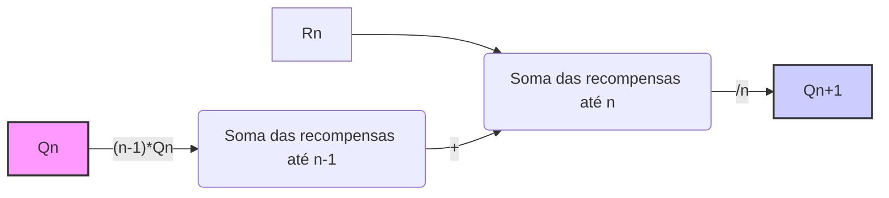
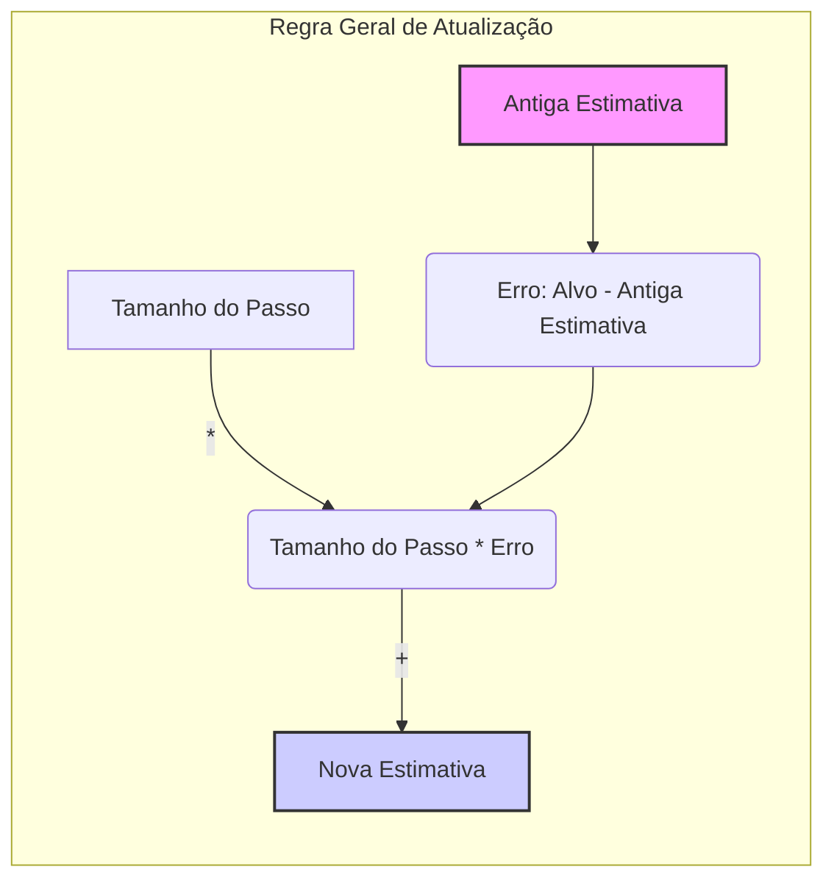
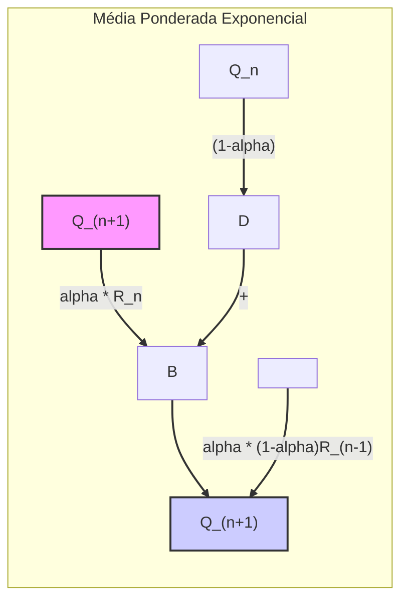

## Incremental Implementation e a Regra de Atualização Geral

### Introdução

Este capítulo aborda a implementação eficiente de métodos de valor de ação, focando em como calcular médias de recompensas observadas de maneira computacionalmente eficiente, utilizando memória constante e computação por etapa de tempo [^1]. A otimização do cálculo dessas médias é crucial para a aplicação prática de métodos de aprendizado por reforço em problemas mais complexos [^1]. Métodos *action-value* estimam o valor de ações baseados em recompensas passadas, e uma maneira natural de fazer isso é calculando a média das recompensas recebidas [^3]. No entanto, manter um registro de todas as recompensas e recalcular a média a cada nova recompensa pode ser ineficiente computacionalmente, especialmente em cenários com um grande número de recompensas observadas [^7]. Assim, é necessário um método que seja capaz de atualizar essas médias de forma incremental, consumindo uma quantidade constante de recursos computacionais.

### Conceitos Fundamentais

A abordagem para realizar a estimativa de forma incremental envolve a derivação de fórmulas para atualização das médias com computação pequena e constante, processando cada nova recompensa [^7]. Para uma ação específica, seja $R_i$ a recompensa recebida após a $i$-ésima seleção desta ação, e $Q_n$ a estimativa do valor da ação após ela ter sido selecionada $n-1$ vezes. Podemos expressar $Q_n$ como:

$$ Q_n = \frac{R_1 + R_2 + \ldots + R_{n-1}}{n-1} $$

A implementação direta dessa fórmula demandaria manter um registro de todas as recompensas passadas e recalcular a soma a cada nova recompensa, o que seria computacionalmente caro. No entanto, podemos obter uma atualização incremental. Dado $Q_n$ e a $n$-ésima recompensa $R_n$, a nova média de todas as $n$ recompensas, $Q_{n+1}$, pode ser calculada como [^7]:

$$ Q_{n+1} = \frac{1}{n} \sum_{i=1}^{n} R_i = \frac{1}{n} (R_n + \sum_{i=1}^{n-1} R_i) = \frac{1}{n} (R_n + (n-1)Q_n) $$

$$ Q_{n+1} = \frac{1}{n} (R_n + nQ_n - Q_n) = Q_n + \frac{1}{n} (R_n - Q_n) $$

Esta forma incremental de atualizar a média requer que a memória seja alocada somente para $Q_n$ e $n$, e apenas a pequena computação acima para cada nova recompensa [^7].

> 💡 **Exemplo Numérico:**
> Vamos supor que um agente execute uma ação e receba as seguintes recompensas sequencialmente: $R_1 = 2$, $R_2 = 4$, $R_3 = 1$, $R_4 = 3$. Inicialmente, $Q_1$ é considerado 0 (ou qualquer valor inicial), e $n$ é o número de vezes que a ação foi executada até agora.
>
> -   **$n = 1$**: $Q_1 = 0$ (valor inicial).
> -   **$n = 2$**: $Q_2 = Q_1 + \frac{1}{1}(R_1 - Q_1) = 0 + \frac{1}{1}(2 - 0) = 2$.  A média simples seria $\frac{2}{1} = 2$.
> -   **$n = 3$**: $Q_3 = Q_2 + \frac{1}{2}(R_2 - Q_2) = 2 + \frac{1}{2}(4 - 2) = 2 + 1 = 3$. A média simples seria $\frac{2 + 4}{2} = 3$.
> -   **$n = 4$**: $Q_4 = Q_3 + \frac{1}{3}(R_3 - Q_3) = 3 + \frac{1}{3}(1 - 3) = 3 - \frac{2}{3} = \frac{7}{3} \approx 2.33$.  A média simples seria $\frac{2 + 4 + 1}{3} = \frac{7}{3} \approx 2.33$.
> -   **$n = 5$**: $Q_5 = Q_4 + \frac{1}{4}(R_4 - Q_4) = \frac{7}{3} + \frac{1}{4}(3 - \frac{7}{3}) = \frac{7}{3} + \frac{1}{4}(\frac{2}{3}) = \frac{7}{3} + \frac{1}{6} = \frac{15}{6} = 2.5$. A média simples seria $\frac{2 + 4 + 1 + 3}{4} = \frac{10}{4} = 2.5$.
>
> A cada passo, a estimativa $Q_n$ se aproxima da média real das recompensas. Esta atualização incremental evita o armazenamento de todas as recompensas passadas e recalcular a média do zero toda vez que uma nova recompensa é observada.

**Lemma 1:** A atualização incremental da média, dada por:
$$ Q_{n+1} = Q_n + \frac{1}{n}(R_n - Q_n) $$
é equivalente ao cálculo da média por:
$$ Q_{n+1} = \frac{1}{n}\sum_{i=1}^{n}R_i $$

**Prova:** Podemos provar isso por indução. Para $n = 1$, temos $Q_1 = 0$. Quando $n=2$, $Q_2 = Q_1 + \frac{1}{1}(R_1 - Q_1) = R_1$. Assumindo que a equação seja válida para $n$, i.e., $Q_n = \frac{1}{n-1}\sum_{i=1}^{n-1}R_i$. Então, para $n+1$:

$$ Q_{n+1} = Q_n + \frac{1}{n}(R_n - Q_n) = \frac{n-1}{n-1}Q_n + \frac{1}{n}(R_n - Q_n) = \frac{nQ_n - Q_n + R_n - Q_n}{n} $$

Substituindo $Q_n$, temos:

$$ Q_{n+1} = \frac{n\frac{1}{n-1}\sum_{i=1}^{n-1}R_i - \frac{1}{n-1}\sum_{i=1}^{n-1}R_i+ R_n - \frac{1}{n-1}\sum_{i=1}^{n-1}R_i}{n} = \frac{\frac{n-1}{n-1}\sum_{i=1}^{n-1}R_i + R_n}{n} $$

$$ Q_{n+1} = \frac{\sum_{i=1}^{n-1}R_i+ R_n}{n} = \frac{1}{n}\sum_{i=1}^{n}R_i  $$

$\blacksquare$

**Lema 1.1:**  Se a sequência de recompensas $R_i$ é limitada por um valor $M$, isto é, $|R_i| \leq M$ para todo $i$, então a sequência de estimativas $Q_n$ também é limitada.

**Prova:** A partir da fórmula incremental, podemos ver que $Q_{n+1}$ é uma média ponderada de $Q_n$ e $R_n$. Se assumirmos que a primeira estimativa $Q_1$ é inicializada como 0, ou algum valor limitado, e que todas as recompensas $R_i$ são limitadas por $M$, então $Q_2 = R_1$. Subsequentemente, $Q_3$ será uma média de $Q_2$ e $R_2$, que também será limitada por $M$. Podemos continuar argumentando indutivamente que a sequência de estimativas $Q_n$ também será limitada. Formalmente, se $|Q_n| \leq M$, então
$$|Q_{n+1}| = \left|Q_n + \frac{1}{n}(R_n - Q_n)\right| \leq |Q_n| + \frac{1}{n}|R_n - Q_n| \leq M + \frac{1}{n}(|R_n| + |Q_n|) \leq M + \frac{1}{n}(M + M) = M + \frac{2M}{n} $$
Como $\frac{2M}{n}$ decresce com o aumento de $n$, para $n\geq2$,  $|Q_{n+1}| \leq 2M$ e a sequência $Q_n$ é limitada. $\blacksquare$

Essa atualização incremental é um caso específico de uma regra de atualização geral que se manifesta em diversos algoritmos de aprendizado por reforço [^7]:

**Nova Estimativa ← Antiga Estimativa + Tamanho do Passo [Alvo - Antiga Estimativa]**

Nesse contexto, o termo "Tamanho do Passo" representa a fração do "erro na estimativa" que é utilizada para mover a "antiga estimativa" em direção ao "alvo". A expressão `[Alvo - Antiga Estimativa]` representa o erro na estimativa [^7]. O "alvo" indica a direção desejável de movimento. No exemplo acima, o alvo é a n-ésima recompensa $R_n$, que, embora ruidosa, aponta para a média verdadeira. O "Tamanho do Passo" é dado por $1/n$, que diminui à medida que mais recompensas são observadas. Essa regra de atualização garante que as estimativas sejam ajustadas gradualmente, melhorando-se à medida que mais dados são coletados.

**Corolário 1:** A atualização incremental usando a regra geral com um step-size $\frac{1}{n}$ e tendo $R_n$ como target converge para a média verdadeira.

**Prova:** Vimos na prova do Lemma 1 que a atualização incremental usando um step-size de $\frac{1}{n}$ e $R_n$ como target converge para a média das recompensas observadas. De acordo com a lei dos grandes números, a média amostral converge para a média verdadeira à medida que o número de amostras tende ao infinito. Portanto, a regra geral aplicada dessa forma converge para a média verdadeira. $\blacksquare$

**Teorema 1:** A regra geral de atualização, quando utilizada com um tamanho de passo constante $\alpha$, pode ser usada para rastrear a média de uma distribuição não estacionária.

**Prova:** Considere a regra geral de atualização: $Q_{n+1} = Q_n + \alpha(R_n - Q_n)$, onde $\alpha$ é um tamanho de passo constante. Para valores de $\alpha$ entre 0 e 1, a estimativa $Q_{n+1}$ será uma média ponderada entre a estimativa anterior $Q_n$ e a nova recompensa $R_n$. Ao contrário do caso com tamanho de passo $1/n$, onde o peso dado a recompensas antigas diminui com o tempo, o uso de um tamanho de passo constante garante que as estimativas antigas não são ignoradas rapidamente. Isso permite que o valor estimado $Q_n$ acompanhe as mudanças nas recompensas médias devido a uma distribuição não estacionária. De fato, ao reescrever a fórmula como $Q_{n+1} = (1-\alpha)Q_n + \alpha R_n$, podemos ver que a nova estimativa é uma média ponderada entre a estimativa anterior e a recompensa atual, com os pesos dados por $1-\alpha$ e $\alpha$ respectivamente. Esse tipo de atualização é útil em ambientes não estacionários nos quais a distribuição de recompensas pode mudar ao longo do tempo. $\blacksquare$

> 💡 **Exemplo Numérico:**
>
> Vamos usar um tamanho de passo constante $\alpha = 0.1$. Suponha que as recompensas recebidas sejam geradas por um processo não estacionário. Inicialmente, a média de recompensa é próxima de 2, mas de repente muda para 8. Consideraremos a sequência de recompensas como $R_1 = 2, R_2 = 4, R_3 = 1, R_4 = 8, R_5 = 9, R_6 = 7$. Inicializamos $Q_1 = 0$.
>
> - **$n = 1$**: $Q_1 = 0$
> - **$n = 2$**: $Q_2 = Q_1 + \alpha(R_1 - Q_1) = 0 + 0.1(2 - 0) = 0.2$.
> - **$n = 3$**: $Q_3 = Q_2 + \alpha(R_2 - Q_2) = 0.2 + 0.1(4 - 0.2) = 0.2 + 0.1(3.8) = 0.58$.
> - **$n = 4$**: $Q_4 = Q_3 + \alpha(R_3 - Q_3) = 0.58 + 0.1(1 - 0.58) = 0.58 + 0.1(0.42) = 0.622$.
> - **$n = 5$**: $Q_5 = Q_4 + \alpha(R_4 - Q_4) = 0.622 + 0.1(8 - 0.622) = 0.622 + 0.1(7.378) = 1.3598$.
> - **$n = 6$**: $Q_6 = Q_5 + \alpha(R_5 - Q_5) = 1.3598 + 0.1(9 - 1.3598) = 1.3598 + 0.1(7.6402) = 2.12382$.
> - **$n = 7$**: $Q_7 = Q_6 + \alpha(R_6 - Q_6) = 2.12382 + 0.1(7 - 2.12382) = 2.12382 + 0.1(4.87618) = 2.611438$.
>
>
> Observe que, após a mudança na distribuição das recompensas (a partir de R4), o valor estimado $Q_n$ aumenta rapidamente para se ajustar à nova média. Se tivéssemos utilizado o tamanho de passo $\frac{1}{n}$, a mudança seria muito mais lenta, pois recompensas antigas teriam um peso maior. Isso demonstra como o tamanho de passo constante permite acompanhar distribuições não estacionárias. Se  $\alpha$ fosse menor, por exemplo, 0.01, a mudança seria mais gradual, e se fosse maior, como 0.5, a resposta à mudança seria mais abrupta.

**Observação 1:** Ao utilizar a regra geral de atualização com um tamanho de passo constante $\alpha$, a estimativa $Q_n$ não converge para a média verdadeira das recompensas observadas ao longo de toda a história, mas sim acompanha as últimas recompensas com mais intensidade, tornando o método adaptável a variações no ambiente.

**Proposição 1:** Para um tamanho de passo constante $\alpha$, a atualização incremental pode ser expressa como uma média ponderada exponencial das recompensas passadas, onde recompensas mais recentes têm maior peso.

**Prova:** Podemos reescrever a atualização incremental como:
$Q_{n+1} = Q_n + \alpha(R_n - Q_n) = (1-\alpha)Q_n + \alpha R_n$
Expandindo recursivamente, temos:
$Q_{n+1} = \alpha R_n + (1-\alpha) (\alpha R_{n-1} + (1-\alpha)Q_{n-1}) =  \alpha R_n + \alpha(1-\alpha) R_{n-1} + (1-\alpha)^2 Q_{n-1}$
Continuando a expansão, chegamos em:
$Q_{n+1} = \alpha R_n + \alpha(1-\alpha)R_{n-1} + \alpha(1-\alpha)^2 R_{n-2} + \ldots + (1-\alpha)^n Q_1$
Esta é uma média ponderada das recompensas, onde o peso de cada recompensa $R_i$ é $\alpha(1-\alpha)^{n-i}$ e o peso da estimativa inicial $Q_1$ é $(1-\alpha)^n$. Como $0 < \alpha < 1$, o peso das recompensas mais recentes é maior, caracterizando uma média ponderada exponencial. $\blacksquare$

> 💡 **Exemplo Numérico:**
>
> Para visualizar a média ponderada exponencial, consideremos novamente $\alpha = 0.1$ e a sequência de recompensas  $R_1=2, R_2=4, R_3=1, R_4=8$.  Podemos calcular o peso de cada recompensa na estimativa $Q_5$, por exemplo, quando usamos um tamanho de passo constante. Para simplificar a demonstração, vamos considerar que $Q_1 = 0$.
>
>  - $Q_2 = 0.1 \cdot R_1 + (1-0.1) \cdot 0 = 0.1 \cdot 2 = 0.2$
>  - $Q_3 = 0.1 \cdot R_2 + 0.9 \cdot Q_2 = 0.1 \cdot 4 + 0.9 \cdot 0.2 = 0.4 + 0.18 = 0.58$
>  - $Q_4 = 0.1 \cdot R_3 + 0.9 \cdot Q_3 = 0.1 \cdot 1 + 0.9 \cdot 0.58 = 0.1 + 0.522 = 0.622$
>  - $Q_5 = 0.1 \cdot R_4 + 0.9 \cdot Q_4 = 0.1 \cdot 8 + 0.9 \cdot 0.622 = 0.8 + 0.5598 = 1.3598$
>
> Agora, expandindo $Q_5$ em termos de recompensas:
>
> $Q_5 = \alpha R_4 + \alpha(1-\alpha)R_3 + \alpha(1-\alpha)^2 R_2 + \alpha(1-\alpha)^3 R_1 + (1-\alpha)^4 Q_1$
>
> $Q_5 = 0.1 R_4 + 0.1(0.9)R_3 + 0.1(0.9)^2 R_2 + 0.1(0.9)^3 R_1 + (0.9)^4 (0)$
>
> $Q_5 = 0.1(8) + 0.09(1) + 0.081(4) + 0.0729(2) = 0.8 + 0.09 + 0.324 + 0.1458= 1.3598$
>
> Os pesos para cada recompensa são:
>
> -   $R_4$: $0.1$ (maior peso)
> -   $R_3$: $0.09$
> -   $R_2$: $0.081$
> -   $R_1$: $0.0729$
>
> A recompensa mais recente ($R_4$) tem o maior peso, e as recompensas anteriores têm pesos que decrescem exponencialmente. Isso demonstra a natureza da média ponderada exponencial.

### Conclusão

A implementação incremental da estimativa de valores de ação, juntamente com a regra geral de atualização, fornece uma base sólida para métodos eficientes de aprendizado por reforço. Ao evitar o armazenamento de todas as recompensas passadas e ao processar as recompensas uma a uma, esses métodos são escaláveis e computacionalmente viáveis para aplicações do mundo real. A regra de atualização geral, expressa como Nova\_Estimativa ← Antiga\_Estimativa + Tamanho\_Passo [Alvo - Antiga\_Estimativa], é um padrão comum em muitos algoritmos de aprendizado, oferecendo uma forma intuitiva e eficiente de ajustar os parâmetros do modelo com base em feedback do ambiente. A convergência demonstrada por essas abordagens estabelece a sua eficácia e confiabilidade.  A adaptabilidade da regra geral utilizando diferentes tamanhos de passo, como um tamanho de passo constante, também permite que essa regra seja usada em uma variedade de contextos, incluindo ambientes não estacionários.

### Referências

[^1]: "The most important feature distinguishing reinforcement learning from other types of learning is that it uses training information that evaluates the actions taken rather than instructs by giving correct actions." *(/content/reinforcement_learning_notes/01. Multi-armed Bandits)*
[^3]: "We begin by looking more closely at methods for estimating the values of actions and for using the estimates to make action selection decisions, which we collectively call action-value methods." *(/content/reinforcement_learning_notes/01. Multi-armed Bandits)*
[^7]: "As you might suspect, this is not really necessary. It is easy to devise incremental formulas for updating averages with small, constant computation required to process each new reward." *(/content/reinforcement_learning_notes/01. Multi-armed Bandits)*
[^8]: "This update rule (2.3) is of a form that occurs frequently throughout this book. The general form is NewEstimate ← OldEstimate + StepSize [Target OldEstimate]." *(/content/reinforcement_learning_notes/01. Multi-armed Bandits)*
