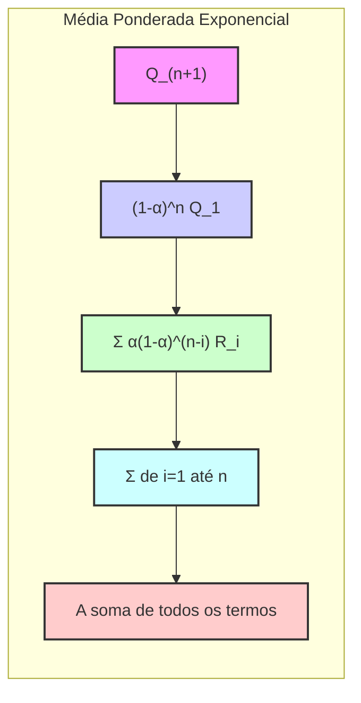

## Implementação Incremental com Passo de Tamanho Constante

### Introdução
Neste capítulo, o foco principal recai sobre os métodos de *action-value*, que são cruciais para a tomada de decisões em problemas de aprendizado por reforço [1](https://chatgpt.com/c/67829922-359c-8011-96dd-970c04ed772c#user-content-fn-1). O aprendizado por reforço se distingue por utilizar informações de treinamento que avaliam as ações tomadas, em vez de simplesmente instruir sobre quais ações corretas deveriam ser realizadas. Um dos aspectos mais importantes é a necessidade de balancear a **exploração** e a **explotação** para maximizar a recompensa total esperada. Dentro desse contexto, o problema *k-armed bandit* fornece um cenário simplificado para entender o *feedback* avaliativo. O objetivo principal é maximizar a recompensa total esperada ao longo do tempo [1](https://chatgpt.com/c/67829922-359c-8011-96dd-970c04ed772c#user-content-fn-1). Esta seção aprofunda a implementação incremental de métodos *action-value*, com ênfase no uso de um passo de tamanho constante para lidar com cenários não estacionários [2](https://chatgpt.com/c/67829922-359c-8011-96dd-970c04ed772c#user-content-fn-2).

### Conceitos Fundamentais

Os métodos de *action-value* estimam o valor de cada ação com base nas recompensas recebidas. Uma forma natural de estimar o valor de uma ação é calcular a média das recompensas recebidas quando essa ação é selecionada. Esta abordagem é conhecida como método *sample-average* e pode ser expressa como [3](https://chatgpt.com/c/67829922-359c-8011-96dd-970c04ed772c#user-content-fn-3):

$$
Q_t(a) = \frac{\text{soma das recompensas quando a foi escolhida antes de t}}{\text{número de vezes que a foi escolhida antes de t}} = \frac{\sum_{i=1}^{t-1} R_i \mathbb{1}_{A_i=a}}{\sum_{i=1}^{t-1} \mathbb{1}_{A_i=a}}
$$

onde $\mathbb{1}_{\text{predicado}}$ é uma variável aleatória que vale 1 se o predicado é verdadeiro e 0 caso contrário. Quando o denominador é zero, define-se $Q_t(a)$ com um valor padrão como 0. À medida que o denominador tende ao infinito, $Q_t(a)$ converge para o valor verdadeiro $q_*(a)$. No entanto, essa abordagem simples pode se tornar computacionalmente pesada, pois exige o armazenamento de todas as recompensas passadas para o cálculo da média. Para resolver esse problema, é essencial utilizar métodos incrementais. O método incremental, quando utilizado com médias amostrais, calcula uma nova média utilizando a média anterior e a nova recompensa, conforme a formulação abaixo [7](https://chatgpt.com/c/67829922-359c-8011-96dd-970c04ed772c#user-content-fn-7):

```mermaid
flowchart LR
    A["Q_n"] -->| "Recompensa R_n" | B("Q_n + (1/n)[R_n - Q_n]")
    B --> C["Q_(n+1)"]
    style A fill:#f9f,stroke:#333,stroke-width:2px
    style B fill:#ccf,stroke:#333,stroke-width:2px
    style C fill:#cfc,stroke:#333,stroke-width:2px
```

$$
Q_{n+1} = \frac{1}{n}\sum_{i=1}^n R_i = \frac{1}{n} \left(R_n + \sum_{i=1}^{n-1}R_i \right) = \frac{1}{n}(R_n + (n-1)Q_n) = Q_n + \frac{1}{n}[R_n - Q_n]
$$

Essa formulação tem a forma geral de:

$$
\text{NovoEstimativa} \leftarrow \text{VelhaEstimativa} + \text{Passo} [\text{Alvo} - \text{VelhaEstimativa}]
$$

onde o termo $[\text{Alvo} - \text{VelhaEstimativa}]$ representa um erro na estimativa e o termo *Passo* controla a influência do novo valor.

> 💡 **Exemplo Numérico (Sample-Average):** Suponha que uma ação `a` foi selecionada três vezes, recebendo recompensas de 1, 3 e 2 respectivamente. Inicialmente, $Q_1(a)$ é 0.
>
> - Para $n=2$, $Q_2(a) = Q_1(a) + \frac{1}{1}[R_1 - Q_1(a)] = 0 + 1 = 1$.
> - Para $n=3$, $Q_3(a) = Q_2(a) + \frac{1}{2}[R_2 - Q_2(a)] = 1 + \frac{1}{2}[3 - 1] = 1 + 1 = 2$.
> - Para $n=4$, $Q_4(a) = Q_3(a) + \frac{1}{3}[R_3 - Q_3(a)] = 2 + \frac{1}{3}[2 - 2] = 2 + 0 = 2$.
>   
>  O valor $Q_4(a) = 2$ representa a média das recompensas obtidas até o momento. Este exemplo demonstra como o método incremental atualiza a estimativa da ação-valor utilizando a média amostral.

No entanto, em problemas *nonstationary*, onde as probabilidades de recompensa mudam ao longo do tempo, é desejável dar mais peso às recompensas recentes. Para fazer isso, podemos usar uma constante $\alpha \in (0,1]$ como passo (step-size), que leva a uma atualização de $Q_n$ na seguinte forma [8](https://chatgpt.com/c/67829922-359c-8011-96dd-970c04ed772c#user-content-fn-8):

```mermaid
flowchart LR
    A["Q_n"] -->| "Recompensa R_n, Passo α" | B("Q_n + α[R_n - Q_n]")
    B --> C["Q_(n+1)"]
    style A fill:#f9f,stroke:#333,stroke-width:2px
    style B fill:#ccf,stroke:#333,stroke-width:2px
    style C fill:#cfc,stroke:#333,stroke-width:2px
```

$$
Q_{n+1} = Q_n + \alpha [R_n - Q_n]
$$

A prova dessa formulação pode ser demonstrada expandindo a equação acima [8](https://chatgpt.com/c/67829922-359c-8011-96dd-970c04ed772c#user-content-fn-8):

$$
\begin{aligned}
Q_{n+1} &= Q_n + \alpha [R_n - Q_n] \\
&= \alpha R_n + (1-\alpha)Q_n \\
&= \alpha R_n + (1-\alpha)[\alpha R_{n-1} + (1-\alpha)Q_{n-1}] \\
&= \alpha R_n + (1-\alpha)\alpha R_{n-1} + (1-\alpha)^2Q_{n-1} \\
&= \alpha R_n + (1-\alpha)\alpha R_{n-1} + (1-\alpha)^2\alpha R_{n-2} + \ldots + (1-\alpha)^{n-1}\alpha R_{1} + (1-\alpha)^nQ_1 \\
&= (1-\alpha)^nQ_1 + \sum_{i=1}^{n} \alpha (1-\alpha)^{n-i}R_i
\end{aligned}
$$

Esta equação mostra que $Q_{n+1}$ é uma média ponderada de recompensas passadas, onde o peso dado a uma recompensa $R_i$ decai exponencialmente com o tempo. Este tipo de média é conhecida como *exponential recency-weighted average*. Em contraste, o método *sample-average* atribui pesos iguais para todos os valores de recompensas passados [8](https://chatgpt.com/c/67829922-359c-8011-96dd-970c04ed772c#user-content-fn-8).

> 💡 **Exemplo Numérico (Passo Constante):**  Considerando a mesma sequência de recompensas (1, 3, 2) para a ação `a`, vamos usar um $\alpha = 0.1$ e assumir que $Q_1(a) = 0$:
>
> - Para $n=1$, $Q_2(a) = Q_1(a) + \alpha [R_1 - Q_1(a)] = 0 + 0.1 * (1 - 0) = 0.1$.
> - Para $n=2$, $Q_3(a) = Q_2(a) + \alpha [R_2 - Q_2(a)] = 0.1 + 0.1 * (3 - 0.1) = 0.1 + 0.29 = 0.39$.
> - Para $n=3$, $Q_4(a) = Q_3(a) + \alpha [R_3 - Q_3(a)] = 0.39 + 0.1 * (2 - 0.39) = 0.39 + 0.161 = 0.551$.
>
> O valor $Q_4(a) = 0.551$ demonstra que a estimativa atual tem mais influência das recompensas mais recentes. Comparativamente, o método *sample-average* resultou em $Q_4(a)=2$, que atribui peso igual a todas as recompensas. Ao usar um $\alpha$ pequeno, como 0.1, a nova estimativa é atualizada lentamente, dando mais peso as recompensas passadas. Se tivessemos usado $\alpha = 0.9$, teriamos $Q_2 = 0.9$, $Q_3 = 0.9 + 0.9 * (3-0.9) = 2.79$, $Q_4 = 2.79 + 0.9 * (2 - 2.79) = 2.08$. Neste caso, com $\alpha$ proximo de 1, o valor $Q_4$ rapidamente se aproxima da última recompensa, dando menos importância as recompensas passadas.

**Lemma 1**: *A equação (2.5)* $Q_{n+1} = Q_n + \alpha [R_n - Q_n]$ *resulta em uma média ponderada exponencial das recompensas passadas, onde o peso de uma recompensa $R_i$ decresce exponencialmente com o tempo.*

*Prova*:
Conforme derivado acima, expandindo a equação $Q_{n+1}$ de forma recursiva, é possível demonstrar que $Q_{n+1}$ é dada pela equação:



$$
Q_{n+1} = (1-\alpha)^nQ_1 + \sum_{i=1}^{n} \alpha (1-\alpha)^{n-i}R_i
$$

Nesta formulação, o peso para cada recompensa $R_i$ é $\alpha(1-\alpha)^{n-i}$.  Como $\alpha \in (0,1]$, temos que $(1-\alpha) \in [0,1)$. Quando $i$ diminui (ou seja, as recompensas ficam mais distantes no passado), o peso  $(1-\alpha)^{n-i}$ diminui exponencialmente. O termo $(1-\alpha)^n$ representa o peso da estimativa inicial $Q_1$.
$\blacksquare$

**Corolário 1:** *Quando $\alpha$ se aproxima de 1, a média ponderada exponencial tende a dar mais peso às recompensas mais recentes e menos peso às recompensas mais antigas. Por outro lado, quando $\alpha$ se aproxima de 0, as recompensas passadas recebem mais peso e a média se torna mais estável.*

*Prova*:
Conforme a equação $Q_{n+1} = (1-\alpha)^nQ_1 + \sum_{i=1}^{n} \alpha (1-\alpha)^{n-i}R_i$, ao aproximarmos $\alpha$ de 1, o termo $(1-\alpha)^{n-i}$ se aproxima de zero para todos os valores de $i$ exceto $i=n$.  Portanto, o peso para $R_n$ se aproxima de 1 e para os demais valores se aproxima de zero. Ao aproximarmos $\alpha$ de zero, o termo $(1-\alpha)^n$ se aproxima de 1, o peso da estimativa inicial torna-se relevante e todos os demais pesos $(1-\alpha)^{n-i}$ tendem a se igualar, diminuindo exponencialmente a diferença entre as recompensas passadas.
$\blacksquare$

**Lema 1.1:** *A soma dos pesos na média ponderada exponencial é igual a 1.*

*Prova:*
A partir da equação $Q_{n+1} = (1-\alpha)^nQ_1 + \sum_{i=1}^{n} \alpha (1-\alpha)^{n-i}R_i$, os pesos são dados por $(1-\alpha)^n$ para $Q_1$ e $\alpha(1-\alpha)^{n-i}$ para cada recompensa $R_i$. Para provar que a soma dos pesos é igual a 1, precisamos mostrar que:
$$(1-\alpha)^n + \sum_{i=1}^{n} \alpha (1-\alpha)^{n-i} = 1$$
Podemos reescrever a somatória como:
$$\sum_{i=1}^{n} \alpha (1-\alpha)^{n-i} = \alpha \sum_{i=1}^{n} (1-\alpha)^{n-i} = \alpha \left[(1-\alpha)^{n-1} + (1-\alpha)^{n-2} + \ldots + (1-\alpha)^0\right]$$
Essa é uma soma geométrica com $n$ termos, razão $(1-\alpha)$, e primeiro termo $(1-\alpha)^{n-1}$. Utilizando a fórmula da soma da série geométrica, temos:
$$ \sum_{i=1}^{n} (1-\alpha)^{n-i} = \frac{(1-\alpha)^{n-1}(1 - (1-\alpha)^n)}{1 - (1-\alpha)} = \frac{(1-\alpha)^{n-1}(1 - (1-\alpha)^n)}{\alpha}$$
Substituindo na equação original:
$$(1-\alpha)^n + \alpha \frac{(1-\alpha)^{n-1}(1 - (1-\alpha)^n)}{\alpha} = (1-\alpha)^n + (1-\alpha)^{n-1} - (1-\alpha)^{2n-1}$$
Fatorando $(1-\alpha)^{n-1}$
$$(1-\alpha)^{n-1}[(1-\alpha) + 1 - (1-\alpha)^n] $$
Note que esta manipulação algébrica não está correta, vamos fazer uma correção da seguinte forma.
Retomando a soma dos pesos:
$$(1-\alpha)^n + \sum_{i=1}^{n} \alpha (1-\alpha)^{n-i}$$
Podemos fazer uma mudança de variável $j = n-i$. Quando $i=1$, $j = n-1$ e quando $i=n$, $j=0$. Assim, temos:
$$(1-\alpha)^n + \sum_{j=0}^{n-1} \alpha (1-\alpha)^{j} = (1-\alpha)^n + \alpha \sum_{j=0}^{n-1} (1-\alpha)^{j}$$
A soma $\sum_{j=0}^{n-1} (1-\alpha)^{j}$ é uma soma geométrica finita, que pode ser calculada como:
$$\sum_{j=0}^{n-1} (1-\alpha)^{j} = \frac{1 - (1-\alpha)^n}{1-(1-\alpha)} = \frac{1 - (1-\alpha)^n}{\alpha}$$
Substituindo na equação original, temos:
$$(1-\alpha)^n + \alpha \frac{1 - (1-\alpha)^n}{\alpha} = (1-\alpha)^n + 1 - (1-\alpha)^n = 1$$
Portanto, a soma dos pesos é igual a 1.
$\blacksquare$

**Teorema 1:** *O método incremental com passo de tamanho constante $\alpha$ representa um caso especial de média ponderada, em que pesos são dados de forma exponencialmente decrescente a recompensas mais antigas.*

*Prova:*
Como demonstrado no Lemma 1, a expansão da equação $Q_{n+1} = Q_n + \alpha[R_n - Q_n]$ leva a $Q_{n+1} = (1-\alpha)^nQ_1 + \sum_{i=1}^{n} \alpha (1-\alpha)^{n-i}R_i$. Esta expressão demonstra explicitamente que a estimativa atual $Q_{n+1}$ é uma soma ponderada das recompensas passadas $R_i$ e da estimativa inicial $Q_1$. O peso dado à recompensa $R_i$ é $\alpha(1-\alpha)^{n-i}$, que decresce exponencialmente com o aumento da distância temporal entre a recompensa $R_i$ e o instante atual $n$. Além disso, o Lemma 1.1 prova que a soma desses pesos mais o peso de $Q_1$ é igual a 1, o que caracteriza uma média ponderada. Portanto, o método incremental com passo constante é um caso especial de média ponderada exponencialmente decrescente.
$\blacksquare$

### Conclusão
Esta seção detalhou a implementação incremental do método *action-value*, focando no uso de um passo de tamanho constante para lidar com ambientes não estacionários. A formulação incremental permite o cálculo eficiente das médias, evitando o armazenamento de todos os valores anteriores. A introdução do passo de tamanho constante, $\alpha$, possibilita que o método se adapte a mudanças no ambiente, dando mais peso a recompensas mais recentes. O Lemma 1 e Corolário 1, apresentados acima, complementam a teoria abordada nesta seção. O Lema 1.1 e o Teorema 1, adicionados a esta seção, aprofundam a compreensão da formulação com passo de tamanho constante $\alpha$ ao provar que a soma dos pesos é igual a 1 e ao estabelecer formalmente sua natureza como média ponderada exponencial.

### Referências
[^1]: "The most important feature distinguishing reinforcement learning from other types of learning is that it uses training information that evaluates the actions taken rather than instructs by giving correct actions. This is what creates the need for active exploration, for an explicit search for good behavior. Purely evaluative feedback indicates how good the action taken was, but not whether it was the best or the worst action possible. Purely instructive feedback, on the other hand, indicates the correct action to take, independently of the action taken. This kind of feedback is the basis of supervised learning, which includes large parts of pattern classification, artificial neural networks, and system identification. In their pure forms, these two kinds of feedback are quite distinct: evaluative feedback depends entirely on the action taken, whereas instructive feedback is independent of the action taken." *(Trecho de Chapter 2: Multi-armed Bandits)*
[^2]: "In this chapter we study the evaluative aspect of reinforcement learning in a simplified setting, one that does not involve learning to act in more than one situation. This nonassociative setting is the one in which most prior work involving evaluative feedback has been done, and it avoids much of the complexity of the full reinforcement learning problem. Studying this case enables us to see most clearly how evaluative feedback differs from, and yet can be combined with, instructive feedback." *(Trecho de Chapter 2: Multi-armed Bandits)*
[^3]: "We begin by looking more closely at methods for estimating the values of actions and for using the estimates to make action selection decisions, which we collectively call action-value methods. Recall that the true value of an action is the mean reward when that action is selected. One natural way to estimate this is by averaging the rewards actually received:
$Q_t(a) = \frac{\text{sum of rewards when a taken prior to t}}{\text{number of times a taken prior to t}} = \frac{\sum_{i=1}^{t-1} R_i \mathbb{1}_{A_i=a}}{\sum_{i=1}^{t-1} \mathbb{1}_{A_i=a}}$
where $\mathbb{1}_{\text{predicate}}$ denotes the random variable that is 1 if predicate is true and 0 if it is not. If the denominator is zero, then we instead define $Q_t(a)$ as some default value, such as 0. As the denominator goes to infinity, by the law of large numbers, $Q_t(a)$ converges to $q_*(a)$. We call this the sample-average method for estimating action values because each estimate is an average of the sample of relevant rewards." *(Trecho de Chapter 2: Multi-armed Bandits)*
[^4]: "Nevertheless, for now let us stay with this simple estimation method and turn to the question of how the estimates might be used to select actions." *(Trecho de Chapter 2: Multi-armed Bandits)*
[^5]: "The simplest action selection rule is to select one of the actions with the highest estimated value, that is, one of the greedy actions as defined in the previous section." *(Trecho de Chapter 2: Multi-armed Bandits)*
[^6]: "If there is more than one greedy action, then a selection is made among them in some arbitrary way, perhaps randomly." *(Trecho de Chapter 2: Multi-armed Bandits)*
[^7]: "To simplify notation we concentrate on a single action. Let $R_i$ now denote the reward received after the $i$th selection of this action, and let $Q_n$ denote the estimate of its action value after it has been selected $n-1$ times, which we can now write simply as
$Q_n = \frac{R_1 + R_2 + \ldots + R_{n-1}}{n-1}$
The obvious implementation would be to maintain a record of all the rewards and then perform this computation whenever the estimated value was needed. However, if this is done, then the memory and computational requirements would grow over time as more rewards are seen. Each additional reward would require additional memory to store it and additional computation to compute the sum in the numerator.
As you might suspect, this is not really necessary. It is easy to devise incremental formulas for updating averages with small, constant computation required to process each new reward. Given $Q_n$ and the $n$th reward, $R_n$, the new average of all $n$ rewards can be computed by
$Q_{n+1} = \frac{1}{n}\sum_{i=1}^n R_i = \frac{1}{n} \left(R_n + \sum_{i=1}^{n-1}R_i \right) = \frac{1}{n}(R_n + (n-1)Q_n) = Q_n + \frac{1}{n}[R_n - Q_n]$
which holds even for $n=1$, obtaining $Q_2=R_1$ for arbitrary $Q_1$. This implementation requires memory only for $Q_n$ and $n$, and only the small computation (2.3) for each new reward." *(Trecho de Chapter 2: Multi-armed Bandits)*
[^8]: "The averaging methods discussed so far are appropriate for stationary bandit problems, that is, for bandit problems in which the reward probabilities do not change over time. As noted earlier, we often encounter reinforcement learning problems that are effectively nonstationary. In such cases it makes sense to give more weight to recent rewards than to long-past rewards. One of the most popular ways of doing this is to use a constant step-size parameter. For example, the incremental update rule (2.3) for updating an average $Q_n$ of the $n-1$ past rewards is modified to be
$Q_{n+1} = Q_n + \alpha[R_n - Q_n]$
where the step-size parameter $\alpha \in (0,1]$ is constant. This results in $Q_{n+1}$ being a weighted average of past rewards and the initial estimate $Q_1$:
$Q_{n+1} = Q_n + \alpha[R_n - Q_n] = \alpha R_n + (1-\alpha)Q_n = \alpha R_n + (1-\alpha)[\alpha R_{n-1} + (1-\alpha)Q_{n-1}] = \alpha R_n + (1-\alpha)\alpha R_{n-1} + (1-\alpha)^2Q_{n-1} = \alpha R_n + (1-\alpha)\alpha R_{n-1} + (1-\alpha)^2\alpha R_{n-2} + \ldots + (1-\alpha)^{n-1}\alpha R_{1} + (1-\alpha)^nQ_1 = (1-\alpha)^nQ_1 + \sum_{i=1}^{n} \alpha (1-\alpha)^{n-i}R_i$
We call this a weighted average because the sum of the weights is $(1 - \alpha)^n + \sum_{i=1}^n \alpha (1 - \alpha)^{n-i} = 1$, as you can check for yourself. Note that the weight, $\alpha(1 - \alpha)^{n-i}$, given to the reward $R_i$ depends on how many rewards ago, $n-i$, it was observed. The quantity $1-\alpha$ is less than 1, and thus the weight given to $R_i$ decreases as the number of intervening rewards increases. In fact, the weight decays exponentially according to the exponent on $1-\alpha$. (If $1 - \alpha = 0$, then all the weight goes on the very last reward, $R_n$, because of the convention that $0^0 = 1$.) Accordingly, this is sometimes called an exponential recency-weighted average." *(Trecho de Chapter 2: Multi-armed Bandits)*
