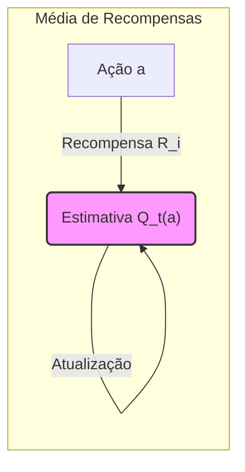
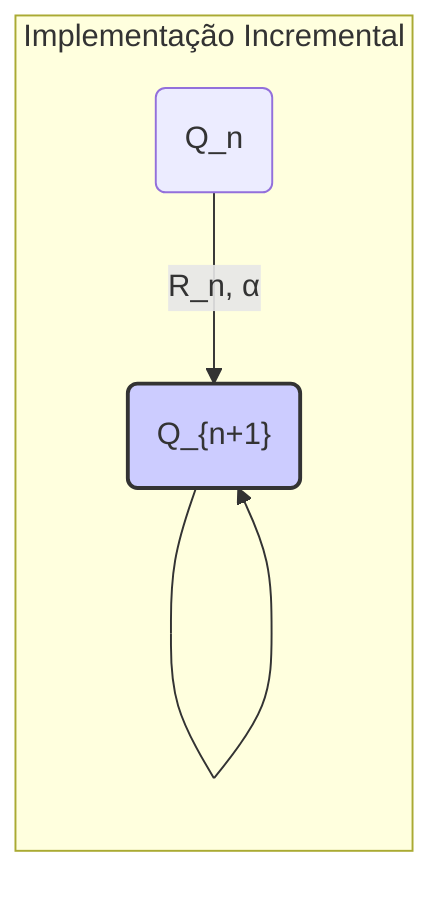
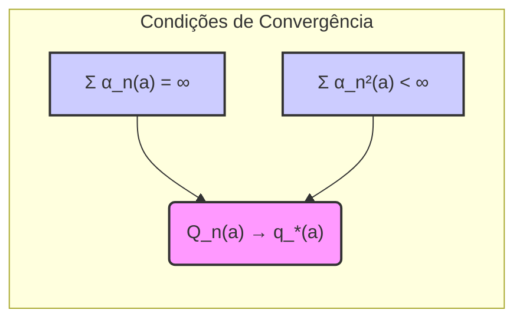

### Implementação Incremental com Tamanho de Passo Variável

### Introdução
Este capítulo explora o problema dos **multi-armed bandits**, um cenário simplificado de *reinforcement learning* onde o foco está na avaliação das ações e na busca por um comportamento ótimo. Um aspecto crucial desses problemas é a necessidade de equilibrar a **exploração** e a **explotação** [^1]. Uma forma natural de estimar o valor de uma ação é calculando a média das recompensas recebidas ao selecioná-la. No entanto, calcular médias de forma direta pode ser computacionalmente ineficiente, especialmente ao lidar com grandes conjuntos de dados ou sequências longas de recompensas [^3]. A **implementação incremental** surge como uma solução para esse desafio, oferecendo uma maneira de atualizar médias de maneira eficiente com **custo computacional constante** por passo de tempo e utilizando **memória constante** [^3].

### Conceitos Fundamentais

####  Média de Recompensas
O valor verdadeiro de uma ação *a*, denotado por $q_*(a)$, é a média das recompensas recebidas quando essa ação é selecionada. A estimativa desse valor no passo de tempo *t*, denotada por $Q_t(a)$, pode ser calculada usando a média amostral das recompensas recebidas até aquele ponto [^3]:

$$
Q_t(a) = \frac{\text{soma de recompensas quando a foi escolhida antes de t}}{\text{número de vezes que a foi escolhida antes de t}}
$$

Essa abordagem, conhecida como *sample-average method*, converge para $q_*(a)$ à medida que o número de escolhas de *a* tende ao infinito, de acordo com a lei dos grandes números. No entanto, a implementação direta dessa fórmula exige o armazenamento de todas as recompensas anteriores, o que é computacionalmente caro [^3].

####  Implementação Incremental
A implementação incremental oferece uma forma eficiente de calcular médias. Para uma ação específica, denotamos a recompensa recebida após a *i*-ésima seleção como $R_i$ e a estimativa do seu valor após *n-1* seleções como $Q_n$. A atualização da média após receber a *n*-ésima recompensa, $R_n$, pode ser expressa como [^3]:

$$
Q_{n+1} = \frac{1}{n} \sum_{i=1}^{n} R_i = \frac{1}{n} (R_n + \sum_{i=1}^{n-1} R_i)
$$
$$
Q_{n+1} = \frac{1}{n} (R_n + (n-1)Q_n) = \frac{1}{n} (R_n + nQ_n - Q_n)
$$

$$
Q_{n+1} = Q_n + \frac{1}{n} [R_n - Q_n]
$$

Essa equação mostra que a nova estimativa $Q_{n+1}$ pode ser obtida a partir da estimativa anterior $Q_n$, da recompensa $R_n$ e do número de vezes que a ação foi selecionada *n*. Isso elimina a necessidade de armazenar todas as recompensas anteriores, tornando o processo mais eficiente computacionalmente [^3].

> 💡 **Exemplo Numérico:**
>
> Suponha que temos uma ação *a* e queremos calcular sua média de recompensas de forma incremental. Inicialmente, $Q_1(a) = 0$.
>
> - **Passo 1:** A ação *a* é selecionada e recebemos uma recompensa $R_1 = 2$.
>
>   $Q_2(a) = Q_1(a) + \frac{1}{1}[R_1 - Q_1(a)] = 0 + 1 * (2 - 0) = 2$
>
> - **Passo 2:** A ação *a* é selecionada novamente e recebemos uma recompensa $R_2 = 4$.
>
>   $Q_3(a) = Q_2(a) + \frac{1}{2}[R_2 - Q_2(a)] = 2 + 0.5 * (4 - 2) = 3$
>
> - **Passo 3:** A ação *a* é selecionada novamente e recebemos uma recompensa $R_3 = 3$.
>
>   $Q_4(a) = Q_3(a) + \frac{1}{3}[R_3 - Q_3(a)] = 3 + \frac{1}{3} * (3 - 3) = 3$
>
> Repare que a média, utilizando o método incremental, é atualizada a cada nova recompensa sem a necessidade de armazenar recompensas anteriores.

####  Tamanho do Passo ($α$)
Na atualização incremental, o termo $\frac{1}{n}$ desempenha o papel do **tamanho do passo**. De modo geral, podemos expressar a atualização como:

$$
\text{Nova Estimativa} \leftarrow \text{Velha Estimativa} + \text{Tamanho do Passo} [\text{Alvo} - \text{Velha Estimativa}]
$$

Onde o termo [Alvo - Velha Estimativa] representa o erro na estimativa. O alvo pode ser ruidoso, como no caso acima onde é a recompensa mais recente. No caso da média das amostras ($\frac{1}{n}$), o tamanho do passo diminui à medida que o número de seleções da ação aumenta. No entanto, em problemas **não estacionários** (onde as probabilidades de recompensa podem mudar com o tempo), essa abordagem pode não ser a ideal [^5]. Nestes casos, é preferível dar maior peso às recompensas mais recentes, o que pode ser obtido usando um tamanho de passo constante ($\alpha$) [^5]:

$$
Q_{n+1} = Q_n + \alpha [R_n - Q_n]
$$

onde $\alpha \in (0, 1]$ é uma constante [^5]. Essa abordagem resulta em uma média ponderada exponencialmente das recompensas anteriores. Ou seja, as recompensas mais recentes têm maior peso. Isso permite que o algoritmo se adapte mais rapidamente às mudanças nas recompensas, embora a estimativa nunca convirja completamente [^5].

> 💡 **Exemplo Numérico:**
>
> Suponha que temos um problema não estacionário e queremos utilizar um tamanho de passo constante $\alpha=0.1$. Inicialmente $Q_1(a) = 0$
>
> - **Passo 1:** A ação *a* é selecionada e recebemos uma recompensa $R_1 = 2$.
>
>  $Q_2(a) = Q_1(a) + \alpha[R_1 - Q_1(a)] = 0 + 0.1 * (2 - 0) = 0.2$
>
> - **Passo 2:** A ação *a* é selecionada novamente e recebemos uma recompensa $R_2 = 4$.
>
>  $Q_3(a) = Q_2(a) + \alpha[R_2 - Q_2(a)] = 0.2 + 0.1 * (4 - 0.2) = 0.58$
>
> - **Passo 3:** A ação *a* é selecionada novamente e recebemos uma recompensa $R_3 = 1$.
>
>  $Q_4(a) = Q_3(a) + \alpha[R_3 - Q_3(a)] = 0.58 + 0.1 * (1 - 0.58) = 0.622$
>
> Observe que, com tamanho de passo constante, a estimativa $Q_t(a)$ responde mais rapidamente a mudanças nas recompensas (como a recompensa de 1 no passo 3). Comparando com o exemplo anterior, onde o tamanho do passo era $\frac{1}{n}$, este método se adapta mais rápido a novas recompensas, dando menor peso às recompensas passadas. Isso é útil em ambientes não estacionários.
>
> Vamos analisar como o valor de $Q_t(a)$ se comporta com diferentes valores de $\alpha$.
>
> | Iteração | Recompensa ($R_t$) | Q com $\alpha = 0.1$ | Q com $\alpha = 0.5$ | Q com $\alpha = 1$ |
> | -------- | ------------------- | --------------- | --------------- | --------------- |
> | 1        | 2                   | 0.2             | 1               | 2               |
> | 2        | 4                   | 0.58            | 2.5             | 4               |
> | 3        | 1                   | 0.622           | 1.75            | 1               |
> | 4        | 5                   | 1.0598          | 3.375           | 5               |
>
> Como podemos ver, um $\alpha$ maior faz com que as estimativas se adaptem mais rapidamente às recompensas mais recentes, enquanto um $\alpha$ menor suaviza as atualizações, dando mais importância às recompensas passadas. No caso de $\alpha = 1$, a estimativa $Q_{n+1}$ é exatamente a recompensa mais recente $R_n$.

#####  Notação Generalizada para o Tamanho do Passo

No contexto geral, o tamanho do passo pode variar com o tempo e com a ação, sendo denotado por $\alpha_t(a)$ [^8]. Isso permite uma maior flexibilidade na forma como as estimativas são atualizadas. Em algumas situações, pode ser desejável um tamanho de passo que diminui ao longo do tempo, em outras, um tamanho de passo constante ou que dependa da ação. O uso de $\alpha$ ou $\alpha_t(a)$ permite generalizar o tamanho do passo para diferentes métodos e cenários de *reinforcement learning* [^8]. O método de média amostral usa $\alpha_n(a) = \frac{1}{n}$, enquanto um tamanho de passo constante, $\alpha$, usa $\alpha_n(a) = \alpha$. Um pseudocódigo para um algoritmo *bandit* completo utilizando médias amostrais calculadas incrementalmente e seleção de ação $\epsilon$-greedy é apresentado abaixo [^8]:

```
Initialize, for a = 1 to k:
    Q(a) ← 0
    N(a) ← 0

Loop forever:
    A ← { argmax_a Q(a) with probability 1 - ε (breaking ties randomly)
        { a random action with probability ε
    R ← bandit(A)
    N(A) ← N(A) + 1
    Q(A) ← Q(A) + 1/N(A) * [R - Q(A)]
```
**Observação:** Note que o pseudocódigo acima usa $\frac{1}{N(A)}$ como tamanho do passo, o qual corresponde ao método de média amostral. Como vimos, um tamanho de passo constante $\alpha$ pode ser mais adequado para ambientes não estacionários.


#### Lemma 1
A atualização incremental da média com tamanho de passo constante $\alpha$, $Q_{n+1} = Q_n + \alpha[R_n - Q_n]$ resulta em uma média ponderada das recompensas anteriores, onde o peso de cada recompensa decai exponencialmente [^5].

**Prova**

Começando pela equação de atualização:

$$Q_{n+1} = Q_n + \alpha [R_n - Q_n]$$

$$Q_{n+1} = \alpha R_n + (1 - \alpha)Q_n$$

Expandindo recursivamente $Q_n$

$$Q_{n+1} = \alpha R_n + (1 - \alpha)[\alpha R_{n-1} + (1 - \alpha)Q_{n-1}]$$

$$Q_{n+1} = \alpha R_n + \alpha(1 - \alpha)R_{n-1} + (1 - \alpha)^2Q_{n-1}$$
Continuando recursivamente até $Q_1$, onde $Q_1$ é um valor inicial:

$$Q_{n+1} = \alpha R_n + \alpha(1 - \alpha)R_{n-1} + \alpha(1 - \alpha)^2R_{n-2} + \ldots + (1 - \alpha)^{n-1}Q_1$$

$$Q_{n+1} = \sum_{i=1}^{n} \alpha (1 - \alpha)^{n-i} R_i + (1 - \alpha)^{n}Q_1$$

Esta equação mostra que o peso da recompensa $R_i$ é $\alpha(1 - \alpha)^{n-i}$, que decai exponencialmente com o tempo. O peso da estimativa inicial $Q_1$ é $(1-\alpha)^n$ que também decai com o tempo. $\blacksquare$

> 💡 **Exemplo Numérico:**
>
> Para ilustrar o decaimento exponencial, vamos utilizar $\alpha=0.1$ e calcular o peso das últimas três recompensas $R_n, R_{n-1}, R_{n-2}$ quando temos $n=10$.
>
> - Peso de $R_{10}$: $\alpha(1-\alpha)^{10-10} = 0.1 * (0.9)^0 = 0.1$
> - Peso de $R_9$: $\alpha(1-\alpha)^{10-9} = 0.1 * (0.9)^1 = 0.09$
> - Peso de $R_8$: $\alpha(1-\alpha)^{10-8} = 0.1 * (0.9)^2 = 0.081$
>
> Este exemplo demonstra que, com $\alpha=0.1$, a recompensa mais recente (R_10) tem um peso de 0.1, enquanto as recompensas anteriores têm pesos que decaem exponencialmente (0.09 e 0.081).

**Lema 1.1**
A atualização incremental com tamanho de passo constante $\alpha$ pode ser escrita como uma combinação convexa entre a recompensa atual e a estimativa anterior.

**Prova**

A equação de atualização é:

$$Q_{n+1} = Q_n + \alpha[R_n - Q_n]$$

Reorganizando os termos, temos:

$$Q_{n+1} = \alpha R_n + (1 - \alpha) Q_n$$

Como $\alpha \in (0, 1]$, e consequentemente $1 - \alpha \in [0, 1)$, essa expressão representa uma combinação convexa entre $R_n$ e $Q_n$. $\blacksquare$

**Lema 1.2**
Se o tamanho do passo $\alpha_n(a)$ for escolhido de tal forma que $\sum_{n=1}^{\infty} \alpha_n(a) = \infty$ e $\sum_{n=1}^{\infty} \alpha_n^2(a) < \infty$, então a estimativa $Q_n(a)$ irá convergir para o valor verdadeiro $q_*(a)$, assumindo que a média das recompensas seja estacionária.

**Prova (Esboço)**

Este resultado é uma condição de convergência clássica para algoritmos de aproximação estocástica.  A primeira condição, $\sum_{n=1}^{\infty} \alpha_n(a) = \infty$, garante que o algoritmo não pare de aprender (atualizar a estimativa). A segunda condição, $\sum_{n=1}^{\infty} \alpha_n^2(a) < \infty$, garante que o processo de atualização não seja muito ruidoso e que as estimativas acabem se estabilizando. A prova formal envolve conceitos de convergência de martingales e pode ser encontrada em textos avançados de *reinforcement learning* e otimização estocástica.


**Proposição 2**
O método de média amostral, onde $\alpha_n(a) = \frac{1}{n}$, satisfaz as condições de convergência descritas no **Lema 1.2**.

**Prova**

Para $\alpha_n(a) = \frac{1}{n}$, temos:
1.  $\sum_{n=1}^{\infty} \alpha_n(a) = \sum_{n=1}^{\infty} \frac{1}{n}$, que é a série harmônica e diverge para o infinito.
2.  $\sum_{n=1}^{\infty} \alpha_n^2(a) = \sum_{n=1}^{\infty} \frac{1}{n^2}$, que é uma série p com p=2, e converge para $\frac{\pi^2}{6}$.

Portanto, o método de média amostral satisfaz ambas as condições de **Lema 1.2** e, portanto, converge para o valor verdadeiro $q_*(a)$ em problemas estacionários. $\blacksquare$

### Conclusão

O uso de uma implementação incremental com tamanho de passo, $\alpha$ ou $\alpha_t(a)$, permite um cálculo eficiente da estimativa de valor das ações em problemas de *reinforcement learning*. A escolha entre um tamanho de passo constante ou variável depende da natureza do problema. Para problemas estacionários, um tamanho de passo que diminui com o tempo pode ser ideal. Para problemas não estacionários, é preferível um tamanho de passo constante ou que dê maior peso para as recompensas mais recentes [^5]. A generalização para $\alpha_t(a)$ adiciona uma camada de flexibilidade que pode ser utilizada para melhorar o desempenho do aprendizado em diversos cenários [^8]. O tamanho do passo, seja ele constante ou variável, desempenha um papel central na forma como as informações são ponderadas, sendo crucial para um aprendizado eficaz [^5].

### Referências
[^1]: "The most important feature distinguishing reinforcement learning from other types of learning is that it uses training information that evaluates the actions taken rather than instructs by giving correct actions." *(Trecho de Chapter 2)*
[^3]: "We begin by looking more closely at methods for estimating the values of actions and for using the estimates to make action selection decisions, which we collectively call action-value methods." *(Trecho de Chapter 2)*
[^5]: "The averaging methods discussed so far are appropriate for stationary bandit problems, that is, for bandit problems in which the reward probabilities do not change over time. As noted earlier, we often encounter reinforcement learning problems that are effectively nonstationary. In such cases it makes sense to give more weight to recent rewards than to long-past rewards." *(Trecho de Chapter 2)*
[^8]: "In this book we denote the step-size parameter by α or, more generally, by αt(a)." *(Trecho de Chapter 2)*
```