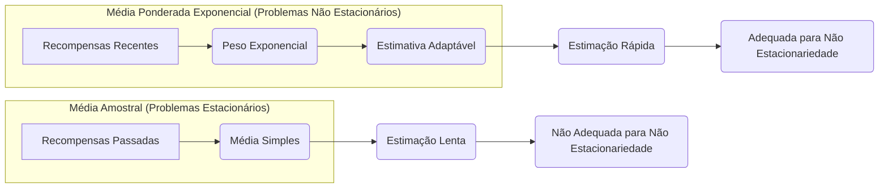
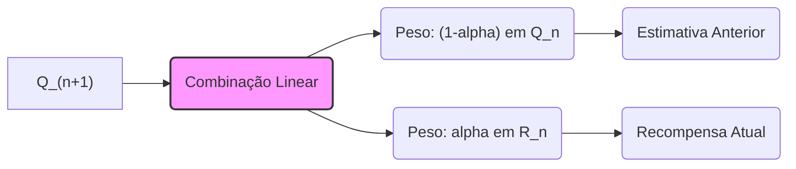
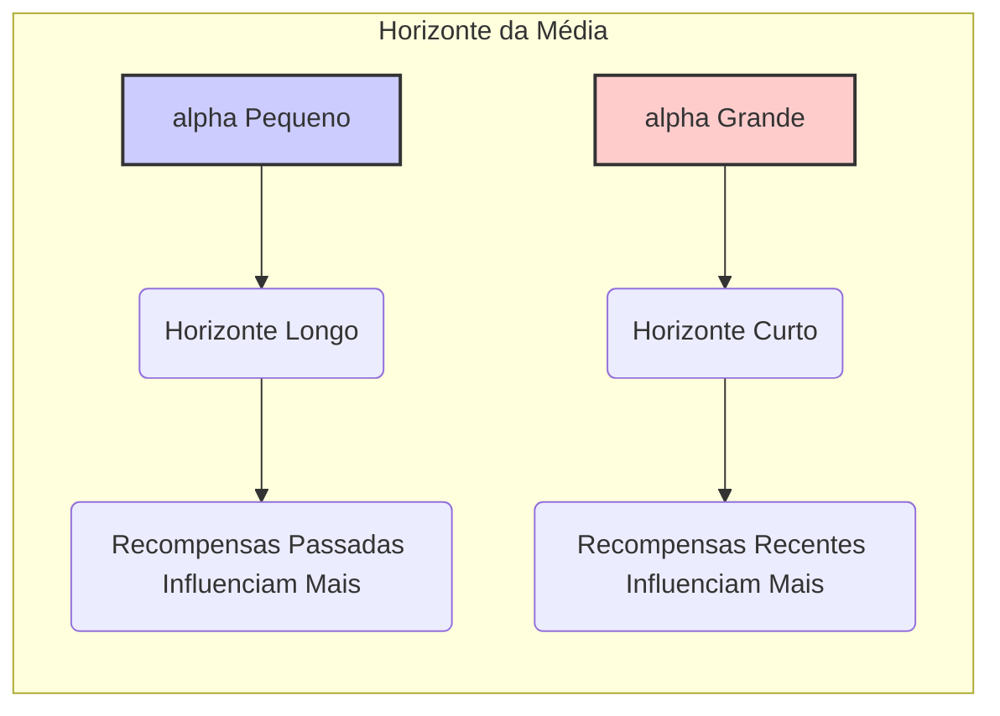

## Métodos de Rastreamento em Problemas Não Estacionários

### Introdução

No contexto de **multi-armed bandits**, o aprendizado por reforço enfrenta o desafio de adaptar-se a ambientes não estacionários, onde as probabilidades de recompensa associadas a cada ação podem variar ao longo do tempo [1](https://chatgpt.com/c/67829922-359c-8011-96dd-970c04ed772c#user-content-fn-1). Em contraste com os **problemas estacionários**, nos quais as recompensas seguem distribuições fixas, os ambientes não estacionários exigem métodos de aprendizado que possam se adaptar rapidamente às mudanças nas dinâmicas de recompensa. A capacidade de ponderar recompensas recentes com mais ênfase do que as recompensas passadas torna-se essencial nesses cenários [2](https://chatgpt.com/c/67829922-359c-8011-96dd-970c04ed772c#user-content-fn-2). Este capítulo explora como as médias podem ser adaptadas para rastrear essas mudanças, mantendo a eficiência computacional.

### Conceitos Fundamentais

A essência do aprendizado em ambientes não estacionários reside na capacidade de dar mais peso às recompensas mais recentes, refletindo a crença de que as condições atuais do ambiente são mais relevantes do que as experiências passadas [2](https://chatgpt.com/c/67829922-359c-8011-96dd-970c04ed772c#user-content-fn-2). Uma abordagem comum para lidar com essa não estacionariedade é usar um **parâmetro de tamanho de passo constante**. Isso modifica a regra de atualização incremental para calcular a média $Q_n$ das $n-1$ recompensas anteriores, ajustando-a para:

$$Q_{n+1} = Q_n + \alpha [R_n - Q_n],$$

onde $\alpha \in (0, 1]$ é uma constante. Esta formulação resulta em $Q_{n+1}$ sendo uma média ponderada das recompensas passadas e da estimativa inicial $Q_1$. A equação é uma forma de média com **ponderação por recência exponencial** [2](https://chatgpt.com/c/67829922-359c-8011-96dd-970c04ed772c#user-content-fn-2).

> 💡 **Exemplo Numérico:**
>
> Suponha que temos um *multi-armed bandit* com uma ação, e as recompensas que recebemos são $R_1 = 1$, $R_2 = 2$, $R_3 = 3$, e assim por diante. Inicializamos $Q_1 = 0$, e vamos considerar $\alpha = 0.1$. Vamos calcular os valores de $Q_n$ iterativamente:
>
> - $Q_2 = Q_1 + \alpha [R_1 - Q_1] = 0 + 0.1 [1 - 0] = 0.1$
> - $Q_3 = Q_2 + \alpha [R_2 - Q_2] = 0.1 + 0.1 [2 - 0.1] = 0.1 + 0.1 * 1.9 = 0.29$
> - $Q_4 = Q_3 + \alpha [R_3 - Q_3] = 0.29 + 0.1 [3 - 0.29] = 0.29 + 0.1 * 2.71 = 0.561$
>
> Observamos que $Q_n$ se move em direção a $R_n$, mas com um atraso e ponderado pelo $\alpha$. Se $\alpha$ fosse maior, digamos 0.5, a adaptação seria mais rápida:
>
> - $Q_2 = 0 + 0.5[1-0] = 0.5$
> - $Q_3 = 0.5 + 0.5[2 - 0.5] = 0.5 + 0.75 = 1.25$
> - $Q_4 = 1.25 + 0.5[3-1.25] = 1.25 + 0.875 = 2.125$
>
> Como podemos ver, com $\alpha=0.5$ os valores de $Q_n$ se adaptam mais rapidamente aos novos valores de recompensa.

Para entender a natureza da ponderação, podemos expandir a fórmula recursivamente:

$$
\begin{aligned}
Q_{n+1} &= Q_n + \alpha [R_n - Q_n] \\
&= \alpha R_n + (1 - \alpha)Q_n \\
&= \alpha R_n + (1 - \alpha) [\alpha R_{n-1} + (1 - \alpha) Q_{n-1}] \\
&= \alpha R_n + (1 - \alpha) \alpha R_{n-1} + (1 - \alpha)^2 Q_{n-1} \\
&= \ldots \\
&= (1 - \alpha)^n Q_1 + \sum_{i=1}^{n} \alpha (1 - \alpha)^{n-i} R_i.
\end{aligned}
$$

Aqui, o peso dado a cada recompensa $R_i$ é $\alpha(1-\alpha)^{n-i}$. Este peso diminui exponencialmente à medida que a recompensa é mais antiga, com o peso da recompensa $R_n$ sendo $\alpha$. A soma dos pesos é igual a 1, como pode ser verificado:

$$(1-\alpha)^n + \sum_{i=1}^n \alpha (1-\alpha)^{n-i} = (1-\alpha)^n + \alpha\sum_{j=0}^{n-1} (1-\alpha)^j = (1-\alpha)^n + \alpha\frac{1-(1-\alpha)^n}{1-(1-\alpha)} = (1-\alpha)^n + 1-(1-\alpha)^n=1$$

Essa forma de média é chamada de média ponderada exponencialmente pela recência. Note que quando $\alpha$ se aproxima de 1, o valor de $Q_{n+1}$ se aproxima de $R_n$.
Ao contrário do método de média amostral, o uso de um tamanho de passo constante resulta em estimativas que não convergem completamente [2](https://chatgpt.com/c/67829922-359c-8011-96dd-970c04ed772c#user-content-fn-2). Em vez disso, as estimativas continuam a variar em resposta a recompensas recentes, o que é desejável em ambientes não estacionários. O uso de uma média simples não seria adequado nesses casos, porque se baseia em recompensas do passado distante, que não são mais relevantes [2](https://chatgpt.com/c/67829922-359c-8011-96dd-970c04ed772c#user-content-fn-2).



**Proposição 1**
A escolha do valor de $\alpha$ influencia diretamente a velocidade com que o algoritmo se adapta a mudanças no ambiente. Um valor de $\alpha$ próximo de 1 leva a uma adaptação mais rápida, mas também a uma maior variância na estimativa de $Q_{n+1}$. Por outro lado, um valor de $\alpha$ próximo de 0 torna a adaptação mais lenta, com menor variância, mas também pode resultar em uma resposta defasada às mudanças no ambiente.

> 💡 **Exemplo Numérico:**
>
> Para ilustrar a Proposição 1, vamos considerar dois cenários em um ambiente não estacionário. Suponha que as recompensas de um determinado braço em um *multi-armed bandit* mudam repentinamente de 1 para 5 no passo 10. Vamos comparar o comportamento de $Q_n$ com $\alpha = 0.1$ e $\alpha = 0.8$, com $Q_1=0$.
>
> ```python
> import numpy as np
> import matplotlib.pyplot as plt
>
> alpha1 = 0.1
> alpha2 = 0.8
> rewards = np.concatenate((np.ones(9), np.ones(21) * 5))
>
> Q1 = np.zeros_like(rewards, dtype=float)
> Q2 = np.zeros_like(rewards, dtype=float)
>
> Q1[0] = 0
> Q2[0] = 0
>
> for i in range(1, len(rewards)):
>     Q1[i] = Q1[i-1] + alpha1 * (rewards[i] - Q1[i-1])
>     Q2[i] = Q2[i-1] + alpha2 * (rewards[i] - Q2[i-1])
>
> plt.plot(Q1, label=f'alpha = {alpha1}')
> plt.plot(Q2, label=f'alpha = {alpha2}')
> plt.plot(rewards, label='Recompensas', linestyle='--')
> plt.xlabel('Passo de tempo')
> plt.ylabel('Valor Q')
> plt.title('Efeito de alpha na Adaptação')
> plt.legend()
> plt.show()
> ```
>
> Este código plota a evolução de $Q_n$ para os dois valores de $\alpha$. Observamos que o Q com $\alpha = 0.8$ converge muito mais rápido para a recompensa de 5 após a mudança, mas também tem mais flutuações. Já o Q com $\alpha = 0.1$ converge mais lentamente, mas de forma mais estável.
>
> ```mermaid
>  graph LR
>      A[Início] --> B{Recompensas = 1?};
>      B -- Sim --> C[Q(n) converge lentamente com alpha=0.1];
>      B -- Não --> D{Recompensas = 5?};
>      D -- Sim --> E[Q(n) converge rapidamente com alpha=0.8];
>      D -- Não --> F[Continua];
>      C --> G[Estável];
>      E --> H[Instável];
>      F-->B
> ```

**Prova:**
Da expansão recursiva da equação de atualização, $Q_{n+1} = (1 - \alpha)^n Q_1 + \sum_{i=1}^{n} \alpha (1 - \alpha)^{n-i} R_i$, podemos observar que quando $\alpha$ se aproxima de 1, o termo $(1 - \alpha)^n Q_1$ se torna desprezível rapidamente, e o peso das recompensas passadas $\alpha(1-\alpha)^{n-i}$ decai rapidamente, dando maior importância às recompensas mais recentes, $R_n$ em particular. Quando $\alpha$ se aproxima de 0, o peso das recompensas passadas decai mais lentamente, e o termo $(1 - \alpha)^n Q_1$ ainda terá importância mesmo em passos mais avançados. Isso implica que a estimativa $Q_{n+1}$ dependerá mais da estimativa inicial $Q_1$ e de recompensas antigas, levando a uma adaptação mais lenta. $\blacksquare$

### Lemma 1

A média ponderada da equação 2.5 é equivalente à média ponderada por recência exponencial, onde a soma dos pesos é igual a 1.

**Prova:**
Como demonstrado acima, a expansão da fórmula recursiva mostra claramente que a soma dos pesos para a média ponderada da equação 2.5 é igual a 1. $\blacksquare$

**Lemma 1.1**
A média ponderada da equação 2.5 pode ser reescrita em uma forma que explicita a influência da estimativa anterior $Q_n$ e da nova recompensa $R_n$.

**Prova:**
A equação $Q_{n+1} = Q_n + \alpha [R_n - Q_n]$ pode ser reorganizada como $Q_{n+1} = (1 - \alpha)Q_n + \alpha R_n$. Essa forma mostra explicitamente como a nova estimativa é uma combinação linear da estimativa anterior e da nova recompensa. $\blacksquare$



### Corolário 1

A média ponderada da equação 2.5, utilizando um $\alpha$ constante, sempre tenderá a dar mais importância às recompensas recentes.

**Prova:**
Como $\alpha \in (0,1]$, o fator $(1-\alpha)^{n-i}$ sempre será menor quando $n-i$ for maior. Portanto, recompensas mais recentes ($n-i$ pequeno) terão maior peso do que recompensas mais antigas. $\blacksquare$

**Corolário 1.1**
O "horizonte" da média ponderada exponencialmente pela recência é controlado pelo parâmetro $\alpha$. Um valor menor de $\alpha$ corresponde a um horizonte mais longo (mais recompensas passadas influenciam a média) e um valor maior de $\alpha$ corresponde a um horizonte mais curto (principalmente as recompensas recentes influenciam a média).

> 💡 **Exemplo Numérico:**
>
> Para ilustrar o Corolário 1.1, podemos calcular o peso dado a recompensas de diferentes passos no tempo para diferentes valores de $\alpha$. Suponha $n=10$.
>
> | Passo ($i$) | $n-i$ | Peso ($\alpha=0.1$) | Peso ($\alpha=0.5$) |
> |-------------|-------|--------------------|--------------------|
> | 1           | 9     | $0.1*(0.9)^9 = 0.0387$  | $0.5*(0.5)^9 = 0.00097$  |
> | 5           | 5     | $0.1*(0.9)^5 = 0.059$ | $0.5*(0.5)^5 = 0.0156$ |
> | 9          | 1     | $0.1*(0.9)^1 = 0.09$ | $0.5*(0.5)^1 = 0.25$  |
> | 10          | 0     | $0.1*(0.9)^0 = 0.1$  | $0.5*(0.5)^0 = 0.5$ |
>
> Observe que com $\alpha=0.1$, as recompensas antigas ainda têm um peso relevante. Já com $\alpha=0.5$, as recompensas mais recentes são muito mais importantes.

**Prova:**
O peso de cada recompensa $R_i$ é dado por $\alpha(1-\alpha)^{n-i}$. Se $\alpha$ é pequeno, então o fator $(1-\alpha)$ será próximo de 1, e a queda exponencial do peso com a antiguidade da recompensa será mais lenta, resultando em um maior horizonte. Se $\alpha$ é grande, então $(1-\alpha)$ será pequeno, e o peso de recompensas mais antigas decairá rapidamente, diminuindo o horizonte da média. $\blacksquare$



Para rastrear a não estacionariedade de forma mais adaptável, é possível variar o parâmetro de tamanho de passo de um passo de tempo para outro. No entanto, o uso de tamanhos de passo que atendem às condições de convergência (2.7) frequentemente resulta em convergência lenta ou requer um ajuste significativo para uma taxa satisfatória. Assim, embora essas sequências de tamanhos de passo sejam úteis para fins teóricos, elas não são amplamente utilizadas em aplicações e pesquisa empírica [2](https://chatgpt.com/c/67829922-359c-8011-96dd-970c04ed772c#user-content-fn-2].

### Conclusão

Em resumo, enquanto os métodos de média de amostra são ideais para **problemas estacionários**, a necessidade de adaptação rápida e flexível em ambientes **não estacionários** torna necessário o uso de métodos que priorizem recompensas recentes. O uso de um tamanho de passo constante, conforme demonstrado, fornece um mecanismo simples e eficaz para o rastreamento de mudanças nas dinâmicas de recompensa, garantindo que o agente de aprendizado possa se ajustar ao seu entorno mutável. Este é um conceito fundamental no estudo de **reinforcement learning** em ambientes do mundo real. A escolha entre métodos de média amostral e métodos com tamanho de passo constante depende essencialmente da natureza do problema enfrentado, com a **não estacionariedade** exigindo estratégias de aprendizagem mais adaptáveis.

### Referências
[^1]: "The most important feature distinguishing reinforcement learning from other types of learning is that it uses training information that evaluates the actions taken rather than instructs by giving correct actions. This is what creates the need for active exploration, for an explicit search for good behavior." *(Trecho de Chapter 2: Multi-armed Bandits)*
[^2]: "As noted earlier, we often encounter reinforcement learning problems that are effectively nonstationary. In such cases it makes sense to give more weight to recent rewards than to long-past rewards. One of the most popular ways of doing this is to use a constant step-size parameter." *(Trecho de Chapter 2: Multi-armed Bandits)*
