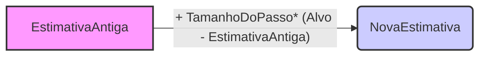

## Rastreamento de Problemas Não Estacionários em Multi-Armed Bandits

### Introdução

Em problemas de *reinforcement learning*, o agente interage com um ambiente para aprender a tomar decisões otimizadas ao longo do tempo [^1]. Diferentemente de outros tipos de aprendizagem, o *reinforcement learning* utiliza feedback avaliativo, indicando o quão boa foi a ação tomada, em vez de feedback instrutivo, que indicaria a ação correta a ser tomada. Este feedback avaliativo é crucial para criar a necessidade de exploração ativa, buscando o melhor comportamento possível [^1]. Este capítulo foca no aspecto avaliativo do *reinforcement learning* em um cenário simplificado, que é o problema do *k-armed bandit* [^1]. Este problema serve como um ponto de partida para introduzir métodos básicos de aprendizagem, que posteriormente são estendidos para o problema completo de *reinforcement learning* [^1]. O capítulo também aborda o cenário onde o problema do *bandit* torna-se associativo, ou seja, quando a melhor ação depende da situação [^1].

Um aspecto crucial no *reinforcement learning* é a consideração de ambientes não estacionários, onde as probabilidades de recompensa mudam ao longo do tempo [^2]. Em tais ambientes, é fundamental que o agente seja capaz de adaptar suas estratégias de aprendizagem para refletir as mudanças recentes nas recompensas. Métodos que dão maior peso às recompensas mais recentes, como os métodos de passo constante, são importantes para garantir o sucesso em ambientes não estacionários. Este capítulo explora essa dinâmica em profundidade, utilizando o framework do *k-armed bandit* [^2].

### Conceitos Fundamentais

O problema do **k-armed bandit** envolve a escolha repetida entre *k* opções, ou ações [^1]. Cada ação resulta em uma recompensa numérica proveniente de uma distribuição de probabilidade estacionária, dependente da ação escolhida [^1]. O objetivo é maximizar a recompensa total esperada ao longo de um período de tempo [^2]. Este problema é denominado dessa forma por analogia a uma máquina caça-níqueis com *k* alavancas, em que cada ação corresponde a puxar uma das alavancas [^2]. Em termos formais, a recompensa esperada de uma ação *a* é denotada como $q_*(a)$ [^2]. O valor estimado da ação *a* no instante de tempo *t* é denotado por $Q_t(a)$ [^2].

A ação selecionada no instante de tempo *t* é representada por $A_t$, e a recompensa correspondente por $R_t$ [^2]. Uma estratégia básica para escolher ações é a **ação gulosa** (*greedy action*), que seleciona a ação com o maior valor estimado [^2]. Alternativamente, o agente pode escolher uma ação não gulosa, que é denominada como **exploração** (*exploration*) [^2]. A **explotação** (*exploitation*) busca maximizar a recompensa imediata, enquanto a exploração visa melhorar as estimativas de valor para o longo prazo [^2]. O equilíbrio entre esses dois aspectos é um desafio fundamental no *reinforcement learning* [^2].

Um método comum para equilibrar exploração e explotação é o **método ε-guloso** (*ε-greedy method*), em que a maioria das vezes uma ação gulosa é escolhida, mas com uma pequena probabilidade ε, uma ação aleatória é selecionada [^3]. Uma forma de estimar o valor de uma ação é através da **média amostral** (*sample-average method*), que calcula a média das recompensas recebidas quando a ação é escolhida [^3]. Formalmente, isso é representado por:

$$
    Q_t(a) = \frac{\text{soma das recompensas quando a foi escolhida antes de t}}{\text{número de vezes que a foi escolhida antes de t}} = \frac{\sum_{i=1}^{t-1} R_i \mathbb{1}_{A_i = a}}{\sum_{i=1}^{t-1} \mathbb{1}_{A_i = a}}
$$

onde $\mathbb{1}_{\text{predicado}}$ é uma variável aleatória que vale 1 se o predicado for verdadeiro e 0 caso contrário [^3]. Este método tem a propriedade de, pela lei dos grandes números, convergir para o valor real da ação $q_*(a)$ quando o número de amostras tende ao infinito [^3].

> 💡 **Exemplo Numérico:** Considere um problema de 3-armed bandit (k=3), onde escolhemos a ação 1 (a=1) três vezes e recebemos as recompensas R1 = 2, R2 = 4, e R3 = 3. Usando a média amostral, o valor estimado da ação 1 após essas três tentativas é:
>
> $$Q_4(1) = \frac{2 + 4 + 3}{3} = \frac{9}{3} = 3$$
>
> Portanto, a estimativa para o valor da ação 1, $Q_4(1)$, é 3. Isso representa a média das recompensas recebidas até agora para a ação 1.

#### Métodos Incrementais e o Passo Constante
Para implementar o método de médias amostrais de forma eficiente computacionalmente, é possível usar métodos **incrementais**, que atualizam a estimativa do valor de uma ação de forma a não precisar armazenar o histórico completo de recompensas [^4]. A forma geral de atualização incremental é:



$$
\text{NovaEstimativa} \leftarrow \text{EstimativaAntiga} + \text{TamanhoDoPasso} [\text{Alvo} - \text{EstimativaAntiga}]
$$
[^4].

No caso de médias amostrais, o tamanho do passo é $\frac{1}{n}$, onde $n$ é o número de vezes que a ação foi selecionada [^4]. A adaptação incremental da média amostral, utilizando um passo variável, é dada por:

$$
Q_{n+1} = Q_n + \frac{1}{n}[R_n - Q_n]
$$

onde $Q_n$ é a estimativa do valor após *n-1* recompensas e $R_n$ é a *n*-ésima recompensa [^4].

**Proposição 1:** A atualização incremental com passo variável da média amostral converge para a média verdadeira da recompensa da ação quando o número de amostras tende ao infinito.

*Prova:* A atualização incremental da média amostral pode ser expressa como:
$Q_{n+1} = Q_n + \frac{1}{n}[R_n - Q_n]$. Esta formulação é uma implementação eficiente da média amostral padrão. Como a média amostral converge para a média verdadeira pela Lei dos Grandes Números, a atualização incremental também converge para a média verdadeira da recompensa da ação quando o número de amostras tende ao infinito $\blacksquare$.

> 💡 **Exemplo Numérico:**  Continuando o exemplo anterior, suponha que após as três primeiras tentativas (R1=2, R2=4, R3=3), escolhemos novamente a ação 1 e recebemos uma recompensa R4=5. Anteriormente, $Q_4(1) = 3$. Usando a atualização incremental, onde n=3 (a ação 1 foi escolhida 3 vezes anteriormente), temos:
>
>$$Q_5(1) = Q_4(1) + \frac{1}{4}[R_4 - Q_4(1)] = 3 + \frac{1}{4}[5 - 3] = 3 + \frac{2}{4} = 3.5$$
>
>Observe que $Q_5(1) = 3.5$ é o mesmo resultado que obteríamos se calculássemos a média amostral diretamente: $(2+4+3+5)/4 = 14/4 = 3.5$. A atualização incremental, no entanto, não requer que armazenemos todas as recompensas anteriores.

Em cenários não estacionários, onde as probabilidades de recompensa podem mudar com o tempo, torna-se necessário dar maior peso às recompensas mais recentes, pois estas refletem melhor a dinâmica atual do problema [^5]. Para isso, é possível modificar a atualização incremental usando um **passo constante** $\alpha$, onde $\alpha \in (0,1]$ [^5]. A fórmula de atualização com passo constante é:

$$
Q_{n+1} = Q_n + \alpha [R_n - Q_n]
$$
[^5].

Essa atualização resulta em uma média ponderada das recompensas passadas, onde as recompensas mais recentes têm mais peso. O peso da recompensa $R_i$ depende de quão atrás no tempo ela foi observada, sendo dado por $\alpha(1-\alpha)^{n-i}$ [^5]. Quanto maior o valor de $\alpha$, mais peso é dado às recompensas recentes [^5].

**Lemma 1:** A atualização com passo constante em problemas não estacionários gera uma média ponderada, dando maior importância às recompensas recentes.

*Prova:* Expandindo a equação de atualização com passo constante de forma recursiva, temos:

```mermaid
graph LR
    subgraph "Passo Constante - Atualização Recursiva"
    A("Q_{n+1}") -->|"= Q_n + alpha[R_n - Q_n]"| B("alpha R_n + (1 - alpha) Q_n");
    B -->|"... aplicando recursivamente ..."| C("alpha R_n + alpha(1-alpha) R_{n-1} + ... + alpha(1-alpha)^{n-1}R_1 + (1-alpha)^n Q_1");
    C -->| " = Soma Ponderada de Recompensas"|D("Q_{n+1}  = (1 - alpha)^n Q_1 + Sum_{i=1}^n alpha(1 - alpha)^{n-i} R_i");
    end
    style A fill:#f9f,stroke:#333,stroke-width:2px
    style B fill:#ccf,stroke:#333,stroke-width:2px
    style C fill:#f9f,stroke:#333,stroke-width:2px
    style D fill:#ccf,stroke:#333,stroke-width:2px
```

$$
Q_{n+1} = Q_n + \alpha [R_n - Q_n] \\
Q_{n+1} = \alpha R_n + (1-\alpha)Q_n \\
Q_{n+1} = \alpha R_n + (1-\alpha)[\alpha R_{n-1} + (1-\alpha)Q_{n-1}] \\
Q_{n+1} = \alpha R_n + \alpha(1-\alpha) R_{n-1} + (1-\alpha)^2 Q_{n-1} \\
... \\
Q_{n+1} = \alpha R_n + \alpha(1-\alpha) R_{n-1} + \alpha(1-\alpha)^2 R_{n-2} + \ldots + \alpha(1-\alpha)^{n-1}R_1 + (1-\alpha)^n Q_1 \\
Q_{n+1} = (1-\alpha)^n Q_1 + \sum_{i=1}^{n} \alpha(1-\alpha)^{n-i}R_i
$$

A equação final mostra que $Q_{n+1}$ é uma média ponderada das recompensas passadas e da estimativa inicial $Q_1$. Os pesos das recompensas passadas, $\alpha(1-\alpha)^{n-i}$, decrescem exponencialmente à medida que a recompensa é observada mais no passado. O peso da estimativa inicial $Q_1$ é $(1-\alpha)^n$, que decresce à medida que $n$ aumenta. Isso demonstra que o método com passo constante dá mais importância às recompensas recentes $\blacksquare$.

> 💡 **Exemplo Numérico:**  Vamos usar o mesmo exemplo das ações e recompensas anteriores, mas agora com um passo constante $\alpha = 0.1$. Inicialmente, vamos supor que $Q_1(1) = 0$. Então, as primeiras quatro atualizações de $Q(1)$ seriam:
>
>$\text{Step 1: } Q_2(1) = Q_1(1) + \alpha [R_1 - Q_1(1)] = 0 + 0.1[2-0] = 0.2$
>
>$\text{Step 2: } Q_3(1) = Q_2(1) + \alpha [R_2 - Q_2(1)] = 0.2 + 0.1[4-0.2] = 0.2 + 0.1[3.8] = 0.58$
>
>$\text{Step 3: } Q_4(1) = Q_3(1) + \alpha [R_3 - Q_3(1)] = 0.58 + 0.1[3-0.58] = 0.58 + 0.1[2.42] = 0.822$
>
>$\text{Step 4: } Q_5(1) = Q_4(1) + \alpha [R_4 - Q_4(1)] = 0.822 + 0.1[5-0.822] = 0.822 + 0.1[4.178] = 1.2398$
>
>Note como a estimativa $Q_t(1)$ está sendo influenciada pelas recompensas mais recentes. As recompensas iniciais (R1, R2) têm um peso menor em $Q_5(1)$ comparado com R3 e R4. Se compararmos com a média amostral anterior, 3.5, vemos como o passo constante resulta em uma estimativa que responde mais rapidamente a variações nas recompensas.
>
>Para visualizar os pesos de cada recompensa, vamos calcular para R1, R2, R3, e R4 na atualização de Q5(1):
>
>$\text{Peso de R1: } \alpha(1-\alpha)^{5-1} = 0.1 * (0.9)^4 = 0.06561$
>
>$\text{Peso de R2: } \alpha(1-\alpha)^{5-2} = 0.1 * (0.9)^3 = 0.0729$
>
>$\text{Peso de R3: } \alpha(1-\alpha)^{5-3} = 0.1 * (0.9)^2 = 0.081$
>
>$\text{Peso de R4: } \alpha(1-\alpha)^{5-4} = 0.1 * (0.9)^1 = 0.09$
>
> A recompensa R4 tem o maior peso (0.09), a recompensa R3 tem o segundo maior peso, e assim por diante, confirmando que recompensas mais recentes recebem maior atenção na estimativa do valor.  O peso da estimativa inicial  $Q_1$ seria $(1 - 0.1)^4 = 0.6561$, que também contribui para $Q_5(1)$
>

**Lemma 1.1:** O peso total das recompensas passadas na atualização com passo constante converge para 1 quando o número de amostras tende ao infinito.

*Prova:*  O peso total das recompensas passadas é dado por $\sum_{i=1}^{n} \alpha(1-\alpha)^{n-i}$.  Podemos reescrever essa soma como $\sum_{j=0}^{n-1} \alpha(1-\alpha)^j$, fazendo a mudança de variável $j = n-i$. Esta é a soma parcial de uma série geométrica, que pode ser calculada como:  $\alpha \frac{1-(1-\alpha)^n}{1-(1-\alpha)} = 1 - (1-\alpha)^n$.  Quando $n$ tende ao infinito, $(1-\alpha)^n$ tende a 0, pois $\alpha \in (0,1]$. Portanto, o peso total das recompensas passadas converge para 1, ou seja, $ \lim_{n\to\infty} (1 - (1-\alpha)^n) = 1 \blacksquare$.

```mermaid
graph LR
subgraph "Lemma 1.1 - Convergência do Peso Total"
    A("Peso Total = Sum_{i=1}^n alpha(1-alpha)^(n-i)") --> |"Mudança de variável: j = n - i"| B("= Sum_{j=0}^{n-1} alpha(1-alpha)^j");
    B --> |"Soma Parcial Série Geométrica"| C("= alpha * (1 - (1-alpha)^n) / (1-(1-alpha))");
    C --> |"Simplificando"| D("= 1 - (1-alpha)^n");
    D -->| "Limite quando n -> infinito"|E("= 1");
    end
style A fill:#f9f,stroke:#333,stroke-width:2px
style B fill:#ccf,stroke:#333,stroke-width:2px
style C fill:#f9f,stroke:#333,stroke-width:2px
style D fill:#ccf,stroke:#333,stroke-width:2px
style E fill:#f9f,stroke:#333,stroke-width:2px
```
É importante ressaltar que a escolha do tamanho do passo ($\alpha$) afeta a estabilidade da aprendizagem. Um valor muito alto de $\alpha$ pode fazer com que a aprendizagem seja instável e sensível a recompensas outliers [^5]. Por outro lado, um valor muito baixo pode tornar o processo de aprendizagem muito lento para se adaptar às mudanças no ambiente [^5]. Assim, é essencial ajustar o valor de $\alpha$ para um bom desempenho em problemas não estacionários [^5].

**Observação 1:** No limite, quando $\alpha$ tende a 1, a atualização de valor se torna $Q_{n+1} = R_n$, ou seja, a estimativa do valor da ação no passo $n+1$ é igual à recompensa observada no passo $n$. Este caso extremo faz com que a aprendizagem seja extremamente volátil, dando peso total à última recompensa observada.

### Conclusão
Em problemas não estacionários, é crucial dar mais peso às recompensas recentes para se adaptar às mudanças no ambiente. O uso de um passo de tamanho constante ($\alpha$) em métodos incrementais permite que a estimativa de valor se ajuste mais rapidamente a recompensas recentes, melhorando o desempenho em comparação com métodos de médias amostrais que dão peso igual a todas as recompensas. O *lemma* apresentado formaliza essa intuição. Além disso, o peso total das recompensas passadas converge para 1 quando o número de amostras tende ao infinito.

### Referências
[^1]: "The most important feature distinguishing reinforcement learning from other types of learning is that it uses training information that evaluates the actions taken rather than instructs by giving correct actions." *(Trecho de Chapter 2)*
[^2]: "In our k-armed bandit problem, each of the k actions has an expected or mean reward given that that action is selected; let us call this the value of that action." *(Trecho de Chapter 2)*
[^3]: "One natural way to estimate this is by averaging the rewards actually received" *(Trecho de Chapter 2)*
[^4]: "As you might suspect, this is not really necessary. It is easy to devise incremental formulas for updating averages with small, constant computation required to process each new reward." *(Trecho de Chapter 2)*
[^5]: "In such cases it makes sense to give more weight to recent rewards than to long-past rewards. One of the most popular ways of doing this is to use a constant step-size parameter." *(Trecho de Chapter 2)*
