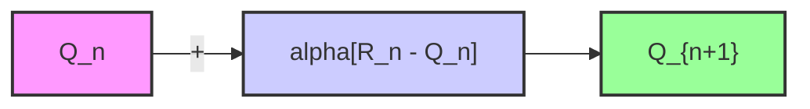
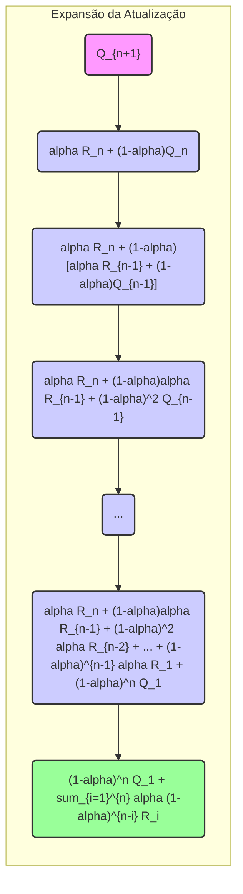
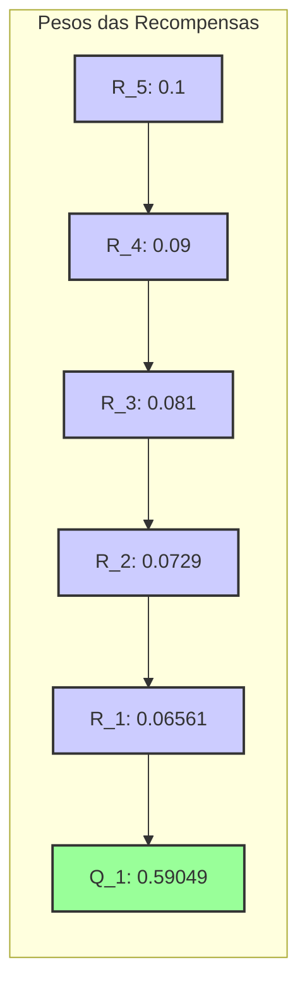

## Rastreamento de Problemas Não Estacionários: Média de Recência Ponderada Exponencial

### Introdução
No contexto de **multi-armed bandits**, a capacidade de lidar com problemas não estacionários é crucial para o sucesso do aprendizado por reforço [1]. Problemas não estacionários são aqueles onde as probabilidades de recompensa associadas a cada ação mudam ao longo do tempo, o que torna inadequado o uso de métodos que dão igual importância a todas as recompensas passadas [2]. Essa seção explora uma abordagem para lidar com não estacionariedade, que envolve dar mais peso às recompensas recentes do que às recompensas mais antigas. Uma maneira popular de alcançar isso é utilizando uma média de recência ponderada exponencial [2].

### Conceitos Fundamentais

Para entender a média de recência ponderada exponencial, é fundamental revisitar a atualização incremental de valores de ação. A forma incremental original, que considera todas as recompensas até o momento, calcula a média de todas as recompensas recebidas para cada ação [2]:
$$
    Q_n = \frac{R_1 + R_2 + \ldots + R_{n-1}}{n-1}.
$$
Onde $Q_n$ é a estimativa do valor da ação após $n-1$ vezes que ela foi selecionada e $R_i$ é a recompensa recebida na $i$-ésima seleção da ação. No entanto, essa média simples não é ideal em cenários não estacionários, onde as recompensas mais recentes são mais relevantes [2].

> 💡 **Exemplo Numérico:** Considere uma ação que foi selecionada 4 vezes com as recompensas [2, 4, 6, 8]. Usando a média simples, a estimativa do valor da ação após 4 seleções é $Q_5 = \frac{2+4+6+8}{4} = 5$. No entanto, se as recompensas mais recentes são mais importantes, esta média pode não refletir o valor atual da ação.

Uma forma de abordar este problema é modificar a regra de atualização incremental usando um parâmetro de tamanho de passo constante, denotado por $\alpha$, onde $\alpha \in (0, 1]$ [2]:

$$
    Q_{n+1} = Q_n + \alpha[R_n - Q_n].
$$
Esta fórmula dá maior peso à recompensa mais recente, $R_n$, do que às recompensas passadas. Este processo resulta em $Q_{n+1}$ ser uma média ponderada das recompensas passadas e da estimativa inicial $Q_1$. Expandindo a fórmula, podemos ver que ela pode ser expressa como [2]:

$$
  \begin{aligned}
    Q_{n+1} &= Q_n + \alpha [R_n - Q_n] \\
    &= \alpha R_n + (1-\alpha)Q_n \\
    &= \alpha R_n + (1-\alpha)[\alpha R_{n-1} + (1-\alpha)Q_{n-1}] \\
    &= \alpha R_n + (1-\alpha)\alpha R_{n-1} + (1-\alpha)^2 Q_{n-1} \\
    &= \alpha R_n + (1-\alpha)\alpha R_{n-1} + (1-\alpha)^2 [\alpha R_{n-2} + (1-\alpha)Q_{n-2}] \\
    &= \ldots \\
    &= \alpha R_n + (1-\alpha)\alpha R_{n-1} + (1-\alpha)^2 \alpha R_{n-2} + \ldots + (1-\alpha)^{n-1} \alpha R_1 + (1-\alpha)^n Q_1 \\
    &= (1-\alpha)^n Q_1 + \sum_{i=1}^{n} \alpha (1-\alpha)^{n-i} R_i.
\end{aligned}
$$
Esta equação mostra que a atualização de $Q_{n+1}$ é uma média ponderada das recompensas passadas, onde o peso da recompensa $R_i$ é dado por $\alpha(1-\alpha)^{n-i}$. O termo $(1-\alpha)^n$ representa o peso da estimativa inicial $Q_1$ [2].

> 💡 **Exemplo Numérico:** Usando as mesmas recompensas [2, 4, 6, 8] e $\alpha=0.2$, assumindo que $Q_1=0$, vamos calcular $Q_2$ até $Q_5$:
> - $Q_2 = 0 + 0.2 * (2-0) = 0.4$
> - $Q_3 = 0.4 + 0.2 * (4 - 0.4) = 0.4 + 0.72 = 1.12$
> - $Q_4 = 1.12 + 0.2 * (6 - 1.12) = 1.12 + 0.976 = 2.096$
> - $Q_5 = 2.096 + 0.2 * (8 - 2.096) = 2.096 + 1.1808 = 3.2768$
> Observe que $Q_5$ (3.2768) é menor que a média simples (5) e dá mais peso às recompensas recentes.

**Média de Recência Ponderada Exponencial**

A expressão acima é o que se denomina de média de recência ponderada exponencial [2]. O termo "exponencial" surge porque o peso atribuído a cada recompensa decresce exponencialmente conforme a recompensa se torna mais antiga, devido à presença do termo $(1-\alpha)^{n-i}$ [2]. As recompensas mais recentes têm um peso maior, permitindo que o algoritmo se adapte mais rapidamente às mudanças nas probabilidades de recompensa. O peso da recompensa $R_i$ é $\alpha(1-\alpha)^{n-i}$, que decresce à medida que o intervalo de tempo $n-i$ aumenta [2]. Este decaimento exponencial garante que o algoritmo foque mais nas mudanças recentes de recompensa.

> 💡 **Exemplo Numérico:** Consideremos $\alpha = 0.1$ e $n=5$.  O peso da recompensa $R_5$ é $0.1*(1-0.1)^{5-5} = 0.1$. O peso de $R_4$ é $0.1*(1-0.1)^{5-4} = 0.09$. O peso de $R_3$ é $0.1*(1-0.1)^{5-3} = 0.081$. O peso de $R_2$ é $0.1*(1-0.1)^{5-2} = 0.0729$ e $R_1$ é $0.1*(1-0.1)^{5-1} = 0.06561$. Já o peso de $Q_1$ é $(1-0.1)^5 = 0.59049$. Observe como os pesos diminuem exponencialmente à medida que as recompensas ficam mais antigas.

O parâmetro $\alpha$ controla o quanto o algoritmo valoriza as recompensas recentes em comparação com as recompensas passadas [2]. Se $\alpha$ for próximo de 1, o algoritmo dará muito peso às recompensas recentes e rapidamente se adaptará às mudanças no ambiente. Por outro lado, se $\alpha$ for próximo de 0, o algoritmo dará mais peso às recompensas mais antigas e se adaptará mais lentamente. Se $\alpha = 1$, toda a ponderação recai sobre a recompensa mais recente, $R_n$ [2].

**Proposição 1:** A média de recência ponderada exponencial pode ser expressa de forma recursiva.

**Declaração:** A média de recência ponderada exponencial $Q_{n+1}$ pode ser expressa como uma combinação linear da recompensa mais recente $R_n$ e da estimativa anterior $Q_n$, ou seja, $Q_{n+1} = (1-\alpha)Q_n + \alpha R_n$.

**Prova:**  Esta expressão já foi estabelecida anteriormente na derivação de $Q_{n+1}$.  Ela surge diretamente da regra de atualização incremental com um tamanho de passo constante $\alpha$.  A recursividade é evidente pois $Q_{n+1}$ é definido em termos de $Q_n$ e $R_n$.  Essa forma recursiva é computacionalmente eficiente, uma vez que não requer o armazenamento e o processamento de todas as recompensas passadas.
$\blacksquare$

> 💡 **Exemplo Numérico:** Usando o exemplo anterior, onde $Q_4 = 2.096$ e $R_4 = 6$, com $\alpha = 0.2$ podemos calcular $Q_5$ recursivamente: $Q_5 = (1-0.2) * 2.096 + 0.2 * 8 = 0.8 * 2.096 + 1.6 = 1.6768 + 1.6 = 3.2768$. O mesmo valor obtido anteriormente.

**Lema 1:** A soma dos pesos da média de recência ponderada exponencial é igual a 1.

**Declaração:** A soma dos pesos associados às recompensas $R_i$ e à estimativa inicial $Q_1$ na média de recência ponderada exponencial é igual a 1.

**Prova:** A soma dos pesos é dada por
$$ (1-\alpha)^n + \sum_{i=1}^n \alpha (1-\alpha)^{n-i}.$$
Podemos reescrever a soma como
$$ (1-\alpha)^n + \alpha \sum_{i=1}^n  (1-\alpha)^{n-i}.$$
Seja $j = n-i$. Então, quando $i=1$, $j=n-1$ e quando $i=n$, $j=0$. Assim,
$$ (1-\alpha)^n + \alpha \sum_{j=0}^{n-1} (1-\alpha)^{j}.$$
A soma $\sum_{j=0}^{n-1} (1-\alpha)^{j}$ é uma soma geométrica, que é igual a $\frac{1-(1-\alpha)^n}{1-(1-\alpha)} = \frac{1-(1-\alpha)^n}{\alpha}$. Portanto, a soma dos pesos é
$$ (1-\alpha)^n + \alpha \frac{1-(1-\alpha)^n}{\alpha} = (1-\alpha)^n + 1 - (1-\alpha)^n = 1.$$
$\blacksquare$

> 💡 **Exemplo Numérico:** No exemplo com $\alpha=0.1$ e $n=5$, a soma dos pesos é $0.59049 + 0.06561 + 0.0729 + 0.081 + 0.09 + 0.1 = 1.0$

**Lema 1.1:**  O peso da estimativa inicial $Q_1$ decresce exponencialmente com o número de iterações.

**Declaração:**  O peso atribuído à estimativa inicial $Q_1$ na média de recência ponderada exponencial, dado por $(1-\alpha)^n$, decresce exponencialmente conforme $n$ aumenta, se $\alpha \in (0,1)$.

**Prova:** Como $\alpha \in (0,1)$, temos que $0 < 1-\alpha < 1$.  Portanto, a função $f(n) = (1-\alpha)^n$ é uma função exponencial decrescente de $n$.  À medida que $n$ cresce, $(1-\alpha)^n$ se aproxima de zero, demonstrando que o peso de $Q_1$ diminui exponencialmente com o tempo.
$\blacksquare$

> 💡 **Exemplo Numérico:** Com $\alpha = 0.2$, o peso de $Q_1$ em $n=1$ é $(1-0.2)^1=0.8$. Em $n=5$, $(1-0.2)^5=0.32768$. Em $n=10$, $(1-0.2)^{10}=0.10737$. Observe como o peso de $Q_1$ decresce exponencialmente.

**Corolário 1:** Se $\alpha = 0$, então o peso é concentrado na estimativa inicial $Q_1$, e todas as recompensas são ignoradas.

**Declaração:** Se o parâmetro de tamanho de passo $\alpha$ for igual a 0, o peso de cada recompensa $R_i$ é igual a 0 e o peso da estimativa inicial $Q_1$ é igual a 1.

**Prova:** Da equação da média de recência ponderada exponencial, temos
$$ (1-\alpha)^n Q_1 + \sum_{i=1}^{n} \alpha (1-\alpha)^{n-i} R_i.$$
Se $\alpha = 0$, então $(1-\alpha)^n = (1-0)^n = 1$ e $\alpha (1-\alpha)^{n-i} = 0$ para todo $i$. Portanto, a equação se torna
$$ 1\cdot Q_1 + \sum_{i=1}^{n} 0 \cdot R_i = Q_1.$$
$\blacksquare$

> 💡 **Exemplo Numérico:** Se $\alpha = 0$ e $Q_1 = 5$, então, independentemente das recompensas $R_i$,  $Q_{n+1}$ sempre será igual a $5$, significando que o agente não aprende e ignora todas as recompensas.

**Corolário 1.1:** Se $\alpha = 1$, então a estimativa $Q_{n+1}$ é igual à recompensa mais recente $R_n$ e todas as recompensas anteriores são ignoradas.

**Declaração:** Se o parâmetro de tamanho de passo $\alpha$ for igual a 1, o peso da recompensa mais recente $R_n$ é 1 e o peso de todas as outras recompensas $R_i$ com $i < n$ e da estimativa inicial $Q_1$ é 0.

**Prova:** Usando a forma recursiva da média ponderada exponencial,  $Q_{n+1} = (1-\alpha)Q_n + \alpha R_n$. Se $\alpha = 1$, então $Q_{n+1} = (1-1)Q_n + 1 \cdot R_n = R_n$.  Analisando a forma expandida, com $\alpha = 1$, temos
$Q_{n+1} =  (1-1)^n Q_1 + \sum_{i=1}^{n} 1 (1-1)^{n-i} R_i$.  Para $i=n$, $(1-1)^{n-n} = 1$ e para qualquer $i<n$ o termo $(1-1)^{n-i} = 0$, resultando em $Q_{n+1} = R_n$.
$\blacksquare$

> 💡 **Exemplo Numérico:** Se $\alpha = 1$, e as recompensas são $R_1=2$, $R_2=4$, $R_3=6$ e $R_4=8$, então $Q_2=2$, $Q_3=4$, $Q_4=6$ e $Q_5=8$. O valor de ação sempre reflete a recompensa mais recente.

### Conclusão
A média de recência ponderada exponencial é um método importante para adaptar algoritmos de aprendizado por reforço a ambientes não estacionários. Atribuindo pesos diferentes às recompensas passadas, com maior peso às recompensas mais recentes, essa abordagem permite que o agente aprenda e se adapte rapidamente a mudanças no ambiente, garantindo um desempenho mais robusto em cenários dinâmicos. O parâmetro $\alpha$ é fundamental, e sua escolha influencia diretamente a capacidade de adaptação do algoritmo.

### Referências
[^1]: "The most important feature distinguishing reinforcement learning from other types of learning is that it uses training information that evaluates the actions taken rather than instructs by giving correct actions." *(Multi-armed Bandits)*
[^2]: "One of the most popular ways of doing this is to use a constant step-size parameter. For example, the incremental update rule (2.3) for updating an average Qn of the n – 1 past rewards is modified to be Qn+1 = Qn + a[Rn - Qn], where the step-size parameter a ∈ (0, 1] is constant. This results in Qn+1 being a weighted average of past rewards and the initial estimate Q1" *(Multi-armed Bandits)*
