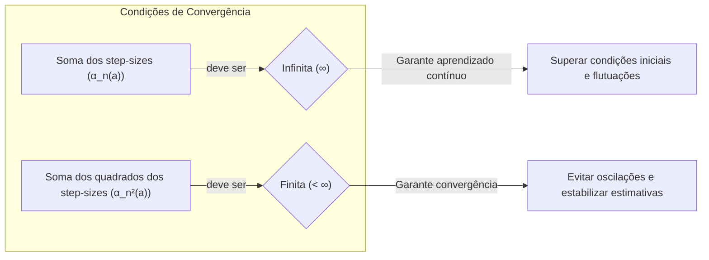
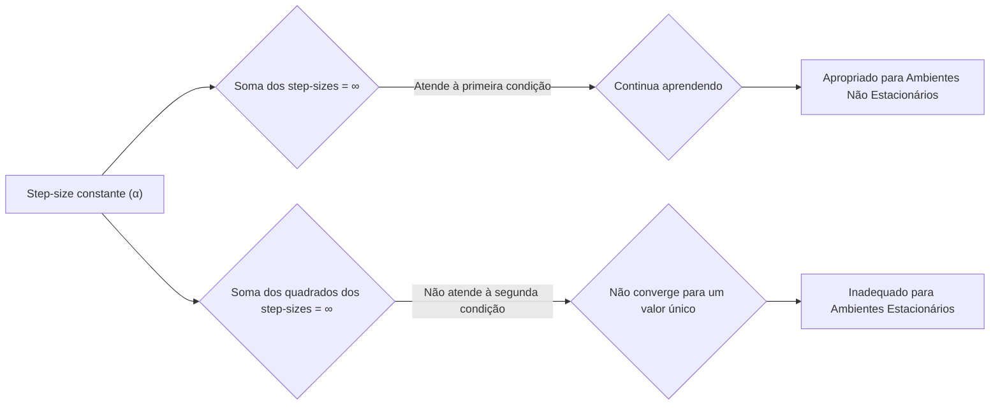
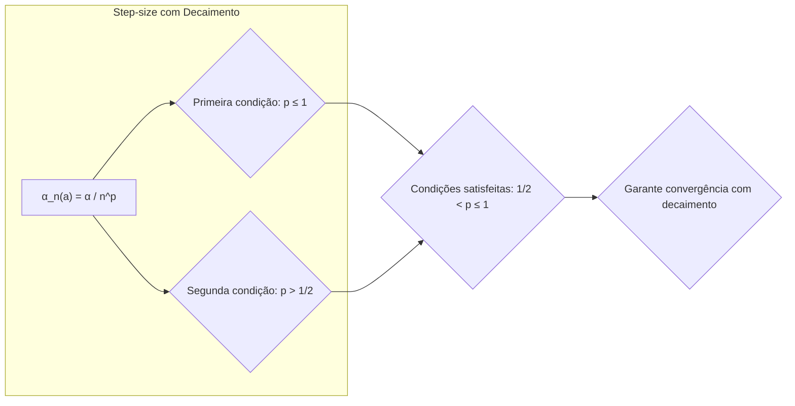
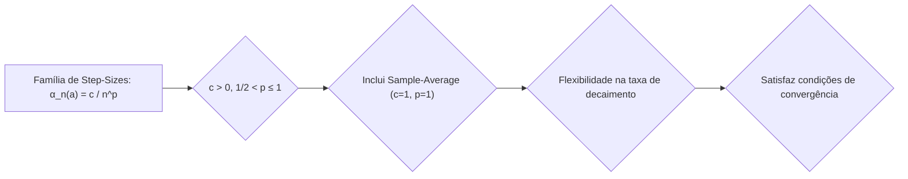

## Rastreamento de Problemas Não Estacionários: Condições de Convergência para Step-Sizes

### Introdução
Em problemas de **reinforcement learning**, frequentemente nos deparamos com ambientes *não estacionários*, onde as probabilidades de recompensa não permanecem constantes ao longo do tempo [^1]. Nesses cenários, é crucial que os algoritmos de aprendizado atribuam maior peso às recompensas mais recentes, em detrimento das mais antigas [^1]. Para lidar com essa não estacionariedade, é comum utilizar um **step-size** (tamanho do passo) constante em vez de médias amostrais, o que introduz um viés permanente nas estimativas de valores de ação, embora esse viés diminua com o tempo [^1]. No entanto, ao utilizar step-sizes variáveis, é essencial garantir que o algoritmo convirja para valores de ação precisos com o decorrer do tempo. Esta seção explorará as condições matemáticas necessárias para assegurar essa convergência, com foco nas propriedades do step-size variável $\alpha_n(a)$.

### Conceitos Fundamentais
A base para rastrear problemas não estacionários reside na utilização de um *step-size constante* (α), onde a atualização da estimativa de valor de ação $Q_{n+1}$ para o passo *n*, dada uma recompensa $R_n$, é dada por [^1]:

$$Q_{n+1} = Q_n + \alpha[R_n - Q_n]$$

Essa formulação pondera exponencialmente as recompensas passadas, atribuindo maior importância às mais recentes [^1]. No entanto, quando se utiliza um step-size constante, as estimativas nunca convergem completamente e continuam a variar em resposta às recompensas mais recentes [^1]. Para garantir que as estimativas convirjam, mesmo com step-sizes variáveis, é necessário que a sequência de step-sizes $\{\alpha_n(a)\}$ atenda a certas condições [^1]. Uma maneira de modelar o step-size é usando $\alpha_n(a)$, que representa o step-size usado no processamento da n-ésima recompensa para a ação a [^1].

**Lemma 1**: *Condições de Convergência para Step-Sizes Variáveis*

A condição necessária e suficiente para que as estimativas convirjam com probabilidade 1, quando se utilizam step-sizes variáveis $\{\alpha_n(a)\}$, é que a sequência de step-sizes satisfaça as seguintes condições [^1]:

$$ \sum_{n=1}^{\infty} \alpha_n(a) = \infty \quad \text{e} \quad \sum_{n=1}^{\infty} \alpha_n^2(a) < \infty \qquad (2.7)$$



**Prova**:

*   A primeira condição, $\sum_{n=1}^{\infty} \alpha_n(a) = \infty$, garante que os passos sejam grandes o suficiente para superar as condições iniciais e flutuações aleatórias [^1]. Se a soma dos step-sizes fosse finita, o algoritmo poderia parar de aprender antes de atingir uma solução ótima ou precisa, ficando preso em um valor subótimo. Em outras palavras, essa condição garante que o algoritmo continue aprendendo e se adaptando ao longo do tempo, explorando as possíveis ações e ajustando suas estimativas de valor com base nas recompensas recebidas.

*   A segunda condição, $\sum_{n=1}^{\infty} \alpha_n^2(a) < \infty$, garante que os passos se tornem pequenos o suficiente para assegurar a convergência [^1]. A soma dos quadrados dos step-sizes deve ser finita. Caso contrário, as variações introduzidas pelos passos nunca se tornariam suficientemente pequenas, e o algoritmo não convergiria para valores de ação estáveis. Esta condição impede que as estimativas de valor oscilem indefinidamente, garantindo que, com o tempo, as estimativas se estabilizem em torno do valor real.

Essas duas condições são essenciais para assegurar que, ao lidar com dados que podem variar ao longo do tempo, o algoritmo seja capaz de aprender e convergir, atingindo estimativas de valor de ação precisas.

> 💡 **Exemplo Numérico:** Para ilustrar a primeira condição, considere $\alpha_n = \frac{1}{n}$. A soma $\sum_{n=1}^{\infty} \frac{1}{n}$ é a série harmônica, que diverge para infinito. Isso significa que o algoritmo continua a fazer ajustes significativos ao longo do tempo.  Para a segunda condição, $\sum_{n=1}^{\infty} \left(\frac{1}{n}\right)^2 = \sum_{n=1}^{\infty} \frac{1}{n^2}$ que converge para $\frac{\pi^2}{6} \approx 1.645$. Isso significa que o impacto das atualizações diminui à medida que $n$ aumenta, garantindo que a estimativa se estabilize.
>
>  ```python
> import numpy as np
>
> def harmonic_series(n_terms):
>     return np.sum(1/np.arange(1, n_terms + 1))
>
> def squared_harmonic_series(n_terms):
>     return np.sum(1/(np.arange(1, n_terms + 1)**2))
>
> print(f"Soma da série harmônica até 1000: {harmonic_series(1000):.2f}")
> print(f"Soma da série harmônica ao quadrado até 1000: {squared_harmonic_series(1000):.2f}")
>
> ```
> Este código demonstra que, enquanto a soma da série harmônica cresce indefinidamente, a soma da série harmônica ao quadrado converge para um valor finito, satisfazendo as condições do Lema 1.

**Lema 1.1**: *Implicações da Convergência em Variáveis Aleatórias*

A convergência com probabilidade 1, mencionada no Lema 1, também conhecida como convergência quase certa, implica que a sequência de estimativas $Q_n(a)$ converge para o valor verdadeiro da ação $q_*(a)$ para quase todas as possíveis trajetórias de recompensas e ações. É importante notar que essa convergência não garante uma taxa de convergência específica, apenas a certeza da convergência em longo prazo.

*   **Prova Estratégica:**  Este resultado se apoia em teoremas da teoria de aproximações estocásticas. Essencialmente, as condições sobre $\alpha_n(a)$ garantem que o algoritmo faça passos suficientes para escapar de mínimos locais (primeira condição) e que, ao mesmo tempo, os passos se tornem pequenos o suficiente para evitar oscilações em torno da solução (segunda condição).

**Corolário 1**: *Step-size constante e suas implicações*

A escolha de um *step-size constante* $\alpha_n(a) = \alpha$ satisfaz a primeira condição da equação (2.7) (pois $\sum_{n=1}^\infty \alpha = \infty$), mas não a segunda (pois $\sum_{n=1}^\infty \alpha^2 = \infty$), indicando que as estimativas não convergem completamente, mas continuam a se adaptar às recompensas mais recentes [^1]. Essa propriedade é desejável em ambientes não estacionários, mas não é adequada para ambientes estacionários, nos quais a convergência para o valor verdadeiro é necessária.



> 💡 **Exemplo Numérico:** Se $\alpha = 0.1$, então $\sum_{n=1}^{\infty} 0.1 = \infty$.  A segunda condição $\sum_{n=1}^{\infty} 0.1^2 = \sum_{n=1}^{\infty} 0.01$ também diverge. Isso ilustra por que um step-size constante não garante convergência em termos teóricos para um valor único, mas permite adaptação contínua às recompensas em ambientes não estacionários. Na prática, a estimativa $Q_n$ irá oscilar em torno do valor real, mas estará sempre pronta para se ajustar a novas mudanças no ambiente.

**Corolário 1.1**: *Step-size constante com decaimento*

Podemos estender a análise do step-size constante considerando uma variação onde ele decai com o tempo, por exemplo, $\alpha_n(a) = \frac{\alpha}{n^p}$, onde $\alpha$ é uma constante positiva e $p$ é um parâmetro. Para $p > 0$, a primeira condição de convergência ($\sum_{n=1}^{\infty} \alpha_n(a) = \infty$)  é satisfeita se $p \leq 1$. A segunda condição ($\sum_{n=1}^{\infty} \alpha_n^2(a) < \infty$)  é satisfeita se $2p > 1$, ou seja, $p > 1/2$. Portanto, para que ambas as condições sejam satisfeitas, devemos ter $\frac{1}{2} < p \leq 1$. Isso demonstra que é possível obter convergência, mesmo com um step-size que decai, desde que o decaimento seja lento o suficiente para satisfazer a primeira condição e rápido o suficiente para satisfazer a segunda.



> 💡 **Exemplo Numérico:**  Considerando $\alpha = 0.5$ e $p=0.75$. Então $\alpha_n = \frac{0.5}{n^{0.75}}$. Para a primeira condição, a série $\sum_{n=1}^\infty \frac{0.5}{n^{0.75}}$ diverge (pois $0.75 \leq 1$). Para a segunda, $\sum_{n=1}^\infty \left(\frac{0.5}{n^{0.75}}\right)^2 = \sum_{n=1}^\infty \frac{0.25}{n^{1.5}}$ converge (pois $1.5 > 1$). Este caso satisfaz as condições de convergência do Lema 1.
>
>  ```python
> import numpy as np
>
> def decaying_step_size_sum(alpha, p, n_terms):
>   step_sizes = alpha / (np.arange(1, n_terms + 1)**p)
>   return np.sum(step_sizes), np.sum(step_sizes**2)
>
> alpha = 0.5
> p = 0.75
> sum_alpha, sum_alpha_squared = decaying_step_size_sum(alpha, p, 1000)
> print(f"Soma de alpha_n até 1000: {sum_alpha:.2f}")
> print(f"Soma de alpha_n ao quadrado até 1000: {sum_alpha_squared:.2f}")
>
> alpha = 0.5
> p = 0.5
> sum_alpha, sum_alpha_squared = decaying_step_size_sum(alpha, p, 1000)
> print(f"Soma de alpha_n até 1000 (p=0.5): {sum_alpha:.2f}")
> print(f"Soma de alpha_n ao quadrado até 1000 (p=0.5): {sum_alpha_squared:.2f}")
>
> ```
>
> Este exemplo mostra que, ao escolher um valor apropriado de *p*, garantimos que a soma dos step-sizes seja infinita (permitindo que o algoritmo explore e se ajuste) e a soma dos quadrados dos step-sizes seja finita (garantindo a convergência para um valor estável). Se $p=0.5$, a soma dos quadrados diverge, ilustrando um caso onde as condições de convergência não são satisfeitas.

**Corolário 2**: *Step-size para Sample-Average Method*

No método *sample-average*, o step-size é definido como $\alpha_n(a) = \frac{1}{n}$, onde *n* é o número de vezes que a ação *a* foi selecionada [^1]. Essa escolha satisfaz ambas as condições em (2.7): $\sum_{n=1}^{\infty} \frac{1}{n} = \infty$ (série harmônica) e $\sum_{n=1}^{\infty} \frac{1}{n^2} < \infty$ (série p-harmônica com p=2). Portanto, o método sample-average garante a convergência para os valores verdadeiros das ações em cenários estacionários.

> 💡 **Exemplo Numérico:**  Se a ação 'a' foi selecionada 4 vezes, os step-sizes seriam: 1, 1/2, 1/3, 1/4.  A soma dessas séries é infinita (primeira condição), e a soma dos seus quadrados é finita (segunda condição). Isso assegura que as estimativas dos valores de ação convirjam ao longo do tempo.

**Proposição 1**: *Família de Step-Sizes que Satisfazem as Condições de Convergência*

Uma família de step-sizes que satisfaz as condições (2.7) é dada por $\alpha_n(a) = \frac{c}{n^p}$, onde *c* é uma constante positiva, e $1/2 < p \leq 1$.  Essa família de step-sizes inclui o método sample-average (com $c=1$ e $p=1$) e oferece uma flexibilidade para ajustar a taxa de decaimento dos step-sizes.



*   **Prova Estratégica:**  Podemos provar a proposição usando o teste da integral para avaliar a convergência das séries. Para que $\sum_{n=1}^{\infty} \frac{c}{n^p}$ seja infinita, devemos ter $p \leq 1$. Já para que $\sum_{n=1}^{\infty} \frac{c^2}{n^{2p}}$ seja finita, devemos ter $2p > 1$, o que implica $p > 1/2$. Portanto, $1/2 < p \leq 1$ garante o cumprimento de ambas as condições.

> 💡 **Exemplo Numérico:** Se $c=2$ e $p=0.8$, então $\alpha_n = \frac{2}{n^{0.8}}$. A série $\sum_{n=1}^\infty \frac{2}{n^{0.8}}$ diverge (pois $0.8 \leq 1$), enquanto $\sum_{n=1}^\infty \left(\frac{2}{n^{0.8}}\right)^2 = \sum_{n=1}^\infty \frac{4}{n^{1.6}}$ converge (pois $1.6 > 1$).  Este caso também satisfaz as condições de convergência. A constante *c* permite ajustar a magnitude inicial dos step-sizes, enquanto *p* controla a taxa de decaimento ao longo do tempo.

### Conclusão
O rastreamento eficaz de problemas não estacionários em reinforcement learning exige um balanceamento cuidadoso entre a adaptação a novas informações e a convergência para valores de ação estáveis. As condições para a convergência dos step-sizes variáveis, expressas por $\sum_{n=1}^{\infty} \alpha_n(a) = \infty$ e $\sum_{n=1}^{\infty} \alpha_n^2(a) < \infty$, fornecem uma base teórica para esse balanço. Embora um step-size constante ofereça adaptação rápida às mudanças, ele não garante convergência completa, tornando-o adequado para ambientes não estacionários. Por outro lado, o método sample-average, embora garanta a convergência em ambientes estacionários, pode ser menos eficiente em ambientes não estacionários, devido à sua menor capacidade de adaptação às informações mais recentes. A escolha do step-size adequado, portanto, deve ser orientada pelas características específicas do problema e seus objetivos de aprendizado.

### Referências
[^1]: "The averaging methods discussed so far are appropriate for stationary bandit problems, that is, for bandit problems in which the reward probabilities do not change over time. As noted earlier, we often encounter reinforcement learning problems that are effectively nonstationary. In such cases it makes sense to give more weight to recent rewards than to long-past rewards. One of the most popular ways of doing this is to use a constant step-size parameter. For example, the incremental update rule (2.3) for updating an average $Q_n$ of the n − 1 past rewards is modified to be
$Q_{n+1} = Q_n + \alpha[R_n - Q_n]$,
(2.5)
where the step-size parameter $\alpha \in (0, 1]$ is constant. This results in $Q_{n+1}$ being a weighted average of past rewards and the initial estimate $Q_1$:
$Q_{n+1} = Q_n + \alpha[R_n - Q_n]$
$= \alpha R_n + (1 - \alpha)Q_n$
$= \alpha R_n + (1 - \alpha) [\alpha R_{n-1} + (1 - \alpha)Q_{n-1}]$
$= \alpha R_n + (1 - \alpha) \alpha R_{n-1} + (1 - \alpha)^2 Q_{n-1}$
$= \alpha R_n + (1 - \alpha) \alpha R_{n-1} + (1 - \alpha)^2 \alpha R_{n-2} + \ldots + (1 - \alpha)^{n-1} \alpha R_1 + (1 - \alpha)^n Q_1$
$=(1-\alpha)^nQ_1+\sum_{i=1}^n\alpha(1-\alpha)^{n-i}R_i$
(2.6)
We call this a weighted average because the sum of the weights is $(1-\alpha)^n+\sum_{i=1}^n \alpha(1-\alpha)^{n-i} = 1$, as you can check for yourself. Note that the weight, $\alpha(1 - \alpha)^{n-i}$, given to the reward $R_i$ depends on how many rewards ago, $n - i$, it was observed. The quantity $1-\alpha$ is less than 1, and thus the weight given to $R_i$ decreases as the number of intervening rewards increases. In fact, the weight decays exponentially according to the exponent on $1-\alpha$. (If $1-\alpha=0$, then all the weight goes on the very last reward, $R_n$, because of the convention that $0^0=1$.) Accordingly, this is sometimes called an exponential recency-weighted average.
Sometimes it is convenient to vary the step-size parameter from step to step. Let $\alpha_n(a)$ denote the step-size parameter used to process the reward received after the $n$th selection of action $a$. As we have noted, the choice $\alpha_n(a) = \frac{1}{n}$ results in the sample-average method, which is guaranteed to converge to the true action values by the law of large numbers. But of course convergence is not guaranteed for all choices of the sequence {$\alpha_n(a)$}. A well-known result in stochastic approximation theory gives us the conditions required to assure convergence with probability 1:
$\sum_{n=1}^{\infty} \alpha_n(a) = \infty$ and $\sum_{n=1}^{\infty} \alpha_n^2(a) < \infty$ (2.7)
The first condition is required to guarantee that the steps are large enough to eventually overcome any initial conditions or random fluctuations. The second condition guarantees that eventually the steps become small enough to assure convergence." *(Trecho de <Chapter 2: Multi-armed Bandits>)*
