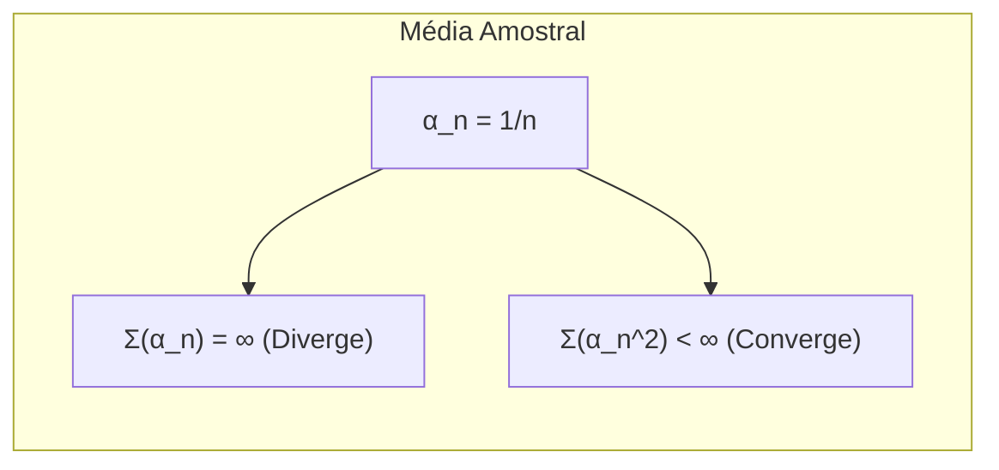
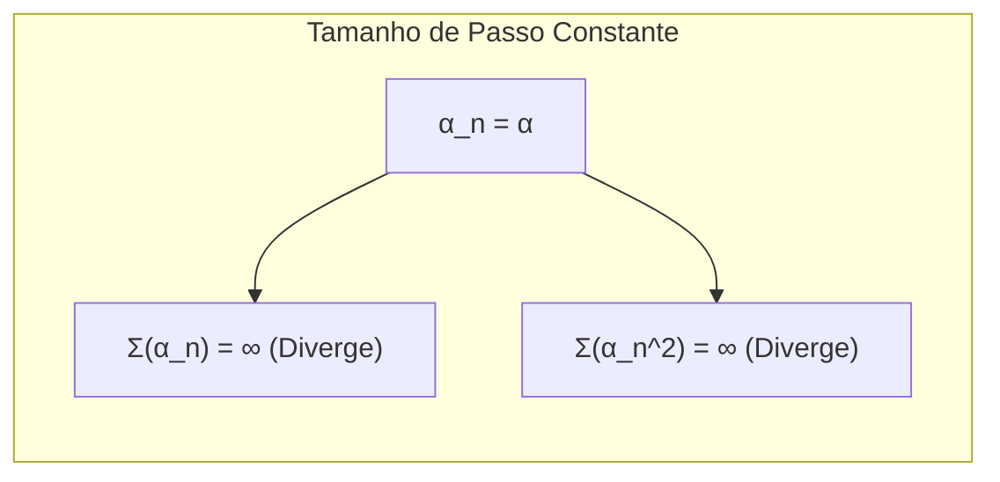

### Rastreamento de um Problema Não Estacionário: Condições de Convergência

### Introdução
Este capítulo explora o conceito de **multi-armed bandits**, focando particularmente em problemas não estacionários, onde as recompensas de cada ação podem mudar ao longo do tempo [1](https://chatgpt.com/c/67829922-359c-8011-96dd-970c04ed772c#user-content-fn-1). Em contraste com cenários estacionários, onde as estatísticas das recompensas permanecem constantes, os problemas não estacionários exigem que os algoritmos de aprendizagem se adaptem às mudanças dinâmicas nas distribuições de recompensa. Isso leva à necessidade de métodos que deem mais peso às recompensas recentes, ao invés de longas recompensas do passado. Especificamente, o presente tópico se aprofunda nas condições de convergência, demonstrando como elas são atendidas para a média amostral, mas não para o tamanho de passo constante, explorando as implicações desta diferença.

### Conceitos Fundamentais
#### Média Amostral e o Método do Tamanho de Passo Constante
Em problemas estacionários, a **média amostral** é um método natural para estimar os valores das ações, em que a estimativa é calculada como a média de todas as recompensas recebidas até o momento. Formalmente, a estimativa de valor $Q_t(a)$ para uma ação $a$ no instante $t$ é definida como:

$$ Q_t(a) = \frac{\text{soma das recompensas quando } a \text{ foi selecionada antes de } t}{\text{número de vezes que } a \text{ foi selecionada antes de } t} = \frac{\sum_{i=1}^{t-1} R_i \mathbb{1}_{A_i=a}}{\sum_{i=1}^{t-1} \mathbb{1}_{A_i=a}} $$
onde $R_i$ é a recompensa recebida no instante $i$, e $\mathbb{1}_{A_i=a}$ é uma função indicadora que vale 1 se a ação $a$ foi selecionada no instante $i$ e 0 caso contrário [3](https://chatgpt.com/c/67829922-359c-8011-96dd-970c04ed772c#user-content-fn-3). Se o denominador for zero, definimos $Q_t(a)$ como um valor padrão, por exemplo, 0. O método da **média amostral** garante que $Q_t(a)$ convirja para o valor verdadeiro $q_*(a)$ conforme o número de amostras tende ao infinito, pela lei dos grandes números [3](https://chatgpt.com/c/67829922-359c-8011-96dd-970c04ed772c#user-content-fn-3).

> 💡 **Exemplo Numérico:** Considere um cenário com uma única ação ($a$) que foi selecionada 5 vezes. As recompensas obtidas foram: 1, 3, 2, 4, 5. Usando a média amostral, a estimativa do valor da ação no instante $t=6$ seria:
>
> $Q_6(a) = \frac{1 + 3 + 2 + 4 + 5}{5} = \frac{15}{5} = 3$.
>
> Este valor representa a média das recompensas até o momento. Se a ação fosse selecionada novamente e rendesse uma recompensa de 6, a nova estimativa seria:
>
> $Q_7(a) = \frac{1 + 3 + 2 + 4 + 5 + 6}{6} = \frac{21}{6} = 3.5$.
>
> Observamos que a estimativa se ajusta lentamente à medida que mais recompensas são obtidas.

Por outro lado, em problemas não estacionários, é vantajoso dar mais peso às recompensas recentes. Uma forma comum de fazer isso é usar um **tamanho de passo constante**, dado por:

```mermaid
graph LR
    A["Q_n (Estimativa Atual)"] -->| "Recompensa R_n" | B("R_n - Q_n (Erro de Previsão)")
    B -->| "Taxa de Aprendizagem α" | C("α * (R_n - Q_n)")
    C --> D["Q_{n+1} (Nova Estimativa)"];
    A --> D
    style A fill:#f9f,stroke:#333,stroke-width:2px
    style D fill:#ccf,stroke:#333,stroke-width:2px
```

$$ Q_{n+1} = Q_n + \alpha [R_n - Q_n] $$

onde $\alpha \in (0, 1]$ é uma constante, $R_n$ é a recompensa recebida no n-ésimo instante, e $Q_n$ é a estimativa de valor atualizada [8](https://chatgpt.com/c/67829922-359c-8011-96dd-970c04ed772c#user-content-fn-8). Esta abordagem resulta em uma média ponderada das recompensas passadas, onde recompensas mais recentes têm um peso exponencialmente maior do que recompensas mais antigas [8](https://chatgpt.com/c/67829922-359c-8011-96dd-970c04ed772c#user-content-fn-8).

> 💡 **Exemplo Numérico:** Usando o mesmo cenário anterior, vamos supor um tamanho de passo constante $\alpha = 0.1$ e um valor inicial $Q_1(a) = 0$. As recompensas são as mesmas: 1, 3, 2, 4, 5. As atualizações seriam:
>
> $Q_2(a) = 0 + 0.1(1 - 0) = 0.1$
> $Q_3(a) = 0.1 + 0.1(3 - 0.1) = 0.1 + 0.1(2.9) = 0.39$
> $Q_4(a) = 0.39 + 0.1(2 - 0.39) = 0.39 + 0.1(1.61) = 0.551$
> $Q_5(a) = 0.551 + 0.1(4 - 0.551) = 0.551 + 0.1(3.449) = 0.8959$
> $Q_6(a) = 0.8959 + 0.1(5 - 0.8959) = 0.8959 + 0.1(4.1041) = 1.30631$
>
> Notamos que, ao contrário da média amostral, o valor se ajusta mais rapidamente às novas recompensas. Se, após a sexta ação, a recompensa caísse para 0, a atualização seria:
>
> $Q_7(a) = 1.30631 + 0.1(0 - 1.30631) = 1.30631 - 0.130631 = 1.175679$.
>
> Podemos observar que a estimativa é mais sensível às mudanças e não mantém as recompensas antigas com tanta influência como a média amostral.

**Proposição 1:** A atualização do tamanho de passo constante pode ser expressa como uma média ponderada exponencial das recompensas.

*Demonstração:*
Podemos expandir recursivamente a atualização do tamanho de passo constante:
\begin{align*}
Q_{n+1} &= Q_n + \alpha[R_n - Q_n] \\
&= \alpha R_n + (1-\alpha)Q_n \\
&= \alpha R_n + (1-\alpha)(\alpha R_{n-1} + (1-\alpha)Q_{n-1}) \\
&= \alpha R_n + \alpha(1-\alpha)R_{n-1} + (1-\alpha)^2 Q_{n-1} \\
&= \alpha R_n + \alpha(1-\alpha)R_{n-1} + \alpha(1-\alpha)^2 R_{n-2} + \dots + (1-\alpha)^n Q_1
\end{align*}
Portanto, podemos observar que $Q_{n+1}$ é uma média ponderada das recompensas anteriores onde o peso da recompensa $R_i$ é dado por $\alpha(1-\alpha)^{n-i}$. As recompensas mais recentes têm um peso exponencialmente maior, uma vez que $(1-\alpha)$ é menor que 1.

> 💡 **Exemplo Numérico:** Vamos usar novamente $\alpha = 0.1$. Se examinarmos os pesos das recompensas, vemos que a última recompensa $R_n$ tem peso $\alpha = 0.1$, a penúltima $R_{n-1}$ tem peso $\alpha(1-\alpha) = 0.1 \times 0.9 = 0.09$, a antepenúltima $R_{n-2}$ tem peso $\alpha(1-\alpha)^2 = 0.1 \times 0.9^2 = 0.081$, e assim por diante. As recompensas mais antigas rapidamente perdem importância na estimativa de $Q_{n+1}$. Isso é crucial em ambientes não estacionários onde as recompensas passadas podem não ser relevantes para as recompensas futuras.

#### Condições de Convergência
A convergência de um algoritmo de aprendizagem para os valores reais das ações é crucial. Uma análise teórica da convergência no contexto da aproximação estocástica define duas condições necessárias para garantir que as estimativas convirjam com probabilidade 1 [9](https://chatgpt.com/c/67829922-359c-8011-96dd-970c04ed772c#user-content-fn-9):

1.  **Condição de Soma:** A soma dos tamanhos de passo ao longo do tempo deve tender ao infinito. Isso assegura que os passos sejam grandes o suficiente para superar as condições iniciais ou flutuações aleatórias. Formalmente,

    $$ \sum_{n=1}^{\infty} \alpha_n(a) = \infty $$
2. **Condição da Soma dos Quadrados:** A soma dos quadrados dos tamanhos de passo ao longo do tempo deve ser finita. Isso garante que os passos se tornem pequenos o suficiente para garantir a convergência. Formalmente:

    $$ \sum_{n=1}^{\infty} \alpha_n^2(a) < \infty $$
    onde $\alpha_n(a)$ é o parâmetro de tamanho de passo usado para processar a recompensa recebida após a n-ésima seleção da ação $a$.

**Lema 1:** A condição de soma $\sum_{n=1}^{\infty} \alpha_n(a) = \infty$ é necessária para que um algoritmo de atualização de valores possa, em teoria, explorar todo o espaço de possíveis valores de ação.
   *Demonstração:*  Se a soma dos tamanhos de passo fosse finita, a magnitude total das mudanças nos valores de ação seria limitada, independentemente de quantas atualizações fossem feitas. Isso impediria o algoritmo de escapar de valores iniciais subótimos e de se ajustar a mudanças nos valores reais das ações.

#### Análise das Condições de Convergência

No caso da **média amostral**, o parâmetro do tamanho de passo $\alpha_n(a) = \frac{1}{n}$ [9](https://chatgpt.com/c/67829922-359c-8011-96dd-970c04ed772c#user-content-fn-9]. Ambas as condições são satisfeitas:
   -   A soma dos inversos dos inteiros (série harmônica) diverge, satisfazendo a primeira condição [9](https://chatgpt.com/c/67829922-359c-8011-96dd-970c04ed772c#user-content-fn-9].
   -   A soma dos quadrados dos inversos dos inteiros converge, satisfazendo a segunda condição [9](https://chatgpt.com/c/67829922-359c-8011-96dd-970c04ed772c#user-content-fn-9].

> 💡 **Exemplo Numérico:** Para ilustrar a condição de soma com a média amostral, consideremos os primeiros termos da série harmônica: $1 + \frac{1}{2} + \frac{1}{3} + \frac{1}{4} + \ldots$. Se calcularmos a soma dos primeiros 10 termos, obtemos aproximadamente 2.929. A soma dos primeiros 100 termos é aproximadamente 5.187, e dos primeiros 1000 termos é aproximadamente 7.485. Vemos que, embora a soma cresça muito lentamente, ela continua a crescer e, em teoria, diverge para infinito.
>
>  Para ilustrar a condição da soma dos quadrados, consideremos a série $\sum_{n=1}^{\infty} \frac{1}{n^2} = 1 + \frac{1}{4} + \frac{1}{9} + \frac{1}{16} + \ldots$. A soma dos primeiros 10 termos é aproximadamente 1.549, dos primeiros 100 é aproximadamente 1.634, e a soma para um número muito grande de termos se aproxima de $\frac{\pi^2}{6} \approx 1.645$. A série converge para um valor finito, o que atende à segunda condição.



No entanto, para o método do **tamanho de passo constante**, $\alpha_n(a) = \alpha$, onde $\alpha$ é uma constante entre 0 e 1.
   -  A primeira condição é satisfeita, pois a soma de uma constante $\alpha$ ao longo de infinitos instantes diverge.
   - A segunda condição **não** é satisfeita, porque a soma do quadrado de uma constante $\alpha^2$ ao longo de infinitos instantes também diverge.

> 💡 **Exemplo Numérico:** Se $\alpha = 0.1$, a condição de soma é $\sum_{n=1}^{\infty} 0.1 = 0.1 + 0.1 + 0.1 + \ldots$, que diverge para infinito. Já a condição da soma dos quadrados é $\sum_{n=1}^{\infty} 0.1^2 = \sum_{n=1}^{\infty} 0.01 = 0.01 + 0.01 + 0.01 + \ldots$, que também diverge para infinito. Este comportamento impede a convergência da estimativa do valor da ação, o que é intencional em cenários não estacionários para permitir adaptação contínua.



**Observação 1:** É importante ressaltar que a não satisfação da segunda condição de convergência pela atualização do tamanho de passo constante não é necessariamente um problema em contextos não estacionários. De fato, a divergência da soma dos quadrados dos tamanhos de passo é uma característica desejável que permite ao algoritmo manter-se receptivo a mudanças nas recompensas.

Este resultado implica que, embora a média amostral convirja para o valor verdadeiro das ações, o método do tamanho de passo constante não garante tal convergência. Ele continuará variando em resposta a recompensas recentes. O não cumprimento da segunda condição por esse método sinaliza que as estimativas nunca convergem completamente, mas continuam a variar em resposta a recompensas recebidas mais recentemente [9](https://chatgpt.com/c/67829922-359c-8011-96dd-970c04ed772c#user-content-fn-9]. Esse comportamento, embora não conduza à convergência, é desejável em ambientes não estacionários, já que permite que o agente aprenda a se adaptar às mudanças.

**Teorema 1:**  A média amostral, sob condições estacionárias, converge para o valor verdadeiro das ações com probabilidade 1. No entanto, em cenários não estacionários, ela pode se mostrar lenta ou inadequada para adaptação às mudanças nas recompensas, dada a sua característica de atribuir peso uniforme a todas as recompensas observadas.
   *Demonstração:* A convergência da média amostral em condições estacionárias é um resultado direto da Lei dos Grandes Números. No entanto, em problemas não estacionários, as recompensas observadas em um período podem não ser representativas das recompensas em um período posterior, tornando a média amostral uma estimativa inadequada, pois atribui igual peso a todas as recompensas passadas, não priorizando as mais recentes que podem refletir melhor a dinâmica atual do ambiente.

### Conclusão

A análise das condições de convergência revela que a **média amostral** e o **tamanho de passo constante** são abordagens fundamentalmente diferentes para estimar os valores das ações em problemas de multi-armed bandits. Embora a média amostral seja garantidamente convergente em cenários estacionários, ela pode ser inadequada para problemas não estacionários. Por outro lado, o tamanho de passo constante, embora não garanta a convergência das estimativas para valores fixos, permite que o algoritmo se adapte a mudanças nas distribuições de recompensa, o que o torna mais adequado para cenários não estacionários. A escolha entre esses métodos depende da natureza do problema em questão, com o método de tamanho de passo constante se tornando mais relevante em situações onde as recompensas podem mudar ao longo do tempo.

### Referências
[^1]: "The most important feature distinguishing reinforcement learning from other types of learning is that it uses training information that evaluates the actions taken rather than instructs by giving correct actions." *(Trecho de Chapter 2: Multi-armed Bandits)*
[^3]: "Recall that the true value of an action is the mean reward when that action is selected. One natural way to estimate this is by averaging the rewards actually received: Qt(a) = sum of rewards when a taken prior to t / number of times a taken prior to t." *(Trecho de Chapter 2: Multi-armed Bandits)*
[^8]: "One of the most popular ways of doing this is to use a constant step-size parameter. For example, the incremental update rule (2.3) for updating an average Qn of the n – 1 past rewards is modified to be Qn+1 = Qn + a[Rn - Qn], where the step-size parameter a ∈ (0, 1] is constant." *(Trecho de Chapter 2: Multi-armed Bandits)*
[^9]: "A well-known result in stochastic approximation theory gives us the conditions required to assure convergence with probability 1:  Σ(an) = ∞ and  Σ(an^2) < ∞." *(Trecho de Chapter 2: Multi-armed Bandits)*
