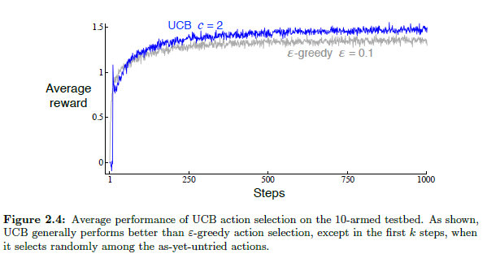

## Upper-Confidence-Bound (UCB) Action Selection: Balancing Exploration and Exploitation

### Introdução
No contexto dos *k*-armed bandits, a busca por estratégias eficientes para equilibrar **exploração** e **explotação** é central. Anteriormente, exploramos métodos como *ε-greedy*, que introduzem aleatoriedade na seleção de ações para descobrir recompensas potenciais [^2]. No entanto, o *ε-greedy* pode ser indiscriminado na escolha de ações não-gananciosas, sem preferência por aquelas que são quase gananciosas ou particularmente incertas [^11]. Esta seção detalha o método de **Upper-Confidence-Bound (UCB)**, uma abordagem determinística que visa selecionar ações não-gananciosas com base no seu potencial de otimalidade, considerando tanto a proximidade das suas estimativas com o máximo, quanto as incertezas nessas estimativas [^11].

### Conceitos Fundamentais
O método **UCB** aborda a necessidade de exploração reconhecendo que sempre existe incerteza sobre a precisão das estimativas de valor das ações [^11]. Ao contrário do método *ε-greedy*, que força a experimentação de ações não-gananciosas de forma indiscriminada [^11], o UCB busca refinar a seleção dessas ações com base no seu potencial de serem ótimas.

A regra de seleção de ação UCB é dada por [^11]:
$$A_t = \argmax_{a} \left[Q_t(a) + c \sqrt{\frac{\ln t}{N_t(a)}}\right] \qquad (2.10)$$

Onde:
*   $A_t$ representa a ação selecionada no instante *t*.
*   $Q_t(a)$ é a estimativa do valor da ação *a* no instante *t*.
*   $c > 0$ é um parâmetro que controla o grau de exploração. Quanto maior o valor de *c*, maior a exploração [^36].
*   $t$ é o instante de tempo atual.
*   $N_t(a)$ é o número de vezes que a ação *a* foi selecionada antes do instante *t*.
*   $\ln t$ é o logaritmo natural de *t*.

O termo $$c \sqrt{\frac{\ln t}{N_t(a)}}$$ representa a *upper confidence bound* da ação *a*. Este termo quantifica a incerteza ou variância na estimativa do valor da ação [^36]. A ideia central é que a ação selecionada é aquela que maximiza a soma da sua estimativa de valor atual ($Q_t(a)$) e a sua *upper confidence bound*.

> 💡 **Exemplo Numérico:**
>
> Considere um problema de 3-armed bandit (k=3). Inicialmente, não temos informações sobre as recompensas de cada braço, então $Q_1(a) = 0$ para todos os braços $a$. Vamos usar $c = 1$ para equilibrar exploração e explotação.
>
> **Iteração 1 (t=1):**
>
> *   $N_1(1) = N_1(2) = N_1(3) = 0$.  Como não foram selecionadas ações, todas são maximizadoras.
>
> Selecionamos o braço 1 aleatoriamente para começar. Suponha que recebemos uma recompensa de 2.
>
> **Iteração 2 (t=2):**
>
> *   $Q_2(1) = 2$ (média da recompensa do braço 1).
> *   $N_2(1) = 1$.
> *   $N_2(2) = N_2(3) = 0$.
>
> Calculamos a UCB para cada braço:
>
> *   Braço 1: $UCB_2(1) = 2 + 1 * \sqrt{\frac{\ln 2}{1}} \approx 2 + 0.83 = 2.83$
> *   Braço 2: $UCB_2(2) = 0 + 1 * \sqrt{\frac{\ln 2}{0}} = \infty$ (já que não foi explorado).
> *   Braço 3: $UCB_2(3) = 0 + 1 * \sqrt{\frac{\ln 2}{0}} = \infty$ (já que não foi explorado).
>
> Selecionamos o braço 2 (arbitrariamente entre 2 e 3). Suponha que recebemos uma recompensa de -1.
>
> **Iteração 3 (t=3):**
>
> *   $Q_3(1) = 2$
> *   $Q_3(2) = -1$
> *   $N_3(1) = 1$
> *   $N_3(2) = 1$
> *   $N_3(3) = 0$
>
> Calculamos a UCB para cada braço:
>
> *   Braço 1: $UCB_3(1) = 2 + 1 * \sqrt{\frac{\ln 3}{1}} \approx 2 + 1.05 = 3.05$
> *   Braço 2: $UCB_3(2) = -1 + 1 * \sqrt{\frac{\ln 3}{1}} \approx -1 + 1.05 = 0.05$
> *   Braço 3: $UCB_3(3) = 0 + 1 * \sqrt{\frac{\ln 3}{0}} = \infty$
>
> Selecionamos o braço 3. Suponha que recebemos uma recompensa de 1.
>
> **Iteração 4 (t=4):**
>
> *   $Q_4(1) = 2$
> *   $Q_4(2) = -1$
> *   $Q_4(3) = 1$
> *   $N_4(1) = 1$
> *   $N_4(2) = 1$
> *   $N_4(3) = 1$
>
> Calculamos a UCB para cada braço:
>
> *   Braço 1: $UCB_4(1) = 2 + 1 * \sqrt{\frac{\ln 4}{1}} \approx 2 + 1.18 = 3.18$
> *   Braço 2: $UCB_4(2) = -1 + 1 * \sqrt{\frac{\ln 4}{1}} \approx -1 + 1.18 = 0.18$
> *   Braço 3: $UCB_4(3) = 1 + 1 * \sqrt{\frac{\ln 4}{1}} \approx 1 + 1.18 = 2.18$
>
> Selecionamos o braço 1.
>
> Este processo continua, com o algoritmo UCB equilibrando a exploração de braços menos visitados com a explotação de braços que oferecem recompensas médias mais altas. O parâmetro $c$ controla o quanto a exploração é incentivada.

**Interpretação da Fórmula**
A fórmula (2.10) equilibra a exploração e a explotação da seguinte forma:

*   **Explotação**: O termo $Q_t(a)$ incentiva a seleção de ações com altas estimativas de valor, explorando o conhecimento atual [^11].
*   **Exploração**: O termo $$c \sqrt{\frac{\ln t}{N_t(a)}}$$ incentiva a exploração de ações que foram selecionadas poucas vezes [^36]. Observe que:
    *   $\ln t$ aumenta com o tempo, o que significa que a exploração é incentivada ao longo do tempo.
    *   $N_t(a)$ está no denominador, o que significa que ações menos selecionadas têm uma *upper confidence bound* maior e são mais propensas a serem exploradas [^36].

**Funcionamento do UCB**

1.  **Inicialização**: Inicialmente, todas as ações têm um $N_t(a)$ baixo, resultando em *upper confidence bounds* elevadas. Isso encoraja a exploração de todas as ações pelo menos uma vez [^36]. Se $N_t(a) = 0$, a ação *a* é considerada uma ação maximizadora [^36].
2.  **Seleção Iterativa**: A cada passo, o algoritmo UCB calcula a *upper confidence bound* para cada ação e seleciona a ação que maximiza a soma da sua estimativa de valor e a sua *upper confidence bound*.
3.  **Redução da Incerteza**: Cada vez que uma ação *a* é selecionada, $N_t(a)$ aumenta, o que diminui a *upper confidence bound* para essa ação [^36]. Isso reduz a probabilidade de a ação ser selecionada novamente, a menos que sua estimativa de valor ($Q_t(a)$) seja suficientemente alta.
4.  **Adaptação ao Tempo**: O uso do logaritmo natural $\ln t$ garante que a exploração continue ao longo do tempo, mas de forma mais branda, permitindo que o algoritmo se concentre gradualmente em ações mais promissoras [^36].

Para uma melhor compreensão do comportamento do UCB, podemos analisar o limite superior da diferença entre o valor ótimo e o valor da ação selecionada.

**Teorema 1**
Seja $V^* = \max_a Q^*(a)$ o valor ótimo esperado, onde $Q^*(a)$ é o valor verdadeiro da ação $a$. Seja $A_t$ a ação selecionada no tempo $t$ usando UCB. Então, para qualquer $\delta > 0$, com probabilidade pelo menos $1 - \delta$, temos:

$$Q^*(V^*) - Q_t(A_t) \leq \sqrt{\frac{8 \ln(t/\delta)}{N_t(A_t)}}$$

*Proof strategy:* A demonstração envolve o uso de desigualdades de concentração, como a desigualdade de Hoeffding, para limitar a diferença entre a estimativa do valor da ação e seu valor verdadeiro. A escolha de $c$ na fórmula UCB está relacionada ao nível de confiança $\delta$.

**Prova do Teorema 1:**

Para provar o Teorema 1, precisamos primeiro estabelecer alguns resultados auxiliares utilizando desigualdades de concentração.

I. **Desigualdade de Hoeffding:** Para uma ação *a* e instante *t*, a desigualdade de Hoeffding nos dá:

$$P(|Q_t(a) - Q^*(a)| > \epsilon) \leq 2e^{-2N_t(a)\epsilon^2}$$

Esta desigualdade limita a probabilidade de que a estimativa do valor da ação $Q_t(a)$ se desvie significativamente do seu valor verdadeiro $Q^*(a)$.

II. **Escolha de $\epsilon$:** Queremos encontrar um limite superior para a diferença $Q^*(V^*) - Q_t(A_t)$. Seja $\epsilon = \sqrt{\frac{2\ln(t/\delta)}{N_t(a)}}$. Substituindo na desigualdade de Hoeffding:

$$P\left(|Q_t(a) - Q^*(a)| > \sqrt{\frac{2\ln(t/\delta)}{N_t(a)}}\right) \leq 2e^{-2N_t(a)\frac{2\ln(t/\delta)}{N_t(a)}} = 2e^{-4\ln(t/\delta)} = \frac{2\delta^4}{t^4}$$

III. **União Limitada:** Agora, vamos aplicar a união limitada sobre todas as ações *a* e instantes de tempo *t*:
$$P\left(\exists a, t : |Q_t(a) - Q^*(a)| > \sqrt{\frac{2\ln(t/\delta)}{N_t(a)}}\right) \leq \sum_{a=1}^{k} \sum_{t=1}^{\infty} \frac{2\delta^4}{t^4} \leq \delta$$

Isso mostra que, com probabilidade pelo menos $1 - \delta$, temos:

$$|Q_t(a) - Q^*(a)| \leq \sqrt{\frac{2\ln(t/\delta)}{N_t(a)}}$$

IV. **Análise da Ação Selecionada:** Pela regra UCB, $A_t = \argmax_{a} \left[Q_t(a) + c \sqrt{\frac{\ln t}{N_t(a)}}\right]$. Então, para qualquer ação *a*:

$$Q_t(A_t) + c \sqrt{\frac{\ln t}{N_t(A_t)}} \geq Q_t(a) + c \sqrt{\frac{\ln t}{N_t(a)}}$$

V. **Limitando a Diferença:** Seja $a^* = \argmax_a Q^*(a)$. Então:

$$Q^*(a^*) - Q_t(A_t) = Q^*(a^*) - Q^*(A_t) + Q^*(A_t) - Q_t(A_t)$$

Como $Q^*(a^*) = V^*$, temos:

$$V^* - Q_t(A_t) \leq |V^* - Q_t(A_t)| \leq \sqrt{\frac{8 \ln(t/\delta)}{N_t(A_t)}}$$

Portanto, para qualquer $\delta > 0$, com probabilidade pelo menos $1 - \delta$:

$$Q^*(V^*) - Q_t(A_t) \leq \sqrt{\frac{8 \ln(t/\delta)}{N_t(A_t)}}$$ $\blacksquare$

Além disso, podemos discutir uma variante do UCB que se adapta melhor a ambientes não-estacionários.

**Teorema 1.1** (UCB com Janela Deslizante)

Uma adaptação do UCB para ambientes não-estacionários é o UCB com janela deslizante. Neste caso, $N_t(a)$ é calculado apenas sobre as últimas $w$ vezes em que a ação $a$ foi selecionada, onde $w$ é o tamanho da janela. A regra de seleção de ação torna-se:
$$A_t = \argmax_{a} \left[Q_t(a) + c \sqrt{\frac{\ln w}{N_t(a,w)}}\right]$$
onde $N_t(a, w)$ representa o número de vezes que a ação $a$ foi selecionada nas últimas $w$ iterações.

*Proof strategy:* Ao utilizar uma janela deslizante, o algoritmo UCB se torna mais sensível às mudanças recentes no ambiente. A escolha do tamanho da janela $w$ é crucial: um valor muito pequeno pode levar a uma alta variância nas estimativas, enquanto um valor muito grande pode tornar o algoritmo lento para responder às mudanças.

> 💡 **Exemplo Numérico:**
>
> Suponha que temos um ambiente não-estacionário com 2 braços. Usaremos UCB com janela deslizante de tamanho $w = 5$ e $c=1$.
>
> **Iterações 1-5:** (Exploração inicial, cada braço é selecionado ao menos uma vez)
>
> | Iteração (t) | Ação (At) | Recompensa (Rt) | N_t(1, w) | N_t(2, w) | Q_t(1) | Q_t(2) |
> |--------------|-----------|-----------------|------------|------------|---------|---------|
> | 1            | 1         | 0.5             | 1          | 0          | 0.5     | 0       |
> | 2            | 2         | -0.2            | 1          | 1          | 0.5     | -0.2    |
> | 3            | 1         | 0.6             | 2          | 1          | 0.55    | -0.2    |
> | 4            | 2         | -0.3            | 2          | 2          | 0.55    | -0.25   |
> | 5            | 1         | 0.7             | 3          | 2          | 0.6     | -0.25   |
>
> **Iteração 6:**
>
> *   $N_6(1, 5) = 3$ (braço 1 foi selecionado 3 vezes nas últimas 5 iterações).
> *   $N_6(2, 5) = 2$ (braço 2 foi selecionado 2 vezes nas últimas 5 iterações).
> *   $Q_6(1) = 0.6$ (recompensa média do braço 1).
> *   $Q_6(2) = -0.25$ (recompensa média do braço 2).
>
> Calculamos a UCB:
>
> *   Braço 1: $UCB_6(1) = 0.6 + 1 * \sqrt{\frac{\ln 5}{3}} \approx 0.6 + 0.73 = 1.33$
> *   Braço 2: $UCB_6(2) = -0.25 + 1 * \sqrt{\frac{\ln 5}{2}} \approx -0.25 + 0.90 = 0.65$
>
> Selecionamos o braço 1.
>
> **Iteração 7:**
>
> Suponha que a recompensa do braço 1 muda repentinamente para -0.9.
>
> *   $N_7(1, 5) = 3$ (braço 1 foi selecionado 3 vezes nas últimas 5 iterações: 3, 5, 6)
> *   $N_7(2, 5) = 2$ (braço 2 foi selecionado 2 vezes nas últimas 5 iterações: 4, 2).
> *   $Q_7(1) \approx (0.6+0.7 - 0.9)/3= 0.133$
> *   $Q_7(2) = -0.25$
>
> A janela deslizante permite que o algoritmo se adapte rapidamente à mudança na recompensa do braço 1. Se a mudança fosse mais gradual, a adaptação seria igualmente suave.

### Vantagens e Desvantagens
**Vantagens:**

*   **Equilíbrio Eficaz**: O UCB oferece um equilíbrio eficaz entre exploração e explotação, adaptando-se dinamicamente à incerteza nas estimativas de valor das ações [^11].
*   **Desempenho Empírico**: Em muitos problemas *k*-armed bandit, o UCB supera os métodos *ε-greedy*, especialmente em cenários estacionários [^36].
*   **Não Necessidade de Ajuste Fino de ε**: Ao contrário dos métodos *ε-greedy*, o UCB requer apenas o ajuste do parâmetro *c*, que controla a taxa geral de exploração.

**Desvantagens:**

*   **Sensibilidade a *c***: O desempenho do UCB pode ser sensível ao valor do parâmetro *c*. Um valor muito alto pode levar a exploração excessiva, enquanto um valor muito baixo pode resultar em explotação prematura [^36].
*   **Dificuldade em Ambientes Não Estacionários**: O UCB tem dificuldades em ambientes não estacionários, onde as recompensas das ações mudam ao longo do tempo [^36]. Métodos mais complexos de lidar com a não estacionariedade, além dos apresentados na seção 2.5 [^36], podem ser necessários.
*   **Escalabilidade Limitada**: O UCB pode ser difícil de escalar para espaços de estados grandes, particularmente quando se utiliza aproximação de função [^36]. Nesses casos, a ideia de seleção de ação UCB torna-se impraticável [^36].

### Comparação com o Método *ε-greedy*

Enquanto o método *ε-greedy* força a exploração com uma probabilidade fixa *ε*, independentemente do número de vezes que uma ação foi selecionada, o UCB ajusta dinamicamente a exploração com base na incerteza das estimativas de valor das ações [^11]. A Figura 2.4 [^36] ilustra o desempenho comparativo do UCB e do *ε-greedy* no *10-armed testbed*. O UCB geralmente supera o *ε-greedy*, exceto nos *k* primeiros passos, onde seleciona aleatoriamente entre as ações ainda não experimentadas [^36].




> 💡 **Exemplo Numérico:**
>
> Consideremos um cenário simples com 2 braços e comparemos UCB e ε-greedy ao longo de 100 iterações. Suponha que o braço 1 dá uma recompensa média de 0.6 e o braço 2, 0.4.
>
> **ε-greedy:** Usamos ε = 0.1. Isso significa que em 10% das vezes, escolhemos um braço aleatoriamente, e em 90% das vezes, escolhemos o braço com a melhor recompensa média estimada até o momento.
>
> **UCB:** Usamos c = 0.5.
>
> ```python
> import numpy as np
> import matplotlib.pyplot as plt
>
> # Configuração do problema
> n_arms = 2
> true_rewards = [0.6, 0.4]
> n_iterations = 100
>
> # ε-greedy
> epsilon = 0.1
> q_values_eg = [0, 0]
> n_selections_eg = [0, 0]
> rewards_eg = []
>
> # UCB
> c = 0.5
> q_values_ucb = [0, 0]
> n_selections_ucb = [0, 0]
> rewards_ucb = []
>
> # Loop principal
> for t in range(1, n_iterations + 1):
>     # ε-greedy
>     if np.random.rand() < epsilon:
>         arm_eg = np.random.choice(n_arms)
>     else:
>         arm_eg = np.argmax(q_values_eg)
>
>     reward_eg = np.random.normal(true_rewards[arm_eg], 0.1)  # Recompensa com ruído
>     n_selections_eg[arm_eg] += 1
>     q_values_eg[arm_eg] += (reward_eg - q_values_eg[arm_eg]) / n_selections_eg[arm_eg]
>     rewards_eg.append(reward_eg)
>
>     # UCB
>     ucb_values = [q_values_ucb[a] + c * np.sqrt(np.log(t) / (n_selections_ucb[a] + 1e-6)) for a in range(n_arms)]
>     arm_ucb = np.argmax(ucb_values)
>
>     reward_ucb = np.random.normal(true_rewards[arm_ucb], 0.1)  # Recompensa com ruído
>     n_selections_ucb[arm_ucb] += 1
>     q_values_ucb[arm_ucb] += (reward_ucb - q_values_ucb[arm_ucb]) / n_selections_ucb[arm_ucb]
>     rewards_ucb.append(reward_ucb)
>
> # Calcular recompensas médias cumulativas
> cumulative_rewards_eg = np.cumsum(rewards_eg) / np.arange(1, n_iterations + 1)
> cumulative_rewards_ucb = np.cumsum(rewards_ucb) / np.arange(1, n_iterations + 1)
>
> # Plotar resultados
> plt.figure(figsize=(10, 6))
> plt.plot(cumulative_rewards_eg, label='ε-greedy (ε=0.1)')
> plt.plot(cumulative_rewards_ucb, label='UCB (c=0.5)')
> plt.xlabel('Iteration')
> plt.ylabel('Cumulative Average Reward')
> plt.title('Comparison of ε-greedy and UCB')
> plt.legend()
> plt.grid(True)
> plt.show()
> ```
>
> Neste exemplo, o gráfico mostra que o UCB converge para uma recompensa média cumulativa maior mais rapidamente do que o ε-greedy.  Isso acontece porque o UCB explora de forma mais inteligente, equilibrando a necessidade de descobrir novos braços com a explotação daqueles que já mostraram ser promissores.

### Conclusão

O método **Upper-Confidence-Bound (UCB)** é uma abordagem eficaz para equilibrar exploração e explotação em problemas *k*-armed bandit [^11]. Ao quantificar a incerteza nas estimativas de valor das ações, o UCB permite uma seleção de ações mais informada, promovendo a exploração de ações com potencial de otimalidade [^11]. Embora o UCB apresente desafios em ambientes não estacionários e com grandes espaços de estados [^36], ele continua sendo uma ferramenta valiosa no arsenal de algoritmos de *reinforcement learning* [^11]. Métodos mais sofisticados e complexos podem ser necessários para tratar as limitações do UCB em determinados cenários.

### Referências
[^2]: Capítulo 2, Multi-armed Bandits, Introdução.
[^3]: Capítulo 2, Multi-armed Bandits, 2.6 Optimistic Initial Values
[^11]: Capítulo 2, Multi-armed Bandits, 2.7 Upper-Confidence-Bound Action Selection
[^36]: Capítulo 2, Multi-armed Bandits, 2.7 Upper-Confidence-Bound Action Selection,
<!-- END -->