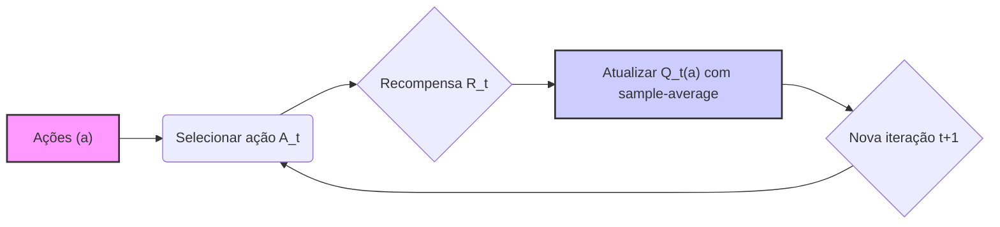
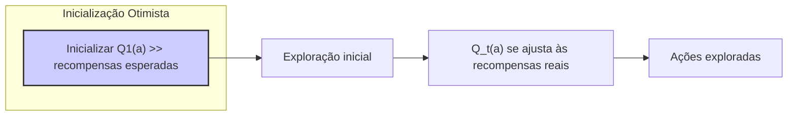
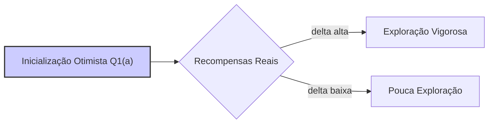
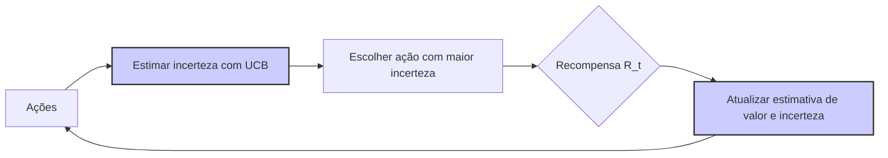

## O Impacto da Inicialização Otimista no Aprendizado em Multi-Armed Bandits

### Introdução
O aprendizado por reforço (RL) se distingue de outros tipos de aprendizado por utilizar informações de treinamento que *avaliam* as ações tomadas, em vez de *instruírem* por meio de ações corretas. Isso cria a necessidade de **exploração ativa**, uma busca explícita por um bom comportamento [1]. Dentro deste contexto, o problema do **k-armed bandit** oferece um cenário simplificado para estudar o *aspecto avaliativo* do RL, onde um agente deve repetidamente escolher entre k opções (ações), cada uma oferecendo uma recompensa numérica de uma distribuição de probabilidade estacionária [1]. O objetivo é maximizar a recompensa total esperada ao longo do tempo, um desafio que envolve o **trade-off exploração-explotação** [1].

### Conceitos Fundamentais
Os métodos de **action-value** estimam os valores das ações com base nas recompensas obtidas. O valor verdadeiro de uma ação é a recompensa média quando essa ação é selecionada. Uma forma natural de estimar isso é usar a média das recompensas recebidas, conhecida como **sample-average method**, dada por:
$$ Q_t(a) = \frac{\sum_{i=1}^{t-1} R_i \mathbb{1}_{A_i = a}}{\sum_{i=1}^{t-1} \mathbb{1}_{A_i = a}} $$ [1], onde $\mathbb{1}_{\text{predicate}}$ é uma variável aleatória que assume 1 se o predicado for verdadeiro e 0 caso contrário, $R_i$ é a recompensa no passo *i*, e $A_i$ é a ação tomada no passo *i*. Em contrapartida,  $Q_t(a)$ representa o valor estimado da ação *a* no instante *t*. A seleção de ações pode ser feita de forma **greedy**, escolhendo a ação com o maior valor estimado, ou de forma **$\epsilon$-greedy**, explorando ações não-greedy com probabilidade $\epsilon$ e explorando a ação com maior valor estimado com probabilidade $1-\epsilon$ [1].

> 💡 **Exemplo Numérico:** Suponha que temos um problema de 3-armed bandit (k=3). As ações são A, B e C. Após algumas iterações, temos os seguintes resultados:
>
> - Ação A foi selecionada 3 vezes com recompensas: 2, 3, 4.
> - Ação B foi selecionada 2 vezes com recompensas: 1, 2.
> - Ação C foi selecionada 1 vez com recompensa: 5.
>
> Usando o sample-average method, calculamos os valores estimados:
>
>   $Q_t(A) = (2 + 3 + 4) / 3 = 3$
>
>   $Q_t(B) = (1 + 2) / 2 = 1.5$
>
>   $Q_t(C) = 5 / 1 = 5$
>
>  Se usarmos uma abordagem greedy, a próxima ação selecionada seria C, pois tem o maior valor estimado. Se usarmos um $\epsilon$-greedy com $\epsilon=0.1$, haverá uma probabilidade de 10% de escolhermos A ou B aleatoriamente, e 90% de escolher C.

Entretanto, a inicialização das estimativas de valor da ação, $Q_1(a)$, desempenha um papel crucial no processo de aprendizado. Os métodos descritos até agora dependem, em alguma medida, dessas estimativas iniciais [1]. Em termos estatísticos, os métodos são *enviesados* por essas estimativas iniciais. Métodos com a média de amostras eliminam esse viés após todas as ações serem selecionadas pelo menos uma vez. Contudo, métodos com taxa de aprendizado constante,  $\alpha$, mantém o viés, mas ele diminui ao longo do tempo [1].

A inicialização otimista dos valores de ação é uma técnica que incentiva a exploração [1]. Ao invés de inicializar os valores de ação em zero, eles são inicializados em um valor alto, superestimando o potencial das ações [1]. Por exemplo, no testbed de 10-armed bandits, onde os valores das ações são escolhidos de uma distribuição normal com média 0 e variância 1, inicializar todos os $Q_1(a)$ como +5 é considerado otimista. Isso incentiva o agente a explorar, pois as recompensas obtidas inicialmente serão menores do que as estimativas, levando o agente a tentar outras ações [1].

> 💡 **Exemplo Numérico:** Considere um 4-armed bandit. Se inicializarmos os valores de ação como $Q_1(a) = 0$ para todas as ações, e as recompensas verdadeiras para as ações forem -1, 0, 1, e 2 respectivamente, uma ação pode ser considerada boa prematuramente após apenas uma ou duas recompensas aleatórias. No entanto, se inicializarmos todos os $Q_1(a) = 5$, todas as ações serão inicialmente consideradas como tendo alto potencial. Após a primeira ação ser selecionada e sua recompensa ser por exemplo -1, a estimativa de valor vai diminuir (para valores próximos a 5) fazendo com que o agente explore as outras opções. Após repetidas atualizações, os valores devem convergir para suas médias reais.

Essa técnica proporciona uma forma simples de fornecer um conhecimento prévio sobre os níveis de recompensa esperados. A inicialização otimista garante que todas as ações sejam tentadas várias vezes antes que os valores estimados convirjam [1]. No entanto, é importante notar que, embora eficaz para problemas estacionários, essa abordagem pode não ser adequada para problemas não-estacionários, nos quais a necessidade de exploração pode surgir ao longo do tempo, e a natureza temporária da exploração induzida pela inicialização otimista torna-se limitante [1].

**Lemma 1.** *A inicialização otimista promove a exploração inicial em problemas de bandit, mas sua eficácia diminui em ambientes não estacionários, onde a necessidade de exploração surge dinamicamente.*

*Prova.* Em problemas estacionários, a inicialização otimista direciona o agente a explorar outras ações porque a recompensa inicial é menor do que a estimativa de valor otimista, levando o agente a visitar todas as ações. Contudo, em ambientes não-estacionários, onde a distribuição de recompensas pode mudar, essa exploração inicial torna-se insuficiente. O agente, após explorar e convergir para um conjunto de ações, não consegue se adaptar às mudanças, pois a inicialização é uma condição inicial, e não um mecanismo de exploração contínuo. $\blacksquare$

> 💡 **Exemplo Numérico:** Imagine um 2-armed bandit onde inicialmente a ação A dá uma recompensa média de 1 e a ação B dá uma recompensa média de 0. Com inicialização otimista (ex: $Q_1(A) = Q_1(B) = 5$), o agente explora ambas as ações. Em um dado momento, as recompensas mudam; agora A dá em média 0 e B dá em média 1. Após um período de convergência, o agente tende a continuar explorando a ação A. A inicialização otimista não ajuda a descobrir a mudança na distribuição de recompensas, uma vez que a exploração inicial já foi feita. O agente continua a explorar A devido ao seu histórico de valores, e não devido às mudanças no ambiente.

**Lemma 1.1** *Em ambientes estacionários, após um período inicial de exploração, o uso da inicialização otimista pode ser desnecessário, podendo-se utilizar um método de exploração mais balanceado como o $\epsilon$-greedy.*

*Prova.* A inicialização otimista força a exploração no início, mas à medida que as estimativas de valor se aproximam das recompensas reais, a necessidade de exploração induzida pela inicialização diminui. Assim, após todas as ações serem exploradas, um método de exploração mais controlada como o $\epsilon$-greedy com um valor $\epsilon$ adequado pode ser mais eficiente para encontrar o equilíbrio entre exploração e explotação e, ao mesmo tempo, continuar a melhorar as estimativas de valor. $\blacksquare$

> 💡 **Exemplo Numérico:** Num problema estacionário com 3 ações, após um certo número de iterações com inicialização otimista, o agente já explorou todas as ações e tem uma boa estimativa de seus valores: $Q_t(A) = 2.1$, $Q_t(B) = 0.5$, $Q_t(C) = 1.2$. Neste ponto, uma abordagem $\epsilon$-greedy com $\epsilon = 0.1$  seria eficiente; 90% das vezes o agente escolheria A (exploração) e 10% das vezes escolheria B ou C, mantendo um bom equilíbrio entre exploração e explotação, e melhorando sua estimativa dos valores das ações. O uso da inicialização otimista já não é mais tão necessário, pois já cumpriu seu papel inicial.

**Proposição 1.** *O valor da inicialização otimista depende da diferença entre a estimativa inicial e os valores de recompensa reais.*

*Prova.* Se a inicialização for muito otimista (muito maior que as recompensas esperadas), o agente explorará vigorosamente no início. No entanto, se a inicialização for muito próxima ou abaixo dos valores de recompensa esperados, a fase de exploração será menor ou poderá nem ocorrer. Assim, a diferença entre a inicialização e os valores de recompensa reais determina a intensidade e a duração da exploração. $\blacksquare$

> 💡 **Exemplo Numérico:** Num 5-armed bandit com valores de recompensa reais entre -2 e 2, se inicializarmos os valores em $Q_1(a) = 10$, haverá uma fase de exploração inicial grande porque a diferença entre as estimativas iniciais e as recompensas reais é grande. Se inicializarmos em $Q_1(a) = 1$, a exploração inicial será menor, e se inicializarmos em $Q_1(a) = -5$ não haverá exploração inicial. A diferença entre a inicialização e o valor das recompensas reais controla a intensidade da exploração.

Além disso, para abordar as limitações da inicialização otimista em ambientes não-estacionários, outras técnicas podem ser empregadas. Uma dessas técnicas é o **Upper Confidence Bound (UCB)**, que mantém uma estimativa da incerteza associada a cada ação e encoraja a exploração de ações com alta incerteza. Este método, ao contrário da inicialização otimista, não depende de uma condição inicial, mas sim do histórico de recompensas.

**Teorema 1.** *O algoritmo UCB, ao considerar a incerteza na estimativa das ações, proporciona uma abordagem de exploração mais adaptativa em ambientes não-estacionários, em comparação com a inicialização otimista.*

*Prova (Esboço)*. O UCB utiliza um limite de confiança superior para selecionar ações, o que leva o algoritmo a explorar ações com alta incerteza, mesmo que suas estimativas de valor sejam baixas no momento. Em ambientes não-estacionários, isso permite ao agente revisitar ações que podem ter se tornado mais promissoras devido a mudanças no ambiente. A inicialização otimista, por outro lado, só atua na exploração inicial. Quando as recompensas mudam, ela não provê um mecanismo para adaptar a exploração. Portanto, o UCB é uma melhor abordagem para ambientes não-estacionários. $\blacksquare$

> 💡 **Exemplo Numérico:** Considere um cenário não-estacionário de 2-armed bandit. Inicialmente, a ação A tem uma recompensa média de 1 e a ação B tem uma recompensa média de 0. Depois de um tempo, as recompensas se invertem (A passa a dar 0 e B passa a dar 1). Com UCB, as ações menos exploradas (com maior incerteza) serão selecionadas. No início A é selecionada mais vezes, mas quando B começa a gerar mais recompensas, o UCB estimará uma incerteza maior para B, e a ação será selecionada. O UCB é adaptativo, pois revisita as ações que se tornaram promissoras. O UCB não sofre das limitações da inicialização otimista pois se adapta a mudanças.

### Conclusão
As estimativas iniciais de valor da ação, particularmente com inicialização otimista, podem influenciar o aprendizado em problemas de *k-armed bandit*. Inicializar os valores de ação de forma otimista incentiva a exploração, permitindo que todas as ações sejam amostradas várias vezes. Embora eficazes para problemas estacionários, é essencial considerar as limitações desses métodos em ambientes não-estacionários, onde outras técnicas de exploração mais dinâmicas, como o UCB, podem ser mais apropriadas. Em cenários mais complexos, explorar o espaço de ações por meio de inicializações otimistas não é suficiente, e outros métodos precisam ser considerados. A escolha da estratégia de inicialização e exploração deve ser cuidadosamente avaliada em função da natureza do problema.

### Referências
[^1]: "The most important feature distinguishing reinforcement learning from other types of learning is that it uses training information that evaluates the actions taken rather than instructs by giving correct actions. This is what creates the need for active exploration, for an explicit search for good behavior. Purely evaluative feedback indicates how good the action taken was, but not whether it was the best or the worst action possible. Purely instructive feedback, on the other hand, indicates the correct action to take, independently of the action actually taken. This kind of feedback is the basis of supervised learning, which includes large parts of pattern classification, artificial neural networks, and system identification. In their pure forms, these two kinds of feedback are quite distinct: evaluative feedback depends entirely on the action taken, whereas instructive feedback is independent of the action taken.
In this chapter we study the evaluative aspect of reinforcement learning in a simplified setting, one that does not involve learning to act in more than one situation. This nonassociative setting is the one in which most prior work involving evaluative feedback has been done, and it avoids much of the complexity of the full reinforcement learning problem. Studying this case enables us to see most clearly how evaluative feedback differs from, and yet can be combined with, instructive feedback.
The particular nonassociative, evaluative feedback problem that we explore is a simple version of the k-armed bandit problem. We use this problem to introduce a number of basic learning methods which we extend in later chapters to apply to the full rein-forcement learning problem. At the end of this chapter, we take a step closer to the full reinforcement learning problem by discussing what happens when the bandit problem becomes associative, that is, when the best action depends on the situation." *(Trecho de Chapter 2: Multi-armed Bandits)*
