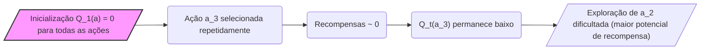
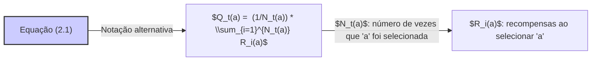
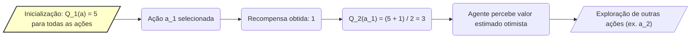
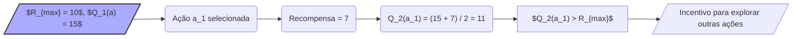
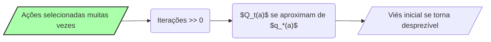

## Optimistic Initial Values e o Viés Inicial nos Métodos de Média Amostral

### Introdução

No contexto do aprendizado por reforço, e especificamente nos problemas de *k-armed bandits*, os métodos de estimativa de valor de ação desempenham um papel crucial na tomada de decisões. Estes métodos, como os métodos de média amostral, são usados para estimar o valor esperado de recompensa de cada ação. No entanto, como apontado [^12], todos os métodos discutidos até agora são dependentes, em certa medida, das estimativas iniciais de valor de ação, $Q_1(a)$. Em termos estatísticos, esses métodos são *tendenciosos* por suas estimativas iniciais. Este capítulo explorará como esse viés surge, particularmente nos métodos de média amostral, e como ele pode ser tanto uma desvantagem quanto uma vantagem no contexto do aprendizado por reforço [^12].

### Conceitos Fundamentais

Os métodos de *action-value* são fundamentais para o aprendizado por reforço, pois eles nos permitem estimar quão boa é cada ação em termos de recompensa esperada. Uma forma natural de estimar o valor de uma ação é através da média das recompensas recebidas, como expresso na equação (2.1) [^4]:
$$Q_t(a) = \frac{\text{soma das recompensas quando a foi tomada antes de t}}{\text{número de vezes que a foi tomada antes de t}}$$
Esta abordagem, chamada *sample-average method*, converge para o verdadeiro valor da ação $q_*(a)$ à medida que o número de seleções da ação tende ao infinito, de acordo com a lei dos grandes números [^4]. No entanto, o comportamento inicial dessa estimativa é influenciado pela inicialização $Q_1(a)$, e esse é o ponto de partida da nossa discussão sobre o viés inicial.

**Viés Inicial nos Métodos de Média Amostral**:
A inicialização das estimativas de valor de ação $Q_1(a)$ introduz um viés nos métodos de média amostral, ou seja, as estimativas iniciais influenciam as estimativas subsequentes. Se, por exemplo, todas as estimativas iniciais forem definidas como zero, a exploração pode ser dificultada se algumas ações produzirem recompensas consistentemente baixas [^12]. Embora o viés desapareça assim que cada ação seja selecionada pelo menos uma vez [^12], no início do aprendizado ele afeta significativamente o comportamento do algoritmo. Este viés inicial é tanto uma desvantagem quanto uma vantagem, uma vez que, se as estimativas iniciais forem bem escolhidas, o algoritmo pode convergir mais rapidamente para um comportamento próximo do ideal. No entanto, se as estimativas iniciais forem mal escolhidas, elas podem levar a um desempenho inferior no início do aprendizado.

> 💡 **Exemplo Numérico:** Considere um problema de 3-armed bandit. Inicializamos $Q_1(a) = 0$ para todas as ações. Ações $a_1$, $a_2$, e $a_3$ têm médias de recompensa verdadeiras $q_*(a_1) = 1$, $q_*(a_2) = 2$ e $q_*(a_3) = 0.1$, respectivamente. Se nas primeiras interações o agente selecionar $a_3$ várias vezes e receber recompensas próximas a zero, seu valor estimado $Q_t(a_3)$ permanecerá baixo, dificultando a exploração de $a_2$ que tem o maior potencial de recompensa. Este é um exemplo de como uma inicialização desfavorável pode afetar a exploração.

**Lemma 1**: *A convergência de $Q_t(a)$ para $q_*(a)$ com o método de média amostral é garantida pela lei dos grandes números, mas o comportamento inicial é influenciado pelas estimativas iniciais $Q_1(a)$.*

*Prova*: Conforme o número de vezes que uma ação $a$ é tomada ($t$) cresce, o denominador da equação (2.1) tende ao infinito. Pela lei dos grandes números, a média amostral de recompensas converge para o valor esperado da recompensa, que é $q_*(a)$. No entanto, este processo de convergência é afetado pelos valores iniciais atribuídos a $Q_1(a)$, o que introduz um viés temporário até que todas as ações sejam selecionadas um número suficiente de vezes. $\blacksquare$

**Lemma 1.1:** *Se $N_t(a)$ denota o número de vezes que a ação 'a' foi selecionada antes do instante 't', a equação (2.1) pode ser reescrita como $Q_t(a) = \frac{1}{N_t(a)} \sum_{i=1}^{N_t(a)} R_i(a)$, onde $R_i(a)$ são as recompensas recebidas ao selecionar 'a'.*

*Prova:* Esta é uma notação alternativa da equação (2.1) que torna explícito o número de vezes que a ação 'a' foi tomada e as recompensas associadas. $\blacksquare$

**O Impacto da Inicialização Otimista**:
Uma forma interessante de usar este viés inicial é a *inicialização otimista*, onde os valores iniciais $Q_1(a)$ são definidos em níveis mais altos do que as recompensas esperadas [^12]. Por exemplo, em um problema onde as recompensas estão distribuídas em torno de zero, pode-se inicializar $Q_1(a) = +5$. Este otimismo inicial força o algoritmo a explorar diferentes ações, já que as recompensas obtidas inicialmente são menores do que o esperado [^12]. Essa estratégia incentiva a exploração mesmo quando se usa uma política puramente gananciosa.

> 💡 **Exemplo Numérico:** Usando o mesmo problema de 3-armed bandit, inicializamos $Q_1(a) = 5$ para todas as ações. Na primeira interação, se a ação $a_1$ é selecionada e retorna uma recompensa de 1, $Q_2(a_1)$ será calculado como $(5 + 1)/2 = 3$. O agente perceberá que seu valor estimado era excessivamente otimista, motivando a exploração de outras ações. Isso acelera a descoberta de ações mais recompensadoras, como $a_2$, que tem valor verdadeiro $q_*(a_2) = 2$.

**Lemma 2**: *A inicialização otimista, com $Q_1(a)$ maior do que as recompensas esperadas, incentiva a exploração mesmo com políticas puramente gananciosas, melhorando o desempenho a longo prazo.*

*Prova*: Ao iniciar $Q_1(a)$ com um valor alto, as primeiras recompensas obtidas serão menores do que a estimativa. Isso leva o algoritmo a explorar outras ações em busca de recompensas melhores, pois os valores $Q_t(a)$ são atualizados com cada recompensa. O algoritmo continuará explorando até que as recompensas obtidas se aproximem do valor $q_*(a)$, o que leva a uma maior exploração inicial e um melhor desempenho a longo prazo. $\blacksquare$

**Lemma 2.1:** *A escolha de um valor $Q_1(a)$ suficientemente alto na inicialização otimista pode garantir que todas as ações sejam exploradas pelo menos uma vez no início do processo de aprendizado, mesmo com uma política gulosa.*

*Prova:*  Se $Q_1(a) > \max_a q_*(a)$, então a seleção inicial da ação com maior valor estimado forçará a exploração de outras ações, pois as recompensas reais são menores do que a estimativa inicial. Isso garante que o algoritmo explore diferentes ações pelo menos uma vez no início do aprendizado. $\blacksquare$

> 💡 **Exemplo Numérico:** Suponha que a recompensa máxima possível seja $R_{max} = 10$, e que todas as estimativas iniciais sejam inicializadas com $Q_1(a) = 15$. A primeira ação selecionada, digamos $a_1$, produz uma recompensa de 7. Então, $Q_2(a_1) = (15 + 7) / 2 = 11$. Mesmo após a primeira atualização, $Q_2(a_1)$ ainda é maior que $R_{max}$.  Isso incentiva a exploração de outras ações, já que o agente ainda espera recompensas maiores do que está obtendo.

**Proposição 1:** *Seja $R_{max}$ o valor máximo de recompensa possível. Se $Q_1(a) > R_{max}$, o método de média amostral com inicialização otimista garante que a ação será escolhida no mínimo uma vez antes que sua estimativa de valor $Q_t(a)$ seja atualizada para um valor menor ou igual a $R_{max}$.*

*Prova:* Inicialmente, todas as estimativas $Q_1(a)$ são maiores que $R_{max}$. Quando uma ação $a$ é selecionada pela primeira vez e uma recompensa $r(a) \leq R_{max}$ é recebida, a estimativa $Q_2(a)$ será uma média entre $Q_1(a)$ e $r(a)$, resultando em $Q_2(a) \leq \frac{Q_1(a) + R_{max}}{2}$ ou $Q_2(a) = r(a)$ se $N_t(a) = 1$. De qualquer forma,  $Q_2(a)$ pode ser menor que $Q_1(a)$ mas maior que $R_{max}$ até que outras ações sejam exploradas. Caso nenhuma outra ação seja explorada, o valor  $Q_t(a)$ tenderá para $R_{max}$ à medida que $t$ aumenta e o efeito do valor inicial for diminuindo. Caso outra ação seja explorada, os valores de $Q_t(a)$ poderão variar mais rapidamente. Isso garante que, eventualmente, todas as ações serão exploradas. $\blacksquare$

**Desaparecimento do Viés Inicial**:
É crucial notar que, para os métodos de média amostral, o viés inicial desaparece quando todas as ações são selecionadas pelo menos uma vez. Isso ocorre porque cada $Q_t(a)$ é, eventualmente, baseado em todas as recompensas observadas, e assim, o efeito da inicialização inicial é reduzido à medida que mais dados são coletados.

**Teorema 1:** *Se todas as ações em um problema de k-armed bandits são selecionadas um número infinito de vezes, então o viés inicial induzido pela escolha de $Q_1(a)$ desaparece para o método de média amostral, e $Q_t(a)$ converge para $q_*(a)$ para cada ação $a$.*

*Prova:* Conforme demonstrado no Lemma 1, o método de média amostral garante a convergência para o valor real da ação, $q_*(a)$, à medida que o número de amostras tende ao infinito. Se cada ação é selecionada um número infinito de vezes, então $N_t(a)$ tende ao infinito para cada $a$. Assim, a influência do valor inicial $Q_1(a)$ em $Q_t(a)$ desaparece, e  $Q_t(a)$ se aproxima de $q_*(a)$ pela Lei dos Grandes Números. $\blacksquare$

> 💡 **Exemplo Numérico:** Continuando com o 3-armed bandit, após 1000 iterações onde cada ação é selecionada aproximadamente 300 vezes, os valores $Q_t(a)$ para cada ação se aproximarão de seus valores verdadeiros $q_*(a)$. Por exemplo, se $q_*(a_1) = 1$, $q_*(a_2) = 2$ e $q_*(a_3) = 0.1$, teremos algo como $Q_t(a_1) \approx 1$, $Q_t(a_2) \approx 2$, e $Q_t(a_3) \approx 0.1$. O viés inicial, devido a valores $Q_1(a)$ diferentes de zero ou otimistas, terá um efeito desprezível no cálculo de $Q_t(a)$, demonstrando o desaparecimento do viés inicial.

**Observação 1:** *A convergência do Teorema 1 é uma convergência assintótica, ou seja, ela é garantida apenas no limite quando o número de interações tende ao infinito. Na prática, o viés inicial pode ainda afetar o desempenho do aprendizado em um número finito de passos.*

### Conclusão

Em suma, os métodos de média amostral são inicialmente tendenciosos devido à inicialização de $Q_1(a)$. Este viés, embora temporário, desempenha um papel significativo na fase inicial de aprendizado. O uso da inicialização otimista, explorando esse viés inicial, pode ser uma estratégia eficaz para incentivar a exploração e melhorar o desempenho a longo prazo. No entanto, é importante notar que métodos que usam um passo de aprendizagem constante podem não eliminar esse viés completamente [^12]. O estudo e o entendimento de como a inicialização afeta o aprendizado é fundamental para desenvolver algoritmos robustos e eficientes em aprendizado por reforço.

### Referências

[^12]: "All the methods we have discussed so far are dependent to some extent on the initial action-value estimates, Q1(a). In the language of statistics, these methods are biased by their initial estimates. For the sample-average methods, the bias disappears once all actions have been selected at least once, but for methods with constant a, the bias is permanent, though decreasing over time as given by (2.6). In practice, this kind of bias is usually not a problem and can sometimes be very helpful. The downside is that the initial estimates become, in effect, a set of parameters that must be picked by the user, if only to set them all to zero." *(Trecho de Multi-armed Bandits)*
[^4]: "We begin by looking more closely at methods for estimating the values of actions and for using the estimates to make action selection decisions, which we collectively call action-value methods. Recall that the true value of an action is the mean reward when that action is selected. One natural way to estimate this is by averaging the rewards actually received: Qt(a) = sum of rewards when a taken prior to t / number of times a taken prior to t" *(Trecho de Multi-armed Bandits)*
