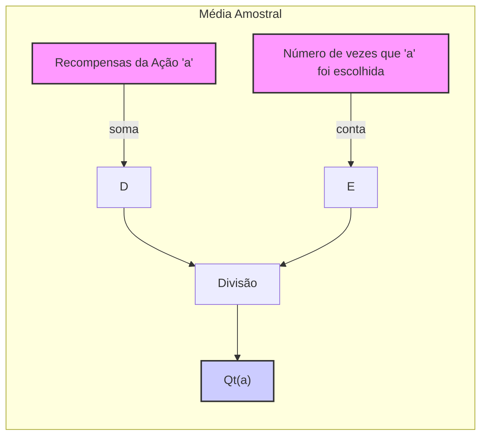
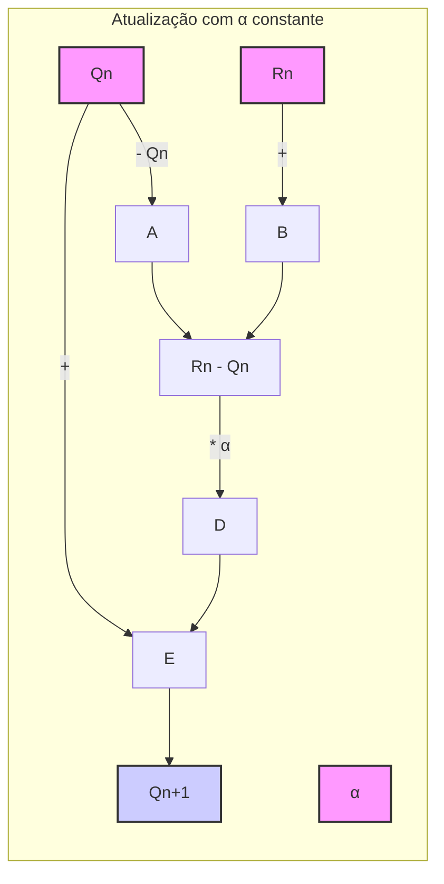
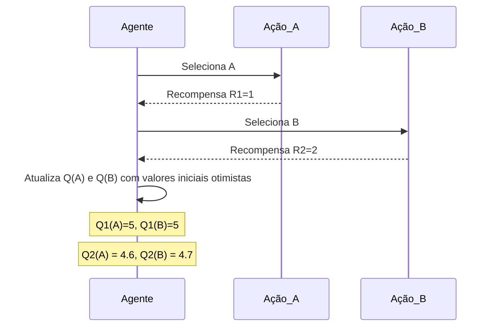
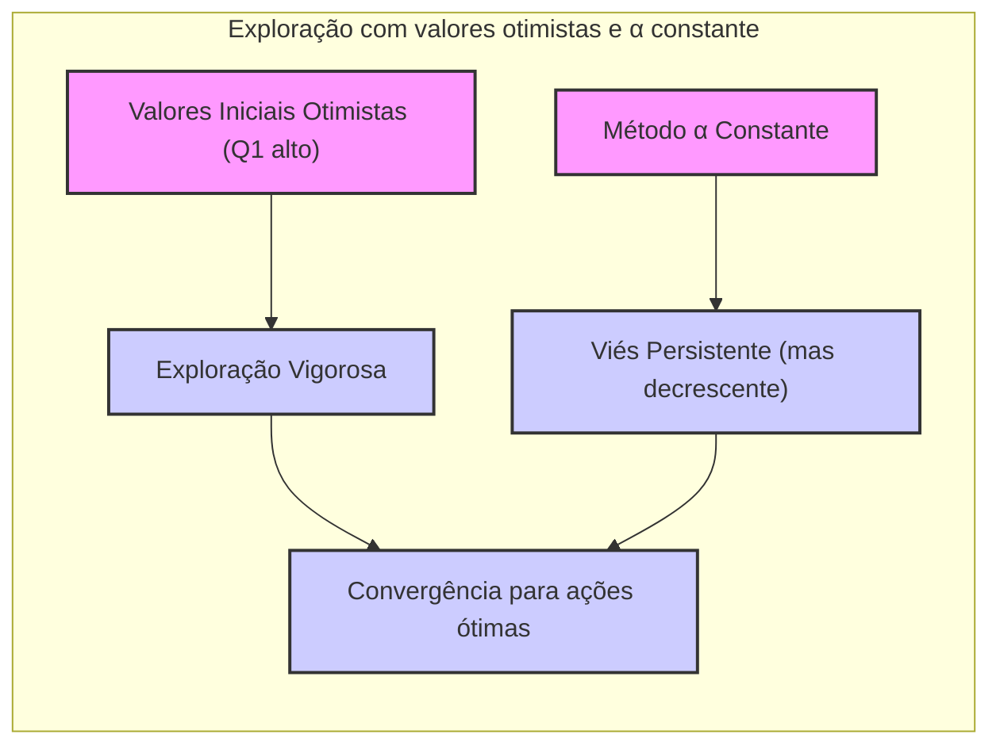

## Optimistic Initial Values e o Viés em Métodos com $\alpha$ Constante

### Introdução

No contexto do aprendizado por reforço, especialmente em problemas de **multi-armed bandits** (bandidos multi-braços), a maneira como os valores iniciais das ações, $Q_1(a)$, são configurados pode influenciar significativamente a exploração e o desempenho do algoritmo [^1]. Os métodos de estimação de valores de ação são muitas vezes influenciados por suas estimativas iniciais, gerando um **viés**. Métodos que usam a média amostral, como visto na equação $Q_t(a) = \frac{\sum_{i=1}^{t-1} R_i \mathbb{1}_{A_i=a}}{\sum_{i=1}^{t-1} \mathbb{1}_{A_i=a}}$ [^3], gradualmente eliminam esse viés à medida que todas as ações são selecionadas pelo menos uma vez. Entretanto, para métodos com um parâmetro $\alpha$ constante, esse viés persiste, embora diminua com o tempo, conforme descrito em [^1]. Este capítulo se aprofundará na análise do impacto do viés em métodos com $\alpha$ constante, particularmente dentro do contexto de **optimistic initial values** como uma técnica para incentivar a exploração, e discutirá como esse viés afeta o comportamento do aprendizado por reforço.

### Conceitos Fundamentais

**Viés Inicial e Métodos de Média Amostral:** Métodos baseados em **sample averages**, como definido na equação (2.1) [^3], calculam a estimativa do valor de uma ação $Q_t(a)$ como a média dos recompensas obtidas ao executar essa ação até o tempo $t$. Formalmente, essa relação é dada por [^3]:
$$
Q_t(a) = \frac{\text{soma das recompensas quando a foi escolhida antes de t}}{\text{número de vezes que a foi escolhida antes de t}} = \frac{\sum_{i=1}^{t-1} R_i \mathbb{1}_{A_i=a}}{\sum_{i=1}^{t-1} \mathbb{1}_{A_i=a}}
$$
onde $\mathbb{1}_{A_i=a}$ é uma função indicadora que é igual a 1 se a ação $a$ foi escolhida no tempo $i$, e 0 caso contrário. Conforme o denominador da fração tende ao infinito, a lei dos grandes números garante que $Q_t(a)$ converge para $q_*(a)$, o valor verdadeiro da ação [^3]. Este método é livre de viés, desde que todas as ações sejam selecionadas pelo menos uma vez, conforme mencionado no texto [^1].

> 💡 **Exemplo Numérico:** Imagine um problema de multi-armed bandit com duas ações, A e B. As recompensas obtidas são: A = \[1, 2, 1, 3] e B = \[4, 5, 4]. Usando o método de média amostral:
>
> *   $Q_4(A) = (1 + 2 + 1 + 3) / 4 = 7 / 4 = 1.75$
> *   $Q_3(B) = (4 + 5 + 4) / 3 = 13 / 3 \approx 4.33$
>
>   Se a ação A fosse selecionada mais uma vez e gerasse uma recompensa de 2, então $Q_5(A)$ seria $(1+2+1+3+2)/5 = 9/5 = 1.8$. Observe como cada nova recompensa impacta a média, eventualmente convergindo para o valor real da ação.



**Lema 1.1:** *Em métodos de média amostral, se uma ação não for selecionada, seu valor estimado permanece indefinido, não sendo necessariamente um problema de viés.*

*Prova:* A equação da média amostral exige que a ação *a* seja selecionada pelo menos uma vez para que o denominador $\sum_{i=1}^{t-1} \mathbb{1}_{A_i=a}$ seja diferente de zero. Se uma ação não for selecionada, o denominador será zero, e $Q_t(a)$ não é definido. Embora isso possa levar a problemas na prática, a falta de definição não é um viés no sentido tradicional, mas uma consequência da falta de informações sobre a ação. $\blacksquare$

**Métodos com $\alpha$ Constante e Viés Persistente:** Em contraste, métodos que utilizam um parâmetro de tamanho do passo $\alpha$ constante para atualizar as estimativas dos valores de ação, como mostrado na equação (2.5) [^8]:
$$
Q_{n+1} = Q_n + \alpha[R_n - Q_n]
$$
introduzem um viés que persiste ao longo do tempo.  Esta equação atualiza a estimativa $Q_n$ para $Q_{n+1}$ com base na diferença entre a recompensa recebida $R_n$ e a estimativa atual $Q_n$, ponderada pelo parâmetro $\alpha$. Esta atualização iterativa resulta em um viés permanente, que diminui gradualmente conforme indicado pela equação (2.6) [^8]:

$$
Q_{n+1} = (1-\alpha)^n Q_1 + \sum_{i=1}^n \alpha (1-\alpha)^{n-i} R_i
$$

Esta fórmula mostra que $Q_{n+1}$ é uma média ponderada das recompensas passadas $R_i$ e da estimativa inicial $Q_1$, com pesos que decaem exponencialmente com o tempo, como descrito em [^9]. O viés inicial, embora diminua, não desaparece completamente [^1], diferentemente do que acontece com a média amostral.

> 💡 **Exemplo Numérico:** Suponha que tenhamos uma ação com $Q_1 = 0$ e $\alpha = 0.1$. As recompensas obtidas são $R = [1, 2, 1, 3]$. Vamos calcular $Q_n$ usando a atualização incremental:
>
> *   $Q_2 = Q_1 + \alpha (R_1 - Q_1) = 0 + 0.1(1 - 0) = 0.1$
> *   $Q_3 = Q_2 + \alpha (R_2 - Q_2) = 0.1 + 0.1(2 - 0.1) = 0.1 + 0.1(1.9) = 0.29$
> *   $Q_4 = Q_3 + \alpha (R_3 - Q_3) = 0.29 + 0.1(1 - 0.29) = 0.29 + 0.1(0.71) = 0.361$
> *   $Q_5 = Q_4 + \alpha (R_4 - Q_4) = 0.361 + 0.1(3 - 0.361) = 0.361 + 0.1(2.639) = 0.6249$
>
> Agora, usando a equação (2.6):
> *   $Q_5 = (1-0.1)^4 * 0 + 0.1(1-0.1)^3 * 1 + 0.1(1-0.1)^2 * 2 + 0.1(1-0.1)^1 * 1 + 0.1(1-0.1)^0 * 3$
> *   $Q_5 = 0 + 0.1(0.729) + 0.1(0.81) * 2 + 0.1(0.9) * 1 + 0.1 * 3$
> *   $Q_5 = 0.0729 + 0.162 + 0.09 + 0.3 = 0.6249$
>
>   Observe como a influência do valor inicial $Q_1 = 0$ diminui com o tempo, mas ainda tem um impacto na estimativa. Se $Q_1$ fosse diferente, essa diferença persistiria, embora com um peso decrescente.



```mermaid
flowchart LR
    subgraph "Média ponderada com α constante"
        Q1["Q1"]
        R["R1...Rn"]
        alpha["α"]
        n["n"]
        Q1 -->|"(1-α)^n"|A
        R -->|$\sum \alpha (1-\alpha)^{n-i}$| B
         A & B --> C["Soma"]
         C --> Qn1["Qn+1"]

    end
        style Q1 fill:#f9f,stroke:#333,stroke-width:2px
    style Qn1 fill:#ccf,stroke:#333,stroke-width:2px
    style R fill:#f9f,stroke:#333,stroke-width:2px
        style alpha fill:#f9f,stroke:#333,stroke-width:2px
        style n fill:#f9f,stroke:#333,stroke-width:2px
```

**Proposição 2:** *A escolha de $\alpha$ afeta a taxa de convergência e a persistência do viés em métodos com $\alpha$ constante.*

*Prova:* Analisando a equação (2.6), o termo $(1-\alpha)^n$ determina a influência do valor inicial $Q_1$. Quando $\alpha$ está próximo de 1, este termo decai rapidamente para 0, o que significa que o viés inicial diminui rapidamente, e as estimativas se tornam mais sensíveis às recompensas recentes. Quando $\alpha$ está próximo de 0, o termo $(1-\alpha)^n$ decai lentamente, fazendo com que o viés inicial persista por mais tempo e as recompensas iniciais tenham um peso maior nas estimativas. Portanto, $\alpha$ controla tanto a velocidade com que o viés inicial desaparece quanto a sensibilidade do método a recompensas mais recentes. $\blacksquare$

> 💡 **Exemplo Numérico:** Considere dois cenários: $\alpha_1 = 0.1$ e $\alpha_2 = 0.9$, ambos com $Q_1 = 0$ e recompensas $R = [1, 1, 1]$.
>
> Para $\alpha_1 = 0.1$:
> *   $Q_2 = 0 + 0.1(1-0) = 0.1$
> *   $Q_3 = 0.1 + 0.1(1-0.1) = 0.19$
> *   $Q_4 = 0.19 + 0.1(1-0.19) = 0.271$
>
> Para $\alpha_2 = 0.9$:
> *   $Q_2 = 0 + 0.9(1-0) = 0.9$
> *   $Q_3 = 0.9 + 0.9(1-0.9) = 0.99$
> *   $Q_4 = 0.99 + 0.9(1-0.99) = 0.999$
>
> Vemos que com $\alpha_2 = 0.9$, a estimativa $Q_n$ se aproxima mais rapidamente do valor da recompensa (1), mas também é mais sensível às últimas recompensas. Com $\alpha_1 = 0.1$, a convergência é mais lenta, e as recompensas iniciais têm um peso maior por mais tempo, resultando em um viés persistente, demonstrando que $\alpha$ controla tanto a velocidade de convergência como a persistência do viés.

**Optimistic Initial Values:** Um método simples, mas eficaz, para incentivar a exploração em algoritmos de aprendizado por reforço é o uso de **optimistic initial values** [^10]. Em vez de inicializar os valores de ação com zero, eles são inicializados com um valor alto, digamos +5, em um problema em que as recompensas esperadas estão em torno de zero [^10]. Esta abordagem incentiva o algoritmo a explorar novas ações, pois os retornos iniciais são tipicamente menores que a estimativa inicial. Ao explorar, o algoritmo eventualmente descobre ações melhores, superando o viés inicial [^10].

> 💡 **Exemplo Numérico:** Considere um problema com duas ações, A e B. Inicializamos os valores com $Q_1(A) = 5$ e $Q_1(B) = 5$. Se a ação A é selecionada primeiro e gera uma recompensa $R_1 = 1$ com $\alpha = 0.1$, então:
> *   $Q_2(A) = 5 + 0.1(1 - 5) = 5 - 0.4 = 4.6$
>
> Se a ação B é selecionada em seguida e gera uma recompensa $R_2 = 2$:
>
> *   $Q_2(B) = 5 + 0.1(2-5) = 5 - 0.3 = 4.7$
>
> O valor alto inicial incentiva o algoritmo a explorar, já que as recompensas iniciais (1 e 2) são menores do que as estimativas iniciais (5).



**Impacto do Viés na Exploração com Valores Iniciais Otimistas:** O viés causado por $\alpha$ constante pode ser benéfico no caso dos **optimistic initial values**, já que garante que os valores iniciais continuem a ter alguma influência na exploração [^10]. No entanto, este viés pode ser problemático em cenários não estacionários, onde a recompensa associada a uma ação muda ao longo do tempo, pois o método tende a manter um peso maior nas recompensas iniciais, como indicado em [^9].

**Lema 1:** *O viés introduzido por um $\alpha$ constante é persistente, mas diminui com o tempo.*

*Prova:* A equação 2.6 [^8] demonstra que a estimativa $Q_{n+1}$ é uma média ponderada da estimativa inicial $Q_1$ e as recompensas passadas $R_i$, onde o peso de $Q_1$ é $(1-\alpha)^n$. Como $\alpha$ está entre (0,1], esse peso diminui com o tempo, mas nunca chega a zero. Isso implica que $Q_1$ sempre terá alguma influência na estimativa de $Q_{n+1}$, demonstrando que o viés permanece. No entanto, com $n \to \infty$, o peso de $Q_1$ tende a zero, resultando na diminuição do viés. $\blacksquare$

**Lema 1.2:** *O viés persistente pode levar a uma convergência mais lenta, especialmente se os valores iniciais forem significativamente diferentes dos valores verdadeiros das ações.*

*Prova:* O viés introduzido por $\alpha$ constante, como demonstrado no Lema 1, significa que a estimativa inicial $Q_1$ tem uma influência contínua nas estimativas. Se $Q_1$ estiver muito distante do valor real da ação, $q_*(a)$, as estimativas podem demorar mais tempo para se aproximarem desse valor verdadeiro, resultando em uma convergência mais lenta. A persistência desse viés impede uma correção rápida da estimativa, especialmente no início do aprendizado. $\blacksquare$

**Corolário 1:** *O uso de valores iniciais otimistas, combinado com o viés de métodos com $\alpha$ constante, pode ser uma estratégia eficaz de exploração em ambientes estacionários, pois promove a busca por novas ações devido a estimativas iniciais altas.*

*Derivação:* Como Lemma 1 demonstra, os métodos com $\alpha$ constante mantêm um viés persistente, mas decrescente, atribuindo maior peso às recompensas mais recentes. Com valores iniciais otimistas, as ações iniciais são “desapontadoras” porque suas recompensas são menores que as estimativas iniciais, incentivando o algoritmo a explorar outras ações. Isso, combinado com o viés dos métodos com $\alpha$ constante, garante que a exploração inicial seja vigorosa e, ao mesmo tempo, os valores convergem com o tempo. $\blacksquare$



**Corolário 1.1:** *Em ambientes não estacionários, a exploração incentivada por valores iniciais otimistas pode ser prejudicada pelo viés persistente, impedindo o algoritmo de se adaptar rapidamente a mudanças nas recompensas.*

*Derivação:* Em ambientes não estacionários, os valores ótimos das ações mudam com o tempo. O viés persistente nos métodos com $\alpha$ constante, especialmente quando combinado com valores iniciais otimistas, fará com que o algoritmo continue a dar peso a recompensas iniciais, mesmo quando as recompensas atuais mudam. Essa influência das recompensas iniciais pode retardar a convergência para os novos valores ótimos, prejudicando a adaptação do algoritmo ao ambiente dinâmico. $\blacksquare$

### Conclusão

O viés introduzido por métodos que utilizam um parâmetro $\alpha$ constante para atualizar estimativas de valores de ação é uma característica importante a ser considerada no aprendizado por reforço. Enquanto esse viés é indesejável em alguns cenários, ele pode ser aproveitado como um mecanismo de exploração quando combinado com **optimistic initial values**. Em ambientes estacionários, o viés persistente, mas decrescente, da equação (2.6) [^8] garante que a influência das estimativas iniciais otimistas diminua com o tempo, permitindo que o algoritmo eventualmente se concentre nas melhores ações. No entanto, em ambientes não estacionários, esse viés pode ser problemático devido ao peso indevido dado a recompensas iniciais e desconsideração das mudanças nas recompensas ao longo do tempo. A escolha entre métodos com $\alpha$ constante e **sample averages** deve considerar a natureza do ambiente, estacionário ou não, e a necessidade de manter o viés como forma de exploração.

### Referências
[^1]: "All the methods we have discussed so far are dependent to some extent on the initial action-value estimates, Q1(a). In the language of statistics, these methods are biased by their initial estimates. For the sample-average methods, the bias disappears once all actions have been selected at least once, but for methods with constant a, the bias is permanent, though decreasing over time as given by (2.6)."
[^3]: "One natural way to estimate this is by averaging the rewards actually received: Qt(a) = (sum of rewards when a taken prior to t) / (number of times a taken prior to t) = ($\sum_{i=1}^{t-1} R_i1_{A_i=a}$) / ($\sum_{i=1}^{t-1} 1_{A_i=a}$)"
[^8]: "One of the most popular ways of doing this is to use a constant step-size parameter. For example, the incremental update rule (2.3) for updating an average Qn of the n – 1 past rewards is modified to be Qn+1 = Qn + a[Rn - Qn]"
[^9]: "This results in Qn+1 being a weighted average of past rewards and the initial estimate Q1: Qn+1 = ...  = (1 − a)^nQ1 + $\sum_{i=1}^n a(1 - a)^{n-i}Ri$"
[^10]: "Initial action values can also be used as a simple way to encourage exploration. Suppose that instead of setting the initial action values to zero, as we did in the 10-armed testbed, we set them all to +5."
