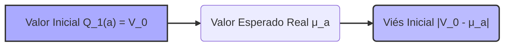
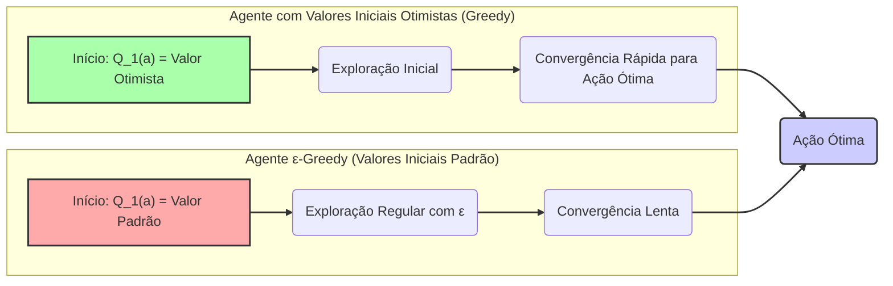

## Optimistic Initial Values in Multi-armed Bandits

### Introdução
Em problemas de **multi-armed bandits**, a exploração e a explotação representam um dilema fundamental. Métodos que aprendem os valores das ações são influenciados por suas estimativas iniciais, e essa influência pode persistir ao longo do tempo, especialmente em métodos com um parâmetro de taxa de aprendizado constante [1](https://chatgpt.com/c/67829922-359c-8011-96dd-970c04ed772c#user-content-fn-1). Métodos de média amostral acabam por remover esse viés assim que todas as ações são selecionadas pelo menos uma vez, mas para métodos com taxa de aprendizado constante, o viés se torna permanente, diminuindo ao longo do tempo como definido em [2](https://chatgpt.com/c/67829922-359c-8011-96dd-970c04ed772c#user-content-fn-2). O uso de **valores iniciais otimistas** é uma técnica que se aproveita desse viés para promover uma maior exploração, direcionando o agente a testar diferentes ações e, eventualmente, convergir para o comportamento ótimo [1](https://chatgpt.com/c/67829922-359c-8011-96dd-970c04ed772c#user-content-fn-1).

**Proposição 1.** *A persistência do viés inicial em métodos com taxa de aprendizado constante pode ser modelada como uma função exponencial decrescente, onde o viés inicial é progressivamente reduzido a cada passo de aprendizado, mas nunca totalmente eliminado*. Esta persistência implica que o valor inicial, mesmo que gradualmente diminuído, continuará a influenciar a estimativa de valor ao longo do tempo.


> 💡 **Exemplo Numérico:** Suponha que temos um método com taxa de aprendizado $\alpha = 0.1$ e um valor inicial $Q_1(a) = 5$. Se a recompensa real de uma ação $a$ é $q_*(a) = 1$, a atualização do valor estimado $Q_t(a)$ no tempo $t$ é dada por $Q_{t+1}(a) = Q_t(a) + \alpha [R_t - Q_t(a)]$.  Na primeira iteração, onde $R_1$ é amostrada de uma distribuição normal com média 1 e variância 1, digamos que $R_1 = 1.2$. Então:
>
> $Q_2(a) = 5 + 0.1 * (1.2 - 5) = 5 + 0.1 * (-3.8) = 5 - 0.38 = 4.62$
>
> O viés inicial de 5 diminuiu para 4.62. Após várias atualizações, esse valor de $Q(a)$ se aproximará do valor real, mas sem nunca eliminar o viés inicial por completo. A persistência desse viés inicial afeta a convergência, incentivando a exploração.

### Conceitos Fundamentais
A ideia central por trás do uso de **valores iniciais otimistas** é iniciar as estimativas de valor de ação, $Q_1(a)$, com um valor alto. Esse valor inicial alto cria uma espécie de viés que força o agente a explorar o espaço de ações para descobrir o que realmente acontece no ambiente [1](https://chatgpt.com/c/67829922-359c-8011-96dd-970c04ed772c#user-content-fn-1). No contexto de um problema de bandit de $k$-braços, o valor real de cada ação, $q_*(a)$, é amostrado de uma distribuição normal com média 0 e variância 1 [3](https://chatgpt.com/c/67829922-359c-8011-96dd-970c04ed772c#user-content-fn-3). Definir $Q_1(a)$ para um valor de +5 (ou seja, um valor "otimista") representa, portanto, um viés significativo [3](https://chatgpt.com/c/67829922-359c-8011-96dd-970c04ed772c#user-content-fn-3).

**Lema 1.** *Dado um problema de bandit k-braços onde as recompensas seguem uma distribuição normal com média $\mu_a$ e variância $\sigma^2_a$ para cada ação $a$, e usando um valor inicial $Q_1(a) = V_0$, o viés inicial introduz uma diferença entre a estimativa inicial e o valor esperado real, ou seja, $|Q_1(a) - \mu_a| = |V_0 - \mu_a|$.* Esta diferença é o que impulsiona a exploração inicial, especialmente quando $V_0$ é maior do que o valor médio de qualquer ação.



> 💡 **Exemplo Numérico:** Considere um bandit de 3 braços (k=3), onde os valores reais de cada ação são $\mu_1 = -1$, $\mu_2 = 0$, e $\mu_3 = 1$, respectivamente, amostrados de distribuições normais com variância $\sigma^2 = 1$. Definindo $V_0 = 5$, temos os seguintes vieses iniciais para cada braço:
>
>  *   $|Q_1(1) - \mu_1| = |5 - (-1)| = 6$
>  *   $|Q_1(2) - \mu_2| = |5 - 0| = 5$
>  *   $|Q_1(3) - \mu_3| = |5 - 1| = 4$
>
> O maior viés inicial é para o braço 1, que tem o menor valor real, enquanto o menor viés é para o braço 3, com o maior valor real. Esse viés inicial força o agente a explorar todos os braços, pois os valores estimados iniciais são maiores que todos os valores reais.

Quando o agente escolhe uma ação inicial e recebe uma recompensa, essa recompensa é, em geral, inferior ao valor inicial otimista, levando o agente a ficar "desapontado" com a recompensa recebida [3](https://chatgpt.com/c/67829922-359c-8011-96dd-970c04ed772c#user-content-fn-3). Isso estimula o agente a escolher outras ações, de forma que, eventualmente, todas as ações serão testadas várias vezes antes que os valores estimados convirjam [3](https://chatgpt.com/c/67829922-359c-8011-96dd-970c04ed772c#user-content-fn-3). Mesmo utilizando uma política puramente *greedy*, que sempre escolhe a ação com o maior valor estimado, a exploração acontece, embora essa exploração seja temporária [3](https://chatgpt.com/c/67829922-359c-8011-96dd-970c04ed772c#user-content-fn-3).

**Lema 1.1** *A magnitude da "decepção" sofrida pelo agente após receber uma recompensa $R_t$ para uma ação $a_t$ no tempo $t$, é diretamente proporcional à diferença entre o valor inicial otimista e o valor esperado da ação: $|Q_1(a_t) - R_t|$.* Isso significa que quanto mais otimista for o valor inicial, maior será a tendência do agente em experimentar outras ações após a primeira interação.

```mermaid
sequenceDiagram
    participant Agente
    participant Ambiente
    Agente->>Ambiente: Seleciona ação a_t
    Ambiente-->>Agente: Recompensa R_t
    Agente-->>Agente: Calcula "Decepção" |Q_1(a_t) - R_t|
    Agente-->>Agente: Decide por nova ação
    style Agente fill:#ddf,stroke:#333,stroke-width:2px
    style Ambiente fill:#eee,stroke:#333,stroke-width:2px
    
```

> 💡 **Exemplo Numérico:** Usando o exemplo anterior, onde $Q_1(a) = 5$ para todos os braços. Suponha que o agente selecione o braço 1 na primeira interação, onde o valor real $\mu_1 = -1$. Uma possível recompensa amostrada da distribuição normal com $\mu_1 = -1$ e $\sigma^2 = 1$ seria $R_1 = -0.5$. A "decepção" seria $|5 - (-0.5)| = 5.5$.  Se o agente selecionar o braço 3, onde $\mu_3 = 1$, e receber uma recompensa $R_1 = 0.8$, a "decepção" seria $|5 - 0.8| = 4.2$. A maior "decepção" leva o agente a explorar ações diferentes em busca de melhores recompensas.

Para entender o efeito, considere um agente que usa o método **ε-greedy**, que explora com uma probabilidade ε e explora com probabilidade (1-ε), e o método *greedy* com valores iniciais otimistas. A Figura 2.3 no texto [3](https://chatgpt.com/c/67829922-359c-8011-96dd-970c04ed772c#user-content-fn-3) ilustra uma comparação. Inicialmente, o método otimista tem desempenho inferior ao método **ε-greedy** porque explora mais, mas acaba superando o método **ε-greedy** porque sua exploração diminui com o tempo [3](https://chatgpt.com/c/67829922-359c-8011-96dd-970c04ed772c#user-content-fn-3). O uso de valores iniciais otimistas fornece uma maneira simples e eficaz de promover a exploração em ambientes estacionários [3](https://chatgpt.com/c/67829922-359c-8011-96dd-970c04ed772c#user-content-fn-3). É importante notar, no entanto, que essa abordagem não é adequada para ambientes não estacionários, onde a necessidade de exploração pode se renovar com o tempo [3](https://chatgpt.com/c/67829922-359c-8011-96dd-970c04ed772c#user-content-fn-3).

> 💡 **Exemplo Numérico:** Vamos simular um cenário com 10 braços (k=10), onde as recompensas reais $q_*(a)$ são sorteadas de uma distribuição normal com média 0 e variância 1. Vamos comparar o desempenho de um método ε-greedy com ε = 0.1 e um método greedy com valores iniciais otimistas (Q1(a)=5).
>
> ```python
> import numpy as np
> import matplotlib.pyplot as plt
>
> def generate_rewards(k):
>     return np.random.normal(0, 1, k)
>
> def epsilon_greedy(q_values, epsilon):
>     if np.random.rand() < epsilon:
>         return np.random.choice(len(q_values))
>     else:
>         return np.argmax(q_values)
>
> def update_q(q_values, action, reward, alpha):
>     q_values[action] = q_values[action] + alpha * (reward - q_values[action])
>
> def run_experiment(k, steps, epsilon, initial_value = 0, alpha = 0.1):
>     true_rewards = generate_rewards(k)
>     q_values = np.full(k, initial_value, dtype = float)
>     rewards_per_step = []
>     for _ in range(steps):
>       action = epsilon_greedy(q_values, epsilon) if epsilon != None else np.argmax(q_values)
>       reward = np.random.normal(true_rewards[action], 1)
>       update_q(q_values, action, reward, alpha)
>       rewards_per_step.append(reward)
>
>     return rewards_per_step
>
> steps = 1000
> k = 10
>
> epsilon_rewards = run_experiment(k,steps, epsilon = 0.1)
> optimistic_rewards = run_experiment(k, steps, epsilon = None, initial_value = 5)
>
> plt.plot(epsilon_rewards, label = "ε-greedy (ε=0.1)")
> plt.plot(optimistic_rewards, label = "Greedy com valores iniciais otimistas")
> plt.xlabel("Steps")
> plt.ylabel("Reward")
> plt.legend()
> plt.show()
> ```
>
> Este código simula os dois métodos e gera um gráfico mostrando o desempenho ao longo dos steps. Inicialmente, o método ε-greedy pode ter um desempenho melhor, mas o método greedy com valores otimistas irá superá-lo com o tempo. Essa simulação ilustra o comportamento descrito no texto.

**Teorema 1.** *Em ambientes estacionários, um agente usando valores iniciais otimistas com uma política greedy irá, sob certas condições, convergir para a ação ótima com mais rapidez do que um agente usando ε-greedy e valores iniciais não otimistas, mas a velocidade exata de convergência depende da magnitude do valor inicial otimista e da variância das recompensas.* A prova desse teorema envolveria uma análise da relação entre a exploração inicial induzida pelos valores otimistas e a subsequente convergência das estimativas de ação, podendo ser feita usando técnicas de análise de convergência de processos de aprendizado por reforço.



### Conclusão
Valores iniciais otimistas representam uma estratégia simples mas eficaz para incentivar a exploração em **multi-armed bandits**. Ao inicializar as estimativas de valor de ação com valores altos, o agente é inicialmente "desapontado" com as recompensas obtidas, levando a uma exploração inicial robusta do espaço de ações. Embora essa técnica tenha suas limitações, principalmente em ambientes não estacionários, ela serve como um valioso exemplo de como o viés inicial pode ser usado para melhorar o comportamento exploratório de agentes de aprendizado por reforço [1](https://chatgpt.com/c/67829922-359c-8011-96dd-970c04ed772c#user-content-fn-1).

**Corolário 1.** *O uso de valores iniciais otimistas, em combinação com métodos que aprendem as taxas de aprendizagem ao longo do tempo, pode potencialmente mitigar os problemas encontrados em ambientes não-estacionários, ao permitir que a exploração seja ajustada de forma dinâmica com o tempo.* Isso sugere que o aprendizado adaptativo das taxas de aprendizagem combinadas com a exploração inicial induzida por valores otimistas pode levar a uma melhor adaptação em ambientes dinâmicos.

### Referências
[^1]: "All the methods we have discussed so far are dependent to some extent on the initial action-value estimates, Q1(a). In the language of statistics, these methods are biased by their initial estimates."
[^2]: "For the sample-average methods, the bias disappears once all actions have been selected at least once, but for methods with constant a, the bias is permanent, though decreasing over time as given by (2.6)."
[^3]: "Suppose that instead of setting the initial action values to zero, as we did in the 10-armed testbed, we set them all to +5. Recall that the q*(a) in this problem are selected from a normal distribution with mean 0 and variance 1. An initial estimate of +5 is thus wildly optimistic."
