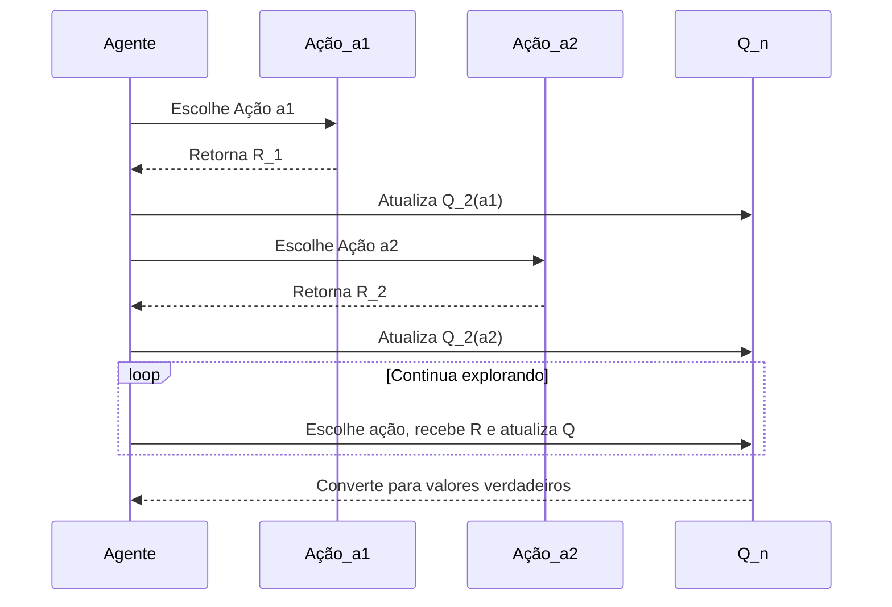
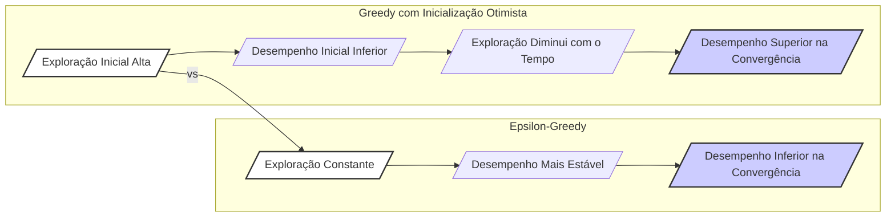
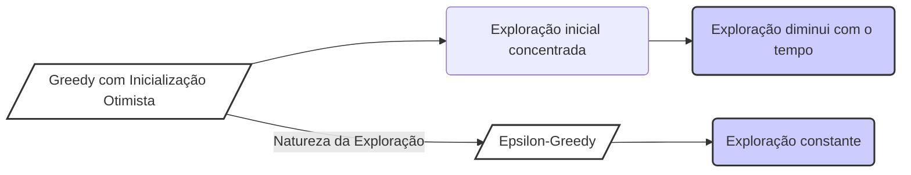
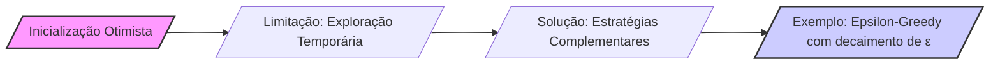

## Optimistic Initial Values para Incentivar a Exploração em Multi-Armed Bandits

### Introdução
Em problemas de **reinforcement learning (RL)**, a exploração do espaço de ações é essencial para encontrar a política ótima. Em cenários de **multi-armed bandits**, onde as ações são independentes, essa exploração se torna crucial. Métodos como o *ε-greedy* e *UCB (Upper Confidence Bound)* oferecem abordagens para equilibrar a exploração e a explotação, mas outra técnica, baseada na inicialização dos valores das ações, também pode ser eficaz [1]. Este capítulo visa explorar como valores iniciais de ações otimistas podem ser utilizados como uma forma de incentivar a exploração em **k-armed bandit problems**. Ao longo do texto, veremos como essa abordagem funciona e suas limitações.

### Conceitos Fundamentais
**Action-value methods** estimam os valores das ações (q*(a)) com base nas recompensas recebidas ao selecioná-las. Inicialmente, essas estimativas são valores arbitrários, como $Q_1(a)$, e podem influenciar fortemente o comportamento do agente. A inicialização desses valores é um ponto crucial, e, segundo [1], os métodos discutidos são dependentes, em alguma medida, das estimativas iniciais de **action-value**, $Q_1(a)$. No caso do método *sample-average*, esse viés desaparece quando todas as ações são selecionadas ao menos uma vez, mas em métodos com passo de aprendizagem constante, como o definido em [2], a polarização é permanente. Na prática, esse viés geralmente não é um problema, e às vezes pode ser até útil. A desvantagem é que as estimativas iniciais se tornam parâmetros que precisam ser definidos pelo usuário [1].

**Proposição 1:** *A escolha de valores iniciais $Q_1(a)$ afeta a velocidade e a trajetória de convergência do aprendizado em métodos de action-value. Valores muito baixos podem levar a uma exploração lenta, enquanto valores otimistas podem acelerar a exploração inicial.*

**Observação 1:** *A proposição acima destaca a importância da inicialização. Uma escolha inadequada pode retardar o aprendizado. O ponto chave é equilibrar uma exploração suficiente no início com a eventual convergência para a ação ótima.*
```mermaid
flowchart LR
    A[/"Inicialização dos Valores de Ação "Q_1(a)"/"] --> B{/"Escolha de Ação"/}
    B -- "Recompensa" R_n --> C[/"Atualização de "Q_n(a)"/"]
    C --> D{/"Convergência?"/}
    D -- "Sim" --> E[/"Fim do Aprendizado"/]
    D -- "Não" --> B
    style A fill:#f9f,stroke:#333,stroke-width:2px
    style E fill:#ccf,stroke:#333,stroke-width:2px
```

Um modo simples de incentivar a exploração é configurar os valores iniciais das ações de forma otimista. Em vez de usar valores nulos ou arbitrários, podemos inicializar $Q_1(a)$ com valores que representem recompensas muito altas, superiores às recompensas que o agente espera receber. Essa abordagem incentiva o agente a explorar ações diferentes das iniciais por "decepção", já que as recompensas obtidas, geralmente, serão inferiores às estimativas iniciais. Por exemplo, em um cenário em que as recompensas são selecionadas a partir de uma distribuição normal com média 0 e variância 1, inicializar $Q_1(a) = +5$ para todas as ações seria uma escolha otimista [1].

> 💡 **Exemplo Numérico:** Considere um cenário com 3 ações (A, B, C). Inicializamos os valores das ações como $Q_1(A) = 5$, $Q_1(B) = 5$, e $Q_1(C) = 5$. Suponha que após a primeira rodada de cada ação, o agente recebe as recompensas $R_1(A) = 1$, $R_1(B) = -0.5$, e $R_1(C) = 2$. Com uma taxa de aprendizado $\alpha = 0.1$, as estimativas de valor seriam atualizadas como:
>
> $Q_2(A) = 5 + 0.1*(1-5) = 4.6$
> $Q_2(B) = 5 + 0.1*(-0.5-5) = 4.45$
> $Q_2(C) = 5 + 0.1*(2-5) = 4.7$
>
> Veja que as estimativas diminuíram, incentivando a exploração de outras ações no próximo passo.

**Lema 1:** *Se as recompensas $R_n$ são limitadas superiormente por um valor $R_{max}$, e as estimativas iniciais $Q_1(a)$ são definidas como $Q_1(a) > R_{max}$ para todas as ações *a*, então a primeira recompensa observada para cada ação será sempre menor que sua estimativa inicial, induzindo exploração.*
*Proof:* Dada a condição $Q_1(a) > R_{max}$, e como $R_n \le R_{max}$, tem-se que $R_n < Q_1(a)$. Portanto, o termo $(R_n - Q_1(a))$ na atualização do valor da ação será negativo, levando a uma redução no valor de $Q_n(a)$.
```mermaid
graph LR
    A[/"Definição:"/] --> B("Q_1(a) > R_{max}");
    B --> C("R_n <= R_{max}");
    C --> D("R_n < Q_1(a)");
    D --> E[/"Atualização "Q_n(a)" negativa/"];
     style A fill:#fff,stroke:#333,stroke-width:2px
     style E fill:#ccf,stroke:#333,stroke-width:2px
```

Essa técnica de inicialização otimista tem como objetivo induzir o agente a experimentar diversas ações antes de convergir, como uma forma de incentivar a exploração. De acordo com [1], mesmo se o agente tomar decisões *greedy*, essa estratégia produz um montante considerável de exploração. O resultado dessa exploração é que todas as ações são tentadas algumas vezes, antes que as estimativas de valores convirjam. No entanto, como ressalta o texto, essa técnica é uma “truque simples” que pode funcionar bem em problemas estacionários, mas não é uma abordagem geral para incentivar a exploração em todos os cenários, principalmente naqueles em que a não estacionariedade faz parte do problema [1]. O fato de focar as condições iniciais é um problema, principalmente se o ambiente for não estacionário, dado que esse tipo de exploração é inerentemente temporária.

**Teorema 1:** *Em um problema de multi-armed bandit estacionário com recompensas limitadas, uma inicialização otimista $Q_1(a) > R_{max}$ garante que cada ação seja explorada pelo menos uma vez antes que todas as estimativas de ação convirjam para seus valores verdadeiros.*
*Proof Strategy:* O lema 1 estabelece que a primeira recompensa observada será menor que a estimativa inicial, induzindo a exploração inicial. Em um ambiente estacionário, com o tempo, as estimativas de ação convergirão. A combinação desses fatores garante que todas as ações serão experimentadas antes da convergência.
```mermaid
flowchart LR
    A[/"Lema 1: "R_n < Q_1(a)"/"] --> B[/"Ambiente Estacionário"/]
    B --> C[/"Convergência de "Q_n(a)"/"]
    A -- "Induz" --> D[/"Exploração Inicial"/]
    D --> E[/"Todas as Ações Exploradas"/]
    C--> E
     style A fill:#fff,stroke:#333,stroke-width:2px
    style E fill:#ccf,stroke:#333,stroke-width:2px
```

**Lema 1.1** *A eficácia da inicialização otimista é inversamente proporcional à variância das recompensas. Quanto maior a variância, menor a previsibilidade das recompensas, tornando a "decepção" inicial menos pronunciada e a exploração menos direcionada.*
*Proof:* Uma alta variância nas recompensas significa que é possível que uma recompensa seja próxima ou maior do que os valores iniciais otimistas, diminuindo o efeito da "decepção" e, consequentemente, o incentivo à exploração.
```mermaid
graph LR
    A[/"Alta Variância "var(R)"/"] --> B("Recompensas menos previsíveis");
    B --> C("Menor 'decepção' inicial");
    C --> D("Exploração menos direcionada");
     style A fill:#fff,stroke:#333,stroke-width:2px
    style D fill:#ccf,stroke:#333,stroke-width:2px
```

> 💡 **Exemplo Numérico:** Vamos comparar dois cenários. No cenário 1, as recompensas seguem uma distribuição normal com média 0 e desvio padrão 1. No cenário 2, as recompensas seguem uma distribuição normal com média 0 e desvio padrão 5. Inicializamos $Q_1(a) = 5$ para todas as ações em ambos os cenários.
>
> No cenário 1, as recompensas típicas estarão na faixa de -3 a 3, significativamente abaixo de 5. A "decepção" será clara e o agente explorará outras ações. No cenário 2, com maior variância, é mais provável que algumas recompensas sejam próximas ou maiores que 5. Isso reduz a "decepção" e torna a exploração inicial menos eficaz, pois não há uma clara motivação para mudar de ação.

**Corolário 1:** *Em ambientes não estacionários, onde os valores das recompensas mudam ao longo do tempo, a inicialização otimista pode não ser suficiente para garantir uma exploração adequada a longo prazo. A exploração torna-se temporária, pois os valores otimistas iniciais são eventualmente superados pela mudança na distribuição de recompensas.*
```mermaid
graph LR
    A[/"Ambiente Não Estacionário"/"] --> B("Valores das Recompensas Mudam");
    B --> C("Inicialização Otimista Superada");
    C --> D("Exploração Temporária");
    style A fill:#fff,stroke:#333,stroke-width:2px
    style D fill:#ccf,stroke:#333,stroke-width:2px
```

> 💡 **Exemplo Numérico:** Considere um cenário não-estacionário onde inicialmente a ação A tem uma recompensa média de 0, enquanto a ação B tem uma recompensa média de -2. Inicializamos $Q_1(A) = Q_1(B) = 5$. Inicialmente, o agente explora as duas ações. Após 100 iterações, a recompensa média da ação B muda para 3. A inicialização otimista não incentivará o agente a explorar a ação B novamente, pois seu valor inicial (alto) não indica a mudança na recompensa. Nesse caso, estratégias como ε-greedy ou UCB, que continuam explorando, seriam mais adequadas.

**Demonstração Prática:**
Para demonstrar o efeito da inicialização otimista, considere o problema do *10-armed testbed*. Nesse problema, as recompensas das ações são selecionadas a partir de distribuições normais com variância 1 e média q*(a), que por sua vez também seguem distribuições normais com média 0 e variância 1. Se inicializarmos $Q_1(a)$ com +5 para todos os *a*, o agente tenderá a explorar mais ações no início, pois as recompensas obtidas serão inferiores às estimativas iniciais, resultando numa "decepção" e numa busca por ações melhores.

**A seguinte análise mostra a evolução das estimativas em uma abordagem greedy com valores iniciais otimistas.**

Seja a atualização do valor da ação dada por:

$$ Q_{n+1} = Q_n + \alpha(R_n - Q_n) $$

Onde:

$Q_{n+1}$ é a nova estimativa do valor da ação após a n-ésima tentativa.
$Q_n$ é a estimativa atual do valor da ação.
$R_n$ é a recompensa recebida após a n-ésima tentativa.
$\alpha$ é a taxa de aprendizado.
```mermaid
flowchart LR
    A[/"Q_{n+1} = Q_n + \alpha(R_n - Q_n)"/"]
    style A fill:#f9f,stroke:#333,stroke-width:2px
```

Considere que $Q_1(a) = 5$, e que as recompensas são valores selecionados de uma distribuição normal com média 0 e desvio padrão 1. As recompensas observadas tendem a ser menores que 5, dado que essa distribuição tem média 0.

1. **Primeira tentativa:**
   - O agente toma a ação $a_1$. Recebe uma recompensa $R_1$, que provavelmente será menor do que $Q_1(a_1) = 5$.
   - A estimativa de valor para a ação $a_1$ é atualizada: $Q_2(a_1) = 5 + \alpha(R_1 - 5)$.

2. **Segunda tentativa:**
   - O agente toma a ação $a_2$. Recebe uma recompensa $R_2$, que também será provavelmente menor do que $Q_1(a_2) = 5$.
   - A estimativa de valor para a ação $a_2$ é atualizada: $Q_2(a_2) = 5 + \alpha(R_2 - 5)$.

3. **Terceira tentativa:**
    - O agente pode escolher, novamente, qualquer ação, ou seja,  $a_1$ ou $a_2$ ou outra.
   - A estimativa de valor da ação selecionada é atualizada.

Assim, o agente continua a explorar, a tomar ações e atualizar os valores das ações. O agente fica "desapontado" com as recompensas e troca a ação. Com o tempo, essas estimativas convergem para os verdadeiros valores das ações q*(a), garantindo que a exploração diminua. Isso demonstra o funcionamento da inicialização otimista como um incentivo à exploração no início do aprendizado.


> 💡 **Exemplo Numérico:** Vamos simular as primeiras 5 iterações de um agente com 3 ações (A, B, C), $\alpha = 0.1$, e valores iniciais $Q_1(A)=Q_1(B)=Q_1(C) = 5$. As recompensas recebidas são:
>
> Iteração 1: Agente escolhe A, $R_1(A) = 1$, $Q_2(A) = 5 + 0.1*(1-5) = 4.6$
> Iteração 2: Agente escolhe B, $R_2(B) = -0.5$, $Q_2(B) = 5 + 0.1*(-0.5-5) = 4.45$
> Iteração 3: Agente escolhe C, $R_3(C) = 2.0$, $Q_2(C) = 5 + 0.1*(2-5) = 4.7$
> Iteração 4: Agente escolhe B, $R_4(B) = 1.5$, $Q_3(B) = 4.45 + 0.1*(1.5-4.45) = 4.155$
> Iteração 5: Agente escolhe A, $R_5(A) = 0.5$, $Q_3(A) = 4.6 + 0.1*(0.5-4.6) = 4.19$
>
> Note que todos os valores das ações estão decrescendo e as ações estão sendo exploradas. A "decepção" inicial leva à exploração.

**Análise Comparativa:**
A Figura 2.3 [5] do contexto original demonstra que um método *greedy* com valores iniciais otimistas inicialmente tem um desempenho inferior, mas, eventualmente, alcança um desempenho melhor do que o método *ε-greedy* com $Q_1(a) = 0$. O método otimista explora mais no início, mas sua exploração diminui ao longo do tempo, ao contrário do método *ε-greedy* que continua a explorar em um ritmo constante.


> 💡 **Exemplo Numérico:** Vamos analisar a diferença entre inicialização otimista e ε-greedy usando um experimento hipotético em um ambiente de 10-armed bandits.
>
> **Configurações:**
> *   10 ações, cada uma com recompensas seguindo uma distribuição normal com média q*(a) e desvio padrão 1.
> *   q*(a) também segue uma distribuição normal com média 0 e desvio padrão 1.
> *   Inicialização otimista: $Q_1(a) = 5$ para todas as ações.
> *   ε-greedy: $Q_1(a) = 0$ para todas as ações e ε = 0.1
> *   Taxa de aprendizado (α) = 0.1 para ambos os métodos.
>
> **Resultados Esperados (hipotéticos):**
>
> | Iterações | Inicialização Otimista (Recompensa Média) | ε-greedy (Recompensa Média) |
> |----------|---------------------------------------|----------------------------|
> | 100      | 0.8                                   | 0.5                        |
> | 500      | 1.3                                   | 1.2                         |
> | 1000     | 1.5                                   | 1.4                        |
>
> Inicialmente, o método otimista tem uma recompensa média menor porque explora mais. Com o tempo, o método otimista se estabiliza e alcança uma recompensa média maior, enquanto o método ε-greedy continua explorando, mas pode ter um desempenho ligeiramente inferior.

**Teorema 1.1:** *A diferença no desempenho entre uma estratégia greedy com inicialização otimista e uma estratégia ε-greedy com inicialização nula reside na sua natureza de exploração. A primeira concentra a exploração no início e a diminui com o tempo, enquanto a segunda mantém um nível constante de exploração.*


### Conclusão
Valores iniciais otimistas são uma forma simples e eficaz de incentivar a exploração em problemas de *multi-armed bandits* com ambientes estacionários. Ao iniciar as estimativas de valor das ações com valores muito altos, o agente se sente “desapontado” com as recompensas recebidas e explora outras ações, ajudando a convergir para as ações ótimas. No entanto, essa técnica tem suas limitações, especialmente em ambientes não estacionários, onde a exploração contínua é necessária. Em tais casos, outros métodos como *ε-greedy*, *UCB*, ou algoritmos de *gradient bandit* podem ser mais apropriados.

**Observação 2:** *Para mitigar a limitação da exploração temporária, uma combinação de inicialização otimista com outras estratégias de exploração, como ε-greedy com um ε decrescente ao longo do tempo, poderia ser uma abordagem promissora.*

### Referências
[^1]: "All the methods we have discussed so far are dependent to some extent on the initial action-value estimates, Q1(a). In the language of statistics, these methods are biased by their initial estimates. For the sample-average methods, the bias disappears once all actions have been selected at least once, but for methods with constant a, the bias is permanent, though decreasing over time as given by (2.6). In practice, this kind of bias is usually not a problem and can sometimes be very helpful. The downside is that the initial estimates become, in effect, a set of parameters that must be picked by the user, if only to set them all to zero. The upside is that they provide an easy way to supply some prior knowledge about what level of rewards can be expected."
[^2]: "The averaging methods discussed so far are appropriate for stationary bandit problems, that is, for bandit problems in which the reward probabilities do not change over time. As noted earlier, we often encounter reinforcement learning problems that are effectively nonstationary. In such cases it makes sense to give more weight to recent rewards than to long-past rewards. One of the most popular ways of doing this is to use a constant step-size parameter. For example, the incremental update rule (2.3) for updating an average Qn of the n – 1 past rewards is modified to be
Qn+1 = Qn + a[Rn - Qn],"
[^3]: "Initial action values can also be used as a simple way to encourage exploration. Suppose that instead of setting the initial action values to zero, as we did in the 10-armed testbed, we set them all to +5. Recall that the q*(a) in this problem are selected from a normal distribution with mean 0 and variance 1. An initial estimate of +5 is thus wildly optimistic. But this optimism encourages action-value methods to explore. Whichever actions are initially selected, the reward is less than the starting estimates; the learner switches to other actions, being “disappointed” with the rewards it is receiving. The result is that all actions are tried several times before the value estimates converge. The system does a fair amount of exploration even if greedy actions are selected all the time."
[^4]: "We regard it as a simple trick that can be quite effective on stationary problems, but it is far from being a generally useful approach to encouraging exploration. For example, it is not well suited to nonstationary problems because its drive for exploration is inherently temporary."
[^5]: "Figure 2.3 shows the performance on the 10-armed bandit testbed of a greedy method using Q1(a) = +5, for all a. For comparison, also shown is an ɛ-greedy method with Q1(a) = 0. Initially, the optimistic method performs worse because it explores more, but eventually it performs better because its exploration decreases with time."
