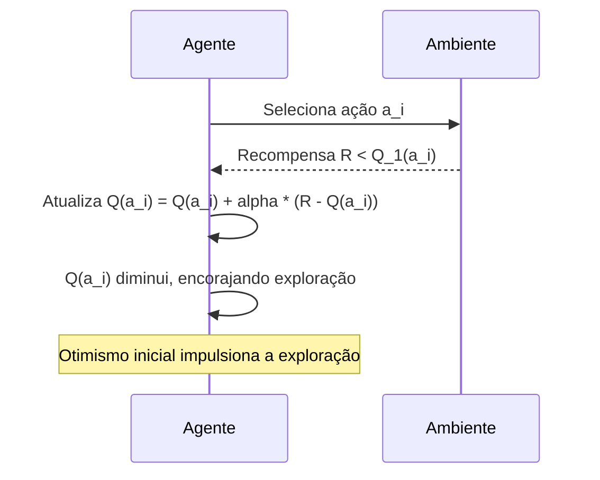

## Otimismo nas Estimativas Iniciais de Valores de Ação
### Introdução
Em problemas de **reinforcement learning** (RL), a exploração é crucial para descobrir ações ótimas, especialmente quando o ambiente é desconhecido. Uma forma de encorajar a exploração é através do uso de **estimativas iniciais otimistas** para os valores de ação [^1]. Este capítulo investiga a eficácia desta abordagem, focando em como ela influencia o processo de aprendizagem em cenários de **k-armed bandit** [^1]. Ao contrário do feedback instrutivo do aprendizado supervisionado, o RL se baseia em feedback avaliativo, o que destaca a importância da exploração para identificar as melhores ações [^1]. Este capítulo foca especificamente na aprendizagem não associativa, onde se aprende a agir em uma única situação, em contraste com problemas mais complexos de RL onde o comportamento tem que variar de situação em situação [^1]. Em particular, este capítulo estuda um problema de feedback avaliativo não associativo, o **k-armed bandit problem** [^1].

### Conceitos Fundamentais
Os métodos discutidos até agora dependem em certa medida das estimativas iniciais de valor da ação, $Q_1(a)$ [^1]. Em termos estatísticos, estes métodos são *enviesados pelas estimativas iniciais* [^1]. Para os métodos de **sample-average**, este enviesamento desaparece quando todas as ações são selecionadas pelo menos uma vez [^1]. No entanto, para métodos com $\alpha$ constante, o viés é permanente, embora diminua com o tempo [^1]. Na prática, esse tipo de enviesamento geralmente não é um problema e, às vezes, pode ser muito útil [^1]. O lado negativo é que as estimativas iniciais tornam-se, na verdade, um conjunto de parâmetros que devem ser escolhidos pelo usuário, nem que seja para defini-los todos para zero [^1]. O lado positivo é que eles fornecem uma maneira fácil de fornecer algum conhecimento prévio sobre qual nível de recompensas pode ser esperado [^1].

**Lema 1:** *Em métodos de sample-average, o enviesamento inicial devido a $Q_1(a)$ desaparece assim que todas as ações $a$ forem selecionadas pelo menos uma vez.*

*Prova:* A prova deste lema decorre diretamente da definição do método de sample-average, onde cada ação $a$ é atualizada usando a média de todas as recompensas obtidas após a seleção de $a$.  Quando todas as ações são selecionadas ao menos uma vez, todas as estimativas $Q_t(a)$ são baseadas em médias de recompensas observadas, e o efeito da estimativa inicial $Q_1(a)$ é diluído conforme mais recompensas são recebidas.

> 💡 **Exemplo Numérico:** Suponha um problema de 3-armed bandit com ações $a_1$, $a_2$ e $a_3$. Inicializamos $Q_1(a_1) = 0$, $Q_1(a_2) = 0$ e $Q_1(a_3) = 0$. Usando o método sample-average, após selecionar $a_1$ e receber uma recompensa de 1, $Q_2(a_1) = \frac{1}{1} = 1$. Se selecionarmos $a_2$ e recebermos uma recompensa de 2, $Q_2(a_2) = \frac{2}{1} = 2$. Se selecionarmos $a_3$ e recebermos uma recompensa de 0, $Q_2(a_3) = \frac{0}{1} = 0$. Se voltarmos a selecionar $a_1$ e recebermos uma recompensa de 0, $Q_3(a_1) = \frac{1+0}{2} = 0.5$. A cada seleção, a influência das recompensas iniciais é diluída, mostrando o desaparecimento do enviesamento inicial.

```mermaid
flowchart TD
    A[ "Inicialização" ] --> B{ "Selecionar Ação a" };
    B --> C[ "Obter Recompensa R" ];
    C --> D{ "Atualizar Q(a)" };
    D --> E{ "Todas as ações exploradas?" };
    E -- "Não" --> B;
    E -- "Sim" --> F[ "Enviesamento inicial diluído" ];
    style A fill:#f9f,stroke:#333,stroke-width:2px
    style F fill:#ccf,stroke:#333,stroke-width:2px
    
    subgraph "Sample-Average Process"
    A
    B
    C
    D
    E
    F
    end
```

**Otimismo Inicial como Mecanismo de Exploração:** As estimativas iniciais dos valores de ação também podem ser usadas como uma forma simples de incentivar a exploração [^1]. Em vez de definir os valores iniciais de ação para zero, como feito no teste de 10-armed bandit, o texto propõe configurá-los todos para +5 [^1]. Isso cria uma estimativa inicial *altamente otimista*, já que os valores verdadeiros $q*(a)$ neste problema são selecionados a partir de uma distribuição normal com média 0 e variância 1 [^1]. Este otimismo incentiva os métodos de valor de ação a explorar, pois as recompensas recebidas são menores que as estimativas iniciais, fazendo com que o algoritmo experimente outras ações em busca de maiores recompensas [^1]. O sistema realiza uma exploração razoável, mesmo que ações gananciosas sejam selecionadas o tempo todo [^1].

> 💡 **Exemplo Numérico:** Considere um 10-armed bandit. Inicializamos todos os valores de ação $Q_1(a_i) = 5$ para $i = 1, \ldots, 10$. Suponha que após selecionar a ação $a_1$, recebemos uma recompensa de 1. Usando um método com $\alpha=0.1$, a nova estimativa seria $Q_2(a_1) = 5 + 0.1 * (1 - 5) = 4.6$. Como o valor atualizado (4.6) é menor que o inicial (5), a tendência é que o agente explore outras ações. Se após a seleção da ação $a_2$ obtivermos uma recompensa de -1, $Q_2(a_2) = 5 + 0.1*(-1 - 5) = 4.4$. A estimativa decresce a cada interação, encorajando a exploração.


  
**Análise da Performance:** A Figura 2.3 [^1] compara a performance de um método ganancioso com $Q_1(a) = +5$ com um método $\epsilon$-greedy com $Q_1(a) = 0$. Inicialmente, o método otimista apresenta um desempenho pior, mas eventualmente supera o método $\epsilon$-greedy, pois sua exploração diminui ao longo do tempo [^1]. Esta técnica para incentivar a exploração é conhecida como **valores iniciais otimistas** [^1]. É uma técnica simples, mas eficaz em problemas estacionários. Contudo, ela não é uma abordagem geral para estimular a exploração [^1]. A exploração inerente ao otimismo inicial é temporária e não é adequada para problemas não estacionários [^1].

> 💡 **Exemplo Numérico:**  Imagine que temos dois agentes, um com valores iniciais otimistas (todos iguais a 5) e outro $\epsilon$-greedy (com $\epsilon=0.1$ e valores iniciais iguais a 0). Suponha que o valor ótimo da ação é 2. O agente otimista, ao receber recompensas abaixo de 5, tenderá a experimentar outras ações. Inicialmente, ele pode obter recompensas baixas, como 0 ou 1, resultando em um desempenho inferior. No entanto, com o tempo, suas estimativas convergem para perto de 2, reduzindo a necessidade de explorar. O agente $\epsilon$-greedy, por outro lado, explora uma pequena fração das vezes desde o início, mas de forma constante. Inicialmente, tem um desempenho melhor que o otimista, mas a convergência do otimista acaba por gerar melhor desempenho. Este exemplo ilustra o trade-off entre exploração inicial e convergência.

```mermaid
flowchart TD
    subgraph "Agente Otimista (Q1=+5)"
      A[ "Inicial: Exploração Alta, Desempenho Baixo" ] --> B[ "Convergência: Exploração Reduz, Desempenho Aumenta" ]
    end

    subgraph "Agente Epsilon-Greedy (Q1=0)"
      C[ "Inicial: Exploração Contínua, Desempenho Estável" ]
    end
    A -- "com o tempo" --> B
    C --> B
    style A fill:#f9f,stroke:#333,stroke-width:2px
    style B fill:#ccf,stroke:#333,stroke-width:2px
     style C fill:#ffc,stroke:#333,stroke-width:2px
```

**Proposição 1:** *Em um ambiente estacionário com k-arm bandits, o uso de valores iniciais otimistas $Q_1(a)$ leva a uma fase inicial de exploração seguida de uma fase de exploração reduzida, convergindo para a ação ótima.*

*Prova:* A prova desta proposição decorre da natureza do otimismo inicial. O viés inicial para valores altos de $Q_1(a)$ leva o agente a explorar as ações. Com o tempo, à medida que os valores estimados $Q_t(a)$ se aproximam dos valores verdadeiros $q*(a)$, a diferença entre $Q_t(a)$ e $q*(a)$ diminui, e a necessidade de explorar diminui naturalmente.

> 💡 **Exemplo Numérico:** Considere um ambiente estacionário com 5-armed bandit. Inicializamos $Q_1(a_i) = 10$ para todo $i = 1, \ldots, 5$, enquanto os valores verdadeiros são $q^*(a_1)=2, q^*(a_2)=3, q^*(a_3)=1, q^*(a_4)=0, q^*(a_5)=2$. No início, o agente explora as 5 ações buscando recompensas maiores do que o esperado (10). Ao longo do tempo, os valores estimados $Q_t(a_i)$ para cada ação convergem para os valores reais $q^*(a_i)$. A exploração diminui conforme os valores de ação se estabilizam, e o agente tende a selecionar a ação ótima ($a_2$ neste caso).

```mermaid
flowchart TD
    A[ "Q_1(a) >> q*(a)" ] --> B[ "Exploração Inicial" ];
    B --> C{ "Q_t(a) -> q*(a)" };
    C --> D[ "Exploração Reduzida" ];
    D --> E[ "Convergência para Ação Ótima" ];
     style A fill:#f9f,stroke:#333,stroke-width:2px
     style B fill:#ccf,stroke:#333,stroke-width:2px
     style E fill:#ffc,stroke:#333,stroke-width:2px
        subgraph "Processo de Aprendizagem"
        A
        B
        C
        D
        E
        end
```

**Limitações em Cenários Não Estacionários:** A técnica de *valores iniciais otimistas* é útil em cenários estacionários, onde as recompensas e as probabilidades não mudam com o tempo [^1]. Contudo, em cenários não estacionários, onde a tarefa muda e é necessária uma exploração renovada, o otimismo inicial falha [^1]. A técnica não se adapta às mudanças no ambiente, pois o impulso para a exploração é inerentemente temporário, sendo uma limitação intrínseca da abordagem [^1]. Métodos que se concentram em condições iniciais específicas, como o *sample-average*, também têm o mesmo problema, pois tratam o início como um evento especial, calculando as médias com pesos iguais [^1].

**Lema 2:** *Em ambientes não estacionários, onde as recompensas e probabilidades de transição mudam com o tempo, métodos com viés inicial fixo, como o método de valores iniciais otimistas, não se adaptam às mudanças no ambiente.*

*Prova:* O lema é justificado pela natureza intrínseca do método de valores iniciais otimistas. O método gera exploração apenas no início. Em ambientes não estacionários, onde as recompensas e probabilidades de transição mudam, o método não se adapta pois não há mecanismo para reativar o processo de exploração após a fase inicial.

> 💡 **Exemplo Numérico:** Imagine que em um problema de 2-armed bandit, os valores de recompensa para as ações $a_1$ e $a_2$ sejam inicialmente 1 e 2, respectivamente. O agente, usando valores iniciais otimistas, explorará inicialmente e encontrará $a_2$ como a melhor ação. Contudo, num dado momento o ambiente muda, e agora as recompensas são 3 para $a_1$ e 0 para $a_2$. O método de valores iniciais otimistas não se adapta a essa mudança, pois a exploração inicial já ocorreu, e agora o agente continua selecionando $a_2$ por causa da sua estimativa de valor anterior. A falta de exploração contínua impede que o agente descubra que a melhor ação mudou.

```mermaid
flowchart TD
    A[ "Fase Inicial: Exploração" ] --> B{ "Ambiente Muda" };
    B -- "Sim" --> C[ "Exploração Não Reativada" ];
    B -- "Não" --> D[ "Adaptação em Ambientes Estacionários" ];
    C --> E[ "Método Falha em Ambientes Não Estacionários" ];
        style A fill:#f9f,stroke:#333,stroke-width:2px
     style B fill:#ccf,stroke:#333,stroke-width:2px
        style E fill:#ffc,stroke:#333,stroke-width:2px
   subgraph "Desempenho do Método em Diferentes Ambientes"
    A
    B
    C
    D
    E
   end
```

**Conclusão sobre Otimismo Inicial:** Embora os métodos de otimismo inicial sejam simples e adequados para tarefas estacionárias, eles são inadequados para cenários não estacionários, pois o impulso para exploração é temporário e não é reativado se o ambiente mudar. Embora não seja uma técnica robusta para exploração em ambientes de RL em geral, continua sendo uma técnica simples que pode ser útil e é frequentemente usada em combinação com outras técnicas de exploração [^1].

**Observação 1:** A combinação de valores iniciais otimistas com outras estratégias de exploração, como a exploração $\epsilon$-greedy, pode mitigar a falta de adaptação do método otimista em ambientes não-estacionários.

*Justificativa:* Ao combinar o otimismo inicial com outros mecanismos de exploração, a exploração é garantida tanto na fase inicial (pelo otimismo) quanto durante a aprendizagem (por outros mecanismos).

> 💡 **Exemplo Numérico:**  Suponha que combinemos valores iniciais otimistas ($Q_1(a) = 5$) com um método $\epsilon$-greedy ($\epsilon = 0.1$). Inicialmente, o otimismo leva a uma exploração ativa, como explicado anteriormente. No entanto, mesmo depois que os valores convergem em um ambiente não-estacionário, a componente $\epsilon$-greedy garante que o agente continue explorando com probabilidade 0.1, o que o permitirá detectar as mudanças nos valores de recompensa e adaptar-se a elas. Isso mostra como a combinação mitiga a limitação da exploração temporária da abordagem de otimismo inicial.

```mermaid
flowchart TD
    A[ "Valores Iniciais Otimistas" ] --> B[ "Exploração Inicial" ];
    B --> C[ "Componente Epsilon-Greedy" ];
     C --> D[ "Exploração Contínua" ];
     D --> E[ "Adaptação a Ambientes Não Estacionários" ];
     style A fill:#f9f,stroke:#333,stroke-width:2px
     style D fill:#ccf,stroke:#333,stroke-width:2px
     style E fill:#ffc,stroke:#333,stroke-width:2px
     subgraph "Combinação de Métodos"
        A
        B
        C
        D
        E
     end

```

### Conclusão
O uso de **valores iniciais otimistas** é uma estratégia simples para encorajar a exploração, especialmente em problemas **k-armed bandit**. Esta técnica funciona ao inicializar os valores de ação com estimativas significativamente maiores do que o esperado, incentivando o algoritmo a explorar para encontrar recompensas melhores do que suas expectativas iniciais. Embora seja eficaz em problemas estacionários, onde os parâmetros do ambiente são constantes, essa abordagem sofre limitações em problemas não estacionários, pois seu impulso exploratório é inerentemente temporário e não se adapta a mudanças no ambiente. No entanto, a técnica é simples e pode ser valiosa quando combinada com outras abordagens. A discussão no texto também destaca a necessidade de técnicas de exploração mais robustas e adaptáveis para lidar com problemas de **reinforcement learning** em ambientes complexos e não estacionários.

### Referências
[^1]: "All the methods we have discussed so far are dependent to some extent on the initial action-value estimates, $Q_1(a)$. In the language of statistics, these methods are biased by their initial estimates. For the sample-average methods, the bias disappears once all actions have been selected at least once, but for methods with constant a, the bias is permanent, though decreasing over time as given by (2.6). In practice, this kind of bias is usually not a problem and can sometimes be very helpful. The downside is that the initial estimates become, in effect, a set of parameters that must be picked by the user, if only to set them all to zero. The upside is that they provide an easy way to supply some prior knowledge about what level of rewards can be expected. Initial action values can also be used as a simple way to encourage exploration. Suppose that instead of setting the initial action values to zero, as we did in the 10-armed testbed, we set them all to +5. Recall that the q*(a) in this problem are selected from a normal distribution with mean 0 and variance 1. An initial estimate of +5 is thus wildly optimistic. But this optimism encourages action-value methods to explore. Whichever actions are initially selected, the reward is less than the starting estimates; the learner switches to other actions, being “disappointed” with the rewards it is receiving. The result is that all actions are tried several times before the value estimates converge. The system does a fair amount of exploration even if greedy actions are selected all the time. Figure 2.3 shows the performance on the 10-armed bandit testbed of a greedy method using $Q_1(a) = +5$, for all a. For comparison, also shown is an ɛ-greedy method with $Q_1(a) = 0$. Initially, the optimistic method performs worse because it explores more, but eventually it performs better because its exploration decreases with time. We call this technique for encouraging exploration optimistic initial values. We regard it as a simple trick that can be quite effective on stationary problems, but it is far from being a generally useful approach to encouraging exploration. For example, it is not well suited to nonstationary problems because its drive for exploration is inherently temporary. If the task changes, creating a renewed need for exploration, this method cannot help. Indeed, any method that focuses on the initial conditions in any special way is unlikely to help with the general nonstationary case. The beginning of time occurs only once, and thus we should not focus on it too much. This criticism applies as well to the sample-average methods, which also treat the beginning of time as a special event, averaging all subsequent rewards with equal weights. Nevertheless, all of these methods are very simple, and one of them or some simple combination of them—is often adequate in practice. In the rest of this book we make frequent use of several of these simple exploration techniques." *(Trecho de Multi-armed Bandits)*
