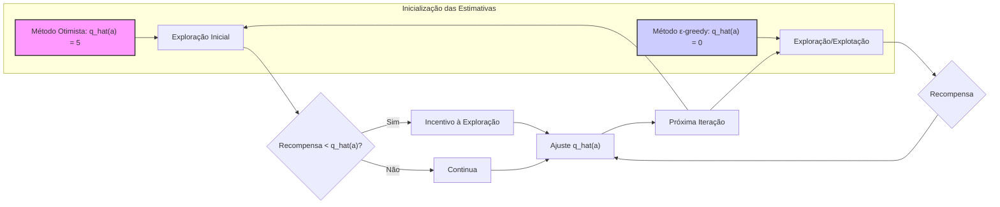
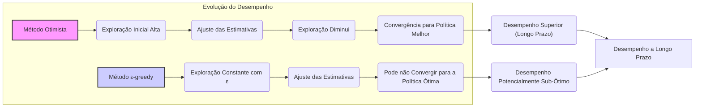
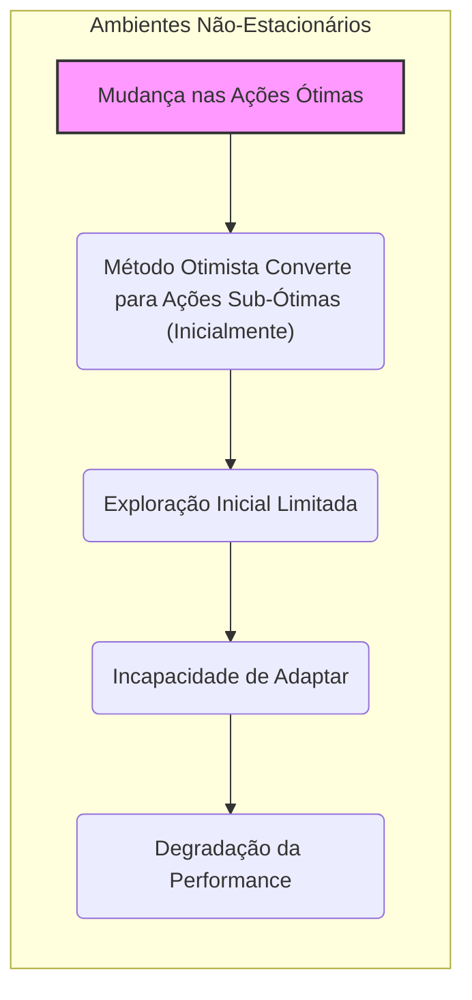
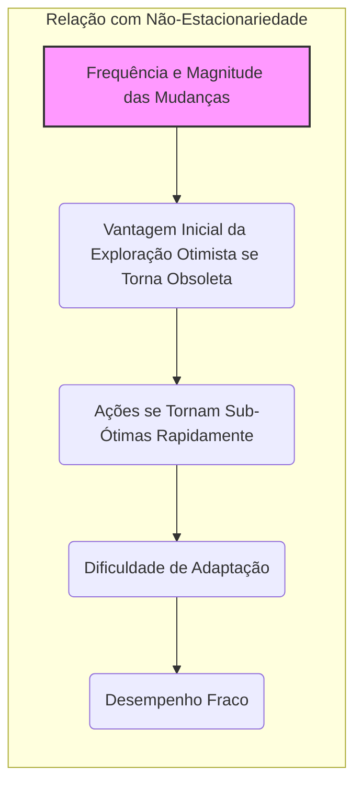

## Optimistic Initial Values e Não Estacionariedade

### Introdução
O conceito de **Optimistic Initial Values** (Valores Iniciais Otimistas) é uma técnica utilizada em problemas de *multi-armed bandits* para incentivar a exploração. Em vez de inicializar as estimativas de valor da ação com zero ou um valor baixo, inicializamos com um valor alto, incitando o agente a explorar novas ações com esperança de obter recompensas maiores do que as estimativas iniciais [^1]. No entanto, como será discutido, essa abordagem enfrenta limitações, especialmente em ambientes não estacionários, onde as recompensas e a melhor ação podem mudar ao longo do tempo [^1].

### Conceitos Fundamentais
**Valores Iniciais Otimistas** servem como um mecanismo para incentivar a exploração. Se as estimativas iniciais das ações são altas, o agente se torna mais propenso a experimentar outras ações que não as consideradas gananciosas inicialmente, pois suas recompensas iniciais serão, provavelmente, inferiores às estimativas iniciais, causando um "desapontamento" e motivando a exploração [^1].

Para ilustrar, considere um problema de *k-armed bandit* onde as recompensas são sorteadas de distribuições normais com média e variância específicas [^1]. Usando o *10-armed testbed*, um método *greedy* com estimativas iniciais de ações fixadas em +5 incentiva a exploração, resultando em uma performance inicial pior do que a de um método ε-greedy com estimativas iniciais em 0. Contudo, a performance do método otimista supera a do método ε-greedy com o tempo [^1].

> 💡 **Exemplo Numérico:**
> Suponha um *3-armed bandit* onde as recompensas de cada braço são sorteadas de distribuições normais com as seguintes médias e desvios padrão:
>
> - Braço 1: $\mu_1 = 1$, $\sigma_1 = 1$
> - Braço 2: $\mu_2 = 2$, $\sigma_2 = 1$
> - Braço 3: $\mu_3 = 3$, $\sigma_3 = 1$
>
> Inicializamos as estimativas de valor de cada braço ($\hat{q}(a)$) com:
>
> - Método Otimista: $\hat{q}(a_1) = \hat{q}(a_2) = \hat{q}(a_3) = 5$
> - Método ε-greedy: $\hat{q}(a_1) = \hat{q}(a_2) = \hat{q}(a_3) = 0$
>
> No primeiro passo, ambos os métodos escolhem uma ação aleatoriamente. Vamos supor que o braço 1 é selecionado. As recompensas obtidas para cada método serão menores que a estimativa inicial do método otimista, induzindo à exploração, enquanto o método ε-greedy não se sente "desapontado" com a recompensa. Após algumas iterações, o método otimista começa a ter melhores resultados do que o método ε-greedy.

**Lemma 1**. *A performance inicial do método otimista é pior do que a do ε-greedy*.
**Prova**. Inicialmente, o método otimista prioriza a exploração devido às suas altas estimativas iniciais. Isso faz com que as ações iniciais selecionadas ofereçam recompensas inferiores às estimativas, o que impulsiona a exploração. Já o método ε-greedy, com estimativas iniciais menores, tende a fazer uma escolha inicial melhor, explorando com a probabilidade $\epsilon$. Em seguida, o método otimista tende a melhorar com a redução da exploração ao longo do tempo [^1].  $\blacksquare$

> 💡 **Exemplo Numérico:**
>
> Vamos considerar um cenário onde o método otimista e o método ε-greedy interagem com um bandit por 5 passos. Suponha que a ação ótima seja o braço 3.
>
> | Passo | Método | Ação Escolhida | Recompensa |  $\hat{q}(a_1)$ | $\hat{q}(a_2)$ | $\hat{q}(a_3)$ | Exploração  |
> |------|-----------------|-------------|-----------|----------|----------|----------|----------------|
> | 1    | Otimista        | 1           | 0.8       | 4.9      | 5        | 5        | Alta  |
> | 1    | ε-greedy       | 3           | 2.9       | 0        | 0        | 2.9      | Baixa         |
> | 2    | Otimista       | 2           | 1.2        | 4.9      | 4.8        | 5        | Alta   |
> | 2    | ε-greedy       | 1           | 0.5       | 0.5      | 0        | 2.9       | Baixa         |
> | 3    | Otimista        | 3           | 3.1       | 4.9      | 4.8      | 4.9      | Moderada        |
> | 3    | ε-greedy       | 3           | 3.2       | 0.5      | 0        | 3.05       | Baixa         |
> | 4    | Otimista       | 1           | 0.7       | 4.8      | 4.8      | 4.9      | Moderada         |
> | 4    | ε-greedy       | 3           | 2.8       | 0.5     | 0        | 3.08      | Baixa         |
> | 5    | Otimista        | 3           | 2.9       | 4.8      | 4.8     | 4.9       | Baixa        |
> | 5    | ε-greedy       | 3           | 3.1       | 0.5      | 0        | 3.12     | Baixa        |
>
> Neste exemplo simplificado, o método otimista explorou mais no início, enquanto o ε-greedy se concentrou mais na ação que gerou mais recompensa rapidamente. A recompensa média do método ε-greedy é maior no começo, mas o método otimista acabará convergindo para uma política melhor.

**Lemma 2**. *A performance do método otimista pode superar a do ε-greedy com o tempo.*
**Prova**. À medida que o método otimista explora, as estimativas de valor das ações se ajustam às recompensas obtidas, e a exploração diminui gradualmente. No longo prazo, após explorar várias ações, o método otimista pode convergir para uma política melhor do que a do método ε-greedy que continua explorando indefinidamente [^1].  $\blacksquare$

> 💡 **Exemplo Numérico:**
>
> Continuando o exemplo anterior, vamos assumir que após 100 iterações, as estimativas dos valores das ações convergem para o seguinte:
>
> **Método Otimista:**
>
> - $\hat{q}(a_1) = 1.1$
> - $\hat{q}(a_2) = 1.9$
> - $\hat{q}(a_3) = 3.0$
>
> **Método ε-greedy:**
>
> - $\hat{q}(a_1) = 1.0$
> - $\hat{q}(a_2) = 1.8$
> - $\hat{q}(a_3) = 2.8$
>
> O método otimista, após explorar mais inicialmente, converge para um valor de $\hat{q}(a_3)$ mais próximo do valor real (que no nosso exemplo seria 3), já o método ε-greedy ainda não teve tempo suficiente para a exploração e sua estimativa é menor. Em um cenário estacionário, o método otimista tende a obter melhores recompensas no longo prazo.

**Lemma 2.1**. *O desempenho assintótico do método otimista em um ambiente estacionário com um número finito de ações é limitado pela política ótima.*
**Prova**. Em um ambiente estacionário, após um período de exploração inicial, as estimativas de valor das ações tendem a se aproximar dos seus valores reais. A exploração do método otimista diminui com o tempo, levando-o a convergir para uma política que se aproxima da política ótima. Como a melhor política é fixa e o método se torna menos explorador, o desempenho não pode ser arbitrariamente melhor do que o desempenho da melhor política. $\blacksquare$

No entanto, essa abordagem tem sérias limitações. O método *Optimistic Initial Values* é, essencialmente, dependente das condições iniciais. Em ambientes estacionários, essa estratégia pode ser eficaz para uma fase inicial de exploração. Mas, se o problema muda (ou seja, torna-se não estacionário), esse método não consegue se adaptar bem, porque seu incentivo à exploração é inerentemente temporário [^1]. O início do processo é um evento único e não deve receber uma atenção excessiva [^1]. Os métodos de sample-average, que tratam o início do tempo como um evento especial, com todos os pesos iguais, também são afetados por esse problema [^1].

**Proposição 3.** *Em ambientes não-estacionários, o desempenho do método com valores iniciais otimistas pode degradar-se rapidamente.*
**Prova.** Em ambientes não-estacionários, os valores ótimos das ações variam ao longo do tempo. O método otimista, ao convergir para um conjunto de ações que foram consideradas boas em um dado momento, pode não ser capaz de acompanhar as mudanças nas ações ótimas. Sua exploração é limitada a uma fase inicial, e quando as condições mudam, o método pode permanecer preso em ações sub-ótimas, levando à degradação da performance. $\blacksquare$

> 💡 **Exemplo Numérico:**
>
> Considere um *2-armed bandit* em um ambiente não-estacionário. As médias das recompensas dos braços mudam a cada 100 passos:
>
> - Passos 1-100: Braço 1 $\mu_1 = 1$, Braço 2 $\mu_2 = 2$
> - Passos 101-200: Braço 1 $\mu_1 = 3$, Braço 2 $\mu_2 = 1$
>
> Inicialmente, o método otimista irá explorar e convergir para o braço 2. No entanto, após 100 passos, o braço 1 se torna o ótimo, mas o método otimista não tem um mecanismo para revisitar sua exploração. A performance do método otimista irá degradar-se, pois ele não irá explorar a nova melhor ação, ficando "preso" à ação ótima do primeiro período.

Em um cenário não estacionário, onde as melhores ações podem mudar com o tempo, uma abordagem que incentiva a exploração apenas no início não é adequada. A necessidade de explorar e a natureza da exploração precisam se adaptar às mudanças no ambiente, exigindo uma abordagem mais flexível para o processo de aprendizagem [^1].

**Teorema 4.** *A eficácia da exploração utilizando valores iniciais otimistas é inversamente proporcional à frequência e magnitude das mudanças no ambiente não-estacionário.*
**Prova (Esboço)**.  Em ambientes onde mudanças ocorrem com alta frequência e grande magnitude, a vantagem inicial da exploração do método otimista se torna rapidamente obsoleta. As ações que inicialmente levavam a recompensas altas podem rapidamente se tornar sub-ótimas. O método, por não ter um mecanismo de exploração contínuo, terá dificuldades em se adaptar, resultando em um desempenho fraco. Quanto mais dinâmico o ambiente, menos eficaz será a exploração baseada apenas em valores iniciais otimistas. $\blacksquare$

> 💡 **Exemplo Numérico:**
>
> Imaginemos um cenário onde a melhor ação muda drasticamente a cada 20 passos, em vez de a cada 100 passos.
>
> - Passos 1-20: Braço 1 $\mu_1 = 1$, Braço 2 $\mu_2 = 2$
> - Passos 21-40: Braço 1 $\mu_1 = 4$, Braço 2 $\mu_2 = 0$
> - Passos 41-60: Braço 1 $\mu_1 = 0$, Braço 2 $\mu_2 = 5$
>
> Neste cenário, a rápida mudança das médias de recompensa dos braços faz com que o método com valores iniciais otimistas seja ainda menos eficaz. O tempo de convergência inicial do método será desperdiçado devido às mudanças frequentes, não permitindo que ele explore adequadamente o ambiente em constante mudança, fazendo com que sua performance seja baixa. Em contraste, métodos que se adaptam ao ambiente dinâmico apresentariam melhor desempenho.

### Conclusão
Embora a técnica de **Optimistic Initial Values** possa ser útil em ambientes estacionários, ela apresenta limitações significativas em contextos não estacionários. O método de *Optimistic Initial Values* é uma técnica inicial para incentivar a exploração, mas não é uma estratégia abrangente para ambientes dinâmicos. A exploração adequada nesses ambientes exige métodos que adaptam o processo de aprendizagem às mudanças do cenário, em vez de depender de configurações iniciais específicas, como será explorado em outras seções do livro [^1].

### Referências
[^1]: "All the methods we have discussed so far are dependent to some extent on the initial action-value estimates, Q1(a). In the language of statistics, these methods are biased by their initial estimates. For the sample-average methods, the bias disappears once all actions have been selected at least once, but for methods with constant a, the bias is permanent, though decreasing over time as given by (2.6). In practice, this kind of bias is usually not a problem and can sometimes be very helpful. The downside is that the initial estimates become, in effect, a set of parameters that must be picked by the user, if only to set them all to zero. The upside is that they provide an easy way to supply some prior knowledge about what level of rewards can be expected. Initial action values can also be used as a simple way to encourage exploration. Suppose that instead of setting the initial action values to zero, as we did in the 10-armed testbed, we set them all to +5. Recall that the q*(a) in this problem are selected from a normal distribution with mean 0 and variance 1. An initial estimate of +5 is thus wildly optimistic. But this optimism encourages action-value methods to explore. Whichever actions are initially selected, the reward is less than the starting estimates; the learner switches to other actions, being “disappointed” with the rewards it is receiving. The result is that all actions are tried several times before the value estimates converge. The system does a fair amount of exploration even if greedy actions are selected all the time. Figure 2.3 shows the performance on the 10-armed bandit testbed of a greedy method using Q1(a) = +5, for all a. For comparison, also shown is an ɛ-greedy method with Q1(a) = 0. Initially, the optimistic method performs worse because it explores more, but eventually it performs better because its exploration decreases with time. We call this technique for encouraging exploration optimistic initial values. We regard it as a simple trick that can be quite effective on stationary problems, but it is far from being a generally useful approach to encouraging exploration. For example, it is not well suited to nonstationary problems because its drive for exploration is inherently temporary. If the task changes, creating a renewed need for exploration, this method cannot help. Indeed, any method that focuses on the initial conditions in any special way is unlikely to help with the general nonstationary case. The beginning of time occurs only once, and thus we should not focus on it too much. This criticism applies as well to the sample-average methods, which also treat the beginning of time as a special event, averaging all subsequent rewards with equal weights. Nevertheless, all of these methods are very simple, and one of them — or some simple combination of them — is often adequate in practice. In the rest of this book we make frequent use of several of these simple exploration techniques." *(Trecho de Multi-armed Bandits)*
