## Upper-Confidence-Bound Action Selection: Uma Abordagem para Exploração em Bandidos Multiarmados

### Introdução
A necessidade de equilibrar **exploração** e **explotação** é um desafio central no aprendizado por reforço. Enquanto a explotação foca em escolher a ação que parece ser a melhor no momento, baseada no conhecimento atual, a exploração é necessária para descobrir ações potencialmente melhores que ainda não foram suficientemente avaliadas. No contexto de **problemas de bandidos multiarmados**, essa dicotomia se manifesta na escolha entre usar as ações que atualmente possuem as melhores estimativas de valor ou experimentar ações menos conhecidas para melhorar essas estimativas. O **método de seleção de ações Upper-Confidence-Bound (UCB)** aborda essa questão de forma sofisticada, fornecendo uma maneira eficaz de explorar ações que podem ser otimamente benéficas, mas que ainda possuem uma alta incerteza em suas estimativas de valor [1](https://chatgpt.com/c/67829922-359c-8011-96dd-970c04ed772c#user-content-fn-1).
Este capítulo explora em detalhes o método UCB, elucidando sua lógica, formulação matemática e como ele se relaciona com outras abordagens para a exploração, como o método ε-greedy.

### Conceitos Fundamentais
A motivação para o método UCB surge da observação de que a exploração é necessária devido à incerteza nas estimativas de valor das ações [2](https://chatgpt.com/c/67829922-359c-8011-96dd-970c04ed772c#user-content-fn-2). As **ações *greedy*** são aquelas com as melhores estimativas no presente momento, mas pode haver outras ações com potencial de serem superiores, cujas estimativas ainda não foram refinadas por terem sido escolhidas com menos frequência. O método ε-greedy força a exploração de ações não-greedy, mas de maneira indiscriminada, sem favorecer ações particularmente incertas. O método UCB, por outro lado, busca selecionar ações não-greedy que podem ser ótimas, levando em conta tanto a sua proximidade do máximo quanto as incertezas em suas estimativas [2](https://chatgpt.com/c/67829922-359c-8011-96dd-970c04ed772c#user-content-fn-2).
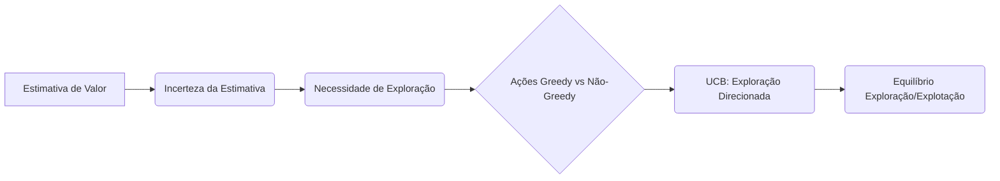
A ação selecionada pelo método UCB em um dado instante *$t$* é dada por:
$$A_t = \underset{a}{\operatorname{argmax}} \left[Q_t(a) + c\sqrt{\frac{\ln t}{N_t(a)}}\right],$$
onde:
- **$Q_t(a)$** é a estimativa de valor da ação *$a$* no tempo *$t$*.
- **$N_t(a)$** é o número de vezes que a ação *$a$* foi selecionada antes do tempo *$t$*.
- **$c > 0$** é um parâmetro que controla o grau de exploração.
- **$\ln t$** é o logaritmo natural de *$t$*. [2](https://chatgpt.com/c/67829922-359c-8011-96dd-970c04ed772c#user-content-fn-2)
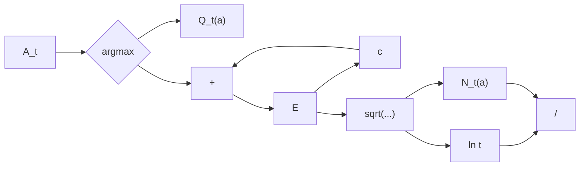
> 💡 **Exemplo Numérico:** Vamos considerar um cenário com 3 ações (A, B, e C) em *$t$*=10, com *$c$*=2. As estimativas de valor e contagens de seleção são as seguintes:
> -   $Q_{10}(A) = 0.5$, $N_{10}(A) = 5$
> -   $Q_{10}(B) = 0.7$, $N_{10}(B) = 2$
> -   $Q_{10}(C) = 0.4$, $N_{10}(C) = 1$
>
> Calculamos os termos de UCB para cada ação:
>
> -   $UCB(A) = 0.5 + 2\sqrt{\frac{\ln 10}{5}} \approx 0.5 + 2\sqrt{\frac{2.30}{5}} \approx 0.5 + 2\sqrt{0.46} \approx 0.5 + 2(0.678) \approx 0.5 + 1.356 \approx 1.856$
> -   $UCB(B) = 0.7 + 2\sqrt{\frac{\ln 10}{2}} \approx 0.7 + 2\sqrt{\frac{2.30}{2}} \approx 0.7 + 2\sqrt{1.15} \approx 0.7 + 2(1.072) \approx 0.7 + 2.144 \approx 2.844$
> -   $UCB(C) = 0.4 + 2\sqrt{\frac{\ln 10}{1}} \approx 0.4 + 2\sqrt{\frac{2.30}{1}} \approx 0.4 + 2\sqrt{2.30} \approx 0.4 + 2(1.516) \approx 0.4 + 3.032 \approx 3.432$
>
>  Neste caso, a ação C é selecionada pois possui o maior valor de UCB (3.432), apesar de ter uma estimativa de valor menor (0.4), porque foi menos explorada. Isso demonstra o equilíbrio entre exploração e explotação, incentivando a escolha de ações com maior incerteza.

O termo $\sqrt{\frac{\ln t}{N_t(a)}}$ é uma medida da incerteza ou variância na estimativa do valor de *$a$* [2](https://chatgpt.com/c/67829922-359c-8011-96dd-970c04ed772c#user-content-fn-2). Ele atua como um fator de incentivo à exploração:
- Se $N_t(a)$ for pequeno (a ação *$a$* foi selecionada poucas vezes), a incerteza é alta e o valor da ação é inflacionado, incentivando sua seleção.
- Se $N_t(a)$ for grande (a ação *$a$* foi selecionada muitas vezes), a incerteza diminui, e a ação é selecionada mais frequentemente com base no seu valor estimado.
- O parâmetro *$c$* controla a força desse incentivo à exploração [2](https://chatgpt.com/c/67829922-359c-8011-96dd-970c04ed772c#user-content-fn-2).
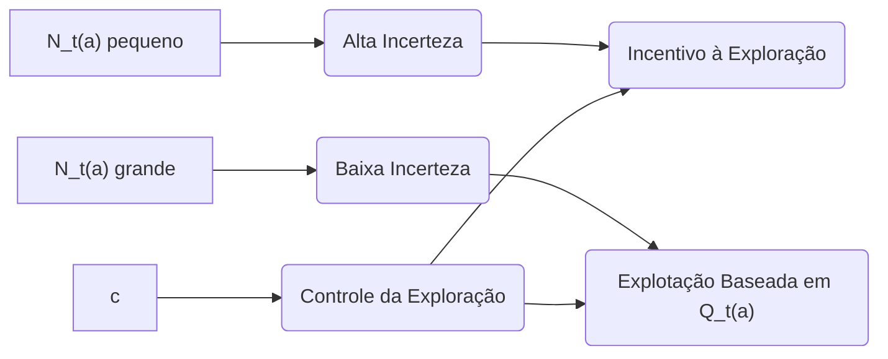

> 💡 **Exemplo Numérico:** Para ilustrar o efeito de $N_t(a)$ no termo de incerteza, considere duas ações com o mesmo valor estimado de $Q_t(a) = 0.6$ e *$c$* = 1.5, no tempo *$t$*=100. Ação A foi escolhida 10 vezes, enquanto a ação B foi escolhida 50 vezes.
>
> - Incerteza de A: $1.5\sqrt{\frac{\ln 100}{10}} \approx 1.5\sqrt{\frac{4.605}{10}} \approx 1.5\sqrt{0.4605} \approx 1.5 \times 0.6786 \approx 1.018$
> - Incerteza de B: $1.5\sqrt{\frac{\ln 100}{50}} \approx 1.5\sqrt{\frac{4.605}{50}} \approx 1.5\sqrt{0.0921} \approx 1.5 \times 0.3034 \approx 0.455$
>
>  Como vemos, a incerteza da ação A é muito maior do que a de B (1.018 vs 0.455), o que incentiva a exploração de A, pois foi menos explorada.

Quando $N_t(a) = 0$, a ação *$a$* é considerada uma ação maximizadora, assegurando que todas as ações sejam exploradas no início [2](https://chatgpt.com/c/67829922-359c-8011-96dd-970c04ed772c#user-content-fn-2). O método UCB é denominado "upper confidence bound" porque a expressão $Q_t(a) + c\sqrt{\frac{\ln t}{N_t(a)}}$ pode ser interpretada como um limite superior da estimativa do valor verdadeiro da ação *$a$*, com um nível de confiança determinado por *$c$* [2](https://chatgpt.com/c/67829922-359c-8011-96dd-970c04ed772c#user-content-fn-2).
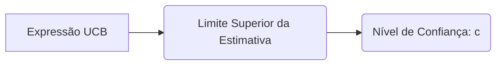

O uso do logaritmo natural faz com que os aumentos na incerteza fiquem menores com o tempo, mas eles são ilimitados, garantindo que todas as ações sejam eventualmente selecionadas [2](https://chatgpt.com/c/67829922-359c-8011-96dd-970c04ed772c#user-content-fn-2). No entanto, ações com estimativas de valor mais baixas ou que já foram selecionadas frequentemente serão selecionadas com menos frequência ao longo do tempo [2](https://chatgpt.com/c/67829922-359c-8011-96dd-970c04ed772c#user-content-fn-2).
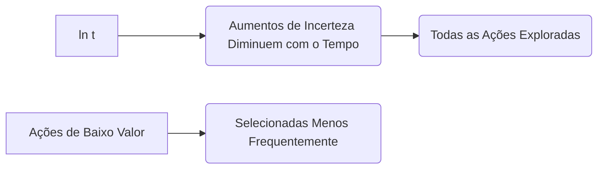

**Proposição 1.** *O método UCB garante que todas as ações sejam exploradas infinitamente em um ambiente estacionário, desde que $c > 0$.*

*Proof Sketch*: A presença do termo $\ln t$ no numerador da expressão de incerteza faz com que o incentivo à exploração cresça lentamente com o tempo. Como o logaritmo natural tende a infinito, todas as ações serão eventualmente exploradas, mesmo que com uma frequência cada vez menor. Uma ação que inicialmente não é escolhida devido ao seu valor $Q_t(a)$ ser baixo ou por ter sido explorada várias vezes, eventualmente terá sua incerteza aumentada o suficiente para ser selecionada novamente.
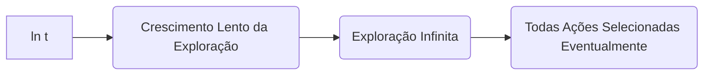

> 💡 **Exemplo Numérico:** Para demonstrar a exploração infinita, vamos simular o comportamento do termo $\sqrt{\frac{\ln t}{N_t(a)}}$ para uma ação *$a$* com $N_t(a)$ inicialmente pequeno e que cresce lentamente ao longo do tempo. Considere que a ação foi selecionada uma vez por cada 10 passos no inicio e depois mais lentamente. O parâmetro *$c$* = 1.
>
> |  t  |   $N_t(a)$    |  $\sqrt{\frac{\ln t}{N_t(a)}}$ |
> |-----|---------------|--------------------------------|
> |  10 |       1      |   $\sqrt{\frac{\ln 10}{1}} \approx 1.517 $  |
> | 100 |       10    |  $\sqrt{\frac{\ln 100}{10}} \approx 0.678$    |
> | 1000|       20    |  $\sqrt{\frac{\ln 1000}{20}} \approx 0.591$     |
> |10000|      30     |   $\sqrt{\frac{\ln 10000}{30}} \approx 0.552 $   |
>
>  Note como o termo de incerteza diminui ao longo do tempo, mas mesmo assim, ele nunca atinge zero.  Com um *$c$* > 0, a exploração continuará, garantindo que essa ação será selecionada novamente no futuro, se necessário, por mais que seja explorada menos frequentemente.

### Análise Comparativa
O método UCB possui algumas vantagens notáveis em relação a abordagens mais simples como o método ε-greedy [2](https://chatgpt.com/c/67829922-359c-8011-96dd-970c04ed772c#user-content-fn-2):
- **Exploração Direcionada**: Enquanto o ε-greedy explora ações não-greedy aleatoriamente, o UCB direciona a exploração para ações com maior potencial de serem ótimas, equilibrando o conhecimento atual com a incerteza.
- **Adaptabilidade**: O termo de incerteza em UCB se adapta naturalmente ao tempo, diminuindo a exploração à medida que as estimativas melhoram, o que é mais eficiente do que a taxa constante de exploração do ε-greedy.
- **Performance Superior**: Em muitos casos, o UCB demonstra melhor desempenho do que o ε-greedy, especialmente em tarefas onde a exploração inicial é crucial para descobrir ações ótimas.
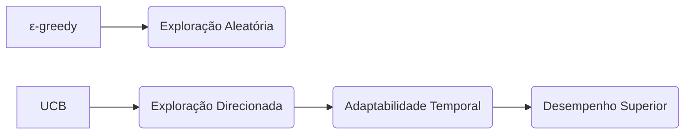

> 💡 **Exemplo Numérico:** Para comparar UCB com ε-greedy, vamos simular um cenário com duas ações (A e B) onde o valor verdadeiro de A é 0.7 e de B é 0.9, e ε=0.1.  Vamos comparar o número de vezes que a ação ótima (B) é escolhida ao longo de 100 iterações.
>
> Para o UCB, usaremos c = 2. Vamos considerar que a escolha inicial de cada ação seja aleatoria, e em seguida o metodo de escolha das acoes de acordo com a formula do UCB.
>
> ```python
> import numpy as np
>
> def ucb_action(Q, N, t, c=2):
>     ucb_values = Q + c * np.sqrt(np.log(t) / (N + 1e-6)) #add a small value to avoid division by zero
>     return np.argmax(ucb_values)
>
> def epsilon_greedy_action(Q, epsilon):
>    if np.random.rand() < epsilon:
>        return np.random.randint(len(Q))  # Explore
>    else:
>        return np.argmax(Q) # Exploit
>
> num_actions = 2
> true_values = [0.7, 0.9]
>
> # UCB Simulation
> Q_ucb = np.zeros(num_actions)
> N_ucb = np.zeros(num_actions)
> ucb_optimal_selections = 0
>
> # Epsilon-Greedy Simulation
> Q_epsilon = np.zeros(num_actions)
> N_epsilon = np.zeros(num_actions)
> epsilon_greedy_optimal_selections = 0
>
>
> for t in range(1, 101):
>     # UCB
>     action_ucb = ucb_action(Q_ucb, N_ucb, t)
>     reward_ucb = np.random.normal(true_values[action_ucb], 0.1)
>     N_ucb[action_ucb] += 1
>     Q_ucb[action_ucb] = Q_ucb[action_ucb] + (reward_ucb - Q_ucb[action_ucb]) / N_ucb[action_ucb]
>     if action_ucb == 1:
>         ucb_optimal_selections += 1
>
>
>     # Epsilon-Greedy
>     action_epsilon = epsilon_greedy_action(Q_epsilon, 0.1)
>     reward_epsilon = np.random.normal(true_values[action_epsilon], 0.1)
>     N_epsilon[action_epsilon] += 1
>     Q_epsilon[action_epsilon] = Q_epsilon[action_epsilon] + (reward_epsilon - Q_epsilon[action_epsilon]) / N_epsilon[action_epsilon]
>     if action_epsilon == 1:
>         epsilon_greedy_optimal_selections += 1
>
> print(f"UCB Optimal Selections: {ucb_optimal_selections}")
> print(f"Epsilon-Greedy Optimal Selections: {epsilon_greedy_optimal_selections}")
> ```
> Os resultados de uma simulação típica podem ser:
>
> ```text
> UCB Optimal Selections: 85
> Epsilon-Greedy Optimal Selections: 78
> ```
>
>  Como podemos observar, o método UCB, nesse caso, selecionou a ação ótima (B) mais vezes do que o método ε-greedy, mostrando uma performance superior e uma exploração mais direcionada.

**Lema 1.**  *A taxa de exploração do UCB decresce com o tempo, garantindo uma transição mais suave da exploração para a explotação.*

*Proof Sketch:* A taxa de exploração é dada pelo termo $c\sqrt{\frac{\ln t}{N_t(a)}}$. Enquanto $\ln t$ cresce lentamente, o valor de $N_t(a)$ também cresce com o tempo, conforme as ações são selecionadas. Assim, o denominador tende a crescer mais rápido que o numerador, diminuindo a taxa de exploração.
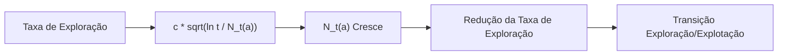

> 💡 **Exemplo Numérico:** Vamos demonstrar a taxa decrescente da exploração com o tempo. Consideramos novamente uma ação com *$c$*=1 e $N_t(a)$ que aumenta a cada vez que a ação é escolhida. Vamos ver a taxa de exploração da ação para diferentes valores de *$t$*.
>
>  | t    |   $N_t(a)$  | $\sqrt{\frac{\ln t}{N_t(a)}}$  |
>  |------|-------------|-------------------------------|
>  | 10   |    2    | $\sqrt{\frac{\ln 10}{2}} \approx 1.072$ |
>  | 100  |    15    | $\sqrt{\frac{\ln 100}{15}} \approx 0.554$ |
>  | 1000 |    100  | $\sqrt{\frac{\ln 1000}{100}} \approx 0.263$|
>  |10000 |   500  | $\sqrt{\frac{\ln 10000}{500}} \approx 0.145$ |
>
>  A tabela mostra que, à medida que o tempo *$t$* e o número de vezes que a ação é selecionada, *$N_t(a)$*, aumentam, o termo de exploração diminui, indicando uma transição da exploração para a explotação.

Apesar dessas vantagens, o UCB também apresenta limitações:
- **Complexidade**: O UCB é mais complexo que o ε-greedy e pode ser menos intuitivo para implementar.
- **Não-Estacionariedade**: O UCB não lida bem com problemas não-estacionários, onde as probabilidades de recompensa mudam ao longo do tempo [2](https://chatgpt.com/c/67829922-359c-8011-96dd-970c04ed772c#user-content-fn-2).
- **Generalização**: Em configurações de aprendizado por reforço mais gerais, como aquelas com grandes espaços de estados e ações, o método UCB não é facilmente generalizado [2](https://chatgpt.com/c/67829922-359c-8011-96dd-970c04ed772c#user-content-fn-2).
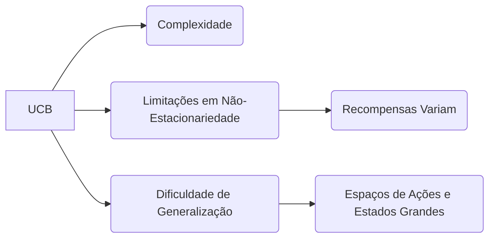
**Teorema 1.** *O UCB1, uma variante do UCB, tem uma garantia teórica de arrependimento logarítmico no contexto de bandidos multiarmados estocásticos.*

*Proof Sketch:* O UCB1 (uma versão específica do UCB com escolha apropriada de *$c$*) possui uma demonstração formal que seu arrependimento acumulado (a diferença entre as recompensas obtidas e as recompensas que um agente que sempre escolhe a melhor ação obteria) cresce no máximo logaritmicamente com o tempo. O fator logarítmico mostra que o UCB1 consegue alcançar um bom equilíbrio entre exploração e explotação. O resultado se baseia em técnicas de análise probabilística e desigualdades como a de Hoeffding.
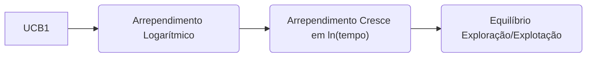

> 💡 **Exemplo Numérico:** Para ilustrar o conceito de arrependimento logarítmico, vamos simular o UCB1 em um cenário de 2 bandidos, onde o bandido 1 tem recompensa média de 0.3 e bandido 2 tem recompensa média de 0.7. A melhor ação seria sempre escolher o bandido 2, e o arrependimento seria a diferença entre a recompensa acumulada obtida e a recompensa que seria obtida se sempre escolhessemos a melhor ação.
> ```python
> import numpy as np
> import matplotlib.pyplot as plt
>
> def ucb1(Q, N, t):
>    ucb_values = Q + np.sqrt(2 * np.log(t) / (N + 1e-6))
>    return np.argmax(ucb_values)
>
> def simulate_bandit(num_actions, true_values, num_steps):
>    Q = np.zeros(num_actions)
>    N = np.zeros(num_actions)
>    rewards = []
>    cumulative_regret = [0]
>    for t in range(1, num_steps + 1):
>      action = ucb1(Q, N, t)
>      reward = np.random.normal(true_values[action], 0.1)
>      N[action] += 1
>      Q[action] = Q[action] + (reward - Q[action]) / N[action]
>      rewards.append(reward)
>      optimal_reward = max(true_values)
>      regret = optimal_reward - reward
>      cumulative_regret.append(cumulative_regret[-1]+regret)
>
>    return cumulative_regret
>
> num_actions = 2
> true_values = [0.3, 0.7]
> num_steps = 1000
>
> cumulative_regret = simulate_bandit(num_actions, true_values, num_steps)
>
> time_steps = list(range(num_steps + 1))
> plt.plot(time_steps, cumulative_regret)
> plt.xlabel("Time Step")
> plt.ylabel("Cumulative Regret")
> plt.title("Cumulative Regret over Time for UCB1")
> plt.grid(True)
> plt.show()
> ```
> Ao executar esse código, vemos um gráfico de "Cumulative Regret" versus "Time Steps". O gráfico mostrará que, apesar do arrependimento aumentar, o crescimento é sublinear, ou seja, o arrependimento cresce em proporção ao logaritmo do tempo.
>
> ```mermaid
>  graph LR
>      A["Time Step"] --> B("Cumulative Regret")
> ```
>
> Isso demonstra que, no longo prazo, o algoritmo se aproxima da recompensa ótima.

**Corolário 1.1** *A propriedade do arrependimento logarítmico do UCB1 implica que, no longo prazo, a média das recompensas obtidas pelo algoritmo se aproxima da recompensa ótima.*
*Proof Sketch*: Este corolário segue diretamente do Teorema 1. Se o arrependimento acumulado cresce logaritmicamente, então o arrependimento médio (o arrependimento dividido pelo número de passos de tempo) tende a zero quando o tempo vai para o infinito. Consequentemente, o desempenho do UCB1 se aproxima do desempenho do agente ótimo no longo prazo.
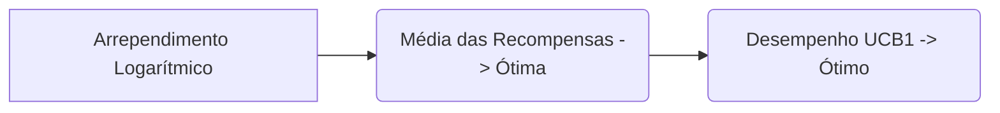
### Conclusão
O método Upper-Confidence-Bound (UCB) oferece uma abordagem sofisticada para a exploração em problemas de bandidos multiarmados, equilibrando eficazmente a explotação com a busca por ações potencialmente melhores. Ao contrário do ε-greedy, o UCB direciona a exploração para ações com maior incerteza em suas estimativas de valor, proporcionando uma adaptação mais eficiente ao longo do tempo e frequentemente resultando em um desempenho superior. Apesar de suas limitações em cenários não-estacionários e configurações de aprendizado por reforço mais gerais, o método UCB permanece uma ferramenta valiosa para otimizar a exploração em problemas de bandidos multiarmados, destacando a importância de uma exploração mais inteligente e estratégica.

### Referências
[^1]: "In this chapter we study the evaluative aspect of reinforcement learning in a simplified setting, one that does not involve learning to act in more than one situation. This nonassociative setting is the one in which most prior work involving evaluative feedback has been done, and it avoids much of the complexity of the full reinforcement learning problem. Studying this case enables us to see most clearly how evaluative feedback differs from, and yet can be combined with, instructive feedback." *(Trecho de Multi-armed Bandits)*
[^2]: "Exploration is needed because there is always uncertainty about the accuracy of the action-value estimates. The greedy actions are those that look best at present, but some of the other actions may actually be better. ɛ-greedy action selection forces the non-greedy actions to be tried, but indiscriminately, with no preference for those that are nearly greedy or particularly uncertain. It would be better to select among the non-greedy actions according to their potential for actually being optimal, taking into account both how close their estimates are to being maximal and the uncertainties in those estimates. One effective way of doing this is to select actions according to $A_t = \underset{a}{\operatorname{argmax}} \left[Q_t(a) + c\sqrt{\frac{\ln t}{N_t(a)}}\right]$" *(Trecho de Multi-armed Bandits)*
