## Upper-Confidence-Bound Action Selection
### Introdução
Em problemas de **reinforcement learning**, a exploração é essencial, dado que sempre existe incerteza acerca da precisão das estimativas de valor de ação. As ações *greedy* são aquelas que, no momento, parecem ser as melhores, mas ações alternativas podem realmente ser superiores. A seleção de ações $\epsilon$-greedy força a experimentação de ações não-gananciosas, embora de forma indiscriminada, sem preferência pelas que são quase *greedy* ou mais incertas. Uma abordagem mais inteligente é selecionar ações não-gananciosas com base no seu potencial de otimalidade, considerando tanto as estimativas quanto as incertezas [^1].

### Conceitos Fundamentais
A **Upper-Confidence-Bound (UCB)** action selection aborda esta necessidade de forma eficaz [^1]. A ideia central é que o termo de raiz quadrada na seguinte expressão:
$$
A_t = \underset{a}{\text{argmax}} \left[ Q_t(a) + c \sqrt{\frac{\ln t}{N_t(a)}} \right]
$$
funciona como uma medida de incerteza ou variação na estimativa do valor de uma ação $a$. O valor maximizado é, portanto, um limite superior para o valor real da ação $a$, com $c$ controlando o nível de confiança [^1].
```mermaid
graph LR
    A[ "Ação a" ]
    Q[ "Q_t(a): Estimação do valor da ação a" ]
    U[ "c * sqrt(ln(t) / N_t(a)): Termo de Incerteza" ]
    S[ "Soma: Q_t(a) + Termo de Incerteza" ]
    M[ "A_t: Ação selecionada" ]
    A --> Q
    A --> U
    Q --> S
    U --> S
    S --> M
    style S fill:#f9f,stroke:#333,stroke-width:2px
    linkStyle 0,1,2,3 stroke:#333,stroke-width:1px
```

> 💡 **Exemplo Numérico:**
> Imagine que temos 3 ações (a1, a2, a3) e estamos no instante de tempo t=5. As estimativas de valor e contagens das ações são:
> - $Q_5(a1) = 10$, $N_5(a1) = 2$
> - $Q_5(a2) = 12$, $N_5(a2) = 1$
> - $Q_5(a3) = 8$, $N_5(a3) = 1$
>
> Usando a UCB com $c = 1$, calculamos:
>
> - $UCB(a1) = 10 + 1 \cdot \sqrt{\frac{\ln 5}{2}} = 10 + \sqrt{\frac{1.609}{2}} \approx 10 + 0.897 = 10.897$
> - $UCB(a2) = 12 + 1 \cdot \sqrt{\frac{\ln 5}{1}} = 12 + \sqrt{1.609} \approx 12 + 1.268 = 13.268$
> - $UCB(a3) = 8 + 1 \cdot \sqrt{\frac{\ln 5}{1}} = 8 + \sqrt{1.609} \approx 8 + 1.268 = 9.268$
>
> A ação selecionada será $a2$, pois $UCB(a2)$ é o maior. Note que, apesar de $Q_5(a2) > Q_5(a1)$, a incerteza de $a2$ é maior.

**Proposição 1:**  *A ação selecionada $A_t$ pela UCB é sempre uma ação cujo valor estimado mais o termo de incerteza é máximo dentre todas as ações.  Ou seja, para qualquer ação $b$ diferente de $A_t$, temos $Q_t(A_t) + c \sqrt{\frac{\ln t}{N_t(A_t)}} \geq Q_t(b) + c \sqrt{\frac{\ln t}{N_t(b)}}$.*
*Prova:*  Esta propriedade é uma consequência direta da definição da UCB, que seleciona a ação que maximiza a expressão $Q_t(a) + c \sqrt{\frac{\ln t}{N_t(a)}}$. Portanto, se $A_t$ é a ação que maximiza essa expressão, então ela deve ser maior ou igual a qualquer outra ação $b$ nessa mesma expressão. $\blacksquare$

**Detalhes da Equação 2.10:**
- $A_t$: Representa a ação selecionada no instante de tempo $t$ [^1].
- $Q_t(a)$: É a estimativa do valor da ação $a$ no instante de tempo $t$ [^1].
- $c$: É um parâmetro que controla o grau de exploração. Um valor mais alto de $c$ incentiva mais a exploração [^1].
- $t$: É o instante de tempo atual [^1].
- $N_t(a)$: É o número de vezes que a ação $a$ foi selecionada antes do instante de tempo $t$ [^1].
- $ln t$: É o logaritmo natural de $t$. Este termo garante que a exploração diminua com o tempo [^1].

> 💡 **Exemplo Numérico:**
> Se temos $t=10$ e a ação $a$ foi selecionada $N_t(a)=2$ vezes, o termo de incerteza é $\sqrt{\frac{\ln 10}{2}} = \sqrt{\frac{2.303}{2}} \approx 1.074$. Se $t=100$ e $N_t(a)=20$, o termo de incerteza é $\sqrt{\frac{\ln 100}{20}} = \sqrt{\frac{4.605}{20}} \approx 0.48$. Note que, mesmo com mais seleções da ação, o aumento de $t$ reduz o termo de incerteza.

**Lemma 1:** *O termo de incerteza $\sqrt{\frac{\ln t}{N_t(a)}}$ decresce com o aumento de $N_t(a)$ e cresce com o aumento de $t$.*
*Prova:*
A derivada de $\sqrt{\frac{\ln t}{N_t(a)}}$ com relação a $N_t(a)$ é:
$$
\frac{\partial}{\partial N_t(a)} \sqrt{\frac{\ln t}{N_t(a)}} = \sqrt{\ln t} \cdot \frac{-1}{2} {N_t(a)}^{-\frac{3}{2}} = -\frac{\sqrt{\ln t}}{2 {N_t(a)}^{\frac{3}{2}}}
$$
Como essa derivada é negativa, o termo diminui com o aumento de $N_t(a)$. A derivada com relação a $t$ é:
$$
\frac{\partial}{\partial t} \sqrt{\frac{\ln t}{N_t(a)}} = \frac{1}{2} \sqrt{\frac{1}{N_t(a) \ln t}} \frac{1}{t}  = \frac{1}{2t} \sqrt{\frac{1}{N_t(a) \ln t}}
$$
Como essa derivada é positiva, o termo aumenta com o aumento de $t$. $\blacksquare$


> 💡 **Exemplo Numérico:**
> Vamos analisar o impacto de $N_t(a)$ no termo de incerteza com $t=100$ e $c=1$:
>
> | $N_t(a)$ | Incerteza: $\sqrt{\frac{\ln t}{N_t(a)}}$ |
> |----------|-----------------------------------|
> | 1        | $\sqrt{\frac{\ln 100}{1}} \approx 2.145$    |
> | 5        | $\sqrt{\frac{\ln 100}{5}} \approx 0.96$    |
> | 25       | $\sqrt{\frac{\ln 100}{25}} \approx 0.429$  |
> | 50       | $\sqrt{\frac{\ln 100}{50}} \approx 0.303$  |
>
> Como podemos ver, quanto maior o $N_t(a)$, menor a incerteza.

**Lemma 1.1:** *Assumindo que $N_t(a) > 0$, o termo de incerteza $\sqrt{\frac{\ln t}{N_t(a)}}$ converge para zero quando $t$ tende a infinito e $N_t(a)$ cresce na mesma ordem de $t$.*

*Prova:* Seja $N_t(a) = k t$ para uma constante $k > 0$. Então, o termo de incerteza se torna $\sqrt{\frac{\ln t}{k t}} = \frac{\sqrt{\ln t}}{\sqrt{kt}}$.  Para mostrar que converge para zero, basta verificar que $\lim_{t\to\infty} \frac{\sqrt{\ln t}}{\sqrt{kt}} = \lim_{t\to\infty} \frac{\sqrt{\ln t}}{\sqrt{k}\sqrt{t}} = 0$. De fato, aplicando a regra de L'Hôpital para o limite $\lim_{t \to \infty} \frac{\sqrt{\ln t}}{\sqrt{t}}$, temos: $\lim_{t \to \infty} \frac{\frac{1}{2\sqrt{\ln t}}\cdot \frac{1}{t}}{\frac{1}{2\sqrt{t}}} = \lim_{t \to \infty} \frac{\sqrt{t}}{t\sqrt{\ln t}} = \lim_{t \to \infty} \frac{1}{\sqrt{t\ln t}}= 0$. Como $k$ é uma constante positiva,  $\lim_{t\to\infty} \frac{\sqrt{\ln t}}{\sqrt{kt}} = 0$. $\blacksquare$
```mermaid
graph LR
subgraph "Limite do Termo de Incerteza"
    A["Limite: lim t->inf sqrt(ln(t)/N_t(a))"]
    B["N_t(a) = k*t"]
    C["lim t->inf sqrt(ln(t) / k*t)"]
    D["lim t->inf sqrt(ln(t))/sqrt(k*t)"]
    E["Regra de L'Hôpital"]
    F["lim t->inf 1/sqrt(t*ln(t)) = 0"]
    G["Converge para zero"]
    A --> B
    B --> C
    C --> D
    D --> E
    E --> F
    F --> G
    style A fill:#ccf,stroke:#333,stroke-width:2px
  linkStyle 0,1,2,3,4,5,6 stroke:#333,stroke-width:1px
end
```

**Corolário 1:** *A UCB seleciona ações menos exploradas com mais frequência, dado que o denominador $N_t(a)$ diminui a incerteza quando a ação $a$ já foi selecionada várias vezes. A seleção de uma ação $a$ reduz a incerteza associada a essa ação e, ao mesmo tempo, o aumento do tempo $t$ aumenta a incerteza para todas as ações* [^1].

> 💡 **Exemplo Numérico:**
> Vamos supor que temos duas ações: $a1$ e $a2$. Inicialmente, $Q(a1) = 5$, $Q(a2) = 7$, e $N(a1)=N(a2)=1$, com $c=1$.
>
> - **t=2:** Calculamos $UCB(a1)$ e $UCB(a2)$:
>  - $UCB(a1) = 5 + \sqrt{\frac{\ln 2}{1}} \approx 5 + 0.833 \approx 5.833$
>  - $UCB(a2) = 7 + \sqrt{\frac{\ln 2}{1}} \approx 7 + 0.833 \approx 7.833$
>   $a2$ é selecionada. $N_2(a2) = 2$
> - **t=3:**
>  - $UCB(a1) = 5 + \sqrt{\frac{\ln 3}{1}} \approx 5 + 1.04 \approx 6.04$
>  - $UCB(a2) = 7 + \sqrt{\frac{\ln 3}{2}} \approx 7 + 0.74 \approx 7.74$
>   $a2$ é selecionada novamente. $N_3(a2) = 3$
> - **t=4:**
>  - $UCB(a1) = 5 + \sqrt{\frac{\ln 4}{1}} \approx 5 + 1.17 \approx 6.17$
>  - $UCB(a2) = 7 + \sqrt{\frac{\ln 4}{3}} \approx 7 + 0.68 \approx 7.68$
> Mesmo $a2$ tendo um valor inicial maior, o aumento de $t$ e a redução da incerteza de $a2$ devido a repetidas seleções levarão $a1$ a ser selecionada em algum momento futuro.

**Corolário 1.1:** *Quando o tempo $t$ tende a infinito, e se todas as ações são selecionadas infinitamente, o termo de incerteza $\sqrt{\frac{\ln t}{N_t(a)}}$ converge para zero para todas as ações.*

*Prova:* Do Lema 1.1, sabemos que se $N_t(a)$ crescer na mesma ordem de $t$, o termo de incerteza converge para zero. Se todas as ações são selecionadas infinitamente, então para cada ação $a$,  $N_t(a)$ tende a infinito,  logo $N_t(a)$ cresce na mesma ordem de $t$ e o termo de incerteza converge para zero. $\blacksquare$

```mermaid
graph LR
subgraph "Convergência do Termo de Incerteza"
    A["t -> inf e todas as ações são selecionadas inf"]
    B["Para cada ação a, N_t(a) -> inf"]
    C["N_t(a) cresce na mesma ordem de t"]
    D["sqrt(ln(t) / N_t(a)) converge para zero"]
    A --> B
    B --> C
    C --> D
    style A fill:#ccf,stroke:#333,stroke-width:2px
    linkStyle 0,1,2 stroke:#333,stroke-width:1px
end
```


Sendo assim, toda vez que uma ação $a$ é selecionada, a incerteza é presumivelmente reduzida, pois $N_t(a)$ aumenta. O inverso ocorre quando uma ação diferente é selecionada, já que $t$ aumenta enquanto $N_t(a)$ não, aumentando a incerteza [^1]. O uso do logaritmo natural garante que o aumento da incerteza diminua com o tempo, mas permanece ilimitado, o que implica que todas as ações serão eventualmente selecionadas. No entanto, ações com baixas estimativas de valor ou selecionadas com frequência, serão menos selecionadas ao longo do tempo [^1].

**Observação 1:** *A constante $c$ na equação da UCB ajusta a taxa de exploração.  Um valor maior de $c$ leva a uma maior exploração, pois aumenta o peso do termo de incerteza, enquanto um valor menor de $c$ favorece a explotação.*

> 💡 **Exemplo Numérico:**
> Considere que temos duas ações, $a1$ e $a2$, com $Q_t(a1) = 5$ e $Q_t(a2) = 7$. Se $t=10$ e $N_t(a1) = 2$ e $N_t(a2) = 5$.
>
> - Com $c=0.5$:
>   - $UCB(a1) = 5 + 0.5 \cdot \sqrt{\frac{\ln 10}{2}} \approx 5 + 0.5 \cdot 1.074 \approx 5.537$
>   - $UCB(a2) = 7 + 0.5 \cdot \sqrt{\frac{\ln 10}{5}} \approx 7 + 0.5 \cdot 0.678 \approx 7.339$
>   $a2$ é selecionada.
> - Com $c=2$:
>   - $UCB(a1) = 5 + 2 \cdot \sqrt{\frac{\ln 10}{2}} \approx 5 + 2 \cdot 1.074 \approx 7.148$
>   - $UCB(a2) = 7 + 2 \cdot \sqrt{\frac{\ln 10}{5}} \approx 7 + 2 \cdot 0.678 \approx 8.356$
>   $a2$ é selecionada.
>
>   Note que o maior valor de $c$ favorece a exploração. Se $N_t(a1)$ fosse muito menor, o valor de $UCB(a1)$ poderia ultrapassar $UCB(a2)$ com $c=2$ devido ao alto fator de incerteza.

```mermaid
graph LR
    A["Valor de c"]
    B["c maior"]
    C["c menor"]
    D["Maior exploração"]
    E["Maior explotação"]
    A --> B
    A --> C
    B --> D
    C --> E
    style A fill:#ccf,stroke:#333,stroke-width:2px
    linkStyle 0,1,2,3 stroke:#333,stroke-width:1px
```


### Conclusão
A UCB é eficaz em diversas situações e frequentemente apresenta bom desempenho, mas apresenta limitações em cenários mais complexos, como em problemas não-estacionários ou com grandes espaços de estados, especialmente quando se usa aproximação de funções. Nestes casos, as ideias da UCB tornam-se menos práticas [^1]. Apesar das limitações, a abordagem UCB representa um avanço significativo ao equilibrar de forma mais inteligente a exploração e a explotação em problemas *multi-armed bandit*, oferecendo uma forma de selecionar ações não-gananciosas baseada no potencial de otimalidade, considerando tanto as estimativas quanto as incertezas [^1].

### Referências
[^1]: "Exploration is needed because there is always uncertainty about the accuracy of the action-value estimates. The greedy actions are those that look best at present, but some of the other actions may actually be better. ɛ-greedy action selection forces the non-greedy actions to be tried, but indiscriminately, with no preference for those that are nearly greedy or particularly uncertain. It would be better to select among the non-greedy actions according to their potential for actually being optimal, taking into account both how close their estimates are to being maximal and the uncertainties in those estimates. One effective way of doing this is to select actions according to $A_t = \text{argmax}_a Q_t(a) + c \sqrt{\frac{\ln t}{N_t(a)}}$ where Int denotes the natural logarithm of t (the number that e ≈ 2.71828 would have to be raised to in order to equal t), Nt(a) denotes the number of times that action a has been selected prior to time t (the denominator in (2.1)), and the number c > 0 controls the degree of exploration. If Nt(a) = 0, then a is considered to be a maximizing action." *(Trecho de Multi-armed Bandits)*
