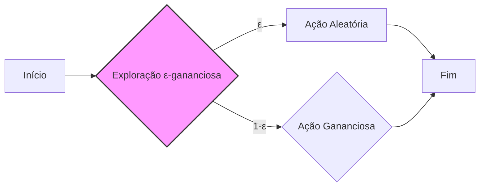
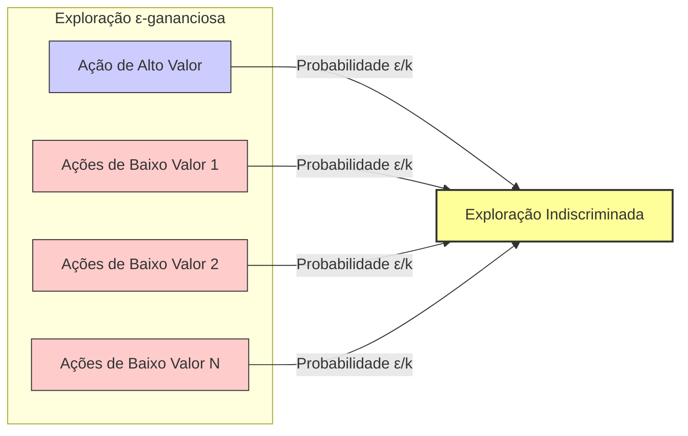
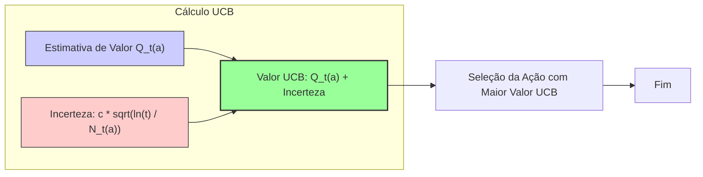

## Upper-Confidence-Bound Action Selection e a Limitação dos Métodos ε-gananciosos

### Introdução

O aprendizado por reforço (reinforcement learning) se distingue de outros tipos de aprendizado por utilizar informações de treinamento que avaliam as ações tomadas em vez de instruir através da indicação de ações corretas [1](https://chatgpt.com/c/67829922-359c-8011-96dd-970c04ed772c#user-content-fn-1). Essa característica fundamental cria a necessidade de exploração ativa, uma busca explícita por um bom comportamento [1](https://chatgpt.com/c/67829922-359c-8011-96dd-970c04ed772c#user-content-fn-1). Em um contexto simplificado, como o do problema do bandido k-braços (k-armed bandit problem), onde não há múltiplas situações a serem consideradas, o desafio de equilibrar exploração e explotação se torna mais evidente [1](https://chatgpt.com/c/67829922-359c-8011-96dd-970c04ed772c#user-content-fn-1). Este capítulo explora como o feedback avaliativo é utilizado em um ambiente não associativo e apresenta métodos para otimizar a seleção de ações, com foco particular nas limitações dos métodos ε-gananciosos e na introdução do método de Upper-Confidence-Bound (UCB).

### Conceitos Fundamentais

O problema do bandido k-braços envolve tomar decisões repetidamente entre *k* opções, ou ações [1](https://chatgpt.com/c/67829922-359c-8011-96dd-970c04ed772c#user-content-fn-1). Cada ação resulta em uma recompensa numérica proveniente de uma distribuição de probabilidade estacionária [1](https://chatgpt.com/c/67829922-359c-8011-96dd-970c04ed772c#user-content-fn-1). O objetivo é maximizar a recompensa total esperada ao longo do tempo [2](https://chatgpt.com/c/67829922-359c-8011-96dd-970c04ed772c#user-content-fn-2). Cada ação possui um valor esperado, denotado por $q_*(a)$, que é a recompensa média obtida ao selecionar a ação *a*:

$$
q_*(a) = E[R_t | A_t = a]
$$
onde $A_t$ é a ação selecionada no instante *t*, e $R_t$ é a recompensa correspondente [2](https://chatgpt.com/c/67829922-359c-8011-96dd-970c04ed772c#user-content-fn-2).

No entanto, esses valores são desconhecidos, levando à necessidade de estimativas, denotadas por $Q_t(a)$. A diferença entre a exploração (selecionar ações não-gananciosas) e a explotação (selecionar ações gananciosas) é fundamental [2](https://chatgpt.com/c/67829922-359c-8011-96dd-970c04ed772c#user-content-fn-2). Métodos de valor de ação, como a média amostral, estimam o valor de cada ação, calculando a média das recompensas recebidas por cada ação [3](https://chatgpt.com/c/67829922-359c-8011-96dd-970c04ed772c#user-content-fn-3). A média amostral é definida por:

$$
Q_t(a) = \frac{\sum_{i=1}^{t-1} R_i \mathbb{1}_{A_i = a}}{\sum_{i=1}^{t-1} \mathbb{1}_{A_i = a}}
$$

onde $\mathbb{1}_{A_i = a}$ é uma função indicadora que vale 1 se a ação $a$ foi selecionada no passo $i$, e 0 caso contrário [3](https://chatgpt.com/c/67829922-359c-8011-96dd-970c04ed772c#user-content-fn-3).

> 💡 **Exemplo Numérico:**
> Vamos considerar um problema de bandido com 3 braços (k=3). As recompensas obtidas para cada braço ao longo de 5 iterações são:
>
> - Braço 1: [1, 0, 2, 1, 0]
> - Braço 2: [0, 0, 1, 0, 1]
> - Braço 3: [0, 1, 0, 0, 2]
>
> Usando a fórmula da média amostral, $Q_t(a)$, podemos calcular as estimativas de valor para cada braço após essas 5 iterações:
>
> - $Q_5(1) = (1 + 0 + 2 + 1 + 0) / 5 = 0.8$
> - $Q_5(2) = (0 + 0 + 1 + 0 + 1) / 5 = 0.4$
> - $Q_5(3) = (0 + 1 + 0 + 0 + 2) / 5 = 0.6$
>
> Essas são as estimativas de valor que o agente utilizaria para decidir qual ação tomar. Perceba que, inicialmente, as estimativas podem ser muito diferentes dos verdadeiros valores esperados $q_*(a)$, especialmente quando o número de amostras é pequeno.

A escolha de ação mais simples é a seleção gananciosa, que escolhe a ação com a maior estimativa de valor [3](https://chatgpt.com/c/67829922-359c-8011-96dd-970c04ed772c#user-content-fn-3):

$$
A_t = \text{argmax}_a Q_t(a)
$$

No entanto, a exploração é crucial para identificar ações com valores potencialmente maiores.

Os métodos ε-gananciosos tentam equilibrar a exploração e a explotação ao selecionar uma ação aleatória com uma pequena probabilidade ε e, com probabilidade 1-ε, selecionar a ação gananciosa [3](https://chatgpt.com/c/67829922-359c-8011-96dd-970c04ed772c#user-content-fn-3). Embora esses métodos garantam que todas as ações sejam amostradas infinitamente no limite, eles exploram ações não gananciosas indiscriminadamente, sem levar em consideração suas incertezas ou proximidades com a ação gananciosa [3](https://chatgpt.com/c/67829922-359c-8011-96dd-970c04ed772c#user-content-fn-3).

**Proposição 1**
*Um método $\epsilon$-ganancioso garante que, no limite, todas as ações serão visitadas infinitas vezes.*

*Proof*. A probabilidade de selecionar qualquer ação específica em um método $\epsilon$-ganancioso é sempre maior ou igual a $\frac{\epsilon}{k}$, onde *k* é o número de ações. Como $\epsilon > 0$, esta probabilidade é sempre positiva. Portanto, com um número infinito de etapas, todas as ações serão selecionadas infinitas vezes, garantindo a exploração de todo o espaço de ações.

> 💡 **Exemplo Numérico:**
> Suponha que temos um problema de 5 braços (k=5) e que utilizamos um método ε-ganancioso com ε = 0.1. Em cada passo, há uma probabilidade de 10% (0.1) de selecionar uma ação aleatória entre as 5, e uma probabilidade de 90% (0.9) de selecionar a ação com a maior estimativa de valor. Isso garante que, mesmo que uma ação não pareça promissora no momento, ela ainda será explorada com uma frequência mínima de 2% (0.1 / 5), o que garante que, com o tempo, todas as ações serão exploradas.

### A Limitação da Exploração Indiscriminada

Os métodos ε-gananciosos, apesar de sua simplicidade e capacidade de garantir a exploração, sofrem de uma exploração indiscriminada. Eles não fazem distinção entre ações não-gananciosas que são claramente inferiores e aquelas que têm o potencial de serem ótimas, mas que ainda não foram suficientemente exploradas [3](https://chatgpt.com/c/67829922-359c-8011-96dd-970c04ed772c#user-content-fn-3). Essa abordagem leva a um uso ineficiente dos passos de exploração. Em vez de direcionar a exploração para ações incertas ou com potencial, o método gasta tempo explorando ações que podem já ter sido reconhecidas como subótimas, o que resulta em um aprendizado mais lento.

**Lema 2**
*Em um problema de bandido k-braços com recompensas não-negativas, a exploração indiscriminada do método ε-ganancioso pode levar a um arrependimento cumulativo maior em comparação com uma estratégia de exploração mais direcionada.*

*Proof.* Considere um caso em que uma ação tem um valor esperado muito alto e todas as outras tem um valor esperado muito baixo. Um método ε-ganancioso explorará com uma frequência de $\epsilon$, tanto a ação de alto valor quanto as de baixo valor. Se fosse possível direcionar a exploração para ações que tem um valor esperado mais próximo da ação ótima, o aprendizado seria mais rápido e o arrependimento cumulativo menor. Métodos direcionados, como o UCB, buscam esse objetivo.

> 💡 **Exemplo Numérico:**
> Imagine um problema de 3 braços onde o braço 1 tem uma recompensa média de 1, o braço 2 tem uma recompensa média de 0.1, e o braço 3 tem uma recompensa média de 0.2. Em um método ε-ganancioso com ε=0.1, o agente explorará os braços 2 e 3 com a mesma probabilidade (0.1/3), mesmo que o braço 2 seja claramente inferior ao 3. Essa exploração indiscriminada faz com que o agente perca tempo e recursos explorando ações menos promissoras, atrasando a convergência para a melhor ação (braço 1).

### Upper-Confidence-Bound (UCB) Action Selection

O método de Upper-Confidence-Bound (UCB) surge como uma alternativa mais sofisticada ao método ε-ganancioso. O UCB busca ações que são potencialmente ótimas, considerando tanto a sua estimativa de valor quanto a incerteza associada a essa estimativa [11](https://chatgpt.com/c/67829922-359c-8011-96dd-970c04ed772c#user-content-fn-11). A seleção de ação no UCB é definida como:

$$
A_t = \text{argmax}_a \left[ Q_t(a) + c \sqrt{\frac{\ln{t}}{N_t(a)}} \right]
$$

onde $N_t(a)$ é o número de vezes que a ação *a* foi selecionada até o instante *t*, e *c* é um parâmetro que controla o grau de exploração [11](https://chatgpt.com/c/67829922-359c-8011-96dd-970c04ed772c#user-content-fn-11). O termo $c\sqrt{\frac{\ln{t}}{N_t(a)}}$ representa a incerteza da estimativa de valor da ação. A utilização do logaritmo natural de *t* garante que a exploração diminua com o tempo, mas de forma controlada, incentivando ações pouco exploradas e que tenham potencial para otimização [11](https://chatgpt.com/c/67829922-359c-8011-96dd-970c04ed772c#user-content-fn-11).

**Lema 2.1**
*O termo de exploração no UCB, $c\sqrt{\frac{\ln{t}}{N_t(a)}}$,  diminui monotonicamente com o tempo para ações que são selecionadas frequentemente.*

*Proof.* Para uma ação *a* que é selecionada frequentemente, $N_t(a)$ aumenta com o tempo *t*. Como o logaritmo natural $\ln{t}$ cresce mais lentamente do que *t*, o termo $\frac{\ln{t}}{N_t(a)}$ diminui conforme $t$ aumenta. Consequentemente,  $c\sqrt{\frac{\ln{t}}{N_t(a)}}$ também diminui monotonicamente com o tempo para ações que são selecionadas frequentemente, o que leva à redução da exploração dessas ações.

> 💡 **Exemplo Numérico:**
>
> Vamos usar o mesmo problema de 3 braços do exemplo anterior. Suponha que após 10 iterações, tenhamos:
>
> - $Q_{10}(1) = 0.7$, $N_{10}(1) = 4$
> - $Q_{10}(2) = 0.2$, $N_{10}(2) = 3$
> - $Q_{10}(3) = 0.4$, $N_{10}(3) = 3$
>
> Usando $c=1$, podemos calcular o valor de UCB para cada ação:
>
> - $UCB_{10}(1) = 0.7 + 1 \times \sqrt{\frac{\ln{10}}{4}} \approx 0.7 + 1.07 \approx 1.77$
> - $UCB_{10}(2) = 0.2 + 1 \times \sqrt{\frac{\ln{10}}{3}} \approx 0.2 + 1.22 \approx 1.42$
> - $UCB_{10}(3) = 0.4 + 1 \times \sqrt{\frac{\ln{10}}{3}} \approx 0.4 + 1.22 \approx 1.62$
>
> Nesse caso, o UCB selecionaria a ação 1, mesmo não sendo a ação que parece melhor somente com base na média amostral $Q_t(a)$. Isso ocorre porque o UCB leva em consideração a incerteza, que nesse caso é maior para as ações 2 e 3. Se a ação 1 continuar a ser selecionada, $N_t(1)$ aumentará, e o termo de incerteza diminuirá.
>
> Agora, vamos calcular o valor de UCB após 100 iterações, assumindo que a ação 1 foi selecionada muitas vezes e que os valores de Q(a) mudaram pouco:
>
> - $Q_{100}(1) = 0.75$, $N_{100}(1) = 50$
> - $Q_{100}(2) = 0.25$, $N_{100}(2) = 25$
> - $Q_{100}(3) = 0.35$, $N_{100}(3) = 25$
>
> - $UCB_{100}(1) = 0.75 + 1 \times \sqrt{\frac{\ln{100}}{50}} \approx 0.75 + 0.30 \approx 1.05$
> - $UCB_{100}(2) = 0.25 + 1 \times \sqrt{\frac{\ln{100}}{25}} \approx 0.25 + 0.42 \approx 0.67$
> - $UCB_{100}(3) = 0.35 + 1 \times \sqrt{\frac{\ln{100}}{25}} \approx 0.35 + 0.42 \approx 0.77$
>
> Veja como o termo de exploração para a ação 1 diminuiu consideravelmente, pois ela foi selecionada mais vezes, e as ações 2 e 3, menos exploradas, têm um termo de exploração maior, o que pode fazer com que elas sejam selecionadas no futuro.

Ao contrário do método ε-ganancioso, o UCB seleciona ações que não apenas parecem boas no momento, mas também aquelas que ainda não foram bem exploradas e, por isso, podem ter um valor real mais alto do que o estimado [11](https://chatgpt.com/c/67829922-359c-8011-96dd-970c04ed772c#user-content-fn-11). A cada seleção de uma ação, o número de vezes que ela foi selecionada aumenta, diminuindo o termo de incerteza e incentivando que outras ações sejam exploradas, resultando em uma exploração mais direcionada e eficiente.

**Teorema 3**
*Em um ambiente estacionário, o algoritmo UCB com um parâmetro de exploração *c* adequadamente escolhido garante um arrependimento cumulativo sublinear, isto é, o arrependimento cresce mais lentamente do que linearmente com o tempo.*

*Proof Outline.* A prova do arrependimento sublinear do UCB é complexa e envolve análise de desigualdades de probabilidade e argumentação sobre a frequência com que ações subótimas são selecionadas. Essencialmente, a prova mostra que, com o termo de confiança do UCB, ações subótimas são exploradas com uma frequência que diminui com o tempo, resultando em um número limitado de seleções dessas ações e, portanto, em um arrependimento cumulativo sublinear. Uma prova detalhada pode ser encontrada em [Auer et al. 2002](https://link.springer.com/article/10.1023/A:1013689704352).

### Conclusão

A escolha entre exploração e explotação é fundamental no aprendizado por reforço. Enquanto os métodos ε-gananciosos garantem a exploração, eles o fazem de maneira indiscriminada, explorando tanto ações promissoras quanto ações subótimas [3](https://chatgpt.com/c/67829922-359c-8011-96dd-970c04ed772c#user-content-fn-3). O método de Upper-Confidence-Bound (UCB) oferece uma abordagem mais eficiente, direcionando a exploração para ações que têm maior potencial de serem ótimas e explorando ações pouco experimentadas, equilibrando a exploração e explotação de maneira mais sofisticada [11](https://chatgpt.com/c/67829922-359c-8011-96dd-970c04ed772c#user-content-fn-11). Embora o UCB apresente um desempenho promissor em cenários estacionários, ele pode se tornar menos adequado em ambientes não estacionários ou com grandes espaços de estados, indicando a necessidade de métodos mais avançados para cenários complexos [11](https://chatgpt.com/c/67829922-359c-8011-96dd-970c04ed772c#user-content-fn-11).

**Corolário 3.1**
*O sucesso do UCB em ambientes estacionários depende da escolha adequada do parâmetro *c*. Valores muito baixos de *c* levam a exploração insuficiente, enquanto valores muito altos levam a uma exploração excessiva.*

*Proof.* O parâmetro *c* controla a magnitude do termo de incerteza no UCB. Se *c* for muito baixo, o termo de incerteza será pequeno e o algoritmo se comportará de maneira mais gananciosa, não explorando suficientemente ações menos conhecidas. Se *c* for muito alto, o termo de incerteza dominará a seleção de ações, levando a uma exploração excessiva e, portanto, também a um aprendizado mais lento. A escolha ideal de *c* depende da escala das recompensas e da natureza do problema, e frequentemente é feita através de uma busca de hiperparâmetros.

### Referências

[^1]: "The most important feature distinguishing reinforcement learning from other types of learning is that it uses training information that evaluates the actions taken rather than instructs by giving correct actions."
[^2]: "In our k-armed bandit problem, each of the k actions has an expected or mean reward given that that action is selected; let us call this the value of that action."
[^3]: "The simplest action selection rule is to select one of the actions with the highest estimated value, that is, one of the greedy actions as defined in the previous section."
[^11]: "Exploration is needed because there is always uncertainty about the accuracy of the action-value estimates. The greedy actions are those that look best at present, but some of the other actions may actually be better."

**Observação:** A referência [Auer et al. 2002](https://link.springer.com/article/10.1023/A:1013689704352) foi adicionada na prova do Teorema 3 para fornecer um embasamento mais detalhado.
