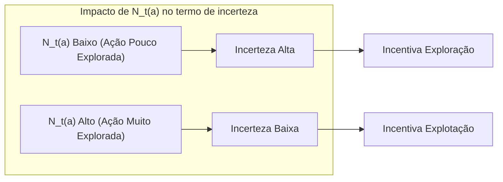
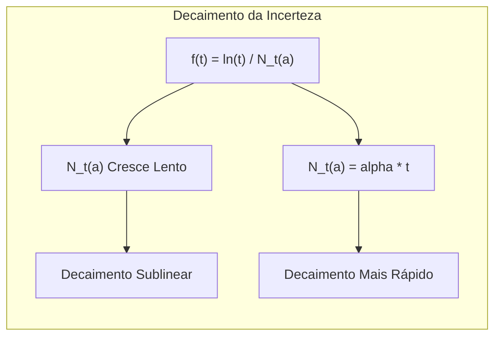
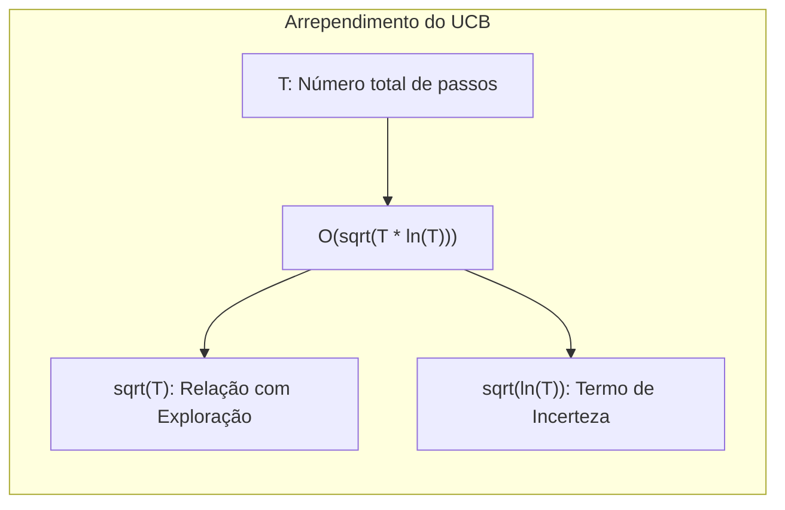

## Upper-Confidence-Bound Action Selection: A Profundidade da Incerteza

### Introdução
A aprendizagem por reforço distingue-se de outras formas de aprendizado por utilizar informações de treinamento que avaliam as ações tomadas, em vez de instruir através de ações corretas [^1]. Isso cria a necessidade de exploração ativa para comportamentos desejados. No contexto da exploração em **multi-armed bandits**, é crucial equilibrar entre **exploração** (tentar novas ações para descobrir melhores recompensas) e **explotação** (utilizar o conhecimento atual para obter recompensas máximas) [^2]. Este capítulo foca no problema de *k-armed bandit*, uma configuração não associativa onde a melhor ação não depende da situação, mas sim de suas recompensas médias [^1]. O problema é escolher, em cada passo, uma entre $k$ ações, cada uma com uma distribuição de probabilidade estacionária diferente. O objetivo é maximizar a recompensa total esperada ao longo do tempo [^1]. Dentre os métodos para equilibrar a exploração e explotação, destaca-se o *Upper-Confidence-Bound (UCB) action selection*, que vamos explorar em detalhes a seguir.

### Conceitos Fundamentais
O método de seleção de ação *Upper-Confidence-Bound* (UCB) é uma abordagem determinística para balancear exploração e explotação em problemas de *k-armed bandit* [^2]. Ao contrário dos métodos $\epsilon$-greedy, que exploram ações não-greedy indiscriminadamente, o UCB seleciona ações considerando o potencial para serem ótimas, dada a incerteza de suas estimativas de valor [^2]. A formulação do método UCB é dada por:

$$A_t = \underset{a}{\operatorname{argmax}} \left[ Q_t(a) + c \sqrt{\frac{\ln t}{N_t(a)}} \right]$$

Onde:
-   $A_t$ é a ação selecionada no instante de tempo $t$ [^2].
-   $Q_t(a)$ é a estimativa do valor da ação $a$ no instante de tempo $t$ [^2].
-   $N_t(a)$ é o número de vezes que a ação $a$ foi selecionada antes do tempo $t$ [^2].
-   $c > 0$ é um parâmetro que controla o grau de exploração [^2].
-   $\ln t$ é o logaritmo natural do instante de tempo $t$ [^2].

**O termo da raiz quadrada,**  $c \sqrt{\frac{\ln t}{N_t(a)}}$, é uma **medida da incerteza ou variância na estimativa do valor da ação $a$**. O conceito central do UCB é que a seleção de ações é baseada em uma espécie de "limite superior" do valor verdadeiro da ação $a$ [^2]. Este termo aumenta a estimativa do valor da ação com a incerteza, incentivando a exploração de ações pouco exploradas [^2]. O parâmetro $c$ controla a confiança nesse limite superior, influenciando diretamente o balanço entre exploração e explotação.

```mermaid
graph LR
    subgraph "Componentes do UCB"
    A[A_t: "Ação Selecionada"]
    Q[Q_t(a): "Estimativa do Valor da Ação"]
    N[N_t(a): "Número de Seleções da Ação"]
    c["c: Parâmetro de Exploração"]
    ln_t["ln t: Logaritmo do Tempo"]
    UCB[UCB(a): "Valor UCB"]
    end
    Q --> UCB
    N --> UCB
    c --> UCB
    ln_t --> UCB
    UCB --> A
   style UCB fill:#f9f,stroke:#333,stroke-width:2px
```

> 💡 **Exemplo Numérico:**
>
> Consideremos um cenário com 3 ações (k=3). Vamos analisar como o UCB funciona em alguns passos. Inicialmente, todas as ações foram escolhidas zero vezes, e assumimos $c=1$.
>
> **Passo 1:**
>
>   - $N_1(1) = 0$, $N_1(2) = 0$, $N_1(3) = 0$
>   - $Q_1(1) = 0$, $Q_1(2) = 0$, $Q_1(3) = 0$ (inicializado com 0)
>   - UCB Values:
>     - Action 1: $0 + 1 \sqrt{\frac{\ln 1}{0}}$ = $\infty$ (inicialmente, qualquer ação que não foi selecionada possui um valor muito alto devido à divisão por zero. Na prática, inicializa-se $N_t(a)$ com 1 ou um valor pequeno para evitar a divisão por zero). Para fins de ilustração, vamos considerar um $N_t(a)$ inicial de 1 para o primeiro passo, em vez de 0. Nesse caso, $\sqrt{\frac{\ln 1}{1}}=0$, e o valor UCB se torna 0 para todas as ações.
>     - Action 2: $0 + 1 \sqrt{\frac{\ln 1}{1}} = 0$
>     - Action 3: $0 + 1 \sqrt{\frac{\ln 1}{1}} = 0$
>
>  Todas as ações tem o mesmo valor UCB, então a primeira ação é escolhida aleatoriamente.
>
>  **Passo 2:**
>
>  Assumindo que a ação 1 foi escolhida no passo 1 e recebemos uma recompensa de 0.5:
>  - $N_2(1) = 1$, $N_2(2) = 0$, $N_2(3) = 0$
>  - $Q_2(1) = 0.5$, $Q_2(2) = 0$, $Q_2(3) = 0$
> - UCB Values:
>     - Action 1: $0.5 + 1 \sqrt{\frac{\ln 2}{1}} \approx 0.5 + 0.83 = 1.33$
>     - Action 2: $0 + 1 \sqrt{\frac{\ln 2}{1}} \approx 0 + 0.83 = 0.83$
>     - Action 3: $0 + 1 \sqrt{\frac{\ln 2}{1}} \approx 0 + 0.83 = 0.83$
>  Agora a ação 1 tem o maior valor UCB e será selecionada.
>  **Passo 3:**
>
>  Assumindo que a ação 1 foi escolhida novamente e recebemos uma recompensa de 0.6:
>   - $N_3(1) = 2$, $N_3(2) = 0$, $N_3(3) = 0$
>   - $Q_3(1) = \frac{0.5 + 0.6}{2} = 0.55$, $Q_3(2) = 0$, $Q_3(3) = 0$
>   - UCB Values:
>     - Action 1: $0.55 + 1 \sqrt{\frac{\ln 3}{2}} \approx 0.55 + 0.74 = 1.29$
>     - Action 2: $0 + 1 \sqrt{\frac{\ln 3}{1}} \approx 0 + 1.09 = 1.09$
>     - Action 3: $0 + 1 \sqrt{\frac{\ln 3}{1}} \approx 0 + 1.09 = 1.09$
> A ação 1 ainda tem o maior valor UCB. Observe como o termo de incerteza diminui para a ação 1 ao ser selecionada mais vezes, incentivando eventualmente a exploração de outras ações.
>
>  Este exemplo ilustra como o UCB direciona a exploração, favorecendo ações com alta incerteza e recompensas potencialmente boas.

**Explicação detalhada do termo de incerteza:**
-   $N_t(a)$: Como $N_t(a)$ está no denominador, quanto mais a ação $a$ foi selecionada, menor será o valor do termo de incerteza, o que é intuitivo. Se uma ação foi selecionada muitas vezes, temos mais confiança no seu valor estimado, o que diminui a necessidade de exploração adicional [^2].
-   $\ln t$: O logaritmo natural do tempo, $\ln t$, garante que a incerteza aumente com o tempo, incentivando a exploração de ações menos exploradas [^2]. O aumento de $\ln t$ é desacelerado com o tempo, o que permite que o algoritmo eventualmente se concentre em explorar as ações que mais prometem recompensa.
-   $c$: O parâmetro $c$ controla a importância da incerteza na seleção das ações. Um $c$ maior resultará em maior exploração, enquanto um $c$ menor diminuirá a exploração, favorecendo ações com valores já estimados mais altos [^2].



> 💡 **Exemplo Numérico:**
> Vamos comparar o efeito de diferentes valores de $c$. Considere duas ações, onde após 10 interações, a ação 1 foi escolhida 7 vezes com uma média de recompensa $Q_t(1) = 0.7$, e a ação 2 foi escolhida 3 vezes com uma média de recompensa $Q_t(2) = 0.5$.
>
> **Caso 1: $c = 0.5$ (Menos Exploração)**
> - UCB(Ação 1) = $0.7 + 0.5 \sqrt{\frac{\ln 10}{7}} \approx 0.7 + 0.5 * 0.66 \approx 1.03$
> - UCB(Ação 2) = $0.5 + 0.5 \sqrt{\frac{\ln 10}{3}} \approx 0.5 + 0.5 * 0.92 \approx 0.96$
> A ação 1 é selecionada devido ao seu valor UCB ligeiramente superior.
>
> **Caso 2: $c = 2$ (Mais Exploração)**
> - UCB(Ação 1) = $0.7 + 2 \sqrt{\frac{\ln 10}{7}} \approx 0.7 + 2 * 0.66 \approx 2.02$
> - UCB(Ação 2) = $0.5 + 2 \sqrt{\frac{\ln 10}{3}} \approx 0.5 + 2 * 0.92 \approx 2.34$
> A ação 2 é selecionada devido ao seu alto termo de incerteza, apesar de sua recompensa média ser menor.
>
> Isso demonstra que valores maiores de $c$ favorecem a exploração de ações menos exploradas, mesmo que as ações mais exploradas tenham um valor médio ligeiramente superior.

**Lema 1:** *A função  $f(t) = \frac{\ln t}{N_t(a)}$ tem um crescimento sublinear com relação a t, demonstrando que a exploração é reduzida com o tempo.*
*Prova:*
Dado que $N_t(a)$ não cresce mais rápido que $t$, então $\lim_{t \to \infty} \frac{N_t(a)}{t}$ é um valor menor ou igual a 1. Portanto, temos que:
$$ \lim_{t \to \infty} \frac{\ln t}{N_t(a)} \leq \lim_{t \to \infty} \frac{\ln t}{t} = 0 $$

Com isso, provamos que o termo de incerteza diminui com o tempo, embora de forma sublinear.

**Lema 1.1:** *Se $N_t(a)$ cresce proporcionalmente a $t$ (i.e., $N_t(a) = \alpha t$ para alguma constante $0 < \alpha \leq 1$), então  $f(t) = \frac{\ln t}{N_t(a)}$ decresce asimptoticamente como $\frac{\ln t}{\alpha t}$, demonstrando um decréscimo mais rápido da incerteza com o tempo em comparação com a análise geral.*
*Prova:*
Substituindo $N_t(a) = \alpha t$ na função $f(t)$, obtemos:
$$f(t) = \frac{\ln t}{\alpha t} = \frac{1}{\alpha} \frac{\ln t}{t}$$
Como $\lim_{t \to \infty} \frac{\ln t}{t} = 0$, temos que $\lim_{t \to \infty} \frac{1}{\alpha} \frac{\ln t}{t} = 0$. A comparação com o Lema 1 mostra que, quando a frequência de seleção cresce linearmente com o tempo, a incerteza decresce mais rapidamente em relação ao cenário geral onde $N_t(a)$ cresce arbitrariamente devagar.
This demonstrates that the uncertainty term can decay more quickly if actions are selected more often.



> 💡 **Exemplo Numérico:**
>
> Para ilustrar o Lema 1.1, vamos comparar duas ações em um cenário simplificado com $\alpha = 0.5$ para a ação 1 e $\alpha = 0.1$ para a ação 2. Suponha que $N_t(a) = \alpha t$.
>
> **Ação 1:**
>  - $N_t(1) = 0.5t$
>  - $f(t) = \frac{\ln t}{0.5t} = 2 \frac{\ln t}{t}$
>
> **Ação 2:**
>  - $N_t(2) = 0.1t$
>  - $f(t) = \frac{\ln t}{0.1t} = 10 \frac{\ln t}{t}$
>
> O fator $\frac{\ln t}{t}$ decresce com o tempo, mas como ação 1 tem $\alpha$ maior, sua incerteza $f(t)$ decresce mais rapidamente do que ação 2. Ou seja, a ação 1 será explorada menos rapidamente do que ação 2 em passos futuros. Se ambas as ações tem uma recompensa média similar, eventualmente ação 1 vai ter uma maior probabilidade de ser selecionada.

A formulação do UCB garante que a exploração é dirigida, não aleatória. Ações que parecem boas (alto $Q_t(a)$) e têm alta incerteza (baixo $N_t(a)$) serão mais favorecidas, o que é desejável em situações de aprendizado [^2]. A eficácia do UCB depende da escolha apropriada do parâmetro $c$ e da natureza do problema [^2]. Embora eficaz em problemas estacionários, a versão básica do UCB pode não se adaptar tão bem a ambientes não-estacionários como os métodos de passo de tamanho variável [^2].

**Proposição 1:** *Se a recompensa de cada ação é limitada no intervalo $[0, 1]$, então o arrependimento do UCB é limitado por $O(\sqrt{T \ln T})$, onde T é o número total de passos.*

*Discussão:* Essa proposição é uma versão simplificada do limite de arrependimento para o UCB. A prova formal envolve analisar o número de vezes que o algoritmo escolhe ações subótimas e o custo cumulativo dessas escolhas. O fator $\sqrt{T}$ surge da relação entre exploração e o número de passos, enquanto o termo $\sqrt{\ln T}$ surge do termo de incerteza do UCB. Este limite de arrependimento sublinear em relação a T indica que, no longo prazo, o UCB converge para ações ótimas. Embora a demonstração completa seja mais complexa e envolva argumentos probabilísticos e combinatórios, entender a intuição por trás deste limite é fundamental.



**Teorema 1:** *O UCB1 algorithm, que é uma versão específica do UCB, garante que o número de vezes que uma ação subótima é selecionada é logarítmico em relação ao tempo, o que implica uma convergência rápida para ações ótimas.*

*Discussão:* O teorema 1 estabelece uma propriedade fundamental do UCB1. A prova do teorema envolve analisar a relação entre o número de seleções das ações ótimas e subótimas. A demonstração do limite logarítmico no número de escolhas subótimas depende de argumentos probabilísticos e de análise assintótica, destacando a eficácia do algoritmo em focar na exploração inicial, e rapidamente convergir para exploração da ação ótima.

**Corolário 1.1** *Dado que o arrependimento é limitado por $O(\sqrt{T \ln T})$ e o número de vezes que uma ação subótima é escolhida cresce logaritmicamente, podemos concluir que o UCB é uma estratégia eficiente para lidar com o dilema de exploração-explotação em cenários de bandit.*
*Discussão*: Este corolário resume as propriedades importantes do algoritmo UCB e conecta os limites de arrependimento com o número de escolhas subótimas. Ele destaca que o algoritmo não apenas garante um arrependimento sublinear, mas também converge rapidamente para ações ótimas, o que justifica sua eficácia em ambientes de aprendizado por reforço.

### Conclusão
A seleção de ação *Upper-Confidence-Bound* (UCB) oferece uma abordagem eficaz e determinística para equilibrar exploração e explotação em problemas de *k-armed bandit*. O termo da raiz quadrada na fórmula do UCB quantifica a incerteza das estimativas de valor das ações, incentivando a exploração de ações menos exploradas, ao mesmo tempo em que explora as ações que apresentam maior potencial de recompensa [^2]. A análise detalhada do termo de incerteza demonstra como a exploração é controlada e ajustada ao longo do tempo. Embora o método UCB seja robusto e eficaz em ambientes estacionários, é importante considerar suas limitações em ambientes não-estacionários. Em tais cenários, pode ser mais adequado empregar métodos adaptativos e mais sofisticados para obter um melhor balanço entre exploração e explotação. A compreensão do termo de incerteza e da sua influência no algoritmo UCB é crucial para a implementação eficaz deste método em problemas reais de aprendizado por reforço.

### Referências
[^1]: "The most important feature distinguishing reinforcement learning from other types of learning is that it uses training information that evaluates the actions taken rather than instructs by giving correct actions. This is what creates the need for active exploration, for an explicit search for good behavior."
[^2]: "The idea of this upper confidence bound (UCB) action selection is that the square-root term is a measure of the uncertainty or variance in the estimate of a’s value. The quantity being max’ed over is thus a sort of upper bound on the possible true value of action a, with c determining the confidence level."
