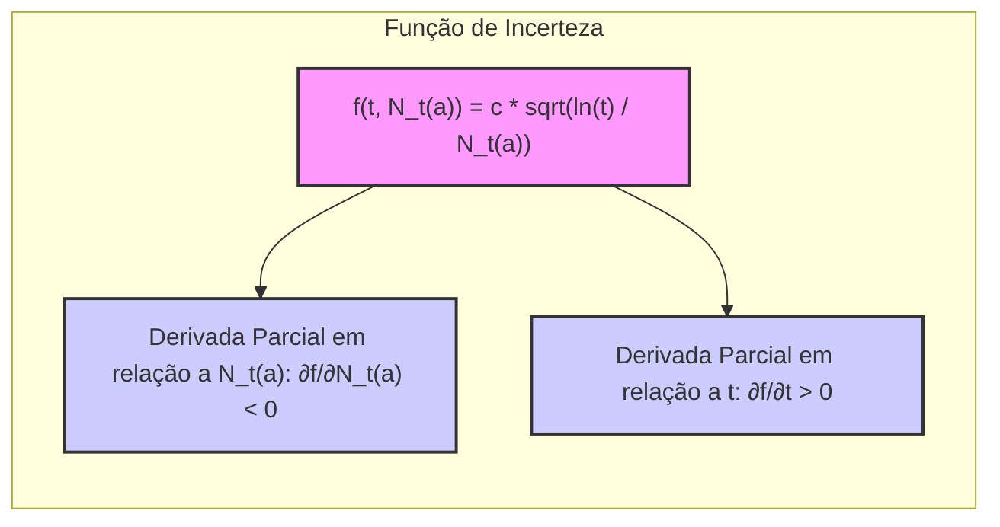

## Upper-Confidence-Bound Action Selection e a Dinâmica da Incerteza

### Introdução
O conceito de **Upper-Confidence-Bound (UCB)** action selection emerge como uma estratégia para lidar com o *trade-off* entre **exploração** e **explotação** em problemas de *multi-armed bandits*. Diferente dos métodos $\epsilon$-greedy, que exploram aleatoriamente, o UCB busca explorar ações com base em sua potencialidade de serem ótimas, considerando tanto a estimativa de seu valor quanto a incerteza associada a essa estimativa [1](https://chatgpt.com/c/67829922-359c-8011-96dd-970c04ed772c#user-content-fn-1). Este capítulo explorará como o UCB opera, enfatizando a dinâmica da incerteza que guia o processo de seleção de ações.

### Conceitos Fundamentais
O **UCB** opera sob a premissa de que a incerteza na estimativa do valor de uma ação deve influenciar a decisão de explorá-la. A ideia central é escolher ações que apresentem um limite superior de confiança, ou seja, um valor que é a soma da estimativa atual de seu valor e um termo que representa sua incerteza [1](https://chatgpt.com/c/67829922-359c-8011-96dd-970c04ed772c#user-content-fn-1). A ação $A_t$ no tempo $t$ é selecionada de acordo com a seguinte fórmula:

$$
A_t = \underset{a}{\text{argmax}} \left[ Q_t(a) + c \sqrt{\frac{\ln{t}}{N_t(a)}} \right]
$$

Onde:
- $Q_t(a)$ representa a estimativa do valor da ação $a$ no tempo $t$.
- $N_t(a)$ é o número de vezes que a ação $a$ foi selecionada até o tempo $t$.
- $c > 0$ é um parâmetro que controla o nível de exploração, definindo o quão grande é a "confiança" que damos à estimativa do valor de cada ação e, consequentemente, o quão dispostos estamos a explorar ações pouco testadas.
- $\ln{t}$ representa o logaritmo natural do tempo, que faz com que o termo de incerteza diminua com o tempo e com o número de vezes que uma ação é selecionada.

> 💡 **Exemplo Numérico:** Vamos considerar um cenário com três ações (a1, a2, a3). Inicialmente, todas as ações têm $Q_t(a) = 0$ e $N_t(a) = 0$. Seja $c = 1$.
>
> - No tempo $t=1$:
>   - Para todas as ações, o termo de incerteza é $\sqrt{\frac{\ln{1}}{0}}$, que é indefinido. Na prática, para evitar a divisão por zero, inicializamos os contadores $N_t(a)$ com um valor pequeno, como 1, ou garantimos que cada ação seja selecionada pelo menos uma vez no início. Vamos assumir que cada ação foi selecionada uma vez na inicialização, então $N_1(a)=1$ para $a \in \{a_1, a_2, a_3\}$.
>   - Para cada ação, o valor UCB será $0 + 1 \cdot \sqrt{\frac{\ln{1}}{1}} = 0$.  Como os valores UCB são iguais, a primeira ação, $a_1$, é selecionada arbitrariamente.
>   - Atualizamos $N_1(a_1)$ para 2.
>
> - No tempo $t=2$:
>   - $N_2(a_1) = 2$, $N_2(a_2) = 1$, $N_2(a_3) = 1$.
>   - O termo de incerteza para $a_1$ é $\sqrt{\frac{\ln{2}}{2}} \approx 0.588$, para $a_2$ e $a_3$ é $\sqrt{\frac{\ln{2}}{1}} \approx 0.833$.
>   - Se $Q_2(a_1) = 0.2$, $Q_2(a_2) = 0.1$, $Q_2(a_3) = 0$, o valor UCB para $a_1$ será $0.2 + 0.588 = 0.788$, para $a_2$ será $0.1 + 0.833 = 0.933$, e para $a_3$ será $0 + 0.833 = 0.833$.
>   - A ação $a_2$ é selecionada no tempo 2 porque tem o maior valor UCB.
>
>   - Atualizamos $N_2(a_2)$ para 2.
>
> - No tempo $t=3$:
>    - $N_3(a_1) = 2$, $N_3(a_2) = 2$, $N_3(a_3) = 1$.
>    - O termo de incerteza para $a_1$ e $a_2$ é $\sqrt{\frac{\ln{3}}{2}} \approx 0.732$, para $a_3$ é $\sqrt{\frac{\ln{3}}{1}} \approx 1.099$.
>    - Se $Q_3(a_1) = 0.3$, $Q_3(a_2) = 0.4$, $Q_3(a_3) = 0.1$, o valor UCB para $a_1$ será $0.3 + 0.732 = 1.032$, para $a_2$ será $0.4 + 0.732 = 1.132$, e para $a_3$ será $0.1 + 1.099 = 1.199$.
>   - A ação $a_3$ é selecionada no tempo 3.

A característica fundamental do UCB é a forma como ele ajusta dinamicamente o *trade-off* entre **exploração** e **explotação**. A raiz quadrada da razão entre o logaritmo de $t$ (tempo) e o número de vezes que a ação $a$ foi selecionada, $N_t(a)$, quantifica a incerteza associada à ação. Inicialmente, ações pouco exploradas têm um valor alto neste termo, encorajando a exploração. À medida que uma ação é selecionada repetidamente, seu $N_t(a)$ aumenta, diminuindo seu termo de incerteza e, assim, a prioridade de ser selecionada [1](https://chatgpt.com/c/67829922-359c-8011-96dd-970c04ed772c#user-content-fn-1].

**Proposição 1:** *A função de incerteza $f(t, N_t(a)) = c \sqrt{\frac{\ln t}{N_t(a)}}$ é decrescente em relação a $N_t(a)$ e crescente em relação a $t$.*

*Prova:* A derivada parcial de $f$ em relação a $N_t(a)$ é $\frac{\partial f}{\partial N_t(a)} = c \sqrt{\ln t} \cdot (-\frac{1}{2}) N_t(a)^{-3/2} = -\frac{c}{2} \sqrt{\frac{\ln t}{N_t(a)^3}}$, que é negativa para $c > 0$, $t > 1$ e $N_t(a) > 0$. Portanto, $f$ é decrescente em relação a $N_t(a)$. A derivada parcial de $f$ em relação a $t$ é $\frac{\partial f}{\partial t} = c \frac{1}{2} \sqrt{\frac{1}{N_t(a)}} (\ln t)^{-1/2} \frac{1}{t} = \frac{c}{2t} \sqrt{\frac{1}{N_t(a)\ln t}}$, que é positiva para $c > 0$, $t > 1$ e $N_t(a) > 0$. Portanto, $f$ é crescente em relação a $t$.  $\blacksquare$

> 💡 **Exemplo Numérico:** Vamos analisar a Proposição 1 com $c = 1$ e $t = 10$.
>
> - Se $N_t(a) = 1$, a incerteza é $f(10, 1) = \sqrt{\frac{\ln 10}{1}} \approx 1.517$.
> - Se $N_t(a) = 2$, a incerteza é $f(10, 2) = \sqrt{\frac{\ln 10}{2}} \approx 1.073$. Note que a incerteza diminuiu.
> - Agora, fixando $N_t(a) = 1$, e aumentando $t$ para 20: $f(20, 1) = \sqrt{\frac{\ln 20}{1}} \approx 1.729$. Note que a incerteza aumentou com $t$.
>
> Isso demonstra numericamente que a incerteza decresce com o aumento de $N_t(a)$ e cresce com o aumento de $t$, conforme estabelecido pela proposição.

A incerteza é um componente crucial da seleção de ações pelo UCB. A fórmula do UCB [1](https://chatgpt.com/c/67829922-359c-8011-96dd-970c04ed772c#user-content-fn-1) destaca como a incerteza sobre o valor das ações afeta diretamente a escolha da ação a ser tomada. Ações com menor número de seleções, ou seja, maior incerteza sobre seu valor, têm um *boost* em sua pontuação, incentivando o agente a explorá-las. Isso é particularmente útil no começo do processo de aprendizado, quando todas as ações ainda são relativamente desconhecidas. Quando uma ação é escolhida, essa ação tem a incerteza reduzida (aumenta $N_t(a)$), o que a torna menos propensa a ser selecionada em comparação com outras ações ainda não exploradas, dado que o fator de incerteza decresce com o aumento de $N_t(a)$. Por outro lado, ações não selecionadas ganham incerteza com o aumento de $t$ através do termo $\sqrt{\ln(t)}$.



**Lemma 1:** *O termo de incerteza no UCB, dado por $c\sqrt{\frac{\ln{t}}{N_t(a)}}$, diminui quando uma ação é selecionada e aumenta quando as demais ações são selecionadas.*

*Prova:* Considere uma ação $a$ selecionada no tempo $t$. No próximo passo $t+1$, o valor de $N_{t+1}(a)$ aumentará em uma unidade, enquanto $N_{t+1}(a')$ para as demais ações $a'$ não mudará. O termo $\ln(t)$ é afetado em todas as ações, mas em geral $\ln(t+1) \approx \ln(t)$. Assim:
- A incerteza da ação $a$:  $c\sqrt{\frac{\ln{t}}{N_t(a)}} > c\sqrt{\frac{\ln{(t+1)}}{N_{t+1}(a)}}$, dado que $N_{t+1}(a) = N_t(a) + 1$.
- A incerteza de outras ações $a'$: $c\sqrt{\frac{\ln{t}}{N_t(a')}} < c\sqrt{\frac{\ln{(t+1)}}{N_{t+1}(a')}}$, dado que $N_{t+1}(a') = N_t(a')$.
Isso demonstra que a incerteza sobre uma ação diminui ao ser selecionada enquanto a incerteza nas demais ações aumenta. $\blacksquare$

> 💡 **Exemplo Numérico:**  Vamos ilustrar o Lemma 1 com $c=1$, $t=5$ e duas ações $a_1$ e $a_2$. Suponha que no tempo $t=5$, $N_5(a_1)=3$ e $N_5(a_2)=2$.
>
> - Incerteza de $a_1$ no tempo 5: $\sqrt{\frac{\ln{5}}{3}} \approx 0.732$.
> - Incerteza de $a_2$ no tempo 5: $\sqrt{\frac{\ln{5}}{2}} \approx 0.912$.
>
> Agora, suponha que $a_1$ é selecionada no tempo 6.
>
> - Incerteza de $a_1$ no tempo 6: $\sqrt{\frac{\ln{6}}{4}} \approx 0.672$.  A incerteza diminuiu.
> - Incerteza de $a_2$ no tempo 6: $\sqrt{\frac{\ln{6}}{2}} \approx 0.896$.  A incerteza aumentou (devido ao aumento de t) e se mantém maior que a de $a_1$
>
>Este exemplo numérico demonstra que a incerteza da ação selecionada diminui enquanto a incerteza da ação não selecionada aumenta.

**Lemma 1.1:** *Se duas ações $a_1$ e $a_2$ são selecionadas exatamente o mesmo número de vezes, $N_t(a_1) = N_t(a_2)$, o termo de incerteza para ambas será o mesmo no instante t.*

*Prova:*  Se $N_t(a_1) = N_t(a_2)$, então $c\sqrt{\frac{\ln{t}}{N_t(a_1)}} = c\sqrt{\frac{\ln{t}}{N_t(a_2)}}$.  Portanto, o termo de incerteza é idêntico para ambas as ações no instante $t$. $\blacksquare$

> 💡 **Exemplo Numérico:** Seja $c=1$ e $t=10$. Se $N_{10}(a_1) = 5$ e $N_{10}(a_2) = 5$, então:
>
> - Incerteza de $a_1$ no tempo 10: $\sqrt{\frac{\ln{10}}{5}} \approx 0.680$
> - Incerteza de $a_2$ no tempo 10: $\sqrt{\frac{\ln{10}}{5}} \approx 0.680$
>
> Como demonstrado, as incertezas são idênticas.

Essa dinâmica de incerteza é essencial para o desempenho do UCB. Ela garante que o agente não fique preso explorando ações subótimas ou explora demais ações já bem conhecidas. A redução da incerteza sobre a ação selecionada permite que o agente refine suas estimativas sobre seu valor, levando a uma melhoria gradual na qualidade das decisões.

**Teorema 1:** *O UCB garante que todas as ações serão exploradas infinitas vezes no limite quando o número de passos $t$ tende a infinito.*

*Prova (Esboço):* A prova envolve mostrar que para qualquer ação $a$ com valor ótimo, eventualmente $Q_t(a)$ se aproximará do seu valor verdadeiro. O termo de incerteza $\sqrt{\frac{\ln(t)}{N_t(a)}}$ eventualmente se tornará pequeno o suficiente para permitir que $a$ seja selecionada novamente, mesmo que inicialmente tenha sido desfavorecida. Como $\ln(t)$ cresce lentamente com $t$, enquanto $N_t(a)$ só cresce quando a ação $a$ é selecionada, o termo de incerteza nunca chega a zero e garante que nenhuma ação será eternamente negligenciada, resultando em uma exploração contínua. $\blacksquare$

> 💡 **Visualização da Dinâmica de Incerteza:** A seguinte visualização ilustra o decréscimo do termo de incerteza para uma ação conforme ela é selecionada, enquanto o termo de incerteza para outras ações não selecionadas aumenta.
> ```mermaid
> graph LR
>     A["Tempo (t)"] --> B("Ação a1 é selecionada")
>     B --> C{"N_t(a1) aumenta"};
>     C --> D["Incerteza de a1 diminui"]
>     A --> E("Outras ações não são selecionadas")
>     E --> F["Incerteza das outras ações aumenta"]
>
>     style A fill:#f9f,stroke:#333,stroke-width:2px
>     style B fill:#ccf,stroke:#333,stroke-width:2px
>     style D fill:#ccf,stroke:#333,stroke-width:2px
>      style F fill:#ccf,stroke:#333,stroke-width:2px
> ```

### Conclusão
O método de seleção de ações UCB oferece uma abordagem sofisticada para equilibrar **exploração** e **explotação** em problemas de *multi-armed bandits*. A chave para seu sucesso é a maneira como ele utiliza a incerteza na estimativa do valor das ações. Ao priorizar ações com maior incerteza, o UCB incentiva a exploração de novas possibilidades e, ao mesmo tempo, reduz a incerteza sobre ações já exploradas, levando a uma tomada de decisão mais eficiente e ao aprendizado de uma política mais eficaz ao longo do tempo [1](https://chatgpt.com/c/67829922-359c-8011-96dd-970c04ed772c#user-content-fn-1). O UCB, apesar de ser menos simples que o $\epsilon$-greedy, consegue aliar as vantagens de ambos, realizando uma busca mais eficiente em comparação com outras técnicas.

### Referências
[^1]: "The idea of this upper confidence bound (UCB) action selection is that the square-root term is a measure of the uncertainty or variance in the estimate of a's value. The quantity being max'ed over is thus a sort of upper bound on the possible true value of action a, with c determining the confidence level. Each time a is selected the uncertainty is presumably reduced: Nł(a) increments, and, as it appears in the denominator, the uncertainty term decreases. On the other hand, each time an action other than a is selected, t increases but Nt(a) does not; because t appears in the numerator, the uncertainty estimate increases." *(Trecho de <Multi-armed Bandits>)*
