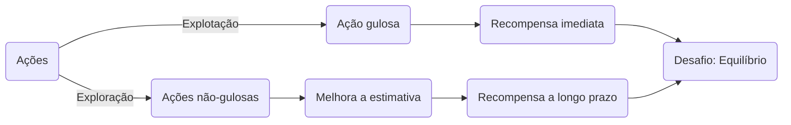
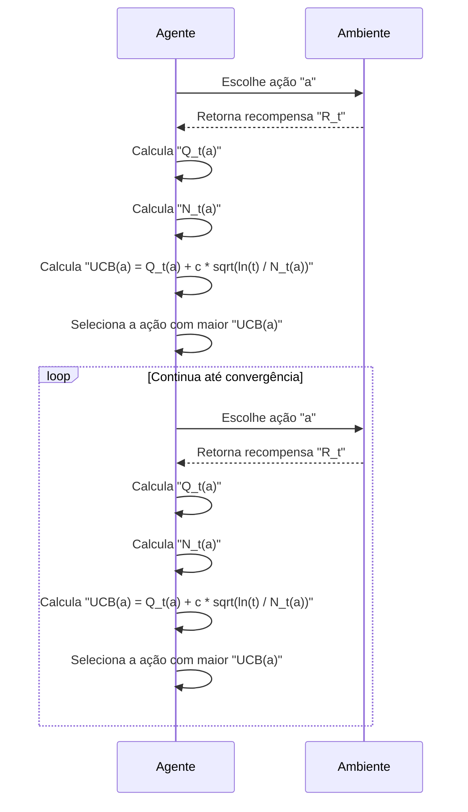
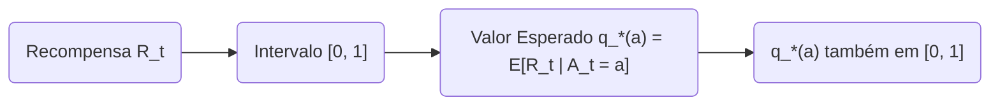
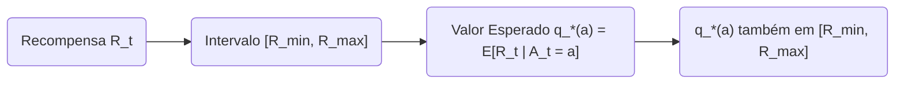
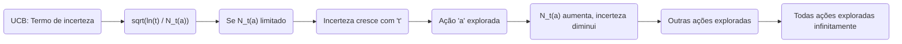
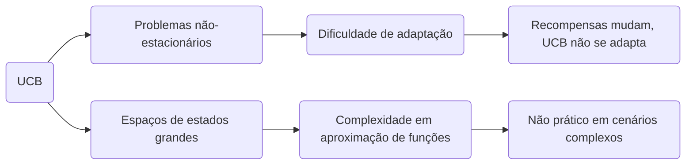

## Upper-Confidence-Bound Action Selection e suas Limitações na Generalização
### Introdução
O aprendizado por reforço se distingue de outras formas de aprendizado por utilizar informação de treinamento que avalia as ações tomadas ao invés de instruir ações corretas [1]. Isso cria uma necessidade de exploração ativa, uma busca explícita por bom comportamento. O feedback puramente avaliativo indica o quão boa a ação tomada foi, mas não se foi a melhor ou a pior possível. Em contraste, o feedback instrutivo indica a ação correta a ser tomada, independentemente da ação realmente realizada [1]. Este capítulo foca no aspecto avaliativo do aprendizado por reforço em um cenário simplificado, o problema do *k-armed bandit*, que não envolve aprender a agir em diversas situações [1]. Dentro deste contexto, exploramos diferentes métodos para equilibrar exploração e explotação, incluindo o método Upper-Confidence-Bound (UCB) [1].

### Conceitos Fundamentais
No problema do *k-armed bandit*, o objetivo é maximizar a recompensa total esperada ao longo de um período de tempo, escolhendo repetidamente entre *k* opções diferentes, ou ações [1]. Cada ação resulta em uma recompensa numérica selecionada a partir de uma distribuição de probabilidade estacionária que depende da ação escolhida [1]. O valor de uma ação *a*, denotado por $q_*(a)$, é a recompensa esperada ao selecionar essa ação, $q_*(a) = E[R_t | A_t = a]$ [1]. Como esses valores são desconhecidos, é necessário estimá-los, com $Q_t(a)$ denotando o valor estimado da ação *a* no tempo *t*.

A seleção da ação pode ser feita por exploração ou explotação [2]. **Explotação** significa escolher a ação que atualmente tem a maior estimativa de valor, ou seja, uma ação gulosa. **Exploração**, por outro lado, envolve a seleção de uma ação não-gulosa para melhorar a estimativa de valor dessas ações [2]. O desafio é equilibrar esses dois objetivos, pois a explotação maximiza a recompensa imediata, enquanto a exploração pode levar a maiores recompensas a longo prazo [2].



Uma maneira de equilibrar exploração e explotação é através do método *ɛ-greedy*, que seleciona a ação com maior valor estimado na maioria das vezes, mas aleatoriamente seleciona outras ações com probabilidade *ɛ* [3]. Em contrapartida, o método **Upper-Confidence-Bound (UCB)** seleciona ações de acordo com a seguinte regra [11]:
$$A_t = \underset{a}{\operatorname{argmax}} \left[ Q_t(a) + c\sqrt{\frac{\ln t}{N_t(a)}} \right],$$
onde $N_t(a)$ é o número de vezes que a ação *a* foi selecionada até o tempo *t*, e $c>0$ controla o grau de exploração [11]. O termo de raiz quadrada é uma medida da incerteza do valor da ação, e a quantidade que está sendo maximizada é um limite superior do possível valor verdadeiro da ação, determinado pelo nível de confiança *c* [11].
> 💡 **Exemplo Numérico:**
> Vamos considerar um cenário com 3 ações (k=3) e assumir que o valor estimado inicial de cada ação é 0, ou seja, $Q_1(a) = 0$ para $a \in \{1, 2, 3\}$. Vamos usar $c=1$ no UCB. No primeiro passo (t=1), $N_1(a)=0$ para todas as ações, o que resulta em uma divisão por zero dentro do termo de incerteza. Para evitar isso na prática, iniciaremos $N_1(a)$ com 1 para todas as ações. Agora, a fórmula do UCB se torna:
>
>  $A_t = \underset{a}{\operatorname{argmax}} \left[ Q_t(a) + 1\sqrt{\frac{\ln t}{N_t(a)}} \right]$
>
>  Para $t=1$, temos:
>
>   $UCB(a) = 0 + 1\sqrt{\frac{\ln 1}{1}} = 0$
>
>  Como todos os UCBs são iguais, vamos escolher a ação 1 arbitrariamente. Suponha que ela retorna uma recompensa de $R_1=0.5$. Atualizamos $Q_2(1) = 0.5$ e $N_2(1) = 2$. Para $t=2$, as contas se tornam:
>
>   $UCB(1) = 0.5 + 1\sqrt{\frac{\ln 2}{2}} \approx 0.5 + 0.5887 \approx 1.0887$
>
>   $UCB(2) = 0 + 1\sqrt{\frac{\ln 2}{1}} \approx 0 + 0.8326 \approx 0.8326$
>
>   $UCB(3) = 0 + 1\sqrt{\frac{\ln 2}{1}} \approx 0 + 0.8326 \approx 0.8326$
>
>  A ação 1 é escolhida, e suponha que a recompensa é $R_2=0.6$. Então, $Q_3(1) = \frac{0.5 + 0.6}{2} = 0.55$ e $N_3(1) = 3$.  A ação com o maior UCB é selecionada a cada passo. Este exemplo ilustra que, inicialmente, a incerteza força a exploração de todas as ações. Com o tempo, a estimativa da ação 1 se torna mais precisa, reduzindo a incerteza e incentivando a exploração de outras ações.



O método UCB funciona de forma que, quanto mais vezes uma ação é selecionada, menor o seu termo de incerteza e, portanto, torna-se menos provável que ela seja escolhida, incentivando a exploração de outras ações [11]. Métodos como o *ɛ-greedy* exploram ações não-gulosas de maneira indiscriminada. O UCB é mais inteligente, selecionando ações não-gulosas com base em seu potencial de serem ótimas [11].
**Proposição 1**
A escolha do parâmetro *c* no método UCB afeta diretamente a taxa de exploração. Um valor maior para *c* aumenta a exploração, enquanto um valor menor tende a favorecer a explotação.
> 💡 **Exemplo Numérico:**
> Suponha que temos duas ações, A e B, com estimativas $Q_t(A) = 0.7$ e $Q_t(B) = 0.6$. No tempo t=10, a ação A foi selecionada 5 vezes ($N_t(A) = 5$) e a ação B 2 vezes ($N_t(B) = 2$). Se utilizarmos c=0.1, os UCBs serão:
>
>   $UCB(A) = 0.7 + 0.1 \sqrt{\frac{\ln 10}{5}} \approx 0.7 + 0.1 \sqrt{0.46} \approx 0.7 + 0.067 = 0.767$
>   $UCB(B) = 0.6 + 0.1 \sqrt{\frac{\ln 10}{2}} \approx 0.6 + 0.1 \sqrt{1.15} \approx 0.6 + 0.107 = 0.707$
>
> Nesse caso, a ação A seria selecionada. Agora, se utilizarmos um valor maior, c=1, os UCBs serão:
>
>  $UCB(A) = 0.7 + 1 \sqrt{\frac{\ln 10}{5}} \approx 0.7 + 1 \sqrt{0.46} \approx 0.7 + 0.67 = 1.37$
>   $UCB(B) = 0.6 + 1 \sqrt{\frac{\ln 10}{2}} \approx 0.6 + 1 \sqrt{1.15} \approx 0.6 + 1.07 = 1.67$
>
> Com c=1, a ação B seria selecionada. Isso ilustra que um valor maior de c favorece a exploração da ação B, apesar de sua estimativa ser menor que a de A.

```mermaid
graph LR
    A("Parâmetro c") --> B("Taxa de Exploração");
    B --> C{Maior "c"};
    B --> D{Menor "c"};
    C --> E("Mais Exploração");
    D --> F("Mais Explotação");
```

*Proof Sketch:* This follows directly from the UCB formula. A larger *c* amplifies the uncertainty term, making it more likely that less-explored actions will be selected. Conversely, a smaller *c* diminishes the impact of the uncertainty term, favoring actions with high estimated values $Q_t(a)$.

**Lema 1**
Se a recompensa é limitada no intervalo $[0,1]$, então $q_*(a) \in [0,1]$ para toda ação *a*.
*Proof:* Dado que $q_*(a) = E[R_t | A_t = a]$, e $0 \le R_t \le 1$ para qualquer tempo *t*, então, pela linearidade da esperança, $0 \le E[R_t | A_t = a] \le 1$, o que implica $0 \le q_*(a) \le 1$.
> 💡 **Exemplo Numérico:**
> Suponha que uma ação *a* tem as seguintes recompensas em 3 tentativas: 0.3, 0.8 e 0.5. O valor esperado $q_*(a)$ é a média dessas recompensas: $q_*(a) = (0.3+0.8+0.5)/3 = 0.533$. Como todas as recompensas estão no intervalo [0,1], o valor esperado também está dentro desse intervalo.



**Lema 1.1**
Se as recompensas são limitadas por um intervalo $[R_{min}, R_{max}]$, então $q_*(a) \in [R_{min}, R_{max}]$ para toda ação *a*.
*Proof:* Análogo ao Lema 1, aplicando a linearidade da esperança e os limites nas recompensas, temos $R_{min} \le E[R_t | A_t = a] \le R_{max}$ para todas as ações *a*.
> 💡 **Exemplo Numérico:**
> Se as recompensas forem limitadas no intervalo [-1, 2], e uma ação *b* fornece as recompensas -0.5, 1.5, e 0.0 em 3 tentativas, então $q_*(b) = (-0.5 + 1.5 + 0.0)/3 = 0.333$. Este valor está dentro do intervalo [-1, 2], como esperado.



**Teorema 1**
O algoritmo UCB garante que todas as ações serão exploradas infinitamente em um problema *k*-armed bandit.

*Proof Sketch:* The UCB action selection rule includes a term that increases with time, $\sqrt{\frac{\ln t}{N_t(a)}}$. As $t$ increases, if $N_t(a)$ remains bounded for any action *a*, the uncertainty term grows without bound. This guarantees that any action will eventually be explored. Moreover, as the number of plays for an action increases, $N_t(a)$ increases, making the uncertainty term associated with that action decrease, which then allows exploration to other actions to occur.
> 💡 **Exemplo Numérico:**
> Imagine um problema com 2 ações. A ação 1 é inicialmente muito explorada, mas mesmo que sua estimativa seja alta, o termo $\sqrt{\frac{\ln t}{N_t(a)}}$  para a ação 2 aumentará com o tempo. Isso acontecerá até o ponto em que o UCB da ação 2 seja maior do que o da ação 1, levando à exploração da ação 2. A ação 2 será explorada e, com o tempo, a ação 1 será explorada novamente, garantindo que todas as ações sejam exploradas infinitamente.



### UCB e suas Limitações na Generalização
Apesar do bom desempenho do UCB, como demonstrado no *10-armed testbed* [12], ele apresenta dificuldades ao ser estendido para cenários mais gerais de aprendizado por reforço. Uma das dificuldades é lidar com problemas não-estacionários, nos quais as propriedades do ambiente mudam ao longo do tempo [12]. Nesses casos, métodos mais complexos para lidar com valores de ação que mudam ao longo do tempo seriam necessários, superando os métodos apresentados para o problema *k-armed bandit* [12]. Outra dificuldade surge ao lidar com espaços de estados grandes, especialmente quando se utiliza aproximação de funções [12]. Em configurações mais avançadas, a ideia de selecionar ações UCB geralmente não é prática. O método UCB, apesar de suas vantagens no cenário simplificado, não se traduz bem para a complexidade de problemas gerais de aprendizado por reforço. Ele se mostra inadequado para lidar com não-estacionariedade e complexidade de espaços de estados maiores [12].
**Observação 1:**
O método UCB não considera a possibilidade de as recompensas associadas às ações mudarem ao longo do tempo. Se a distribuição de recompensas de uma ação mudar, o método UCB pode não ser capaz de se adaptar rapidamente a essas mudanças.
> 💡 **Exemplo Numérico:**
> Imagine que a ação 1 inicialmente tem uma recompensa média alta, mas após 100 passos, a recompensa média cai drasticamente. O UCB, ao basear sua seleção no histórico de recompensas, ainda tenderá a escolher a ação 1 por conta do seu histórico. Isso ilustra a dificuldade de adaptação do UCB em cenários não-estacionários.



### Conclusão
O método Upper-Confidence-Bound (UCB) oferece uma abordagem eficaz para equilibrar exploração e explotação em problemas do tipo *k-armed bandit*, selecionando ações que maximizam um limite superior de seus valores reais, levando em consideração a incerteza associada a essas estimativas [11]. Apesar do bom desempenho demonstrado, o método UCB apresenta limitações quando se trata de estendê-lo para problemas mais gerais de aprendizado por reforço. As dificuldades surgem ao lidar com a não-estacionariedade do ambiente e com espaços de estado grandes. Apesar disso, métodos como o UCB servem como ponto de partida para o entendimento da dinâmica entre exploração e explotação, conceitos fundamentais no campo de aprendizado por reforço [11].

### Referências
[^1]: "The most important feature distinguishing reinforcement learning from other types of learning is that it uses training information that evaluates the actions taken rather than instructs by giving correct actions."
[^2]: "When you select one of these actions, we say that you are exploiting your current knowledge of the values of the actions. If instead you select one of the nongreedy actions, then we say you are exploring, because this enables you to improve your estimate of the nongreedy action's value."
[^3]: "A simple alternative is to behave greedily most of the time, but every once in a while, say with small probability ɛ, instead select randomly from among all the actions with equal probability, independently of the action-value estimates."
[^11]: "One effective way of doing this is to select actions according to  $A_t = \operatorname{argmax}_a [Q_t(a) + c \sqrt{\frac{\ln t}{N_t(a)}}]$."
[^12]: "UCB often performs well, as shown here, but is more difficult than ɛ-greedy to extend beyond bandits to the more general reinforcement learning settings considered in the rest of this book."
