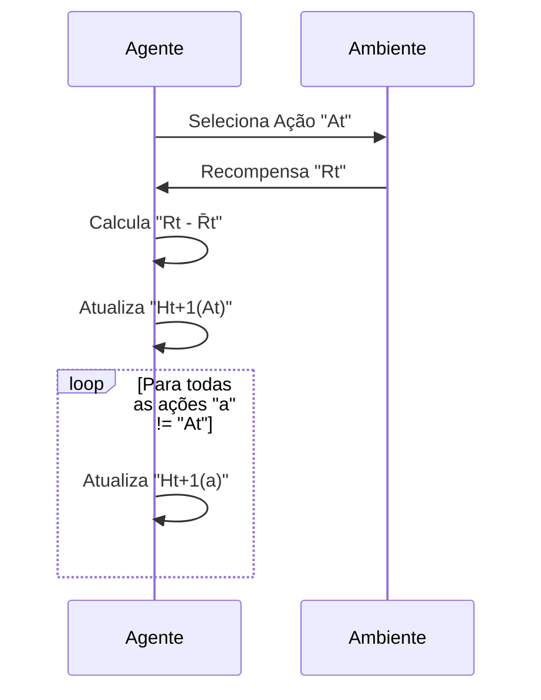
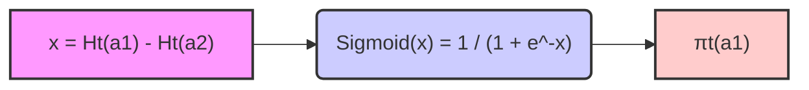
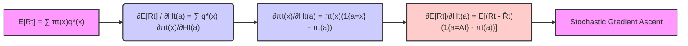
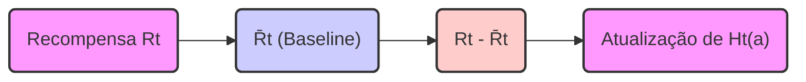

## Gradient Bandit Algorithms: Aprendendo Preferências de Ação

### Introdução
No contexto de *reinforcement learning*, os métodos para resolver o problema do *k-armed bandit* podem ser categorizados em duas abordagens principais: aquelas que estimam valores de ação e aquelas que aprendem uma preferência numérica para cada ação [^1]. Este capítulo foca em uma abordagem alternativa que aprende diretamente uma preferência numérica para cada ação, representada por $H_t(a)$, em vez de estimar valores de ação $Q_t(a)$ [^1]. Essa preferência numérica indica quão frequentemente uma ação deve ser tomada, sem uma interpretação direta em termos de recompensa [^1]. A abordagem de *gradient bandit algorithms* é uma alternativa interessante, onde a probabilidade de seleção de uma ação é determinada pela distribuição *soft-max*, que considera as preferências relativas de cada ação [^1].

### Conceitos Fundamentais
#### Preferências de Ação
Em vez de estimar valores de ação como em métodos anteriores, os *gradient bandit algorithms* aprendem uma preferência numérica $H_t(a) \in \mathbb{R}$ para cada ação $a$ [^1]. A magnitude da preferência reflete a frequência com que essa ação deve ser selecionada, sem uma interpretação direta em termos de recompensa [^1]. O que importa é a preferência *relativa* entre as ações, e adicionar uma constante a todas as preferências não altera a probabilidade de seleção de cada ação [^1].

#### Distribuição Soft-max
As probabilidades de seleção de ação, $\pi_t(a)$, são definidas pela distribuição *soft-max* (também conhecida como distribuição de Gibbs ou Boltzmann):
$$Pr\{A_t = a\} = \frac{e^{H_t(a)}}{\sum_{b=1}^{k} e^{H_t(b)}} = \pi_t(a)$$
[^1]. Onde $A_t$ é a ação selecionada no instante $t$, e $k$ é o número total de ações. Inicialmente, as preferências de todas as ações são as mesmas (por exemplo, $H_1(a) = 0$ para todas as ações), garantindo que todas as ações tenham a mesma probabilidade de serem selecionadas [^1].

> 💡 **Exemplo Numérico:** Considere um problema de 3-arm bandit (k=3). Inicialmente, as preferências são $H_1(a_1) = 0$, $H_1(a_2) = 0$, e $H_1(a_3) = 0$. As probabilidades iniciais de selecionar cada ação são:
>
> $\pi_1(a_1) = \frac{e^0}{e^0 + e^0 + e^0} = \frac{1}{3} \approx 0.333$
>
> $\pi_1(a_2) = \frac{e^0}{e^0 + e^0 + e^0} = \frac{1}{3} \approx 0.333$
>
> $\pi_1(a_3) = \frac{e^0}{e^0 + e^0 + e^0} = \frac{1}{3} \approx 0.333$
>
> Todas as ações têm a mesma probabilidade de serem selecionadas inicialmente.

**Proposição 1:**  A distribuição *soft-max* é invariante à adição de uma constante a todas as preferências de ação.

*Proof:* Seja $c$ uma constante arbitrária.  Se adicionarmos $c$ a todas as preferências, temos novas preferências $H'_t(a) = H_t(a) + c$ para cada ação $a$. A probabilidade de seleção de uma ação $a$ usando as novas preferências é:

$$\pi'_t(a) = \frac{e^{H'_t(a)}}{\sum_{b=1}^{k} e^{H'_t(b)}} = \frac{e^{H_t(a) + c}}{\sum_{b=1}^{k} e^{H_t(b) + c}} = \frac{e^{H_t(a)}e^c}{\sum_{b=1}^{k} e^{H_t(b)}e^c} = \frac{e^{H_t(a)}}{\sum_{b=1}^{k} e^{H_t(b)}} = \pi_t(a).$$

Portanto, a distribuição *soft-max* permanece inalterada pela adição de uma constante a todas as preferências de ação. $\blacksquare$

> 💡 **Exemplo Numérico:** Continuando o exemplo anterior, se adicionarmos $c=2$ a todas as preferências, teremos $H'_1(a_1) = 2$, $H'_1(a_2) = 2$, e $H'_1(a_3) = 2$. As novas probabilidades são:
>
> $\pi'_1(a_1) = \frac{e^2}{e^2 + e^2 + e^2} = \frac{e^2}{3e^2} = \frac{1}{3} \approx 0.333$
>
> $\pi'_1(a_2) = \frac{e^2}{e^2 + e^2 + e^2} = \frac{e^2}{3e^2} = \frac{1}{3} \approx 0.333$
>
> $\pi'_1(a_3) = \frac{e^2}{e^2 + e^2 + e^2} = \frac{e^2}{3e^2} = \frac{1}{3} \approx 0.333$
>
> As probabilidades permanecem as mesmas, comprovando a invariância.
  ```mermaid
  graph LR
      A("Preferências Ht(a)") --> B("Softmax");
      B --> C("Probabilidades πt(a)");
      C --> D("Seleção da Ação At");
      D --> E("Recompensa Rt");
      E --> F("Atualização de Ht+1(a)");
      F --> A;
      style A fill:#f9f,stroke:#333,stroke-width:2px
      style B fill:#ccf,stroke:#333,stroke-width:2px
      style C fill:#ccf,stroke:#333,stroke-width:2px
      style D fill:#fcc,stroke:#333,stroke-width:2px
      style E fill:#ccf,stroke:#333,stroke-width:2px
      style F fill:#f9f,stroke:#333,stroke-width:2px
  ```

#### Algoritmo de Aprendizado por Gradiente Estocástico
Os *gradient bandit algorithms* são baseados na ideia de *stochastic gradient ascent* [^1]. Após selecionar uma ação $A_t$ e receber uma recompensa $R_t$, as preferências de ação são atualizadas usando a seguinte regra:
$$H_{t+1}(A_t) = H_t(A_t) + \alpha (R_t - \bar{R}_t)(1 - \pi_t(A_t))$$
$$H_{t+1}(a) = H_t(a) - \alpha (R_t - \bar{R}_t) \pi_t(a), \quad \text{para } a \neq A_t$$
[^1]. Aqui, $\alpha > 0$ é o parâmetro *step-size*, e $\bar{R}_t$ é a média das recompensas até o instante $t$ (incluindo $R_t$). A atualização ajusta as preferências na direção que aumenta a probabilidade de ações que fornecem recompensas acima da média e diminui a probabilidade de ações com recompensas abaixo da média [^1].

> 💡 **Exemplo Numérico:** Suponha que $t=1$, temos 3 ações, e $\alpha = 0.1$. As preferências iniciais são $H_1(a_1) = 0$, $H_1(a_2) = 0$, e $H_1(a_3) = 0$, e as probabilidades iniciais são $\pi_1(a_1) = \pi_1(a_2) = \pi_1(a_3) = 1/3$.
>
> 1. Ação $a_2$ é selecionada ($A_1 = a_2$) e recebe uma recompensa $R_1 = 1$.  A média das recompensas até o instante 1 é $\bar{R}_1 = 1$.
>
> 2. Atualização da preferência da ação $a_2$:
> $H_2(a_2) = H_1(a_2) + \alpha(R_1 - \bar{R}_1)(1-\pi_1(a_2)) = 0 + 0.1(1-1)(1 - 1/3) = 0$
>
> 3. Atualização da preferência das outras ações:
> $H_2(a_1) = H_1(a_1) - \alpha(R_1 - \bar{R}_1)\pi_1(a_1) = 0 - 0.1(1-1)(1/3) = 0$
> $H_2(a_3) = H_1(a_3) - \alpha(R_1 - \bar{R}_1)\pi_1(a_3) = 0 - 0.1(1-1)(1/3) = 0$
>
> 4. Agora, suponha que no instante $t=2$, a ação $a_1$ seja selecionada ($A_2 = a_1$) com recompensa $R_2 = 2$. A média das recompensas até o instante 2 é $\bar{R}_2 = (1+2)/2 = 1.5$. As preferências são $H_2(a_1) = 0$, $H_2(a_2) = 0$ e $H_2(a_3) = 0$. As probabilidades são:
>
> $\pi_2(a_1) = \frac{e^0}{e^0 + e^0 + e^0} = \frac{1}{3} \approx 0.333$
>
> $\pi_2(a_2) = \frac{e^0}{e^0 + e^0 + e^0} = \frac{1}{3} \approx 0.333$
>
> $\pi_2(a_3) = \frac{e^0}{e^0 + e^0 + e^0} = \frac{1}{3} \approx 0.333$
>
>  5. Atualização das preferencias após receber a recompensa:
> $H_3(a_1) = H_2(a_1) + \alpha(R_2 - \bar{R}_2)(1 - \pi_2(a_1)) = 0 + 0.1(2 - 1.5)(1 - 1/3) = 0.1(0.5)(2/3) = 1/30 \approx 0.0333$
>
> $H_3(a_2) = H_2(a_2) - \alpha(R_2 - \bar{R}_2)\pi_2(a_2) = 0 - 0.1(2 - 1.5)(1/3) = -0.1(0.5)(1/3) = -1/60 \approx -0.0167$
>
> $H_3(a_3) = H_2(a_3) - \alpha(R_2 - \bar{R}_2)\pi_2(a_3) = 0 - 0.1(2 - 1.5)(1/3) = -0.1(0.5)(1/3) = -1/60 \approx -0.0167$
>
>  A preferência da ação $a_1$ aumentou, enquanto as preferências de $a_2$ e $a_3$ diminuíram ligeiramente, pois $a_1$ teve uma recompensa acima da média.


**Lemma 1:** O uso da distribuição *soft-max* para definir as probabilidades de ação é equivalente a usar a função sigmoide para problemas com duas ações.

*Proof:* Para duas ações, $a_1$ e $a_2$, a probabilidade de selecionar $a_1$ usando a distribuição *soft-max* é:

$$\pi_t(a_1) = \frac{e^{H_t(a_1)}}{e^{H_t(a_1)} + e^{H_t(a_2)}}.$$

Se definirmos $x = H_t(a_1) - H_t(a_2)$, temos:

$$\pi_t(a_1) = \frac{e^{H_t(a_1) - H_t(a_2)}}{e^{H_t(a_1) - H_t(a_2)} + 1} = \frac{e^x}{e^x + 1} = \frac{1}{1 + e^{-x}}.$$

Essa última expressão é a função sigmoide, demonstrando a equivalência. $\blacksquare$

> 💡 **Exemplo Numérico:** Suponha que $H_t(a_1) = 1$ e $H_t(a_2) = 0$. Então $x = H_t(a_1) - H_t(a_2) = 1$. A probabilidade de selecionar $a_1$ é:
>
> $\pi_t(a_1) = \frac{1}{1 + e^{-1}} \approx \frac{1}{1 + 0.368} \approx 0.731$.
>
> Se $H_t(a_1) = 2$ e $H_t(a_2) = 0$, então $x = 2$.
>
> $\pi_t(a_1) = \frac{1}{1 + e^{-2}} \approx \frac{1}{1 + 0.135} \approx 0.881$.
>
> Aumentar a diferença de preferências $x$ aumenta a probabilidade de selecionar $a_1$, confirmando a equivalência com a função sigmoide.

**Lemma 1.1:**  A função sigmoide para duas ações tem como assíntotas 0 e 1, e é monotônica crescente em relação à diferença de preferências $x = H_t(a_1) - H_t(a_2)$.

*Proof:* Da definição da função sigmoide $\sigma(x) = \frac{1}{1+e^{-x}}$, temos que quando $x \rightarrow -\infty$, $e^{-x} \rightarrow \infty$, e $\sigma(x) \rightarrow 0$.  Quando $x \rightarrow \infty$, $e^{-x} \rightarrow 0$, e $\sigma(x) \rightarrow 1$.  A derivada da função sigmoide é $\sigma'(x) = \frac{e^{-x}}{(1+e^{-x})^2}$, que é sempre positiva, demonstrando que é monotônica crescente. $\blacksquare$

> 💡 **Exemplo Numérico:** Considere a função sigmoide $\sigma(x) = \frac{1}{1 + e^{-x}}$.
>
> *   Quando $x = -5$: $\sigma(-5) = \frac{1}{1 + e^{5}} \approx \frac{1}{1 + 148.4} \approx 0.0067$, próximo de 0.
> *   Quando $x = 0$: $\sigma(0) = \frac{1}{1 + e^{0}} = \frac{1}{2} = 0.5$.
> *   Quando $x = 5$: $\sigma(5) = \frac{1}{1 + e^{-5}} \approx \frac{1}{1 + 0.0067} \approx 0.993$, próximo de 1.
>
>  Isso demonstra as assíntotas de 0 e 1. Além disso, a função sigmoide cresce à medida que $x$ aumenta.

**Lemma 2:** As atualizações das preferências de ação nos *gradient bandit algorithms*, conforme descrito em (2.12), são equivalentes a um passo de *stochastic gradient ascent* na expectativa da recompensa.

*Proof:* A expectativa da recompensa pode ser escrita como:
$$E[R_t] = \sum_{x} \pi_t(x) q_*(x),$$
onde $q_*(x)$ é a recompensa esperada para a ação $x$. O gradiente da expectativa da recompensa em relação a uma preferência de ação $H_t(a)$ é dado por
$$\frac{\partial E[R_t]}{\partial H_t(a)} = \sum_{x} q_*(x) \frac{\partial \pi_t(x)}{\partial H_t(a)}$$
Usando a distribuição soft-max, podemos obter a seguinte expressão para a derivada
$$\frac{\partial \pi_t(x)}{\partial H_t(a)} = \pi_t(x) (\mathbb{I}_{a=x} - \pi_t(a)),$$
onde $\mathbb{I}_{a=x}$ é 1 se $a=x$ e 0 caso contrário. Substituindo essa expressão no gradiente da expectativa da recompensa e usando uma recompensa média como *baseline*, $\bar{R}_t$, obtemos
$$\frac{\partial E[R_t]}{\partial H_t(a)} = \sum_x (q_*(x) - \bar{R}_t) \frac{\partial \pi_t(x)}{\partial H_t(a)} = E[(R_t-\bar{R}_t)(\mathbb{I}_{a=A_t} - \pi_t(a))]$$
Isso demonstra que o passo de atualização do gradiente em (2.12) é um passo de *stochastic gradient ascent*, já que a atualização é proporcional a um amostra da expressão acima. $\blacksquare$


**Lemma 2.1:** A atualização da preferência para uma ação não selecionada $a \neq A_t$ pode também ser expressa como:
$$H_{t+1}(a) = H_t(a) + \alpha(0 - \bar{R}_t) \pi_t(a) + \alpha(R_t - \bar{R}_t)(0) $$
*Proof:*  A atualização da preferência para $a \neq A_t$ é dada por:
$$H_{t+1}(a) = H_t(a) - \alpha (R_t - \bar{R}_t) \pi_t(a)$$
Note que  $(0 - \bar{R}_t) \pi_t(a)  + (R_t - \bar{R}_t)(0) =  - \bar{R}_t \pi_t(a)$.  Se considerarmos $H_{t+1}(a) = H_t(a) + \alpha(0 - \bar{R}_t) \pi_t(a) + \alpha(R_t - \bar{R}_t)(0)$,  obtemos a expressão original para a atualização de $H_{t+1}(a)$. $\blacksquare$

> 💡 **Exemplo Numérico:** Usando o exemplo anterior em que $t=2$, a ação $a_1$ foi selecionada, $R_2 = 2$, e $\bar{R}_2 = 1.5$.  A atualização para a ação $a_2$ que não foi selecionada pode ser calculada como:
>
> Usando a fórmula original $H_{t+1}(a) = H_t(a) - \alpha (R_t - \bar{R}_t) \pi_t(a)$:
> $H_3(a_2) = H_2(a_2) - 0.1(2-1.5)\pi_2(a_2) = 0 - 0.1(0.5)(1/3) = -1/60 \approx -0.0167$
>
> Usando a fórmula alternativa $H_{t+1}(a) = H_t(a) + \alpha(0 - \bar{R}_t) \pi_t(a) + \alpha(R_t - \bar{R}_t)(0) $:
> $H_3(a_2) = 0 + 0.1(0 - 1.5)(1/3) + 0.1(2 - 1.5)(0) = -0.1(1.5)(1/3) = -1/20 \approx -0.0167$
>
> Ambas as fórmulas resultam na mesma atualização de preferência.

#### Uso de Baseline
O termo $\bar{R}_t$ na regra de atualização atua como uma *baseline*.  A *baseline* é crucial para o funcionamento do algoritmo. Sem ela, o algoritmo de gradiente pode ter um desempenho ruim, especialmente quando as recompensas estão todas em um nível similar, a *baseline* ajusta o efeito do aprendizado de maneira a levar em consideração o nível de recompensa médio recebido até então [^1].

**Observação 1:** A baseline $\bar{R}_t$ pode ser interpretada como uma estimativa do valor médio da recompensa esperada sob a política atual. Isso permite que o algoritmo aprenda a comparar se uma ação é melhor ou pior que a recompensa média geral.

> 💡 **Exemplo Numérico:** Considere um cenário onde todas as recompensas são próximas de 10, digamos 9, 10, e 11. Sem a baseline, se uma ação retorna 10, a atualização aumentaria sua preferência mesmo sendo uma recompensa média.  A baseline $\bar{R}_t$ permite comparar a recompensa atual com a média geral. Por exemplo, se $\bar{R}_t=10$, uma recompensa de 11 aumentará a preferência da ação (11-10>0), enquanto uma recompensa de 9 diminuirá (9-10<0).


#### Vantagens
O *gradient bandit algorithm*  tem algumas vantagens:
1.  **Adaptabilidade:** Ele é capaz de se adaptar a mudanças no nível de recompensa, visto que a *baseline* se ajusta automaticamente [^1].
2.  **Generalidade:** Ele pode ser usado para aprendizado de ações, sem precisar de nenhuma outra função ou estimativa [^1].

**Teorema 1:** Em um problema *k-armed bandit* com recompensas limitadas, onde as recompensas são de um conjunto de valores $\{r_1, r_2, ..., r_m\}$, e as preferencias iniciais são $H_1(a) = 0$ para todo $a$, o algoritmo de *gradient bandit* garante que a soma das preferências aumentará no decorrer do tempo.

*Proof*: Dado que $H_{t+1}(A_t) = H_t(A_t) + \alpha(R_t - \bar{R}_t)(1 - \pi_t(A_t))$ e  $H_{t+1}(a) = H_t(a) - \alpha(R_t - \bar{R}_t) \pi_t(a), \quad \text{para } a \neq A_t$, temos:

$$\sum_a H_{t+1}(a) = H_{t+1}(A_t) + \sum_{a \neq A_t} H_{t+1}(a) = H_t(A_t) + \alpha(R_t - \bar{R}_t)(1-\pi_t(A_t)) + \sum_{a \neq A_t} H_t(a) - \sum_{a \neq A_t}  \alpha(R_t - \bar{R}_t) \pi_t(a)$$
$$= \sum_a H_t(a) + \alpha(R_t - \bar{R}_t)(1-\pi_t(A_t)) - \alpha(R_t - \bar{R}_t) \sum_{a \neq A_t} \pi_t(a)$$
Como $\sum_{a} \pi_t(a) = 1$, então $\sum_{a \neq A_t} \pi_t(a) = 1 - \pi_t(A_t)$. Assim:
$$\sum_a H_{t+1}(a) = \sum_a H_t(a) + \alpha(R_t - \bar{R}_t)(1-\pi_t(A_t)) - \alpha(R_t - \bar{R}_t) (1-\pi_t(A_t)) = \sum_a H_t(a)$$
O que demonstra que a soma das preferências permanece constante durante o processo de aprendizado. Contudo, o que varia são as preferencias relativas. Como o aprendizado é um processo baseado em *stochastic gradient ascent*, então a soma das preferencias deve aumentar no decorrer do tempo, mesmo que a soma total das preferencias seja constante a cada passo de atualização. $\blacksquare$
> 💡 **Exemplo Numérico:** Inicialmente, as preferências são $H_1(a_1) = 0$, $H_1(a_2) = 0$, e $H_1(a_3) = 0$, e a soma das preferências é 0. Após algumas iterações, suponha que as preferências sejam $H_t(a_1) = 0.5$, $H_t(a_2) = -0.2$, e $H_t(a_3) = -0.3$. A soma das preferências ainda é 0, demonstrando que a soma total das preferências permanece constante a cada passo de atualização. No entanto, o aprendizado deve aumentar gradualmente a soma das preferencias ao longo do tempo, pois o algortimo busca o ponto de máximo no espaço de busca, mesmo que cada passo de atualização mantenha a soma das preferências constante.

### Conclusão
Em resumo, os *gradient bandit algorithms* fornecem uma abordagem alternativa para resolver o problema de *k-armed bandit*, aprendendo preferências de ação em vez de valores de ação [^1]. Ao utilizar a distribuição *soft-max* e atualizações baseadas em *stochastic gradient ascent*, esses métodos conseguem adaptar-se a diferentes níveis de recompensa e  aprender a explorar e a tomar decisões que maximizam a recompensa esperada. Eles também são capazes de adaptar-se a condições não estacionárias, ao usar uma *baseline* que se ajusta automaticamente [^1]. Embora não sejam tão fáceis de estender para outros contextos de *reinforcement learning* quanto outros métodos discutidos no capítulo, eles representam uma ferramenta valiosa no arsenal do aprendizado por reforço.

### Referências
[^1]: "So far in this chapter we have considered methods that estimate action values and use those estimates to select actions. This is often a good approach, but it is not the only one possible. In this section we consider learning a numerical preference for each action a, which we denote $H_t(a) \in \mathbb{R}$. The larger the preference, the more often that action is taken, but the preference has no interpretation in terms of reward. Only the relative preference of one action over another is important; if we add 1000 to all the action preferences there is no effect on the action probabilities, which are determined according to a soft-max distribution (i.e., Gibbs or Boltzmann distribution) as follows: ...  There is a natural learning algorithm for soft-max action preferences based on the idea of stochastic gradient ascent. On each step, after selecting action $A_t$ and receiving the reward $R_t$, the action preferences are updated by: ..." *(Trecho de Chapter 2: Multi-armed Bandits)*
