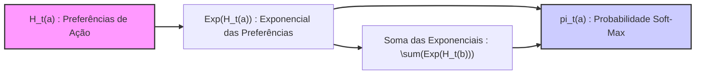
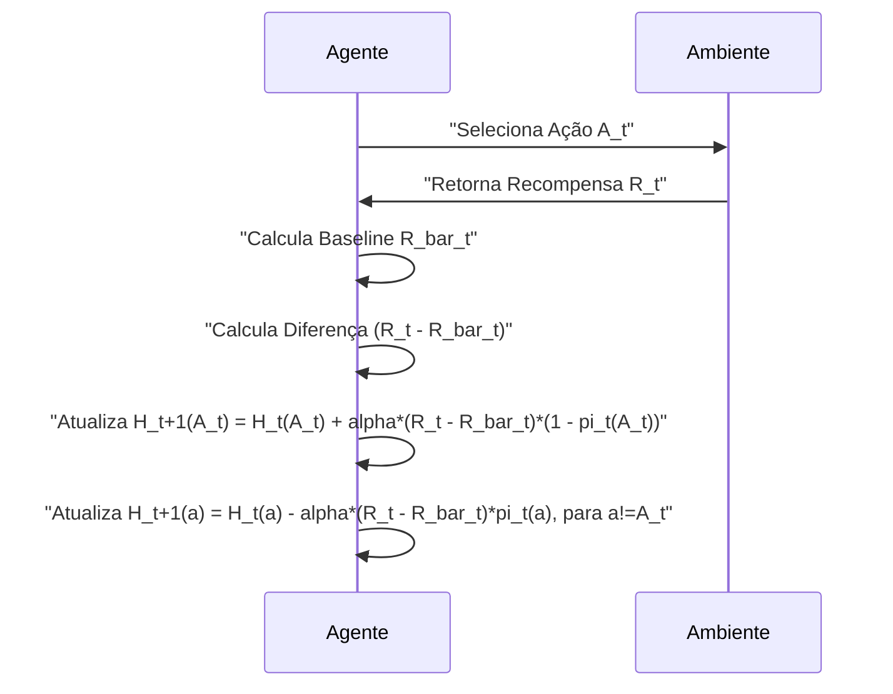
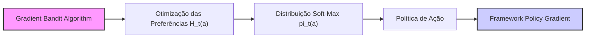
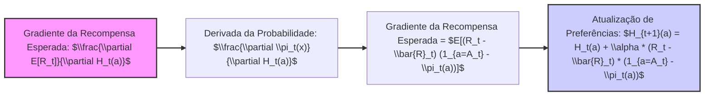
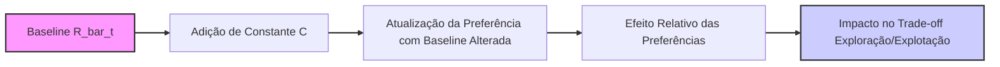

## Gradient Bandit Algorithms: Preferências Relativas e Aprendizado por Gradiente

### Introdução
No campo do aprendizado por reforço, os métodos para estimar **valores de ação** e usá-los para selecionar ações são abordagens comuns, mas não as únicas [^1]. Uma alternativa é aprender uma **preferência numérica** para cada ação, denotada por $H_t(a)$, onde $a$ representa uma ação e $t$ o passo de tempo [^1]. Uma característica crucial desses métodos é que as **preferências de ação** $H_t(a)$ não possuem uma interpretação direta em termos de recompensa; em vez disso, apenas a preferência relativa de uma ação em relação a outra é significativa [^1]. O foco não é em quanto uma ação é "boa" em termos absolutos, mas sim em como ela se compara a outras ações possíveis [^1]. Isso leva a uma abordagem distinta para a seleção de ações, baseada em uma **distribuição soft-max**, onde a probabilidade de escolher uma ação é proporcional à sua preferência exponencial [^1].

### Conceitos Fundamentais

#### Preferências Relativas de Ação
Diferentemente dos métodos baseados em valores de ação, os algoritmos **Gradient Bandit** aprendem as **preferências de ação** $H_t(a)$, que são valores numéricos que indicam a conveniência relativa de cada ação [^1]. Quanto maior a preferência, mais frequentemente uma ação é escolhida [^1]. No entanto, é fundamental ressaltar que a magnitude de $H_t(a)$ não corresponde a uma recompensa esperada ou a qualquer métrica de valor absoluto [^1]. O que importa é a diferença entre as preferências de diferentes ações [^1]. Por exemplo, se adicionarmos 1000 a todas as preferências, as probabilidades de ação não serão afetadas [^1]. Isso ocorre porque a seleção da ação é baseada na comparação relativa dessas preferências, o que é formalizado pela distribuição soft-max [^1].

> 💡 **Exemplo Numérico:** Imagine que temos 3 ações, A, B e C, com preferências iniciais $H_t(A) = 1$, $H_t(B) = 2$ e $H_t(C) = 0$. Se adicionarmos 1000 a todas as preferências, teremos $H_t(A) = 1001$, $H_t(B) = 1002$ e $H_t(C) = 1000$. A probabilidade de seleção de cada ação, calculada pela distribuição soft-max, permanece a mesma em ambos os casos, mostrando a importância da preferência relativa em vez do valor absoluto.

#### Distribuição Soft-Max
A probabilidade de selecionar uma ação $a$ no tempo $t$, denotada por $\pi_t(a)$, é determinada usando uma distribuição **soft-max** (também conhecida como distribuição Gibbs ou Boltzmann) [^1]:
$$
\pi_t(a) = \frac{e^{H_t(a)}}{\sum_{b=1}^{k} e^{H_t(b)}}
$$
onde $k$ é o número total de ações possíveis [^1]. Esta equação transforma as preferências de ação $H_t(a)$ em probabilidades, garantindo que a probabilidade de selecionar uma ação seja proporcional à sua preferência, mas que todas as probabilidades somem 1 [^1]. No início, as preferências de ação são inicializadas de forma que todas as ações tenham a mesma probabilidade de serem selecionadas, por exemplo, $H_1(a) = 0$ para todas as ações [^1].

> 💡 **Exemplo Numérico:** Considere novamente as 3 ações (A, B, C) com preferências $H_t(A) = 1$, $H_t(B) = 2$ e $H_t(C) = 0$. Usando a distribuição soft-max:
>
> $\pi_t(A) = \frac{e^1}{e^1 + e^2 + e^0} \approx \frac{2.718}{2.718 + 7.389 + 1} \approx \frac{2.718}{11.107} \approx 0.245$
>
> $\pi_t(B) = \frac{e^2}{e^1 + e^2 + e^0} \approx \frac{7.389}{11.107} \approx 0.665$
>
> $\pi_t(C) = \frac{e^0}{e^1 + e^2 + e^0} \approx \frac{1}{11.107} \approx 0.090$
>
> Observe que a ação B, com a maior preferência, tem a maior probabilidade de ser selecionada. As probabilidades somam aproximadamente 1.

#### Aprendizado por Gradiente Estocástico
O algoritmo de aprendizagem para as preferências de ação é baseado na ideia de **ascensão do gradiente estocástico** [^1]. Em cada passo, após selecionar uma ação $A_t$ e receber a recompensa $R_t$, as preferências de ação são atualizadas usando a seguinte regra:
$$
H_{t+1}(A_t) = H_t(A_t) + \alpha (R_t - \bar{R}_t) (1 - \pi_t(A_t)),
$$
e, para todas as outras ações $a \neq A_t$:
$$
H_{t+1}(a) = H_t(a) - \alpha (R_t - \bar{R}_t) \pi_t(a),
$$
onde $\alpha > 0$ é um parâmetro de tamanho do passo (step-size), e $\bar{R}_t$ é a recompensa média até o tempo $t$ (que serve como linha de base, *baseline*) [^1]. A *baseline*  $\bar{R}_t$ é crucial para o desempenho do algoritmo [^1]. Se a recompensa $R_t$ for maior que a *baseline*, a probabilidade de escolher a ação $A_t$ no futuro aumenta, enquanto se a recompensa for menor que a *baseline*, a probabilidade diminui [^1]. As ações não selecionadas se movem na direção oposta [^1]. A atualização das preferências garante que as ações que levaram a recompensas acima da média (relativa ao *baseline*) serão mais propensas a serem selecionadas, e aquelas que levaram a recompensas abaixo da média serão menos propensas a serem selecionadas no futuro. A forma como essa *baseline* é calculada pode ser incrementalmente com um parâmetro step-size $\alpha$ como descrito na seção 2.4 e 2.5 [^1].

> 💡 **Exemplo Numérico:** Vamos considerar um cenário onde temos duas ações (A e B) e a cada passo selecionamos uma ação, recebemos uma recompensa e atualizamos as preferencias:
>
> **Passo 1:**
> *   Inicializamos: $H_1(A) = 0$, $H_1(B) = 0$, $\alpha=0.1$, $\bar{R}_1 = 0$
> *   Selecionamos a ação A.
> *   Recebemos uma recompensa $R_1 = 1$
> *   Calculamos $\pi_1(A)$ e $\pi_1(B)$ usando a distribuição soft-max: $\pi_1(A) = \frac{e^0}{e^0 + e^0} = 0.5$ e $\pi_1(B) = 0.5$
> *   Atualizamos as preferências:
>     $H_2(A) = 0 + 0.1 * (1 - 0) * (1 - 0.5) = 0.05$
>     $H_2(B) = 0 - 0.1 * (1-0) * 0.5 = -0.05$
> *  Atualizamos a baseline $\bar{R}_2 = \frac{0+1}{2}=0.5$
>
> **Passo 2:**
> *   Selecionamos a ação B.
> *   Recebemos uma recompensa $R_2 = 0$.
> *   Calculamos  $\pi_2(A) = \frac{e^{0.05}}{e^{0.05} + e^{-0.05}} \approx 0.512$ e $\pi_2(B) = 1 - \pi_2(A) \approx 0.488$
> *   Atualizamos as preferências:
>      $H_3(A) = 0.05 - 0.1 * (0-0.5) * 0.512 = 0.0756$
>      $H_3(B) = -0.05 + 0.1 * (0 - 0.5) * (1-0.488) \approx -0.0756$
> *  Atualizamos a baseline $\bar{R}_3 = \frac{0+1+0}{3}=\frac{1}{3}\approx 0.33$
>
>   Note como as preferências se ajustam de acordo com as recompensas e como a baseline influencia a magnitude do ajuste.

**Proposição 1**
O algoritmo Gradient Bandit pode ser visto como uma instância de *policy gradient*, onde a política é dada pela distribuição soft-max.

**Proof**
O algoritmo atualiza as preferências de ação $H_t(a)$ de forma a aumentar a probabilidade de ações que levaram a recompensas acima da média e diminuir a probabilidade de ações que levaram a recompensas abaixo da média. Essa atualização é feita na direção do gradiente da recompensa esperada, como demonstrado no Lema 1. Em métodos *policy gradient*, o objetivo é otimizar diretamente a política, e não os valores de ação. O Gradient Bandit atinge isso otimizando as preferências, que, por sua vez, definem a política através da distribuição soft-max. Portanto, o algoritmo se encaixa no *framework* de *policy gradient* $\blacksquare$

#### Lemma 1
O uso da distribuição soft-max como mostrado na equação:
$$
\pi_t(a) = \frac{e^{H_t(a)}}{\sum_{b=1}^{k} e^{H_t(b)}}
$$
e a atualização das preferências de ação em direção ao gradiente da recompensa esperada, faz com que o algoritmo possa ser considerado como um **ascensão de gradiente estocástico**.

##### *Proof*
A atualização das preferências de ação em direção ao gradiente da recompensa esperada pode ser expressa por:
$$
H_{t+1}(a) = H_t(a) + \alpha\frac{\partial E[R_t]}{\partial H_t(a)}
$$
onde a recompensa esperada é dada por:
$$
E[R_t] = \sum_x \pi_t(x) q_*(x)
$$
e o gradiente da recompensa esperada com respeito a uma preferência de ação é:
$$
\frac{\partial E[R_t]}{\partial H_t(a)} =  \sum_x q_*(x) \frac{\partial \pi_t(x)}{\partial H_t(a)}
$$
Usando o conceito de baseline como descrito em [^1] e multiplicando por $\frac{\pi_t(x)}{\pi_t(x)}$ :
$$
\frac{\partial E[R_t]}{\partial H_t(a)} =  \sum_x  \frac{\pi_t(x)}{\pi_t(x)} (q_*(x) - B_t)  \frac{\partial \pi_t(x)}{\partial H_t(a)}
$$
Isso resulta em:
$$
=  E\left[(R_t - \bar{R}_t) \frac{\partial \pi_t(A_t)}{\partial H_t(a)}  \frac{1}{\pi_t(A_t)} \right]
$$
Aplicando a regra do quociente e manipulando as derivadas, conforme feito em [^1] chega-se ao seguinte resultado:
$$
\frac{\partial \pi_t(x)}{\partial H_t(a)} = \pi_t(x) (\mathbb{1}_{a=x} - \pi_t(a))
$$
Onde  $\mathbb{1}_{a=x}$ é 1 quando a=x, e zero quando $a \ne x$. Inserindo esse resultado na equação anterior temos:

$$
= E\left[(R_t - \bar{R}_t) ( \mathbb{1}_{a=A_t} - \pi_t(a) ) \right]
$$

Substituindo o resultado no algoritmo de ascensão do gradiente:

$$
H_{t+1}(a) = H_t(a) + \alpha (R_t - \bar{R}_t) (\mathbb{1}_{a=A_t} - \pi_t(a))
$$
Que é equivalente a (2.12), provando assim que o método é uma instancia de ascensão do gradiente estocástico [^1]. $\blacksquare$

**Lema 1.1**
A equivalência demonstrada no Lemma 1, entre a atualização do algoritmo Gradient Bandit e a ascensão de gradiente estocástico, implica que o algoritmo converge para um ótimo local, sob certas condições sobre o tamanho do passo $\alpha$ e a suavidade da função de recompensa esperada.

**Proof**
Este resultado decorre diretamente da teoria de otimização por gradiente estocástico. Quando a função objetivo (neste caso, a recompensa esperada) é suave e o tamanho do passo é apropriadamente ajustado (por exemplo, decrescente ao longo do tempo), o algoritmo de ascensão de gradiente estocástico converge para um ótimo local. Como demonstrado no Lemma 1, a atualização das preferências de ação do Gradient Bandit é uma instância de ascensão de gradiente estocástico, logo, as garantias de convergência do gradiente estocástico se aplicam ao Gradient Bandit.  $\blacksquare$

#### Corolário 1
A escolha da *baseline* é um ponto crucial no algoritmo, e a escolha da média de todas as recompensas até aquele ponto é uma boa escolha porque não afeta a performance do algoritmo, mas diminui a variância da atualização, e, portanto, melhora a taxa de convergência.

**Corolário 1.1**
A escolha de uma *baseline* diferente de zero, mesmo que constante, não afeta o resultado final do algoritmo, pois as preferências de ação $H_t(a)$ são relativas. No entanto, uma *baseline* constante pode levar a um comportamento de exploração/explotação diferente durante a fase de aprendizado inicial.

**Proof**
Se adicionarmos um valor constante $C$ à *baseline*, a atualização das preferências se torna:
$H_{t+1}(A_t) = H_t(A_t) + \alpha (R_t - (\bar{R}_t + C)) (1 - \pi_t(A_t))$ e
$H_{t+1}(a) = H_t(a) - \alpha (R_t - (\bar{R}_t + C)) \pi_t(a)$. Isso é equivalente a $H_{t+1}(A_t) = H_t(A_t) + \alpha (R_t - \bar{R}_t)(1 - \pi_t(A_t)) - \alpha C (1 - \pi_t(A_t))$ e  $H_{t+1}(a) = H_t(a) - \alpha (R_t - \bar{R}_t)\pi_t(a) + \alpha C \pi_t(a)$. Observe que o termo  $-\alpha C (1 - \pi_t(A_t))$ e $\alpha C \pi_t(a)$ somam zero quando computamos a variação total da preferência. Ou seja, o efeito de uma baseline constante é somente adicionar um termo constante em cada iteração. Como as preferências de ação são relativas, essa constante não afeta o resultado final. Contudo, durante a fase inicial de aprendizado, uma *baseline* constante pode aumentar ou diminuir o quão rápido as preferências de ação mudam, o que pode afetar o trade-off entre exploração e explotação. $\blacksquare$

### Conclusão
Em resumo, os algoritmos **Gradient Bandit** são uma abordagem alternativa para a seleção de ações no aprendizado por reforço, onde o foco é nas preferências relativas de ação, ao invés de valores de ação. A combinação da distribuição soft-max com o aprendizado por gradiente estocástico permite que esses algoritmos explorem e encontrem as ações que levam a melhores resultados, adaptando as preferências relativas ao longo do tempo com base nas recompensas obtidas. A formulação desse algoritmo usando o framework de ascensão de gradiente estocástico garante robustez e boas propriedades de convergência.

### Referências
[^1]: "The most important feature distinguishing reinforcement learning from other types of learning is that it uses training information that evaluates the actions taken rather than instructs by giving correct actions. ... In this section we consider learning a numerical preference for each action a, which we denote Hł(a) ∈ R. The larger the preference, the more often that action is taken, but the preference has no interpretation in terms of reward. Only the relative preference of one action over another is important; if we add 1000 to all the action preferences there is no effect on the action probabilities, which are determined according to a soft-max distribution (i.e., Gibbs or Boltzmann distribution) as follows: ... There is a natural learning algorithm for soft-max action preferences based on the idea of stochastic gradient ascent. On each step, after selecting action At and receiving the reward Rt, the action preferences are updated by:
Ht+1(At) = Ht(At) + a(Rt – Rt) (1 – πτ(At)),
Ht+1(a) = H+(a) – α(Rt – Rt)πι(α),
for all a ≠ At," *(Trecho de Multi-armed Bandits)*
