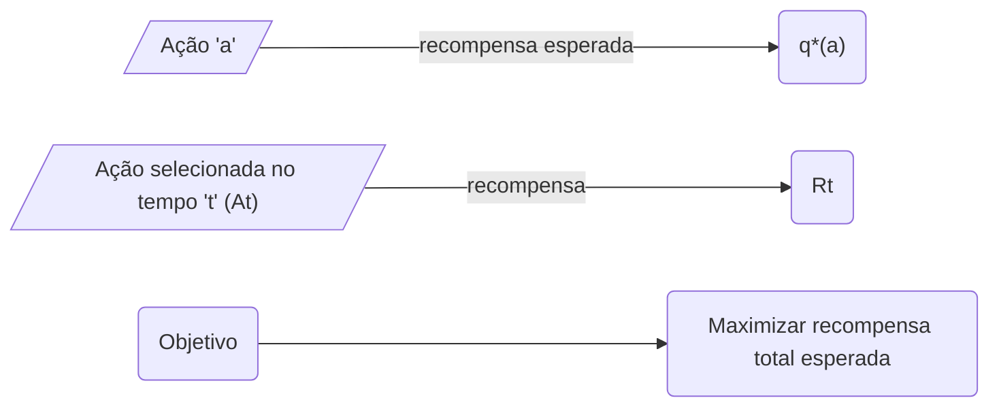
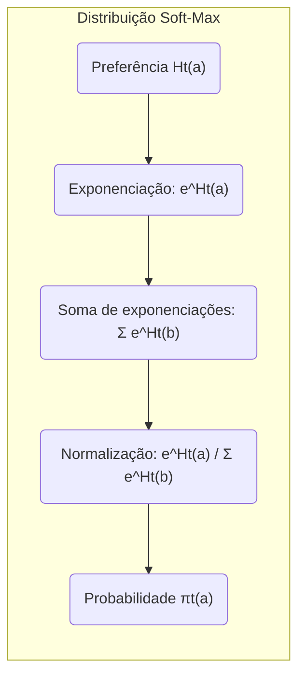
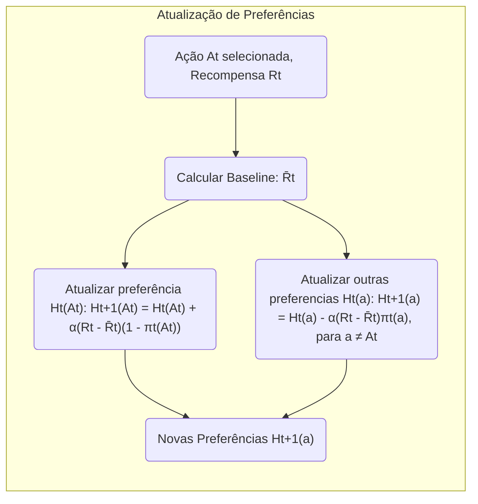

## Gradient Bandit Algorithms e Distribuição Soft-Max

### Introdução

O aprendizado por reforço se distingue de outras formas de aprendizado por usar informações de treinamento que avaliam as ações tomadas, em vez de instruir através de ações corretas [^1]. Isso introduz a necessidade de **exploração ativa** para encontrar bons comportamentos, onde a *purely evaluative feedback* indica a qualidade de uma ação tomada sem necessariamente indicar a melhor ação possível [^1]. Em contraste, o feedback instrutivo indica a ação correta a ser tomada, independentemente da ação tomada, característica do aprendizado supervisionado [^1]. Este capítulo explora o aspecto avaliativo do aprendizado por reforço em um ambiente simplificado, utilizando o **problema do *k*-armed bandit** como um ponto de partida [^1]. O problema do *k*-armed bandit consiste em escolher repetidamente entre *k* opções, cada uma fornecendo uma recompensa numérica de uma distribuição de probabilidade estacionária dependente da ação escolhida [^1].

### Conceitos Fundamentais

No problema do *k*-armed bandit, cada ação tem um valor esperado ou recompensa média, dado que essa ação é selecionada [^2]. Esse valor é denotado por **q*(a)** [^2], onde *a* representa a ação. A ação selecionada no tempo *t* é denotada por **At**, e a recompensa correspondente por **Rt** [^2]. O objetivo é maximizar a recompensa total esperada ao longo de um período de tempo [^2].

Uma das estratégias de solução para o *k*-armed bandit é o uso de **métodos *action-value*** [^3], onde a estimativa do valor de uma ação *a* no tempo *t*, denotada por **Qt(a)**, busca se aproximar de q*(a) [^2]. Métodos de *action-value* comuns incluem o método *sample-average*, que calcula a média das recompensas obtidas para cada ação [^3].

No entanto, há uma distinção fundamental entre **exploração e *exploitation*** [^2]. *Exploitation* significa selecionar as ações com os maiores valores estimados, que são as ações *greedy* [^2]. Por outro lado, explorar significa selecionar ações não-*greedy* para melhorar a estimativa de seus valores, com o intuito de encontrar ações melhores a longo prazo [^2]. O equilíbrio entre exploração e *exploitation* é crucial para resolver o *k*-armed bandit de forma eficaz [^2].

Nesta seção, o foco será sobre os **gradient bandit algorithms**, que não estimam valores de ação diretamente, mas aprendem uma **preferência numérica para cada ação**, denotada por **Ht(a)** [^13]. A preferência é usada para determinar a probabilidade de selecionar uma ação usando uma **distribuição *soft-max***, também conhecida como distribuição Gibbs ou Boltzmann [^13]:

$$ P\{A_t = a\} = \frac{e^{H_t(a)}}{\sum_{b=1}^{k} e^{H_t(b)}} = \pi_t(a) $$ [^13]

onde $\pi_t(a)$ representa a probabilidade de selecionar a ação *a* no tempo *t*, e as preferências de todas as ações são exponenciadas e normalizadas para gerar uma distribuição de probabilidade [^13]. Inicialmente, todas as preferências são iguais, resultando em probabilidades iguais para todas as ações [^13].

> 💡 **Exemplo Numérico:**
>
> Imagine um problema de *3-armed bandit* (k=3) onde temos três ações (a=1, a=2, a=3). Inicialmente, as preferências $H_t(a)$ para todas as ações são zero, ou seja, $H_1(1) = H_1(2) = H_1(3) = 0$.
>
> Calculando as probabilidades iniciais usando a distribuição soft-max:
>
> $$ \pi_1(1) = \frac{e^{0}}{e^{0} + e^{0} + e^{0}} = \frac{1}{3} $$
> $$ \pi_1(2) = \frac{e^{0}}{e^{0} + e^{0} + e^{0}} = \frac{1}{3} $$
> $$ \pi_1(3) = \frac{e^{0}}{e^{0} + e^{0} + e^{0}} = \frac{1}{3} $$
>
> Inicialmente, cada ação tem a mesma probabilidade de ser escolhida.

### Derivação da Distribuição Soft-Max

A distribuição *soft-max* é usada para transformar preferências em probabilidades, sendo que a preferência de uma ação sobre outra é relativa. A adição de uma constante a todas as preferências não muda as probabilidades de ação [^13]. A distribuição *soft-max* é dada por:

$$ \pi_t(a) = \frac{e^{H_t(a)}}{\sum_{b=1}^{k} e^{H_t(b)}} $$ [^13]

Este tipo de função é também conhecida como **função logística**, ou **sigmoide**, quando aplicada a dois casos [^13].

#### Lemma 1: Relação com a Função Sigmoide (Caso de Duas Ações)
*Declaração:* No caso de duas ações, a distribuição *soft-max* é equivalente à função logística.

*Prova:*
Seja *k* = 2. A probabilidade de selecionar a ação 1 é:

$$ \pi_t(1) = \frac{e^{H_t(1)}}{e^{H_t(1)} + e^{H_t(2)}} $$

Dividindo o numerador e o denominador por $e^{H_t(1)}$:

$$ \pi_t(1) = \frac{1}{1 + e^{H_t(2) - H_t(1)}} $$

Se definirmos $z = H_t(1) - H_t(2)$, temos:

$$ \pi_t(1) = \frac{1}{1 + e^{-z}} $$

Esta é a forma da função sigmoide, onde $z$ representa a diferença entre as preferências das ações.

$\blacksquare$

**Lema 1.1:** *Invariância da Distribuição Soft-Max sob Adição de Constantes*
*Declaração:* A adição de uma constante *c* a todas as preferências $H_t(a)$ não altera as probabilidades de ação $\pi_t(a)$ geradas pela distribuição *soft-max*.

*Prova:*
Seja $H'_t(a) = H_t(a) + c$ para todas as ações *a*. A nova probabilidade de selecionar a ação *a* é:
$$
\pi'_t(a) = \frac{e^{H'_t(a)}}{\sum_{b=1}^k e^{H'_t(b)}} = \frac{e^{H_t(a) + c}}{\sum_{b=1}^k e^{H_t(b) + c}} = \frac{e^{H_t(a)}e^c}{\sum_{b=1}^k e^{H_t(b)}e^c}
$$
Fatorando $e^c$ do numerador e denominador, temos:
$$
\pi'_t(a) = \frac{e^c e^{H_t(a)}}{e^c \sum_{b=1}^k e^{H_t(b)}} = \frac{e^{H_t(a)}}{\sum_{b=1}^k e^{H_t(b)}} = \pi_t(a)
$$
Portanto, as probabilidades de ação permanecem as mesmas, demonstrando a invariância da distribuição *soft-max* sob adição de constantes às preferências.

$\blacksquare$
> 💡 **Exemplo Numérico (Lema 1.1):**
>
> Continuando o exemplo anterior de *3-armed bandit*, suponha que após algumas iterações, as preferências sejam: $H_t(1) = 1$, $H_t(2) = 0.5$, $H_t(3) = -0.5$.
>
>  As probabilidades são:
>
> $$ \pi_t(1) = \frac{e^{1}}{e^{1} + e^{0.5} + e^{-0.5}} \approx \frac{2.718}{2.718+1.649+0.607} \approx 0.52 $$
> $$ \pi_t(2) = \frac{e^{0.5}}{e^{1} + e^{0.5} + e^{-0.5}} \approx \frac{1.649}{2.718+1.649+0.607} \approx 0.32 $$
> $$ \pi_t(3) = \frac{e^{-0.5}}{e^{1} + e^{0.5} + e^{-0.5}} \approx \frac{0.607}{2.718+1.649+0.607} \approx 0.12 $$
>
> Agora, adicionemos uma constante, digamos *c = 2*, a todas as preferências: $H'_t(1) = 3$, $H'_t(2) = 2.5$, $H'_t(3) = 1.5$. As novas probabilidades são:
>
> $$ \pi'_t(1) = \frac{e^{3}}{e^{3} + e^{2.5} + e^{1.5}} \approx \frac{20.086}{20.086+12.182+4.482} \approx 0.52 $$
> $$ \pi'_t(2) = \frac{e^{2.5}}{e^{3} + e^{2.5} + e^{1.5}} \approx \frac{12.182}{20.086+12.182+4.482} \approx 0.32 $$
> $$ \pi'_t(3) = \frac{e^{1.5}}{e^{3} + e^{2.5} + e^{1.5}} \approx \frac{4.482}{20.086+12.182+4.482} \approx 0.12 $$
>
> As probabilidades permanecem as mesmas, demonstrando que a adição de uma constante não afeta a probabilidade de seleção da ação.

### Atualização das Preferências

Os gradientes são a base para a atualização das preferências [^13]. O algoritmo de aprendizado atualiza as preferências através do método **stochastic gradient ascent** [^14]. Após selecionar a ação At e receber a recompensa Rt, as preferências de ação são atualizadas como [^13]:

$$ H_{t+1}(A_t) = H_t(A_t) + \alpha(R_t - \overline{R}_t)(1 - \pi_t(A_t)) $$ [^13]

$$ H_{t+1}(a) = H_t(a) - \alpha(R_t - \overline{R}_t)\pi_t(a), \quad \text{para todo } a \neq A_t $$ [^13]

onde $\alpha$ é o tamanho do passo (step-size), $\overline{R}_t$ é uma recompensa média até o tempo *t*, servindo como *baseline* [^13]. Se a recompensa *R* é maior que a *baseline*, a probabilidade de tomar aquela ação aumenta. Se for menor, diminui. A derivação da equação de atualização das preferências usando stochastic gradient ascent é feita a partir da análise do gradiente da performance esperada, como mostrado nas equações (2.13) a (2.15) do contexto [^14, 15].

> 💡 **Exemplo Numérico:**
>
> Suponha que estamos no tempo *t*, a ação selecionada foi $A_t = 1$, e recebemos uma recompensa de $R_t = 1$. A recompensa média até o momento é $\overline{R}_t = 0.5$. O tamanho do passo é $\alpha = 0.1$. Usando as preferências do exemplo anterior: $H_t(1) = 1$, $H_t(2) = 0.5$, $H_t(3) = -0.5$, e as probabilidades calculadas $\pi_t(1) \approx 0.52$, $\pi_t(2) \approx 0.32$, $\pi_t(3) \approx 0.12$.
>
> Atualizando as preferências:
>
> $$ H_{t+1}(1) = H_t(1) + \alpha(R_t - \overline{R}_t)(1 - \pi_t(1)) $$
> $$ H_{t+1}(1) = 1 + 0.1(1 - 0.5)(1 - 0.52) = 1 + 0.1 * 0.5 * 0.48 = 1 + 0.024 = 1.024 $$
>
> Para as outras ações:
>
> $$ H_{t+1}(2) = H_t(2) - \alpha(R_t - \overline{R}_t)\pi_t(2) $$
> $$ H_{t+1}(2) = 0.5 - 0.1(1 - 0.5)(0.32) = 0.5 - 0.1 * 0.5 * 0.32 = 0.5 - 0.016 = 0.484 $$
>
> $$ H_{t+1}(3) = H_t(3) - \alpha(R_t - \overline{R}_t)\pi_t(3) $$
> $$ H_{t+1}(3) = -0.5 - 0.1(1 - 0.5)(0.12) = -0.5 - 0.1 * 0.5 * 0.12 = -0.5 - 0.006 = -0.506 $$
>
> Observe que a preferência da ação 1, que foi selecionada e teve uma recompensa acima da média, aumentou. As outras preferências diminuíram.
>
> As novas probabilidades podem ser calculadas usando a nova preferência.
>
> Calculando as probabilidades para o tempo t+1 usando as novas preferencias $H_{t+1}(1) = 1.024$, $H_{t+1}(2) = 0.484$, $H_{t+1}(3) = -0.506$:
>
> $$ \pi_{t+1}(1) = \frac{e^{1.024}}{e^{1.024} + e^{0.484} + e^{-0.506}} \approx \frac{2.784}{2.784+1.623+0.603} \approx 0.528 $$
> $$ \pi_{t+1}(2) = \frac{e^{0.484}}{e^{1.024} + e^{0.484} + e^{-0.506}} \approx \frac{1.623}{2.784+1.623+0.603} \approx 0.309 $$
> $$ \pi_{t+1}(3) = \frac{e^{-0.506}}{e^{1.024} + e^{0.484} + e^{-0.506}} \approx \frac{0.603}{2.784+1.623+0.603} \approx 0.115 $$
> A probabilidade da ação 1 aumentou, enquanto as outras diminuíram.
>

#### Lemma 2: Relação com Stochastic Gradient Ascent

*Declaração:* A atualização das preferências no gradient bandit algorithm pode ser derivada como uma aproximação estocástica do gradiente da performance esperada.

*Prova:*
O objetivo é maximizar a recompensa esperada $E[R_t]$, que é dada por:

$$ E[R_t] = \sum_{x} \pi_t(x)q_*(x) $$ [^14]

A atualização das preferências no gradient bandit algorithm é baseada no conceito de stochastic gradient ascent, onde a preferência de ação é incrementada proporcionalmente ao efeito desse incremento na performance [^14]:

$$H_{t+1}(a) = H_t(a) + \alpha \frac{\partial E[R_t]}{\partial H_t(a)}$$ [^14]

Ao derivar $\frac{\partial E[R_t]}{\partial H_t(a)}$ [^14, 15], utilizando a regra do quociente, obtemos:

$$ \frac{\partial E[R_t]}{\partial H_t(a)} = \sum_{x}(q_*(x) - \overline{R}_t) \frac{\partial \pi_t(x)}{\partial H_t(a)} $$

onde o *baseline* $\overline{R}_t$ não interfere no gradiente [^15]. Ao usar a distribuição *soft-max* para  $\pi_t(x)$, o gradiente resulta em:
$$ \frac{\partial \pi_t(x)}{\partial H_t(a)} = \pi_t(x)(\mathbb{1}_{a=x} - \pi_t(a))$$ [^16]

Substituindo, obtemos a forma de atualização das preferências para o gradient bandit algorithm, onde cada atualização das preferências é proporcional a uma amostra do gradiente esperado:

$$ H_{t+1}(a) = H_t(a) + \alpha (R_t - \overline{R}_t)(\mathbb{1}_{a=A_t} - \pi_t(a)) $$
$\blacksquare$

**Lema 2.1**: *Atualização Equivalente para Todas as Ações*
*Declaração:* A atualização das preferências pode ser expressa de forma equivalente para todas as ações, usando o indicador $\mathbb{1}_{a=A_t}$.

*Prova:*
A atualização das preferências é dada por:
$$
H_{t+1}(a) = H_t(a) + \alpha(R_t - \overline{R}_t)(\mathbb{1}_{a=A_t} - \pi_t(a))
$$
Analisando o caso em que $a = A_t$:
$$
H_{t+1}(A_t) = H_t(A_t) + \alpha(R_t - \overline{R}_t)(1 - \pi_t(A_t))
$$
E quando $a \neq A_t$:
$$
H_{t+1}(a) = H_t(a) - \alpha(R_t - \overline{R}_t)\pi_t(a)
$$
Observe que a equação geral inclui ambos os casos. Quando $a = A_t$, $\mathbb{1}_{a=A_t} = 1$, e a equação coincide com a primeira atualização. Quando $a \neq A_t$, $\mathbb{1}_{a=A_t} = 0$, e a equação se torna igual a segunda atualização. Portanto, a equação geral pode ser usada para atualizar as preferências de todas as ações.

$\blacksquare$
> 💡 **Exemplo Numérico (Lema 2.1):**
>
> Usando o mesmo cenário do exemplo anterior, onde $A_t = 1$, $R_t = 1$, $\overline{R}_t = 0.5$, $\alpha = 0.1$ e preferências $H_t(1) = 1$, $H_t(2) = 0.5$, $H_t(3) = -0.5$, com as probabilidades $\pi_t(1) \approx 0.52$, $\pi_t(2) \approx 0.32$, $\pi_t(3) \approx 0.12$.
>
> Usando a equação equivalente:
>
> $$ H_{t+1}(a) = H_t(a) + \alpha(R_t - \overline{R}_t)(\mathbb{1}_{a=A_t} - \pi_t(a)) $$
>
> Para $a=1$:
>
> $$ H_{t+1}(1) = 1 + 0.1(1-0.5)(1-0.52) = 1 + 0.1 * 0.5 * 0.48 = 1.024 $$
>
> Para $a=2$:
>
> $$ H_{t+1}(2) = 0.5 + 0.1(1-0.5)(0 - 0.32) = 0.5 - 0.1 * 0.5 * 0.32 = 0.484 $$
>
> Para $a=3$:
>
> $$ H_{t+1}(3) = -0.5 + 0.1(1-0.5)(0-0.12) = -0.5 - 0.1 * 0.5 * 0.12 = -0.506 $$
>
> Os resultados são idênticos ao exemplo anterior, mostrando que a equação equivalente leva às mesmas atualizações de preferência.

**Proposição 1:** *Relação com a Regra de Aprendizado de Widrow-Hoff*
*Declaração:* A atualização das preferências do gradient bandit algorithm, quando expandida, possui uma semelhança com a regra de aprendizado de Widrow-Hoff, também conhecida como regra delta.
*Prova:*
Reescrevendo a equação de atualização para uma ação arbitrária *a*:
$$H_{t+1}(a) = H_t(a) + \alpha(R_t - \overline{R}_t)(\mathbb{1}_{a=A_t} - \pi_t(a))$$
Expandindo a expressão, obtemos:
$$H_{t+1}(a) = H_t(a) + \alpha(R_t - \overline{R}_t)\mathbb{1}_{a=A_t} - \alpha(R_t - \overline{R}_t)\pi_t(a)$$
A expressão acima pode ser interpretada como:
- $H_t(a)$: O valor atual da preferência.
- $\alpha(R_t - \overline{R}_t)\mathbb{1}_{a=A_t}$: A atualização na preferência quando a ação *a* foi selecionada. A atualização é proporcional à diferença entre a recompensa e o *baseline*.
- $\alpha(R_t - \overline{R}_t)\pi_t(a)$: Um ajuste de probabilidade, que reduz a preferência das ações que não foram selecionadas, e que reduz a preferência da ação selecionada proporcionalmente a sua probabilidade.

Esta estrutura se assemelha à regra de Widrow-Hoff (ou regra delta), que ajusta os pesos em uma rede neural com base no erro (diferença entre a saída desejada e a saída real) e na entrada. A similaridade reside no ajuste proporcional ao erro (recompensa menos *baseline*) e na consideração do valor atual da preferência/peso. No gradient bandit algorithm, a "entrada" é representada pelo indicador e pelas probabilidades $\pi_t(a)$, enquanto na regra de Widrow-Hoff, a entrada é o valor fornecido à rede neural.

$\blacksquare$

### Conclusão

Os **gradient bandit algorithms** representam uma abordagem distinta em comparação com os **action-value methods** para a solução de problemas do tipo *k*-armed bandit. Ao invés de estimar os valores de ações, esses algoritmos aprendem preferências de ação. Utilizando uma **distribuição soft-max** para determinar as probabilidades de ação, eles equilibram a exploração e a *exploitation*. A implementação da atualização de preferências através do método stochastic gradient ascent garante a convergência e adaptação ao ambiente do problema. A capacidade de adaptar as preferências de ações de forma contínua, junto com o uso de uma *baseline* para a comparação de recompensas, permite que estes algoritmos lidem com mudanças no ambiente e aprendam as melhores ações para maximizar o retorno a longo prazo.

### Referências
[^1]: "The most important feature distinguishing reinforcement learning from other types of learning is that it uses training information that evaluates the actions taken rather than instructs by giving correct actions."
[^2]: "In our k-armed bandit problem, each of the k actions has an expected or mean reward given that that action is selected; let us call this the value of that action. We denote the action selected on time step t as At, and the corresponding reward as Rt."
[^3]: "We begin by looking more closely at methods for estimating the values of actions and for using the estimates to make action selection decisions, which we collectively call action-value methods."
[^13]: "In this section we consider learning a numerical preference for each action a, which we denote Ht(a) \in R. The larger the preference, the more often that action is taken, but the preference has no interpretation in terms of reward. Only the relative preference of one action over another is important; if we add 1000 to all the action preferences there is no effect on the action probabilities, which are determined according to a soft-max distribution (i.e., Gibbs or Boltzmann distribution) as follows: Pr{At=a} = eHt(a) / \sumk b=1eHt(b) = \pi_t(a),..."
[^14]: "One can gain a deeper insight into the gradient bandit algorithm by understanding it as a stochastic approximation to gradient ascent. In exact gradient ascent, each action preference Ht(a) would be incremented in proportion to the increment's effect on performance: Ht+1(a) = Ht(a) + \alpha \partialE[Rt]/\partialHt(a), where the measure of performance here is the expected reward: E[Rt] = \sumx \pi_t(x)q_*(x), and the measure of the increment's effect is the partial derivative of this performance measure with respect to the action preference."
[^15]: "Next we multiply each term of the sum by \pi_t(x)/\pi_t(x): \partialE[Rt]/\partialHt(a) = \sumx \pi_t(x) (q_*(x) − Bt) \partial\pi_t(x)/\partialHt(a) /\pi_t(x). The equation is now in the form of an expectation, summing over all possible values x of the random variable At, then multiplying by the probability of taking those values."
[^16]: "Thus it remains only to show that \partial\pi_t(x)/\partialHt(a) = \pi_t(x)(1_{a=x} − \pi_t(a)), as we assumed. Recall the standard quotient rule for derivatives:  \partial/\partialx [f(x)/g(x)] = (\partialf(x)/\partialx g(x)−f(x) \partialg(x)/\partialx) /g(x)^2. Using this, we can write \partial\pi_t(x)/\partialHt(a) = \partial/\partialHt(a)  [ eHt(x) / \sumk y=1 eHt(y)]  ..."
